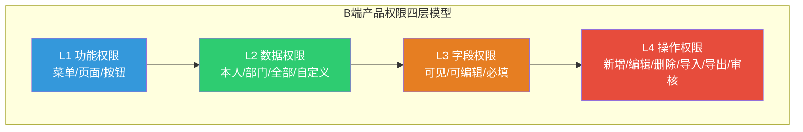
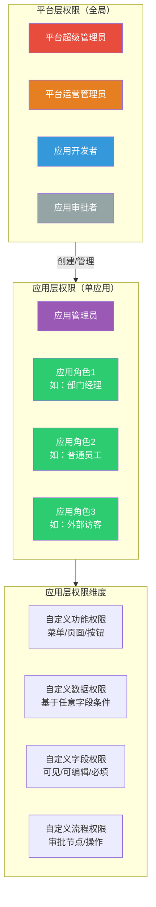
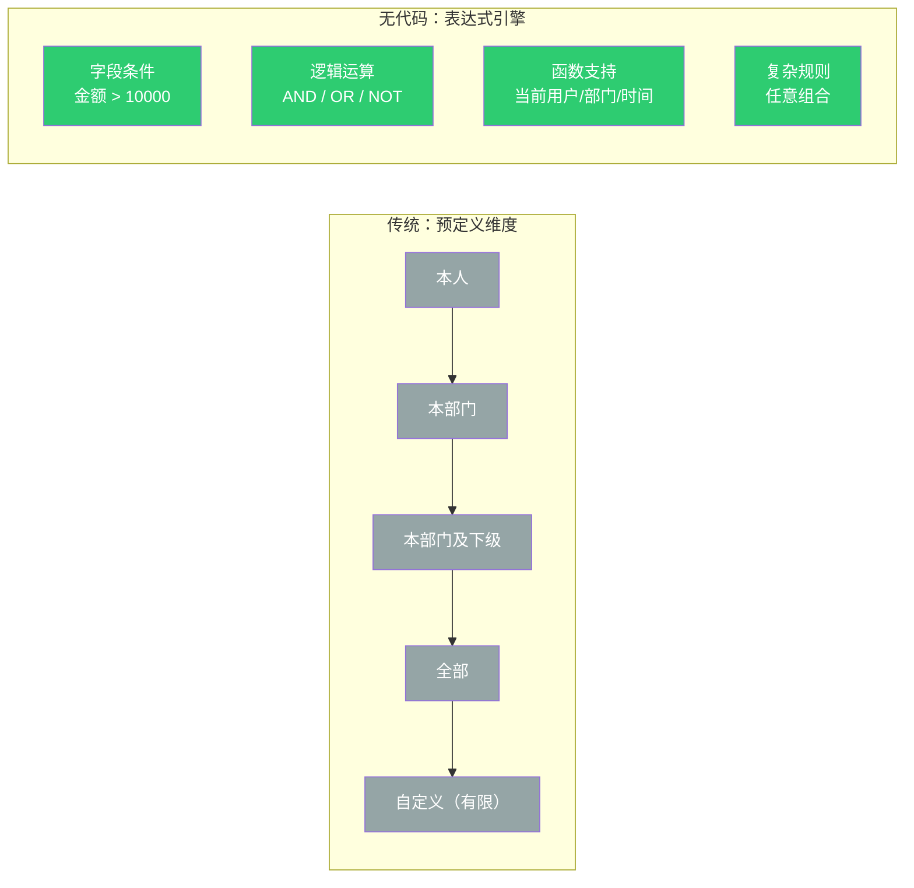
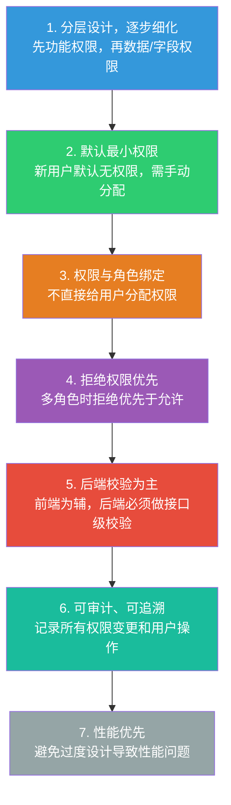

# 无代码平台与B端产品权限设计完整思路 & 核心问题解决方案

权限设计是B端产品的基石，更是无代码平台的核心竞争力之一。普通B端产品的权限是**静态、预定义**的，而无代码平台的权限是**动态、可自定义**的，复杂度呈指数级上升。以下从通用思路、无代码平台特殊设计、核心问题三个维度展开。

---

## 一、通用B端产品权限设计基础思路

所有B端产品的权限设计都遵循"**分层控制、最小权限、权责分离**"三大原则，核心是RBAC（基于角色的访问控制）模型及其扩展。

### 1. 经典权限模型演进

| 模型 | 适用场景 | 优点 | 缺点 |
|------|----------|------|------|
| **ACL（访问控制列表）** | 简单系统、少量用户 | 实现简单、直观 | 权限管理混乱，用户多了无法维护 |
| **RBAC（基于角色）** | 绝大多数B端产品 | 解耦用户与权限，便于批量管理 | 无法处理动态、细粒度的权限需求 |
| **ABAC（基于属性）** | 复杂企业级系统、动态场景 | 灵活，支持任意维度的权限控制 | 实现复杂，性能开销大 |
| **RBAC+ABAC混合** | 中大型B端产品、无代码平台 | 兼顾易用性与灵活性 | 设计难度高 |

### 2. 标准权限分层设计

B端产品的权限通常分为**四层**，从粗到细依次控制：



#### 第一层：功能权限
- **控制对象**：用户能看到哪些菜单、页面、按钮
- **实现方式**：菜单权限+按钮权限，通过角色关联
- **注意**：隐藏不等于禁用，后端必须做接口级校验

#### 第二层：数据权限
- **控制对象**：用户能看到哪些数据行
- **常见维度**：本人、本部门、本部门及下级、全部、自定义
- **实现方式**：在SQL查询时动态拼接数据过滤条件

#### 第三层：字段权限
- **控制对象**：用户能看到哪些数据列
- **实现方式**：后端返回数据时过滤敏感字段，前端根据权限渲染
- **适用场景**：财务数据、客户信息等敏感字段

#### 第四层：操作权限
- **控制对象**：用户能对数据执行哪些操作
- **常见操作**：新增、编辑、删除、导入、导出、审核
- **注意**：操作权限通常与数据权限结合使用

### 3. 组织架构与权限的关系

- 权限通常与组织架构绑定，支持"**部门继承**"和"**角色继承**"
- 支持"**一人多岗**"，即一个用户可以拥有多个角色，权限取并集
- 支持"**数据隔离**"，不同部门的用户默认只能看到本部门的数据

---

## 二、无代码平台权限设计特殊思路

无代码平台与传统B端产品最大的区别是：**平台本身不提供具体业务功能，而是提供构建业务功能的能力**。因此，无代码平台的权限设计必须是**元数据驱动、完全动态**的，不能写死任何业务逻辑。

### 1. 无代码平台的双层权限架构

无代码平台必须采用"**平台层+应用层**"双层权限架构，这是与传统B端产品最核心的区别：



#### （1）平台层权限（全局权限）

| 维度 | 说明 |
|------|------|
| **控制对象** | 平台管理员、应用开发者 |
| **权限范围** | 用户管理、组织架构管理、角色管理 |
| | 应用创建、删除、发布权限 |
| | 平台资源（组件、模板、插件）管理权限 |
| | 系统配置、日志审计权限 |
| **设计原则** | 粗粒度、集中管理，由平台超级管理员统一分配 |

#### （2）应用层权限（单应用权限）

| 维度 | 说明 |
|------|------|
| **控制对象** | 应用的最终使用者 |
| **权限范围** | 自定义角色：每个应用可独立创建角色，与平台角色隔离 |
| | 自定义功能权限：根据应用的菜单、页面、按钮动态生成 |
| | 自定义数据权限：支持基于任意字段的条件过滤 |
| | 自定义字段权限：控制每个表单字段的可见、可编辑、必填属性 |
| | 自定义流程权限：控制流程节点的审批权限、操作权限 |
| **设计原则** | 细粒度、动态生成、完全由开发者控制 |

### 2. 无代码平台权限设计核心要点

#### 要点一：权限与元数据完全解耦

- 所有权限配置都基于应用的元数据（表单、字段、流程、页面）
- 当开发者修改应用元数据时，权限配置自动同步更新
- 例如：开发者新增一个表单字段，权限系统自动生成该字段的可见/可编辑权限选项

#### 要点二：支持动态数据权限表达式

- 传统B端产品的数据权限是预定义的（本人、本部门等），无法满足无代码的灵活性需求
- 无代码平台必须支持**表达式引擎**，允许开发者编写任意条件的数据权限规则
- 例如："订单金额大于10000元的订单，只有部门经理可以查看"



#### 要点三：跨应用权限隔离与共享

| 场景 | 实现方式 |
|------|---------|
| **默认隔离** | 不同应用之间的权限完全隔离，角色和权限互不影响 |
| **全局角色同步** | 支持全局角色和全局用户组，可将平台层角色同步到多个应用 |
| **跨应用数据共享** | 可配置一个应用的数据被其他应用访问的权限 |

#### 要点四：权限的继承与覆盖

- 支持角色继承，子角色可继承父角色的所有权限，并可覆盖部分权限
- 支持用户权限覆盖，可给单个用户分配额外权限，或收回角色中的部分权限
- 支持"**拒绝权限优先**"原则：用户拥有多个角色时，任一角色拒绝某权限，则最终无该权限

#### 要点五：审计与追溯

- 记录所有权限变更操作（谁在什么时候修改了谁的什么权限）
- 记录所有用户的操作日志（登录、访问页面、执行操作、修改数据）
- 支持权限审计报表，便于管理员排查权限问题和合规审计

---

## 三、权限设计过程中最大的问题与解决方案

### 1. 核心问题：权限粒度的"过粗"与"过细"的矛盾

这是权限设计的永恒难题，几乎所有项目都会在这个问题上反复纠结：

| 倾向 | 表现 | 后果 |
|------|------|------|
| **权限过粗** | 只有菜单级权限，没有按钮级、数据级 | 无法满足中大型企业的精细化管理需求 |
| **权限过细** | 每个字段、每个按钮都可单独配置 | 配置极其复杂，管理员难以使用，性能开销大 |

**在无代码平台中，这个问题被无限放大**：平台需要满足不同行业、不同规模、不同管理模式的客户需求，权限粒度太粗会直接导致平台无法使用，而粒度太细则会让开发者望而却步。

**解决方案**：分层渐进式权限设计

```
第一层（必选）：功能权限 → 菜单、页面、按钮
第二层（按需）：数据权限 → 本人、部门、自定义表达式
第三层（按需）：字段权限 → 敏感字段控制
第四层（按需）：操作权限 → 增删改查导入导出
```

每个应用从第一层开始，按需启用更细粒度的权限控制，而不是一开始就全部开放。

### 2. 其他常见核心问题

#### 问题一：动态权限的性能问题

| 问题 | 解决方案 |
|------|---------|
| 每次请求需进行复杂权限校验 | 权限缓存：将用户权限信息缓存到Redis |
| 数据权限需动态拼接SQL | 预编译SQL：将常用规则预编译成SQL模板 |
| 大数据量查询性能下降 | 分页查询 + 索引优化 |

#### 问题二：数据权限与业务逻辑的耦合问题

| 问题 | 解决方案 |
|------|---------|
| 权限逻辑硬编码在业务代码中 | AOP切面编程：将权限校验与业务逻辑分离 |
| 难以维护和扩展 | 统一数据访问层：所有查询经过统一权限过滤 |
|  | 元数据驱动：权限规则存储在元数据中，由统一引擎解析执行 |

#### 问题三：跨应用权限同步问题

| 问题 | 解决方案 |
|------|---------|
| 每个应用单独配置，管理成本高 | SSO单点登录：统一用户身份认证 |
|  | 全局角色和全局用户组：一次配置，多应用生效 |
|  | 权限同步接口：与LDAP/AD等统一身份管理系统集成 |

#### 问题四：权限变更的影响范围问题

| 问题 | 解决方案 |
|------|---------|
| 修改角色权限影响成百上千用户 | 权限变更预览：保存前显示影响范围 |
| 无法预知变更后果 | 灰度发布：先应用到少数用户验证 |
|  | 回滚机制：支持一键回滚 |

#### 问题五：无代码平台特有的"开发者权限"问题

| 问题 | 解决方案 |
|------|---------|
| 开发者拥有应用最高权限，可修改所有配置 | 应用开发者与应用管理员角色分离 |
| 开发者权限管理不当带来安全风险 | 应用发布审批：发布前需平台管理员审批 |
|  | 开发者操作审计：记录所有操作 |

---

## 四、权限设计最佳实践总结



对于无代码平台来说，最重要的是**找到灵活性与易用性的平衡点**。不要试图满足所有客户的所有需求，而是提供一套可扩展的权限框架，让客户可以根据自己的需求进行自定义，同时提供丰富的预设模板和最佳实践，降低客户的使用门槛。

---

*本文综合B端产品设计通用方法论与无代码平台特殊设计思路整理。*
