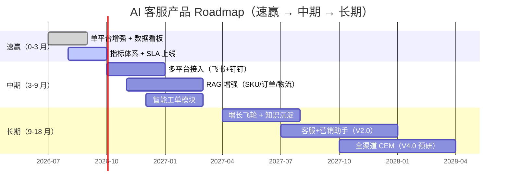

# 产品定位与 One-Pager

> **来源**：主方案第八章"职责①-1 产品定位与价值主张未显性化"
> **关联**：[主方案](../企业AI%20Agent客服优化方案分析框架（基于Coze%20v1.2.4）.md) / [索引页](./README-补充专题总览.md) / [03-竞品矩阵](./03-竞品矩阵与技术雷达.md) / [04-指标体系](./04-指标体系与A-B实验.md)

## 1. 背景与目标

主方案已涵盖多平台/RAG/数据分析等技术方案，但**未明确"卖给谁、解决什么问题、不做什么"**。本专题用于：

- 输出一份对外可发、对内可对齐的 **Product One-Pager**
- 锁定目标用户、价值主张、边界、Roadmap
- 与品牌、市场、销售形成统一话术

## 2. 适用场景与边界

- **适用**：产品立项 / 季度规划 / 销售赋能 / 投资人路演
- **不适用**：日常需求评审、研发排期（用 PRD 和迭代看板）

## 3. Product One-Pager 模板

```markdown
# [产品名] One-Pager

## 1. 目标用户
- 主要：_____（角色 / 行业 / 规模）
- 次要：_____（角色 / 行业 / 规模）

## 2. 痛点（用户视角 Top3）
1. _____
2. _____
3. _____

## 3. 解决方案（产品视角 Top3）
1. _____
2. _____
3. _____

## 4. 差异化（vs 主要竞品）
- 我们有：_____
- 竞品没有：_____

## 5. 价值主张（一句话）
"为 _____（用户）提供 _____（价值），通过 _____（方式），帮助他们 _____（业务结果）"

## 6. 商业模式
- 计费：_____
- ARPU 区间：_____
- 客户获取成本：_____

## 7. 关键指标（北极星 + 2-3 个一级指标）
- 北极星：_____
- 一级指标 1：_____
- 一级指标 2：_____
- 一级指标 3：_____

## 8. 边界声明（不做什么）
- 不做 _____
- 不做 _____
- 不做 _____
```

## 4. 当前产品 One-Pager 草稿（基于主方案）

### 4.1 目标用户

| 优先级 | 用户画像 | 行业 | 规模 |
|---|---|---|---|
| **主要** | 电商客服总监 / 客服主管 | 跨境电商、美妆、食品、3C 等快消品 | 店铺月 GMV 50w-5000w |
| **次要** | 集团数字化负责人 | 零售、连锁餐饮、本地生活 | 集团员工 1000+ |
| **次要** | 品牌商客服运营 | 美妆/母婴/食品品牌 | 私域客服团队 10-50 人 |

### 4.2 痛点

1. **多平台割裂**：同时运营淘宝、抖店、飞书、企微客服，**数据/话术/知识库各自分散**，新员工培训成本高
2. **响应慢 + 夜班贵**：大促期间咨询量 5-10 倍，**夜班坐席成本占比 30%+**，满意度下降
3. **知识更新慢**：产品迭代/活动规则变化快，**客服话术滞后**，转人工率高达 30-40%

### 4.3 解决方案

1. **多平台统一 AI 客服内核**：一套 Coze 流程同时服务飞书/钉钉/抖店/微信，自动适配协议
2. **7×24 自动应答 + 智能转人工**：命中知识库自动回复，未命中或情绪负面时无缝转人工
3. **RAG 知识库 + 知识飞轮**：产品文档/活动规则/工单沉淀自动入库，**越用越准**

### 4.4 差异化（vs 阿里店小蜜、智齿、网易七鱼）

- **快消品专属能力**：临期商品识别、价保一键申请、物流异常主动安抚（详见 [05-业务场景地图](./05-业务场景地图与行业痛点.md)）
- **可私有化部署**：核心规则/数据可本地化，满足合规需求
- **开放 Agent 能力**：基于 Coze 低代码，**业务方可自助配置意图和话术**

### 4.5 价值主张

> "为电商客服团队提供多平台统一的 AI 客服解决方案，通过 Coze 低代码 + 大模型 + 知识飞轮，帮助他们把转人工率从 30% 降到 15%、把 7×24 响应成本降低 60%。"

### 4.6 边界声明（不做什么）

- ❌ 不做呼叫中心（Call Center）
- ❌ 不做 CRM 销售自动化
- ❌ 不做客服招聘/培训
- ❌ 不做全渠道私域营销（仅做客服场景的触达）

## 5. Roadmap 甘特图



## 6. 落地步骤

1. **Week 1-2**：完成 One-Pager 终稿，邀请业务方/技术负责人/客服运营三方评审
2. **Week 3-4**：基于 One-Pager 输出 PRD 草稿 v0.1
3. **Month 2**：每季度一次 One-Pager 复盘（业务变化、用户变化、竞品变化）

## 7. 验证标准

- [ ] One-Pager 在 5 分钟内能让一个新员工/投资人理解"产品是什么、给谁用、不做什么"
- [ ] 销售/客服运营能用同一份 One-Pager 对外介绍产品
- [ ] 目标用户访谈 ≥ 5 场，反馈与 One-Pager 描述一致

## 8. 风险与对冲

| 风险 | 对冲 |
|---|---|
| 边界画得过窄，错失市场机会 | 每季度复盘边界，必要时扩展 |
| 目标用户画像太宽，价值主张不聚焦 | 锁定 1 类主要用户，1 个北极星指标 |
| 差异化点被竞品快速复制 | 把差异化沉淀到**数据护城河 + 场景护城河**（见 [07-护城河与飞轮](./07-产品护城河与增长飞轮.md)） |

## 9. 关联文档

- [03-竞品矩阵与技术雷达.md](./03-竞品矩阵与技术雷达.md) — 差异化依据
- [04-指标体系与A-B实验.md](./04-指标体系与A-B实验.md) — 北极星指标定义
- [05-业务场景地图与行业痛点.md](./05-业务场景地图与行业痛点.md) — 痛点细化
- [08-产品演进与创新机制.md](./08-产品演进与创新机制.md) — Roadmap 演进
