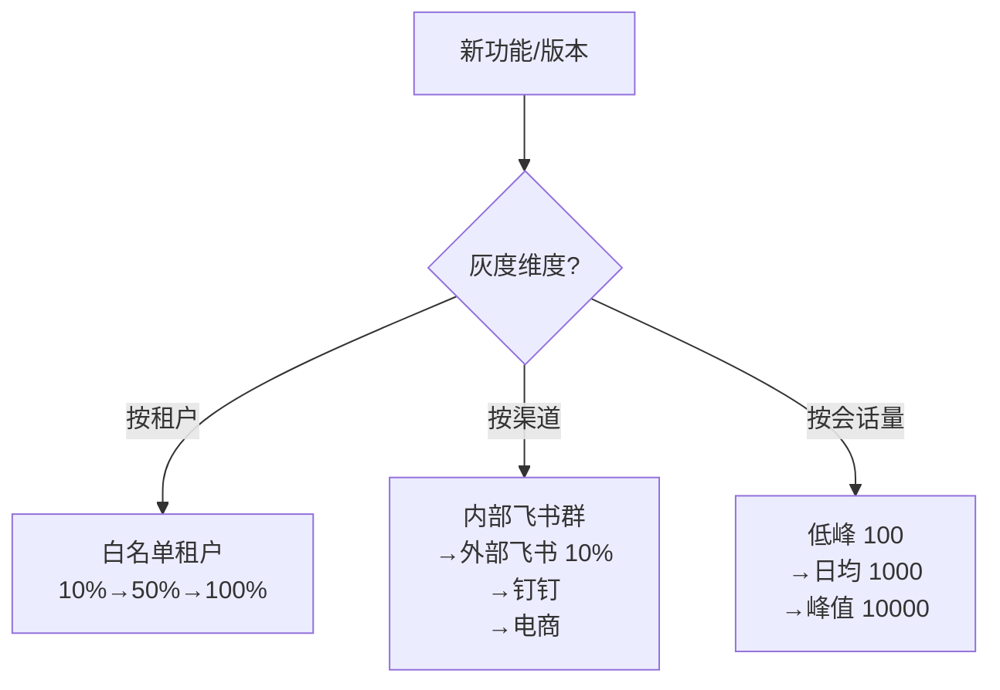

# 灰度发布与 SLA 验收标准

> **来源**：主方案第八章"职责①-2 灰度发布"和"职责①-3 产品验收标准"
> **关联**：[主方案](../企业AI%20Agent客服优化方案分析框架（基于Coze%20v1.2.4）.md) / [索引页](./README-补充专题总览.md) / [04-指标体系](./04-指标体系与A-B实验.md)

## 1. 背景与目标

主方案只到"上线"粒度，未涉及"小流量验证 → 灰度 → 全量"的产品节奏，也缺少**产品级 SLA**（不只是技术指标）。本专题用于：

- 定义 **3 种灰度发布策略**（按租户 / 按渠道 / 按会话量）
- 定义 **A/B 实验单元**（user_id 哈希分桶）
- 输出 **三层 SLA**（功能 / 性能 / 成本）
- 建立 **Go/No-Go 决策表**，每个迭代周期用

## 2. 适用场景与边界

- **适用**：每次重大功能上线、模型切换、流程重构
- **不适用**：纯文案/样式微调（用配置开关即可）

## 3. 灰度发布策略

### 3.1 三种灰度维度



| 维度 | 适用场景 | 优点 | 缺点 |
|---|---|---|---|
| **按租户** | B 端多租户 SaaS | 风险隔离清晰 | 需租户配合 |
| **按渠道** | 多平台客服 | 单平台验证可控 | 跨平台差异不暴露 |
| **按会话量** | 突发流量场景 | 压测充分 | 需有现网流量基础 |

### 3.2 推荐组合（电商客服场景）

- **P1 新功能**：按租户白名单（10% → 50% → 100%）
- **P2 模型切换/流程重构**：按租户白名单 + 按渠道（先飞书内部 → 全渠道）
- **P3 大促活动**：按会话量分级灰度

## 4. A/B 实验单元

### 4.1 分流哈希

```python
import hashlib

def get_bucket(user_id: str, experiment_id: str, bucket_count: int = 100) -> int:
    """返回 0-bucket_count 之间的桶号"""
    raw = f"{experiment_id}:{user_id}".encode("utf-8")
    h = hashlib.md5(raw).hexdigest()
    return int(h, 16) % bucket_count

# 示例：50% 流量进实验组
if get_bucket(user_id, "v1.2.4_audit_loop_v2") < 50:
    return "experiment"  # 走新版本（审核循环 2 次）
else:
    return "control"     # 走旧版本（无审核循环）
```

### 4.2 实验设计规范

| 字段 | 规则 |
|---|---|
| 实验单元 | **user_id**（用户级实验，避免会话/消息级污染） |
| 实验 ID | `v{版本}_{功能}_{日期}` 格式 |
| 最小样本量 | ≥ 1000 用户/桶（统计显著性 95%） |
| 实验周期 | ≥ 7 天（覆盖周内波动） |
| AA 测试 | 上线前先做 1 周 AA 验证分流均匀性 |
| 互斥分组 | 同时跑多实验时用 `layer` 隔离（推荐 4 层：UI / 流程 / 模型 / 文案） |

## 5. 三层 SLA

### 5.1 功能 SLA（业务结果）

| 指标 | 目标值 | 告警阈值 | 数据源 |
|---|---|---|---|
| **知识库命中率** | ≥ 80% | 下降 10% | 对话记录表 |
| **转人工率** | ≤ 15% | 上升 5pp | 转接原因统计 |
| **CSAT（满意度）** | ≥ 4.0/5.0 | 下降 0.3 | 会后评价 |
| **会话解决率** | ≥ 85% | 下降 5pp | 坐席标记 |
| **首次解决率** | ≥ 70% | 下降 5pp | 一次会话关闭率 |

### 5.2 性能 SLA（用户体验）

| 指标 | 目标值 | 告警阈值 | 测量方式 |
|---|---|---|---|
| **首响时长 P50** | ≤ 0.8s | 上升 0.3s | 端到端埋点 |
| **首响时长 P95** | ≤ 1.5s（命中） | 上升 0.5s | 端到端埋点 |
| **首响时长 P95** | ≤ 5s（带审核循环） | 上升 2s | 端到端埋点 |
| **错误率（5xx）** | < 0.5% | 上升 0.3pp | 网关日志 |
| **可用性** | ≥ 99.9% | 下降 0.5pp | 月度统计 |

### 5.3 成本 SLA（经济效益）

| 指标 | 目标值 | 告警阈值 | 计算方式 |
|---|---|---|---|
| **单会话 Token 成本** | ≤ ¥0.04 | 上升 30% | (生成 + 审核) tokens × 单价 |
| **单租户月度成本** | ≤ 预算上限 | 超 80% 告警 | 累计 token × 单价 |
| **AI/人工成本比** | ≥ 3:1 | 下降 1pp | 节省坐席成本 / LLM 成本 |
| **审核循环触发率** | ≤ 30% | 上升 10pp | 触发循环的会话 / 总命中会话 |

## 6. Go/No-Go 决策表

每个迭代周期末（双周），由产品 + 研发 + 客服运营三方共同 review，决定是否全量：

| 检查项 | 通过条件 | 不通过动作 |
|---|---|---|
| 功能 SLA 5 项 | 全部达标 | 阻断全量，回滚到上一稳定版本 |
| 性能 SLA 5 项 | 全部达标 | 阻断全量，性能优化后再评估 |
| 成本 SLA 4 项 | 全部达标 | 阻断全量，启用降级（如关闭审核循环） |
| 核心场景 UAT | ≥ 50 条用例全过 | 阻断全量，补充测试 |
| 用户反馈（内测 ≥ 10 人） | 满意度 ≥ 4.0 | 阻断全量，收集反馈迭代 |
| 客服运营培训完成 | ≥ 80% 坐席过培训 | 推迟全量，先培训 |

**决策人**：产品负责人（一票否决权）

## 7. 灰度发布 Checklist

```markdown
## 上线申请 Checklist

### 上线前
- [ ] PRD 已评审通过（业务方/技术负责人/数据负责人签字）
- [ ] 埋点规范已对齐（事件级 + 属性级）
- [ ] UAT 用例 ≥ 50 条全过
- [ ] 三层 SLA 指标已配置告警
- [ ] A/B 实验已配置（如适用）
- [ ] 灰度白名单已准备
- [ ] 客服运营培训材料已就绪
- [ ] 回滚预案已就位（一键回滚 + 数据回滚）

### 上线中
- [ ] 灰度比例：10% → 观察 24h → 50% → 观察 48h → 100%
- [ ] 关键指标实时监控（命中率、P95、成本）
- [ ] 异常告警 5 分钟内响应
- [ ] 客服运营值班（应对人工接管）

### 上线后
- [ ] T+7：功能可用性、命中率、用户反馈 review
- [ ] T+30：北极星指标变化、ROI 验证
- [ ] T+90：迭代规划下一周期
```

## 8. 落地步骤

1. **Week 1**：上线 SLA 监控看板（功能/性能/成本三类）
2. **Week 2**：配置告警规则 + 飞书/钉钉机器人推送
3. **Week 3**：建立灰度发布流程文档和 Checklist
4. **Week 4**：第一次灰度发布演练（用内部租户）

## 9. 验证标准

- [ ] 三层 SLA 看板上线，能实时看到 14 个指标
- [ ] 告警规则触发后 5 分钟内飞书/钉钉收到通知
- [ ] 灰度发布 Checklist 模板已落地，新人可上手
- [ ] A/B 实验框架支持至少 4 层互斥实验

## 10. 风险与对冲

| 风险 | 对冲 |
|---|---|
| 灰度期租户配合度低 | 选 2-3 个深度合作的种子租户，**先发福利**（免费 3 个月） |
| A/B 实验样本量不够 | 用内部租户 + 关联方填充到 1000/桶 |
| 告警风暴 | 配置"抑制规则"（如 5 分钟内同类告警合并） |
| 成本超预期 | 提前 80% 告警 → 自动降级（关闭审核循环 / 切换更便宜模型） |

## 11. 关联文档

- [04-指标体系与A-B实验.md](./04-指标体系与A-B实验.md) — 指标定义和 A/B 框架
- [07-产品护城河与增长飞轮.md](./07-产品护城河与增长飞轮.md) — 成本 SLA 关联 ROI
- [08-产品演进与创新机制.md](./08-产品演进与创新机制.md) — 节奏分层关联速赢/长期
