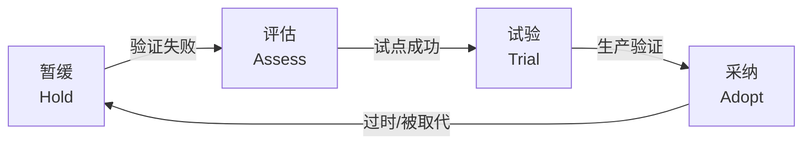

# 竞品矩阵与技术雷达

> **来源**：主方案第八章"职责②-1 竞品矩阵"和"职责②-2 技术雷达"
> **关联**：[主方案](../企业AI%20Agent客服优化方案分析框架（基于Coze%20v1.2.4）.md) / [索引页](./README-补充专题总览.md) / [01-产品定位](./01-产品定位与OnePager.md) / [08-产品演进](./08-产品演进与创新机制.md)

## 1. 背景与目标

主方案有"路径推荐度排序"，但**没有真正的竞品矩阵和技术雷达**。本专题用于：

- 定期维护 6-8 家竞品的对标矩阵
- 跟踪 AI/客服领域的技术雷达（4 象限：采纳/试验/评估/暂缓）
- 输出"差异化机会点 TOP5"作为产品规划输入

## 2. 适用场景与边界

- **适用**：季度规划、新技术选型、产品差异化论证
- **不适用**：日常技术选型（用 RFC 流程）

## 3. 竞品清单

| 类别 | 竞品 | 国家 | 定位 |
|---|---|---|---|
| **国内电商原生** | 阿里店小蜜 | 中国 | 阿里生态电商客服 |
| **国内电商原生** | 京东言犀 | 中国 | 京东生态客服 |
| **国内综合** | 智齿科技 | 中国 | 全渠道客服 SaaS |
| **国内综合** | 容联七陌 | 中国 | 客服 + 呼叫中心 |
| **国内综合** | 网易七鱼 | 中国 | 智能客服 + 工单 |
| **国际综合** | Salesforce Einstein | 美国 | CRM 套件中的 AI |
| **国际综合** | Zendesk AI | 美国 | 全球客服 SaaS |
| **国际综合** | Intercom Fin | 美国 | AI-first 客服 |

## 4. 竞品对标矩阵模板

> 注：以下数值为示例占位，**实际数据由产品经理按季度采集**。

| 维度 | 阿里店小蜜 | 智齿 | 网易七鱼 | 京东言犀 | Salesforce Einstein | Zendesk AI | Intercom Fin | **我方（待补）** |
|---|---|---|---|---|---|---|---|---|
| **渠道覆盖** | 淘宝/天猫/飞猪 | 全渠道 | 全渠道 | 京东/微信 | 全渠道 | 全渠道 | Web/邮件/IM | 飞书/钉钉/抖店/微信 |
| **意图识别准确率** | ~92% | ~85% | ~88% | ~90% | ~90% | ~87% | ~89% | 待测（建议 ≥ 90%） |
| **知识库能力** | 强 | 强 | 强 | 强 | 中 | 中 | 弱（依赖外部） | 中（Coze 原生） |
| **大模型集成** | 通义 | 多模型 | 自研+多 | 多种 | OpenAI | OpenAI | GPT-4 | 豆包（Pro+Lite） |
| **Agent 能力** | 中 | 弱 | 中 | 中 | 中 | 中 | 强 | 中（流程编排） |
| **价格** | 抽佣 | 订阅 | 订阅 | 抽佣 | 高 | 高 | 高 | 待定 |
| **API 开放度** | 中 | 强 | 强 | 中 | 强 | 强 | 强 | 强（Coze 开放） |
| **行业适配** | 阿里商家 | 通用 | 通用 | 京东商家 | 通用 | 通用 | 通用 | **快消品**（差异化） |
| **私有化** | 不支持 | 支持 | 支持 | 不支持 | 不支持 | 不支持 | 不支持 | **支持**（差异化） |

## 5. 差异化机会点 TOP5

基于对标矩阵，**我方可能的差异化机会**（按 ROI 排序）：

| # | 机会点 | 竞品现状 | 我方方案 | ROI 估算 |
|---|---|---|---|---|
| 1 | **快消品专属能力** | 通用客服，无行业适配 | 临期/价保/物流主动安抚（见 [05-业务场景](./05-业务场景地图与行业痛点.md)） | 节省转人工 30% |
| 2 | **私有化部署** | 多数 SaaS 不支持 | Coze 可本地化 + 数据隔离 | 抢占合规客户（金融/医疗） |
| 3 | **业务方自助配置** | 多数需研发排期 | Coze 低代码，运营可改意图/话术 | 缩短迭代周期 50% |
| 4 | **多平台消息卡片原生** | 多数仅文本 | 飞书/钉钉/抖店原生卡片 | 转化率提升 15% |
| 5 | **知识飞轮自动化** | 多数需人工维护 | 自动从工单/对话提取 Q&A 入库 | 知识库维护成本 -70% |

## 6. 技术雷达（Tech Radar）

### 6.1 四象限说明



| 象限 | 含义 | 行动 |
|---|---|---|
| **采纳 Adopt** | 已生产验证，标准化使用 | 推广到所有产品线 |
| **试验 Trial** | 在 1-2 个场景验证有效 | 扩大试点，收集反馈 |
| **评估 Assess** | 值得关注但需调研 | 1-2 月内出调研结论 |
| **暂缓 Hold** | 风险高或与战略不符 | 暂不投入，除非外部变化 |

### 6.2 当前技术雷达（2026-06）

#### LLM 大模型

| 技术 | 象限 | 说明 |
|---|---|---|
| 豆包 Pro 32B / Lite 7B | **采纳** | 主方案 v1.2.4 已用，性价比最优 |
| DeepSeek V3 | **试验** | 中文能力强，可作长尾降级方案 |
| 通义千问 Qwen-Max | **试验** | 阿里生态客户首选 |
| GPT-4o / Claude 3.5 | **评估** | 国际客户/英文场景 |
| 国产小模型（Qwen2.5-7B） | **试验** | 本地化部署候选 |
| 开源 Llama 3.3 | **暂缓** | 中文能力弱 |

#### Agent 框架

| 技术 | 象限 | 说明 |
|---|---|---|
| Coze 扣子 | **采纳** | 主方案底座 |
| Dify | **试验** | 开源备选 |
| LangChain | **评估** | 复杂 Agent 编排 |
| AutoGen | **暂缓** | 学习成本高 |

#### RAG 技术

| 技术 | 象限 | 说明 |
|---|---|---|
| 向量检索（Milvus/Qdrant） | **采纳** | 主流方案 |
| Hybrid Search（向量+全文） | **采纳** | 主方案 v1.2.4 已用 |
| GraphRAG | **试验** | 实体关系增强，待 POC |
| Re-ranking | **试验** | 提升 Top-K 精度 |
| Self-RAG / Corrective RAG | **评估** | 复杂场景 |

#### 语音 / 多模态

| 技术 | 象限 | 说明 |
|---|---|---|
| 实时 ASR（语音转文字） | **试验** | 电话客服场景 |
| 实时 TTS | **试验** | 语音 Agent |
| 视频客服 | **评估** | 高客单场景 |
| 多模态理解（图+文） | **评估** | 商品识别、退换货 |

## 7. 季度更新 SOP

```markdown
## 季度竞品与技术雷达更新 SOP

### 1. 竞品监控（每月 1 次）
- [ ] 竞品官网"产品更新" + "博客"订阅
- [ ] 竞品试用账号（每个竞品 1 个）
- [ ] 竞品发布会/行业大会视频（如 Salesforce Dreamforce）

### 2. 竞品试用（每季度 1 次）
- [ ] 每家竞品至少 3 个核心场景
- [ ] 截图 + 录屏存证
- [ ] 关键指标对比（响应时间、识别准确率、用户体验）

### 3. 技术雷达更新（每季度 1 次）
- [ ] 团队内部 1 次技术分享（每人 1 项新技术）
- [ ] 外部信息：arXiv 论文 / GitHub Trending / ProductHunt / 国内 HuggingFace
- [ ] 评估"采纳" / "试验" / "评估" / "暂缓" 象限调整

### 4. 产出（每季度 1 次）
- [ ] 《竞品季度观察报告》（10-20 页 PPT）
- [ ] 《技术雷达更新表》（本文档 §6.2）
- [ ] 《差异化机会点 TOP5》更新
- [ ] 季度复盘会（1.5h），同步给产品/研发/客服运营
```

## 8. 落地步骤

1. **Week 1-2**：建立竞品试用账号矩阵，每个竞品 1 个账号
2. **Week 3-4**：完成首份竞品对标矩阵（按本文档模板）
3. **Month 2**：发布首份技术雷达
4. **Month 3**：召开季度复盘会

## 9. 验证标准

- [ ] 8 家竞品均有最新季度数据
- [ ] 技术雷达四象限至少各 3 项技术
- [ ] 差异化机会点 TOP5 每季度更新
- [ ] 季度复盘会议有决策产出（采纳/试验/暂缓某项技术）

## 10. 风险与对冲

| 风险 | 对冲 |
|---|---|
| 竞品数据采集投入大 | 重点 3 家（店小蜜/智齿/Intercom），其他季度轮换 |
| 技术雷达变"技术新闻" | 强制要求"采纳/试验/评估/暂缓"分类，不留"关注" |
| 团队对新技术抵触 | 设立"创新实验室"（见 [08-产品演进](./08-产品演进与创新机制.md)），给试错空间 |

## 11. 关联文档

- [01-产品定位与OnePager.md](./01-产品定位与OnePager.md) — 差异化定位依据
- [08-产品演进与创新机制.md](./08-产品演进与创新机制.md) — 创新实验室机制
