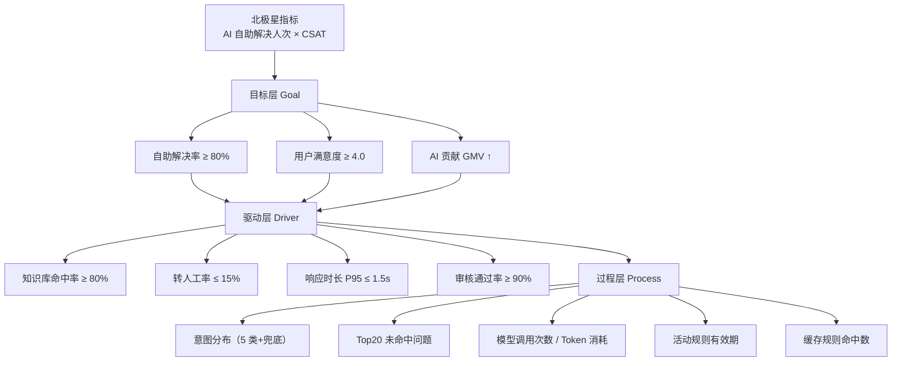

# 指标体系与 A/B 实验

> **来源**：主方案第八章"职责④ 数据敏感"全部 5 项
> **关联**：[主方案](../企业AI%20Agent客服优化方案分析框架（基于Coze%20v1.2.4）.md) / [索引页](./README-补充专题总览.md) / [02-灰度SLA](./02-灰度发布与SLA验收标准.md) / [07-护城河与飞轮](./07-产品护城河与增长飞轮.md)

## 1. 背景与目标

主方案在第四章列出 10+ 指标，但**没有北极星指标、没有指标分层、缺少 A/B 框架、缺少告警归因、ROI 量化不足**。本专题用于：

- 定义 **北极星指标**（双因子）
- 建立 **指标三层模型**（目标/驱动/过程）
- 给出 **A/B 实验框架**（含 AA 测试和样本量计算）
- 建立 **告警规则库** 和 **根因分析模板**
- 输出 **ROI 计算公式**

## 2. 适用场景与边界

- **适用**：产品周报/月报、迭代决策、ROI 汇报
- **不适用**：研发性能监控（用 Grafana/APM）

## 3. 北极星指标

### 3.1 定义

> **北极星 = AI 自助解决人次 × 用户满意度（CSAT）**

**为什么不选单一指标**：
- 自助解决人次 ↑ → 可能牺牲质量（答非所问）
- CSAT ↑ → 可能牺牲效率（保守回答）
- **双因子相乘** 同时约束"数量"和"质量"

### 3.2 计算方式

```
北极星值 = Σ(自助解决会话) × AVG(CSAT 该批次)
       = 5,000 次/日 × 4.2/5.0
       = 21,000 单元
```

### 3.3 配套解读指标

- **自助解决率** = 自助解决会话 / 总会话
- **平均 CSAT** = Σ 评分 / 评价数
- **周环比** = (本周 - 上周) / 上周

## 4. 指标三层模型



### 4.1 指标全表

| 层级 | 指标 | 目标值 | 告警阈值 | 数据源 | 更新频率 | 负责人 |
|---|---|---|---|---|---|---|
| **目标** | AI 自助解决人次 | 周环比 +5% | 下降 10% | 对话记录 | 日 | 产品 |
| **目标** | 用户满意度 CSAT | ≥ 4.0/5.0 | 下降 0.3 | 评价表 | 日 | 客服运营 |
| **目标** | AI 贡献 GMV | +20% QoQ | 下降 5% | 订单+对话 join | 周 | 业务 |
| **驱动** | 知识库命中率 | ≥ 80% | 下降 10pp | 检索日志 | 日 | 产品 |
| **驱动** | 转人工率 | ≤ 15% | 上升 5pp | 转接记录 | 日 | 客服运营 |
| **驱动** | 首响 P95 | ≤ 1.5s | 上升 0.5s | APM | 实时 | 研发 |
| **驱动** | 审核通过率 | ≥ 90% | 下降 10pp | 审核日志 | 日 | 产品 |
| **过程** | 意图分布 | 5 类均衡 | 单类 > 50% | 意图记录 | 日 | 产品 |
| **过程** | Top20 未命中 | 每月减少 10% | 连续 2 月不降 | 检索日志 | 周 | 产品 |
| **过程** | Token 消耗 | ≤ 预算 | 80% 触发告警 | API 日志 | 实时 | 研发 |
| **过程** | 活动规则数 | ≤ 50 | 超 80 告警 | 规则表 | 日 | 运营 |
| **过程** | 缓存命中 | ≥ 30% | 下降 10pp | 缓存日志 | 日 | 研发 |

## 5. A/B 实验框架

### 5.1 实验设计 SOP

```markdown
## A/B 实验设计 Checklist

### 1. 实验提出
- [ ] 假设明确：例如"开启审核循环 2 次可使 CSAT 提升 0.2"
- [ ] 主要指标：CSAT（连续 7 天）
- [ ] 次要指标：命中率、转人工率、P95、Token 成本
- [ ] 守护指标：转人工率不上升（不恶化用户体验）

### 2. 样本量计算
- 基准 CSAT 4.0，目标 4.2，标准差 0.5
- α=0.05, 1-β=0.8
- 单尾 t 检验
- → 最小样本量 = 313 用户/组（共 626 用户）
- 实际跑 1000/组（覆盖波动）

### 3. 分流策略
- 实验 ID：v1.2.4_audit_loop_v2
- 实验单元：user_id（用户级）
- 分流：50/50
- 互斥分层：UI 层 / 流程层 / 模型层 / 文案层

### 4. 实验周期
- 7 天 × 1000 用户/组 = 14,000 总会话
- 观察：首日 24h + 中期 48h + 末期 24h

### 5. AA 测试（先做 7 天）
- 同一切流策略，对照组和实验组都跑"现状"
- 验证分流均匀性（基线指标无显著差异）

### 6. 上线决策
- p < 0.05 且效果方向正确 → 全量
- p < 0.05 但效果负向 → 回滚
- p ≥ 0.05 → 延长实验或放弃
```

### 5.2 最小样本量计算

```python
from scipy import stats

def calc_sample_size(
    baseline_mean: float,
    target_mean: float,
    std: float,
    alpha: float = 0.05,
    power: float = 0.8
) -> int:
    """单尾 t 检验的最小样本量（每组）"""
    z_alpha = stats.norm.ppf(1 - alpha)   # 1.645
    z_beta = stats.norm.ppf(power)        # 0.842
    n = ((z_alpha + z_beta) * std / (target_mean - baseline_mean)) ** 2
    return int(n) + 1

# 示例：CSAT 从 4.0 提升到 4.2，标准差 0.5
print(calc_sample_size(4.0, 4.2, 0.5))  # → 313
```

### 5.3 实验记录模板

| 字段 | 填写 |
|---|---|
| 实验 ID | v1.2.4_audit_loop_v2 |
| 假设 | 开启审核循环 2 次可使 CSAT 提升 0.2 |
| 开始日期 | 2026-07-15 |
| 结束日期 | 2026-07-22 |
| 样本量/组 | 1000 |
| 分流策略 | user_id 哈希 mod 100 < 50 |
| 主要指标 | CSAT |
| 守护指标 | 转人工率不上升 |
| AA 测试 | 2026-07-08 ~ 2026-07-14 |
| 实验结果 | p=0.012，CSAT 提升 0.18，达标 |
| 决策 | 全量上线 |

## 6. 告警规则库

### 6.1 告警分级

| 等级 | 含义 | 响应时间 | 通知通道 |
|---|---|---|---|
| **P0 紧急** | 全站不可用或核心指标断崖下跌 | 5 分钟 | 飞书/钉钉 + 电话 |
| **P1 高** | 单租户/单渠道异常 | 30 分钟 | 飞书/钉钉 |
| **P2 中** | 指标轻微超阈值 | 2 小时 | 飞书/钉钉 |
| **P3 低** | 趋势性下降 | 24 小时 | 邮件日报 |

### 6.2 告警规则

```yaml
# 告警规则示例（Prometheus/Metabase 通用）
- name: 命中率下降
  metric: knowledge_hit_rate
  condition: rate < 0.7
  duration: 10m
  severity: P1
  
- name: P95 响应超时
  metric: response_time_p95
  condition: value > 3.0
  duration: 5m
  severity: P1
  
- name: Token 成本超预算
  metric: token_cost_daily
  condition: value > budget * 0.8
  duration: 1m
  severity: P2
  
- name: 转人工率异常上升
  metric: transfer_rate
  condition: rate > 0.2
  duration: 15m
  severity: P1
```

### 6.3 告警抑制

```yaml
# 5 分钟内同类告警合并
- name: 告警抑制
  rule: |
    同一 metric 在 5min 窗口内重复触发 → 合并为 1 条
    P0 永不抑制
    维护窗口 02:00-04:00 仅 P0 告警
```

## 7. 根因分析模板

```markdown
## 根因分析报告

### 1. 现象
- 指标：知识库命中率
- 时间：2026-07-20 14:00 - 16:00
- 数值：从 80% 下降到 65%（-15pp）

### 2. 下钻分析
- 按渠道：飞书 -18pp，钉钉 -2pp，电商 -1pp → **问题在飞书**
- 按租户：租户 A -25pp，租户 B -3pp → **问题在租户 A**
- 按意图：product_feature -20pp → **问题在该意图**
- 按时间：14:30 飞书租户 A 上线了"新功能介绍"文档

### 3. 根本原因
- 租户 A 14:30 上传了 50 篇产品新功能文档
- 但知识库"产品知识库"未勾选该租户的"新功能"分类
- 导致 product_feature 意图的检索结果不包含新文档

### 4. 解决
- 立即：知识库关联新分类（5 分钟内）
- 长期：建立"知识库变更 → 自动回归测试"机制

### 5. 预防
- 知识库变更前走"预发布灰度"流程
- 命中率告警 5 分钟内自动飞书通知
```

## 8. ROI 计算公式

### 8.1 节省人力成本

```
节省人力成本 = (转人工率下降 × 会话总量) × 单会话坐席成本

# 示例
= (0.30 - 0.15) × 100,000  # 转人工率从 30% 降到 15%，10 万会话
  × ¥3.5/会话               # 单会话坐席成本
= ¥52,500/月
```

### 8.2 提升 GMV

```
AI 贡献 GMV = AI 推荐引导的加购转化增量

# 计算
= (AI 引导会话转化率 - 基线转化率) × AI 引导会话数 × 客单价

# 示例
= (8% - 5%) × 20,000 × ¥80
= ¥48,000/月
```

### 8.3 客户留存价值

```
留存价值 = 满意度提升对复购的影响

# 简化估算
= (新 CSAT - 旧 CSAT) × 0.5 × 月活用户 × 客单价 × 复购率
= (4.2 - 4.0) × 0.5 × 50,000 × ¥80 × 0.3
= ¥120,000/月
```

### 8.4 综合 ROI

```
总价值 = 节省人力 + GMV 增量 + 留存价值
     = 52,500 + 48,000 + 120,000
     = ¥220,500/月

成本 = AI 客服系统成本 + 维护人力 + LLM API
    = ¥10,000 + ¥30,000 + ¥20,000
    = ¥60,000/月

ROI = (总价值 - 成本) / 成本
    = (220,500 - 60,000) / 60,000
    = 267%
```

## 9. 落地步骤

1. **Week 1**：上线指标看板（北极星 + 三层模型 + ROI）
2. **Week 2**：配置告警规则（6.2）
3. **Week 3**：A/B 实验框架代码化（哈希分流、AA 测试）
4. **Week 4**：第一次 ROI 汇报（用 8.4 模板）

## 10. 验证标准

- [ ] 北极星指标每周可计算、有趋势图
- [ ] 12 个指标全在监控看板
- [ ] 告警规则触发后 5 分钟内飞书/钉钉收到
- [ ] A/B 实验跑通至少 1 个（含 AA 测试）
- [ ] 季度 ROI 报告自动化产出

## 11. 风险与对冲

| 风险 | 对冲 |
|---|---|
| 指标过多失去焦点 | 北极星首屏，其他指标二级 |
| A/B 实验样本量不够 | 强制 1000/组，达不到不开 |
| 告警疲劳 | 抑制规则 + 等级分级 |
| ROI 归因困难 | 引入"对照组"基线对比 |

## 12. 关联文档

- [02-灰度发布与SLA验收标准.md](./02-灰度发布与SLA验收标准.md) — 三层 SLA 与本指标三层模型对齐
- [07-产品护城河与增长飞轮.md](./07-产品护城河与增长飞轮.md) — ROI 关联护城河价值
- [08-产品演进与创新机制.md](./08-产品演进与创新机制.md) — 节奏分层下的指标基线
