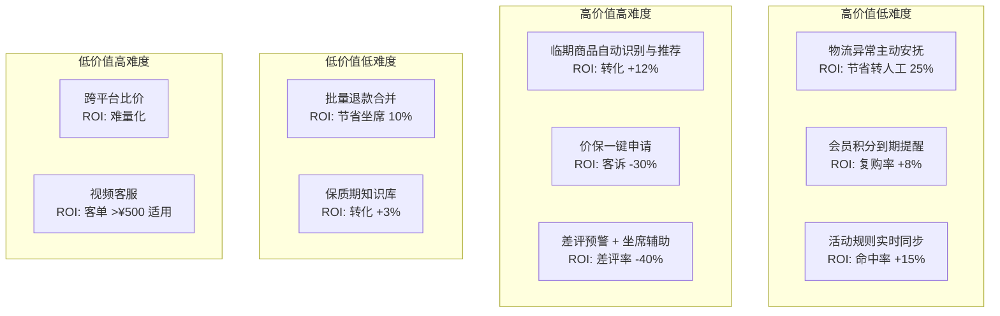

# 业务场景地图与行业痛点

> **来源**：主方案第八章"职责③ 精通电商业务"前三项
> **关联**：[主方案](../企业AI%20Agent客服优化方案分析框架（基于Coze%20v1.2.4）.md) / [索引页](./README-补充专题总览.md) / [06-智能工单](./06-智能工单模块设计.md) / [01-产品定位](./01-产品定位与OnePager.md)

## 1. 背景与目标

主方案第四章有快消品数据分析，但**对"客服接待—应答—工单—售后"四大业务场景的痛点拆解不够深**，**缺少快消品行业 Know-how 沉淀**，**没有可执行的差异化机会矩阵**。本专题用于：

- 输出 **8 大业务场景画像**（每场景含用户旅程/高频问题/AI 能力/转人工条件）
- 沉淀 **快消品 TOP10 行业痛点** 与对应产品功能/知识库专题
- 构建 **差异化机会矩阵**（机会类型 × 落地难度 × 业务价值）

## 2. 适用场景与边界

- **适用**：PRD 编写、需求池管理、差异化论证
- **不适用**：单次需求评审（用 PRD）

## 3. 8 大业务场景画像

### 3.1 售前咨询

- **典型用户旅程**：浏览商品 → 询问规格/价格 → 询问优惠 → 询问发货时间
- **高频问题 TOP10**：规格、颜色、尺码、材质、是否现货、发货时间、运费、能否便宜点、有无赠品、对比竞品
- **AI 处理能力**：✅ 强（80%+ 可命中）
- **转人工触发条件**：用户问"人工"、连续 3 次未命中、情绪负面
- **转化/挽回机会点**：主动推荐同价位替代品、推荐搭配、加购提醒

### 3.2 售中跟进

- **典型用户旅程**：下单 → 询问发货 → 询问物流 → 询问何时到达
- **高频问题 TOP10**：什么时候发货、发货了没、走哪家快递、几天到、改地址、合并发货
- **AI 处理能力**：✅ 强（订单查询 + 物流 API 模板化）
- **转人工触发条件**：订单异常（缺货/退款争议）、情绪负面
- **转化/挽回机会点**：物流延迟主动安抚、推荐关联商品

### 3.3 售后维权

- **典型用户旅程**：收到商品 → 发现问题 → 联系客服 → 申请售后
- **高频问题 TOP10**：商品破损、商品错发、商品少件、质量问题、临期、使用问题
- **AI 处理能力**：⚠️ 中（需结合订单+图片，复杂需人工）
- **转人工触发条件**：金额 > ¥500、用户坚持维权、情绪严重负面、监管投诉风险
- **转化/挽回机会点**：小额极速退款、补偿券、主动跟进

### 3.4 退换货

- **典型用户旅程**：发起申请 → 客服审核 → 寄回商品 → 收到退款/换货
- **高频问题 TOP10**：如何退换、退换条件、运费谁出、退款多久到账、能否仅退款、能否换其他款
- **AI 处理能力**：✅ 强（规则化流程，模板化回答）
- **转人工触发条件**：超 7 天、用户证据充分、用户情绪负面
- **转化/挽回机会点**：极速退款（VIP 跳过审核）、运费险提醒

### 3.5 物流查询

- **典型用户旅程**：查看订单 → 输入快递单号 → 查询轨迹
- **高频问题 TOP10**：到哪了、为什么不动、签收没、地址错了、改地址
- **AI 处理能力**：✅ 强（API + 模板）
- **转人工触发条件**：快递公司异常、物流超 7 天未更新
- **转化/挽回机会点**：异常主动安抚、催件、推荐同款其他店铺

### 3.6 活动咨询

- **典型用户旅程**：看到活动 → 询问规则 → 询问能否叠加 → 下单
- **高频问题 TOP10**：怎么参加、能否用券、能否叠加、什么时候开始/结束、是否限地区
- **AI 处理能力**：⚠️ 中（规则变化快，知识库更新滞后）
- **转人工触发条件**：规则复杂（跨店/跨平台/跨账号）、用户钻空子
- **转化/挽回机会点**：主动推送未使用券、推荐活动商品

### 3.7 差评安抚

- **典型用户旅程**：准备给差评 → 客服介入 → 协商 → 撤差评 / 仍给差评
- **高频问题 TOP10**：想给差评、商品有 bug、物流太慢
- **AI 处理能力**：❌ 弱（需坐席情商和谈判能力）
- **转人工触发条件**：**永远转人工**（差评危机高敏感）
- **转化/挽回机会点**：补偿券 + 主动跟进 + 标签记录到 CRM

### 3.8 会员服务

- **典型用户旅程**：积分查询 → 兑换 → 会员升级/降级 → 专属权益
- **高频问题 TOP10**：积分怎么用、什么时候到期、怎么升级、保级条件、专属券
- **AI 处理能力**：✅ 强（CRM + 规则模板）
- **转人工触发条件**：用户质疑权益、要求特殊处理
- **转化/挽回机会点**：即将到期积分主动提醒、推荐升级

## 4. 快消品行业 TOP10 痛点

| # | 痛点 | 频次 | 严重度 | 现有方案不足 | 产品功能 | 知识库专题 |
|---|---|---|---|---|---|---|
| 1 | **大促期间活动规则咨询** | 极高 | 高 | 知识库更新滞后 | 活动规则实时接入 + 主动推送 | 活动 FAQ 库（每日同步） |
| 2 | **赠品漏发/错发** | 高 | 高 | 需人工核对订单 | 订单关联赠品自动查询 | 赠品规则库 |
| 3 | **保质期疑虑** | 中 | 高 | 缺乏临期判定 | **临期商品自动识别**（差异化） | 保质期知识库 |
| 4 | **临期商品投诉** | 中 | 高 | 需逐单查 | **临期主动安抚话术**（差异化） | 临期处理 SOP |
| 5 | **批量退款申诉** | 中 | 中 | 流程长 | 批量退款工单合并处理 | 批量退款规则 |
| 6 | **物流延迟追溯** | 高 | 中 | 模板化不够 | 物流异常主动安抚 | 物流异常处理 SOP |
| 7 | **价保申请** | 中 | 中 | 需用户主动 | **价保一键申请**（差异化） | 价保规则库 |
| 8 | **会员积分到期** | 中 | 中 | 缺乏提醒 | 临期积分主动提醒 | 会员规则库 |
| 9 | **差评危机** | 低 | 极高 | 完全靠人工 | 差评预警 + VIP 转接 | 差评处理 SOP |
| 10 | **跨平台价差** | 中 | 中 | 平台不互通 | 跨平台比价（数据允许时） | 价差 FAQ |

## 5. 差异化机会矩阵

| 优先级 | 机会点 | 价值 | 难度 | 落地周期 |
|---|---|---|---|---|
| **P0** | 物流异常主动安抚 | 高 | 低 | 1 月 |
| **P0** | 活动规则实时同步 | 高 | 低 | 1 月 |
| **P1** | 临期商品自动识别 | 高 | 高 | 3 月 |
| **P1** | 价保一键申请 | 高 | 高 | 3 月 |
| **P1** | 会员积分到期提醒 | 中 | 低 | 1.5 月 |
| **P2** | 差评预警 + 坐席辅助 | 高 | 中 | 4 月 |
| **P2** | 批量退款合并 | 低 | 低 | 2 月 |

## 6. 业务场景与意图分类映射

主方案 v1.2.4 意图分类仅 5 类（闲聊/非客服/产品功能/产品价格/负面），**远不够覆盖电商场景**。扩展方案：

| 业务场景 | 建议意图 | 关联 AI 能力 |
|---|---|---|
| 售前咨询 | product_feature（已有）/ size_inquiry / color_inquiry / inventory_check | 知识库 + SKU API |
| 售中跟进 | order_status / shipping_query / address_change | 订单 API + 物流 API |
| 售后维权 | complaint_quality / complaint_logistics / partial_refund | 知识库 + 工单系统 |
| 退换货 | return_request / exchange_request / refund_track | 退换货规则引擎 |
| 物流查询 | logistics_track / logistics_exception | 物流 API |
| 活动咨询 | promotion_rule / coupon_usage / member_benefit | 活动规则库 |
| 差评安抚 | negative_review_intent | **永远转人工** |
| 会员服务 | member_points / member_upgrade / member_benefit | CRM API |

## 7. 落地步骤

1. **Week 1-2**：与业务方联合产出《电商客服场景手册 V1》（基于本文档 §3）
2. **Week 3-4**：扩展意图分类（基于本文档 §6）
3. **Month 2**：P0 差异化机会立项（物流安抚 + 活动规则同步）
4. **Month 3**：P1 差异化机会立项（临期/价保）

## 8. 验证标准

- [ ] 8 大场景画像被客服运营/产品/研发三方认可
- [ ] 行业 TOP10 痛点每个有对应产品功能 OR 知识库专题
- [ ] 差异化机会矩阵中 P0 项已立项
- [ ] 意图分类扩展后，覆盖率从 5 类提升到 ≥ 15 类

## 9. 风险与对冲

| 风险 | 对冲 |
|---|---|
| 业务方配合度低 | 与客服运营建立"周对周"机制 |
| 差异化机会难以量化 ROI | 强制要求每个机会点配"基线指标"和"预期提升" |
| 行业痛点变化快 | 每季度复盘，更新 TOP10 排序 |
| 意图分类扩展导致流程变复杂 | **二级意图**：主意图 5 类保留 + 业务子意图 15 类作为知识库筛选条件 |

## 10. 关联文档

- [01-产品定位与OnePager.md](./01-产品定位与OnePager.md) — 差异化机会落到 One-Pager
- [06-智能工单模块设计.md](./06-智能工单模块设计.md) — 售后/退换货场景的工单承接
- [07-产品护城河与增长飞轮.md](./07-产品护城河与增长飞轮.md) — 场景护城河定义
