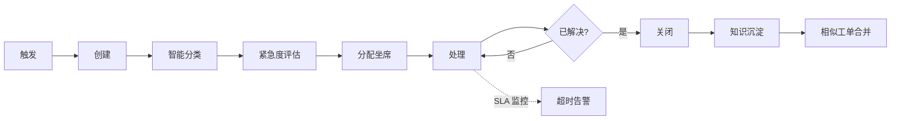
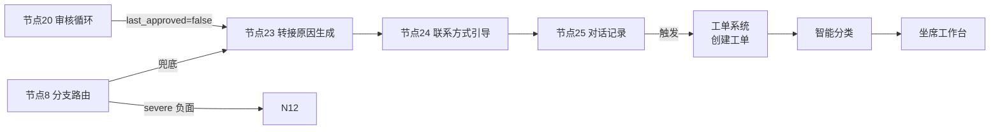

# 智能工单模块设计

> **来源**：主方案第八章"职责③-4 工单场景深度不足"
> **关联**：[主方案](../企业AI%20Agent客服优化方案分析框架（基于Coze%20v1.2.4）.md) / [索引页](./README-补充专题总览.md) / [05-业务场景地图](./05-业务场景地图与行业痛点.md) / [01-产品定位](./01-产品定位与OnePager.md)

## 1. 背景与目标

主方案 v1.2.4 仅 N25 节点写对话记录，**未涉及工单全生命周期管理**。本专题用于：

- 补齐"AI 客服 + 工单系统"产品形态
- 覆盖工单的 **创建/分配/处理/关闭/SLA 监控** 5 个阶段
- 引入 **AI 能力**（自动分类、紧急度识别、相似合并、坐席辅助回复）
- 定义 **数据模型** 和 **与 Coze N25 的衔接**

## 2. 适用场景与边界

- **适用**：售后维权/退换货/价保/批量退款等需要后续跟进的场景
- **不适用**：纯售前咨询（直接 AI 应答无需工单）

## 3. 工单全生命周期

| 阶段 | 触发条件 | AI 能力 | SLA |
|---|---|---|---|
| **创建** | 转人工/用户主动 | 自动从对话提取 | T+0 |
| **分类** | 工单创建后 | 自动分类 + 紧急度 | T+1min |
| **分配** | 分类后 | 按技能组 + 负载分配 | T+5min |
| **处理** | 坐席接单 | AI 辅助回复 + 相似工单推荐 | 见 §6 |
| **关闭** | 用户确认/超时 | 自动结单 | — |
| **沉淀** | 关闭后 | LLM 提取 Q&A 入知识库 | T+1d |
| **合并** | 处理中 | 向量化相似工单合并 | 实时 |

## 4. 数据模型

### 4.1 工单表（ticket）

| 字段 | 类型 | 说明 |
|---|---|---|
| `ticket_id` | String (PK) | 工单号（自动生成） |
| `tenant_id` | String | 租户 |
| `user_id` | String | 客户 |
| `channel` | String | 来源渠道（飞书/钉钉/抖店） |
| `category` | String | 工单分类（退货/换货/退款/投诉/咨询） |
| `priority` | String | 紧急度（P0/P1/P2/P3） |
| `status` | String | 状态（待分配/处理中/已解决/已关闭/超时） |
| `assignee` | String | 坐席 ID |
| `sla_deadline` | DateTime | SLA 截止时间 |
| `related_session_id` | String | 关联的 AI 会话 ID（来自 N25） |
| `created_at` | DateTime | 创建时间 |
| `updated_at` | DateTime | 最后更新时间 |
| `closed_at` | DateTime | 关闭时间 |
| `csat` | Number | 用户评分（1-5） |

### 4.2 工单消息表（ticket_message）

| 字段 | 类型 | 说明 |
|---|---|---|
| `msg_id` | String (PK) | 消息 ID |
| `ticket_id` | String (FK) | 所属工单 |
| `sender_type` | String | 发送方（user/agent/ai/system） |
| `content` | Text | 消息内容 |
| `attachments` | Array | 附件（图/视频/订单截图） |
| `ai_suggested` | Boolean | 是否 AI 建议的回复 |
| `created_at` | DateTime | 时间 |

### 4.3 SLA 规则表（sla_rule）

| 字段 | 类型 | 说明 |
|---|---|---|
| `rule_id` | String (PK) | 规则 ID |
| `tenant_id` | String | 租户 |
| `category` | String | 工单分类 |
| `priority` | String | 紧急度 |
| `first_response_minutes` | Int | 首次响应 SLA（分钟） |
| `resolve_minutes` | Int | 解决 SLA（分钟） |
| `escalation_rule` | String | 升级规则（升级到组长/经理） |

## 5. AI 能力详解

### 5.1 自动分类

- **输入**：工单标题 + 描述 + 关联对话
- **输出**：category（退货/换货/退款/投诉/咨询）+ 置信度
- **方法**：LLM few-shot 分类（如豆包 Lite 7B）
- **准确率目标**：≥ 90%

### 5.2 紧急度识别

- **输入**：工单内容 + 用户历史 CSAT + 情绪标记
- **输出**：priority（P0/P1/P2/P3）
- **规则**：
  - P0：金额 > ¥1000 OR 监管投诉 OR 媒体曝光
  - P1：金额 > ¥500 OR 多次未解决 OR 情绪严重负面
  - P2：标准工单
  - P3：一般咨询

### 5.3 相似工单合并

- **输入**：新工单内容
- **输出**：Top-3 相似工单
- **方法**：工单标题 + 描述向量化（Embedding）→ Milvus 检索
- **阈值**：相似度 > 0.85 视为同一工单，建议合并

### 5.4 AI 辅助坐席回复

- **输入**：当前工单 + 历史工单 + 知识库
- **输出**：3 条建议回复
- **方法**：
  1. 检索相似历史工单的"已采纳"回复
  2. 检索相关知识库段落
  3. LLM 综合生成 3 条建议
- **坐席可采纳 / 编辑 / 拒绝**

## 6. SLA 监控与告警

| 工单分类 | 首次响应 SLA | 解决 SLA |
|---|---|---|
| **P0 投诉** | 5 分钟 | 2 小时 |
| **P1 退换货** | 30 分钟 | 24 小时 |
| **P2 退款** | 1 小时 | 48 小时 |
| **P3 咨询** | 4 小时 | 72 小时 |

**告警规则**：
- 距离首次响应 SLA 剩余 20% → 飞书通知坐席
- 距离首次响应 SLA 剩余 10% → 通知组长
- 超过首次响应 SLA → 通知经理 + 自动升级
- 距离解决 SLA 剩余 20% → 通知坐席 + 经理

## 7. 与主方案 v1.2.4 的衔接

主方案 N25 节点（对话记录）已写入 `transfer_reason`、`intent` 等字段，可作为工单创建的触发条件：

**扩展建议**：在 N25 后增加"工单创建"节点，根据 `transfer_reason` 和 `intent` 字段自动调用工单系统 API：
- `transfer_reason` 含"投诉"→ 创建 P0 工单
- `transfer_reason` 含"退换"→ 创建 P1 工单
- `transfer_reason` 含"咨询"→ 创建 P3 工单

## 8. 落地步骤

1. **Month 1**：建工单表 + 消息表 + SLA 规则表（CRUD）
2. **Month 2**：智能分类 + 紧急度识别 LLM 接入
3. **Month 3**：坐席工作台 MVP（看工单 + 辅助回复）
4. **Month 4**：相似工单合并 + SLA 告警
5. **Month 5**：知识沉淀（工单→知识库自动入库）
6. **Month 6**：与 Coze N25 节点对接联调

## 9. 验证标准

- [ ] 8 类工单可全生命周期管理
- [ ] 自动分类准确率 ≥ 90%（UAT 50 条）
- [ ] SLA 告警 5 分钟内飞书通知到人
- [ ] 坐席采纳 AI 建议回复率 ≥ 30%
- [ ] 工单→知识库沉淀后，命中率提升 ≥ 5%

## 10. 风险与对冲

| 风险 | 对冲 |
|---|---|
| 自动分类误判导致工单错派 | 置信度 < 80% 转人工分类 |
| 相似工单合并导致用户投诉 | 合并前确认 + 用户可见 |
| 知识沉淀导致知识库污染 | 人工抽检 + 评分机制 |
| 工单系统与 Coze 集成复杂 | 异步消息队列（Kafka）+ 幂等设计 |

## 11. 关联文档

- [05-业务场景地图与行业痛点.md](./05-业务场景地图与行业痛点.md) — 售后/退换货场景的工单承接
- [04-指标体系与A-B实验.md](./04-指标体系与A-B实验.md) — 工单处理时长、首次响应等指标
- [08-产品演进与创新机制.md](./08-产品演进与创新机制.md) — 工单模块作为 V2.0 边界扩展
