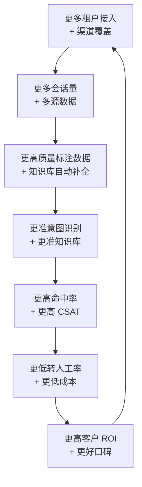

# 产品护城河与增长飞轮

> **来源**：主方案第八章"职责⑥ 可持续竞争优势"前三项
> **关联**：[主方案](../企业AI%20Agent客服优化方案分析框架（基于Coze%20v1.2.4）.md) / [索引页](./README-补充专题总览.md) / [03-竞品矩阵](./03-竞品矩阵与技术雷达.md) / [05-业务场景地图](./05-业务场景地图与行业痛点.md) / [08-产品演进](./08-产品演进与创新机制.md)

## 1. 背景与目标

主方案第五章"路线图"分了 4 阶段，但**未明确护城河和长期壁垒**。本专题用于：

- 构建 **三层护城河**（数据 / 场景 / 生态）
- 设计 **AI 客服增长飞轮**（越用越好）
- 划分 **节奏分层**（速赢 / 中期 / 长期）
- 建立 **战略-执行对齐机制**

## 2. 适用场景与边界

- **适用**：战略复盘、年度规划、投资人路演
- **不适用**：日常迭代（用 PRD/看板）

## 3. 三层护城河

### 3.1 数据护城河

**核心理念**：数据越多越好，越久越准。

| 资产 | 不可复制性 | 价值 |
|---|---|---|
| 多平台对话数据 | 中（用户行为数据本身可被竞品获取） | 训练意图识别 |
| 用户标签与画像 | 高（多平台合并后难复制） | 精准服务 |
| 行业知识图谱 | 高（积累 18+ 月形成壁垒） | 复杂场景问答 |
| 退换货/差评数据 | 中 | 风险预警 |

**竞争对手不可复制的理由**：
- 单一竞品（如阿里店小蜜）只看到阿里平台数据
- 我方跨平台数据 = 更全的用户画像
- 数据沉淀周期 ≥ 18 月，新进入者无法短期追赶

### 3.2 场景护城河

**核心理念**：通用客服 → 行业专属客服的纵深。

| 场景 | 不可复制性 | 价值 |
|---|---|---|
| 临期商品识别 | 中（需结合电商数据） | 转化率 +12% |
| 价保一键申请 | 高（需与电商后台深度集成） | 客诉 -30% |
| 物流异常主动安抚 | 中 | 转人工 -25% |
| 差评危机预警 | 高（需多平台舆情数据） | 差评率 -40% |
| 批量退款合并 | 低 | 节省坐席 10% |

**竞争对手不可复制的理由**：
- 通用客服 SaaS（智齿、网易七鱼）需逐个客户定制场景
- 我方快消品场景已沉淀为"产品功能"（而非客户定制）

### 3.3 生态护城河

**核心理念**：从单点工具 → 工作流闭环。

| 集成 | 不可复制性 | 价值 |
|---|---|---|
| 与电商 ERP/OMS 集成 | 中 | 订单/库存实时查询 |
| 与 WMS/物流 API 集成 | 低 | 物流主动安抚 |
| 与 CRM/会员系统集成 | 中 | RFM 分层服务 |
| 与营销自动化集成 | 高 | 客服→营销闭环 |
| 与数据中台集成 | 高 | 跨域数据洞察 |

**竞争对手不可复制的理由**：
- 集成需要"客户深度合作 + 多方协议 + 长期投入"
- 一旦形成生态，**客户切换成本极高**

## 4. AI 客服增长飞轮

### 4.1 飞轮加速器

每一步都有"加速器"，可缩短周期：

| 飞轮环节 | 加速器 | 缩短效果 |
|---|---|---|
| A → B | 多平台 SDK + 模板化接入 | 接入周期 1 月→1 周 |
| B → C | LLM 自动提取 Q&A 入库 | 知识库维护成本 -70% |
| C → D | 每周模型微调 + A/B 实验 | 准确率持续提升 |
| D → E | 命中规则优化 + 兜底策略 | 命中率从 60% → 80% |
| E → F | 审核循环 + 成本监控 | 单会话成本 -20% |
| F → G | ROI 报告 + 案例营销 | 客户续约率 +20% |
| G → A | 转介绍激励 + 行业标杆 | 新增客户 +30% |

### 4.2 飞轮启动条件

启动飞轮需要 **3 个先决条件**：
1. **≥ 10 个种子租户**（提供初始数据量）
2. **≥ 3 个差异化功能**（场景护城河）
3. **≥ 1 个标杆案例**（用于口碑传播）

如果 3 个条件不满足，飞轮不会自转，需要**手动驱动**（如 BD 主动出击、案例营销）。

## 5. 节奏分层

| 节奏 | 时间窗 | 目标 | 关键动作 |
|---|---|---|---|
| **速赢** | 0-3 月 | 验证产品形态、积累种子用户 | 单平台增强 + 核心指标 + 3 个种子租户 |
| **中期** | 3-9 月 | 飞轮启动 | 多平台 + RAG + 智能工单 + 10 个租户 |
| **长期** | 9-18 月 | 飞轮自转 | 护城河沉淀 + 跨行业扩展 + 50+ 租户 |

### 5.1 速赢阶段（0-3 月）

**目标**：MVP 跑通 + 3 个种子租户
- 单平台（飞书或钉钉）上线
- 核心指标看板 + SLA 监控
- 命中率达到 70%
- 至少 3 个种子租户，CSAT ≥ 4.0

**判定标准**：3 个租户全部续费 → 进入中期

### 5.2 中期阶段（3-9 月）

**目标**：飞轮启动 + 10 个租户
- 多平台（飞书+钉钉+抖店）
- RAG 增强（SKU/订单/物流）
- 智能工单模块
- 命中率达到 80%
- 转人工率 ≤ 15%
- 至少 10 个租户，含 1 个标杆案例

**判定标准**：5 个租户自发转介绍 → 进入长期

### 5.3 长期阶段（9-18 月）

**目标**：飞轮自转 + 50+ 租户
- 三层护城河全面沉淀
- 跨行业扩展（餐饮、本地生活、教育）
- 50+ 租户，覆盖快消品头部品牌
- 行业知识图谱覆盖 80% TOP200 SKU

**判定标准**：客户净推荐值 NPS ≥ 40

## 6. 战略-执行对齐机制

### 6.1 会议节奏

| 频率 | 会议 | 产出 |
|---|---|---|
| **每周** | 周会（30min） | 本周完成 + 下周计划 + 风险 |
| **每两周** | 迭代评审（1h） | 需求评审 + Demo + 回顾 |
| **每月** | 月度复盘（1.5h） | 指标 review + 战略校准 |
| **每季度** | 季度规划（半天） | Roadmap 更新 + 资源分配 |
| **每半年** | 战略复盘（1 天） | 护城河 review + 飞轮健康度 |

### 6.2 飞轮健康度指标

每季度评估 4 个指标判断飞轮是否自转：

| 指标 | 健康值 | 警戒值 |
|---|---|---|
| **客户净推荐值 NPS** | ≥ 40 | < 20 |
| **新客户自然增长占比** | ≥ 30% | < 10% |
| **老客户续约率** | ≥ 90% | < 70% |
| **跨平台数据沉淀量** | 周增 5% | 周增 < 1% |

> 若 4 个指标中有 2 个低于警戒值，触发"飞轮干预"（BD 主动出击、降低价格、增加功能等）。

## 7. 落地步骤

1. **Month 1**：完成三层护城河定义 + 增长飞轮图
2. **Month 2**：建立季度复盘机制
3. **Month 3**：定义飞轮健康度指标 + 监控看板
4. **持续**：每季度飞轮健康度 review

## 8. 验证标准

- [ ] 三层护城河有清晰的"竞争对手不可复制理由"
- [ ] 增长飞轮有 7 个加速器
- [ ] 节奏分层有明确的"判定标准"
- [ ] 飞轮健康度指标上线监控

## 9. 风险与对冲

| 风险 | 对冲 |
|---|---|
| 飞轮启动慢（数据量不够） | 主动 BD 拉种子租户 + 提供 3 个月免费 |
| 数据护城河被跨平台政策打破 | 强化"实时计算"和"用户画像"层 |
| 场景护城河被竞品快速复制 | 持续投入新场景（每季度 1-2 个） |
| 生态护城河依赖外部 | 自建"AI 中台"，减少对单一 SaaS 依赖 |

## 10. 关联文档

- [01-产品定位与OnePager.md](./01-产品定位与OnePager.md) — 护城河落到 One-Pager
- [03-竞品矩阵与技术雷达.md](./03-竞品矩阵与技术雷达.md) — 竞品差异化
- [05-业务场景地图与行业痛点.md](./05-业务场景地图与行业痛点.md) — 场景护城河
- [08-产品演进与创新机制.md](./08-产品演进与创新机制.md) — V2.0/V3.0/V4.0 演进路径
