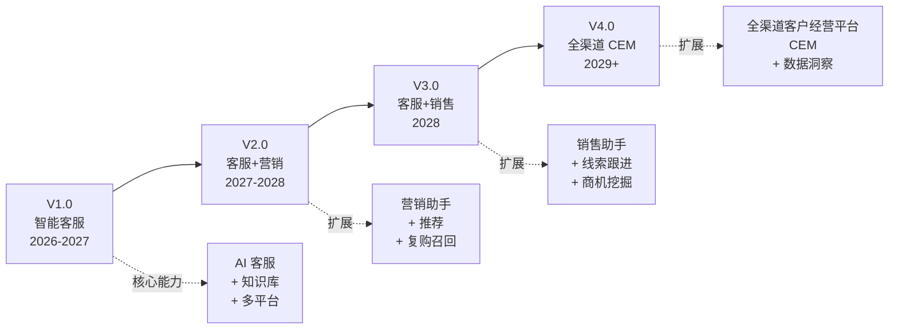

# 产品演进与创新机制

> **来源**：主方案第八章"职责⑥-3/④ 创新机制"和"产品边界与扩展性"
> **关联**：[主方案](../企业AI%20Agent客服优化方案分析框架（基于Coze%20v1.2.4）.md) / [索引页](./README-补充专题总览.md) / [07-护城河与飞轮](./07-产品护城河与增长飞轮.md) / [01-产品定位](./01-产品定位与OnePager.md)

## 1. 背景与目标

JD 强调"思考新的可能性"，主方案聚焦"客服"，但**未提创新 Pipeline 和产品扩展路径**。本专题用于：

- 规划 **V1.0 → V4.0 产品演进路线**
- 建立 **创新三件套**（客户深访/前沿扫描/Hackathon）
- 设置 **创新预算**（占研发 10%）
- 给出 **优先级矩阵 ROI 估算模板**

## 2. 适用场景与边界

- **适用**：年度规划、季度路线图调整、创新机制建设
- **不适用**：单个需求评审

## 3. V1.0 → V4.0 产品演进

### 3.1 演进路径总览



### 3.2 V1.0 智能客服（当前 → 6 月内）

**核心能力**：
- 多平台 AI 客服（飞书/钉钉/抖店/微信）
- RAG 知识库
- 智能工单
- 核心指标 + A/B 实验

**目标客户**：电商客服团队
**商业模式**：按会话量订阅
**目标营收**：¥X00 万/年（具体数据由商业团队定）

### 3.3 V2.0 客服+营销助手（6-18 月）

**新增能力**：
- **AI 推荐**：根据用户画像 + 上下文推荐商品
- **优惠券智能发放**：RFM 分层 → 个性化券
- **复购召回**：在客服对话中识别流失风险 → 触发召回
- **活动模板**：营销活动话术自动化

**目标客户**：电商品牌商、零售集团
**商业模式**：客服订阅 + 营销模块加购
**预期客单价提升**：50-100%

### 3.4 V3.0 客服+销售助手（18-30 月）

**新增能力**：
- **线索挖掘**：从客服对话中识别 B 端线索
- **商机评分**：根据客户互动深度打分
- **自动跟进**：AI 起草跟进邮件/消息
- **CRM 集成**：与 Salesforce/HubSpot/纷享销客打通

**目标客户**：B2B 企业（设备/SaaS/服务）
**商业模式**：客服订阅 + 销售模块加购

### 3.5 V4.0 全渠道 CEM（30+ 月）

**新增能力**：
- **统一客户视图**：跨客服/营销/销售/会员
- **数据洞察**：自动生成"客户健康度"看板
- **AI 营销官**：从"工具"升级为"虚拟岗位"
- **行业解决方案**：美妆/食品/3C/母婴等垂直版本

**目标客户**：零售集团、连锁品牌
**商业模式**：平台费 + 增值模块

## 4. 创新三件套

### 4.1 客户深访

| 项目 | 规范 |
|---|---|
| **频率** | 每季度 10 场 |
| **对象** | 3 个种子租户 + 4 个中期租户 + 3 个流失/潜在租户 |
| **形式** | 1v1 深度访谈（1.5h/场） |
| **产出** | 客户洞察报告（按 JTBD 框架组织） |
| **应用** | 季度规划输入 + 产品 One-Pager 校准 |

#### 访谈提纲模板

```markdown
## 客户深访提纲

### 1. 背景
- 您的角色 / 团队规模 / 业务规模
- 当前的客服体系（人/工具/痛点）

### 2. 现状
- 客服团队 1 天的典型流程
- 最花时间的 3 件事
- 最痛的 1 件事

### 3. AI 客服使用
- 当前是否使用 AI 客服？用了哪家？
- 满意/不满意的点
- 如果有一个魔法棒可以解决 1 件事，您会解决什么？

### 4. 价值评估
- 您愿意为"解决这件事"付多少钱？
- 您愿意接受什么样的部署方式（SaaS/私有化）？

### 5. 决策流程
- 谁是 AI 客服采购的决策人？
- 通常决策周期多久？
- 会参考哪些信息？
```

### 4.2 前沿扫描

| 项目 | 规范 |
|---|---|
| **频率** | 每月 1 次（1h 内部分享会） |
| **来源** | arXiv / GitHub Trending / ProductHunt / 国内 HuggingFace / 36Kr / 虎嗅 |
| **输出** | 月度技术简报（5-10 项新技术摘要） |
| **应用** | 技术雷达更新（见 [03-竞品矩阵](./03-竞品矩阵与技术雷达.md)） |

#### 月度技术简报模板

```markdown
## 2026-07 技术简报

### 重点关注
1. [技术名] - [核心创新] - [落地难度] - [应用场景]
2. ...

### 国内动态
- 字节豆包 X.X 发布：[关键能力]
- DeepSeek X.X：[关键能力]

### 国际动态
- OpenAI / Anthropic / Google：[关键能力]

### 我方建议
- [ ] 采纳：____
- [ ] 试验：____
- [ ] 评估：____
- [ ] 暂缓：____
```

### 4.3 内部 Hackathon

| 项目 | 规范 |
|---|---|
| **频率** | 每半年 1 次（2 天） |
| **主题** | 围绕"AI 客服 + 新技术"开放命题 |
| **形式** | 自由组队（3-4 人/组），48h 内做出可演示原型 |
| **奖励** | Top 3 进入产品 backlog，奖金/期权激励 |
| **产出** | Top3 提案 + 可演示 Demo + 落地评估 |

## 5. 创新预算

| 项目 | 占比 | 说明 |
|---|---|---|
| **总研发预算** | 100% | 基线 |
| **核心产品研发** | 70% | 现有产品迭代 + 维护 |
| **平台与基础设施** | 15% | 性能/可观测/安全 |
| **创新预研** | 10% | 创新三件套 + Hackathon |
| **战略储备** | 5% | 长期项目（如 V3.0/V4.0 预研） |

> **关键纪律**：创新预算不能挪用。即使核心产品压力大，创新预算必须保持。

## 6. 优先级矩阵 + ROI 估算

### 6.1 优先级矩阵

| 优先级 | 标准 | 投入占比 |
|---|---|---|
| **P0 必做** | 直接影响核心指标 / 客户续约 | 60% |
| **P1 重要** | 提升竞争力 / 1-2 季度内可量化 | 25% |
| **P2 增值** | 长期价值 / 季度 OKR 关联 | 10% |
| **P3 储备** | 探索性 / 创新预研 | 5% |

### 6.2 ROI 估算模板

```markdown
## [需求名] ROI 估算

### 投入
- 研发：X 人月
- LLM API：¥X/月
- 第三方服务：¥X/月
- 总成本：¥X

### 产出（6 个月内）
- 节省人力：¥X（按 [04-指标体系](./04-指标体系与A-B实验.md) §8.1 公式）
- GMV 增量：¥X（按 §8.2 公式）
- 客户留存：¥X（按 §8.3 公式）
- 总价值：¥X

### ROI
- 6 月 ROI：(总价值 - 总成本) / 总成本
- 12 月 ROI：...
- 回收期：X 月

### 决策
- [ ] P0 必做
- [ ] P1 重要
- [ ] P2 增值
- [ ] P3 储备
```

## 7. 落地步骤

1. **Month 1**：明确 V1.0 → V4.0 演进路线，与 CEO/CMO 对齐
2. **Month 2**：建立创新三件套机制（深访清单、技术简报模板、Hackathon 规则）
3. **Quarter 1**：第一次客户深访（10 场）+ 第一次 Hackathon
4. **持续**：每月 1 次技术分享会 + 每季度 1 次客户深访 + 每半年 1 次 Hackathon

## 8. 验证标准

- [ ] V1.0 → V4.0 路线有明确的能力清单和商业模式
- [ ] 创新三件套机制落地（深访清单/技术简报/Hackathon 规则）
- [ ] 创新预算占研发 10%，且不被挪用
- [ ] 优先级矩阵用于所有需求评审
- [ ] 每次需求评审有 ROI 估算

## 9. 风险与对冲

| 风险 | 对冲 |
|---|---|
| 创新预算被核心产品挤压 | 财务独立 + 季度 review |
| Hackathon 走过场 | 强制"可演示 Demo" + Top3 必进 backlog |
| 客户深访样本偏差 | 覆盖种子+中期+流失/潜在三类 |
| V3.0/V4.0 提前投入 | 严格按飞轮启动条件（见 [07-护城河](./07-产品护城河与增长飞轮.md)）判定 |
| 前沿扫描变"技术新闻" | 强制"我方建议"四象限分类 |

## 10. 关联文档

- [01-产品定位与OnePager.md](./01-产品定位与OnePager.md) — V1.0 边界与 One-Pager 对齐
- [04-指标体系与A-B实验.md](./04-指标体系与A-B实验.md) — ROI 估算公式
- [07-产品护城河与增长飞轮.md](./07-产品护城河与增长飞轮.md) — 飞轮启动条件决定 V2.0/V3.0 时机
- [03-竞品矩阵与技术雷达.md](./03-竞品矩阵与技术雷达.md) — 前沿扫描依据
