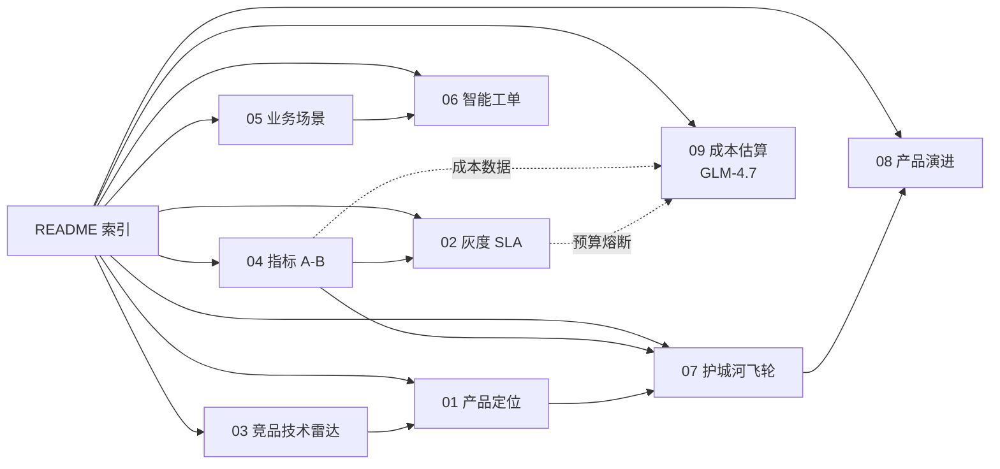

# AI 客服方案补充专题总览

> **来源**：本文档为《企业AI Agent客服优化方案分析框架》第八章"可完善点"的分文件落地索引。
> **关联**：[主方案文档](../企业AI%20Agent客服优化方案分析框架（基于Coze%20v1.2.4）.md)

## 1. 背景与目标

主方案文档已较厚（8 章 > 500 行），且 27 项可完善点散落在第八章各小节。为保持主方案聚焦"技术方案 + 诊断"，将可完善点按"职责模块"归并为 **8 份独立专题文档**，沉淀到本目录。每份专题独立可交付，按 P0→P1→P2 优先级逐步推进。

## 2. 适用场景与边界

- **适用**：产品经理 / 项目负责人按专题查阅、按模块推进
- **不适用**：需要从 0 了解全貌时，应先读主方案
- **边界**：本目录文档**不重复**主方案的技术细节，只做"产品化落地"的延伸

## 3. 8 份专题文档清单

| # | 文件名 | 优先级 | 关联主方案章节 | 关联 JD 职责 | 状态 |
|---|---|---|---|---|---|
| 01 | [01-产品定位与OnePager.md](./01-产品定位与OnePager.md) | P0 | 第八章 ①-1 | ① 全生命周期 | 已发布 |
| 02 | [02-灰度发布与SLA验收标准.md](./02-灰度发布与SLA验收标准.md) | P0 | 第八章 ①-2/①-3 | ① 全生命周期 | 已发布 |
| 03 | [03-竞品矩阵与技术雷达.md](./03-竞品矩阵与技术雷达.md) | P0 | 第八章 ②-1/②-2 | ② AI 探索调研 | 已发布 |
| 04 | [04-指标体系与A-B实验.md](./04-指标体系与A-B实验.md) | P0 | 第八章 ④-1~4 | ④ 数据敏感 | 已发布 |
| 05 | [05-业务场景地图与行业痛点.md](./05-业务场景地图与行业痛点.md) | P1 | 第八章 ③-1/③-2 | ③ 电商业务 | 已发布 |
| 06 | [06-智能工单模块设计.md](./06-智能工单模块设计.md) | P1 | 第八章 ③-4 | ③ 电商业务 | 已发布 |
| 07 | [07-产品护城河与增长飞轮.md](./07-产品护城河与增长飞轮.md) | P2 | 第八章 ⑥-1/⑥-2/⑥-5 | ⑥ 竞争优势 | 已发布 |
| 08 | [08-产品演进与创新机制.md](./08-产品演进与创新机制.md) | P2 | 第八章 ⑥-3/⑥-4 | ⑥ 竞争优势 | 已发布 |
| 09 | [09-成本估算与优化-GLM4.7.md](./09-成本估算与优化-GLM4.7.md) | P0 | 第六章 成本对冲 | ④ 数据敏感 + ⑥ 竞争优势 | 已发布 |

## 4. 推荐阅读路径

```
P0 必读（启动 1 周内）
  ① 03 竞品矩阵 → 找准差异化坐标
  ② 01 产品定位 → 锁定价值主张
  ③ 04 指标体系 → 定义北极星
  ④ 02 灰度与 SLA → 建立交付标准

P1 重要（启动 1 月内）
  ⑤ 05 业务场景地图 → 细化产品形态
  ⑥ 06 智能工单 → 拓展产品边界

P2 增值（启动 1 季度内）
  ⑦ 07 护城河与飞轮 → 思考长期壁垒
  ⑧ 08 产品演进 → 规划未来 18 月
```

## 5. 文档依赖关系



## 6. 维护责任与频率

| 文档 | 建议更新频率 | 触发更新条件 |
|---|---|---|
| 01-04（P0） | 每月 | 业务调整、指标基线变化 |
| 05-06（P1） | 每季度 | 业务场景新增/调整 |
| 07-08（P2） | 每半年 | 战略复盘、年度规划 |

## 7. 关联文档

- **主方案**：[企业AI Agent客服优化方案分析框架（基于Coze v1.2.4）.md](../企业AI%20Agent客服优化方案分析框架（基于Coze%20v1.2.4）.md)
- **原始配置手册**：`企业AI Agent客服应用 - Coze v1.2.4配置手册（低代码平台）.md`（位于 03-配置手册 目录）
