# Agentic AI 通用问题及解决方案

> **版本**：v1.1 | **定位**：Agent 设计通用知识库，适用于所有对话式 Agent 场景
> **经验来源**：Coze 平台 5 个版本迭代实战 + 行业案例调研
> **v1.1 更新**：新增第五章"Coze 节点方案详解"，包含 12 个通用问题的完整 Coze 节点实现方案

---

## 目录

- [一、Agent 设计三层次模型](#一agent-设计三层次模型)
- [二、12 个通用问题详解](#二12-个通用问题详解)
  - [A 类：理解层问题](#a-类理解层问题)
  - [B 类：能力边界问题](#b-类能力边界问题)
  - [C 类：升级处理问题](#c-类升级处理问题)
  - [D 类：体验层问题](#d-类体验层问题)
- [三、速查表](#三速查表)
- [四、设计原则总结](#四设计原则总结)
- [五、Coze 节点方案详解](#五coze-节点方案详解)
  - [问题 1：用户描述不清晰](#问题-1用户描述不清晰)
  - [问题 2：一个请求包含多个意图](#问题-2一个请求包含多个意图)
  - [问题 3：用户中途转变意图](#问题-3用户中途转变意图)
  - [问题 4：用户要求超出 Agent 能力范围](#问题-4用户要求超出-agent-能力范围)
  - [问题 5：知识库检索未命中](#问题-5知识库检索未命中)
  - [问题 6：用户要求找人工](#问题-6用户要求找人工)
  - [问题 7：Agent 多次无法解决（隐性升级）](#问题-7agent-多次无法解决隐性升级)
  - [问题 8：高敏感/高风险操作](#问题-8高敏感高风险操作)
  - [问题 9：用户情绪负面](#问题-9用户情绪负面)
  - [问题 10：多轮对话上下文丢失](#问题-10多轮对话上下文丢失)
  - [问题 11：回答质量不可控](#问题-11回答质量不可控)
  - [问题 12：Agent 回复过于冗长/机械](#问题-12agent-回复过于冗长机械)

---

## 一、Agent 设计三层次模型

设计一个 Agent，本质上要解决三个层次的问题：

```
┌─────────────────────────────────────────────────┐
│  第一层：业务流程层（场景相关）                      │
│  深入理解业务 → 拆解为原子步骤 → 识别决策点          │
├─────────────────────────────────────────────────┤
│  第二层：智能重构层（场景相关）                      │
│  用 LLM 替代非确定性步骤                            │
│  用工具（数据库/API/搜索）增强确定性步骤              │
│  设计 Prompt 和审核机制                             │
├─────────────────────────────────────────────────┤
│  第三层：通用交互层（场景无关）                       │
│  处理用户描述不清 / 找人工 / 意图转变 / 情绪负面 / ... │
└─────────────────────────────────────────────────┘
```

- **第一层和第二层是场景相关的**：每个业务（客服、销售、HR、教育）的流程不同，需要针对性设计
- **第三层是场景无关的**：无论做什么 Agent，这 12 个通用问题都会遇到

**最高效的开发顺序**：先把第三层（通用交互层）设计好，再填充第一、二层的业务内容。因为第三层是所有 Agent 的"基础设施"。

---

## 二、12 个通用问题详解

### A 类：理解层问题

> 用户表达 → Agent 理解之间的鸿沟

---

### 问题 1：用户描述不清晰

**问题本质**：用户的自然语言是模糊的、不完整的、多义的。Agent 不能"猜"，必须主动澄清。

**错误做法**：
```
用户："我要改一下那个东西"
Agent：（直接猜）"好的，已帮你修改订单地址。"  ← 可能猜错
```

**正确做法 — 结构化澄清（Structured Clarification Request）**：

```
用户："我要改一下那个东西"
  │
  ▼
Agent 判断：意图模糊（confidence < 0.5）
  │
  ▼
追问策略（三选一）：
  ├─ 有初步方向 → "你是想改订单的收货地址，还是修改商品？"
  ├─ 有部分信息 → "你想改的是订单 #12345 对吗？具体改什么？"
  └─ 完全模糊   → "我可以帮你改订单、改地址、改支付方式，你需要哪个？"
```

**设计原则**：

| 原则 | 说明 |
|------|------|
| 提供具体选项 | 不要问"你想做什么？"，而是给 ≤ 4 个选项 |
| 每次只问一个问题 | 不要一次问多个，增加用户负担 |
| 追问不超过 2 轮 | 第 3 轮直接转人工，防止无限循环 |
| 选项按概率排序 | 最可能的选项放第一个 |

**Coze 实现**：意图识别节点 confidence < 0.5 → 意图澄清节点（LLM 动态生成追问）

---

### 问题 2：一个请求包含多个意图

**问题本质**：用户一句话里塞了多个诉求，Agent 需要拆解并逐一处理。

**示例**：
```
用户："帮我查一下订单物流，顺便把地址改了"
  │
  ▼
Agent 拆解：
  ├─ 意图 1：查物流 → 知识库检索 → 返回结果
  └─ 意图 2：改地址 → 需要更多信息（新地址是什么？）
```

**设计模式**：

| 策略 | 适用场景 | 说明 |
|------|---------|------|
| 逐个执行 | 意图之间有依赖 | 先处理第一个，完成后再处理第二个 |
| 并行执行 | 意图之间无依赖 | 同时处理，最后汇总结果 |
| 确认优先级 | 意图冲突 | "你想先查物流还是先改地址？" |

**关键原则**：
- 多步骤任务时显示**进度指示**（"第 1 步/共 2 步：正在查询物流..."）
- 如果意图 2 依赖意图 1 的结果，必须**串行执行**
- 预判依赖关系，避免执行到一半才发现缺少信息

---

### 问题 3：用户中途转变意图

**问题本质**：对话进行到一半，用户突然切换话题。Agent 需要判断是"补充信息"还是"新意图"。

**示例**：
```
用户："免费版有什么限制？"     → 意图：product_pricing
Agent："免费版限制..."
用户："对了，怎么接入微信？"    → 意图突变！
```

**意图切换检测规则**：

| 信号 | 判断 | 处理方式 |
|------|------|---------|
| "对了"、"另外"、"换个问题" | 明确切换 | 直接切换到新意图，旧意图归档 |
| 与当前话题相关 | 补充信息 | 继续当前流程 |
| 与当前话题无关，无切换词 | 可能切换 | 确认："你是想问新问题，还是接着刚才的说？" |

**设计原则**：
- **不要强制用户完成旧流程**才能开始新的
- 切换时**保留上下文**，用户可能还会切回来
- 如果旧流程已有部分结果（如已填了一半的信息），询问是否保存

---

### B 类：能力边界问题

> Agent 能力 → 用户期望之间的错位

---

### 问题 4：用户要求超出 Agent 能力范围

**问题本质**：Agent 必须知道自己"不能做什么"，并优雅地告知用户。

**错误做法**：
```
用户："帮我开发一个APP"
Agent："我不知道怎么做。"  ← 冷漠，没有帮助
Agent："我是AI，无法开发APP。"  ← 暴露AI身份，体验差
```

**正确做法 — 能力透明 + 引导回流**：
```
用户："帮我开发一个APP"
  │
  ▼
Agent（LLM 动态生成）：
"这个我帮不了，我主要能解答产品使用和价格相关的问题。
 你是想了解我们产品的功能吗？"
```

**设计原则**：
- **首次交互就告知能力范围**（不要等用户问了才说"我做不了"）
- 拒绝时**提供替代方案**（引导到能力范围内的话题）
- 禁用词："我不知道"、"我无法"、"我是AI"
- 推荐话术："这个我帮不了，但我可以帮你..."、"我主要能解答...相关的问题"

---

### 问题 5：知识库检索未命中

**问题本质**：用户的问题在知识库中没有答案。Agent 不能编造信息，必须诚实面对。

**设计模式 — 引导补充 + 兜底回复**：

```
知识库检索结果：空
  │
  ├─ 第 1 次未命中 → 引导用户补充描述
  │   "你能具体说一下是哪个功能吗？比如是数据导入还是权限设置？"
  │
  ├─ 第 2 次未命中 → 兜底回复 + 记录日志
  │   "这个问题我暂时没有找到答案，已记录反馈给团队。"
  │
  └─ 防止无限引导（guide_cnt 控制轮次，最多引导 2 次）
```

**关键原则**：
- **绝不编造**：知识库没有的，就说没有
- 引导时提供**具体方向**（"比如是 A 还是 B？"），而非"你能说详细点吗？"
- 未命中问题要**记录到数据库**，定期分析补充知识库

---

### C 类：升级处理问题

> Agent → 人工的过渡

---

### 问题 6：用户要求找人工

**问题本质**：不能一次就转（浪费人工资源），也不能无限挽留（激怒用户）。

**设计模式 — 渐进式升级（Progressive Escalation）**：

```
第 1 次"找人工"
  │
  ▼
挽留引导（LLM 动态生成）：
"不好意思没能帮到你。你能说一下具体遇到了什么问题吗？
 也许我可以帮你解决。"
  │
  ▼ 用户仍坚持
第 2 次"找人工"
  │
  ▼
直接给出联系方式 / 转接入口
```

**计数重置规则（关键！）**：

| 事件 | transfer_cnt 操作 | 原因 |
|------|-------------------|------|
| 找人工规则命中 | +1 | 累计转接请求 |
| 业务缓存命中 | 重置为 0 | 用户正常咨询了业务，不算"连续"找人工 |
| 未命中任何缓存 | 重置为 0 | 同上 |

> 只有**连续**找人工才触发转接。用户正常咨询业务问题后，找人工计数会被重置。

**转人工时需传递的信息**：

| 信息 | 用途 |
|------|------|
| 对话记录全文 | 人工接手后了解上下文 |
| 意图分类 | 快速判断问题类型 |
| 已收集的关键信息 | 避免用户重复描述 |
| 转接原因 | 帮助人工优先处理 |

---

### 问题 7：Agent 多次无法解决（隐性升级）

**问题本质**：用户没说"找人工"，但 Agent 反复失败。Agent 需要**自我感知**并主动升级。

**设计模式 — 三次失败自动升级**：

```
第 1 次理解失败 → "我没太理解，能换个说法吗？"
第 2 次理解失败 → "我可能不太擅长这个问题，你可以试试这样问..."
第 3 次理解失败 → "这个问题我确实处理不了，帮你转接人工好吗？"
```

**四类隐性升级触发条件**（来源：[Escalation Pathways](https://www.aiuxdesign.guide/patterns/escalation-pathways)）：

| 触发类型 | 条件 | 动作 |
|---------|------|------|
| 置信度不足 | confidence 连续 3 次 < 0.5 | 主动建议转人工 |
| 知识库连续未命中 | 连续 2 次检索无结果 | 记录 + 转人工 |
| 审核连续不通过 | 答案审核 2 次不通过 | 转人工 |
| 情绪持续负面 | 连续 2 轮检测到负面情绪 | 主动转人工 |

---

### 问题 8：高敏感/高风险操作

**问题本质**：某些操作不可逆或影响重大，Agent 不能自动执行。

**设计模式 — 分级确认**：

| 操作风险等级 | 确认方式 | 示例 |
|------------|---------|------|
| 低（查询类） | 无需确认 | "你的订单已发货，预计 3 天到达" |
| 中（修改类） | 内联确认 | "已更新你的邮箱偏好为每周摘要" |
| 高（金融/不可逆） | 显式确认 | "将退款 ¥249 到尾号 4567 的卡，确认吗？" |

**关键原则**：
- 涉及**金钱、个人信息删除、不可逆操作**时，必须显式确认
- 确认信息要**具体**（显示金额、卡号后四位等），不要笼统地"确认执行？"
- 用户拒绝确认后，提供替代方案

---

### D 类：体验层问题

> 交互质量与用户感受

---

### 问题 9：用户情绪负面

**问题本质**：用户表达不满、愤怒、焦虑时，Agent 需要先处理情绪，再处理问题。

**设计模式 — 情绪感知 → 安抚 → 升级**：

```
情绪检测：negative（愤怒、不满、焦虑）
  │
  ▼
安抚（LLM 动态生成，不超过 3 句话）：
"不好意思给你带来不好的体验，我来帮你处理这个问题。"
  │
  ▼
同时触发升级处理流程
（负面情绪 → 高概率需要人工介入）
```

**设计原则**：
- **先共情，再解决问题**（不要一上来就给方案）
- 安抚话术**简短真诚**（不超过 3 句话）
- 负面情绪 + 业务问题 → 安抚后**直接转人工**
- 禁止说"我理解你的感受"然后继续机械回复

---

### 问题 10：多轮对话上下文丢失

**问题本质**：对话轮次多了之后，Agent "忘了"之前说了什么。

**设计模式 — 三层记忆系统**：

| 层级 | 内容 | 持久性 | 实现方式 |
|------|------|-------|---------|
| 短期记忆 | 当前对话历史 | 会话内 | 平台会话历史（自动维护） |
| 工作记忆 | 当前任务状态 | 会话内 | 会话变量（计数器、标记位等） |
| 长期记忆 | 用户偏好、历史交互 | 跨会话 | 数据库 + 知识库 |

**关键原则**：
- **指代消解**："那个"、"这个"需要结合上下文理解（平台会话历史自动处理）
- **状态追踪**：当前进行到哪一步、已收集了哪些信息（会话变量）
- **摘要压缩**：对话过长时，对早期对话做摘要（依赖模型上下文窗口）
- **会话变量只支持 String 类型**（Coze 限制），代码中需 int() 转换

---

### 问题 11：回答质量不可控

**问题本质**：LLM 可能编造信息、泄露隐私、语气不当。不能直接把 LLM 输出给用户。

**设计模式 — 审核 + 重试 + 兜底**：

```
答案生成 → 答案审核（四维度）
  │
  ├─ 通过 → 输出给用户
  ├─ 不通过 + 未重试 → 带修改建议重新生成（最多 1 次）
  └─ 不通过 + 已重试 → 兜底回复 / 转人工
```

**审核四维度**：

| 维度 | 审核内容 | 不通过示例 |
|------|---------|----------|
| 准确性 | 回答是否全部来自知识库 | 编造了知识库中没有的信息 |
| 安全性 | 是否包含敏感信息 | 泄露手机号、身份证号 |
| 规范性 | 语气是否友好、格式是否清晰 | 语气生硬、无分点说明 |
| 完整性 | 是否回答了核心问题 | 遗漏了用户问的关键点 |

**关键原则**：
- 最多重试 **1 次**，防止无限循环
- 审核不通过时传递 **revision_hint**（具体修改建议），而非笼统的"请改进"
- 审核节点是**可选的**，会增加 1-2s 延迟，对延迟敏感的场景可跳过

---

### 问题 12：Agent 回复过于冗长/机械

**问题本质**：LLM 倾向于生成大段文字，用户不需要"小作文"。

**设计模式**：

| 问题 | 解决方案 |
|------|---------|
| 回复太长 | Prompt 中明确限制字数（"不超过 300 字"） |
| 格式混乱 | 涉及步骤时用编号分点，涉及对比时用表格 |
| 语气机械 | 固定文案改为 LLM 动态生成（根据用户问题个性化回复） |
| 暴露 AI 身份 | 禁止"我是AI"、"我是机器人"、"作为AI助手"等表述 |

**动态生成 vs 固定文案的选择**：

| 节点类型 | 推荐方式 | 原因 |
|---------|---------|------|
| 挽留引导 | LLM 动态生成 | 需要根据用户具体问题个性化挽留 |
| 能力引导 | LLM 动态生成 | 需要根据用户问题动态告知能力范围 |
| 意图澄清 | LLM 动态生成 | 需要根据初步意图生成有针对性的追问 |
| 情绪安抚 | LLM 动态生成 | 需要根据情绪程度动态调整安抚力度 |
| 未命中引导 | LLM 动态生成 | 需要根据用户原始问题动态引导 |
| 通用回复 | 固定文案即可 | 闲聊回复不需要个性化 |

> 使用小模型（如 Lite 7B）即可完成动态生成，成本低、速度快。

---

## 三、速查表

| # | 问题 | 一句话方案 | 关键设计点 |
|---|------|----------|----------|
| 1 | 用户描述不清晰 | 结构化澄清，提供 ≤4 个选项，追问 ≤2 轮 | confidence < 0.5 触发 |
| 2 | 多意图请求 | 拆解后逐个执行，显示进度 | 预判依赖关系 |
| 3 | 中途转变意图 | 检测切换信号，保留上下文 | 不强制完成旧流程 |
| 4 | 超出能力范围 | 能力透明 + 引导回流 | 首次交互就告知范围 |
| 5 | 知识库未命中 | 引导补充 → 兜底回复，≤2 轮 | guide_cnt 控制轮次 |
| 6 | 用户找人工 | 两次触发：第 1 次挽留，第 2 次转接 | transfer_cnt + 重置机制 |
| 7 | 多次无法解决 | 3 次失败自动升级 | 四类隐性升级触发条件 |
| 8 | 高风险操作 | 分级确认（低/中/高） | 高风险必须显式确认 |
| 9 | 用户情绪负面 | 先共情再处理，负面→转人工 | 安抚 ≤3 句话 |
| 10 | 上下文丢失 | 三层记忆（短期/工作/长期） | 会话变量 + 数据库 |
| 11 | 回答质量不可控 | 审核 + 重试（最多1次）+ 兜底 | 四维度审核 + revision_hint |
| 12 | 回复冗长机械 | 字数限制 + 结构化 + 动态生成 | 引导类节点用 LLM |

---

## 四、设计原则总结

### 核心原则

1. **先设计"不快乐路径"**：80% 的设计精力应放在处理误解、错误和边界情况上，正常路径自己能跑通
2. **确定性优先**：能用规则/代码解决的不要用 LLM，LLM 只处理真正需要理解力和生成力的环节
3. **绝不编造**：知识库没有的就承认没有，引导用户补充或转人工
4. **渐进式升级**：不要一次就转人工，也不要无限挽留，设计合理的梯度
5. **保留上下文**：无论切换意图、转人工还是升级，都要传递完整的对话上下文

### 设计优先级

```
减少延迟 > 提升准确率 > 提升体验 > 增加功能
```

### 质量指标

| 指标 | 健康阈值 | 说明 |
|------|---------|------|
| 首次解决率 | > 60% | 用户第一次交互就得到满意答案 |
| 转人工率 | < 15% | 自动解决的比例 |
| 知识库命中率 | > 70% | 检索到相关内容的比例 |
| 审核通过率 | > 80% | 答案质量达标的比例 |
| 平均对话轮次 | < 8 轮 | 从提问到解决的平均轮数 |
| 用户满意度 | > 4.2/5 | 用户评分 |

---

## 五、Coze 节点方案详解

> 本章包含 12 个通用问题的完整 Coze 节点实现方案，每个问题提供 Mermaid 流程图、图文校验表、文本版流程、节点配置详情表及代码/Prompt。

---

### 问题 1：用户描述不清晰

#### 1.1 Mermaid 流程图

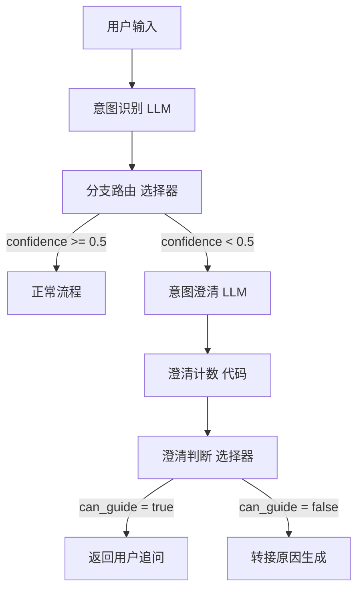

#### 1.2 图文校验表

| 序号 | 连线（起点 → 终点） | 连线标注 | 文本描述 | 一致性 |
|------|---------------------|----------|----------|--------|
| 1 | 用户输入 → 意图识别 LLM | 无 | 用户输入进入意图识别节点，由 LLM 进行初步意图判断 | ✅ |
| 2 | 意图识别 LLM → 分支路由 选择器 | 无 | 意图识别输出 confidence 分数，传递给分支路由进行判断 | ✅ |
| 3 | 分支路由 选择器 → 正常流程 | confidence >= 0.5 | 置信度达到阈值，走正常业务流程 | ✅ |
| 4 | 分支路由 选择器 → 意图澄清 LLM | confidence < 0.5 | 置信度低于阈值，触发意图澄清流程 | ✅ |
| 5 | 意图澄清 LLM → 澄清计数 代码 | 无 | 意图澄清生成追问后，进入澄清计数节点累计追问次数 | ✅ |
| 6 | 澄清计数 代码 → 澄清判断 选择器 | 无 | 澄清计数输出 can_guide 标志，传递给澄清判断选择器 | ✅ |
| 7 | 澄清判断 选择器 → 返回用户追问 | can_guide = true | 追问次数未超限，返回追问给用户继续澄清 | ✅ |
| 8 | 澄清判断 选择器 → 转接原因生成 | can_guide = false | 追问次数已达上限（>=2次），转接至原因生成节点 | ✅ |

#### 1.3 文本版流程

```
步骤 1：用户输入 → 意图识别（LLM）
  - LLM 对用户输入进行意图识别，输出 intent 和 confidence 分数。

步骤 2：意图识别 → 分支路由（选择器）
  - 选择器根据 confidence 进行分支判断：
    - confidence >= 0.5 → 进入正常流程，执行后续业务逻辑。
    - confidence < 0.5 → 进入意图澄清流程。

步骤 3：分支路由 → 意图澄清（LLM）
  - LLM 根据初步意图和用户原始问题，动态生成一段简短有针对性的追问。
  - 追问策略：有初步方向则确认选项；有部分信息则针对性追问；完全模糊则提供选项菜单。

步骤 4：意图澄清 → 澄清计数（代码）
  - 代码节点读取会话变量 guide_cnt（默认 0），加 1 后输出。
  - 判断 guide_cnt 是否 < 2（MAX_GUIDE）：
    - < 2 → can_guide = true
    - >= 2 → can_guide = false

步骤 5：澄清计数 → 澄清判断（选择器）
  - can_guide = true → 返回用户追问，等待用户再次输入，循环回到步骤 1。
  - can_guide = false → 进入转接原因生成，输出兜底回复或转人工。
```

#### 1.4 节点配置详情表

| 节点名称 | 节点类型 | 输入 | 输出 | 说明 |
|----------|----------|------|------|------|
| 用户输入 | Start | 用户消息文本 | user_query | Coze 内置起始节点，接收用户输入 |
| 意图识别 | LLM（Lite 7B / temp 0.1 / JSON输出） | user_query | intent, confidence | 对用户输入做意图分类，输出意图标签和置信度分数（0~1） |
| 分支路由 | 选择器（If/Else） | confidence | — | 判断 confidence 是否 >= 0.5，决定走正常流程还是澄清流程 |
| 正常流程 | LLM / 知识库 | intent, user_query | final_answer | 置信度足够时，走标准业务流程处理用户请求 |
| 意图澄清 | LLM（Lite 7B / temp 0.4 / 文本输出） | user_query, intent（初步） | clarification_question | 根据初步意图和用户问题，生成针对性追问 |
| 澄清计数 | 代码（Python） | guide_cnt（会话变量） | guide_cnt_out, can_guide | 读取追问次数并 +1，判断是否超过最大追问次数（MAX_GUIDE=2） |
| 澄清判断 | 选择器（If/Else） | can_guide | — | can_guide=true 返回追问；can_guide=false 转接兜底 |
| 返回用户追问 | End（回复） | clarification_question | 追问文本 | 将追问返回给用户，等待下一轮输入 |
| 转接原因生成 | LLM | user_query, clarification_question | fallback_answer | 多轮澄清仍不清晰时，生成兜底回复或建议转人工 |

#### 1.5 意图澄清 Prompt

```
你是{{AGENT_NAME}}。系统已对用户问题做了初步意图识别，但置信度较低。
根据初步意图和用户问题，生成一段简短有针对性的追问。
策略1：有初步方向 → 提出确认选项
策略2：有部分信息 → 针对性追问
策略3：完全模糊 → 提供选项菜单
不超过3句话，必须包含至少一个具体选项。
```

#### 1.6 澄清计数代码（Python）

```python
async def main(args: Args) -> Output:
    guide_cnt = int(args.get("guide_cnt", "0"))
    MAX_GUIDE = 2
    ret: Output = {
        "guide_cnt_out": str(guide_cnt + 1),
        "can_guide": guide_cnt < MAX_GUIDE
    }
    return ret
```

---

### 问题 2：一个请求包含多个意图（进阶优化方案，暂未实现）

> **注意**：当前 Coze 架构仅处理单意图，本方案为扩展设计，标注为"进阶优化"，暂未落地实现。

#### 2.1 Mermaid 流程图

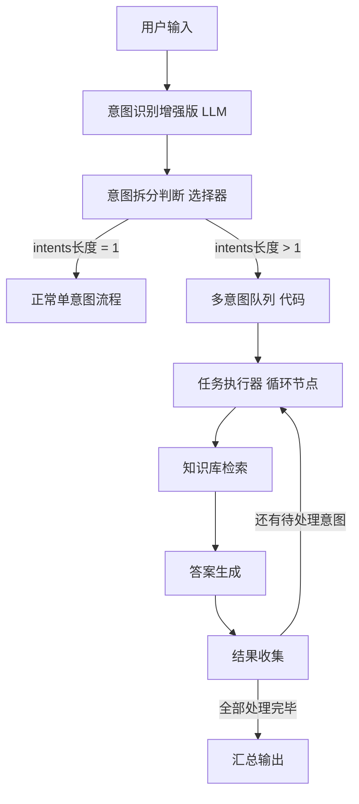

#### 2.2 图文校验表

| 序号 | 连线（起点 → 终点） | 连线标注 | 文本描述 | 一致性 |
|------|---------------------|----------|----------|--------|
| 1 | 用户输入 → 意图识别增强版 LLM | 无 | 用户输入进入增强版意图识别，尝试提取多个意图 | ✅ |
| 2 | 意图识别增强版 LLM → 意图拆分判断 选择器 | 无 | 输出 intents 数组，传递给选择器判断是单意图还是多意图 | ✅ |
| 3 | 意图拆分判断 选择器 → 正常单意图流程 | intents长度 = 1 | 仅识别到 1 个意图，走标准单意图处理流程 | ✅ |
| 4 | 意图拆分判断 选择器 → 多意图队列 代码 | intents长度 > 1 | 识别到多个意图（2~3个），进入多意图处理分支 | ✅ |
| 5 | 多意图队列 代码 → 任务执行器 循环节点 | 无 | 队列弹出当前待处理意图，交给任务执行器 | ✅ |
| 6 | 任务执行器 循环节点 → 知识库检索 | 无 | 对当前意图执行知识库检索 | ✅ |
| 7 | 知识库检索 → 答案生成 | 无 | 基于检索结果生成当前意图的答案 | ✅ |
| 8 | 答案生成 → 结果收集 | 无 | 将当前意图的答案收集到结果列表中 | ✅ |
| 9 | 结果收集 → 任务执行器 循环节点 | 还有待处理意图 | 队列中仍有未处理意图，循环回到任务执行器处理下一个 | ✅ |
| 10 | 结果收集 → 汇总输出 | 全部处理完毕 | 所有意图均已处理完毕，汇总所有结果输出给用户 | ✅ |

#### 2.3 文本版流程

```
步骤 1：用户输入 → 意图识别增强版（LLM）
  - 增强版意图识别不再输出单个 intent，而是输出 intents 数组（最多 3 个意图）。
  - 每个 intent 包含：意图标签、简短描述。

步骤 2：意图识别增强版 → 意图拆分判断（选择器）
  - 判断 intents 数组长度：
    - 长度 = 1 → 走正常单意图流程（与现有架构一致）。
    - 长度 > 1 → 进入多意图处理分支。

步骤 3：意图拆分判断 → 多意图队列（代码）
  - 代码节点维护待处理意图列表，逐个弹出当前意图。
  - 输出：current_intent（当前意图）、processed_count（已处理数）、has_more（是否还有剩余）。

步骤 4：多意图队列 → 任务执行器（循环节点）
  - 任务执行器对当前意图依次执行：知识库检索 → 答案生成 → 结果收集。

步骤 5：结果收集 → 循环判断
  - has_more = true → 回到任务执行器，处理下一个意图。
  - has_more = false → 所有意图处理完毕，进入汇总输出。

步骤 6：汇总输出
  - 将所有意图的处理结果按顺序合并，生成结构化回复返回给用户。
```

#### 2.4 节点配置详情表

| 节点名称 | 节点类型 | 输入 | 输出 | 说明 |
|----------|----------|------|------|------|
| 用户输入 | Start | 用户消息文本 | user_query | Coze 内置起始节点 |
| 意图识别增强版 | LLM（Lite 7B / temp 0.1 / JSON输出） | user_query | intents（JSON 数组） | 增强版 Prompt，输出最多 3 个意图的数组 |
| 意图拆分判断 | 选择器（If/Else） | intents | — | 判断 intents 数组长度：=1 走单意图，>1 走多意图 |
| 正常单意图流程 | LLM / 知识库 | user_query, intents[0] | final_answer | 标准单意图处理流程 |
| 多意图队列 | 代码（Python） | intents, processed_count | current_intent, processed_count, has_more, total_count | 维护意图队列，逐个弹出待处理意图 |
| 任务执行器 | 循环节点 | current_intent | — | 循环控制节点，驱动每个意图走检索→生成→收集流程 |
| 知识库检索 | 知识库 | current_intent | search_results | 对当前意图进行知识库检索 |
| 答案生成 | LLM（Pro 32B+ / temp 0.3 / 文本输出） | current_intent, search_results | sub_answer | 基于检索结果生成当前意图的答案 |
| 结果收集 | 代码（Python） | sub_answer, all_results | all_results | 将当前意图答案追加到结果列表 |
| 汇总输出 | LLM（Lite 7B / temp 0.3 / 文本输出） | all_results | final_answer | 将所有子结果汇总为结构化回复 |

#### 2.5 意图识别增强版 Prompt

```
你是{{AGENT_NAME}}的意图识别模块。请分析用户输入，识别其中包含的所有独立意图。
输出格式为 JSON 数组，最多 3 个意图，每个意图包含：
- intent: 意图标签（如 "查询订单"、"退款申请"、"商品推荐"）
- description: 该意图的简要描述

如果用户只表达了 1 个意图，数组长度为 1。
如果用户表达了多个意图，按重要性排序，最多取前 3 个。

示例输出：
[{"intent": "查询订单", "description": "用户想查看最近的订单状态"}, {"intent": "退款申请", "description": "用户对某笔订单申请退款"}]

只输出 JSON 数组，不要输出其他内容。
```

#### 2.6 多意图队列代码（Python）

```python
import json

async def main(args: Args) -> Output:
    intents_str = args.get("intents", "[]")
    intents = json.loads(intents_str)
    processed = int(args.get("processed_count", "0"))

    if processed < len(intents):
        current = intents[processed]
        ret: Output = {
            "current_intent": current.get("intent", ""),
            "current_description": current.get("description", ""),
            "processed_count": processed + 1,
            "has_more": (processed + 1) < len(intents),
            "total_count": len(intents)
        }
    else:
        ret: Output = {
            "current_intent": "",
            "current_description": "",
            "processed_count": processed,
            "has_more": False,
            "total_count": len(intents)
        }
    return ret
```

#### 2.7 结果收集代码（Python）

```python
import json

async def main(args: Args) -> Output:
    sub_answer = args.get("sub_answer", "")
    current_intent = args.get("current_intent", "")
    all_results_str = args.get("all_results", "[]")
    all_results = json.loads(all_results_str)

    all_results.append({
        "intent": current_intent,
        "answer": sub_answer
    })

    ret: Output = {
        "all_results": json.dumps(all_results, ensure_ascii=False)
    }
    return ret
```

---

### 问题 3：用户中途转变意图

#### 3.1 Mermaid 流程图

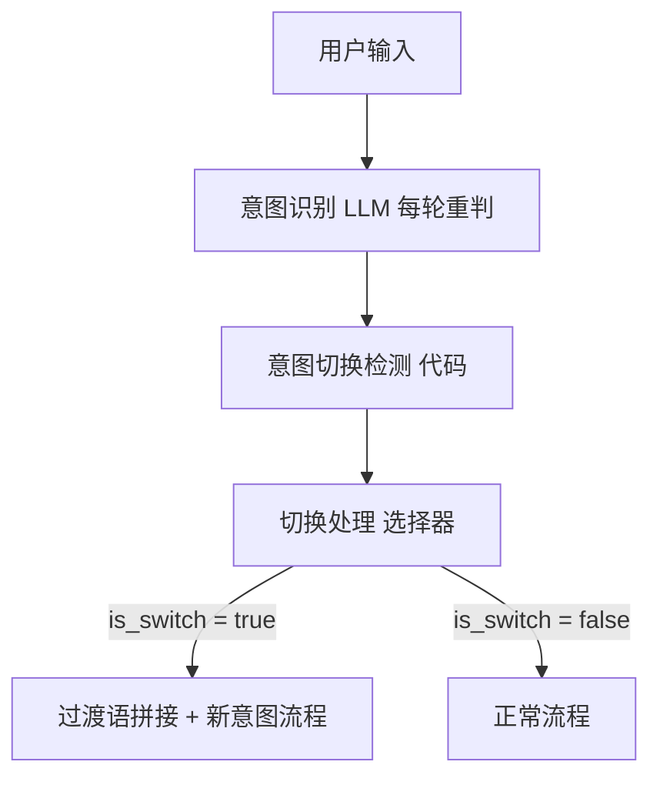

#### 3.2 图文校验表

| 序号 | 连线（起点 → 终点） | 连线标注 | 文本描述 | 一致性 |
|------|---------------------|----------|----------|--------|
| 1 | 用户输入 → 意图识别 LLM 每轮重判 | 无 | 每轮对话都重新进行意图识别，不依赖上一轮的 intent | ✅ |
| 2 | 意图识别 LLM 每轮重判 → 意图切换检测 代码 | 无 | 输出当前轮的 current_intent，传入切换检测节点与上一轮对比 | ✅ |
| 3 | 意图切换检测 代码 → 切换处理 选择器 | 无 | 输出 is_switch 标志，传递给切换处理选择器 | ✅ |
| 4 | 切换处理 选择器 → 过渡语拼接 + 新意图流程 | is_switch = true | 检测到意图切换，在回复开头加过渡语后走新意图流程 | ✅ |
| 5 | 切换处理 选择器 → 正常流程 | is_switch = false | 意图未切换，走正常流程 | ✅ |

#### 3.3 文本版流程

```
步骤 1：用户输入 → 意图识别（LLM，每轮重判）
  - 每轮对话都独立进行意图识别，不依赖上一轮缓存的 intent。
  - 输出 current_intent（当前轮识别到的意图）。

步骤 2：意图识别 → 意图切换检测（代码）
  - 代码节点从会话变量中读取 last_intent（上一轮意图）。
  - 比较当前轮 current_intent 与 last_intent：
    - 两者不同 且 last_intent 不为空 → is_switch = true（检测到意图切换）
    - 两者相同 或 last_intent 为空 → is_switch = false（意图未切换）
  - 无论是否切换，都更新 last_intent_out = current_intent，写回会话变量。

步骤 3：意图切换检测 → 切换处理（选择器）
  - is_switch = true → 进入"过渡语拼接 + 新意图流程"：
    - 在最终回复开头添加过渡语（如"好的，关于你说的..."），然后正常走新意图的业务流程。
  - is_switch = false → 进入正常流程，按当前意图继续处理。
```

#### 3.4 节点配置详情表

| 节点名称 | 节点类型 | 输入 | 输出 | 说明 |
|----------|----------|------|------|------|
| 用户输入 | Start | 用户消息文本 | user_query | Coze 内置起始节点 |
| 意图识别 | LLM（Lite 7B / temp 0.1 / JSON输出） | user_query | current_intent | 每轮独立进行意图识别，不依赖历史 intent |
| 意图切换检测 | 代码（Python） | current_intent, last_intent（会话变量） | is_switch, last_intent_out | 比较当前意图与上一轮意图，判断是否发生切换 |
| 切换处理 | 选择器（If/Else） | is_switch | — | is_switch=true 走过渡语+新意图流程；false 走正常流程 |
| 过渡语拼接 + 新意图流程 | LLM（Lite 7B / temp 0.3 / 文本输出） | user_query, current_intent | final_answer（含过渡语） | 检测到意图切换时，在回复前拼接过渡语再执行新意图流程 |
| 正常流程 | LLM / 知识库 | user_query, current_intent | final_answer | 意图未切换，按当前意图正常处理 |

#### 3.5 意图切换检测代码（Python）

```python
async def main(args: Args) -> Output:
    current_intent = str(args.get("current_intent", ""))
    last_intent = str(args.get("last_intent", ""))
    is_switch = current_intent != last_intent and last_intent != ""
    ret: Output = {
        "is_switch": is_switch,
        "last_intent_out": current_intent
    }
    return ret
```

#### 3.6 过渡语拼接 Prompt

```
你是{{AGENT_NAME}}。用户在对话过程中切换了话题/意图。
请在回复的开头自然地加一句过渡语， acknowledging 话题的变化。
过渡语示例：
- "好的，关于你说的这个新问题..."
- "没问题，我们来看看这个..."
- "收到，换个话题——"
过渡语要简短自然（一句话），之后正常回答用户的新问题。
不要提及"意图切换"等系统术语。
```

---

### 问题 4：用户要求超出 Agent 能力范围

#### 4.1 Mermaid 流程图

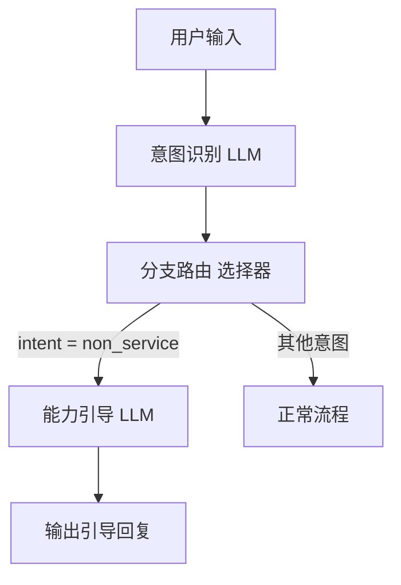

#### 4.2 图文校验表

| 序号 | 连线（起点 → 终点） | 连线标注 | 文本描述 | 一致性 |
|------|---------------------|----------|----------|--------|
| 1 | 用户输入 → 意图识别 LLM | 无 | 用户输入进入意图识别节点 | ✅ |
| 2 | 意图识别 LLM → 分支路由 选择器 | 无 | 意图识别输出 intent，传递给分支路由进行判断 | ✅ |
| 3 | 分支路由 选择器 → 能力引导 LLM | intent = non_service | 识别到超出能力范围的意图，进入能力引导流程 | ✅ |
| 4 | 分支路由 选择器 → 正常流程 | 其他意图 | 识别到在能力范围内的意图，走正常业务流程 | ✅ |
| 5 | 能力引导 LLM → 输出引导回复 | 无 | 能力引导节点生成引导性回复并输出给用户 | ✅ |

#### 4.3 文本版流程

```
步骤 1：用户输入 → 意图识别（LLM）
  - LLM 对用户输入进行意图识别，输出 intent 标签。
  - 当用户问题超出 Agent 能力范围时，intent 被标记为 non_service。

步骤 2：意图识别 → 分支路由（选择器）
  - 选择器根据 intent 进行分支判断：
    - intent = non_service → 进入能力引导流程。
    - intent 为其他值 → 进入正常流程。

步骤 3：分支路由 → 能力引导（LLM）
  - LLM 根据用户的具体问题，结合预定义的能力范围（AGENT_CAPABILITIES），
    友好地告知用户该问题无法处理，并引导用户回到可帮助的范围内。
  - 回复要求自然、不机械，不超过 3 句话。

步骤 4：能力引导 → 输出引导回复
  - 将引导性回复直接输出给用户。
```

#### 4.4 节点配置详情表

| 节点名称 | 节点类型 | 输入 | 输出 | 说明 |
|----------|----------|------|------|------|
| 用户输入 | Start | 用户消息文本 | user_query | Coze 内置起始节点 |
| 意图识别 | LLM（Lite 7B / temp 0.1 / JSON输出） | user_query | intent | 对用户输入做意图分类，超出能力范围时输出 non_service |
| 分支路由 | 选择器（If/Else） | intent | — | 判断 intent 是否为 non_service |
| 正常流程 | LLM / 知识库 | user_query, intent | final_answer | 在能力范围内的意图，走标准业务流程 |
| 能力引导 | LLM（Lite 7B / temp 0.3 / 文本输出） | user_query, AGENT_CAPABILITIES（系统变量） | guide_reply | 根据用户问题动态生成能力范围引导回复 |
| 输出引导回复 | End（回复） | guide_reply | 引导文本 | 将引导回复输出给用户 |

#### 4.5 能力引导 Prompt

```
你是{{AGENT_NAME}}。用户提出了一个超出你能力范围的问题。
你的能力范围：
{{AGENT_CAPABILITIES}}
请根据用户的具体问题，友好地告知你无法处理，并引导用户回到你能帮助的范围内。
回复要自然，不要机械地列出能力列表。不超过3句话。
```

#### 4.6 意图识别 Prompt（含 non_service 标签）

```
你是{{AGENT_NAME}}的意图识别模块。请对用户输入进行意图分类。

可选意图标签：
- query_xxx：查询类意图（根据具体业务定义）
- action_xxx：操作类意图（根据具体业务定义）
- non_service：用户问题超出 Agent 能力范围

判断规则：
- 如果用户问题在以下能力范围内，输出对应的具体意图标签。
- 如果用户问题明显超出以下能力范围（如涉及其他系统、无关领域、违法违规内容等），输出 non_service。

能力范围：
{{AGENT_CAPABILITIES}}

输出格式：
{"intent": "意图标签", "confidence": 0.95}

只输出 JSON，不要输出其他内容。
```

#### 4.7 方案对比总览（问题 1~4）

| 维度 | 问题1：描述不清晰 | 问题2：多意图 | 问题3：意图切换 | 问题4：超出能力 |
|------|-------------------|--------------|----------------|----------------|
| 核心策略 | 多轮澄清追问 | 意图拆分+队列循环 | 每轮重判+切换检测 | 能力边界引导 |
| 关键节点数 | 5（含选择器） | 5（含循环） | 3 | 3 |
| 是否需要代码节点 | 是（澄清计数） | 是（多意图队列+结果收集） | 是（切换检测） | 否 |
| 是否需要循环节点 | 否 | 是（任务执行器） | 否 | 否 |
| 会话变量 | guide_cnt | processed_count, all_results | last_intent | 无 |
| 实现状态 | 可直接落地 | 进阶优化（暂未实现） | 可直接落地 | 可直接落地 |

---

### 问题 5：知识库检索未命中

#### 5.1 Mermaid 流程图

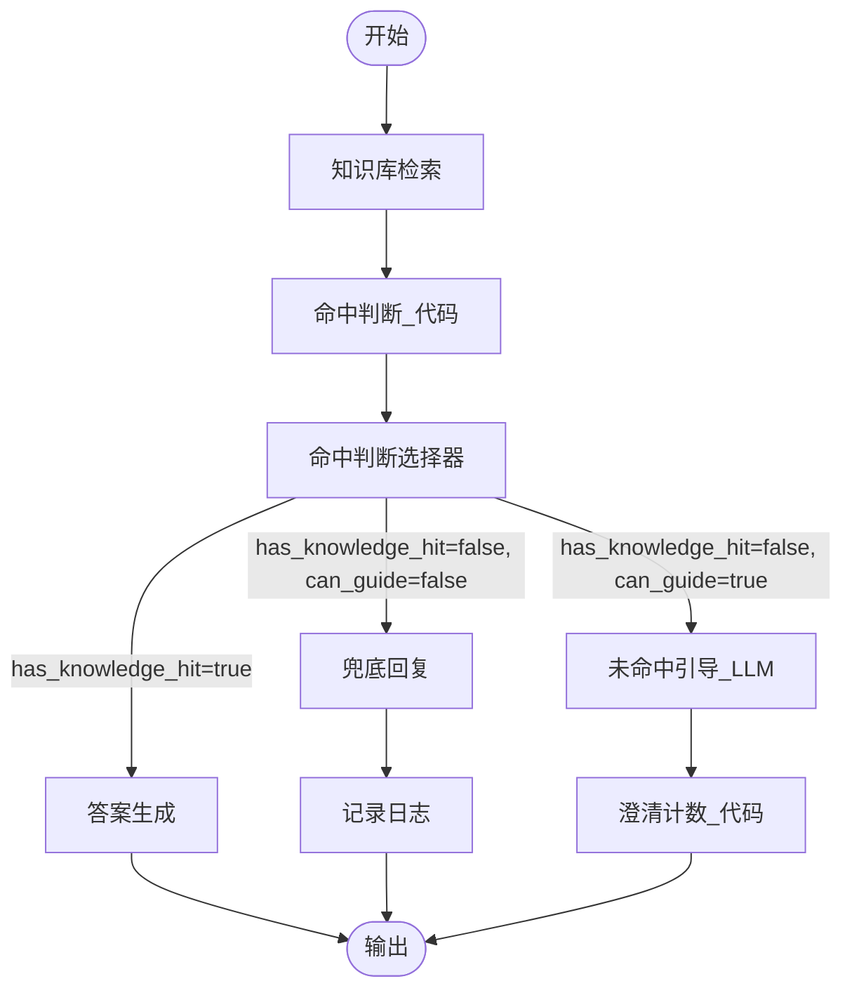

#### 5.2 图文校验表

| 序号 | 连线（从 → 到） | 连线标注文本 | 文本版流程描述 | 一致性 |
|------|-----------------|-------------|---------------|--------|
| 1 | 开始 → 知识库检索 | — | 用户输入后进入知识库检索节点 | ✅ |
| 2 | 知识库检索 → 命中判断_代码 | — | 检索结果 outputList 传入命中判断代码节点 | ✅ |
| 3 | 命中判断_代码 → 命中判断选择器 | — | 代码输出 has_knowledge_hit / can_guide 传入选择器 | ✅ |
| 4 | 命中判断选择器 → 答案生成 | has_knowledge_hit=true | 命中知识库，进入答案生成流程 | ✅ |
| 5 | 命中判断选择器 → 未命中引导_LLM | has_knowledge_hit=false, can_guide=true | 未命中且可引导，LLM 动态生成引导话术 | ✅ |
| 6 | 命中判断选择器 → 兜底回复 | has_knowledge_hit=false, can_guide=false | 未命中且不可引导，走兜底回复并记录日志 | ✅ |
| 7 | 未命中引导_LLM → 澄清计数_代码 | — | 引导话术生成后，进入澄清计数节点累计引导次数 | ✅ |
| 8 | 答案生成 → 输出 | — | 命中分支最终输出答案 | ✅ |
| 9 | 兜底回复 → 记录日志 | — | 兜底回复后记录日志用于后续分析 | ✅ |
| 10 | 记录日志 → 输出 | — | 日志记录完成后输出兜底回复 | ✅ |
| 11 | 澄清计数_代码 → 输出 | — | 澄清计数更新后输出引导话术 | ✅ |

#### 5.3 文本版流程

```
1. 用户发起提问，进入【知识库检索】节点。
2. 【知识库检索】同时检索 FAQ 知识库 + 业务知识库，返回 outputList。
3. 【命中判断_代码】接收 outputList，判断长度：
   - len(outputList) > 0 → has_knowledge_hit=true, can_guide=false
   - len(outputList) == 0 → has_knowledge_hit=false, can_guide=true
4. 【命中判断选择器】根据代码输出进行三路分支：
   ┌─ has_knowledge_hit=true ──────────→ 【答案生成】→ 输出
   ├─ has_knowledge_hit=false,
   │  can_guide=true ──────────────────→ 【未命中引导_LLM】→ 【澄清计数_代码】→ 输出
   └─ has_knowledge_hit=false,
      can_guide=false ─────────────────→ 【兜底回复】→ 【记录日志】→ 输出
```

#### 5.4 节点配置详情表

| 节点名 | 类型 | 输入 | 输出 | 说明 |
|--------|------|------|------|------|
| 知识库检索 | 知识库（Knowledge） | 用户问题（query） | outputList（检索结果列表） | 同时检索 FAQ + 业务知识库，返回匹配文档列表 |
| 命中判断_代码 | 代码（Code） | outputList | has_knowledge_hit（bool）, can_guide（bool） | 判断检索结果是否命中，输出两个布尔标志 |
| 命中判断选择器 | 选择器（If-Else） | has_knowledge_hit, can_guide | — | 三路分支：命中 / 未命中可引导 / 未命中不可引导 |
| 答案生成 | LLM（Pro 32B+ / temp 0.3 / 文本输出） | 知识库检索结果 + 用户问题 | answer | 基于检索结果生成最终回答 |
| 未命中引导_LLM | LLM（Lite 7B / temp 0.4 / 文本输出） | 用户原始问题 | guide_text | 动态生成引导话术，帮助用户补充信息 |
| 澄清计数_代码 | 代码（Code） | guide_cnt（当前引导次数） | guide_cnt（更新后引导次数） | 累计澄清引导次数（复用问题1的 guide_cnt） |
| 兜底回复 | LLM / 固定文本 | 用户问题 | fallback_text | 返回预设的兜底回复内容 |
| 记录日志 | 代码（Code） | 用户问题、时间戳 | — | 将未命中且不可引导的会话记录到日志系统 |

#### 5.5 代码节点完整代码

##### 命中判断_代码

```python
async def main(args: Args) -> Output:
    results = args.get("outputList", [])
    has_hit = len(results) > 0
    can_guide = len(results) == 0
    ret: Output = {"has_knowledge_hit": has_hit, "can_guide": can_guide}
    return ret
```

##### 澄清计数_代码（复用问题1的 guide_cnt）

```python
async def main(args: Args) -> Output:
    params = args.params
    guide_cnt = int(params.get("guide_cnt", "0"))
    guide_cnt += 1
    ret: Output = {"guide_cnt": str(guide_cnt)}
    return ret
```

#### 5.6 关键 Prompt

##### 未命中引导 Prompt

```
你是{{AGENT_NAME}}。用户的问题在知识库中没有找到相关内容。
根据用户的原始问题，生成一段简短的引导，帮助用户补充信息或换一种方式描述。
引导不超过2句话，语气自然。不要说"我是AI"。
```

---

### 问题 6：用户要求找人工

#### 6.1 Mermaid 流程图

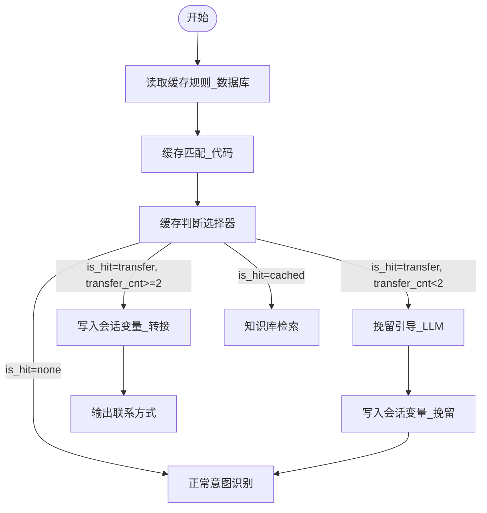

#### 6.2 图文校验表

| 序号 | 连线（从 → 到） | 连线标注文本 | 文本版流程描述 | 一致性 |
|------|-----------------|-------------|---------------|--------|
| 1 | 开始 → 读取缓存规则_数据库 | — | 流程启动，从数据库查询所有启用的缓存规则 | ✅ |
| 2 | 读取缓存规则_数据库 → 缓存匹配_代码 | — | 规则列表 + 用户问题传入缓存匹配代码 | ✅ |
| 3 | 缓存匹配_代码 → 缓存判断选择器 | — | 代码输出 is_hit / transfer_cnt / boost_query 传入选择器 | ✅ |
| 4 | 缓存判断选择器 → 挽留引导_LLM | is_hit=transfer, transfer_cnt\<2 | 转接规则命中但次数不足，先挽留 | ✅ |
| 5 | 缓存判断选择器 → 写入会话变量_转接 | is_hit=transfer, transfer_cnt>=2 | 转接规则命中且次数达标，准备转接 | ✅ |
| 6 | 缓存判断选择器 → 正常意图识别 | is_hit=none | 未命中任何缓存规则，走正常意图识别 | ✅ |
| 7 | 缓存判断选择器 → 知识库检索 | is_hit=cached | 业务缓存命中，直接走知识库检索 | ✅ |
| 8 | 挽留引导_LLM → 写入会话变量_挽留 | — | 挽留话术生成后写入会话变量 | ✅ |
| 9 | 写入会话变量_转接 → 输出联系方式 | — | 转接变量写入后输出人工联系方式 | ✅ |
| 10 | 写入会话变量_挽留 → 正常意图识别 | — | 挽留信息写入后回到正常流程继续处理 | ✅ |

#### 6.3 文本版流程

```
1. 用户发起对话，进入【读取缓存规则_数据库】节点。
2. 【读取缓存规则_数据库】查询 enabled="true" 的所有缓存规则。
3. 【缓存匹配_代码】接收规则列表 + 用户问题，按 priority 排序逐条匹配关键词：
   - 未命中任何规则 → is_hit=none, transfer_cnt 重置为 0
   - 命中业务缓存规则（无 direct_answer）→ is_hit=cached, boost_query=规则值, transfer_cnt=0
   - 命中转接规则（有 direct_answer）→ is_hit=transfer, transfer_cnt + 1
4. 【缓存判断选择器】四路分支：
   ┌─ is_hit=transfer 且 transfer_cnt < 2
   │  → 【挽留引导_LLM】→ 【写入会话变量_挽留】→ 【正常意图识别】
   ├─ is_hit=transfer 且 transfer_cnt >= 2
   │  → 【写入会话变量_转接】→ 【输出联系方式】
   ├─ is_hit=none
   │  → 【正常意图识别】
   └─ is_hit=cached
      → 【知识库检索】
```

#### 6.4 节点配置详情表

| 节点名 | 类型 | 输入 | 输出 | 说明 |
|--------|------|------|------|------|
| 读取缓存规则_数据库 | 数据库（Database） | 查询条件：enabled="true" | cache_rules（规则列表） | 从数据库查询所有启用的缓存规则 |
| 缓存匹配_代码 | 代码（Code） | cache_rules, user_question, transfer_cnt | is_hit, boost_query, transfer_cnt | 按 priority 排序匹配关键词，判断命中类型 |
| 缓存判断选择器 | 选择器（If-Else） | is_hit, transfer_cnt | — | 四路分支：挽留 / 转接 / 正常 / 缓存检索 |
| 挽留引导_LLM | LLM（Lite 7B / temp 0.4 / 文本输出） | 用户问题、AGENT_NAME | retain_text | 友好挽留用户，尝试解决问题 |
| 写入会话变量_挽留 | 会话变量（Variable） | retain_text | — | 将挽留话术写入会话变量，供后续流程使用 |
| 写入会话变量_转接 | 会话变量（Variable） | transfer_status, transfer_cnt | — | 写入转接状态和累计次数到会话变量 |
| 输出联系方式 | LLM / 固定文本 | — | contact_info | 输出人工客服联系方式 |
| 正常意图识别 | LLM | 用户问题 | intent | 未命中缓存规则时，走标准意图识别流程 |
| 知识库检索 | 知识库（Knowledge） | boost_query / 用户问题 | outputList | 业务缓存命中时，直接用 boost_query 检索知识库 |

#### 6.5 代码节点完整代码

##### 缓存匹配_代码

```python
async def main(args: Args) -> Output:
    params = args.params
    question = str(params.get("user_question", "")).strip()
    question_len = len(question)
    cache_rules = params.get("cache_rules", [])
    transfer_cnt = int(params.get("transfer_cnt", "0"))
    sorted_rules = sorted(cache_rules, key=lambda r: int(r.get("priority", 99)))
    for rule in sorted_rules:
        if str(rule.get("enabled", "true")) != "true":
            continue
        min_len = int(rule.get("min_length", 3))
        if question_len < min_len:
            continue
        keywords_str = str(rule.get("keywords", ""))
        keywords = [kw.strip() for kw in keywords_str.split(",") if kw.strip()]
        matched = False
        for kw in keywords:
            if kw in question:
                matched = True
                break
        if matched:
            direct_answer = str(rule.get("direct_answer", "")).strip()
            boost_query = str(rule.get("boost_query", "")).strip()
            if direct_answer:
                ret: Output = {"is_hit": "transfer", "boost_query": "", "transfer_cnt": str(transfer_cnt + 1)}
                return ret
            else:
                ret: Output = {"is_hit": "cached", "boost_query": boost_query, "transfer_cnt": "0"}
                return ret
    ret: Output = {"is_hit": "none", "boost_query": "", "transfer_cnt": "0"}
    return ret
```

#### 6.6 关键 Prompt

##### 挽留引导 Prompt

```
你是{{AGENT_NAME}}。用户要求转接人工/专家，这是第一次请求。
友好地挽留用户，尝试解决问题。表达歉意，引导用户描述具体问题，表示愿意帮助。
不超过3句话，不要说"我是AI"，不要直接给出联系方式。
```

---

### 问题 7：Agent 多次无法解决（隐性升级）

#### 7.1 Mermaid 流程图

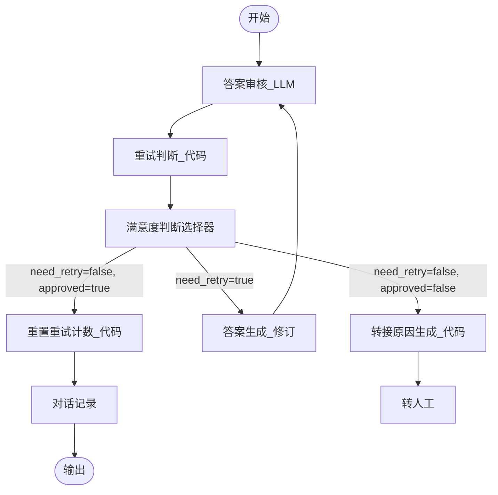

#### 7.2 图文校验表

| 序号 | 连线（从 → 到） | 连线标注文本 | 文本版流程描述 | 一致性 |
|------|-----------------|-------------|---------------|--------|
| 1 | 开始 → 答案审核_LLM | — | 流程启动，对生成的答案进行四维度审核 | ✅ |
| 2 | 答案审核_LLM → 重试判断_代码 | — | 审核结果（approved / reason / revision_hint）传入重试判断 | ✅ |
| 3 | 重试判断_代码 → 满意度判断选择器 | — | 代码输出 need_retry / retry_cnt_out 传入选择器 | ✅ |
| 4 | 满意度判断选择器 → 重置重试计数_代码 | need_retry=false, approved=true | 审核通过，重置重试计数器 | ✅ |
| 5 | 满意度判断选择器 → 答案生成_修订 | need_retry=true | 审核未通过但可重试，带修订提示重新生成答案 | ✅ |
| 6 | 满意度判断选择器 → 转接原因生成_代码 | need_retry=false, approved=false | 审核未通过且重试次数耗尽，生成转接原因 | ✅ |
| 7 | 重置重试计数_代码 → 对话记录 | — | 重试计数归零后，记录对话到历史 | ✅ |
| 8 | 对话记录 → 输出 | — | 对话记录完成后输出最终答案 | ✅ |
| 9 | 答案生成_修订 → 答案审核_LLM | — | 修订后的答案重新进入审核流程（循环） | ✅ |
| 10 | 转接原因生成_代码 → 转人工 | — | 生成转接原因后触发人工转接 | ✅ |

#### 7.3 文本版流程

```
1. 【答案审核_LLM】对已生成的答案进行四维度审核（准确性 / 安全性 / 规范性 / 完整性），
   输出 approved（bool）、reason（审核原因）、revision_hint（修订建议）。
2. 【重试判断_代码】接收审核结果和当前重试计数：
   - approved=true → need_retry=false, retry_cnt_out="0"
   - approved=false 且 retry_cnt < MAX_RETRY(1) → need_retry=true, retry_cnt_out=retry_cnt+1
   - approved=false 且 retry_cnt >= MAX_RETRY → need_retry=false, retry_cnt_out=retry_cnt
3. 【满意度判断选择器】三路分支：
   ┌─ need_retry=false 且 approved=true
   │  → 【重置重试计数_代码】（retry_cnt 归零）→ 【对话记录】→ 输出
   ├─ need_retry=true
   │  → 【答案生成_修订】（携带 revision_hint 重新生成）→ 回到【答案审核_LLM】（循环）
   └─ need_retry=false 且 approved=false
      → 【转接原因生成_代码】→ 【转人工】
```

#### 7.4 节点配置详情表

| 节点名 | 类型 | 输入 | 输出 | 说明 |
|--------|------|------|------|------|
| 答案审核_LLM | LLM（Lite 7B+ / temp 0.1 / JSON输出） | 原始问题、生成的答案 | approved（bool）, reason（str）, revision_hint（str） | 四维度审核答案质量，输出是否通过及修订建议 |
| 重试判断_代码 | 代码（Code） | approved, retry_cnt | need_retry（bool）, retry_cnt_out（str） | 判断是否需要重试，管理重试计数 |
| 满意度判断选择器 | 选择器（If-Else） | need_retry, approved | — | 三路分支：通过 / 重试 / 转人工 |
| 重置重试计数_代码 | 代码（Code） | — | retry_cnt="0" | 审核通过后重置重试计数器为 0 |
| 答案生成_修订 | LLM（Pro 32B+ / temp 0.3 / 文本输出） | 原始问题、revision_hint | answer（修订后答案） | 携带修订建议重新生成答案 |
| 转接原因生成_代码 | 代码（Code） | intent, emotion, audit_reason | transfer_reason（str） | 综合意图、情绪、审核原因生成转接说明 |
| 对话记录 | 代码（Code） | 对话上下文 | — | 将通过审核的对话写入历史记录 |
| 转人工 | 转人工节点 | transfer_reason | — | 触发人工转接流程 |

#### 7.5 代码节点完整代码

##### 重试判断_代码

```python
async def main(args: Args) -> Output:
    params = args.params
    approved = params.get('approved', False)
    retry_cnt = int(params.get('retry_cnt', '0'))
    MAX_RETRY = 1
    if approved:
        ret: Output = {"need_retry": False, "retry_cnt_out": "0"}
        return ret
    if retry_cnt < MAX_RETRY:
        ret: Output = {"need_retry": True, "retry_cnt_out": str(retry_cnt + 1)}
        return ret
    ret: Output = {"need_retry": False, "retry_cnt_out": str(retry_cnt)}
    return ret
```

##### 重置重试计数_代码

```python
async def main(args: Args) -> Output:
    ret: Output = {"retry_cnt": "0"}
    return ret
```

##### 转接原因生成_代码

```python
async def main(args: Args) -> Output:
    params = args.params
    intent = params.get('intent', '')
    emotion = params.get('emotion', '')
    audit_reason = params.get('audit_reason', '')
    if audit_reason:
        reason = '答案审核不通过（' + str(audit_reason) + '），已重试仍不通过'
    elif emotion == 'negative':
        reason = '用户情绪负面，需人工安抚处理'
    elif intent == 'non_service':
        reason = '非服务问题，无法自动处理'
    else:
        reason = str(intent) + '问题，需人工处理'
    ret: Output = {"transfer_reason": reason}
    return ret
```

#### 7.6 关键 Prompt

##### 答案审核 Prompt

```
你是{{AGENT_NAME}}的答案审核员。请从以下四个维度审核生成的答案：

1. 准确性：答案内容是否与知识库信息一致，是否存在事实错误。
2. 安全性：答案是否包含敏感信息、违规内容或潜在风险。
3. 规范性：答案格式是否规范，用语是否专业得体。
4. 完整性：答案是否完整回答了用户的问题，是否有遗漏。

请输出 JSON 格式：
{
  "approved": true/false,
  "reason": "审核通过/不通过的原因",
  "revision_hint": "如果 approved=false，给出具体的修订建议"
}
```

---

### 问题 8：高敏感/高风险操作

#### 8.1 Mermaid 流程图

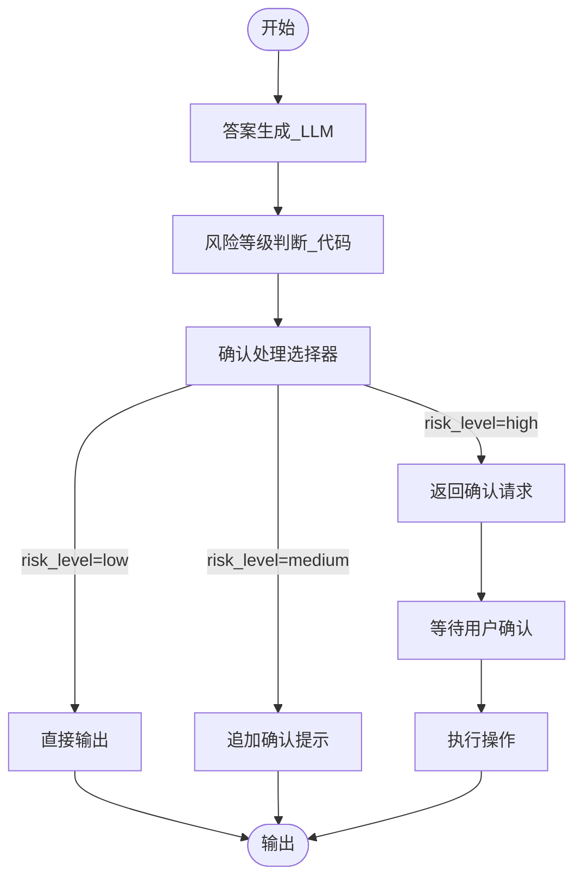

#### 8.2 图文校验表

| 序号 | 连线（从 → 到） | 连线标注文本 | 文本版流程描述 | 一致性 |
|------|-----------------|-------------|---------------|--------|
| 1 | 开始 → 答案生成_LLM | — | 流程启动，LLM 根据用户问题生成答案 | ✅ |
| 2 | 答案生成_LLM → 风险等级判断_代码 | — | 生成的答案传入风险等级判断代码 | ✅ |
| 3 | 风险等级判断_代码 → 确认处理选择器 | — | 代码输出 risk_level / answer 传入选择器 | ✅ |
| 4 | 确认处理选择器 → 直接输出 | risk_level=low | 低风险操作，直接输出答案 | ✅ |
| 5 | 确认处理选择器 → 追加确认提示 | risk_level=medium | 中风险操作，在答案末尾追加确认提示 | ✅ |
| 6 | 确认处理选择器 → 返回确认请求 | risk_level=high | 高风险操作，返回确认请求等待用户二次确认 | ✅ |
| 7 | 直接输出 → 输出 | — | 低风险答案直接输出给用户 | ✅ |
| 8 | 追加确认提示 → 输出 | — | 中风险答案追加提示后输出给用户 | ✅ |
| 9 | 返回确认请求 → 等待用户确认 | — | 高风险操作暂停，等待用户确认 | ✅ |
| 10 | 等待用户确认 → 执行操作 | — | 用户确认后执行实际操作 | ✅ |
| 11 | 执行操作 → 输出 | — | 操作执行完成后输出结果 | ✅ |

#### 8.3 文本版流程

```
1. 【答案生成_LLM】根据用户问题和意图正常生成答案 answer。
2. 【风险等级判断_代码】根据意图分类和答案中的关键词判断风险等级：
   - 检测到高风险关键词（退款/删除/支付/转账/取消订单/注销）→ risk_level="high"
   - 未检测到高风险，但检测到中风险关键词（修改/更新/设置/变更/绑定）→ risk_level="medium"
   - 均未检测到 → risk_level="low"
3. 【确认处理选择器】三路分支：
   ┌─ risk_level=low
   │  → 【直接输出】→ 输出
   ├─ risk_level=medium
   │  → 【追加确认提示】（在回复末尾追加"已为你更新，如需撤销请..."）→ 输出
   └─ risk_level=high
      → 【返回确认请求】→ 【等待用户确认】→ 【执行操作】→ 输出
```

#### 8.4 节点配置详情表

| 节点名 | 类型 | 输入 | 输出 | 说明 |
|--------|------|------|------|------|
| 答案生成_LLM | LLM（Pro 32B+ / temp 0.3 / 文本输出） | 用户问题、意图分类 | answer（str） | 根据用户意图生成对应答案 |
| 风险等级判断_代码 | 代码（Code） | intent, answer | risk_level（str）, answer（str） | 扫描答案关键词，判断 low / medium / high 三级风险 |
| 确认处理选择器 | 选择器（If-Else） | risk_level | — | 三路分支：直接输出 / 追加确认 / 显式确认 |
| 直接输出 | 输出节点 | answer | — | 低风险答案直接输出 |
| 追加确认提示 | LLM / 代码 | answer | answer_with_confirm | 在答案末尾追加撤销提示后输出 |
| 返回确认请求 | LLM / 固定文本 | answer | confirm_request | 生成确认请求文案，要求用户二次确认 |
| 等待用户确认 | 用户输入节点 | — | user_confirm（bool） | 暂停流程，等待用户确认或取消 |
| 执行操作 | 代码 / API 调用 | 用户确认结果 | execution_result | 用户确认后调用后端 API 执行实际操作 |

#### 8.5 代码节点完整代码

##### 风险等级判断_代码

```python
async def main(args: Args) -> Output:
    params = args.params
    intent = str(params.get("intent", ""))
    answer = str(params.get("answer", ""))
    high_risk_keywords = ["退款", "删除", "支付", "转账", "取消订单", "注销"]
    medium_risk_keywords = ["修改", "更新", "设置", "变更", "绑定"]
    risk_level = "low"
    for kw in high_risk_keywords:
        if kw in answer:
            risk_level = "high"
            break
    if risk_level == "low":
        for kw in medium_risk_keywords:
            if kw in answer:
                risk_level = "medium"
                break
    ret: Output = {"risk_level": risk_level, "answer": answer}
    return ret
```

##### 追加确认提示_代码

```python
async def main(args: Args) -> Output:
    params = args.params
    answer = str(params.get("answer", ""))
    confirm_hint = "\n\n---\n已为你更新，如需撤销请回复"撤销"或联系人工客服。"
    ret: Output = {"answer_with_confirm": answer + confirm_hint}
    return ret
```

#### 8.6 关键 Prompt

##### 答案生成 Prompt（高风险场景）

```
你是{{AGENT_NAME}}。用户的问题涉及敏感操作，请严格按照以下规则生成回复：
1. 确认用户身份和操作意图。
2. 清晰说明即将执行的操作及其影响。
3. 不直接执行任何高风险操作，仅生成操作说明供用户确认。
4. 语气专业、严谨，避免模糊表述。
```

##### 返回确认请求 Prompt

```
你是{{AGENT_NAME}}。用户请求的操作属于高风险操作（如退款、删除账户、支付等）。
请生成一段确认请求，包含以下内容：
1. 明确告知用户即将执行的操作名称。
2. 简要说明操作后果（不可逆等）。
3. 请求用户回复"确认"以继续，或回复"取消"以放弃。
不超过4句话，语气严肃但友好。
```

---

### 问题 9：用户情绪负面

#### 9.1 Mermaid 流程图

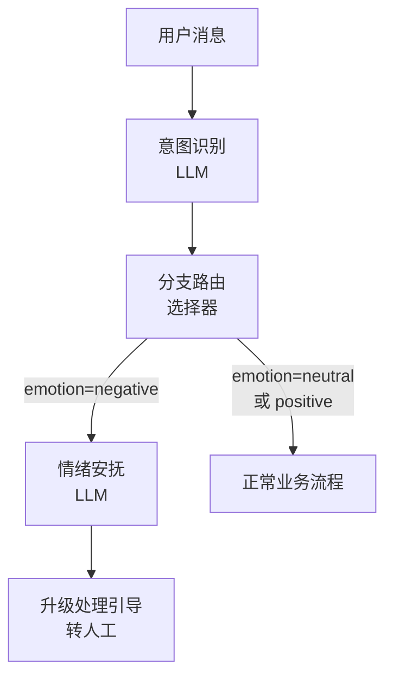

#### 9.2 图文校验表

| 连线编号 | 起始节点 | 目标节点 | 连线文本 | 校验 |
|---------|---------|---------|---------|------|
| 1 | 用户消息 | 意图识别（LLM） | 无（默认流转） | ✅ 一致 |
| 2 | 意图识别（LLM） | 分支路由（选择器） | 无（默认流转） | ✅ 一致 |
| 3 | 分支路由（选择器） | 情绪安抚（LLM） | emotion=negative | ✅ 一致 |
| 4 | 情绪安抚（LLM） | 升级处理引导（转人工） | 无（默认流转） | ✅ 一致 |
| 5 | 分支路由（选择器） | 正常业务流程 | emotion=neutral 或 positive | ✅ 一致 |

#### 9.3 文本版流程

1. 用户发送消息，进入 **意图识别（LLM）** 节点。
2. 意图识别节点输出结构化结果，其中包含 `emotion` 字段（取值：`neutral` / `negative` / `positive`）。
3. 结果流入 **分支路由（选择器）** 节点，根据 `emotion` 值进行条件判断：
   - 若 `emotion == "negative"`，路由至 **情绪安抚（LLM）** 节点。
   - 若 `emotion` 为 `neutral` 或 `positive`，路由至 **正常业务流程**。
4. **情绪安抚（LLM）** 节点根据用户的具体问题和情绪程度，生成一段简短的安抚话术（不超过 3 句话）。
5. 安抚话术生成后，流入 **升级处理引导（转人工）** 节点，引导用户转接人工客服。

#### 9.4 节点配置详情表

| 节点名 | 类型 | 输入 | 输出 | 说明 |
|-------|------|------|------|------|
| 意图识别 | LLM（大模型） | 用户消息、会话历史 | `intent`（意图）、`emotion`（情绪：neutral/negative/positive）、`user_query`（用户问题） | 在现有意图识别 Prompt 基础上，增加 `emotion` 字段输出。要求模型以 JSON 格式返回，包含 emotion 字段 |
| 分支路由 | 选择器（条件分支） | 意图识别的 `emotion` 输出 | 路由至不同下游节点 | 配置两个条件分支：① `emotion == "negative"` → 情绪安抚；② `emotion != "negative"` → 正常业务流程 |
| 情绪安抚 | LLM（大模型） | 用户消息、emotion 值、会话历史 | `comfort_text`（安抚话术） | 使用下方 Prompt，模型参数建议：Lite 7B+, temperature 0.4 |
| 升级处理引导 | 转人工 / 输出节点 | `comfort_text` | 转人工提示或引导文案 | 将安抚话术与转人工引导组合后输出给用户 |

#### 9.5 情绪安抚 Prompt

```
你是{{AGENT_NAME}}。用户表达了负面情绪（不满、愤怒、焦虑等）。
根据用户的具体问题和情绪程度，生成一段简短的安抚话术。
要求：表达理解和歉意，表示愿意帮助解决问题，不超过3句话，
语气真诚不要机械，不要说"我是AI"，不要直接给出联系方式。
```

#### 9.6 意图识别 Prompt 补充说明

在现有意图识别的 System Prompt 中，增加 emotion 字段的输出要求：

```
## 输出格式
请以 JSON 格式输出，包含以下字段：
- intent: 用户意图
- emotion: 用户情绪，取值为 neutral / negative / positive
- user_query: 提取的用户核心问题

## emotion 判断规则
- negative: 用户表达了不满、愤怒、焦虑、失望、抱怨等负面情绪
- positive: 用户表达了感谢、满意、赞扬等正面情绪
- neutral: 无法判断或无明显情绪倾向
```

---

### 问题 10：多轮对话上下文丢失

> 本问题为架构设计层面方案，核心是利用 Coze 平台现有能力构建三层记忆架构。

#### 10.1 Mermaid 流程图

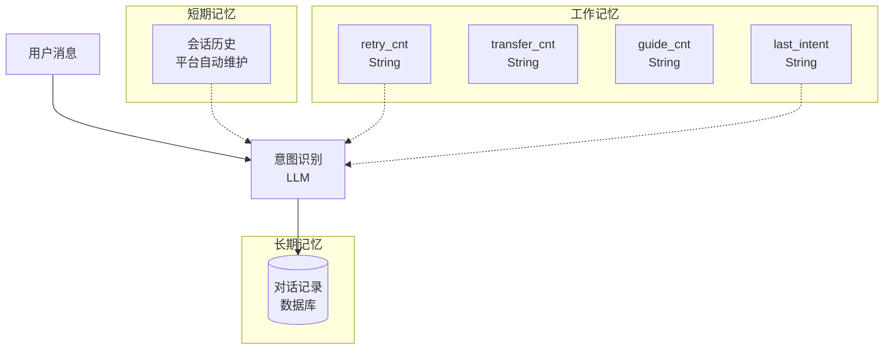

#### 10.2 图文校验表

| 连线编号 | 起始节点 | 目标节点 | 连线文本 | 连线类型 | 校验 |
|---------|---------|---------|---------|---------|------|
| 1 | 用户消息 | 意图识别（LLM） | 无（默认流转） | 实线 | ✅ 一致 |
| 2 | 会话历史（短期记忆） | 意图识别（LLM） | 无（隐式引用） | 虚线（-.->） | ✅ 一致 |
| 3 | retry_cnt（工作记忆） | 意图识别（LLM） | 无（隐式引用） | 虚线（-.->） | ✅ 一致 |
| 4 | last_intent（工作记忆） | 意图识别（LLM） | 无（隐式引用） | 虚线（-.->） | ✅ 一致 |
| 5 | 意图识别（LLM） | 对话记录（数据库） | 无（默认流转） | 实线 | ✅ 一致 |

#### 10.3 文本版流程

本方案为架构设计层面方案，核心是利用 Coze 平台现有能力构建三层记忆架构：

1. **短期记忆层**：Coze 对话流自动维护会话历史，支持指代消解（如"它"、"那个"等代词可自动关联上文实体）。需要后续流程看到上下文的节点（如意图澄清、未命中引导），在节点配置中将会话历史写入设为"写入"；不需要后续流程看到的节点（如挽留引导），设为"不写入"。

2. **工作记忆层**：通过会话变量跟踪当前任务状态，定义以下变量：
   - `retry_cnt`：重试计数器（String 类型）
   - `transfer_cnt`：转人工计数器（String 类型）
   - `guide_cnt`：引导计数器（String 类型）
   - `last_intent`：上一轮意图（String 类型）

   **注意事项**：会话变量只支持 String 类型，代码中需使用 `int()` 进行类型转换；变量名不超过 20 字符。

3. **长期记忆层**：通过数据库节点（对话记录表）实现跨会话持久化存储。意图识别等关键节点在处理完成后，将对话记录写入数据库，供后续会话查询。

4. **数据流向**：用户消息进入意图识别节点时，该节点同时读取短期记忆（会话历史）和工作记忆（retry_cnt、last_intent 等变量），处理完成后将结果写入长期记忆（数据库）。

#### 10.4 三层记忆架构详情表

| 层级 | Coze 实现方式 | 存储内容 | 生命周期 | 读写方式 |
|------|-------------|---------|---------|---------|
| 短期记忆 | 会话历史（平台自动维护） | 当前会话的完整对话上下文 | 会话级（会话结束即清除） | 平台自动读写，节点可配置"写入"/"不写入" |
| 工作记忆 | 会话变量 | retry_cnt / transfer_cnt / guide_cnt / last_intent | 会话级（会话结束即清除） | 节点通过变量引用读写，代码中需 int() 转换 |
| 长期记忆 | 数据库节点（对话记录表） | 历史对话记录、用户偏好等 | 持久化（跨会话保留） | 通过数据库节点读写 |

#### 10.5 节点配置详情表

| 节点名 | 类型 | 输入 | 输出 | 说明 |
|-------|------|------|------|------|
| 意图识别 | LLM（Lite 7B / temp 0.1 / JSON输出） | 用户消息、会话历史（短期记忆）、retry_cnt、last_intent（工作记忆） | intent、emotion、user_query | 同时读取短期记忆和工作记忆，利用上下文进行意图识别和指代消解 |
| 会话历史 | 平台内置能力 | 各节点的输出（根据"写入"配置） | 完整对话上下文 | Coze 自动维护；意图澄清、未命中引导等节点设为"写入"；挽留引导等节点设为"不写入" |
| 会话变量 | 平台内置能力 | 代码节点或 LLM 节点写入 | retry_cnt / transfer_cnt / guide_cnt / last_intent | 仅支持 String 类型，变量名不超过 20 字符，代码中需 int() 转换 |
| 对话记录（数据库） | 数据库节点 | 意图识别结果、用户消息、时间戳等 | 写入确认 | 跨会话持久化存储，供后续会话查询历史记录 |

#### 10.6 关键设计要点

1. **会话变量类型限制**：Coze 会话变量只支持 String 类型，在代码节点中使用时需进行类型转换：
   ```python
   retry_count = int(retry_cnt) if retry_cnt else 0
   ```

2. **变量命名规范**：变量名不超过 20 字符，建议使用蛇形命名法（snake_case）。

3. **会话历史写入控制**：
   - 设为"写入"的节点：意图澄清、未命中引导、答案生成等（后续流程需要看到这些节点的输出作为上下文）
   - 设为"不写入"的节点：挽留引导、内部计数更新等（后续流程不需要看到这些中间输出）

4. **工作记忆与长期记忆的配合**：工作记忆用于当前会话内的快速状态跟踪（如重试次数），长期记忆用于跨会话的信息持久化（如历史对话记录）。两者互补，共同解决上下文丢失问题。

---

### 问题 11：回答质量不可控

> **与问题 7 的关系说明**：问题 11 是"单次答案质量控制"的基础方案（每次生成后审核），问题 7 是在其基础上增加了"多次失败后的升级策略"（覆盖置信度不足、知识库未命中、情绪持续负面等多种触发条件）。如果你只需要基础的审核+重试机制，用问题 11 的方案即可；如果需要更全面的隐性升级策略，请参考问题 7。

#### 11.1 Mermaid 流程图

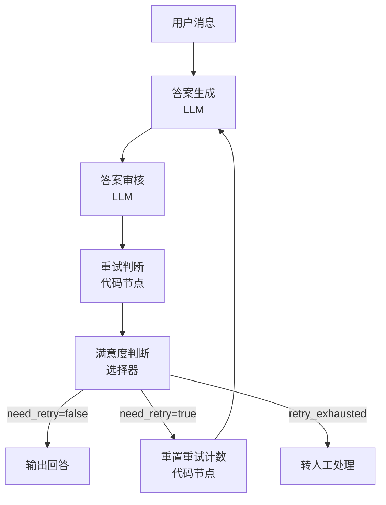

#### 11.2 图文校验表

| 连线编号 | 起始节点 | 目标节点 | 连线文本 | 校验 |
|---------|---------|---------|---------|------|
| 1 | 用户消息 | 答案生成（LLM） | 无（默认流转） | ✅ 一致 |
| 2 | 答案生成（LLM） | 答案审核（LLM） | 无（默认流转） | ✅ 一致 |
| 3 | 答案审核（LLM） | 重试判断（代码节点） | 无（默认流转） | ✅ 一致 |
| 4 | 重试判断（代码节点） | 满意度判断（选择器） | 无（默认流转） | ✅ 一致 |
| 5 | 满意度判断（选择器） | 输出回答 | need_retry=false | ✅ 一致 |
| 6 | 满意度判断（选择器） | 重置重试计数（代码节点） | need_retry=true | ✅ 一致 |
| 7 | 重置重试计数（代码节点） | 答案生成（LLM） | 无（默认流转，回到重新生成） | ✅ 一致 |
| 8 | 满意度判断（选择器） | 转人工处理 | retry_exhausted | ✅ 一致 |

#### 11.3 文本版流程

1. 用户发送消息，进入 **答案生成（LLM）** 节点，基于知识库检索结果生成回答。
2. 生成的回答流入 **答案审核（LLM）** 节点，从准确性、安全性、规范性、完整性四个维度进行审核。
3. 审核结果（JSON 格式）流入 **重试判断（代码节点）**，解析审核结果并判断是否需要重试：
   - 若 `approved == true`，设置 `need_retry = false`。
   - 若 `approved == false` 且 `retry_cnt < 1`，设置 `need_retry = true`。
   - 若 `approved == false` 且 `retry_cnt >= 1`，设置 `retry_exhausted = true`。
4. 判断结果流入 **满意度判断（选择器）**，根据标志进行路由：
   - `need_retry == false` → **输出回答**，直接返回给用户。
   - `need_retry == true` → **重置重试计数（代码节点）**，将 retry_cnt 加 1 后重新回到答案生成节点。
   - `retry_exhausted == true` → **转人工处理**，将问题升级至人工客服。

#### 11.4 节点配置详情表

| 节点名 | 类型 | 输入 | 输出 | 说明 |
|-------|------|------|------|------|
| 答案生成 | LLM（大模型） | 用户消息、知识库检索结果、会话历史 | `answer`（生成的回答） | 模型：Pro 32B+，temperature 0.3，基于知识库结果生成回答 |
| 答案审核 | LLM（大模型） | `answer`（待审核回答）、用户原始问题 | `review_result`（JSON：approved / reason / revision_hint） | 模型：Lite 7B+，temperature 0.1，强制 JSON 输出 |
| 重试判断 | 代码节点（Python） | `review_result`（审核结果 JSON）、`retry_cnt`（当前重试计数） | `need_retry`（是否需要重试）、`retry_exhausted`（重试是否耗尽） | 解析审核结果，结合重试计数判断下一步动作 |
| 满意度判断 | 选择器（条件分支） | `need_retry`、`retry_exhausted` | 路由至不同下游节点 | 三个分支：通过→输出、需重试→重置计数、失败→转人工 |
| 重置重试计数 | 代码节点（Python） | `retry_cnt`（当前重试计数） | `retry_cnt`（更新后的重试计数） | retry_cnt + 1，写回会话变量 |
| 输出回答 | 输出节点 | `answer` | 最终回答文本 | 将通过审核的回答输出给用户 |
| 转人工处理 | 转人工节点 | 用户消息、审核原因 | 转人工提示 | 重试耗尽后升级至人工客服 |

#### 11.5 答案审核 Prompt

```
你是回答质量审核员。请严格审核回答是否符合规范。
审核维度（四维度全部通过才可放行）：
1. 准确性：回答是否全部来自知识库？是否编造信息？
2. 安全性：是否包含敏感信息（手机号、身份证等）？
3. 规范性：语气是否友好？格式是否清晰？
4.完整性：是否回答了核心问题？
输出 JSON：approved（布尔）、reason（原因）、revision_hint（修改建议，通过时为空）
```

#### 11.6 代码节点完整代码

##### 重试判断（代码节点）

```python
async def main(args: Args) -> Output:
    """
    重试判断节点：解析审核结果，判断是否需要重试或转人工
    """
    params = args.params

    # 解析审核结果（审核节点输出为 JSON 字符串）
    review_result = str(params.get("review_result", "{}"))
    try:
        review = json.loads(review_result)
    except (json.JSONDecodeError, TypeError):
        review = {}

    approved = review.get("approved", False)
    reason = review.get("reason", "审核结果解析失败")
    revision_hint = review.get("revision_hint", "")

    # 解析重试计数（会话变量为 String 类型，需 int 转换）
    retry_cnt = int(params.get("retry_cnt", "0"))

    # 判断逻辑
    if approved:
        ret: Output = {"need_retry": False, "retry_exhausted": False, "reason": reason}
        return ret
    elif retry_cnt < 1:
        ret: Output = {"need_retry": True, "retry_exhausted": False, "reason": reason, "revision_hint": revision_hint}
        return ret
    else:
        ret: Output = {"need_retry": False, "retry_exhausted": True, "reason": reason, "revision_hint": revision_hint}
        return ret
```

##### 递增重试计数（代码节点）

```python
async def main(args: Args) -> Output:
    """
    递增重试计数节点：将 retry_cnt 加 1 并返回
    """
    retry_cnt = int(args.params.get("retry_cnt", "0"))
    ret: Output = {"retry_cnt_out": str(retry_cnt + 1)}
    return ret
```

---

### 问题 12：Agent 回复过于冗长/机械

> 本问题通过两个方案协同解决：方案一为全局 Prompt 约束，方案二为固定文案到 LLM 动态生成的逐节点改造。

#### 12.1 Mermaid 流程图（方案对比）

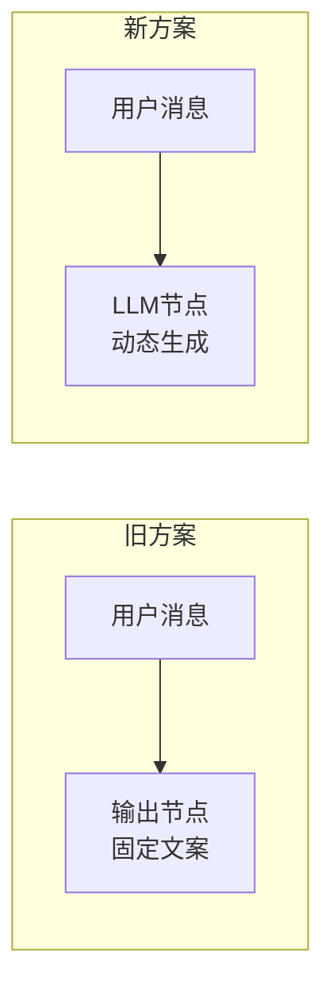

#### 12.2 图文校验表

| 连线编号 | 起始节点 | 目标节点 | 连线文本 | 所属方案 | 校验 |
|---------|---------|---------|---------|---------|------|
| 1 | 用户消息 | 输出节点（固定文案） | 无（默认流转） | 旧方案 | ✅ 一致 |
| 2 | 用户消息 | LLM 节点（动态生成） | 无（默认流转） | 新方案 | ✅ 一致 |

#### 12.3 文本版流程

本问题通过两个方案协同解决：

**方案一：Prompt 约束（全局生效）**

在所有大模型节点的 System Prompt 中统一加入通用约束，从源头控制回复的长度和风格。该方案无需新增节点，只需修改现有 LLM 节点的 Prompt 配置。

**方案二：固定文案 → LLM 动态生成（逐节点改造）**

将原本使用固定文案的输出节点，替换为 LLM 节点，根据用户的具体问题动态生成个性化的回复话术。改造涉及以下 5 个节点：

1. **挽留引导**：旧方案输出固定文案"不好意思，请问您遇到了什么问题？"；新方案使用 LLM 根据用户问题动态生成挽留话术。
2. **能力引导**：旧方案输出固定文案"我无法处理该问题，请咨询..."；新方案使用 LLM 根据用户问题动态告知能力范围。
3. **意图澄清**：旧方案输出固定文案"请详细描述您的问题"；新方案使用 LLM 根据初步意图动态生成有针对性的追问。
4. **情绪安抚**：旧方案输出固定文案"抱歉给您带来不便"；新方案使用 LLM 根据情绪程度动态生成个性化安抚。
5. **未命中引导**：旧方案输出固定文案"请换个方式描述"；新方案使用 LLM 根据用户原始问题动态引导。

#### 12.4 节点配置详情表

##### 方案一：通用 Prompt 约束（适用于所有 LLM 节点）

| 节点名 | 类型 | 输入 | 输出 | 说明 |
|-------|------|------|------|------|
| 所有 LLM 节点 | LLM（大模型） | 各自原有输入 | 各自原有输出 | 在 System Prompt 末尾统一追加下方"通用约束"内容 |

##### 方案二：固定文案 → LLM 动态生成

| 节点名 | 类型 | 输入 | 输出 | 说明 |
|-------|------|------|------|------|
| 挽留引导 | LLM（大模型） | 用户消息、会话历史 | `retain_text`（挽留话术） | 模型：Lite 7B, temperature 0.4，根据用户问题动态生成挽留话术 |
| 能力引导 | LLM（大模型） | 用户消息、会话历史、能力范围列表 | `capability_text`（能力引导话术） | 模型：Lite 7B, temperature 0.3，根据用户问题动态告知能力范围 |
| 意图澄清 | LLM（大模型） | 用户消息、初步意图、会话历史 | `clarify_text`（澄清追问话术） | 模型：Lite 7B, temperature 0.4，根据初步意图动态生成有针对性的追问 |
| 情绪安抚 | LLM（大模型） | 用户消息、emotion 值、会话历史 | `comfort_text`（安抚话术） | 模型：Lite 7B, temperature 0.4，根据情绪程度动态生成个性化安抚 |
| 未命中引导 | LLM（大模型） | 用户消息、会话历史 | `guide_text`（引导话术） | 模型：Lite 7B, temperature 0.4，根据用户原始问题动态引导 |

#### 12.5 Prompt 内容

##### 方案一：通用约束（追加到所有 LLM 节点的 System Prompt 末尾）

```
## 通用约束
- 回答不超过 300 字
- 涉及步骤时使用编号分点
- 不要说"我是AI"、"我是机器人"、"作为AI助手"
- 语气自然口语化
```

##### 方案二：各节点 Prompt

**挽留引导 Prompt：**
```
你是{{AGENT_NAME}}。用户准备离开对话，请根据用户之前提到的问题，
生成一段简短的挽留话术。要求：表达关心，询问用户遇到了什么问题，
不超过2句话，语气自然口语化，不要说"我是AI"。
```

**能力引导 Prompt：**
```
你是{{AGENT_NAME}}。用户的问题超出了你的处理能力范围。
请根据用户的具体问题，告知用户你能处理的问题范围，并引导用户
通过正确渠道解决当前问题。要求：不超过3句话，语气友好，
不要说"我是AI"，不要直接给出联系方式。
```

**意图澄清 Prompt：**
```
你是{{AGENT_NAME}}。用户的意图不够明确，初步判断可能为：{{preliminary_intent}}。
请根据用户的原始消息和初步意图，生成一段有针对性的追问话术，
帮助用户更清晰地描述问题。要求：不超过2句话，语气自然，
不要说"我是AI"，追问要具体而非笼统。
```

**情绪安抚 Prompt：**
```
你是{{AGENT_NAME}}。用户表达了负面情绪（不满、愤怒、焦虑等）。
根据用户的具体问题和情绪程度，生成一段简短的安抚话术。
要求：表达理解和歉意，表示愿意帮助解决问题，不超过3句话，
语气真诚不要机械，不要说"我是AI"，不要直接给出联系方式。
```

**未命中引导 Prompt：**
```
你是{{AGENT_NAME}}。未能在知识库中找到与用户问题匹配的答案。
请根据用户的原始问题，生成一段引导话术，帮助用户换一种方式描述问题。
要求：不超过2句话，语气友好，可以给出一些描述方向的提示，
不要说"我是AI"，不要机械地让用户"换个方式描述"。
```

#### 12.6 新旧方案对比总结

| 对比维度 | 旧方案（固定文案） | 新方案（LLM 动态生成） |
|---------|-----------------|---------------------|
| 回复内容 | 千篇一律，所有用户看到相同话术 | 根据用户具体问题动态生成个性化回复 |
| 用户体验 | 机械、生硬，用户感知到"模板化" | 自然、有针对性，用户感知到"被理解" |
| 节点类型 | 输出节点（直接返回固定文本） | LLM 节点（Lite 7B，低成本） |
| 响应延迟 | 极低（无模型调用） | 略增（需一次 Lite 模型调用，约 200-500ms） |
| 维护成本 | 修改需更新节点配置 | 修改 Prompt 即可，更灵活 |
| 适用场景 | 简单、无需个性化的场景 | 需要根据用户上下文动态调整话术的场景 |

---

> **参考来源**：
> - [Escalation Pathways — AI UX Design Guide](https://www.aiuxdesign.guide/patterns/escalation-pathways)
> - [AI Agent Conversation Design Patterns — ECOSIRE](https://ecosire.com/blog/ai-agent-conversation-design)
> - [Confidence-Based Human Escalation — AI Agent Design Patterns](https://github.com/joehubert/ai-agent-design-patterns/wiki/Confidence%E2%80%90Based-Human-Escalation)
> - [Conflict Resolution UX — 结构化澄清请求](https://blog.csdn.net/weixin_41455464/article/details/156517070)
> - Coze 平台 v1.0 → v1.2.3 迭代实战经验
