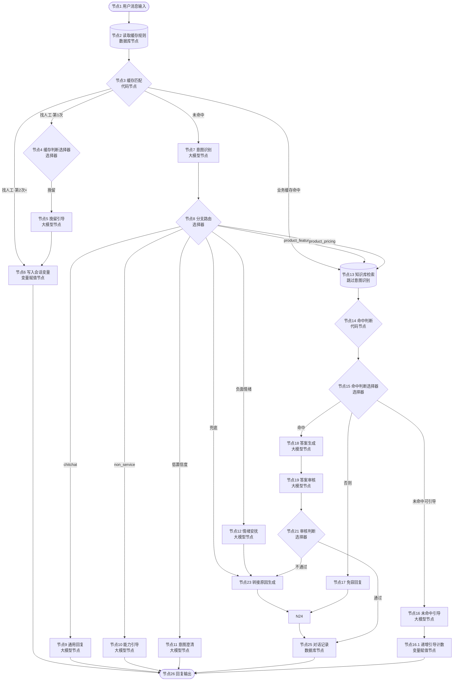

# 流程总览

> 企业AI Agent客服应用 - Coze v1.2.3 配置手册 | [← 返回目录](00-README.md)

## 版本说明

v1.2.3 基于通用版 v1.2 的完整架构，针对无代码/低代码产品场景做了精简适配。主要变更：

| 变更项 | v1.2（通用版） | v1.2.3（低代码平台） |
|-------|---------------|---------------------|
| 意图分类 | 3 类（product_inquiry / chitchat / non_service） | 4 类（product_feature / product_pricing / chitchat / non_service） |
| 分支路由 | 5 分支 + 兜底 | 6 分支 + 兜底 |
| 缓存规则 | 电商场景（退货、支付、发货等） | 低代码场景（导入、自动化、权限、价格等） |
| FAQ 知识库 | 电商高频问题 | 低代码产品高频问题（10 条） |
| 能力引导文案 | 电商能力范围 | 低代码产品能力范围 |
| 促单话术 | 购买判断 + 商品促单 | 价格/版本场景 + 升级促单 |
| 产品知识库方向 | 商品信息、规格参数 | 搭建能力、数据模型、视图、工作流、权限等 |
| 知识库检索 | 双库串联（FAQ→产品） | 单节点同时检索 FAQ + 产品知识库 |
| 进度反馈 | 有独立节点 | 已删除，直接进入知识库检索 |
| 情绪安抚 | 固定文案输出节点 | LLM 动态生成安抚话术 |
| 答案审核 | 必选节点 | 可选节点（增加 1-2s 延迟） |
| 缓存匹配 | transfer_cnt 不重置 | 业务缓存命中/未命中时重置 transfer_cnt 为 "0" |

v1.2.3 为精简版，意图分类 4 类，先跑通流程。

---

### 整体流程（Mermaid）

> 在支持 Mermaid 渲染的 Markdown 阅读器中查看可视化流程图。



### 文本版流程图

```
节点1 用户消息输入
  │
  ▼
节点2 读取缓存规则（数据库）→ 节点3 缓存匹配（代码）
  │
  ├── 找人工·第1次 ──→ 节点5 挽留引导 → 节点6 写入会话变量 → 节点26 回复输出
  ├── 找人工·第2次+ ─→ 节点6 写入会话变量 → 节点26 回复输出
  ├── 业务缓存命中 ──→ 节点13 知识库检索（跳过意图识别）
  └── 未命中 ────────→ 节点7 意图识别（大模型）
                          │
                    ┌─────┼─────┬─────┬─────┬─────┬─────┐
                    ▼     ▼     ▼     ▼     ▼     ▼     ▼
                  闲聊  超范围  低置信  产品   价格   负面  兜底
                  节点9  节点10  节点11  节点13 节点13 节点12 节点23
                  通用  能力   意图   知识库 知识库 情绪  转接
                  回复  引导   澄清   检索   检索   安抚  原因
                    │     │     │     │     │     │     │
                    └─────┴─────┴─────┴──┬──┴──┬──┘     │
                                       ▼     ▼         │
                                  节点13 知识库检索       │
                                       │                │
                                  ┌────┴────┐          │
                                  ▼         ▼          │
                                命中     未命中         │
                                  │         │          │
                                  │    ┌────┴────┐     │
                                  │    ▼         ▼     │
                                  │  可引导   不可引导   │
                                  │    │         │     │
                                  ▼    ▼         ▼     │
                              节点18 答案生成  节点16  节点17
                                  │    │    未命中   免容
                                  ▼    │    引导     回复
                              节点19 答案审核  │      │
                                  │         │      │
                            ┌─────┼─────┐   │      │
                            ▼     ▼     ▼   │      │
                          通过  不通过  兜底    │
                            │     │     │      │
                            ▼     ▼     ▼      │
                        节点25  节点23  节点23  ←──┘
                        对话记录 转接原因 转接原因
                            │    生成    生成
                            ▼     │      ↑
                        节点26  └──┬─────┘（情绪安抚也连入）
                        回复输出    ↓
                            节点24 联系方式引导
                                  → 节点25 对话记录
                                  → 节点26 回复输出
```

### 节点速查表

| # | 节点 | 类型 | 功能 | 关键输出 |
|---|------|------|------|---------|
| 1 | 用户消息输入 | 开始 | 接收消息 | USER_INPUT |
| 2 | 读取缓存规则 | 数据库 | 查询缓存规则表 | outputList |
| 3 | 缓存匹配 | 代码 | 匹配规则，找人工两次触发，transfer_cnt 重置 | is_hit / boost_query / transfer_cnt |
| 4 | 缓存判断 | 选择器 | 4分支路由 | — |
| 5 | 挽留引导 | 大模型 | LLM动态挽留 | 文本 |
| 6 | 写入会话变量 | 变量赋值 | 处理 transfer_cnt 写入 | — |
| 7 | 意图识别 | 大模型 | 识别意图/置信度/情绪 | intent / confidence / key_info / emotion |
| 8 | 分支路由 | 选择器 | 7分支路由 | — |
| 9 | 通用回复 | 大模型 | LLM动态生成闲聊回复（问候/感谢/告别/闲聊），温度 0.6 | 文本 |
| 10 | 能力引导 | 大模型 | LLM动态引导能力范围 | 文本 |
| 11 | 意图澄清 | 大模型 | LLM动态追问 | 文本 |
| 12 | 情绪安抚 | 大模型 | LLM动态生成安抚话术，安抚后→转接原因生成 | 文本 |
| 13 | 知识库检索 | 知识库 | 同时检索 FAQ + 产品知识库 | outputList |
| 14 | 命中判断 | 代码 | 判断知识库是否命中，检查 guide_cnt 防止无限引导 | has_knowledge_hit / can_guide |
| 15 | 命中判断选择器 | 选择器 | 3分支路由 | — |
| 16 | 未命中引导 | 大模型 | LLM动态引导补充描述 | 文本 |
| 16.1 | 递增引导计数 | 变量赋值 | guide_cnt +1 写回会话变量 | — |
| 17 | 免容回复 | 输出 | 兜底回复 | — |
| 18 | 答案生成 | 大模型 | 生成回答（含促单） | answer |
| 19 | 答案审核 | 大模型 | 审核答案质量（可选节点） | approved / reason / revision_hint |
| 21 | 审核判断 | 选择器 | 2分支 + 兜底路由 | — |
| 23 | 转接原因生成 | 代码 | 生成转接原因 | transfer_reason |
| 24 | 联系方式引导 | 输出 | 输出联系方式 | — |
| 25 | 对话记录 | 数据库 | 记录异常信息 | — |
| 26 | 回复输出 | 结束 | 输出给用户 | — |

---
