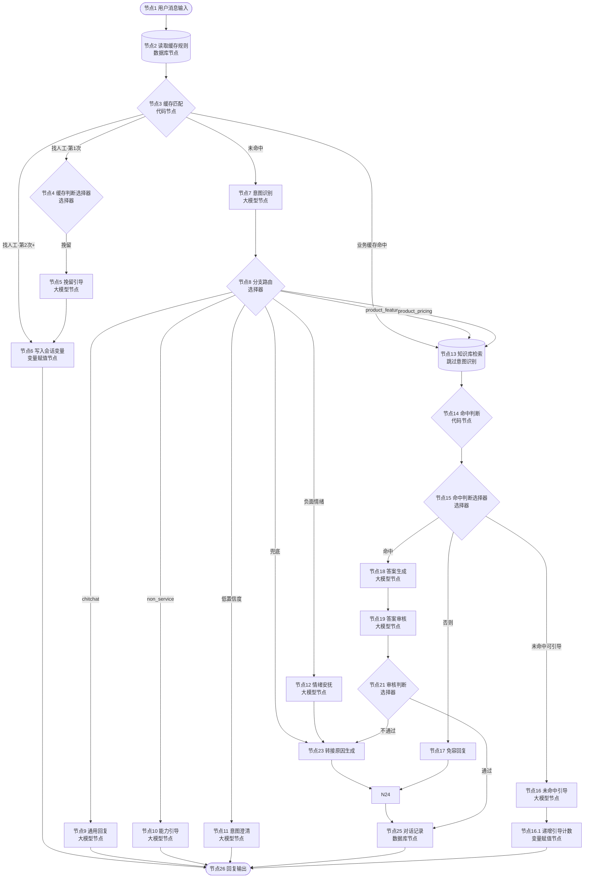

# 企业AI Agent客服应用 - Coze v1.2.3 配置手册（低代码平台）

> **版本**：v1.2.3（低代码平台） | **平台**：Coze 扣子（对话流 Chatflow）
> **目标**：按本手册逐步操作，可在 Coze 中完整搭建面向无代码/低代码产品的 AI 客服系统
> **基于**：通用版 v1.2 架构，适配无代码/低代码产品场景

## 变更记录

| 版本 | 日期 | 变更内容 |
|------|------|---------|
| v1.2.3 | 2026-04-23 | 去掉重试逻辑：删除节点20 重试判断、节点22 递增重试计数，节点21 满意度判断改为审核判断（2分支+兜底），删除 retry_cnt 会话变量，答案审核不通过直接转人工 |
| v1.2.3 | 2026-04-22 | **Bug 修复与优化**（共 31 项）<br/>**高严重程度（6 项）**：H-01 guide_cnt 死变量修复（节点14 增加 guide_cnt 输入，新增节点16.1 递增引导计数）；H-02 retry_cnt TypeError 修复（节点20 统一 int/str 转换）；H-03 重试死循环修复（节点22 改为递增重试计数）；H-04 retry_cnt 跨问题污染修复（节点6 增加 retry_cnt 重置）；H-05 转接原因空值保护（节点23 intent 为空时输出"未知意图"）；H-06 情绪安抚路径修复（节点12→节点23→节点24）<br/>**中严重程度（10 项）**：M-01 通用回复改为 LLM 动态生成；M-02 负面情绪分支优先级调整；M-03 缓存匹配增加否定词过滤；M-04 revision_hint 移到 User Prompt；M-05 知识库检索 Query 拼接 boost_query；M-06 scenario 字段赋值指引；M-07 免容回复去掉联系方式；M-08 多路径输出说明；M-09 chitchat 置信度矛盾修复；M-10 审核异常处理改为默认通过<br/>**低严重程度（15 项）**：L-01~L-15 代码健壮性与维护性优化 |
| v1.2.3 | 2026-04-22 | 1. 删除进度反馈节点（优化1），分支路由 product_feature/product_pricing 直接连接知识库检索，缓存判断业务缓存命中直接连接知识库检索<br/>2. 缓存匹配代码增加 transfer_cnt 重置（优化2），业务缓存命中和未命中时 transfer_cnt 输出为 "0"<br/>3. 双知识库合并为单节点检索（优化3），删除 FAQ知识库检索/FAQ命中判断/FAQ命中判断选择器/产品知识库检索/产品命中判断/产品命中判断选择器 6 个节点，新增知识库检索+命中判断+命中判断选择器 3 个节点<br/>4. 情绪安抚改为 LLM 节点（优化5），使用豆包 Lite 7B 动态生成安抚话术<br/>5. 答案审核标记为可选节点（优化6），增加延迟说明<br/>6. 更新找人工计数节点改名为"写入会话变量"（优化7），处理 transfer_cnt 写入<br/>7. 答案生成新增 intent 输入参数（优化8）<br/>8. 全部节点重新编号为 1-26 |
| v1.2.2 | 2026-04-21 | 1. 统一节点配置描述格式（名称→作用→输入/配置/输出）<br/>2. 选择器节点补充每个分支对应的下一个节点<br/>3. 引导节点改为 LLM 节点（能力引导、未命中引导、挽留引导）<br/>4. 缓存匹配代码简化（输出参数从 7 个减为 3 个）<br/>5. 变量名缩短（transfer_request_count → transfer_cnt）<br/>6. 知识库检索 Query 简化为单一输入 |
| v1.2.1 | 2026-04-21 | 基于通用版 v1.2 架构，适配无代码/低代码产品场景。意图分类 4 类，缓存规则 6 条，FAQ 10 条。 |

## 版本说明

v1.2.3 基于通用版 v1.2 的完整架构，针对无代码/低代码产品场景做了精简适配。主要变更：

| 变更项 | v1.2（通用版） | v1.2.3（低代码平台） |
|-------|---------------|---------------------|
| 意图分类 | 3 类（product_inquiry / chitchat / non_service） | 4 类（product_feature / product_pricing / chitchat / non_service） |
| 分支路由 | 5 分支 + 兜底 | 6 分支 + 兜底 |
| 缓存规则 | 电商场景（退货、支付、发货等） | 低代码场景（导入、自动化、权限、价格等） |
| FAQ 知识库 | 电商高频问题 | 低代码产品高频问题（10 条） |
| 能力引导文案 | 电商能力范围 | 低代码产品能力范围 |
| 促单话术 | 购买判断 + 商品促单 | 价格/版本场景 + 升级促单 |
| 产品知识库方向 | 商品信息、规格参数 | 搭建能力、数据模型、视图、工作流、权限等 |
| 知识库检索 | 双库串联（FAQ→产品） | 单节点同时检索 FAQ + 产品知识库 |
| 进度反馈 | 有独立节点 | 已删除，直接进入知识库检索 |
| 情绪安抚 | 固定文案输出节点 | LLM 动态生成安抚话术 |
| 答案审核 | 必选节点 | 可选节点（增加 1-2s 延迟） |
| 缓存匹配 | transfer_cnt 不重置 | 业务缓存命中/未命中时重置 transfer_cnt 为 "0" |

v1.2.3 为精简版，意图分类 4 类，先跑通流程。

---

> **LLM 节点异常处理"设定内容"格式规则**：设定内容的格式必须与节点的输出格式设置一致。如果输出格式为 **Text**，设定内容应为纯文本；如果输出格式为 **JSON**，设定内容应为合法的 JSON 字符串。

## 流程总览

### 整体流程（Mermaid）

> 在支持 Mermaid 渲染的 Markdown 阅读器中查看可视化流程图。



### 文本版流程图

```
节点1 用户消息输入
  │
  ▼
节点2 读取缓存规则（数据库）→ 节点3 缓存匹配（代码）
  │
  ├── 找人工·第1次 ──→ 节点5 挽留引导 → 节点6 写入会话变量 → 节点26 回复输出
  ├── 找人工·第2次+ ─→ 节点6 写入会话变量 → 节点26 回复输出
  ├── 业务缓存命中 ──→ 节点13 知识库检索（跳过意图识别）
  └── 未命中 ────────→ 节点7 意图识别（大模型）
                          │
                    ┌─────┼─────┬─────┬─────┬─────┬─────┐
                    ▼     ▼     ▼     ▼     ▼     ▼     ▼
                  闲聊  超范围  低置信  产品   价格   负面  兜底
                  节点9  节点10  节点11  节点13 节点13 节点12 节点23
                  通用  能力   意图   知识库 知识库 情绪  转接
                  回复  引导   澄清   检索   检索   安抚  原因
                    │     │     │     │     │     │     │
                    └─────┴─────┴─────┴──┬──┴──┬──┘     │
                                       ▼     ▼         │
                                  节点13 知识库检索       │
                                       │                │
                                  ┌────┴────┐          │
                                  ▼         ▼          │
                                命中     未命中         │
                                  │         │          │
                                  │    ┌────┴────┐     │
                                  │    ▼         ▼     │
                                  │  可引导   不可引导   │
                                  │    │         │     │
                                  ▼    ▼         ▼     │
                              节点18 答案生成  节点16  节点17
                                  │    │    未命中   免容
                                  ▼    │    引导     回复
                              节点19 答案审核  │      │
                                  │         │      │
                            ┌─────┼─────┐   │      │
                            ▼     ▼     ▼   │      │
                          通过  不通过  兜底 ←──┘
                            │     │     │
                            ▼     ▼     ▼
                        节点25  节点23  节点23
                        对话记录 转接原因 转接原因
                            │  生成    生成
                            ▼     │      ↑
                        节点26  ┌──┘（情绪安抚也连入）
                        回复输出 │
                                  ↓
                            节点24 联系方式引导
                                  → 节点25 对话记录
                                  → 节点26 回复输出
```

### 节点速查表

| # | 节点 | 类型 | 功能 | 关键输出 |
|---|------|------|------|---------|
| 1 | 用户消息输入 | 开始 | 接收消息 | USER_INPUT |
| 2 | 读取缓存规则 | 数据库 | 查询缓存规则表 | outputList |
| 3 | 缓存匹配 | 代码 | 匹配规则，找人工两次触发，transfer_cnt 重置 | is_hit / boost_query / transfer_cnt |
| 4 | 缓存判断 | 选择器 | 4分支路由 | — |
| 5 | 挽留引导 | 大模型 | LLM动态挽留 | 文本 |
| 6 | 写入会话变量 | 变量赋值 | 处理 transfer_cnt 写入 | — |
| 7 | 意图识别 | 大模型 | 识别意图/置信度/情绪 | intent / confidence / key_info / emotion |
| 8 | 分支路由 | 选择器 | 7分支路由 | — |
| 9 | 通用回复 | 大模型 | LLM动态生成闲聊回复（问候/感谢/告别/闲聊），温度 0.6 | 文本 |
| 10 | 能力引导 | 大模型 | LLM动态引导能力范围 | 文本 |
| 11 | 意图澄清 | 大模型 | LLM动态追问 | 文本 |
| 12 | 情绪安抚 | 大模型 | LLM动态生成安抚话术，安抚后→转接原因生成 | 文本 |
| 13 | 知识库检索 | 知识库 | 同时检索 FAQ + 产品知识库 | outputList |
| 14 | 命中判断 | 代码 | 判断知识库是否命中，检查 guide_cnt 防止无限引导 | has_knowledge_hit / can_guide |
| 15 | 命中判断选择器 | 选择器 | 3分支路由 | — |
| 16 | 未命中引导 | 大模型 | LLM动态引导补充描述 | 文本 |
| 16.1 | 递增引导计数 | 代码（Python） | guide_cnt +1 写回会话变量 | — |
| 17 | 免容回复 | 输出 | 兜底回复 | — |
| 18 | 答案生成 | 大模型 | 生成回答（含促单） | answer |
| 19 | 答案审核 | 大模型 | 审核答案质量（可选节点） | approved / reason / revision_hint |
| 21 | 审核判断 | 选择器 | 2分支 + 兜底路由 | — |
| 23 | 转接原因生成 | 代码 | 生成转接原因 | transfer_reason |
| 24 | 联系方式引导 | 输出 | 输出联系方式 | — |
| 25 | 对话记录 | 数据库 | 写入6个字段：user_question、intent、scenario、answer、transfer_reason、timestamp | — |
| 26 | 回复输出 | 结束 | 输出给用户 | — |

---

## 目录

- [前置准备](#前置准备)
- [第一步：创建对话流](#第一步创建对话流)
- [第二步：创建知识库](#第二步创建知识库)
- [第三步：创建会话变量](#第三步创建会话变量)
- [第四步：配置节点（按顺序）](#第四步配置节点按顺序)
- [第五步：连接节点](#第五步连接节点)
- [第六步：测试验证](#第六步测试验证)
- [第七步：发布上线](#第七步发布上线)
- [常见问题排查](#常见问题排查)

---

## 前置准备

| 准备项 | 要求 |
|-------|------|
| Coze 账号 | 已注册 [coze.cn](https://www.coze.cn)，建议付费套餐（专业版 9.9元/月） |
| 知识库素材 | 无代码产品知识文档（Markdown/TXT/Word）、FAQ 问答列表 |
| 联系方式 | 人工客服的微信号/企业微信/客服电话等 |

---

## 第一步：创建对话流

### 1.1 进入 Coze 平台

1. 打开 [coze.cn](https://www.coze.cn)，登录账号
2. 进入**工作空间**（左侧边栏选择你的团队/个人空间）

### 1.2 创建智能体

1. 点击左侧**「智能体」**菜单
2. 点击**「创建智能体」**按钮
3. 填写基本信息：
   - **名称**：`在线客服`（可自定义）
   - **描述**：`无代码/低代码产品智能客服，自动回答产品功能、使用方法、价格版本等常见问题`
4. 点击**「创建」**

### 1.3 创建对话流

1. 进入刚创建的智能体 → 点击**「对话流」**标签页
2. 点击**「创建对话流」**
3. 输入名称：`客服主流程`
4. 点击**「确认」**，进入对话流编辑器

> 进入编辑器后，画布中央会自动出现一个**「开始」**节点和一个**「结束」**节点。

---

## 第二步：创建知识库

> 在配置节点之前，先创建好知识库，后续知识库检索节点需要绑定。

### 2.1 创建产品知识库

1. 点击左侧**「知识库」**菜单（或进入「资源库」→「知识库」）
2. 点击**「创建知识库」**
3. 填写信息：
   - **名称**：`产品知识库`
   - **描述**：`无代码产品功能介绍、版本定价、使用教程、常见错误与解决方案、API与集成指南等`
4. 点击**「创建」**
5. 进入知识库 → 点击**「添加文件」** → 上传产品相关文档（Markdown/TXT/Word）
6. 等待文件解析完成

**产品知识库内容方向**：
- 无代码产品功能介绍（搭建能力、数据模型、视图、工作流、权限等）
- 版本与定价详情
- 使用教程（创建应用、配置自动化、设置权限、数据导入导出等）
- 常见错误与解决方案
- API 与集成指南

### 2.2 创建 FAQ 知识库

**创建方式**：Coze 资源库 → 知识库 → 新建知识库

**配置**：

| 配置项 | 值 | 说明 |
|-------|---|------|
| 名称 | `FAQ知识库` | — |
| 知识库类型 | 扣子知识库 | — |
| 检索策略 | 语义 | 向量相似度匹配 |
| 最大召回数量 | 3 | FAQ 库小，3 条足够 |
| 最小匹配度 | 0.5 | 与产品知识库一致 |

**FAQ 条目编写规范**：

每条 FAQ 应包含完整的问答对，格式为：

```
Q：免费版有什么限制？
A：免费版通常限制：用户数（10-20人）、单表数据量（2000-10000行）、自动化执行次数（200-1000次/月）、不支持高级权限、API调用、数据同步等功能。具体限制以各版本说明为准。
```

**FAQ 条目来源**：
- 从客服工单中提取高频问题
- 从产品知识库中提炼核心 Q&A
- 用 AI 生成候选 FAQ，人工审核后入库

**FAQ 知识库 vs 产品知识库的区别**：

| 对比 | FAQ 知识库 | 产品知识库 |
|------|-----------|-----------|
| 规模 | 100-200 条 | 大量（文档、政策等） |
| 内容 | 人工验证的 Q&A 对 | 原始文档 |
| 准确率 | 100%（人工验证） | 依赖文档质量 |
| 检索速度 | 快（库小） | 稍慢（库大） |
| 用途 | 高频问题精准回答 | 长尾问题兜底覆盖 |

### 2.3 知识库内容格式要求

上传的文档建议使用以下格式（一问一答结构）：

```
Q: 免费版有什么限制？
A: 免费版通常限制：用户数（10-20人）、单表数据量（2000-10000行）、自动化执行次数（200-1000次/月）、不支持高级权限、API调用、数据同步等功能。具体限制以各版本说明为准。

Q: 各版本价格和功能有什么区别？
A: 一般分为免费版、标准版/专业版、旗舰版。主要差异在用户数、数据量、自动化次数、高级功能（权限、API、数据同步）等方面。建议根据团队规模和业务需求选择。

Q: 怎么升级版本？
A: 进入「设置」→「版本管理」→ 选择目标版本 → 确认支付。升级后功能立即生效，数据不会丢失。支持按月/按年付费。

Q: 数据导入失败怎么办？
A: 常见原因：①字段类型不匹配（如文本导入到数字字段）②Excel格式问题（含合并单元格、特殊字符）③数据量超过限制。建议：先清理Excel格式，确保字段类型一致，分批导入大数据量。

Q: 怎么创建自动化/工作流？
A: 进入应用 → 点击「自动化」→ 新建规则 → 设置触发条件（如：当新增记录时）→ 添加执行动作（如：发送通知、更新字段）→ 保存并启用。

Q: 怎么配置权限？
A: 进入「设置」→「权限管理」→ 创建角色 → 设置数据权限（可见/可编辑/不可见）和功能权限 → 将用户分配到对应角色。支持行列级别精细控制。

Q: 关联字段怎么用？
A: 关联字段用于连接两个数据表。创建方式：添加字段 → 选择「关联」类型 → 选择目标表。设置后可以在当前表中引用目标表的数据，支持查找引用获取关联表的字段值。

Q: 单表最多支持多少行数据？
A: 不同版本限制不同：免费版通常2000-10000行，标准版2万-10万行，专业版10万-100万行，旗舰版可能不限。超出限制后需要升级版本或分表存储。

Q: 怎么对接外部系统（API/webhook）？
A: 标准版及以上支持API和webhook。配置方式：进入「设置」→「API管理」→ 生成API密钥 → 参考API文档调用接口。webhook可在自动化中配置，当触发条件满足时向指定URL发送数据。

Q: 数据怎么导出？
A: 进入数据表 → 点击右上角「导出」→ 选择格式（Excel/CSV）→ 选择导出范围（全部/筛选结果）→ 确认导出。大批量数据导出可能需要一些时间。
```

> **提示**：每个 Q&A 之间用空行分隔，便于 Coze 自动分段。

---

## 第三步：创建会话变量

> 需要创建两个会话变量（均为 String 类型），`guide_cnt` 用于记录未命中引导次数，防止无限引导，`transfer_cnt` 用于记录找人工请求次数，实现"找人工两次触发"机制。

### 3.1 创建 guide_cnt 会话变量

1. 在同一面板中，点击**「添加变量」**
2. 配置：
   - **变量名**：`guide_cnt`
   - **类型**：String
   - **默认值**：`"0"`
3. 点击**「保存」**

> **说明**：`guide_cnt` 记录知识库未命中引导用户补充描述的次数（String 类型），最多引导1次，防止无限循环。

### 3.2 创建 transfer_cnt 会话变量

1. 在同一面板中，点击**「添加变量」**
2. 配置：
   - **变量名**：`transfer_cnt`
   - **类型**：String
   - **默认值**：`"0"`
3. 点击**「保存」**

> **说明**：`transfer_cnt` 记录用户在当前会话中请求找人工的次数（String 类型），初始值 "0"，每次找人工 +1。第一次找人工时触发挽留引导，第二次及以上才直接给出联系方式。业务缓存命中或未命中时重置为 "0"（v1.2.3 新增）。

---

## 第四步：配置节点（按顺序）

> 以下所有操作均在**对话流编辑器**中完成。
> 操作方式：点击画布空白处 → 在弹出的节点面板中选择对应节点类型 → 拖入画布。

---

### 节点 1：用户消息输入（开始节点）

**配置步骤**：


**节点作用**：接收用户输入的消息，作为整个对话流的入口


**数据流向**：→ 节点2 读取缓存规则

1. 输入
   - `USER_INPUT` / String / 用户输入的消息（预置参数，不可删除）
   - `CONVERSATION_NAME` / String / 会话标识（预置参数，不可删除）
   - `channel` / String / 用户输入（可选，用于区分渠道）

2. 配置内容
   - 开始节点在创建对话流时已自动生成，无需手动创建
   - 点击画布上的**「开始」**节点，确认有以下两个预置参数
   - 如需区分渠道，可点击**「添加参数」**，添加 `channel` 参数

3. 输出
   - `USER_INPUT` / String / 用户输入的消息文本
   - `CONVERSATION_NAME` / String / 会话标识

---

### 节点 2：读取缓存规则（数据库节点）

**配置步骤**：


**节点作用**：从 Coze 数据库中查询所有已启用的缓存规则，供后续缓存匹配使用


**数据流向**：← 节点1 用户消息输入 | → 节点3 缓存匹配

1. 输入
   - 无需额外输入参数

2. 配置内容
   - 在对话流画布中，点击**「+」** → 选择**「数据库」**节点 → 拖入画布
   - 重命名为 `读取缓存规则`
   - **数据表**：选择 `缓存规则表`（选择后显示表中的字段列表）
   - **查询条件**：点击「+ 添加条件」→ 字段选择 `enabled` → 运算符选择 `=` → 值设为 `true`
   - **查询上限**：设为 `100`（默认即可）
   - **异常处理**：保持默认（节点异常时不重试，直接走异常处理）

3. 输出
   - `outputList` / Array<Object> / 查询结果列表，每条记录包含所有字段
   - `rowNum` / Integer / 查询到的记录数

> 将此节点的 `outputList` 输出连接到「节点3 缓存匹配」代码节点的 `cache_rules` 输入参数

#### 2.1 缓存规则数据表结构

Coze 内置了**数据库**功能（不是飞书多维表格插件），可以直接在对话流中通过「数据库节点」读写数据，无需额外安装插件。

**创建数据表步骤**：

1. **新建数据表**：
   - 输入数据表名称：`缓存规则表`
   - 输入描述：`存储高频问题缓存规则，包括找人工、业务缓存等`
   - 点击「确认」

2. **添加字段**（点击「新增」逐个添加）：

| 字段名 | 类型 | 说明 | 示例 |
|-------|------|------|------|
| `keywords` | String | 触发关键词，用英文逗号分隔 | `找人工,转人工` |
| `boost_query` | String | 增强检索词（业务缓存用） | `版本定价 免费版限制 升级` |
| `direct_answer` | String | 直接回答内容（找人工等场景用，为空则走知识库） | `不好意思没能快速解决...` |
| `min_length` | Number | 触发此规则的用户输入最小字符数 | `2` |
| `category` | String | 分类标签 | `转人工` |
| `priority` | Number | 优先级（数字越小越优先） | `1` |
| `enabled` | Boolean | 是否启用 | `true` |

> **提示**：也可以点击「使用 AI 创建」按钮，输入"缓存规则表，包含关键词、增强检索词、直接回答、最小长度、分类、优先级、是否启用"，让 AI 自动生成字段。

3. **导入预置数据**：

> **重要**：导入数据时，请使用 Coze 导出的模板格式。先手动添加一条数据 → 导出 xlsx → 在导出的模板中替换数据 → 再导入。
>
> - 数值字段（min_length / priority）用字符串格式（如 `"2"` 而非 `2`）
> - 布尔字段（enabled）用字符串 `"true"` / `"false"`
> - 空值用空字符串 `""`
> - 不要包含系统字段（uuid、创建时间等）

预置 6 条规则（已生成导入文件：`缓存规则表（低代码平台）.xlsx`）：

| keywords | boost_query | direct_answer | min_length | category | priority | enabled |
|---------|------------|---------------|-----------|----------|----------|---------|
| `找人工,转人工,人工客服,客服电话` | （留空） | `不好意思没能快速解决你的问题，帮你转接同事处理。\n\n请添加企业微信：Service_001\n或拨打客服热线：400-XXX-XXXX\n\n工作时间：周一至周五 9:00-18:00` | 3 | 转人工 | 1 | ✅ |
| `多少钱,价格,收费标准,怎么收费` | `版本定价 免费版限制 升级` | （留空） | 3 | 价格 | 10 | ✅ |
| `免费版,有什么限制,能用什么` | `免费版功能限制 用户数 行数 自动化次数` | （留空） | 3 | 价格 | 10 | ✅ |
| `数据导入,导入失败,导入报错` | `数据导入 字段类型匹配 批量导入` | （留空） | 4 | 使用 | 10 | ✅ |
| `自动化,工作流,触发器` | `自动化配置 工作流引擎 触发条件` | （留空） | 3 | 使用 | 10 | ✅ |
| `权限设置,字段权限,看不到数据` | `权限配置 角色权限 数据权限` | （留空） | 4 | 使用 | 10 | ✅ |

> **维护方式**：
> - 修改联系方式：直接在数据表中修改第一条规则的 `direct_answer` 字段
> - 新增缓存规则：在数据表中新增一行
> - 禁用规则：将 `enabled` 改为 `false`
> - 调整优先级：修改 `priority` 字段（数字越小越优先匹配）
> - 所有修改**即时生效**，无需改代码、无需重新发布对话流

#### 2.2 匹配机制设计

**如何避免缓存覆盖用户具体描述**：

| 机制 | 说明 |
|------|------|
| **关键词必须是完整短语** | "数据导入"匹配，"导入"不匹配。避免单字/双字过度匹配 |
| **min_length 最小长度** | 用户输入必须 ≥ min_length 字符才触发 |
| **priority 优先级** | 找人工 priority=1 最高优先，业务缓存 priority=10 |
| **direct_answer 区分** | 有 direct_answer 为找人工规则（is_hit="transfer"），无则走知识库快速通道（is_hit="cached"） |
| **boost_query 拼接检索** | 业务缓存命中时，boost_query 拼接到知识库检索 Query 中（仅非空时拼接），增强检索效果 |

---

### 节点 3：缓存匹配（代码节点）

**配置步骤**：


**节点作用**：根据用户输入匹配缓存规则，判断是找人工、业务缓存命中还是未命中。业务缓存命中和未命中时重置 transfer_cnt 为 "0"


**数据流向**：← 节点2 读取缓存规则 | → 节点4 缓存判断

1. 输入
   - `user_question` / String / `{{USER_INPUT}}`
   - `cache_rules` / Array[Object] / 数据库查询结果（`{{读取缓存规则.outputList}}`）
   - `transfer_cnt` / String / 会话变量 `transfer_cnt`

2. 配置内容
   - 点击画布空白处 → 选择**「代码」**节点 → 拖入画布
   - 重命名为 `缓存匹配`
   - 选择语言：Python
   - 粘贴代码：

```python
async def main(args: Args) -> Output:
    params = args.params
    question = str(params.get("user_question", "")).strip()
    question_len = len(question)
    cache_rules = params.get("cache_rules", [])
    transfer_cnt = int(params.get("transfer_cnt", "0"))

    sorted_rules = sorted(cache_rules, key=lambda r: int(float(r.get("priority", 99))))

    # 否定词列表：如果关键词前一个字符是否定词，则跳过匹配
    # 例如用户说"不用导出"，"导出"关键词前面是"不"，应跳过避免误匹配
    negation_words = ["不", "没", "不是", "没有", "不用", "别", "非", "无"]

    for rule in sorted_rules:
        if str(rule.get("enabled", "true")).lower() != "true":
            continue
        min_len = int(rule.get("min_length", 3))
        if question_len < min_len:
            continue
        keywords_str = str(rule.get("keywords", ""))
        keywords = [kw.strip() for kw in keywords_str.split(",") if kw.strip()]
        matched = False
        for kw in keywords:
            if kw in question:
                # 否定词过滤：检查关键词前一个字符是否为否定词
                idx = question.find(kw)
                negated = False
                for neg in negation_words:
                    if idx >= len(neg) and question[idx - len(neg):idx] == neg:
                        negated = True
                        break
                if negated:
                    continue
                matched = True
                break

        if matched:
            direct_answer = str(rule.get("direct_answer", "")).strip()
            boost_query = str(rule.get("boost_query", "")).strip()

            if direct_answer:
                # 找人工规则：计数+1
                new_cnt = str(transfer_cnt + 1)
                ret: Output = {
                    "is_hit": "transfer",
                    "boost_query": "",
                    "transfer_cnt": new_cnt
                }
                return ret
            else:
                # 业务缓存：重置找人工计数
                ret: Output = {
                    "is_hit": "cached",
                    "boost_query": boost_query,
                    "transfer_cnt": "0"
                }
                return ret

    # 未命中：重置找人工计数
    ret: Output = {
        "is_hit": "none",
        "boost_query": "",
        "transfer_cnt": "0"
    }
    return ret
```

3. 输出
   - `is_hit` / String / 命中结果："transfer"（找人工）/ "cached"（业务缓存）/ "none"（未命中）
   - `boost_query` / String / 增强检索词（业务缓存用）
   - `transfer_cnt` / String / 更新后的找人工次数（字符串类型，用于写入会话变量）

> **v1.2.3 变更**：业务缓存命中和未命中时，`transfer_cnt` 输出为 `"0"`（重置找人工计数）。只有找人工规则命中时 `transfer_cnt` 才 +1。这样用户在正常业务咨询后，找人工计数会被重置，避免误触发转人工。

---

### 节点 4：缓存判断（选择器节点）

**配置步骤**：


**节点作用**：根据缓存匹配结果，路由到挽留引导、写入会话变量、知识库检索或意图识别


**数据流向**：← 节点3 缓存匹配 | → 节点5 挽留引导 / 节点6 写入会话变量 / 节点13 知识库检索 / 节点7 意图识别

1. 输入
   - 无需额外输入参数（引用上游节点输出变量）

2. 配置内容
   - 点击画布空白处 → 选择**「选择器」**节点 → 拖入画布
   - 重命名为 `缓存判断`
   - 配置分支条件（按顺序创建，顺序即优先级）：

   **分支 1**：找人工·第1次 → 挽留引导
   - 条件组合模式：**AND**
   - 条件 A：`{{缓存匹配.is_hit}}` 等于（==） `transfer`
   - 条件 B：`{{缓存匹配.transfer_cnt}}` 等于（==） `1`
   - → 连接到：节点5 挽留引导
   - 说明：用户第一次说"找人工"，先引导描述问题，尝试挽留

   **分支 2**：找人工·第2次+ → 写入会话变量 → 回复输出
   - 条件组合模式：**AND**
   - 条件 A：`{{缓存匹配.is_hit}}` 等于（==） `transfer`
   - 条件 B：`{{缓存匹配.transfer_cnt}}` 不等于（!=） `1`
   - → 连接到：节点6 写入会话变量（变量赋值节点）
   - 说明：用户第二次及以上说"找人工"，更新计数后直接返回联系方式

   **分支 3**：业务缓存命中 → 知识库检索快速通道
   - 条件：`{{缓存匹配.is_hit}}` 等于（==） `cached`
   - → 连接到：节点13 知识库检索（跳过意图识别，直接检索）
   - 说明：缓存命中后，知识库检索的 Query = USER_INPUT + boost_query（仅当 boost_query 非空时拼接），key_info 通过会话历史传递给答案生成使用

   **否则分支**：未命中 → 意图识别
   - → 连接到：节点7 意图识别
   - 默认已存在，无需配置

---

### 节点 5：挽留引导（大模型节点）

**配置步骤**：


**节点作用**：用户第一次请求转人工时，LLM 动态生成友好的挽留回复，尝试解决问题


**数据流向**：← 节点4 缓存判断（分支1） | → 节点6 写入会话变量

1. 输入
   - `USER_INPUT` / String / `{{USER_INPUT}}`

2. 配置内容
   - 点击画布空白处 → 选择**「大模型」**节点 → 拖入画布
   - 重命名为 `挽留引导`
   - 模型：选择 **豆包 Lite 7B**
   - 温度（Temperature）：设为 **0.4**
   - 输出格式：选择**「文本」**（Text）
   - 系统提示词（System Prompt）：

```
你是客服助手。用户要求转接人工客服，这是第一次请求。

你的任务是友好地挽留用户，尝试解决问题，而不是直接转人工。

回复要求：
1. 表达歉意，表示理解用户的不满
2. 引导用户描述具体遇到了什么问题
3. 表示愿意帮助解决
4. 不超过3句话
5. 不要说"我是AI""我是机器人"
6. 不要直接给出联系方式
```

   - 用户提示词（User Prompt）：

```
用户问题：{{USER_INPUT}}

请结合对话历史理解用户之前的问题和上下文。
```

   - 会话历史：**开启**
   - 异常处理：选择**「返回设定内容」**
   - 设定内容：`不好意思没能帮到你。你能说一下具体遇到了什么问题吗？也许我可以帮你解决。`
   - 会话历史写入：设为**写入**
   - 写入历史，用户下次回复时能看到这段引导，便于上下文理解

3. 输出
   - `retention_reply` / String / 动态生成的挽留回复

---

### 节点 5.1：产生一个值 0（代码节点）

**配置步骤**：

**节点作用**：输出固定值 "0"，供变量赋值节点引用（Coze 变量赋值节点不支持手动输入固定值，需通过代码节点输出后引用）

**数据流向**：→ 节点6 写入会话变量

1. 输入
   - 无需输入参数

2. 配置内容
   - 点击画布空白处 → 选择**「代码」**节点 → 拖入画布
   - 重命名为 `产生一个值 0`
   - 选择语言：Python
   - 粘贴代码：

```python
async def main(args: Args) -> Output:
    ret: Output = {
        "output0": "0"
    }
    return ret
```

3. 输出
   - `output0` / String / 固定值 "0"

> **说明**：此节点为 Coze 平台限制的 workaround。变量赋值节点的"变量值"字段只能从下拉菜单中选择上游节点输出，无法手动输入固定值。因此需要一个代码节点来输出固定值 "0"，供下游变量赋值节点引用。

---

### 节点 6：写入会话变量（变量赋值节点）

**配置步骤**：


**节点作用**：将缓存匹配后的找人工次数写回会话变量


**数据流向**：← 节点5 挽留引导 或 节点4 缓存判断（分支2） | → 节点26 回复输出

1. 配置内容
   - Coze 变量赋值节点不需要声明输入参数，直接在配置面板中选择会话变量并设置赋值来源
   - 点击画布空白处 → 选择**「变量赋值」**节点 → 拖入画布
   - 重命名为 `写入会话变量`
   - 配置变量赋值：
     - 目标变量：会话变量 `transfer_cnt`
     - 赋值来源：`{{缓存匹配.transfer_cnt}}`
   - 此节点处理 transfer_cnt 的写入。挽留引导之后执行，确保计数被正确更新。缓存判断分支2（第二次及以上找人工）也经过此节点，之后连接到「节点26 回复输出」。

> **v1.2.3 变更**：节点名从"更新找人工计数"改为"写入会话变量"，仅处理 transfer_cnt 的写入。

---

### 节点 7：意图识别（大模型节点）

**配置步骤**：


**节点作用**：分析用户问题，识别意图分类、提取关键信息、检测情绪状态


**数据流向**：← 节点4 缓存判断（否则） | → 节点8 分支路由

1. 输入
   - `question` / String / `{{USER_INPUT}}`

2. 配置内容
   - 点击画布空白处 → 选择**「大模型」**节点 → 拖入画布
   - 重命名为 `意图识别`
   - 模型：选择 **豆包 Lite 7B**
   - 温度（Temperature）：设为 **0.1**（确保分类稳定）
   - 最大输出长度：500 tokens
   - 输出格式：选择 **JSON**
   - JSON 样例配置，添加以下 4 个字段：

   | 字段名 | 类型 | 说明 |
   |-------|------|------|
   | `intent` | String | 意图分类 |
   | `confidence` | Number | 置信度 |
   | `key_info` | Array | 关键信息 |
   | `emotion` | String | 情绪状态 |

   粘贴 JSON 样例：
   ```json
   {
     "intent": "product_feature",
     "confidence": 0.92,
     "key_info": ["自动化"],
     "emotion": "neutral"
   }
   ```

   - 系统提示词（System Prompt）：

```
你是无代码/低代码产品客服意图识别专家。你的任务是分析用户的问题，判断其意图分类，提取关键信息，并检测用户情绪。

## 意图分类（4类）

1. product_feature - 产品功能与使用
   - 功能介绍（支持哪些字段类型、视图类型、自动化能力等）
   - 使用方法（怎么创建应用、配置工作流、设置权限、导入数据等）
   - 问题排查（导入失败、自动化不触发、权限看不到数据等）
   - 模板与应用搭建（有没有XX模板、怎么复制应用等）
   - 第三方集成（API、webhook、对接外部系统等）
   - 性能与数据量（数据多了卡吗、单表多少行等）
   - 数据安全（数据怎么备份、怎么迁移等）

2. product_pricing - 产品价格与版本
   - 版本对比（各版本有什么区别）
   - 定价咨询（多少钱、怎么收费）
   - 免费版限制（有什么限制、能用什么）
   - 升级与扩容（怎么升级、席位怎么加）
   - 计费问题（怎么开发票、账单疑问）

3. chitchat - 闲聊寒暄
   - 打招呼、感谢、再见、闲聊

4. non_service - 非客服问题
   - 与无代码产品无关的请求（写代码、翻译、天气等）

## 情绪检测

检测用户消息中的情绪状态，输出以下之一：
- neutral：正常/中性
- negative：负面情绪（愤怒、不满、抱怨、焦虑等）
- positive：正面情绪（满意、开心等）

情绪判断依据：
- 包含"投诉""差评""骗人""垃圾""退款""太慢了""什么破""不靠谱"等负面词汇 → negative
- 包含"谢谢""好评""不错""很好""满意"等正面词汇 → positive
- 其他情况 → neutral

## 输出要求

请以 JSON 格式输出，包含以下字段：
- intent: 意图分类（使用上述英文标识）
- confidence: 置信度分数（0-1之间的小数）
- key_info: 提取的关键信息数组（如功能名称、问题类型等）
- emotion: 情绪状态（neutral/negative/positive）

## key_info 提取示例

- 用户问"怎么设置自动化" → key_info: ["自动化"]
- 用户问"免费版能多少人用" → key_info: ["免费版", "人数"]
- 用户问"数据导入报错" → key_info: ["数据导入", "报错"]

## 注意事项

- 如果用户消息包含指代词（如"那个"、"这个"），请结合对话历史理解其含义
- 置信度仅作为参考，不要因为置信度低就改变意图分类结果
- 即使不确定，也要给出最可能的意图分类
- key_info 中提取的信息应尽量具体，便于后续知识库检索
```

   - 用户提示词（User Prompt）：

```
请分析以下用户问题：

用户问题：{{question}}

请输出 JSON 格式的意图识别结果（含意图分类、置信度、关键信息、情绪状态）。
```

   - 会话历史：**开启**
   - 会话历史写入：**不写入**（中间分类节点，输出为 JSON，不需要写入会话历史）
   - 异常处理：选择**「返回设定内容」**
   - 设定内容：
   ```json
   {
     "intent": "non_service",
     "confidence": 0,
     "key_info": [],
     "emotion": "neutral"
   }
   ```

3. 输出
   - `intent` / String / 意图分类（product_feature / product_pricing / chitchat / non_service）
   - `confidence` / Number / 置信度分数（0-1）
   - `key_info` / Array / 提取的关键信息数组
   - `emotion` / String / 情绪状态（neutral / negative / positive）

---

### 节点 8：分支路由（选择器节点）

**配置步骤**：


**节点作用**：根据意图识别结果，将用户路由到不同的处理分支


**数据流向**：← 节点7 意图识别 | → 节点9 通用回复 / 节点10 能力引导 / 节点11 意图澄清 / 节点12 情绪安抚 / 节点13 知识库检索 / 节点23 转接原因生成

1. 输入
   - 无需额外输入参数（引用上游节点输出变量）

2. 配置内容
   - 点击画布空白处 → 选择**「选择器」**节点 → 拖入画布
   - 重命名为 `分支路由`
   - 配置分支条件（按顺序创建，顺序即优先级）：

   **分支 1**：闲聊寒暄 → 通用回复
   - 条件：`{{意图识别.intent}}` 等于（==） `chitchat`
   - → 连接到：节点9 通用回复

   **分支 2**：非客服问题 → 能力引导
   - 条件：`{{意图识别.intent}}` 等于（==） `non_service`
   - → 连接到：节点10 能力引导

   **分支 3**：低置信度 → 意图澄清
   - 条件：`{{意图识别.confidence}}` 小于（<） `0.5`
   - → 连接到：节点11 意图澄清

   **分支 4**：产品功能与使用 → 知识库检索
   - 条件：`{{意图识别.intent}}` 等于（==） `product_feature`
   - → 连接到：节点13 知识库检索

   **分支 5**：产品价格与版本 → 知识库检索
   - 条件：`{{意图识别.intent}}` 等于（==） `product_pricing`
   - → 连接到：节点13 知识库检索

   **分支 6**：负面情绪 → 情绪安抚
   - 条件：`{{意图识别.emotion}}` 等于（==） `negative`
   - → 连接到：节点12 情绪安抚

   **否则分支**：兜底 → 转人工
   - → 连接到：节点23 转接原因生成
   - 默认已存在，无需手动创建

   > **分支优先级说明**：Coze 选择器节点按分支创建顺序从上到下匹配，先匹配到的分支生效。
   > 顺序逻辑：闲聊 → 非客服 → 低置信度 → 产品功能 → 产品价格 → 负面情绪 → 兜底转人工。
   > 业务分支（product_feature / product_pricing）优先于负面情绪分支，确保带负面情绪的业务问题先走正常检索流程。

> **v1.2.3 变更**：分支5/6 不再连接进度反馈节点，直接连接到节点13 知识库检索。

---

### 节点 9：通用回复（大模型节点）

**配置步骤**：


**节点作用**：对闲聊类问题，LLM 动态生成自然友好的回复，区分问候/感谢/告别/闲聊等场景


**数据流向**：← 节点8 分支路由（分支1） | → 节点26 回复输出

1. 输入
   - `USER_INPUT` / String / `{{USER_INPUT}}`

2. 配置内容
   - 点击画布空白处 → 选择**「大模型」**节点 → 拖入画布
   - 重命名为 `通用回复`
   - 模型：选择 **豆包 Lite 7B**
   - 温度（Temperature）：设为 **0.6**
   - 输出格式：选择**「文本」**（Text）
   - 系统提示词（System Prompt）：

```
你是客服助手。用户发送了一条闲聊类消息。请根据消息内容判断属于以下哪种场景，并生成自然友好的回复：

1. 问候（打招呼、你好等）→ 热情回应问候，并主动询问是否需要帮助
2. 感谢（谢谢、感谢等）→ 礼貌回应感谢，表示随时可以继续服务
3. 告别（再见、拜拜等）→ 友好告别，表示随时欢迎回来
4. 闲聊（其他非业务对话）→ 简短自然回应，并温和引导回产品相关问题

要求：
- 回复要自然、口语化，不要机械
- 控制在1-2句话以内
- 不要列出产品功能列表
```

   - 用户提示词（User Prompt）：

```
用户问题：{{USER_INPUT}}
```

   - 会话历史：**开启**，写入历史
   - 异常处理：返回设定内容 `你好！有什么可以帮你的吗？`

3. 输出
   - `chitchat_reply` / String / 动态生成的通用回复

---

### 节点 10：能力引导（大模型节点）

**配置步骤**：


**节点作用**：当用户提出超出能力范围的问题时，LLM 动态生成友好的引导回复，告知能力范围


**数据流向**：← 节点8 分支路由（分支2） | → 节点26 回复输出

1. 输入
   - `USER_INPUT` / String / `{{USER_INPUT}}`

2. 配置内容
   - 点击画布空白处 → 选择**「大模型」**节点 → 拖入画布
   - 重命名为 `能力引导`
   - 模型：选择 **豆包 Lite 7B**
   - 温度（Temperature）：设为 **0.4**
   - 输出格式：选择**「文本」**（Text）
   - 系统提示词（System Prompt）：

```
你是客服助手。用户提出了一个超出你能力范围的问题。

你的能力范围：
- {{XX低代码平台}}（请替换为实际产品名称）的功能介绍和使用方法
- 产品版本、定价、升级相关咨询
- 数据导入导出、自动化配置、权限设置等操作指导

请根据用户的具体问题，友好地告知你无法处理，并引导用户回到你能帮助的范围内。回复要自然，不要机械地列出能力列表。
```

   - 用户提示词（User Prompt）：

```
用户问题：{{USER_INPUT}}
```

   - 会话历史：**开启**
   - 会话历史写入：**不写入**（引导语，避免污染上下文）
   - 异常处理：选择**「返回设定内容」**
   - 设定内容：`这个我帮不了，我主要能解答无代码产品相关的问题，比如功能使用、价格方案等。有需要可以问我。`

3. 输出
   - `guide_reply` / String / 动态生成的引导回复

---

### 节点 11：意图澄清（大模型节点）

**配置步骤**：


**节点作用**：当意图识别置信度较低时，LLM 动态生成有针对性的追问，引导用户补充信息


**数据流向**：← 节点8 分支路由（分支3） | → 节点26 回复输出

1. 输入
   - `user_question` / String / `{{USER_INPUT}}`
   - `intent` / String / `{{意图识别.intent}}`
   - `confidence` / Number / `{{意图识别.confidence}}`
   - `key_info` / Array / `{{意图识别.key_info}}`

2. 配置内容
   - 点击画布空白处 → 选择**「大模型」**节点 → 拖入画布
   - 重命名为 `意图澄清`
   - 模型：选择 **豆包 Lite**（或任意 7B 级别小模型）
   - 温度（Temperature）：设为 **0.4**
   - 最大输出长度：300 tokens
   - 输出格式：选择**「文本」**（Text）
   - 系统提示词（System Prompt）：

```
你是客服助手。系统已经对用户的问题做了初步意图识别，但置信度较低（低于0.5），说明用户的描述不够清晰。

你的任务是根据初步识别结果和用户问题，生成一段简短、有针对性的追问。

## 追问策略

### 策略1：如果有初步意图方向（intent 不是 non_service）
- 基于识别出的意图方向，提出具体的确认选项

### 策略2：如果有部分关键信息（key_info 不为空）
- 基于已提取的关键信息做针对性追问

### 策略3：完全模糊
- 使用开放式引导，提供选项菜单

## 输出规则
- 追问不超过3句话
- 必须包含至少一个具体选项或示例
- 语气自然口语化，像真人客服在问
- 不要说"我是AI""我是机器人"
- 直接输出追问文本
- key_info 以逗号分隔的文本形式呈现，不要使用 Python 列表格式
```

   - 用户提示词（User Prompt）：

```
用户问题：{{user_question}}
初步意图：{{intent}}（置信度：{{confidence}}）
提取的关键信息：{{key_info}}

请根据以上信息，生成一段有针对性的追问。
```

   - 会话历史：**开启**
   - 会话历史写入：**不写入**（引导语，避免污染上下文）
   - 异常处理：选择**「返回设定内容」**
   - 设定内容：`不好意思，能具体说一下你想了解什么吗？比如产品功能、使用方法、或者价格方案。`

3. 输出
   - `clarify_reply` / String / 动态生成的追问文本

---

### 节点 12：情绪安抚（大模型节点）

**配置步骤**：


**节点作用**：对带有负面情绪的用户，LLM 动态生成安抚话术，随后转接人工


**数据流向**：← 节点8 分支路由（分支4） | → 节点23 转接原因生成

1. 输入
   - `USER_INPUT` / String / `{{USER_INPUT}}`

2. 配置内容
   - 点击画布空白处 → 选择**「大模型」**节点 → 拖入画布
   - 重命名为 `情绪安抚`
   - 模型：选择 **豆包 Lite 7B**
   - 温度（Temperature）：设为 **0.4**
   - 输出格式：选择**「文本」**（Text）
   - 系统提示词（System Prompt）：

```
你是客服助手。用户表达了负面情绪（不满、愤怒、焦虑等）。

你的任务是根据用户的具体问题和情绪程度，生成一段简短的安抚话术。

要求：
1. 表达理解和歉意
2. 表示愿意帮助解决问题
3. 不超过3句话
4. 语气真诚，不要机械
5. 不要说"我是AI""我是机器人"
6. 不要直接给出联系方式（由后续节点处理）
```

   - 用户提示词（User Prompt）：

```
用户问题：{{USER_INPUT}}
```

   - 会话历史：**开启**
   - 会话历史写入：**不写入**（安抚语，避免污染上下文）
   - 异常处理：选择**「返回设定内容」**
   - 设定内容：`不好意思给你带来了不好的体验，我来帮你处理这个问题。`

3. 输出
   - `comfort_text` / String / 动态生成的安抚话术

> **v1.2.3 变更**：从固定文案输出节点改为大模型节点，LLM 根据用户具体问题动态生成个性化安抚话术，提升用户体验。
>
> **v1.3 规划**：当前设计为情绪安抚后直接转人工。如需优化体验，可改为"先安抚→再走知识库检索→仍无结果再转人工"，减少不必要的转人工。

---

### 节点 13：知识库检索（知识库节点）

**配置步骤**：


**节点作用**：同时检索 FAQ 知识库和产品知识库，合并返回语义匹配的结果


**数据流向**：← 节点8 分支路由（分支5/6）或 节点4 缓存判断（分支3） | → 节点14 命中判断

1. 输入
   - Query / String / `{{USER_INPUT}} {{缓存匹配.boost_query}}`（仅当 boost_query 非空时拼接）

2. 配置内容
   - 点击画布空白处 → 选择**「知识库检索」**节点 → 拖入画布
   - 重命名为 `知识库检索`
   - 配置 Query 输入：`{{USER_INPUT}} {{缓存匹配.boost_query}}`（仅当 boost_query 非空时拼接）
   - 选择知识库：同时勾选 `FAQ知识库` 和 `产品知识库`
   - 搜索策略：选择**「语义」**
   - 参数设置：
     - 最大召回数量：`5`
     - 最小匹配度：`0.5`
   - 高级设置：
     - 查询改写：**开启**
     - 结果重排：**开启**
     - 会话历史辅助检索：**开启**

3. 输出
   - `outputList` / Array / 知识库检索结果列表（合并 FAQ + 产品知识库结果）
     - 每条结果包含 `content`（匹配的文档内容文本）和 `score`（相似度分数）等字段
     - 当无匹配结果时 `outputList` 为空数组 `[]`

> **v1.2.3 变更**：原双知识库串联检索（FAQ知识库检索→FAQ命中判断→产品知识库检索→产品命中判断）合并为单节点同时检索。简化流程，减少延迟。

---

### 节点 14：命中判断（代码节点）

**配置步骤**：


**节点作用**：判断知识库检索结果是否命中，并决定是否还可以引导用户补充描述


**数据流向**：← 节点13 知识库检索 | → 节点15 命中判断选择器

1. 输入
   - `outputList` / Array / `{{知识库检索.outputList}}`
   - `guide_cnt` / String / 会话变量 `guide_cnt` — 已引导次数

2. 配置内容
   - 点击画布空白处 → 选择**「代码」**节点 → 拖入画布
   - 重命名为 `命中判断`
   - 选择语言：Python
   - 粘贴代码：

```python
async def main(args: Args) -> Output:
    params = args.params
    results = params.get("outputList", [])
    guide_cnt = int(params.get("guide_cnt", "0"))

    has_hit = len(results) > 0
    # 未命中且尚未引导过（guide_cnt < 1）时才引导，防止无限循环
    can_guide = (len(results) == 0) and (guide_cnt < 1)

    ret: Output = {
        "has_knowledge_hit": has_hit,
        "can_guide": can_guide
    }
    return ret
```

3. 输出
   - `has_knowledge_hit` / Boolean / 知识库是否命中
   - `can_guide` / Boolean / 是否还可以引导用户补充（未命中且 guide_cnt < 1 时为 true）

> **v1.2.3 变更**：合并后的命中判断节点，不再区分 FAQ 和产品知识库，统一判断 outputList 是否有结果。

---

### 节点 15：命中判断选择器（选择器节点）

**配置步骤**：


**节点作用**：根据命中判断结果，路由到答案生成、未命中引导或免容回复


**数据流向**：← 节点14 命中判断 | → 节点18 答案生成 / 节点16 未命中引导 / 节点17 免容回复

1. 输入
   - 无需额外输入参数（引用上游节点输出变量）

2. 配置内容
   - 点击画布空白处 → 选择**「选择器」**节点 → 拖入画布
   - 重命名为 `命中判断选择器`
   - 配置分支条件：

   **分支 1**：命中 → 答案生成
   - 条件：`{{命中判断.has_knowledge_hit}}` 等于（==） `true`
   - → 连接到：节点18 答案生成

   **分支 2**：未命中可引导 → 未命中引导
   - 条件：`{{命中判断.can_guide}}` 等于（==） `true`
   - → 连接到：节点16 未命中引导

   **否则分支**：否则 → 免容回复
   - → 连接到：节点17 免容回复
   - 默认已存在，无需配置

> **v1.2.3 变更**：原 FAQ命中判断选择器（2分支）和产品命中判断选择器（3分支）合并为单一命中判断选择器（3分支）。

---

### 节点 16：未命中引导（大模型节点）

**配置步骤**：


**节点作用**：当知识库未命中时，LLM 动态生成引导，帮助用户补充信息或换一种方式描述问题


**数据流向**：← 节点15 命中判断选择器（分支2） | → 节点16.1 递增引导计数

1. 输入
   - `USER_INPUT` / String / `{{USER_INPUT}}`
   - `intent` / String / `{{意图识别.intent}}`
   - `key_info` / Array / `{{意图识别.key_info}}`

2. 配置内容
   - 点击画布空白处 → 选择**「大模型」**节点 → 拖入画布
   - 重命名为 `未命中引导`
   - 模型：选择 **豆包 Lite 7B**
   - 温度（Temperature）：设为 **0.4**
   - 输出格式：选择**「文本」**（Text）
   - 系统提示词（System Prompt）：

```
你是客服助手。用户的问题在知识库中没有找到相关内容。

你的任务是根据用户的原始问题，生成一段简短的引导，帮助用户补充信息或换一种方式描述问题。

引导策略：
1. 如果用户的问题比较模糊，引导用户补充具体信息（如功能名称、操作场景、错误信息等）
2. 如果用户的问题可能用了不同的说法，建议用户换一种方式描述
3. 引导不超过2句话，语气自然

不要说"我是AI""我是机器人"。
```

   - 用户提示词（User Prompt）：

```
用户问题：{{USER_INPUT}}
初步意图：{{intent}}
提取的关键信息：{{key_info}}

请根据以上信息，生成一段有针对性的引导。
```

   - 会话历史：**开启**
   - 异常处理：选择**「返回设定内容」**
   - 设定内容：`不好意思，这个问题我暂时不太确定。你能补充一下具体信息吗？比如功能名称、操作场景等。`
   - 会话历史写入：设为**写入**
   - 必须写入历史，这样用户补充描述后，重新走流程时意图识别和知识库检索能看到本轮追问的上下文

3. 输出
   - `guide_text` / String / 动态生成的引导回复

---

### 节点 16.1：递增引导计数（代码节点）

**配置步骤**：


**节点作用**：将引导计数加 1，更新会话变量 guide_cnt

> **v1.2.3 变更**：原设计为变量赋值节点，因 Coze 变量赋值节点不支持表达式（{{guide_cnt + 1}}），改为代码节点实现计算逻辑。


**数据流向**：← 节点16 未命中引导 | → 节点26 回复输出

1. 输入
   - `guide_cnt` / String / `{{guide_cnt}}`

2. 代码
   - 点击画布空白处 → 选择**「代码」**节点 → 拖入画布
   - 重命名为 `递增引导计数`
   - 编程语言：选择 **Python**
   - 输入参数：`guide_cnt`（String 类型）
   - 代码内容：

```python
async def main(args: Args) -> Output:
    guide_cnt = int(args.params.get("guide_cnt", "0"))
    ret: Output = {
        "guide_cnt_new": str(guide_cnt + 1)
    }
    return ret
```

   - 写回会话变量：
     - 在节点配置面板中，找到**「变量赋值」**或**「会话变量写入」**配置
     - 添加一条赋值规则：
       - 目标变量：会话变量 `guide_cnt`
       - 赋值来源：`{{递增引导计数.guide_cnt_new}}`

3. 输出
   - `guide_cnt_new` / String / 递增后的引导计数

---

### 节点 17：免容回复（输出节点）

**配置步骤**：


**节点作用**：当知识库未命中且已引导过仍无结果时，返回兜底回复，引导用户转人工


**数据流向**：← 节点15 命中判断选择器（否则） | → 节点24 联系方式引导

1. 输入
   - 无需额外输入参数

2. 配置内容
   - 点击画布空白处 → 选择**「输出」**节点 → 拖入画布
   - 重命名为 `免容回复`
   - 配置输出内容：
   ```
   这个问题我暂时不太确定，帮你转接同事处理。
   ```
   - 流式输出：设为**关闭**
   - 会话历史写入：设为**不写入**

3. 输出
   - 文本内容直接输出给用户

> **v1.2.3 补充变更**：节点 17 不再包含联系方式，改为纯兜底文案，后续连接到节点 24 联系方式引导统一输出联系方式。

---

### 节点 18：答案生成（大模型节点）

**配置步骤**：


**节点作用**：根据知识库检索结果和用户问题，生成专业的客服回答（含促单话术）


**数据流向**：← 节点15 命中判断选择器（命中） | → 节点19 答案审核

1. 输入
   - `question` / String / `{{USER_INPUT}}`
   - `retrieval_results` / Array / `{{知识库检索.outputList}}`
   - `intent` / String / `{{意图识别.intent}}`

   > **v1.2.3 变更**：新增 `intent` 输入参数，用于促单话术判断。

2. 配置内容
   - 点击画布空白处 → 选择**「大模型」**节点 → 拖入画布
   - 重命名为 `答案生成`
   - 模型：选择 **豆包 Pro**（或任意 32B+ 级别大模型）
   - 温度（Temperature）：设为 **0.4**
   - 最大输出长度：1024 tokens
   - 输出格式：选择**「文本」**（Text）
   - 系统提示词（System Prompt）：

```
你是一位专业的无代码/低代码产品客服人员。请严格根据提供的知识库内容回答用户问题。

## 回答规范

1. **准确性第一**：只使用知识库中的内容回答，绝不编造或推测信息
2. **简洁明了**：回答不超过300字，避免冗长
3. **结构清晰**：涉及操作步骤的，使用编号分点说明
4. **主动引导**：回答后可适当引导用户进行下一步操作

## 回答模板

- 有明确答案时：直接给出清晰回答
- 涉及步骤时：使用 1. 2. 3. 分点说明
- 需要补充信息时：先回答已知内容，再礼貌追问

## 促单话术

如果满足以下所有条件，在回答末尾加一句促单话术：
1. 用户咨询的是价格/版本相关问题（intent=product_pricing）
2. 回答中涉及了免费版的限制或功能不足

促单话术示例：
- "升级到专业版可以解锁更多自动化次数和高级权限，有需要可以了解一下"
- "标准版支持更大的数据量和更多功能，适合团队协作使用"

注意：
- 促单话术要自然，不要生硬
- 只在价格/版本场景且涉及限制时才加
- 功能使用问题（product_feature）不加促单

## 安全约束（强制）

以下内容绝对不回复：
- 政治相关话题
- 色情、低俗内容
- 暴力、恐怖主义内容
- 脏话、辱骂、人身攻击

遇到上述任何类型的问题，一律回复：
"不好意思，这个问题我帮不了。如需进一步帮助，请联系人工客服。"
```

   > 将联系方式替换为实际联系方式。

   - 用户提示词（User Prompt）：

```
请根据以下信息回答用户问题：

## 用户问题
{{question}}

## 知识库检索结果
{{retrieval_results}}

请生成客服回复。
```

   - 会话历史：**开启**
   - 会话历史写入：**写入**（业务回复，必须写入）
   - 异常处理：选择**「返回设定内容」**
   - 设定内容：`网络好像有点问题，麻烦你稍后再试一下~`

3. 输出
   - `answer` / String / 生成的客服回答文本

---

### 节点 19：答案审核（大模型节点）

**配置步骤**：


> **可选节点**：答案审核会增加 1-2s 延迟。如果对延迟敏感，可以跳过此节点，将答案生成直接连接到对话记录→回复输出。

**节点作用**：对答案生成节点的输出进行四维度质量审核（准确性、安全性、规范性、完整性）


**数据流向**：← 节点18 答案生成 | → 节点21 审核判断

1. 输入
   - `question` / String / `{{USER_INPUT}}`
   - `answer` / String / `{{答案生成.answer}}`
   - `retrieval_results` / Array / `{{知识库检索.outputList}}`

2. 配置内容
   - 点击画布空白处 → 选择**「大模型」**节点 → 拖入画布
   - 重命名为 `答案审核`
   - 模型：选择 **豆包 Lite**（或任意 7B+ 级别小模型）
   - 温度（Temperature）：设为 **0.1**（极低，确保审核稳定）
   - 最大输出长度：300 tokens
   - 输出格式：选择 **JSON**
   - JSON 样例配置，添加以下 3 个字段：

   | 字段名 | 类型 | 说明 |
   |-------|------|------|
   | `approved` | Boolean | 是否通过审核 |
   | `reason` | String | 审核原因 |
   | `revision_hint` | String | 修改建议（通过时为空） |

   粘贴 JSON 样例：
   ```json
   {
     "approved": true,
     "reason": "审核通过：回答内容准确、安全、规范、完整",
     "revision_hint": ""
   }
   ```

   - 系统提示词（System Prompt）：

```
你是客服回答质量审核员。请严格审核以下客服回答是否符合规范。

## 审核维度（四维度全部通过才可放行）

### 1. 准确性审核
- 回答内容是否全部来自知识库？
- 是否存在编造、推测或与知识库矛盾的信息？

### 2. 安全性审核
- 是否包含敏感信息（手机号、身份证、银行卡等）？
- 是否包含不当言论或违规内容？

### 3. 规范性审核
- 语气是否友好礼貌？
- 格式是否清晰（分点、分段合理）？

### 4. 完整性审核
- 是否回答了用户的核心问题？
- 是否遗漏了重要信息？

## 输出要求

请以 JSON 格式输出审核结果，包含以下字段：
- approved: 布尔值，四维度全部通过为 true，任一不通过为 false
- reason: 审核原因的简要说明
- revision_hint: 审核不通过时，给出具体的修改建议（如"回答中提到的数据量限制与知识库不一致，请修正为10000行"、"回答未提及免费版自动化次数限制"）；审核通过时为空字符串

## 审核原则

- 严格审核，宁可多打回也不要放过有问题的回答
- revision_hint 要具体可操作，不要笼统说"请改进"
- 如果知识库检索结果为空（outputList 无数据），说明知识库中没有相关信息，此时 approved 应为 true（免容回复是允许的）。但如果检索结果有数据但回答未使用，仍应审核不通过。
```

   - 用户提示词（User Prompt）：

```
请审核以下客服回答：

## 用户问题
{{question}}

## 客服回答
{{answer}}

## 知识库原始内容
{{retrieval_results}}

请输出 JSON 格式的审核结果。
```

   - 异常处理：选择**「返回设定内容」**
   - 设定内容：
   ```json
   {
     "approved": true,
     "reason": "审核节点调用异常，默认通过",
     "revision_hint": ""
   }
   ```
   - 审核节点异常时不重试，默认通过审核，避免用户收不到回复
   - 会话历史：不适用（中间审核节点，不涉及会话交互）

3. 输出
   - `approved` / Boolean / 是否通过审核
   - `reason` / String / 审核原因
   - `revision_hint` / String / 修改建议（通过时为空字符串）

---

### 节点 21：审核判断（选择器节点）

**配置步骤**：


**节点作用**：根据答案审核结果，路由到回复输出或转人工


**数据流向**：← 节点19 答案审核 | → 节点25 对话记录 / 节点23 转接原因生成

1. 输入
   - 无需额外输入参数（引用上游节点输出变量）

2. 配置内容
   - 点击画布空白处 → 选择**「选择器」**节点 → 拖入画布
   - 重命名为 `审核判断`
   - 配置分支条件：

   **分支 1**：审核通过 → 直接回复
   - 条件：`{{答案审核.approved}}` 等于（==） `true`
   - → 连接到：节点25 对话记录

   **分支 2**：审核不通过 → 引导人工
   - 条件：`{{答案审核.approved}}` 等于（==） `false`
   - → 连接到：节点23 转接原因生成

   **否则分支**：兜底 → 引导人工
   - → 连接到：节点23 转接原因生成
   - 默认已存在

---

### 节点 23：转接原因生成（代码节点）

**配置步骤**：


**节点作用**：根据意图识别结果和审核状态，生成转人工的原因说明


**数据流向**：← 节点21 审核判断（转人工）或 节点8 分支路由（兜底）或 节点12 情绪安抚 | → 节点24 联系方式引导

1. 输入
   - `intent` / String / `{{意图识别.intent}}`
   - `confidence` / Number / `{{意图识别.confidence}}`
   - `emotion` / String / `{{意图识别.emotion}}`
   - `audit_reason` / String / `{{答案审核.reason}}`

   > **注意**：`audit_reason` 引用了「节点19 答案审核」节点的输出。首次配置时答案审核节点可能尚未创建，变量引用可能显示为红色，创建后会自动关联。

2. 配置内容
   - 点击画布空白处 → 选择**「代码」**节点 → 拖入画布
   - 重命名为 `转接原因生成`
   - 选择语言：Python
   - 粘贴代码：

```python
async def main(args: Args) -> Output:
    params = args.params
    intent = params.get('intent', '')
    confidence = params.get('confidence', 0)
    emotion = params.get('emotion', '')
    audit_reason = params.get('audit_reason', '')

    # 意图中文映射
    intent_map = {
        'product_feature': '产品功能与使用',
        'product_pricing': '产品价格与版本',
        'chitchat': '闲聊寒暄',
        'non_service': '非客服问题'
    }

    # 如果答案审核已执行（有审核原因），使用审核原因
    if audit_reason:
        reason = '答案审核不通过（' + audit_reason + '），审核未通过，需人工处理'
    elif emotion == 'negative':
        reason = '用户情绪负面，需人工安抚处理'
    elif intent == 'non_service':
        reason = '非客服问题，无法自动处理'
    else:
        # 空值保护：intent 为空时使用"未知意图"
        intent_cn = intent_map.get(intent, '未知意图') if intent else '未知意图'
        reason = intent_cn + '问题，需人工处理'

    ret: Output = {
        "transfer_reason": reason
    }
    return ret
```

3. 输出
   - `transfer_reason` / String / 转人工原因说明

---

### 节点 24：联系方式引导（输出节点）

**配置步骤**：


**节点作用**：输出包含转接原因和联系方式的引导信息


**数据流向**：← 节点23 转接原因生成 | → 节点25 对话记录

1. 输入
   - `transfer_reason` / String / `{{转接原因生成.transfer_reason}}`

2. 配置内容
   - 点击画布空白处 → 选择**「输出」**节点 → 拖入画布
   - 重命名为 `联系方式引导`
   - 配置输出内容：
   ```
   不好意思没能帮到你，{{转接原因生成.transfer_reason}}。
   请添加企业微信：Service_001 或拨打客服热线：400-XXX-XXXX，帮你转接同事处理。
   如在非工作时间（工作日 9:00-18:00 之外），请留言，我们会在下一个工作日第一时间回复你。
   ```

   > 将联系方式替换为实际信息。
   >
   > **提示**：建议将联系方式提取为会话变量，便于统一维护。例如创建会话变量 `contact_info`，在节点24中引用 `{{contact_info}}`，修改联系方式时只需更新会话变量默认值即可。

   - 流式输出：设为**关闭**
   - 会话历史写入：设为**不写入**

3. 输出
   - 文本内容直接输出给用户

---

### 节点 25：对话记录（数据库节点）

**配置步骤**：


**节点作用**：在转人工、知识库未命中或审核失败时，将对话信息写入数据库记录


**数据流向**：← 节点24 联系方式引导 或 节点17 免容回复 或 节点21 审核判断（分支1）或 时间戳节点 | → 节点26 回复输出

1. 输入
   - `user_question` / String / `{{USER_INPUT}}`
   - `intent` / String / `{{意图识别.intent}}`
   - `scenario` / String / 会话变量 `scenario`（由上游变量赋值节点设置，见下方说明）
   - `answer` / String / `{{答案生成.answer}}`
   - `transfer_reason` / String / `{{转接原因生成.transfer_reason}}`
   - `timestamp` / String / `{{时间戳节点.current_time}}`

2. 配置内容
   - 点击画布空白处 → 选择**「数据库」**节点 → 拖入画布
   - 重命名为 `对话记录`
   - 选择数据表：选择已创建的「对话记录」数据表
   - 配置写入字段：

   | 字段名 | 值来源 | 说明 |
   |-------|-------|------|
   | user_question | `{{USER_INPUT}}` | 用户原始问题 |
   | intent | `{{意图识别.intent}}` | 缓存命中快速路径时此值为空（跳过了意图识别），属正常情况 |
   | scenario | `{{scenario}}` | 会话变量，由各路径上的变量赋值节点设置，详见下方说明 |
   | answer | `{{答案生成.answer}}` | 审核通过时为生成的答案；转人工/免容路径时为空（这些路径不经过答案生成） |
   | transfer_reason | `{{转接原因生成.transfer_reason}}` | 转人工原因说明；非转人工路径时为空 |
   | timestamp | `{{时间戳节点.current_time}}` | 由上游代码节点生成，格式为 `YYYY-MM-DD HH:mm:ss` |

   - 写入模式：追加

   > **scenario 字段赋值方式**：
   >
   > `scenario` 是会话变量，需要在各路径汇入节点 25 之前，通过**变量赋值节点**分别设置。由于 Coze 变量赋值节点不支持手动输入固定值（只能选择上游节点输出），每条路径需要一个"产生固定值"的代码节点 + 一个变量赋值节点（参见节点 5.1 的 workaround 方案）。
   >
   > 各路径的变量赋值节点配置如下：
   >
   > | 路径 | scenario 值 | 变量赋值节点插入位置 | 赋值来源 |
   > |------|-----------|-------------------|---------|
   > | **转人工路径**（节点24 → 节点25） | `"转人工"` | 节点 24 和节点 25 之间 | `{{产生值_转人工.output0}}` |
   > | **免容回复路径**（节点17 → 节点25） | `"未命中"` | 节点 17 和节点 25 之间 | `{{产生值_未命中.output0}}` |
   > | **审核失败路径**（节点21 分支2 → 节点23 → 节点24 → 节点25） | `"审核失败"` | 节点 23 和节点 24 之间 | `{{产生值_审核失败.output0}}` |
   > | **审核通过路径**（节点21 分支1 → 节点25） | `"审核通过"` | 节点 21 分支1 和节点 25 之间 | `{{产生值_审核通过.output0}}` |
   >
   > 每个路径的"产生值"代码节点配置相同（仅输出值不同），例如"产生值_转人工"：
   > ```python
   > async def main(args: Args) -> Output:
   >     ret: Output = {
   >         "output0": "转人工"
   >     }
   >     return ret
   > ```
   >
   > **简化方案**：如果 Coze 支持在数据库写入节点中使用条件表达式，可直接在节点 25 的 scenario 字段配置中根据上游节点判断赋值，无需额外节点。
   >
   > **timestamp 字段赋值方式**：
   > Coze 数据库写入节点不支持自动填充当前时间，需要在节点 25 之前新增一个轻量代码节点"时间戳节点"：
   > ```python
   > async def main(args: Args) -> Output:
   >     from datetime import datetime
   >     ret: Output = {
   >         "current_time": datetime.now().strftime("%Y-%m-%d %H:%M:%S")
   >     }
   >     return ret
   > ```
   > 节点 25 的 timestamp 字段引用 `{{时间戳节点.current_time}}`。
   >
   > **transfer_reason 字段说明**：
   > 仅转人工路径（经节点 23 → 节点 24 → 节点 25）有值，其他路径（免容回复、审核通过）此字段为空字符串。
   >
   > **answer 字段说明**：
   > 仅审核通过路径（经节点 18 → 节点 19 → 节点 21 分支1 → 节点 25）有值。转人工路径和免容回复路径不经过答案生成节点，answer 为空字符串。如需记录这些路径的回复内容，可在节点 24（联系方式引导）和节点 17（免容回复）的输出中提取。
   >
   > **intent 字段说明**：
   > 缓存命中快速路径（节点 4 分支3 → 节点 13）跳过了意图识别，此时 `{{意图识别.intent}}` 为空字符串，属正常情况。

3. 输出
   - 无输出参数（数据库写入节点）

---

### 节点 26：回复输出（结束节点）

**配置步骤**：


**节点作用**：将最终回复内容返回给用户，结束本轮对话


**数据流向**：← 多个节点 | → 节点26 回复输出（结束）

1. 输入
   - `answer` / String / `{{答案生成.answer}}`

2. 配置内容
   - 结束节点在创建对话流时已自动生成，需要修改配置
   - 点击画布上的**「结束」**节点
   - 返回模式：选择**「返回文本」**
   - 流式输出：**开启**
   - 回复内容：
   ```
   {{答案生成.answer}}
   ```

   > **说明**：
   > - 正常流程：走知识库 → 答案生成，`answer` 有值
   > - 找人工路径：通过「节点24 联系方式引导」输出节点返回联系方式，不经过此结束节点
   > - 免容回复路径：通过「节点17 免容回复」输出节点返回兜底文案，不经过此结束节点
   > - 通用回复/能力引导/意图澄清/挽留引导/未命中引导：通过各自的大模型节点直接向用户输出，不经过此结束节点
   > - 未执行节点的变量引用在 Coze 中返回空字符串，不会报错

3. 输出
   - 文本内容 / String / 最终回复给用户的消息

---

## 第五步：连接节点

> 按以下顺序，用鼠标从一个节点的输出端口拖线到另一个节点的输入端口。

### 连接关系表

| 序号 | 从节点 | → | 到节点 | 条件/说明 |
|-----|-------|---|-------|----------|
| 1 | 节点1 用户消息输入 | → | 节点2 读取缓存规则 | 所有消息先查询缓存规则 |
| 2 | 节点2 读取缓存规则 | → | 节点3 缓存匹配 | 缓存规则传入代码节点匹配 |
| 3 | 节点3 缓存匹配 | → | 节点4 缓存判断 | 缓存匹配结果进入选择器 |
| 4 | 节点4 缓存判断（分支1） | → | 节点5 挽留引导 | is_hit="transfer" AND transfer_cnt="1"，找人工第1次挽留 |
| 5 | 节点5 挽留引导 | → | 节点6 写入会话变量 | 挽留后写入计数 |
| 6 | 节点6 写入会话变量 | → | 节点26 回复输出 | 计数写入后结束本轮 |
| 7 | 节点4 缓存判断（分支2） | → | 节点6 写入会话变量 | is_hit="transfer" AND transfer_cnt!="1"，找人工第2次+ |
| 8 | 节点4 缓存判断（分支3） | → | 节点13 知识库检索 | is_hit="cached"，业务缓存命中走快速通道 |
| 9 | 节点4 缓存判断（否则） | → | 节点7 意图识别 | is_hit="none"，未命中走正常流程 |
| 10 | 节点7 意图识别 | → | 节点8 分支路由 | |
| 11 | 节点8 分支路由（分支1） | → | 节点9 通用回复 | chitchat → LLM 动态生成闲聊回复 |
| 12 | 节点8 分支路由（分支2） | → | 节点10 能力引导 | non_service → 告知能力范围 |
| 13 | 节点8 分支路由（分支3） | → | 节点11 意图澄清 | confidence < 0.5 → LLM 动态追问 |
| 14 | 节点8 分支路由（分支4） | → | 节点13 知识库检索 | product_feature → 知识库检索 |
| 15 | 节点8 分支路由（分支5） | → | 节点13 知识库检索 | product_pricing → 知识库检索 |
| 16 | 节点8 分支路由（分支6） | → | 节点12 情绪安抚 | emotion=negative → LLM 动态安抚 |
| 17 | 节点8 分支路由（否则） | → | 节点23 转接原因生成 | 兜底 → 转人工 |
| 18 | 节点9 通用回复 | → | 节点26 回复输出 | LLM 动态生成后本轮结束 |
| 19 | 节点10 能力引导 | → | 节点26 回复输出 | 引导后本轮结束 |
| 20 | 节点11 意图澄清 | → | 节点26 回复输出 | 追问后本轮结束，用户补充后重新走流程 |
| 21 | 节点12 情绪安抚 | → | 节点23 转接原因生成 | 安抚后转人工（经转接原因生成节点） |
| 22 | 节点13 知识库检索 | → | 节点14 命中判断 | |
| 23 | 节点14 命中判断 | → | 节点15 命中判断选择器 | |
| 24 | 节点15 命中判断选择器（分支1） | → | 节点18 答案生成 | has_knowledge_hit=true |
| 25 | 节点15 命中判断选择器（分支2） | → | 节点16 未命中引导 | can_guide=true |
| 26 | 节点15 命中判断选择器（否则） | → | 节点17 免容回复 | 未命中且不可引导 |
| 27 | 节点16 未命中引导 | → | 节点16.1 递增引导计数 | 引导后递增计数 |
| 27.1 | 节点16.1 递增引导计数 | → | 节点26 回复输出 | 引导后本轮结束，用户补充后重新走流程 |
| 28 | 节点17 免容回复 | → | 节点24 联系方式引导 | 未命中且已引导过 → 联系方式引导 |
| 29 | 节点18 答案生成 | → | 节点19 答案审核 | |
| 30 | 节点19 答案审核 | → | 节点21 审核判断 | |
| 31 | 节点21 审核判断（分支1） | → | 节点25 对话记录 | 审核通过 → 记录后回复输出 |
| 32 | 节点21 审核判断（分支2） | → | 节点23 转接原因生成 | 审核不通过 → 转人工 |
| 33 | 节点21 审核判断（否则） | → | 节点23 转接原因生成 | 兜底 → 转人工 |
| 34 | 节点23 转接原因生成 | → | 节点24 联系方式引导 | 生成转接原因后引导联系方式 |
| 35 | 节点24 联系方式引导 | → | 节点25 对话记录 | 输出联系方式后记录 |
| 36 | 节点25 对话记录 | → | 节点26 回复输出 | 记录后结束本轮 |

> **v1.2.3 连接说明**：
> - **删除进度反馈节点**：分支路由 product_feature/product_pricing 直接连接到节点13 知识库检索，缓存判断业务缓存命中也直接连接到节点13 知识库检索
> - **双知识库合并为单节点检索**：节点13 知识库检索同时勾选 FAQ 知识库 + 产品知识库，检索结果统一进入节点14 命中判断
> - **缓存匹配 transfer_cnt 重置**：业务缓存命中和未命中时 transfer_cnt 输出为 "0"，找人工规则命中时 transfer_cnt +1
> - **情绪安抚改为 LLM 节点**：节点12 情绪安抚使用豆包 Lite 7B 动态生成安抚话术
> - **通用回复改为 LLM 节点**：节点9 通用回复使用豆包 Lite 7B 动态生成闲聊回复（区分问候/感谢/告别/闲聊）
> - **分支路由顺序调整**：负面情绪分支（分支6）移到业务分支（product_feature/product_pricing）之后，确保带负面情绪的业务问题先走正常检索流程
> - **知识库检索 Query 拼接 boost_query**：节点13 知识库检索 Query 改为 USER_INPUT + boost_query（仅非空时拼接）
> - **答案审核标记可选**：可跳过节点19 答案审核，将节点18 答案生成直接连接到节点25 对话记录→节点26 回复输出
> - **写入会话变量**：节点6 处理 transfer_cnt 的写入
> - **答案生成新增 intent 输入**：节点18 答案生成新增 `intent` 输入参数 `{{意图识别.intent}}`

---

### 最终流程图

```
节点1 用户消息输入
    ↓
节点2 读取缓存规则
    ↓
节点3 缓存匹配
    ↓
节点4 缓存判断（选择器）
 ↙     ↓      ↘        ↘
分支1  分支2  分支3     否则
节点5  节点6  节点13    节点7
挽留   写入   知识库    意图识别
引导   会话   检索       ↓
  ↓     ↓      ↓      节点8 分支路由
  ↓     ↓      ↓   ↙  ↓  ↓  ↓  ↓  ↓  ↓  ↘
  ↓     ↓      ↓  chit non low  feat pric  neg  兜底
  ↓     ↓      ↓  chat serv conf      ↓  ↓  emo   ↓
  ↓     ↓      ↓    ↓   ↓    ↓      ↓  ↓   ↓    ↓
  ↓     ↓      ↓  节点9 节点10 节点11 节点13 节点13 节点12 节点23
  ↓     ↓      ↓  通用  能力  意图  知识库 知识库 情绪  转接
  ↓     ↓      ↓  回复  引导  澄清  检索   检索   安抚  原因
  ↓     ↓      ↓    ↓    ↓    ↓    ↓    ↓    ↓     ↓
  ↓     ↓      ↓    ↓    ↓    ↓    ↓    ↓    ↓     ↓
  └─────┴──────┴────┴───┴────┴────┴────┴────┴─────┤
                    ↓    ↓    ↓    ↓    ↓    ↓     ↓
                  节点26 节点26 节点26 节点23 节点14 节点14 节点23
                  回复  回复  回复  转接  命中   命中   转接
                  输出  输出  输出  原因  判断   判断   原因
                  输出  输出  输出  生成  ↓     ↓     生成
                    ↓    ↓    ↓    ↓  节点15 节点15    ↓
                    ↓    ↓    ↓  节点24 命中   命中    ↓
                    ↓    ↓    ↓  联系方式 判断   判断    ↓
                    ↓    ↓    ↓  引导  选择器 选择器    ↓
                    ↓    ↓    ↓    ↓    ↓     ↓       ↓
                    └────┴────┴────┴────┴───┴─────┴────┘
                                      ↓
                              节点26 回复输出

（product_feature / product_pricing 正常流程）
节点13 知识库检索
    ↓
节点14 命中判断
    ↓
节点15 命中判断选择器
 ↙      ↓        ↘
命中   可引导    否则
  ↓      ↓        ↓
节点18  节点16    节点17
答案生成 未命中引导  免容回复
  ↓      ↓         ↓
节点19  节点26     节点25
答案审核 回复输出   对话记录
  ↓                 ↓
节点21              ↓
审核判断             ↓
↙    ↓     ↘
通过  不通过  兜底
 ↓     ↓     ↓
节点25 节点23 节点23
对话记录 转接原因 转接原因
  ↓    生成    生成
  ↓      ↓      ↓
  ↓      └──────┤
  ↓             ↓
  ↓      节点24 联系方式引导
  ↓      → 节点25 对话记录
  ↓      → 节点26 回复输出
  └────────→ 节点26 回复输出
```

---

## 第六步：测试验证

### 6.1 打开预览

1. 在对话流编辑器右上角，点击**「预览」**按钮
2. 在弹出的预览对话框中输入测试问题

### 6.2 测试用例

| 序号 | 测试场景 | 输入内容 | 预期结果 | 验证要点 |
|-----|---------|---------|---------|---------|
| 1 | 找人工（第一次，挽留） | `转人工` | 返回挽留引导文案 | 命中找人工缓存规则，transfer_cnt=0，触发挽留引导 |
| 2 | 找人工（第二次，给联系方式） | 再次说 `转人工` | 直接返回联系方式 | transfer_cnt=1，直接走回复输出 |
| 3 | 闲聊寒暄 | `你好` | LLM 动态生成闲聊回复 | intent=chitchat，走通用回复大模型节点 |
| 4 | 非客服问题 | `帮我写代码` | 告知能力范围 | intent=non_service，走能力引导大模型节点 |
| 5 | 低置信度追问 | `那个东西` | 意图澄清追问 | confidence < 0.5，走意图澄清节点 |
| 6 | 负面情绪 | `你们什么破服务，投诉你们` | LLM动态安抚 + 转人工 | emotion=negative，走情绪安抚大模型节点 → 节点23 转接原因生成 → 节点24 联系方式引导 → 节点25 对话记录 → 节点26 回复输出 |
| 7 | 产品功能咨询 | `怎么设置自动化` | 返回自动化配置说明 | intent=product_feature，走正常流程 |
| 8 | 产品价格咨询 | `免费版有什么限制` | 返回免费版限制说明 | intent=product_pricing，走正常流程 |
| 9 | 知识库命中 | 正常业务问题 | 返回知识库答案 | 命中判断选择器分支1 |
| 10 | 知识库未命中（首次） | 问一个知识库中没有的问题 | 引导用户补充 | 命中判断选择器分支2，未命中引导 |
| 11 | 知识库未命中（已引导过） | 补充后仍无结果 | 免容回复 + 转人工 | 命中判断选择器否则分支 → 节点17 免容回复 → 节点24 联系方式引导 → 节点25 对话记录 → 节点26 回复输出 |
| 12 | 多轮对话 | 先问"自动化"，再问"那个怎么配置" | 结合上下文理解"那个" | 会话历史生效 |
| 13 | 审核不通过 | 触发审核不通过 | 直接转人工 | 审核不通过 → 节点23 转接原因生成 → 节点24 联系方式引导 → 节点25 对话记录 → 节点26 回复输出 |
| 14 | 审核通过（正常路径） | 正常业务问题，审核通过 | 返回答案，记录对话 | 审核通过 → 节点25 对话记录 → 节点26 回复输出 |
| 15 | 促单话术（价格场景+限制） | `免费版能多少人用` | 回答末尾有升级促单话术 | intent=product_pricing 且涉及免费版限制 |
| 16 | 促单话术（功能场景） | `怎么设置权限` | 回答末尾无促单话术 | intent=product_feature，不加促单 |
| 17 | 对话记录（转人工） | 触发转人工 | 对话记录写入 | scenario=转人工 |
| 18 | 对话记录（未命中） | 触发未命中且已引导过 | 对话记录写入 | scenario=未命中 |
| 19 | 对话记录（审核失败） | 触发审核不通过 | 对话记录写入 | scenario=审核失败 |
| 20 | 缓存匹配 transfer_cnt 重置 | 先触发业务缓存命中，再说"转人工" | 第一次找人工仍触发挽留 | 业务缓存命中后 transfer_cnt 重置为 "0" |
| 21 | 情绪安抚 LLM 动态生成 | `你们系统太垃圾了，数据都丢了` | 根据具体问题生成个性化安抚话术 | 情绪安抚为 LLM 节点，非固定文案 |

### 6.3 调试技巧

- **查看节点执行结果**：点击已执行的节点，可查看该节点的输入和输出
- **查看变量值**：将鼠标悬停在变量引用上，可看到当前值
- **单步调试**：在预览时，每个节点会按顺序高亮显示执行状态
- **检查会话变量**：在预览面板中查看 `guide_cnt` 和 `transfer_cnt` 的值（String 类型）是否正确重置和递增

---

## 第七步：发布上线

### 7.1 保存并发布

1. 确认所有节点配置正确、连线完整
2. 点击右上角**「保存」**
3. 点击右上角**「发布」**
4. 选择发布渠道：
   - **API & SDK**：供自有系统调用
   - **微信小程序**：绑定微信客服
   - **飞书**：绑定飞书机器人
   - **其他渠道**：根据需要选择
5. 点击**「确认发布」**

### 7.2 发布后维护

| 维护项 | 频率 | 说明 |
|-------|------|------|
| 更新知识库内容 | 每月 | 补充新产品功能、新 FAQ |
| 检查回答质量 | 每周 | 查看对话记录，优化 Prompt |
| 更新联系方式 | 按需 | 客服联系方式变更时及时更新 |
| 检查审核通过率 | 每月 | 如果审核通过率过低（<80%），检查知识库内容完整性 |
| 分析意图分类准确率 | 每月 | 抽样检查意图分类是否准确，调整 Prompt 或阈值 |
| 分析未命中引导效果 | 每月 | 查看引导后二次检索的命中率，优化引导文案 |

---

## 常见问题解答

### Q1：为什么 v1.2.3 缓存规则是低代码场景？

v1.2.3 面向无代码/低代码产品客服场景，缓存规则覆盖了找人工、价格咨询、免费版限制、数据导入、自动化配置、权限设置等高频问题。这些规则存储在数据库中，可在线维护，修改即时生效。

---

### Q2：会话变量 guide_cnt 和 transfer_cnt 在哪里创建？

在对话流编辑器中：
1. 点击左侧或顶部的**「变量」**面板
2. 切换到**「会话变量」**标签
3. 点击**「添加变量」**，分别创建：
   - `guide_cnt`（String，默认值 "0"）
   - `transfer_cnt`（String，默认值 "0"）

> **注意**：Coze 会话变量只支持 String 类型，不支持 Number/Boolean。所有变量值均为字符串，代码中使用 `int()` 转换后再运算。

---

### Q3：Coze 代码节点如何写回会话变量？

有两种方式：

**方式 A（推荐）**：代码节点输出变量 + 节点配置面板的变量赋值
1. 代码节点输出变量（如 `guide_cnt_new`）
2. 在节点配置面板找到「变量赋值」区域
3. 添加规则：会话变量 `guide_cnt` ← `{{递增引导计数.guide_cnt_new}}`

**方式 B**：在选择器分支后插入「变量赋值」节点
1. 在选择器分支后，插入一个变量赋值节点
2. 赋值：`guide_cnt` ← `guide_cnt + 1`

如果方式 A 不可用，使用方式 B。

---

### Q4：意图分类为什么是4类？

v1.2.3 面向无代码/低代码产品场景，将业务问题拆分为 product_feature（产品功能与使用）和 product_pricing（产品价格与版本）两类：
- **product_feature**：覆盖功能介绍、使用方法、问题排查、模板搭建、第三方集成、性能数据量、数据安全等
- **product_pricing**：覆盖版本对比、定价咨询、免费版限制、升级扩容、计费问题等

拆分的好处是促单话术可以精准控制在价格/版本场景，功能使用问题不会误加促单，用户体验更好。

---

### Q5：命中判断为什么要增加引导分支？

未命中时直接免容回复转人工，用户没有补充信息的机会。增加引导分支后：
1. 首次未命中 → 引导用户补充描述（如具体操作场景、报错信息）
2. 用户补充后重新走流程 → 知识库检索可能命中
3. 仍无结果 → 免容回复转人工

通过 `guide_cnt` 会话变量控制最多引导1次，防止无限循环。

---

### Q6：促单话术的触发条件是什么？

答案生成节点的系统提示词中包含促单话术规则，需同时满足：
1. intent=product_pricing（用户咨询的是价格/版本相关问题）
2. 回答中涉及了免费版的限制或功能不足

不满足条件的场景不加促单：
- 功能使用问题（product_feature）不加促单
- 价格咨询但未涉及限制（如"怎么开发票"）不加促单

---

### Q7：答案审核不通过时如何处理？

答案审核不通过时，直接走转人工路径：
1. 节点19 答案审核输出 `approved = false` 和 `reason`（审核原因）
2. 节点21 审核判断分支2 → 节点23 转接原因生成
3. 节点23 将审核原因写入转接原因（如"答案审核不通过（回答内容不准确），审核未通过，需人工处理"）
4. 节点24 联系方式引导 → 节点25 对话记录 → 节点26 回复输出

> **说明**：v1.2.3 版本去掉了重试逻辑，审核不通过直接转人工，简化流程。

---

### Q8：对话记录为什么改为条件触发？

记录每轮对话数据量大且大部分数据价值低（如闲聊、通用回复）。改为条件触发后：
- **转人工时记录**：便于分析转人工原因，优化自动回答能力
- **知识库未命中时记录**：便于发现知识库盲区，补充内容
- **审核失败时记录**：便于分析审核不通过原因，优化 Prompt

---

### Q9：v1.2.3 为什么删除了进度反馈节点？

进度反馈节点（"正在查询，请稍等"）在现代对话流平台中意义不大，因为：
1. 知识库检索本身延迟较低（1-2s），用户感知不明显
2. 进度提示不写入对话历史，但会增加一个节点和连线，增加维护复杂度
3. 删除后分支路由 product_feature/product_pricing 直接连接知识库检索，流程更简洁

---

### Q10：v1.2.3 为什么将双知识库串联改为单节点检索？

原方案是 FAQ 知识库检索 → FAQ命中判断 → 产品知识库检索 → 产品命中判断，共 6 个节点。改为单节点同时检索 FAQ + 产品知识库后：
1. 节点数从 6 个减少到 3 个（知识库检索 + 命中判断 + 命中判断选择器）
2. 检索延迟从串行两次变为并行一次，减少约 1s
3. Coze 知识库检索节点支持同时勾选多个知识库，结果自动合并重排

---

### Q11：v1.2.3 缓存匹配为什么增加 transfer_cnt 重置？

原方案中 transfer_cnt 只在找人工时 +1，但不会重置。导致用户正常咨询业务问题后，找人工计数仍然保留，可能误触发转人工。v1.2.3 改为：
- 找人工规则命中：transfer_cnt +1
- 业务缓存命中：transfer_cnt 重置为 "0"
- 未命中：transfer_cnt 重置为 "0"

这样用户在正常业务咨询后，找人工计数会被重置，只有连续找人工才会触发转人工。

---

### Q12：答案审核为什么标记为可选？

答案审核节点使用大模型进行四维度审核，会增加 1-2s 延迟。对于对延迟敏感的场景（如实时客服），可以跳过此节点：
- 跳过方式：将节点18 答案生成直接连接到节点25 对话记录 → 节点26 回复输出
- 保留方式：维持现有连线 答案生成 → 答案审核 → 审核判断

---

## 常见问题排查

| 问题 | 可能原因 | 解决方案 |
|------|---------|---------|
| 知识库检索无结果 | 知识库未绑定或内容为空 | 检查知识库检索节点，确认已同时勾选 FAQ 知识库和产品知识库并上传了文档 |
| 意图识别结果不准确 | 模型选择错误或温度过高 | 确认使用豆包 Lite 7B，温度设为 0.1 |
| 回复内容编造信息 | 知识库内容不足 | 补充知识库文档，检查答案生成 Prompt 中的约束 |
| 变量引用显示红色 | 引用的节点尚未创建 | 先完成所有节点创建，变量会自动关联 |
| 选择器分支未触发 | 条件值类型不匹配 | 确认条件值的类型与变量类型一致（Coze 变量只支持 String 类型） |
| 流式输出不生效 | 结束节点配置错误 | 确认结束节点为"返回文本"模式，流式输出已开启 |
| 联系方式引导中变量为空 | 转接原因生成未执行 | 检查连线，确认转接原因生成在联系方式引导之前 |
| 找人工未直接返回联系方式 | is_hit 未正确输出 | 检查缓存匹配代码，确认缓存规则匹配逻辑，确认 is_hit 输出为 "transfer" |
| 找人工第一次未挽留直接给了联系方式 | transfer_cnt 未正确初始化或未读取 | 检查会话变量 transfer_cnt 是否已创建，默认值为 0，缓存匹配输入参数是否正确引用 |
| 找人工第二次仍触发挽留 | transfer_cnt 未正确更新 | 检查写入会话变量节点是否正确配置变量赋值，确认节点5 挽留引导后连接到节点6 写入会话变量节点 |
| 找人工计数持续累加不重置 | 业务缓存命中/未命中时未重置 | 检查缓存匹配代码，确认业务缓存命中和未命中时 transfer_cnt 输出为 "0" |
| 能力引导未触发 | non_service 分支连接错误 | 检查节点8 分支路由分支2是否连接到「节点10 能力引导」节点 |
| 情绪安抚未触发 | negative 分支连接错误 | 检查节点8 分支路由分支6是否连接到「节点12 情绪安抚」节点 |
| 意图澄清未触发 | 低置信度分支连接错误 | 检查节点8 分支路由分支3是否连接到「节点11 意图澄清」节点 |
| product_pricing 未走正常流程 | 分支路由分支5未连接 | 检查节点8 分支路由分支5是否连接到「节点13 知识库检索」节点 |
| 未命中引导无限循环 | guide_cnt 未正确递增 | 检查命中判断代码中 guide_cnt 逻辑，以及递增引导计数节点的变量赋值配置（guide_cnt ← guide_cnt_new） |
| 对话记录未写入 | 数据表未创建或字段不匹配 | 先在 Coze 资源库创建「对话记录」数据表 |
| 促单话术未出现 | 模型未遵循 Prompt | 检查答案生成 Prompt 中的促单话术规则，确认 intent=product_pricing |
| 功能问题也出现促单 | 促单条件未正确限制 | 确认促单只在 product_pricing 且涉及限制时触发，product_feature 不加促单 |
| 情绪安抚回复固定文案 | 情绪安抚节点类型错误 | 确认节点12 情绪安抚为大模型节点（非输出节点），使用豆包 Lite 7B |

---

## Coze 平台实操注意事项

> 以下是在 Coze 平台实际配置时发现的与文档写法的差异，实操时需注意。

### 1. 变量赋值节点不需要输入参数

Coze 的变量赋值节点不需要声明输入参数。直接在配置面板中选择会话变量并设置赋值来源即可。

本手册中涉及的变量赋值节点（节点6 写入会话变量、节点16.1 递增引导计数）均已按此规则配置，无需在"输入"区域声明参数。

### 2. LLM 节点输出需要声明变量名

Coze 的 LLM 节点输出需要使用变量名进行引用。以下为所有 LLM 节点的输出变量名：

| 节点 | 输出变量名 | 类型 | 说明 |
|------|-----------|------|------|
| 节点5 挽留引导 | `retention_reply` | String | 动态生成的挽留回复 |
| 节点7 意图识别 | `intent` / `confidence` / `key_info` / `emotion` | JSON | 意图分类结果 |
| 节点9 通用回复 | `chitchat_reply` | String | 动态生成的通用回复 |
| 节点10 能力引导 | `guide_reply` | String | 动态生成的引导回复 |
| 节点11 意图澄清 | `clarify_reply` | String | 动态生成的追问文本 |
| 节点12 情绪安抚 | `comfort_text` | String | 动态生成的安抚话术 |
| 节点16 未命中引导 | `guide_text` | String | 动态生成的引导回复 |
| 节点18 答案生成 | `answer` | String | 动态生成的回答 |
| 节点19 答案审核 | `approved` / `reason` / `revision_hint` | JSON | 审核结果 |

### 3. LLM 节点异常处理"设定内容"格式

LLM 节点的异常处理"设定内容"格式必须与节点的输出格式设置一致：

- 如果输出格式为 **Text**，设定内容应为**纯文本**（直接填写文本内容）
- 如果输出格式为 **JSON**，设定内容应为**合法的 JSON 字符串**（需要用引号包裹，符合 JSON 语法）

例如：
- 节点5 挽留引导（输出格式 Text）：设定内容为纯文本 `不好意思没能帮到你...`
- 节点7 意图识别（输出格式 JSON）：设定内容应为 JSON 字符串 `{"intent":"chitchat","confidence":0.5,"key_info":[],"emotion":"neutral"}`

### 4. 数据流向标注规范

本手册中所有节点的"数据流向"行遵循以下标注规范：

- **格式**：`**数据流向**：← 节点X 名称（分支名） | → 节点Y 名称`
- **上游节点**：使用具体节点名称（带编号），如 `← 节点4 缓存判断`
- **分支标注**：当上游是选择器（分支）节点时，在括号中标注分支名，如 `（分支1）`、`（兜底）`
- **下游节点**：同样使用具体节点名称（带编号），如 `→ 节点26 回复输出`
- **多下游**：使用 `/` 分隔，如 `→ 节点9 通用回复 / 节点10 能力引导`
- **多上游**：使用 `或` 连接，如 `← 节点24 联系方式引导 或 节点17 免容回复`

---

## 附录A：节点配置速查表

| 序号 | 节点名称 | 节点类型 | 关键配置 |
|-----|---------|---------|---------|
| 1 | 用户消息输入 | 开始节点 | 预置 USER_INPUT + CONVERSATION_NAME |
| 2 | 读取缓存规则 | 数据库节点 | 查询缓存规则表（enabled=true），输出 outputList |
| 3 | 缓存匹配 | 代码节点 | 匹配规则，找人工两次触发，transfer_cnt 重置，输出 is_hit/boost_query/transfer_cnt |
| 4 | 缓存判断 | 选择器 | 4分支：找人工第1次→节点5 挽留引导 / 找人工第2次+→节点6 写入会话变量→节点26 回复输出 / 业务缓存→节点13 知识库检索 / 否则→节点7 意图识别 |
| 5 | 挽留引导 | 大模型 | 豆包 Lite 7B，文本，温度 0.4，LLM 动态挽留，写入历史 |
| 6 | 写入会话变量 | 变量赋值 | transfer_cnt ← transfer_cnt |
| 7 | 意图识别 | 大模型 | 豆包 Lite 7B，JSON，温度 0.1，4类意图 + emotion |
| 8 | 分支路由 | 选择器 | 6分支+兜底：chitchat→节点9 / non_service→节点10 / 低置信度→节点11 / product_feature→节点13 / product_pricing→节点13 / 负面情绪→节点12 / 兜底→节点23 |
| 9 | 通用回复 | 大模型 | 豆包 Lite 7B，文本，温度 0.6，LLM 动态生成闲聊回复（问候/感谢/告别/闲聊），写入历史 |
| 10 | 能力引导 | 大模型 | 豆包 Lite 7B，文本，温度 0.4，LLM 动态引导能力范围，不写入历史 |
| 11 | 意图澄清 | 大模型 | 豆包 Lite 7B，文本，温度 0.4，LLM 动态追问 |
| 12 | 情绪安抚 | 大模型 | 豆包 Lite 7B，文本，温度 0.4，LLM 动态生成安抚话术 |
| 13 | 知识库检索 | 知识库 | 同时勾选 FAQ 知识库 + 产品知识库，语义搜索，query=USER_INPUT+boost_query（非空时拼接），召回5条 |
| 14 | 命中判断 | 代码（Python） | 判断知识库检索 outputList.length > 0，检查 guide_cnt 防止无限引导 |
| 15 | 命中判断选择器 | 选择器 | 命中→节点18 答案生成 / 未命中可引导→节点16 未命中引导 / 否则→节点17 免容回复 |
| 16 | 未命中引导 | 大模型 | 豆包 Lite 7B，文本，温度 0.4，LLM 动态引导补充描述，写入历史 |
| 16.1 | 递增引导计数 | 代码（Python） | guide_cnt +1 写回会话变量 |
| 17 | 免容回复 | 输出 | 未命中且已引导过时返回联系方式，不写入历史 |
| 18 | 答案生成 | 大模型 | 豆包 Pro 32B+，文本，温度 0.4，含 intent 输入 + 促单话术 |
| 19 | 答案审核 | 大模型（可选） | 豆包 Lite 7B+，JSON，温度 0.1，含 revision_hint，增加 1-2s 延迟 |
| 21 | 审核判断 | 选择器 | 2分支+兜底：通过→节点25 对话记录 / 不通过→节点23 转接原因生成 / 兜底→节点23 转接原因生成 |
| 23 | 转接原因生成 | 代码（Python） | 生成含意图和情绪的转接原因（4类意图映射） |
| 24 | 联系方式引导 | 输出 | 动态转接原因 + 联系方式，不写入历史 |
| 25 | 对话记录 | 数据库 | 写入6个字段：user_question、intent、scenario、answer、transfer_reason、timestamp |
| 26 | 回复输出 | 结束节点 | 返回文本，流式输出 |

**节点总数**：24 个（含开始和结束节点）

---

## 附录B：会话变量速查

| 变量名 | 类型 | 默认值 | 读写位置 | 说明 |
|-------|------|-------|---------|------|
| `guide_cnt` | String | "0" | 写入：递增引导计数（+1） | 记录知识库未命中引导用户补充描述的次数，最多1次。节点14 命中判断读取，guide_cnt >= 1 时 can_guide=false |
| `transfer_cnt` | String | "0" | 写入：写入会话变量（+1）、缓存匹配（重置为"0"） | 记录找人工请求次数，找人工时 +1，业务缓存命中/未命中时重置为 "0" |
