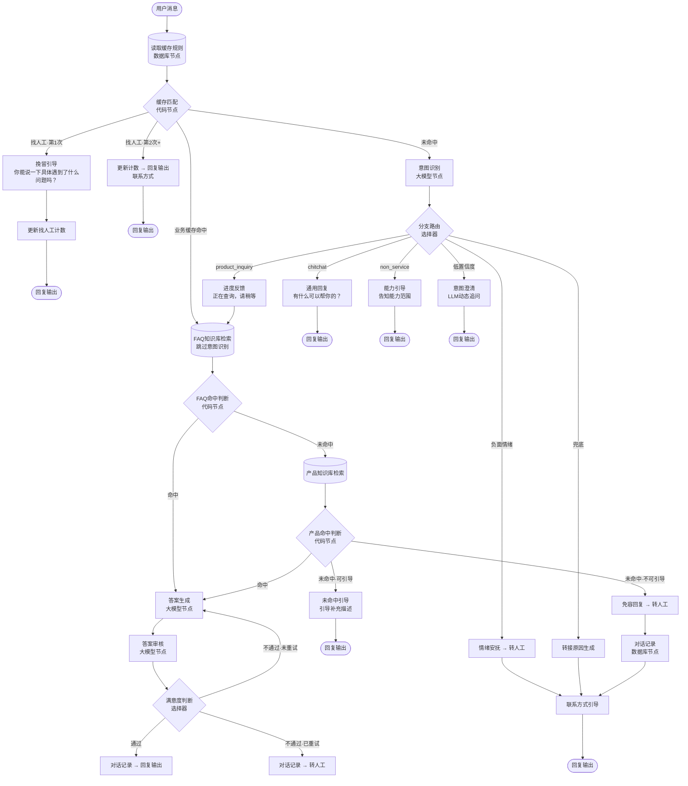

# 企业AI Agent客服应用 - Coze v1.2 配置手册

> **版本**：v1.2 | **平台**：Coze 扣子（对话流 Chatflow）
> **目标**：按本手册逐步操作，可在 Coze 中完整搭建 AI 客服系统
> **基于**：v1.1 配置手册，优化意图识别与意图澄清流程体验

## 流程总览

### 整体流程（Mermaid）

> 在支持 Mermaid 渲染的 Markdown 阅读器中查看可视化流程图。



### 文本版流程图

```
用户消息
  │
  ▼
读取缓存规则（数据库）→ 缓存匹配（代码）
  │
  ├── 找人工·第1次 ──→ 挽留引导 → 更新计数 → 回复输出
  ├── 找人工·第2次+ ─→ 更新计数 → 回复输出（联系方式）
  ├── 业务缓存命中 ──→ FAQ知识库检索（跳过意图识别）
  └── 未命中 ────────→ 意图识别（大模型）
                          │
                    ┌─────┼─────┬─────┬─────┬─────┐
                    ▼     ▼     ▼     ▼     ▼     ▼
                  闲聊  超范围  低置信  负面  产品   兜底
                  通用  能力   意图   情绪  进度   转接
                  回复  引导   澄清   安抚  反馈   原因
                    │     │     │     │     │     │
                    └─────┴─────┴─────┴──┬──┘     │
                                       ▼         │
                                  FAQ知识库检索    │
                                       │         │
                                  ┌────┴────┐    │
                                  ▼         ▼    │
                                命中     未命中    │
                                  │         │    │
                                  │    产品知识库检索
                                  │         │    │
                                  │    ┌────┴────┐
                                  │    ▼         ▼
                                  │  命中     未命中
                                  │    │    ┌───┴───┐
                                  ▼    ▼    ▼       ▼
                              答案生成 答案生成 引导  免容
                                  │    │    回复  回复
                                  ▼              │
                              答案审核            │
                                  │              │
                            ┌─────┼─────┐       │
                            ▼     ▼     ▼       │
                          通过  重试  转人工 ←───┘
                            │     │     │
                            ▼     └──→  │
                        回复输出       联系方式引导
                                      → 回复输出
```

### 节点速查表

| # | 节点 | 类型 | 功能 | 关键输出 |
|---|------|------|------|---------|
| 1 | 用户消息输入 | 开始 | 接收消息 | USER_INPUT |
| 2 | 读取缓存规则 | 数据库 | 查询缓存规则表 | cache_rules |
| 3 | 缓存匹配 | 代码 | 匹配规则，找人工两次触发 | n4_is_hit / n4_boost_query / n4_transfer_cnt |
| 4 | 缓存判断 | 选择器 | 3分支路由 | — |
| 5 | 意图识别 | 大模型 | 识别意图/置信度/情绪 | intent / confidence / key_info / emotion |
| 6 | 分支路由 | 选择器 | 6分支路由 | — |
| 7 | 通用回复 | 输出 | 闲聊回复 | — |
| 8 | 能力引导 | 输出 | 告知能力范围 | — |
| 9 | 意图澄清 | 大模型 | LLM动态追问 | — |
| 10 | 情绪安抚 | 输出 | 安抚负面情绪 | — |
| 11 | 进度反馈 | 输出 | 处理中提示 | — |
| 12 | FAQ知识库检索 | 知识库 | 检索FAQ知识库（第一层） | outputList |
| 13 | 命中判断 | 代码 | 判断FAQ库是否命中 | has_knowledge_hit / can_guide |
| 13.1 | 产品知识库检索 | 知识库 | 检索产品知识库（兜底） | outputList |
| 13.2 | 产品命中判断 | 代码 | 判断产品库是否命中 | has_knowledge_hit / can_guide |
| 14 | 未命中引导 | 输出 | 引导补充描述 | — |
| 15 | 免容回复 | 输出 | 兜底回复 | — |
| 16 | 答案生成 | 大模型 | 生成回答（含促单） | answer |
| 17 | 答案审核 | 大模型 | 审核答案质量 | approved / revision_hint |
| 18 | 重试判断 | 代码 | 是否已重试 | has_retried |
| 19 | 满意度判断 | 选择器 | 通过/重试/转人工 | — |
| 20 | 转接原因生成 | 代码 | 生成转接原因 | transfer_reason |
| 21 | 联系方式引导 | 输出 | 输出联系方式 | — |
| 22 | 对话记录 | 数据库 | 记录异常信息 | — |
| 23 | 回复输出 | 结束 | 输出给用户 | — |
| 24 | 挽留引导 | 输出 | 找人工挽留 | — |
| 25 | 更新找人工计数 | 变量赋值 | 更新会话变量 | — |

---

## 相比 v1.1 的改动

> 共 12 项：

| 序号 | 迭代项 | v1.1 问题 | v1.2 方案 | 涉及节点 |
|-----|-------|----------|----------|---------|
| 1 | 恢复情绪检测 | v1.2 初版删除了情绪检测，无法识别负面情绪用户 | 恢复 emotion 字段、负面情绪分支和情绪安抚节点 | 意图识别、分支路由、情绪安抚 |
| 2 | 恢复低置信度追问 | v1.2 初版删除了低置信度分支，模糊问题直接走正常流程 | 恢复低置信度分支和意图澄清节点（LLM 动态追问） | 分支路由、意图澄清 |
| 3 | 意图分类恢复为3类 | v1.2 初版改为4类（product_info/order_logistics/after_sale/non_service），分类过细 | 恢复为 product_inquiry / chitchat / non_service 3类，product_inquiry 包含所有业务问题 | 意图识别、分支路由 |
| 4 | 缓存拆分为找人工+业务缓存 | 缓存 boost_query 机制增加复杂度，业务缓存规则可能误匹配 | 所有缓存规则用 Coze 数据库维护，缓存判断3分支（找人工第1次/第2次+/业务缓存），找人工两次触发，输出参数使用 n4_ 前缀 | 缓存匹配、挽留引导、更新找人工计数 |
| 5 | 全局"您"→"你" | 客服语气过于正式 | 全文统一使用"你"，语气更亲切自然 | 所有节点文案 |
| 6 | 进度反馈文案 | 进度提示文案不够简洁 | 改为"正在查询，请稍等" | 进度反馈 |
| 7 | 对话记录改为只记录转人工和异常 | v1.2 初版记录每轮对话，数据量大且价值低 | 只在转人工、知识库未命中、审核不通过且已重试时记录 | 对话记录 |
| 8 | 促单话术加购买判断 | v1.2 初版对所有产品咨询都加促单，已购买用户体验差 | 增加购买判断，已购买用户不加促单 | 答案生成 |
| 9 | 未命中增加引导轮次 | v1.2 初版未命中直接免容回复转人工，用户没有补充机会 | 未命中时先引导用户补充描述，补充后重新走流程，仍无结果再转人工 | 命中判断选择器、未命中引导 |
| 10 | 重试判断去掉自引用 | 重试判断节点引用自身输出 is_retry，Coze 可能循环依赖报错 | 改用会话变量 retry_cnt 计数，无自引用 | 重试判断 |
| 11 | 审核维度细化 | 审核只检查通过/不通过，不给出具体修改建议 | 审核不通过时输出 revision_hint 修改建议，供重试时答案生成参考 | 答案审核、答案生成 |
| 12 | 双知识库串联检索 | 高频问题和长尾问题用同一个知识库，高频问题准确率不够 | FAQ知识库（100-200条人工验证Q&A）优先检索，未命中再检索产品知识库 | FAQ知识库检索、产品知识库检索、FAQ命中判断 |

---

## 目录

- [前置准备](#前置准备)
- [第一步：创建对话流](#第一步创建对话流)
- [第二步：创建知识库](#第二步创建知识库)
- [第三步：创建会话变量](#第三步创建会话变量)
- [第四步：配置节点（按顺序）](#第四步配置节点按顺序)
- [第五步：连接节点](#第五步连接节点)
- [第六步：测试验证](#第六步测试验证)
- [第七步：发布上线](#第七步发布上线)
- [常见问题排查](#常见问题排查)

---

## 前置准备

| 准备项 | 要求 |
|-------|------|
| Coze 账号 | 已注册 [coze.cn](https://www.coze.cn)，建议付费套餐（专业版 9.9元/月） |
| 知识库素材 | 产品知识文档（Markdown/TXT/Word）、FAQ 问答列表 |
| 联系方式 | 人工客服的微信号/企业微信/客服电话等 |

---

## 第一步：创建对话流

### 1.1 进入 Coze 平台

1. 打开 [coze.cn](https://www.coze.cn)，登录账号
2. 进入**工作空间**（左侧边栏选择你的团队/个人空间）

### 1.2 创建智能体

1. 点击左侧**「智能体」**菜单
2. 点击**「创建智能体」**按钮
3. 填写基本信息：
   - **名称**：`在线客服`（可自定义）
   - **描述**：`企业智能客服，自动回答产品咨询、订单物流、售后政策等常见问题`
4. 点击**「创建」**

### 1.3 创建对话流

1. 进入刚创建的智能体 → 点击**「对话流」**标签页
2. 点击**「创建对话流」**
3. 输入名称：`客服主流程`
4. 点击**「确认」**，进入对话流编辑器

> 进入编辑器后，画布中央会自动出现一个**「开始」**节点和一个**「结束」**节点。

---

## 第二步：创建知识库

> 在配置节点之前，先创建好知识库，后续知识库检索节点需要绑定。

### 2.1 创建产品知识库

1. 点击左侧**「知识库」**菜单（或进入「资源库」→「知识库」）
2. 点击**「创建知识库」**
3. 填写信息：
   - **名称**：`产品知识库`
   - **描述**：`商品信息、功能介绍、规格参数、使用方法等`
4. 点击**「创建」**
5. 进入知识库 → 点击**「添加文件」** → 上传产品相关文档（Markdown/TXT/Word）
6. 等待文件解析完成

### 2.2 创建 FAQ 知识库

> **v1.2 新增**：FAQ 知识库存储人工验证过的高频 Q&A，作为第一层检索。命中 FAQ 则不再检索产品知识库，保证高频问题 100% 准确。

**创建方式**：Coze 资源库 → 知识库 → 新建知识库

**配置**：

| 配置项 | 值 | 说明 |
|-------|---|------|
| 名称 | `FAQ知识库` | — |
| 知识库类型 | 扣子知识库 | — |
| 检索策略 | 语义 | 向量相似度匹配 |
| 最大召回数量 | 3 | FAQ 库小，3 条足够 |
| 最小匹配度 | 0.5 | 与产品知识库一致 |

**FAQ 条目编写规范**：

每条 FAQ 应包含完整的问答对，格式为：

```
Q：如何退货？
A：退货流程如下：
1. 在"我的订单"中找到需要退货的商品
2. 点击"申请退货"，选择退货原因
3. 等待卖家审核（1-2个工作日）
4. 审核通过后，按照提示寄回商品
5. 卖家确认收货后，退款将在3-5个工作日内原路返回

注意：商品需保持完好，不影响二次销售。7天无理由退货免运费。
```

**FAQ 条目来源**：
- 从客服工单中提取高频问题
- 从产品知识库中提炼核心 Q&A
- 用 AI 生成候选 FAQ，人工审核后入库

**FAQ 知识库 vs 产品知识库的区别**：

| 对比 | FAQ 知识库 | 产品知识库 |
|------|-----------|-----------|
| 规模 | 100-200 条 | 大量（文档、政策等） |
| 内容 | 人工验证的 Q&A 对 | 原始文档 |
| 准确率 | 100%（人工验证） | 依赖文档质量 |
| 检索速度 | 快（库小） | 稍慢（库大） |
| 用途 | 高频问题精准回答 | 长尾问题兜底覆盖 |

### 2.3 知识库内容格式要求

上传的文档建议使用以下格式（一问一答结构）：

```
Q: 这个产品支持什么支付方式？
A: 我们目前支持微信支付、支付宝、银行卡支付、花呗/京东白条分期。

Q: 退货流程是什么？
A: 退货流程：1. 进入「我的订单」→ 找到对应订单 2. 点击「申请退货」→ 选择退货原因 3. 等待审核通过 → 寄回商品 4. 确认收货后退款到原支付账户。
```

> **提示**：每个 Q&A 之间用空行分隔，便于 Coze 自动分段。

---

## 第三步：创建会话变量

> **v1.2 新增**：需要创建三个会话变量（均为 String 类型），`retry_cnt` 用于记录答案审核重试次数，`guide_cnt` 用于记录未命中引导次数，防止无限引导，`transfer_cnt` 用于记录找人工请求次数，实现"找人工两次触发"机制。

### 3.1 创建 retry_cnt 会话变量

1. 在对话流编辑器中，点击左侧或顶部**「变量」**面板
2. 切换到**「会话变量」**标签
3. 点击**「添加变量」**
4. 配置：
   - **变量名**：`retry_cnt`
   - **类型**：String
   - **默认值**：`"0"`
5. 点击**「保存」**

> **说明**：会话变量在整个会话期间持久存在，不同轮次共享。`retry_cnt` 记录当前问题已重试生成答案的次数（String 类型），流程开始时重置为 "0"。

### 3.2 创建 guide_cnt 会话变量

1. 在同一面板中，点击**「添加变量」**
2. 配置：
   - **变量名**：`guide_cnt`
   - **类型**：String
   - **默认值**：`"0"`
3. 点击**「保存」**

> **说明**：`guide_cnt` 记录知识库未命中引导用户补充描述的次数（String 类型），最多引导1次，防止无限循环。

### 3.3 创建 transfer_cnt 会话变量

1. 在同一面板中，点击**「添加变量」**
2. 配置：
   - **变量名**：`transfer_cnt`
   - **类型**：String
   - **默认值**：`"0"`
3. 点击**「保存」**

> **说明**：`transfer_cnt` 记录用户在当前会话中请求找人工的次数（String 类型），初始值 "0"，每次找人工 +1。第一次找人工时触发挽留引导，第二次及以上才直接给出联系方式。

---

## 第四步：配置节点（按顺序）

> 以下所有操作均在**对话流编辑器**中完成。
> 操作方式：点击画布空白处 → 在弹出的节点面板中选择对应节点类型 → 拖入画布。

---

### 节点 1：用户消息输入（开始节点）

> 开始节点在创建对话流时已自动生成，无需手动创建。

**确认配置**：

1. 点击画布上的**「开始」**节点
2. 确认有以下两个预置参数（不可删除）：
   - `USER_INPUT`（String）— 用户输入的消息
   - `CONVERSATION_NAME`（String）— 会话标识
3. 如需区分渠道，可点击**「添加参数」**，添加：
   - 参数名：`channel`，类型：String，来源：用户输入（可选）

---

### 节点 2：缓存匹配（代码节点 + 数据库节点）

> **v1.2 设计**：所有缓存规则（包括找人工）都存储在 Coze 数据库中，方便在线维护。代码节点只负责匹配逻辑，不硬编码任何内容。输出参数使用 n4_ 前缀（Coze 平台规范）。

#### 2.1 创建缓存规则数据表

Coze 内置了**数据库**功能（不是飞书多维表格插件），可以直接在对话流中通过「数据库节点」或「代码节点」读写数据，无需额外安装插件。

**创建方式**（以下任一方式均可）：

| 方式 | 路径 |
|------|------|
| 方式 A | Coze 资源库 → 数据库 → 新建数据表 |
| 方式 B | 智能体编排页面 → 左侧「数据库」→ 点击 **+** |
| 方式 C | 对话流画布 → 添加「数据库节点」→ 在节点中新建 |

**步骤**：

1. **新建数据表**：
   - 输入数据表名称：`缓存规则表`
   - 输入描述：`存储高频问题缓存规则，包括找人工、业务缓存等`
   - 点击「确认」

2. **设置查询模式**：
   - 选择**「单用户模式」**
   - 说明：缓存规则是全局共享的，不区分用户，单用户模式即可

3. **添加字段**（点击「新增」逐个添加）：

| 字段名 | 类型 | 说明 | 示例 |
|-------|------|------|------|
| `keywords` | String | 触发关键词，用英文逗号分隔 | `人工,找人工,转人工` |
| `boost_query` | String | 增强检索词（业务缓存用） | `退货流程 退款 7天无理由` |
| `direct_answer` | String | 直接回答内容（找人工等场景用，为空则走知识库） | `不好意思没能快速解决...` |
| `min_length` | Number | 触发此规则的用户输入最小字符数 | `2` |
| `category` | String | 分类标签 | `转人工` |
| `priority` | Number | 优先级（数字越小越优先） | `1` |
| `enabled` | Boolean | 是否启用 | `true` |

> **提示**：也可以点击「使用 AI 创建」按钮，输入"缓存规则表，包含关键词、增强检索词、直接回答、最小长度、分类、优先级、是否启用"，让 AI 自动生成字段。

4. **添加预置数据**（创建完成后，在数据表页面逐条添加）：

| keywords | boost_query | direct_answer | min_length | category | priority | enabled |
|---------|------------|---------------|-----------|----------|----------|---------|
| `人工,找人工,转人工,真人,人工客服,客服电话` | （留空） | `不好意思没能快速解决你的问题，帮你转接同事处理。\n\n请添加企业微信：Service_001\n或拨打客服热线：400-XXX-XXXX\n\n工作时间：周一至周五 9:00-18:00` | 2 | 转人工 | 1 | ✅ |
| `退货流程,怎么退货,如何退货,退换货流程` | `退货流程 退款 7天无理由退货` | （留空） | 4 | 售后 | 10 | ✅ |
| `退款流程,怎么退款,退款到账` | `退款流程 退款时间 退款到账` | （留空） | 4 | 售后 | 10 | ✅ |
| `支付方式,怎么付款,支持什么支付` | `支付方式 微信支付 支付宝 银行卡` | （留空） | 4 | 交易 | 10 | ✅ |
| `发货时间,什么时候发货,多久发货` | `发货时间 发货政策 工作日发货` | （留空） | 5 | 物流 | 10 | ✅ |
| `运费,包邮,邮费,运费多少钱` | `运费政策 包邮 邮费标准` | （留空） | 2 | 物流 | 10 | ✅ |
| `发票,怎么开票,开发票` | `发票 电子发票 增值税发票` | （留空） | 2 | 售后 | 10 | ✅ |

> **维护方式**：
> - 修改联系方式：直接在数据表中修改第一条规则的 `direct_answer` 字段
> - 新增缓存规则：在数据表中新增一行
> - 禁用规则：将 `enabled` 改为 `false`
> - 调整优先级：修改 `priority` 字段（数字越小越优先匹配）
> - 所有修改**即时生效**，无需改代码、无需重新发布对话流

#### 2.2 在对话流中读取缓存规则

缓存规则存储在数据库后，需要在对话流中读取。有两种方式：

**方式 A：使用数据库节点（推荐，简单直观）**

1. 在对话流画布中，点击**「+」** → 选择**「数据库」**节点 → 拖入画布
2. 重命名为 `读取缓存规则`
3. 在节点配置中：
   - 操作类型：选择**「查询数据」**
   - 数据库：选择 `缓存规则表`
   - 查询条件：`enabled` **等于** `true`
   - 返回字段：全选（keywords, boost_query, direct_answer, min_length, category, priority, enabled）
4. 将此节点的输出连接到「缓存匹配」代码节点的 `cache_rules` 输入参数

**方式 B：在代码节点中直接查询**

1. 在代码节点中添加数据库输入参数
2. 代码中通过 `args.params` 获取查询结果

> **本方案采用方式 A**：先通过数据库节点查询规则，再传给代码节点做匹配。这样数据库查询和匹配逻辑解耦，更清晰。

#### 2.3 匹配机制设计

**如何避免缓存覆盖用户具体描述**：

| 机制 | 说明 |
|------|------|
| **关键词必须是完整短语** | "退货流程"匹配，"退货"不匹配。避免单字/双字过度匹配 |
| **min_length 最小长度** | 用户输入必须 ≥ min_length 字符才触发 |
| **priority 优先级** | 找人工 priority=1 最高优先，业务缓存 priority=10 |
| **direct_answer 区分** | 有 direct_answer 为找人工规则（n4_is_hit="transfer"），无则走知识库快速通道（n4_is_hit="cached"） |
| **boost_query 不替代用户输入** | boost_query 通过会话历史传递给答案生成 Prompt 使用，知识库检索 Query 只用 USER_INPUT |

#### 2.3 创建代码节点

**创建方式**：点击画布空白处 → 选择**「代码」**节点 → 拖入画布

**步骤**：

1. **重命名节点**：改为 `缓存匹配`

2. **选择语言**：Python

3. **添加输入参数**：

| 参数名 | 类型 | 变量引用 |
|-------|------|---------|
| `user_question` | String | `{{USER_INPUT}}` |
| `cache_rules` | Array[Object] | 数据库查询结果 |
| `transfer_cnt` | String | 会话变量 `transfer_cnt` |

4. **粘贴代码**：

```python
async def main(args: Args) -> Output:
    params = args.params
    question = str(params.get("user_question", "")).strip()
    question_len = len(question)
    cache_rules = params.get("cache_rules", [])
    transfer_cnt = int(params.get("transfer_cnt", "0"))

    sorted_rules = sorted(cache_rules, key=lambda r: int(r.get("priority", 99)))

    for rule in sorted_rules:
        if str(rule.get("enabled", "true")) != "true":
            continue
        min_len = int(rule.get("min_length", 3))
        if question_len < min_len:
            continue
        keywords_str = str(rule.get("keywords", ""))
        keywords = [kw.strip() for kw in keywords_str.split(",") if kw.strip()]
        matched = False
        for kw in keywords:
            if kw in question:
                matched = True
                break

        if matched:
            direct_answer = str(rule.get("direct_answer", "")).strip()
            boost_query = str(rule.get("boost_query", "")).strip()
            category = str(rule.get("category", ""))

            if direct_answer:
                # 找人工规则
                new_cnt = str(transfer_cnt + 1)
                ret: Output = {
                    "n4_is_hit": "transfer",
                    "n4_boost_query": "",
                    "n4_transfer_cnt": new_cnt
                }
                return ret
            else:
                # 业务缓存
                ret: Output = {
                    "n4_is_hit": "cached",
                    "n4_boost_query": boost_query,
                    "n4_transfer_cnt": str(transfer_cnt)
                }
                return ret

    ret: Output = {
        "n4_is_hit": "none",
        "n4_boost_query": "",
        "n4_transfer_cnt": str(transfer_cnt)
    }
    return ret
```

5. **确认输出参数**：

| 参数名 | 类型 | 说明 |
|-------|------|------|
| `n4_is_hit` | String | 命中结果："transfer"（找人工）/ "cached"（业务缓存）/ "none"（未命中） |
| `n4_boost_query` | String | 增强检索词（业务缓存用） |
| `n4_transfer_cnt` | String | 更新后的找人工次数（字符串类型，用于写入会话变量） |

---

### 节点 3：缓存判断（选择器节点）

> **v1.2 变更**：3 个出口——找人工第1次挽留、找人工第2次+更新计数→联系方式引导、业务缓存→FAQ知识库检索快速通道。

**创建方式**：点击画布空白处 → 选择**「选择器」**节点 → 拖入画布

**步骤**：

1. **重命名节点**：改为 `缓存判断`

2. **配置分支条件**（按顺序创建，顺序即优先级）：

   **分支 1**（找人工·第1次 → 挽留引导）：
   - 条件组合模式：**AND**
   - 条件 A：
     - 左值：`{{缓存匹配.n4_is_hit}}`
     - 运算符：**等于（==）**
     - 右值：`transfer`
   - 条件 B：
     - 左值：`{{缓存匹配.n4_transfer_cnt}}`
     - 运算符：**等于（==）**
     - 右值：`1`
   - 连接到：挽留引导
   - **说明**：用户第一次说"找人工"，先引导描述问题，尝试挽留

   **分支 2**（找人工·第2次+ → 更新找人工计数 → 回复输出）：
   - 条件组合模式：**AND**
   - 条件 A：
     - 左值：`{{缓存匹配.n4_is_hit}}`
     - 运算符：**等于（==）**
     - 右值：`transfer`
   - 条件 B：
     - 左值：`{{缓存匹配.n4_transfer_cnt}}`
     - 运算符：**不等于（!=）**
     - 右值：`1`
   - 连接到：更新找人工计数（变量赋值节点）
   - **说明**：用户第二次及以上说"找人工"，更新计数后直接返回联系方式

   **分支 3**（业务缓存命中 → FAQ知识库检索快速通道）：
   - 条件：
     - 左值：`{{缓存匹配.n4_is_hit}}`
     - 运算符：**等于（==）**
     - 右值：`cached`
   - 连接到：FAQ知识库检索（跳过意图识别，直接检索）
   - **说明**：缓存命中后，FAQ知识库检索的 Query = USER_INPUT，key_info 通过会话历史传递给答案生成使用

   **否则分支**（未命中 → 意图识别）：
   - 默认已存在，无需配置

---

### 节点 4：意图识别（大模型节点）

> **v1.2 变更**：意图分类改为3类（product_inquiry / chitchat / non_service），恢复 emotion 字段。

**创建方式**：点击画布空白处 → 选择**「大模型」**节点 → 拖入画布

**步骤**：

1. **重命名节点**：改为 `意图识别`

2. **选择模型**：
   - 模型：选择 **豆包 Lite**（或任意 7B 级别小模型）

3. **模型参数设置**：
   - **温度（Temperature）**：设为 **0.1**（确保分类稳定）
   - **最大输出长度**：500 tokens

4. **输出格式**：
   - 选择 **JSON**

5. **JSON 样例配置**：

   添加以下 4 个字段：

| 字段名 | 类型 | 说明 |
|-------|------|------|
| `intent` | String | 意图分类 |
| `confidence` | Number | 置信度 |
| `key_info` | Array | 关键信息 |
| `emotion` | String | 情绪状态 |

   粘贴 JSON 样例：
   ```json
   {
     "intent": "product_inquiry",
     "confidence": 0.92,
     "key_info": ["iPhone 16 Pro", "颜色"],
     "emotion": "neutral"
   }
   ```

6. **添加输入参数**：
   - 参数名：`question`，类型：String
   - 变量引用：`{{USER_INPUT}}`

7. **系统提示词**（System Prompt）：

```
你是电商客服意图识别专家。你的任务是分析用户的问题，判断其意图分类，提取关键信息，并检测用户情绪。

## 意图分类体系（3类）

1. product_inquiry - 产品咨询（包含产品信息、订单物流、售后服务等所有业务问题）
2. chitchat - 闲聊寒暄（打招呼、闲聊、感谢、再见等）
3. non_service - 非客服问题（明确不是客服能回答的问题，如写代码、翻译等）

## 情绪检测

检测用户消息中的情绪状态，输出以下之一：
- neutral：正常/中性
- negative：负面情绪（愤怒、不满、抱怨、焦虑等）
- positive：正面情绪（满意、开心等）

情绪判断依据：
- 包含"投诉""差评""骗人""垃圾""退款""太慢了""什么破""不靠谱"等负面词汇 → negative
- 包含"谢谢""好评""不错""很好""满意"等正面词汇 → positive
- 其他情况 → neutral

## 输出要求

请以 JSON 格式输出，包含以下字段：
- intent: 意图分类（使用上述英文标识）
- confidence: 置信度分数（0-1之间的小数）
- key_info: 提取的关键信息数组（如商品名称、订单号、问题类型等）
- emotion: 情绪状态（neutral/negative/positive）

## 注意事项

- 如果用户消息包含指代词（如"那个"、"这个"），请结合对话历史理解其含义
- 置信度仅作为参考，不要因为置信度低就改变意图分类结果
- 即使不确定，也要给出最可能的意图分类
- key_info 中提取的信息应尽量具体，便于后续知识库检索
- chitchat 意图的置信度应设为 0.8 以上
```

8. **用户提示词**（User Prompt）：

```
请分析以下用户问题：

用户问题：{{question}}

请输出 JSON 格式的意图识别结果（含意图分类、置信度、关键信息、情绪状态）。
```

9. **会话历史**：
   - 找到**「会话历史」**或**「智能体会话历史」**开关 → **开启**

10. **异常处理**：
    - 找到**「异常处理」**配置
    - 选择**「返回设定内容」**
    - 设定内容：
    ```json
    {
      "intent": "non_service",
      "confidence": 0,
      "key_info": [],
      "emotion": "neutral"
    }
    ```

---

### 节点 5：分支路由（选择器节点）

> **v1.2 变更**：恢复为5个分支 + 兜底：chitchat → 通用回复、non_service → 能力引导、低置信度 → 意图澄清、负面情绪 → 情绪安抚、product_inquiry → 正常流程，否则转人工。

**创建方式**：点击画布空白处 → 选择**「选择器」**节点 → 拖入画布

**步骤**：

1. **重命名节点**：改为 `分支路由`

2. **配置分支条件**（按顺序创建，顺序即优先级）：

   **分支 1**（闲聊寒暄 → 通用回复）：
   - 左值：`{{意图识别.intent}}`
   - 运算符：**等于（==）**
   - 右值：`chitchat`

   **分支 2**（非客服问题 → 能力引导）：
   - 左值：`{{意图识别.intent}}`
   - 运算符：**等于（==）**
   - 右值：`non_service`

   **分支 3**（低置信度 → 意图澄清）：
   - 左值：`{{意图识别.confidence}}`
   - 运算符：**小于（<）**
   - 右值：`0.5`

   **分支 4**（负面情绪 → 情绪安抚）：
   - 左值：`{{意图识别.emotion}}`
   - 运算符：**等于（==）**
   - 右值：`negative`

   **分支 5**（产品咨询 → 正常流程）：
   - 左值：`{{意图识别.intent}}`
   - 运算符：**等于（==）**
   - 右值：`product_inquiry`

   **否则分支**（兜底 → 转人工）：
   - 默认已存在，无需手动创建

> **分支优先级说明**：Coze 选择器节点按分支创建顺序从上到下匹配，先匹配到的分支生效。
> 顺序逻辑：闲聊 → 非客服 → 低置信度 → 负面情绪 → 产品咨询 → 兜底转人工。

---

### 节点 5.4：通用回复（输出节点）

> **v1.2 新增**：当用户闲聊寒暄时，返回通用友好回复。

**创建方式**：点击画布空白处 → 选择**「输出」**节点 → 拖入画布

**步骤**：

1. **重命名节点**：改为 `通用回复`

2. **配置输出内容**：
   ```
   你好！有什么可以帮你的吗？我可以帮你解答产品相关的问题。
   ```

3. **流式输出**：设为**关闭**

4. **会话历史写入**：设为**写入**

   > 写入历史，这样用户后续提问时意图识别能看到上下文。

---

### 节点 5.3.1：挽留引导（输出节点）

> **v1.2 新增**：用户第一次说"找人工"时，先引导描述问题，尝试挽留。

**创建方式**：点击画布空白处 → 选择**「输出」**节点 → 拖入画布

**步骤**：

1. **重命名节点**：改为 `挽留引导`

2. **配置输出内容**：
   ```
   不好意思没能帮到你。你能说一下具体遇到了什么问题吗？也许我可以帮你解决。
   ```

3. **流式输出**：设为**开启**

4. **会话历史写入**：设为**写入**

   > 写入历史，用户下次回复时能看到这段引导，便于上下文理解。

---

### 节点 5.3.2：更新找人工计数（变量赋值节点）

> **v1.2 新增**：将缓存匹配输出的 `transfer_cnt_new` 写入会话变量 `transfer_cnt`。

**创建方式**：点击画布空白处 → 选择**「变量赋值」**节点 → 拖入画布

**步骤**：

1. **重命名节点**：改为 `更新找人工计数`

2. **配置变量赋值**：
   - 目标变量：会话变量 `transfer_cnt`
   - 赋值来源：`{{缓存匹配.transfer_cnt_new}}`

3. **说明**：此节点在挽留引导之后执行，确保计数被正确更新。缓存判断分支2（第二次及以上找人工）也经过此节点，之后连接到「联系方式引导」。

---

### 节点 5.5：意图澄清（大模型节点）

> **v1.2 恢复**：当意图识别置信度低于 0.5 时，使用 LLM 动态追问，引导用户补充描述。

**创建方式**：点击画布空白处 → 选择**「大模型」**节点 → 拖入画布

**步骤**：

1. **重命名节点**：改为 `意图澄清`

2. **选择模型**：
   - 模型：选择 **豆包 Lite**（或任意 7B 级别小模型）

3. **模型参数设置**：
   - **温度（Temperature）**：设为 **0.4**
   - **最大输出长度**：300 tokens

4. **输出格式**：选择**「文本」**（Text）

5. **添加输入参数**（共 3 个）：

| 参数名 | 类型 | 变量引用 |
|-------|------|---------|
| `user_question` | String | `{{USER_INPUT}}` |
| `intent` | String | `{{意图识别.intent}}` |
| `confidence` | Number | `{{意图识别.confidence}}` |
| `key_info` | Array | `{{意图识别.key_info}}` |

6. **系统提示词**（System Prompt）：

```
你是客服助手。系统已经对用户的问题做了初步意图识别，但置信度较低（低于0.5），说明用户的描述不够清晰。

你的任务是根据初步识别结果和用户问题，生成一段简短、有针对性的追问。

## 追问策略

### 策略1：如果有初步意图方向（intent 不是 non_service）
- 基于识别出的意图方向，提出具体的确认选项

### 策略2：如果有部分关键信息（key_info 不为空）
- 基于已提取的关键信息做针对性追问

### 策略3：完全模糊
- 使用开放式引导，提供选项菜单

## 输出规则
- 追问不超过3句话
- 必须包含至少一个具体选项或示例
- 语气自然口语化，像真人客服在问
- 不要说"我是AI""我是机器人"
- 直接输出追问文本
```

7. **用户提示词**（User Prompt）：

```
用户问题：{{user_question}}
初步意图：{{intent}}（置信度：{{confidence}}）
提取的关键信息：{{key_info}}

请根据以上信息，生成一段有针对性的追问。
```

8. **会话历史**：**开启**

9. **异常处理**：
   - 选择**「返回设定内容」**
   - 设定内容：`不好意思，能具体说一下你想了解什么吗？比如产品信息、订单物流、或者售后问题。`

---

### 节点 5.6：能力引导（输出节点）

> **v1.2 新增**：当用户输入非客服问题时，告知能力范围并引导回归服务。

**创建方式**：点击画布空白处 → 选择**「输出」**节点 → 拖入画布

**步骤**：

1. **重命名节点**：改为 `能力引导`

2. **配置输出内容**：
   ```
   这个我帮不了，我主要能帮你解答产品相关的问题，比如：
   - 产品信息（价格、尺码、材质等）
   - 订单物流（发货、退货、快递等）
   - 售后服务（发票、保修等）
   有需要的话可以问我。
   ```

3. **流式输出**：设为**关闭**

4. **会话历史写入**：设为**写入**

   > 写入历史，这样用户后续提问时意图识别能看到引导上下文。

---

### 节点 5.7：情绪安抚（输出节点）

> **v1.2 恢复**：当检测到用户负面情绪时，先安抚情绪再转接人工。

**创建方式**：点击画布空白处 → 选择**「输出」**节点 → 拖入画布

**步骤**：

1. **重命名节点**：改为 `情绪安抚`

2. **配置输出内容**：
   ```
   不好意思给你带来不好的体验了，帮你转接同事处理，请稍等。
   ```

3. **流式输出**：设为**关闭**

4. **会话历史写入**：设为**不写入**

---

### 节点 6：转接原因生成（代码节点）

> **v1.2 变更**：增加情绪相关的转接原因描述。

**创建方式**：点击画布空白处 → 选择**「代码」**节点 → 拖入画布

**步骤**：

1. **重命名节点**：改为 `转接原因生成`

2. **选择语言**：Python

3. **添加输入参数**（共 4 个）：

| 参数名 | 类型 | 变量引用 |
|-------|------|---------|
| `n4_intent` | String | `{{意图识别.intent}}` |
| `n4_confidence` | Number | `{{意图识别.confidence}}` |
| `n4_emotion` | String | `{{意图识别.emotion}}` |
| `n_audit_reason` | String | `{{答案审核.reason}}` |

   > **注意**：`n_audit_reason` 引用了「答案审核」节点的输出。首次配置时答案审核节点可能尚未创建，变量引用可能显示为红色，创建后会自动关联。

4. **粘贴代码**：

```python
async def main(args: Args) -> Output:
    params = args.params
    n4_intent = params.get('n4_intent', '')
    n4_confidence = params.get('n4_confidence', 0)
    n4_emotion = params.get('n4_emotion', '')
    n_audit_reason = params.get('n_audit_reason', '')

    # 意图中文映射
    intent_map = {
        'product_inquiry': '产品咨询',
        'chitchat': '闲聊寒暄',
        'non_service': '非客服问题'
    }

    # 如果答案审核已执行（有审核原因），使用审核原因
    if n_audit_reason:
        reason = '答案审核不通过（' + n_audit_reason + '），已重试仍不通过，需人工处理'
    elif n4_emotion == 'negative':
        reason = '用户情绪负面，需人工安抚处理'
    elif n4_intent == 'non_service':
        reason = '非客服问题，无法自动处理'
    else:
        intent_cn = intent_map.get(n4_intent, n4_intent)
        reason = intent_cn + '问题，需人工处理'

    ret: Output = {
        "transfer_reason": reason
    }
    return ret
```

5. **确认输出参数**：
   - `transfer_reason`（String）

---

### 节点 7：进度反馈（输出节点）

> **v1.2 变更**：文案改为"正在查询，请稍等"。

**创建方式**：点击画布空白处 → 选择**「输出」**节点 → 拖入画布

**步骤**：

1. **重命名节点**：改为 `进度反馈`

2. **配置输出内容**：
   - 在文本框中输入：`正在查询，请稍等`

3. **流式输出**：设为**关闭**

4. **会话历史写入**：设为**不写入**

   > 进度提示是临时消息，不应进入对话历史，否则会干扰后续的意图识别和知识库检索。

---

### 节点 8：FAQ 知识库检索（知识库检索节点）

> **v1.2 变更**：新增 FAQ 知识库检索作为第一层。FAQ 命中则直接生成答案，未命中再检索产品知识库。

**创建方式**：点击画布空白处 → 选择**「知识库检索」**节点 → 拖入画布

**步骤**：

1. **重命名节点**：改为 `FAQ知识库检索`

2. **配置 Query 输入**：
   ```
   {{USER_INPUT}}
   ```

3. **选择知识库**：
   - 只勾选 `FAQ知识库`（不勾选产品知识库）

4. **搜索策略**：选择**「语义」**

5. **参数设置**：
   - **最大召回数量**：`3`
   - **最小匹配度**：`0.5`

6. **高级设置**：
   - **查询改写**：**开启**
   - **结果重排**：**开启**
   - **会话历史辅助检索**：**开启**

7. **确认输出参数**：
   - `outputList`（Array）— FAQ 检索结果列表

---

### 节点 8.3：产品知识库检索（知识库检索节点）

> FAQ 未命中时，检索产品知识库作为兜底。

**创建方式**：点击画布空白处 → 选择**「知识库检索」**节点 → 拖入画布

**步骤**：

1. **重命名节点**：改为 `产品知识库检索`

2. **配置 Query 输入**：
   ```
   {{USER_INPUT}}
   ```

3. **选择知识库**：
   - 只勾选 `产品知识库`（不勾选 FAQ 知识库）

4. **搜索策略**：选择**「语义」**

5. **参数设置**：
   - **最大召回数量**：`5`
   - **最小匹配度**：`0.5`

6. **高级设置**：
   - **查询改写**：**开启**
   - **结果重排**：**开启**
   - **会话历史辅助检索**：**开启**

7. **确认输出参数**：
   - `outputList`（Array）— 产品知识库检索结果列表

---

### 节点 8.5：命中判断（代码节点）

> **v1.2 变更**：命中判断前置到 FAQ 知识库检索之后。FAQ 命中则直接生成答案，未命中再检索产品知识库。

**创建方式**：点击画布空白处 → 选择**「代码」**节点 → 拖入画布

**步骤**：

1. **重命名节点**：改为 `命中判断`

2. **选择语言**：Python

3. **添加输入参数**：

| 参数名 | 类型 | 变量引用 |
|-------|------|---------|
| `outputList` | Array | `{{FAQ知识库检索.outputList}}` |
| `guide_cnt` | Number | 会话变量 `guide_cnt` |

4. **粘贴代码**：

```python
async def main(args: Args) -> Output:
    params = args.params
    output_list = params.get('outputList', [])
    guide_cnt = params.get('guide_cnt', 0)
    has_hit = bool(output_list and len(output_list) > 0)

    # 判断是否还可以引导（最多引导1次）
    can_guide = (not has_hit) and (guide_cnt < 1)

    ret: Output = {
        "has_knowledge_hit": has_hit,
        "can_guide": can_guide,
        "guide_cnt_out": guide_cnt + (0 if has_hit else 1)
    }
    return ret
```

5. **确认输出参数**：

| 参数名 | 类型 | 说明 |
|-------|------|------|
| `has_knowledge_hit` | Boolean | FAQ 知识库是否命中 |
| `can_guide` | Boolean | 是否还可以引导用户补充 |
| `guide_cnt_out` | String | 更新后的引导次数（字符串，需写回会话变量） |

6. **写回会话变量**：
   - 在节点配置面板中，找到**「变量赋值」**或**「会话变量写入」**配置
   - 添加一条赋值规则：
     - 目标变量：会话变量 `guide_cnt`
     - 赋值来源：`{{命中判断.guide_cnt_out}}`

---

### 节点 8.5.3：产品命中判断（代码节点）

> FAQ 未命中后检索产品知识库，判断产品知识库是否命中。

**创建方式**：点击画布空白处 → 选择**「代码」**节点 → 拖入画布

**步骤**：

1. **重命名节点**：改为 `产品命中判断`

2. **选择语言**：Python

3. **添加输入参数**：

| 参数名 | 类型 | 变量引用 |
|-------|------|---------|
| `outputList` | Array | `{{产品知识库检索.outputList}}` |
| `guide_cnt` | Number | 会话变量 `guide_cnt` |

4. **粘贴代码**：

```python
async def main(args: Args) -> Output:
    params = args.params
    output_list = params.get('outputList', [])
    guide_cnt = params.get('guide_cnt', 0)
    has_hit = bool(output_list and len(output_list) > 0)

    # 判断是否还可以引导（最多引导1次）
    can_guide = (not has_hit) and (guide_cnt < 1)

    ret: Output = {
        "has_knowledge_hit": has_hit,
        "can_guide": can_guide,
        "guide_cnt_out": guide_cnt + (0 if has_hit else 1)
    }
    return ret
```

5. **确认输出参数**：

| 参数名 | 类型 | 说明 |
|-------|------|------|
| `has_knowledge_hit` | Boolean | 产品知识库是否命中 |
| `can_guide` | Boolean | 是否还可以引导用户补充 |
| `guide_cnt_out` | String | 更新后的引导次数（字符串，需写回会话变量） |

6. **写回会话变量**：
   - 在节点配置面板中，找到**「变量赋值」**或**「会话变量写入」**配置
   - 添加一条赋值规则：
     - 目标变量：会话变量 `guide_cnt`
     - 赋值来源：`{{产品命中判断.guide_cnt_out}}`

---

### 节点 8.6：未命中引导（输出节点）

> **v1.2 新增**：当知识库未命中且还可以引导时，引导用户补充描述。

**创建方式**：点击画布空白处 → 选择**「输出」**节点 → 拖入画布

**步骤**：

1. **重命名节点**：改为 `未命中引导`

2. **配置输出内容**：
   ```
   不好意思，这个问题我暂时不太确定。你能补充一下具体信息吗？比如产品名称、订单号等。
   ```

3. **流式输出**：设为**关闭**

4. **会话历史写入**：设为**写入**

   > 必须写入历史，这样用户补充描述后，重新走流程时意图识别和知识库检索能看到本轮追问的上下文。

---

### 节点 8.7：免容回复（输出节点）

> **v1.2 变更**：未命中且已引导过（或无法引导）时，走免容回复转人工。

**创建方式**：点击画布空白处 → 选择**「输出」**节点 → 拖入画布

**步骤**：

1. **重命名节点**：改为 `免容回复`

2. **配置输出内容**：
   ```
   这个问题我暂时不太确定，帮转接同事处理。

   请添加企业微信：Service_001
   或拨打客服热线：400-XXX-XXXX
   ```

3. **流式输出**：设为**关闭**

4. **会话历史写入**：设为**不写入**

---

### 节点 8.8：命中判断选择器（选择器节点）

> **v1.2 变更**：2个出口：FAQ 命中 → 进度反馈 → 答案生成、FAQ 未命中 → 产品知识库检索。

**创建方式**：点击画布空白处 → 选择**「选择器」**节点 → 拖入画布

**步骤**：

1. **重命名节点**：改为 `命中判断选择器`

2. **配置分支条件**：

   **分支 1**（FAQ 命中 → 进度反馈 → 答案生成）：
   - 左值：`{{命中判断.has_knowledge_hit}}`
   - 运算符：**等于（==）**
   - 右值：`true`

   **否则分支**（FAQ 未命中 → 产品知识库检索）：
   - 默认已存在，无需配置

---

### 节点 8.8.3：产品命中判断选择器（选择器节点）

> 产品知识库检索后的命中判断：3个出口——命中 → 答案生成、未命中可引导 → 未命中引导、未命中不可引导 → 免容回复。

**创建方式**：点击画布空白处 → 选择**「选择器」**节点 → 拖入画布

**步骤**：

1. **重命名节点**：改为 `产品命中判断选择器`

2. **配置分支条件**：

   **分支 1**（产品库命中 → 答案生成）：
   - 左值：`{{产品命中判断.has_knowledge_hit}}`
   - 运算符：**等于（==）**
   - 右值：`true`

   **分支 2**（未命中 + 可引导 → 未命中引导）：
   - 条件组合模式：**AND**
   - 条件 A：
     - 左值：`{{产品命中判断.has_knowledge_hit}}`
     - 运算符：**等于（==）**
     - 右值：`false`
   - 条件 B：
     - 左值：`{{产品命中判断.can_guide}}`
     - 运算符：**等于（==）**
     - 右值：`true`

   **否则分支**（未命中 + 不可引导 → 免容回复）：
   - 默认已存在，无需配置

---

### 节点 9：答案生成（大模型节点）

> **v1.2 变更**：
> 1. 输入参数增加 revision_hint（重试时的修改建议）
> 2. 促单话术增加购买判断，已购买用户不加促单

**创建方式**：点击画布空白处 → 选择**「大模型」**节点 → 拖入画布

**步骤**：

1. **重命名节点**：改为 `答案生成`

2. **选择模型**：
   - 模型：选择 **豆包 Pro**（或任意 32B+ 级别大模型）

3. **模型参数设置**：
   - **温度（Temperature）**：设为 **0.3**
   - **最大输出长度**：1024 tokens

4. **输出格式**：选择**「文本」**（Text）

5. **添加输入参数**（共 3 个）：

| 参数名 | 类型 | 变量引用 |
|-------|------|---------|
| `question` | String | `{{USER_INPUT}}` |
| `retrieval_results` | Array | `{{FAQ知识库检索.outputList}}` 或 `{{产品知识库检索.outputList}}`（根据命中路径） |
| `revision_hint` | String | `{{答案审核.revision_hint}}` |

   > **注意**：`retrieval_results` 根据命中路径动态引用——FAQ 命中时引用 FAQ 知识库检索结果，产品知识库命中时引用产品知识库检索结果。`revision_hint` 引用答案审核节点的输出，首次配置时可能显示红色，创建审核节点后自动关联。首次生成时该值为空，不影响正常流程。

6. **系统提示词**（System Prompt）：

```
你是一位专业的电商客服人员。请严格根据提供的知识库内容回答用户问题。

## 回答规范

1. **准确性第一**：只使用知识库中的内容回答，绝不编造或推测信息
2. **简洁明了**：回答不超过300字，避免冗长
3. **结构清晰**：涉及操作步骤的，使用编号分点说明
4. **主动引导**：回答后可适当引导用户进行下一步操作

## 回答模板

- 有明确答案时：直接给出清晰回答
- 涉及步骤时：使用 1. 2. 3. 分点说明
- 需要补充信息时：先回答已知内容，再礼貌追问

## 促单话术

如果满足以下所有条件，在回答末尾加一句促单话术：
1. 用户咨询的是产品问题（intent=product_inquiry）
2. 用户没有表达已经购买（对话历史中没有"买了""下单了""已购"等）

促单话术示例：
- "这款现在有活动，可以考虑一下"
- "库存不多了，喜欢的话可以早点下单"

注意：
- 促单话术要自然，不要生硬
- 如果用户已经买过，不要促单
- 订单物流和售后场景不加促单

## 安全约束（强制）

以下内容绝对不回复：
- 政治相关话题
- 色情、低俗内容
- 暴力、恐怖主义内容
- 脏话、辱骂、人身攻击

遇到上述任何类型的问题，一律回复：
"不好意思，这个问题我帮不了，有其他问题随时问我。"

## 重试修订指令

如果 revision_hint 不为空，说明上一次回答未通过审核。请根据以下审核意见修订回答：
- 审核修改建议：{{revision_hint}}
- 请针对上述问题逐条修正，确保修订后的回答完全符合规范
```

   > 将联系方式替换为实际联系方式。

7. **用户提示词**（User Prompt）：

```
请根据以下信息回答用户问题：

## 用户问题
{{question}}

## 知识库检索结果
{{retrieval_results}}

请生成客服回复。
```

8. **会话历史**：**开启**

9. **异常处理**：
   - 选择**「返回设定内容」**
   - 设定内容：`网络好像有点问题，麻烦你稍后再试一下~`

---

### 节点 10：答案审核（大模型节点）

> **v1.2 变更**：输出增加 `revision_hint`（修改建议）字段，审核不通过时给出具体修改方向，供重试时答案生成参考。

**创建方式**：点击画布空白处 → 选择**「大模型」**节点 → 拖入画布

**步骤**：

1. **重命名节点**：改为 `答案审核`

2. **选择模型**：
   - 模型：选择 **豆包 Lite**（或任意 7B+ 级别小模型）

3. **模型参数设置**：
   - **温度（Temperature）**：设为 **0.1**（极低，确保审核稳定）
   - **最大输出长度**：300 tokens

4. **输出格式**：选择 **JSON**

5. **JSON 样例配置**：

   添加以下 3 个字段：

| 字段名 | 类型 | 说明 |
|-------|------|------|
| `approved` | Boolean | 是否通过审核 |
| `reason` | String | 审核原因 |
| `revision_hint` | String | 修改建议（通过时为空） |

   粘贴 JSON 样例：
   ```json
   {
     "approved": true,
     "reason": "审核通过：回答内容准确、安全、规范、完整",
     "revision_hint": ""
   }
   ```

6. **添加输入参数**（共 3 个）：

| 参数名 | 类型 | 变量引用 |
|-------|------|---------|
| `question` | String | `{{USER_INPUT}}` |
| `answer` | String | `{{答案生成.answer}}` |
| `retrieval_results` | Array | `{{FAQ知识库检索.outputList}}` 或 `{{产品知识库检索.outputList}}`（根据命中路径） |

7. **系统提示词**（System Prompt）：

```
你是客服回答质量审核员。请严格审核以下客服回答是否符合规范。

## 审核维度（四维度全部通过才可放行）

### 1. 准确性审核
- 回答内容是否全部来自知识库？
- 是否存在编造、推测或与知识库矛盾的信息？

### 2. 安全性审核
- 是否包含敏感信息（手机号、身份证、银行卡等）？
- 是否包含不当言论或违规内容？

### 3. 规范性审核
- 语气是否友好礼貌？
- 格式是否清晰（分点、分段合理）？

### 4. 完整性审核
- 是否回答了用户的核心问题？
- 是否遗漏了重要信息？

## 输出要求

请以 JSON 格式输出审核结果，包含以下字段：
- approved: 布尔值，四维度全部通过为 true，任一不通过为 false
- reason: 审核原因的简要说明
- revision_hint: 审核不通过时，给出具体的修改建议（如"回答中提到的退货天数与知识库不一致，请修正为7天"、"回答未提及偏远地区运费差异"）；审核通过时为空字符串

## 审核原则

- 严格审核，宁可多打回也不要放过有问题的回答
- revision_hint 要具体可操作，不要笼统说"请改进"
- 如果知识库中确实没有相关信息，approved 应为 true（免容回复是允许的）
```

8. **用户提示词**（User Prompt）：

```
请审核以下客服回答：

## 用户问题
{{question}}

## 客服回答
{{answer}}

## 知识库原始内容
{{retrieval_results}}

请输出 JSON 格式的审核结果。
```

9. **异常处理**：
   - 选择**「中断流程」**
   - 审核节点异常时不重试，直接走异常处理

---

### 节点 12：重试判断（代码节点）

> **v1.2 变更**：去掉自引用，改用会话变量 retry_cnt 计数。流程开始时重置计数，每次审核不通过 +1，超过阈值不再重试。

**创建方式**：点击画布空白处 → 选择**「代码」**节点 → 拖入画布

**步骤**：

1. **重命名节点**：改为 `重试判断`

2. **选择语言**：Python

3. **添加输入参数**（共 2 个）：

| 参数名 | 类型 | 变量引用 | 说明 |
|-------|------|---------|------|
| `approved` | Boolean | `{{答案审核.approved}}` | 审核是否通过 |
| `retry_cnt` | Number | 会话变量 `retry_cnt` | 当前重试次数 |

   > **v1.2 重要变更**：不再引用自身输出 `is_retry`，改为读取会话变量 `retry_cnt`。会话变量在第三步已创建。

4. **粘贴代码**：

```python
async def main(args: Args) -> Output:
    params = args.params
    approved = params.get('approved', False)
    retry_cnt = params.get('retry_cnt', 0)

    # 最大重试次数
    MAX_RETRY = 1

    # 审核通过，不需要重试，重置计数
    if approved:
        ret: Output = {
            "need_retry": False,
            "retry_cnt_out": 0
        }
        return ret

    # 审核不通过，判断是否还有重试次数
    if retry_cnt < MAX_RETRY:
        ret: Output = {
            "need_retry": True,
            "retry_cnt_out": retry_cnt + 1
        }
        return ret

    # 已达最大重试次数，不再重试
    ret: Output = {
        "need_retry": False,
        "retry_cnt_out": retry_cnt
    }
    return ret
```

5. **确认输出参数**：

| 参数名 | 类型 | 说明 |
|-------|------|------|
| `need_retry` | Boolean | 是否需要重新生成答案 |
| `retry_cnt_out` | String | 更新后的重试次数（字符串，需写回会话变量） |

6. **写回会话变量**：
   - 在节点配置面板中，找到**「变量赋值」**或**「会话变量写入」**配置
   - 添加一条赋值规则：
     - 目标变量：会话变量 `retry_cnt`
     - 赋值来源：`{{重试判断.retry_cnt_out}}`

   > **说明**：如果 Coze 代码节点不支持直接写回会话变量，可去掉代码中的 retry_cnt_out，改为在「满意度判断」选择器的重试分支中，用「变量赋值」节点将 retry_cnt + 1 后写回。注意所有变量均为 String 类型。

---

### 节点 13：满意度判断（选择器节点）

> **v1.2 变更**：简化分支条件，只检查审核是否通过（命中判断已前置）。

**创建方式**：点击画布空白处 → 选择**「选择器」**节点 → 拖入画布

**步骤**：

1. **重命名节点**：改为 `满意度判断`

2. **配置分支条件**：

   **分支 1**（审核通过 → 直接回复）：
   - 左值：`{{答案审核.approved}}`
   - 运算符：**等于（==）**
   - 右值：`true`

   **分支 2**（审核不通过 + 需要重试 → 重新生成答案）：
   - 条件组合模式：**AND**
   - 条件 A：
     - 左值：`{{重试判断.need_retry}}`
     - 运算符：**等于（==）**
     - 右值：`true`
   - 条件 B：
     - 左值：`{{答案审核.approved}}`
     - 运算符：**等于（==）**
     - 右值：`false`

   **分支 3**（审核不通过 + 无需重试 → 引导人工）：
   - 条件：
     - 左值：`{{重试判断.need_retry}}`
     - 运算符：**等于（==）**
     - 右值：`false`

   **否则分支**（兜底 → 引导人工）：
   - 默认已存在

> **重试机制说明**：
> 1. 审核不通过 → 重试判断检查 retry_cnt（String 类型，int 转换后比较）
> 2. retry_cnt < 1 → need_retry = true → 回到答案生成（此时 revision_hint 有值，指导修订）
> 3. 答案生成 → 答案审核 → 重试判断（retry_cnt 已 +1）
> 4. retry_cnt >= 1 → need_retry = false → 走转人工路径
> 5. **最多重试 1 次，防止无限循环**

---

### 节点 14：联系方式引导（输出节点）

> **v1.2 变更**：文案动态化，引用转接原因变量。

**创建方式**：点击画布空白处 → 选择**「输出」**节点 → 拖入画布

**步骤**：

1. **重命名节点**：改为 `联系方式引导`

2. **配置输出内容**：
   ```
   不好意思没能帮到你，{{转接原因生成.transfer_reason}}。
   请添加企业微信：Service_001 或拨打客服热线：400-XXX-XXXX，帮你转接同事处理。
   如在非工作时间（工作日 9:00-18:00 之外），请留言，我们会在下一个工作日第一时间回复你。
   ```

   > 将联系方式替换为实际信息。

3. **流式输出**：设为**关闭**

4. **会话历史写入**：设为**不写入**

---

### 节点 15：重置重试计数（代码节点）

> **v1.2 新增**：在流程开始时（缓存未命中，进入正常流程前）重置会话变量 retry_cnt 为 0。确保每个新问题从 0 开始计数。

**创建方式**：点击画布空白处 → 选择**「代码」**节点 → 拖入画布

**步骤**：

1. **重命名节点**：改为 `重置重试计数`

2. **选择语言**：Python

3. **添加输入参数**：无（不需要输入）

4. **粘贴代码**：

```python
async def main(args: Args) -> Output:
    ret: Output = {
        "retry_cnt_reset": 0
    }
    return ret
```

5. **确认输出参数**：
   - `retry_cnt_reset`（String）

6. **写回会话变量**：
   - 在节点配置面板中，找到**「变量赋值」**或**「会话变量写入」**配置
   - 添加一条赋值规则：
     - 目标变量：会话变量 `retry_cnt`
     - 赋值来源：`{{重置重试计数.retry_cnt_reset}}`

---

### 节点 16：对话记录（数据库节点）

> **v1.2 变更**：不再记录每轮对话，只在以下场景触发记录：
> - 转人工时（联系方式引导路径）
> - 知识库未命中时
> - 审核不通过且已重试时

**创建方式**：点击画布空白处 → 选择**「数据库」**节点 → 拖入画布

**步骤**：

1. **重命名节点**：改为 `对话记录`

2. **选择数据表**：选择已创建的「对话记录」数据表

3. **配置写入字段**：

| 字段名 | 值来源 |
|-------|-------|
| user_question | `{{USER_INPUT}}` |
| intent | `{{意图识别.intent}}` |
| scenario | 触发场景（转人工/未命中/审核失败） |
| answer | 最终回复内容 |
| timestamp | 当前时间 |

4. **写入模式**：追加

> **注意**：
> - 需要先在 Coze 资源库中创建「对话记录」数据表，包含上述字段。
> - `scenario` 字段根据触发路径不同，值分别为"转人工"、"未命中"、"审核失败"。在连线时，可在不同路径上使用不同的代码节点或变量赋值节点设置 scenario 值，再传入对话记录节点。
> - `timestamp` 可使用 Coze 内置的时间函数或代码节点获取当前时间。

---

### 节点 17：回复输出（结束节点）

> 结束节点在创建对话流时已自动生成，需要修改配置。

**步骤**：

1. 点击画布上的**「结束」**节点

2. **返回模式**：选择**「返回文本」**

3. **流式输出**：**开启**

4. **回复内容**：
   - 在文本框中输入以下内容（使用 `{{}}` 引用变量）：
   ```
   {{答案生成.answer}}
   ```

   > **v1.2 说明**：
   > - 正常流程：走知识库 → 答案生成，`answer` 有值
   > - 找人工路径：通过「联系方式引导」输出节点返回联系方式，不经过此结束节点
   > - 未执行节点的变量引用在 Coze 中返回空字符串，不会报错

---

## 第五步：连接节点

> 按以下顺序，用鼠标从一个节点的输出端口拖线到另一个节点的输入端口。

### 连接关系表

| 序号 | 从节点 | → | 到节点 | 条件/说明 |
|-----|-------|---|-------|----------|
| 1 | 用户消息输入 | → | 缓存匹配 | 所有消息先进行缓存匹配 |
| 2 | 缓存匹配 | → | 缓存判断 | 缓存匹配结果进入选择器 |
| 3 | 缓存判断（分支1） | → | 挽留引导 | n4_is_hit="transfer" AND n4_transfer_cnt="1"，找人工第1次挽留 |
| 4 | 挽留引导 | → | 更新找人工计数 | 挽留后更新计数 |
| 5 | 更新找人工计数 | → | 回复输出 | 计数更新后结束本轮 |
| 6 | 缓存判断（分支2） | → | 更新找人工计数 | n4_is_hit="transfer" AND n4_transfer_cnt!="1"，找人工第2次+ |
| 7 | 缓存判断（分支3） | → | FAQ知识库检索 | n4_is_hit="cached"，业务缓存命中走快速通道 |
| 8 | 缓存判断（否则） | → | 意图识别 | n4_is_hit="none"，未命中走正常流程 |
| 9 | 意图识别 | → | 分支路由 | |
| 10 | 分支路由（分支1） | → | 通用回复 | chitchat → 通用友好回复 |
| 11 | 分支路由（分支2） | → | 能力引导 | non_service → 告知能力范围 |
| 12 | 分支路由（分支3） | → | 意图澄清 | confidence < 0.5 → LLM 动态追问 |
| 13 | 分支路由（分支4） | → | 情绪安抚 | emotion=negative → 安抚后转人工 |
| 14 | 分支路由（分支5） | → | 重置重试计数 | product_inquiry → 正常流程 |
| 15 | 分支路由（否则） | → | 转接原因生成 | 兜底 → 转人工 |
| 16 | 通用回复 | → | 回复输出 | 引导后本轮结束 |
| 17 | 能力引导 | → | 回复输出 | 引导后本轮结束 |
| 18 | 意图澄清 | → | 回复输出 | 追问后本轮结束，用户补充后重新走流程 |
| 19 | 情绪安抚 | → | 转接原因生成 | 安抚后转人工 |
| 20 | 转接原因生成 | → | 对话记录 | 记录转人工场景 |
| 21 | 对话记录 | → | 联系方式引导 | |
| 22 | 联系方式引导 | → | 回复输出 | |
| 23 | 重置重试计数 | → | 进度反馈 | |
| 24 | 进度反馈 | → | FAQ知识库检索 | |
| 25 | FAQ知识库检索 | → | 命中判断 | |
| 26 | 命中判断选择器（分支1） | → | 答案生成 | FAQ has_knowledge_hit=true |
| 27 | 命中判断选择器（否则） | → | 产品知识库检索 | FAQ 未命中 |
| 28 | 产品知识库检索 | → | 产品命中判断 | |
| 29 | 产品命中判断选择器（分支1） | → | 答案生成 | 产品库 has_knowledge_hit=true |
| 30 | 产品命中判断选择器（分支2） | → | 未命中引导 | 未命中 + can_guide=true |
| 31 | 产品命中判断选择器（否则） | → | 对话记录 | 未命中 + can_guide=false → 记录+转人工 |
| 32 | 未命中引导 | → | 回复输出 | 引导后本轮结束，用户补充后重新走流程 |
| 33 | 答案生成 | → | 答案审核 | |
| 34 | 答案审核 | → | 重试判断 | |
| 35 | 重试判断 | → | 满意度判断 | |
| 36 | 满意度判断（分支1） | → | 回复输出 | 审核通过 |
| 37 | 满意度判断（分支2） | → | 答案生成 | 审核不通过 + 需重试 |
| 38 | 满意度判断（分支3） | → | 对话记录 | 审核不通过 + 已达上限 → 记录+转人工 |
| 39 | 满意度判断（否则） | → | 对话记录 | 兜底 → 记录+转人工 |
| 40 | 对话记录（未命中路径） | → | 免容回复 | 未命中且已引导过 |
| 41 | 对话记录（审核失败路径） | → | 联系方式引导 | 审核失败转人工 |
| 42 | 免容回复 | → | 回复输出 | |

> **v1.2 连接变更说明**：
> - **缓存找人工两次触发**：缓存判断3分支，第一次找人工（n4_transfer_cnt="1"）→ 挽留引导 → 更新找人工计数 → 回复输出；第二次及以上（n4_transfer_cnt!="1"）→ 更新找人工计数 → 联系方式引导 → 回复输出
> - **新增挽留引导节点**：缓存判断分支1连接到「挽留引导」输出节点
> - **新增更新找人工计数节点**：挽留引导和缓存判断分支2都连接到「更新找人工计数」变量赋值节点
> - **恢复情绪安抚分支**：负面情绪 → 情绪安抚 → 转接原因生成 → 对话记录 → 联系方式引导
> - **恢复低置信度分支**：confidence < 0.5 → 意图澄清 → 回复输出（用户补充后重新走流程）
> - **意图分类改为3类**：chitchat / non_service / product_inquiry
> - **新增通用回复节点**：chitchat 分支连接到「通用回复」输出节点
> - **双知识库串联检索**：FAQ知识库检索 → 命中判断 → FAQ命中则直接答案生成，未命中则 → 产品知识库检索 → 产品命中判断 → 命中则答案生成，未命中则引导或免容回复
> - **命中判断增加引导分支**：未命中时先判断是否可以引导，可引导走未命中引导，不可引导走免容回复
> - **对话记录改为条件触发**：只在转人工、未命中、审核失败时记录，不再每轮都记录
> - **删除短输入引导节点**：短输入检测已移除

---

### 最终流程图

```
用户消息输入
    ↓
  缓存匹配
    ↓
  缓存判断（选择器）
 ↙     ↓      ↘        ↘
分支1  分支2  分支3     否则
挽留   更新   缓存     意图识别
引导   计数   命中       ↓
  ↓     ↓      ↓      分支路由
  ↓     ↓      ↓   ↙  ↓  ↓  ↓  ↓  ↘
  ↓     ↓      ↓  chit non low  neg  prod  兜底
  ↓     ↓      ↓  chat serv conf emo inqu  转接
  ↓     ↓      ↓    ↓   ↓    ↓    ↓    ↓   原因
  ↓     ↓      ↓  通用 能力 意图 情绪 重置  生成
  ↓     ↓      ↓  回复 引导 澄清 安抚 重试  ↓
  ↓     ↓      ↓    ↓   ↓    ↓    ↓    ↓   计数  ↓
  ↓     ↓      ↓    ↓   ↓    ↓    ↓    ↓    ↓  对话
  ↓     ↓      ↓    ↓   ↓    ↓    ↓    ↓    ↓  记录
  ↓     ↓      ↓    ↓   ↓    ↓    ↓    ↓    ↓    ↓
  ↓     ↓      ↓    ↓   ↓    ↓    ↓    ↓    ↓  联系
  ↓     ↓      ↓    ↓   ↓    ↓    ↓    ↓    ↓  方式
  ↓     ↓      ↓    ↓   ↓    ↓    ↓    ↓    ↓  引导
  └─────┴──────┴────┴───┴────┴────┴────┴────┘    ↓
              回复输出                      回复输出

（product_inquiry 正常流程）
重置重试计数
    ↓
  进度反馈
    ↓
  FAQ知识库检索
    ↓
  命中判断
    ↓
  命中判断选择器
 ↙      ↓
命中   未命中
  ↓      ↓
答案生成 产品知识库检索
  ↓      ↓
答案审核 产品命中判断
  ↓      ↓
重试判断 产品命中判断选择器
  ↓   ↙      ↓        ↘
满意度  命中   未命中     未命中
判断        可引导    不可引导
↙    ↓     ↘   ↓      ↓         ↓
通过  需重试  不需 答案生成 未命中引导  对话记录
 重试  重试   ↓      ↓         ↓
 ↓     ↓      答案审核 回复输出   免容回复
回复   └→答案生成  ↓                 ↓
输出               重试判断           回复输出
                  ↙    ↓     ↘
                通过  需重试  不需重试
                 ↓     ↓       ↓
               回复   └→答案生成 对话记录
               输出               ↓
                               联系方式
                               引导
                                 ↓
                               回复输出
```

---

## 第六步：测试验证

### 6.1 打开预览

1. 在对话流编辑器右上角，点击**「预览」**按钮
2. 在弹出的预览对话框中输入测试问题

### 6.2 测试用例

| 序号 | 测试场景 | 输入内容 | 预期结果 | 验证要点 |
|-----|---------|---------|---------|---------|
| 1 | 找人工（第一次，挽留） | `转人工` | 返回挽留引导文案 | 命中找人工缓存规则，transfer_cnt=0，触发挽留引导 |
| 2 | 找人工（第二次，给联系方式） | 再次说 `转人工` | 直接返回联系方式 | transfer_cnt=1，直接走回复输出 |
| 3 | 闲聊寒暄 | `你好` | 通用友好回复 | intent=chitchat，走通用回复节点 |
| 4 | 非客服问题 | `帮我写代码` | 告知能力范围 | intent=non_service，走能力引导节点 |
| 5 | 低置信度追问 | `那个东西` | 意图澄清追问 | confidence < 0.5，走意图澄清节点 |
| 6 | 负面情绪 | `你们什么破服务，投诉你们` | 情绪安抚 + 转人工 | emotion=negative，走情绪安抚节点 |
| 7 | 产品咨询 | `羽绒服可以机洗吗` | 返回产品洗涤说明 | intent=product_inquiry，走正常流程 |
| 8 | 知识库命中 | 正常业务问题 | 返回知识库答案 | 命中判断选择器分支1 |
| 9 | 知识库未命中（首次） | 问一个知识库中没有的问题 | 引导用户补充 | 命中判断选择器分支2，未命中引导 |
| 10 | 知识库未命中（已引导过） | 补充后仍无结果 | 免容回复 + 转人工 | guide_cnt >= 1，命中判断选择器否则分支 |
| 11 | 多轮对话 | 先问"羽绒服"，再问"那个多少钱" | 结合上下文理解"那个" | 会话历史生效 |
| 12 | 审核重试（1次） | 触发审核不通过 | 自动重试1次，revision_hint生效 | retry_cnt 正确递增 |
| 13 | 审核重试（2次不通过） | 连续触发审核不通过 | 重试1次后仍不通过，记录+引导人工 | retry_cnt 达上限，触发对话记录 |
| 14 | 促单话术（未购买） | `这个多少钱` | 回答末尾有促单话术 | 对话历史中无购买关键词 |
| 15 | 促单话术（已购买） | 先说"我买了"，再问问题 | 回答末尾无促单话术 | 对话历史中有"买了" |
| 16 | 对话记录（转人工） | 触发转人工 | 对话记录写入 | scenario=转人工 |
| 17 | 对话记录（未命中） | 触发未命中且已引导过 | 对话记录写入 | scenario=未命中 |
| 18 | 对话记录（审核失败） | 触发审核不通过且已重试 | 对话记录写入 | scenario=审核失败 |

### 6.3 调试技巧

- **查看节点执行结果**：点击已执行的节点，可查看该节点的输入和输出
- **查看变量值**：将鼠标悬停在变量引用上，可看到当前值
- **单步调试**：在预览时，每个节点会按顺序高亮显示执行状态
- **检查会话变量**：在预览面板中查看 `retry_cnt`、`guide_cnt` 和 `transfer_cnt` 的值（String 类型）是否正确重置和递增

---

## 第七步：发布上线

### 7.1 保存并发布

1. 确认所有节点配置正确、连线完整
2. 点击右上角**「保存」**
3. 点击右上角**「发布」**
4. 选择发布渠道：
   - **API & SDK**：供自有系统调用
   - **微信小程序**：绑定微信客服
   - **飞书**：绑定飞书机器人
   - **其他渠道**：根据需要选择
5. 点击**「确认发布」**

### 7.2 发布后维护

| 维护项 | 频率 | 说明 |
|-------|------|------|
| 更新知识库内容 | 每月 | 补充新产品信息、新 FAQ |
| 检查回答质量 | 每周 | 查看对话记录，优化 Prompt |
| 更新联系方式 | 按需 | 客服联系方式变更时及时更新 |
| 检查审核通过率 | 每月 | 如果审核通过率过低（<80%），检查知识库内容完整性 |
| 分析意图分类准确率 | 每月 | 抽样检查意图分类是否准确，调整 Prompt 或阈值 |
| 分析未命中引导效果 | 每月 | 查看引导后二次检索的命中率，优化引导文案 |

---

## 常见问题解答

### Q1：为什么 v1.2 缓存只保留找人工？

v1.2 初版使用 `boost_query` 机制为业务问题（退货、支付等）提供缓存快速通道，但增加了系统复杂度，且缓存关键词可能误匹配。简化后只保留找人工规则（硬编码联系方式），其他问题统一走意图识别 → 知识库检索的正常流程，更简洁可靠。

---

### Q2：会话变量 retry_cnt、guide_cnt 和 transfer_cnt 在哪里创建？

在对话流编辑器中：
1. 点击左侧或顶部的**「变量」**面板
2. 切换到**「会话变量」**标签
3. 点击**「添加变量」**，分别创建：
   - `retry_cnt`（String，默认值 "0"）
   - `guide_cnt`（String，默认值 "0"）
   - `transfer_cnt`（String，默认值 "0"）

> **注意**：Coze 会话变量只支持 String 类型，不支持 Number/Boolean。所有变量值均为字符串，代码中使用 `int()` 转换后再运算。

---

### Q3：Coze 代码节点如何写回会话变量？

有两种方式：

**方式 A（推荐）**：代码节点输出变量 + 节点配置面板的变量赋值
1. 代码节点输出 `retry_cnt_out`
2. 在节点配置面板找到「变量赋值」区域
3. 添加规则：会话变量 `retry_cnt` ← `{{重试判断.retry_cnt_out}}`

**方式 B**：在选择器分支后插入「变量赋值」节点
1. 在满意度判断的重试分支后，插入一个变量赋值节点
2. 赋值：`retry_cnt` ← `retry_cnt + 1`

如果方式 A 不可用，使用方式 B。

---

### Q4：意图分类为什么是3类而不是4类？

v1.2 初版将产品咨询拆分为 product_info / order_logistics / after_sale 3类，但实际使用中发现：
- 分类过细导致意图识别准确率下降
- 订单物流和售后服务本质上都是产品咨询的子类
- 知识库检索通过语义搜索已经能较好地区分方向

因此恢复为 product_inquiry / chitchat / non_service 3类，更简洁高效。

---

### Q5：命中判断为什么要增加引导分支？

v1.2 初版未命中时直接免容回复转人工，用户没有补充信息的机会。增加引导分支后：
1. 首次未命中 → 引导用户补充描述（如产品名称、订单号）
2. 用户补充后重新走流程 → 知识库检索可能命中
3. 仍无结果 → 免容回复转人工

通过 `guide_cnt` 会话变量控制最多引导1次，防止无限循环。

---

### Q6：促单话术的购买判断如何工作？

答案生成节点的系统提示词中包含促单话术规则，模型会检查对话历史：
- 如果历史中有"买了""下单了""已购"等关键词 → 不加促单
- 如果没有购买迹象 → 在回答末尾加促单话术

促单话术只在 intent=product_inquiry 时生效，订单物流和售后场景不加促单。

---

### Q7：答案审核的 revision_hint 如何传递给重试的答案生成？

数据流路径：
1. 答案审核输出 `revision_hint`（如"回答中提到的退货天数与知识库不一致"）
2. 审核不通过 → 满意度判断分支2 → 回到答案生成
3. 答案生成的输入参数 `revision_hint` 引用 `{{答案审核.revision_hint}}`
4. 答案生成的系统提示词中包含 `{{revision_hint}}` 变量
5. 模型看到修改建议，针对性地修订回答

> **关键**：Coze 对话流中，重试回到答案生成时，答案审核的上一次输出变量仍然可用（同一轮次内变量保持），所以 revision_hint 可以正确传递。

---

### Q8：对话记录为什么改为条件触发？

v1.2 初版记录每轮对话，数据量大且大部分数据价值低（如闲聊、通用回复）。改为条件触发后：
- **转人工时记录**：便于分析转人工原因，优化自动回答能力
- **知识库未命中时记录**：便于发现知识库盲区，补充内容
- **审核失败时记录**：便于分析审核不通过原因，优化 Prompt

---

## 常见问题排查

| 问题 | 可能原因 | 解决方案 |
|------|---------|---------|
| 知识库检索无结果 | 知识库未绑定或内容为空 | 检查知识库检索节点，确认已勾选知识库并上传了文档 |
| 意图识别结果不准确 | 模型选择错误或温度过高 | 确认使用豆包 Lite 7B，温度设为 0.1 |
| 回复内容编造信息 | 知识库内容不足 | 补充知识库文档，检查答案生成 Prompt 中的约束 |
| 变量引用显示红色 | 引用的节点尚未创建 | 先完成所有节点创建，变量会自动关联 |
| 重试计数不重置 | 会话变量未正确写回 | 检查重置重试计数节点的变量赋值配置（retry_cnt ← retry_cnt_reset，String 类型） |
| 重试无限循环 | retry_cnt 未递增或阈值过大 | 检查重试判断代码，确认 MAX_RETRY = 1 |
| 选择器分支未触发 | 条件值类型不匹配 | 确认条件值的类型与变量类型一致（Coze 变量只支持 String 类型） |
| 流式输出不生效 | 结束节点配置错误 | 确认结束节点为"返回文本"模式，流式输出已开启 |
| 进度反馈出现在对话历史中 | 会话历史写入未关闭 | 确认进度反馈和联系方式引导节点的"会话历史写入"设为"不写入" |
| 联系方式引导中变量为空 | 转接原因生成未执行 | 检查连线，确认转接原因生成在联系方式引导之前 |
| 找人工未直接返回联系方式 | n4_is_hit 未正确输出 | 检查缓存匹配代码，确认缓存规则匹配逻辑，确认 n4_is_hit 输出为 "transfer" |
| 找人工第一次未挽留直接给了联系方式 | transfer_cnt 未正确初始化或未读取 | 检查会话变量 transfer_cnt 是否已创建，默认值为 0，缓存匹配输入参数是否正确引用 |
| 找人工第二次仍触发挽留 | transfer_cnt 未正确更新 | 检查更新找人工计数节点是否正确配置变量赋值，确认挽留引导后连接到更新找人工计数节点 |
| 找人工计数持续累加不重置 | 会话变量未在新会话中重置 | transfer_cnt 依赖会话变量机制自动重置，确认每次新会话开始时变量值为 0 |
| 能力引导未触发 | non_service 分支连接错误 | 检查分支路由分支2是否连接到「能力引导」节点 |
| 情绪安抚未触发 | negative 分支连接错误 | 检查分支路由分支4是否连接到「情绪安抚」节点 |
| 意图澄清未触发 | 低置信度分支连接错误 | 检查分支路由分支3是否连接到「意图澄清」节点 |
| 未命中引导无限循环 | guide_cnt 未正确递增 | 检查命中判断代码和会话变量写回配置 |
| 对话记录未写入 | 数据表未创建或字段不匹配 | 先在 Coze 资源库创建「对话记录」数据表 |
| 促单话术未出现 | 模型未遵循 Prompt | 检查答案生成 Prompt 中的促单话术规则，确认 intent=product_inquiry |
| 已购买用户仍收到促单 | 对话历史未开启 | 确认答案生成节点的会话历史已开启 |

---

## 附录A：节点配置速查表

| 序号 | 节点名称 | 节点类型 | 关键配置 |
|-----|---------|---------|---------|
| 1 | 用户消息输入 | 开始节点 | 预置 USER_INPUT + CONVERSATION_NAME |
| 2 | 缓存匹配 | 代码+数据库节点 | 所有缓存规则在数据库中维护，输出 n4_is_hit/n4_boost_query/n4_transfer_cnt |
| 3 | 缓存判断 | 选择器 | 3分支：找人工第1次→挽留 / 找人工第2次+→更新计数→联系方式引导 / 业务缓存→FAQ知识库检索 / 否则→意图识别 |
| 4 | 意图识别 | 大模型 | 豆包 Lite 7B，JSON，温度 0.1，3类意图 + emotion |
| 5 | 分支路由 | 选择器 | 5分支+兜底：chitchat/non_service/低置信度/负面情绪/product_inquiry |
| 5.4 | 通用回复 | 输出 | 通用友好回复，写入历史 |
| 5.5 | 意图澄清 | 大模型 | 豆包 Lite 7B，文本，温度 0.4，LLM 动态追问 |
| 5.6 | 能力引导 | 输出 | 告知能力范围，引导回归服务，写入历史 |
| 5.7 | 情绪安抚 | 输出 | 安抚文案，不写入历史 |
| 6 | 转接原因生成 | 代码（Python） | 生成含意图和情绪的转接原因 |
| 7 | 进度反馈 | 输出 | "正在查询，请稍等"，不写入历史 |
| 8 | FAQ知识库检索 | 知识库 | 语义搜索，只勾选FAQ知识库，query=USER_INPUT，召回3条 |
| 8.3 | 产品知识库检索 | 知识库 | 语义搜索，只勾选产品知识库，query=USER_INPUT，召回5条 |
| 8.5 | 命中判断 | 代码（Python） | 判断 FAQ知识库检索 outputList.length > 0 + guide_cnt 判断（String 类型） |
| 8.5.3 | 产品命中判断 | 代码（Python） | 判断 产品知识库检索 outputList.length > 0 + guide_cnt 判断（String 类型） |
| 8.6 | 未命中引导 | 输出 | 引导用户补充描述，写入历史 |
| 8.7 | 免容回复 | 输出 | 未命中且已引导过时返回联系方式，不写入历史 |
| 8.8 | 命中判断选择器 | 选择器 | FAQ命中→答案生成 / FAQ未命中→产品知识库检索 |
| 8.8.3 | 产品命中判断选择器 | 选择器 | 产品库命中→答案生成 / 未命中可引导→未命中引导 / 否则→免容回复 |
| 9 | 答案生成 | 大模型 | 豆包 Pro 32B+，文本，温度 0.3，含促单话术（购买判断）+修订指令 |
| 10 | 答案审核 | 大模型 | 豆包 Lite 7B+，JSON，温度 0.1，含 revision_hint |
| 12 | 重试判断 | 代码（Python） | 用会话变量 retry_cnt（String 类型），最多重试1次 |
| 13 | 满意度判断 | 选择器 | 通过→回复 / 需重试→答案生成 / 不需重试→对话记录→转人工 |
| 14 | 联系方式引导 | 输出 | 动态转接原因 + 联系方式，不写入历史 |
| 15 | 重置重试计数 | 代码（Python） | 重置 retry_cnt="0"（String 类型） |
| 16 | 对话记录 | 数据库 | 条件触发：转人工/未命中/审核失败 |
| 17 | 回复输出 | 结束节点 | 返回文本，流式输出 |
| 18 | 挽留引导 | 输出 | 第一次找人工时引导描述问题，写入历史 |
| 19 | 更新找人工计数 | 变量赋值 | transfer_cnt ← transfer_cnt_new |

**节点总数**：27 个（含开始和结束节点）

---

## 附录B：v1.1 → v1.2 迁移清单

> 如果你已有 v1.1 环境，按以下清单逐步升级：

| 步骤 | 操作 | 说明 |
|-----|------|------|
| 1 | 创建会话变量 retry_cnt、guide_cnt 和 transfer_cnt | 第三步 3.1、3.2 和 3.3 节 |
| 2 | 配置缓存匹配节点 | 代码+数据库节点，所有缓存规则在数据库中维护，输出 n4_is_hit/n4_boost_query/n4_transfer_cnt，找人工两次触发逻辑 |
| 3 | 简化缓存判断选择器节点 | 3个出口：找人工第1次→挽留 / 找人工第2次+→更新计数→联系方式引导 / 业务缓存→FAQ知识库检索 / 否则→意图识别 |
| 4 | 新增挽留引导输出节点 | 缓存判断分支1连接到此节点 |
| 5 | 新增更新找人工计数变量赋值节点 | 挽留引导和缓存判断分支2都连接到此节点，赋值 transfer_cnt ← n4_transfer_cnt |
| 6 | 删除短输入引导节点 | 短输入检测已移除 |
| 7 | 修改意图识别 prompt | 3类意图 + emotion 字段 |
| 8 | 修改分支路由条件 | 5分支+兜底：chitchat/non_service/低置信度/负面情绪/product_inquiry |
| 9 | 新增通用回复输出节点 | chitchat 分支连接到此节点 |
| 10 | 恢复意图澄清大模型节点 | 低置信度分支连接到此节点 |
| 11 | 恢复情绪安抚输出节点 | 负面情绪分支连接到此节点 |
| 12 | 修改转接原因生成代码 | 增加 emotion 参数 |
| 13 | 拆分知识库检索为双库串联 | 原知识库检索拆分为FAQ知识库检索（第一层）和产品知识库检索（兜底），FAQ命中则不检索产品知识库 |
| 14 | 修改命中判断代码 | 输入改为 FAQ知识库检索.outputList，增加 guide_cnt 判断和 can_guide 输出 |
| 15 | 新增产品命中判断代码节点 | 输入为产品知识库检索.outputList，逻辑与命中判断相同 |
| 16 | 修改命中判断选择器 | 2个出口：FAQ命中→答案生成 / FAQ未命中→产品知识库检索 |
| 17 | 新增产品命中判断选择器 | 3个出口：产品库命中→答案生成 / 未命中可引导→未命中引导 / 否则→免容回复 |
| 18 | 新增未命中引导输出节点 | 未命中可引导时触发 |
| 19 | 修改答案生成 prompt | 促单话术增加购买判断，删除意图侧重 |
| 20 | 修改答案审核 prompt | 增加 revision_hint 输出 |
| 21 | 替换重试判断代码 | 去掉自引用，改用 retry_cnt |
| 22 | 新增重置重试计数代码节点 | |
| 23 | 修改对话记录节点 | 改为条件触发，更新记录字段 |
| 24 | 修改联系方式引导文案 | 动态转接原因 + 时间提示 |
| 25 | 全局"您"→"你" | 所有节点文案 |
| 26 | 按连接关系表重新连线 | 注意新增节点和分支变更 |

---

## 附录C：会话变量速查

| 变量名 | 类型 | 默认值 | 读写位置 | 说明 |
|-------|------|-------|---------|------|
| `retry_cnt` | Number | 0 | 写入：重置重试计数（置0）、重试判断（+1） | 记录当前问题已重试生成答案的次数 |
| `guide_cnt` | Number | 0 | 写入：命中判断（+1）、产品命中判断（+1） | 记录知识库未命中引导用户补充描述的次数，最多1次 |
| `transfer_cnt` | Number | 0 | 写入：更新找人工计数（+1） | 记录找人工请求次数，初始值 0，每次找人工 +1，第一次挽留，第二次及以上给联系方式 |

> 未来可扩展的会话变量：
> - `user_satisfaction_score`：记录用户满意度评分
> - `turn_count`：记录当前对话轮次，防止追问循环
> - `last_intent`：记录上一轮意图，用于指代消解

---

> **文档版本**：v1.2 配置手册 | **适用**：Coze 扣子平台对话流（Chatflow）
> **变更**：恢复情绪检测和低置信度追问分支，意图分类改为3类，缓存简化为找人工+业务缓存（找人工两次触发机制），缓存判断简化为3分支，输出参数使用 n4_ 前缀，所有会话变量改为 String 类型，变量名缩短到20字符以内，知识库检索 Query 只用 USER_INPUT，全局"您"→"你"，进度反馈文案更新，对话记录改为条件触发，促单话术增加购买判断，未命中增加引导轮次
