# 企业 AI Agent 客服应用 - 快速落地版 v1.0

> **版本**：v1.0 | **日期**：2026-04-14 | **平台**：Coze 扣子（对话流 Chatflow）

---

## 目录

- [一、项目概述](#一项目概述)
- [二、整体流程设计](#二整体流程设计)
- [三、知识库设计](#三知识库设计)
- [四、各节点详细配置](#四各节点详细配置)
- [五、节点配置校验清单](#五节点配置校验清单)
- [六、效果评估指标](#六效果评估指标)

---

## 一、项目概述

### 1.1 项目背景

传统电商客服存在响应慢、人工成本高、答非所问等痛点。基于 Coze 扣子平台的**对话流（Chatflow）**能力，零代码搭建 AI 客服系统，实现意图识别、知识库检索、智能回复、答案审核、联系方式引导等全流程能力。

### 1.2 设计目标

| 目标 | 说明 |
|------|------|
| 自动回复率 >= 80% | 不需要人工处理的问题比例 |
| 回答准确率 >= 90% | 用户对自动回答满意的比例 |
| 平均响应时间 <= 2秒 | 用户发问题到收到回答的时间 |
| 转人工率 <= 20% | 需要人工处理的问题比例 |

### 1.3 技术选型：对话流（Chatflow）

| 维度 | 工作流 Workflow | 对话流 Chatflow |
|------|----------------|-----------------|
| 核心场景 | 功能/任务流水线 | 对话交互与复杂对话逻辑 |
| 会话历史 | 模型节点不读对话历史 | 大模型节点可读取会话历史 |
| 开始节点 | 非必选参数 `input` | 预置必选参数 `USER_INPUT`、`CONVERSATION_NAME` |
| 发布渠道 | 仅 API | API&SDK、小程序、社交渠道等全部渠道 |

> **选型决策**：AI 客服需要多轮对话上下文理解和全渠道发布，选择**对话流（Chatflow）**。

### 1.4 核心设计原则

- **确定性优先**：关键节点用工作流固定执行顺序，避免模型自由发散
- **知识驱动**：所有回答基于知识库内容，严格限制幻觉
- **安全兼容**：答案审核节点确保回复合规，不满足条件自动引导人工
- **体验为先**：通过输出节点提供进度反馈，避免用户空等

---

## 二、整体流程设计

### 2.1 流程架构总览

AI 客服系统采用**管道式架构**，共 11 个核心节点（含 2 个辅助代码节点、1 个缓存节点、1 个进度反馈节点）：

```
用户消息 → 高频缓存匹配 → 意图识别 → 分支路由 → 进度反馈 → 知识库检索 → 答案生成 → 答案审核 → 命中判断 → 满意度判断 → 联系方式引导 / 回复输出
```

> **与完整版的差异**：去掉了"会话上下文加载"独立节点（LLM 节点直接开启对话历史即可），意图分类简化为 2 类，知识库简化为 2 个，人工转接改为联系方式引导。

### 2.2 Mermaid 流程图

```mermaid
flowchart TD
    %% 定义节点样式
    classDef startEnd fill:#1A5276,color:#FFFFFF,stroke:#1A5276,stroke-width:2px
    classDef process fill:#2E86C1,color:#FFFFFF,stroke:#2E86C1,stroke-width:1px
    classDef decision fill:#F39C12,color:#FFFFFF,stroke:#F39C12,stroke-width:2px
    classDef knowledge fill:#27AE60,color:#FFFFFF,stroke:#27AE60,stroke-width:1px
    classDef output fill:#8E44AD,color:#FFFFFF,stroke:#8E44AD,stroke-width:1px
    classDef code fill:#95A5A6,color:#FFFFFF,stroke:#95A5A6,stroke-width:1px

    %% 开始节点
    N1["用户消息输入<br/>（开始节点）<br/>─────────────<br/>USER_INPUT: 用户问题<br/>CONVERSATION_NAME: 会话ID"]
    class N1 startEnd

    %% 高频缓存
    Ncache["高频缓存匹配<br/>（代码节点 JavaScript）<br/>─────────────<br/>输入: USER_INPUT<br/>输出: is_cached, cached_answer<br/>逻辑: 关键词匹配高频问题库"]
    class Ncache code

    %% 意图识别
    N3["意图识别<br/>（大模型节点 LLM - 小模型）<br/>─────────────<br/>输入: USER_INPUT<br/>输出: intent, confidence, key_info<br/>模型: 豆包 Lite(7B) | JSON输出<br/>温度: 0.1"]
    class N3 process

    %% 分支路由
    N4{"分支路由<br/>（选择器节点）<br/>─────────────<br/>条件: intent + confidence + is_cached"}
    class N4 decision

    %% 转接原因生成
    N45["转接原因生成<br/>（代码节点 JavaScript）<br/>─────────────<br/>输入: n3_intent, n3_confidence, n7_reason<br/>输出: transfer_reason"]
    class N45 code

    %% 进度反馈
    Nprog["进度反馈<br/>（输出节点 Message Node）<br/>─────────────<br/>输出: 正在为您查询相关信息<br/>会话历史写入: 不写入"]
    class Nprog output

    %% 知识库检索
    N5["知识库检索<br/>（知识库检索节点）<br/>─────────────<br/>输入: Query (USER_INPUT + key_info)<br/>策略: 语义匹配 | 召回5条<br/>最小匹配度: 0.5<br/>输出: outputList"]
    class N5 knowledge

    %% 答案生成
    N6["答案生成<br/>（大模型节点 LLM - 大模型）<br/>─────────────<br/>输入: question + outputList + intent<br/>输出: answer<br/>模型: 豆包 Pro(32B+) | 文本输出<br/>温度: 0.3"]
    class N6 process

    %% 答案审核
    N7["答案审核<br/>（大模型节点 LLM）<br/>─────────────<br/>输入: question + answer + outputList<br/>输出: approved, reason<br/>模型: 豆包 Lite(7B+) | JSON输出"]
    class N7 process

    %% 命中判断
    N75["命中判断<br/>（代码节点 JavaScript）<br/>─────────────<br/>输入: outputList<br/>输出: has_knowledge_hit<br/>逻辑: outputList.length > 0"]
    class N75 code

    %% 满意度判断
    N8{"满意度判断<br/>（选择器节点）<br/>─────────────<br/>条件: approved + has_knowledge_hit"}
    class N8 decision

    %% 联系方式引导
    N9["联系方式引导<br/>（输出节点）<br/>─────────────<br/>输出: 请添加XX联系方式<br/>会有专人为您处理"]
    class N9 output

    %% 回复输出
    N10["回复输出<br/>（结束节点 - 返回文本）<br/>─────────────<br/>输入: cached_answer + answer<br/>模式: 流式输出"]
    class N10 output

    %% 连接关系
    N1 --> Ncache
    Ncache -->|"is_cached=true"| N10
    Ncache -->|"is_cached=false"| N3
    N3 --> N4

    %% N4 分支
    N4 -->|"intent=非客服 OR confidence小于0.5"| N45
    N4 -->|"intent=产品咨询"| Nprog

    %% 主流程
    Nprog --> N5
    N5 --> N6
    N6 --> N7
    N7 --> N75
    N75 --> N8

    %% N8 分支
    N8 -->|"approved=true AND<br/>has_knowledge_hit=true"| N10
    N8 -->|"approved=false"| N45

    %% N4.5 到 N9
    N45 --> N9
```



### 2.3 节点连接关系总表

| 节点名称 | Coze 节点类型 | 上游节点 | 下游节点 |
|---------|-------------|---------|---------|
| 用户消息输入 | 开始节点 | -- | 高频缓存匹配 |
| 高频缓存匹配 | 代码节点（JavaScript） | 用户消息输入 | 意图识别 / 回复输出 |
| 意图识别 | 大模型节点（LLM - 小模型） | 高频缓存匹配 | 分支路由 |
| 分支路由 | 选择器节点 | 意图识别 | 进度反馈 / 转接原因生成 |
| 转接原因生成 | 代码节点（JavaScript） | 分支路由 / 满意度判断 | 联系方式引导 |
| 进度反馈 | 输出节点（Message Node） | 分支路由 | 知识库检索 |
| 知识库检索 | 知识库检索节点 | 进度反馈 | 答案生成 |
| 答案生成 | 大模型节点（LLM - 大模型） | 知识库检索 | 答案审核 |
| 答案审核 | 大模型节点（LLM） | 答案生成 | 命中判断 |
| 命中判断 | 代码节点（JavaScript） | 答案审核 | 满意度判断 |
| 满意度判断 | 选择器节点 | 命中判断 | 回复输出 / 转接原因生成 |
| 联系方式引导 | 输出节点 | 转接原因生成 | -- |
| 回复输出 | 结束节点 | 高频缓存匹配 / 满意度判断 | -- |

### 2.4 数据流向说明

```
┌──────────────────────────────────────────────────────────────────┐
│                        数据流向图                                │
├──────────────────────────────────────────────────────────────────┤
│                                                                  │
│  用户消息 → 高频缓存匹配 ──(命中)──→ 回复输出（直接返回缓存答案） │
│  高频缓存匹配 ──(未命中)──→ 意图识别 ──intent/key_info──→ 分支路由│
│  分支路由 ──路由结果──→ 进度反馈（发送"正在查询..."）──→ 知识库检索│
│  知识库检索 ──outputList──→ 答案生成 ──answer──→ 答案审核        │
│  知识库检索 ──outputList──→ 命中判断（判断是否有检索结果）        │
│  命中判断 ──has_knowledge_hit──→ 满意度判断                      │
│  满意度判断 ──路由结果──→ 回复输出 或 转接原因生成               │
│                                                                  │
│  关键路径说明：                                                   │
│  - 缓存命中路径：开始→缓存→回复输出（< 0.1s，极速响应）          │
│  - 自动回复路径：开始→缓存→意图→路由→进度→检索→生成→审核→输出    │
│  - 引导人工路径：开始→缓存→意图→路由→转接原因→联系方式引导       │
│                                                                  │
└──────────────────────────────────────────────────────────────────┘
```

---

## 三、知识库设计

### 3.1 知识库分类

| 知识库名称 | 用途 | 内容示例 | 更新频率 |
|-----------|------|---------|---------|
| **产品知识库** | 商品信息、功能介绍、规格参数 | 商品详情页文案、产品手册、功能对比表 | 新品上线时更新 |
| **FAQ 知识库** | 常见问题与标准答案 | "如何注册账号？"、"支持哪些支付方式？" | 每月更新 |

### 3.2 知识库内容规范

#### 文档格式要求

```
推荐格式：Markdown / Word / TXT
单条知识结构：
┌─────────────────────────────┐
│ Q: [标准问题表述]             │
│ A: [标准答案]                 │
│ Tags: [标签1, 标签2, ...]    │
└─────────────────────────────┘
```

#### 内容编写原则

- **一问一答**：每个问题对应唯一答案，避免矛盾信息
- **标准表述**：问题使用用户常见表述，答案使用官方标准话术
- **分点说明**：涉及操作步骤的，使用编号分点
- **同义词覆盖**：同一问题准备多种表述方式

### 3.3 知识库在 Coze 中的配置

> **重要限制**：Coze 知识库检索节点中，火山知识库和扣子知识库**不可同时选择**。本方案统一使用**扣子知识库**。

#### 统一检索配置

| 配置项 | 推荐值 | 说明 |
|-------|-------|------|
| 知识库类型 | 扣子知识库 | 配置更灵活，支持多种搜索策略 |
| 搜索策略 | **语义**（推荐）或**混合** | 语义匹配理解词句关系 |
| 最大召回数量 | **5 条** | 返回的最大段落数量 |
| 最小匹配度 | **0.5** | 低于此值的内容不会被召回 |
| 查询改写 | **开启** | 根据对话历史对 Query 优化重构 |
| 结果重排 | **开启** | Rerank 模型对召回结果重新排序 |
| 会话历史辅助检索 | **开启** | 对话流特有功能，检索时参考会话上下文 |

---

## 四、各节点详细配置

---

### 用户消息输入（开始节点）

#### 基本信息

| 配置项 | 值 |
|-------|---|
| **Coze 节点类型** | 开始节点（Start Node） |
| **所属流程类型** | 对话流（Chatflow） |

#### 输入参数配置

| 参数名 | 类型 | 必选 | 来源 | 说明 |
|-------|------|-----|------|------|
| `USER_INPUT` | String | 必选 | 预置（不可删除） | 用户在对话流中输入的原始内容 |
| `CONVERSATION_NAME` | String | 必选 | 预置（不可删除） | 对话流绑定的会话标识 |
| `channel` | String | 可选 | 自定义添加 | 来源渠道（飞书/微信/官网/小程序等） |

#### 校验要点

- [ ] 确认流程类型为**对话流（Chatflow）**
- [ ] 确认 `USER_INPUT` 和 `CONVERSATION_NAME` 存在且为必选

---

### 高频缓存匹配（代码节点）

#### 基本信息

| 配置项 | 值 |
|-------|---|
| **Coze 节点类型** | 代码节点（Code Node） |
| **语言** | JavaScript |
| **节点描述** | 对高频问题进行关键词匹配，命中则直接返回预设答案，跳过后续所有节点 |

#### 输入参数配置

| 参数名 | 类型 | 值来源 | 说明 |
|-------|------|-------|------|
| `question` | String | 引用 `{{USER_INPUT}}` | 用户原始问题 |

#### 代码实现

```javascript
// 高频问题缓存匹配
const question = (params['question'] || '').toLowerCase().trim();

// 高频问题库（关键词 → 预设答案）
const cacheRules = [
  {
    keywords: ['退货', '退换货', '怎么退', '退货流程', '退款流程'],
    answer: '您好！我们支持7天无理由退货，商品需保持原包装完好。\n\n退货流程：\n1. 进入「我的订单」→ 找到对应订单\n2. 点击「申请退货」→ 选择退货原因\n3. 等待审核通过 → 寄回商品\n4. 确认收货后退款到原支付账户\n\n退款一般1-3个工作日到账。如有其他问题，欢迎随时咨询~'
  },
  {
    keywords: ['支付方式', '怎么付款', '付款方式', '支持什么支付'],
    answer: '您好！我们目前支持以下支付方式：\n1. 微信支付\n2. 支付宝\n3. 银行卡支付（借记卡/信用卡）\n4. 花呗/京东白条分期\n\n大额订单还支持对公转账，详情请联系客服~'
  },
  {
    keywords: ['发货时间', '什么时候发货', '多久发货', '发货快吗'],
    answer: '您好！我们的发货政策如下：\n- 工作日16:00前下单：当天发货\n- 工作日16:00后下单：次日发货\n- 周末/节假日订单：下一个工作日发货\n\n偏远地区可能延迟1-2天，具体以物流信息为准~'
  },
  {
    keywords: ['运费', '包邮', '邮费', '运费多少', '免邮'],
    answer: '您好！运费政策如下：\n- 订单金额 >= 99元：全国包邮\n- 订单金额 < 99元：运费8元\n- 偏远地区（新疆/西藏/内蒙古）：运费15元\n\n退货换货的寄回运费由我们承担~'
  },
  {
    keywords: ['发票', '开票', '增值税发票', '电子发票'],
    answer: '您好！我们支持开具电子发票和增值税专用发票：\n- 电子发票：下单时填写发票信息，发货后自动发送至邮箱\n- 增值税发票：请联系客服提供开票信息\n\n发票内容默认为商品明细，不支持修改~'
  }
];

// 匹配逻辑
for (const rule of cacheRules) {
  for (const kw of rule.keywords) {
    if (question.includes(kw)) {
      return {
        is_cached: true,
        cached_answer: rule.answer
      };
    }
  }
}

// 未命中缓存
return {
  is_cached: false,
  cached_answer: ''
};
```

#### 输出参数

| 参数名 | 类型 | 说明 |
|-------|------|------|
| `is_cached` | Boolean | 是否命中高频缓存 |
| `cached_answer` | String | 缓存的预设答案（命中时）或空字符串（未命中时） |

#### 校验要点

- [ ] 代码节点语言为 JavaScript
- [ ] 输入正确引用 `{{USER_INPUT}}`
- [ ] 输出 `is_cached`（Boolean）和 `cached_answer`（String）
- [ ] 高频问题库覆盖 TOP 5 高频问题
- [ ] 缓存命中时直接跳到回复输出，不经过意图识别/分支路由等节点

---

### 意图识别（大模型节点）

#### 基本信息

| 配置项 | 值 |
|-------|---|
| **Coze 节点类型** | 大模型节点（LLM Node） |
| **模型选择** | 豆包 Lite（7B，小模型） |
| **输出格式** | JSON |
| **节点描述** | 对用户问题进行意图分类，提取关键信息，决定后续处理路径 |

#### 模型配置

| 配置项 | 推荐值 | 说明 |
|-------|-------|------|
| 模型 | 豆包 Lite（7B，小模型） | 意图识别任务简单，小模型即可满足 |
| 温度（Temperature） | 0.1-0.3 | 低温度确保输出稳定、分类一致 |
| 最大输出长度 | 500 tokens | 意图识别输出较短 |
| 整体执行超时 | 60s | |
| 重试次数 | 1 次 | |
| 异常处理 | 返回设定内容 | 返回默认意图"非客服"，走兜底 |

#### 会话历史配置

| 配置项 | 值 | 说明 |
|-------|---|------|
| 智能体会话历史 | **开启** | 对话流特有功能，将对话历史和提示词一起传递给大模型 |

> **关键能力**：对话流中的大模型节点**原生支持读取对话历史**，无需额外配置会话上下文加载节点。开启后，历史对话会自动作为上下文传递给模型，帮助理解指代词。

#### 输入参数配置

| 参数名 | 类型 | 值来源 | 说明 |
|-------|------|-------|------|
| `question` | String | 引用 `{{USER_INPUT}}` | 用户原始问题 |

#### Prompt 设计

**系统提示词（System Prompt）**：

```
你是电商客服意图识别专家。你的任务是分析用户的问题，判断其意图分类，并提取关键信息。

## 意图分类体系

1. product_inquiry - 产品咨询（商品信息、功能介绍、规格参数、使用方法）
2. non_service - 非客服问题（闲聊、无关话题、无法分类）

## 输出要求

请以 JSON 格式输出，包含以下字段：
- intent: 意图分类（使用上述英文标识）
- confidence: 置信度分数（0-1之间的小数）
- key_info: 提取的关键信息数组（如商品名称、订单号、错误描述等）

## 注意事项

- 如果用户消息包含指代词（如"那个"、"这个"），请结合对话历史理解其含义
- 如果置信度低于0.5，请将 intent 设为 "non_service"
- key_info 中提取的信息应尽量具体，便于后续知识库检索
```

**用户提示词（User Prompt）**：

```
请分析以下用户问题：

用户问题：{{question}}

请输出 JSON 格式的意图识别结果。
```

#### JSON 输出格式配置

导入以下 JSON 样例：

```json
{
  "intent": "product_inquiry",
  "confidence": 0.92,
  "key_info": ["iPhone 16 Pro", "颜色"]
}
```

自动创建的输出参数：

| 输出参数名 | 类型 | 说明 |
|-----------|------|------|
| `intent` | String | 意图分类标识 |
| `confidence` | Number | 置信度分数 |
| `key_info` | Array[String] | 提取的关键信息 |

#### 输出示例

**输入**：`"你们的羽绒服支持机洗吗？"`

**输出**：
```json
{
  "intent": "product_inquiry",
  "confidence": 0.95,
  "key_info": ["羽绒服", "机洗"]
}
```

#### 校验要点

- [ ] 模型选择 7B+ 参数模型
- [ ] 输出格式设置为 **JSON**，并已导入 JSON 样例
- [ ] 温度设置为低值（0.1-0.3）
- [ ] 会话历史功能已**开启**
- [ ] 异常处理已配置：返回默认意图"non_service"

---

### 分支路由（选择器节点）

#### 基本信息

| 配置项 | 值 |
|-------|---|
| **Coze 节点类型** | 选择器节点（Condition Node） |
| **节点描述** | 根据意图识别结果进行条件分支，将不同类型的问题导向对应处理路径 |

#### 分支规则设计

| 优先级 | 分支条件（AND 组合） | 路径 | 说明 |
|-------|---------------------|------|------|
| 1 | `意图识别.intent` == "non_service" **OR** `意图识别.confidence` < 0.5 | → 转接原因生成 → 联系方式引导 | 无法识别或非客服问题，引导人工 |
| 2 | `意图识别.intent` == "product_inquiry" | → 进度反馈 → 知识库检索 | 产品咨询，检索知识库 |
| 否则 | 以上条件均不满足 | → 转接原因生成 → 联系方式引导 | 兜底分支 |

#### Coze 配置界面操作

```
1. 添加分支条件：点击"+"添加条件分支
2. 设置条件：
   - 左值：选择变量 → 意图识别.intent
   - 运算符：等于（==）/ 不等于（!=）/ 大于（>）/ 小于（<）
   - 右值：输入固定值（如 "product_inquiry"）
3. 组合条件：
   - 同一分支内多个条件支持 AND / OR 切换
4. 优先级排序：拖拽分支条件面板调整优先级
5. 否则分支：默认存在，无需手动创建
```

#### 校验要点

- [ ] 分支条件中的变量引用语法正确
- [ ] 优先级 1 为"引导人工"兜底（非客服 + 低置信度）
- [ ] "否则"分支指向联系方式引导（兜底保障）
- [ ] 每个分支都有下游节点连接

---

### 转接原因生成（代码节点）

#### 基本信息

| 配置项 | 值 |
|-------|---|
| **Coze 节点类型** | 代码节点（Code Node） |
| **语言** | JavaScript |
| **节点描述** | 统一生成转接原因，处理分支路由和满意度判断两条路径的不同输入 |

#### 设计思路

转接原因生成是一个**网关代码节点**，所有通往联系方式引导的路径都必须经过此节点：
- **分支路由 → 转接原因生成**路径（非客服/低置信度）：答案审核未执行，审核原因为空，需要根据意图识别结果生成默认原因
- **满意度判断 → 转接原因生成**路径（审核不通过）：答案审核已执行，审核原因有值，优先使用审核原因

#### 输入参数配置

| 参数名 | 类型 | 值来源 | 说明 |
|-------|------|-------|------|
| `n3_intent` | String | 引用 `{{意图识别.intent}}` | 意图分类 |
| `n3_confidence` | Number | 引用 `{{意图识别.confidence}}` | 置信度 |
| `n7_reason` | String | 引用 `{{答案审核.reason}}` | 审核原因（可选，分支路由路径时为空） |

#### 代码实现

```javascript
// 生成转接原因
const n3Intent = params['n3_intent'];
const n3Confidence = params['n3_confidence'];
const n7Reason = params['n7_reason'];

// 如果答案审核已执行（有审核原因），使用审核原因
// 否则根据意图识别结果生成默认原因
let reason = '';
if (n7Reason) {
  reason = n7Reason;
} else if (n3Intent === 'non_service') {
  reason = '非客服问题，无法自动处理';
} else {
  reason = '意图识别置信度过低（' + n3Confidence + '），需人工处理';
}

return {
  transfer_reason: reason
};
```

#### 输出参数

| 参数名 | 类型 | 说明 |
|-------|------|------|
| `transfer_reason` | String | 转接人工的原因描述，始终有值 |

#### 校验要点

- [ ] 输入参数正确引用意图识别（intent, confidence）和答案审核（reason）
- [ ] `n7_reason` 为可选参数（分支路由路径时为空）
- [ ] `transfer_reason` 始终有值（通过 if-else 确保兜底）
- [ ] 上游连接：分支路由和满意度判断都连接到转接原因生成
- [ ] 下游连接：转接原因生成连接到联系方式引导

---

### 进度反馈（输出节点）

#### 基本信息

| 配置项 | 值 |
|-------|---|
| **Coze 节点类型** | 输出节点（Message Node） |
| **节点描述** | 在知识库检索和答案生成前，向用户发送"正在查询"的进度提示 |

#### 配置详情

| 配置项 | 值 | 说明 |
|-------|---|------|
| 输出内容 | "正在为您查询相关信息，请稍候..." | 简短友好的进度提示 |
| 流式输出 | **关闭** | 进度提示不需要逐字显示 |
| 会话历史写入 | **不写入** | 进度提示是临时消息，不应进入对话历史 |

> **Coze 平台说明**：输出节点用于在工作流执行过程中**临时输出中间消息**。对话流中可设置"会话历史写入"为"不写入"，适用于 Loading 提示、进度反馈等与对话无关的临时内容。

#### 校验要点

- [ ] 节点类型为**输出节点（Message Node）**
- [ ] 流式输出设为**关闭**
- [ ] 会话历史写入设为**不写入**
- [ ] 上游连接：分支路由的产品咨询分支连接到进度反馈
- [ ] 下游连接：进度反馈连接到知识库检索

---

### 知识库检索（知识库检索节点）

#### 基本信息

| 配置项 | 值 |
|-------|---|
| **Coze 节点类型** | 知识库检索节点（Knowledge Node） |
| **节点描述** | 根据用户问题和意图分类，从知识库中检索相关内容 |

#### 输入参数配置

| 参数名 | 类型 | 必选 | 值来源 | 说明 |
|-------|------|-----|-------|------|
| `Query` | String | 必选 | 拼接：`{{USER_INPUT}} {{意图识别.key_info}}` | 检索关键信息 |

> **Query 拼接策略**：将用户原始问题与意图识别提取的 `key_info` 拼接，提升检索精准度。

#### 知识库配置

| 配置项 | 值 | 说明 |
|-------|---|------|
| 知识库类型 | 扣子知识库 | 不使用火山知识库（两者不可混用） |
| 选择的知识库 | 产品知识库 + FAQ 知识库 | 2 个知识库 |
| 搜索策略 | **语义** | 理解词句关系，适合客服问答场景 |
| 最大召回数量 | **5** | 返回最多 5 条相关段落 |
| 最小匹配度 | **0.5** | 低于此值不召回 |
| 查询改写 | **开启** | 根据对话历史优化 Query |
| 结果重排 | **开启** | Rerank 模型重新排序，提升相关性 |
| 会话历史辅助检索 | **开启** | 对话流特有功能，检索时参考会话上下文 |

#### 输出参数

| 参数名 | 类型 | 说明 |
|-------|------|------|
| `outputList` | Array[Object] | 召回结果列表 |

`outputList` 结构示例：

```json
[
  {
    "output": "我们支持7天无理由退货，商品需保持原包装完好...",
    "documentId": "doc_return_policy_001"
  }
]
```

#### 校验要点

- [ ] Query 参数正确引用 `{{USER_INPUT}}` 和 `{{意图识别.key_info}}`
- [ ] 知识库类型为**扣子知识库**
- [ ] 搜索策略设为"语义"
- [ ] 查询改写和结果重排已**开启**
- [ ] 会话历史辅助检索已**开启**
- [ ] 输出 `outputList` 可被答案生成和答案审核正确引用

---

### 答案生成（大模型节点）

#### 基本信息

| 配置项 | 值 |
|-------|---|
| **Coze 节点类型** | 大模型节点（LLM Node） |
| **模型选择** | 豆包 Pro（32B+，大模型） |
| **输出格式** | 文本（Text） |
| **节点描述** | 基于知识库检索结果生成自然流畅的客服回答 |

#### 模型配置

| 配置项 | 推荐值 | 说明 |
|-------|-------|------|
| 模型 | 豆包 Pro（32B+，大模型） | 答案生成需要理解知识库内容、结合上下文、生成结构化回复 |
| 温度 | 0.3-0.5 | 适中温度，平衡准确性和自然度 |
| 最大输出长度 | 1024 tokens | 客服回答一般不超过 300 字 |
| 整体执行超时 | 60s | |
| 重试次数 | 1 次 | |
| 异常处理 | 返回设定内容 | 返回"抱歉，系统繁忙，请稍后再试" |

#### 会话历史配置

| 配置项 | 值 |
|-------|---|
| 智能体会话历史 | **开启** |

#### 输入参数配置

| 参数名 | 类型 | 值来源 | 说明 |
|-------|------|-------|------|
| `question` | String | 引用 `{{USER_INPUT}}` | 用户原始问题 |
| `retrieval_results` | Array | 引用 `{{知识库检索.outputList}}` | 知识库检索结果 |
| `intent` | String | 引用 `{{意图识别.intent}}` | 意图分类 |

#### Prompt 设计

**系统提示词（System Prompt）**：

```
你是一位专业的电商客服人员。请严格根据提供的知识库内容回答用户问题。

## 回答规范

1. **准确性第一**：只使用知识库中的内容回答，绝不编造或推测信息
2. **简洁明了**：回答不超过300字，避免冗长
3. **友好礼貌**：使用"您好"、"请问"等礼貌用语
4. **结构清晰**：涉及操作步骤的，使用编号分点说明
5. **主动引导**：回答后可适当引导用户进行下一步操作

## 回答模板

- 有明确答案时：直接给出清晰回答
- 涉及步骤时：使用 1. 2. 3. 分点说明
- 需要补充信息时：先回答已知内容，再礼貌追问

## 免容回复规则

如果知识库中没有找到相关内容，请严格按照以下话术回复：
"非常抱歉，这个问题我暂时无法为您解答。请添加XX联系方式，会有专人为您处理，请稍等~"

## 安全约束（强制）

以下内容绝对不回复：
- 政治相关话题
- 色情、低俗内容
- 暴力、恐怖主义内容
- 脏话、辱骂、人身攻击

遇到上述任何类型的问题，一律回复：
"抱歉，我无法回答此类问题，如有其他问题欢迎随时咨询~"
```

**用户提示词（User Prompt）**：

```
请根据以下信息回答用户问题：

## 用户问题
{{question}}

## 意图分类
{{intent}}

## 知识库检索结果
{{retrieval_results}}

请生成客服回复。
```

#### 输出配置

| 配置项 | 值 |
|-------|---|
| 输出格式 | **文本**（Text） |
| 输出参数名 | `answer`（自动生成） |

#### 输出示例

**输入**：
- question: "你们的羽绒服可以机洗吗？"
- intent: "product_inquiry"
- retrieval_results: ["羽绒服洗涤说明：建议手洗或干洗，不可机洗，不可漂白，悬挂晾干..."]

**输出**：
```
您好！关于羽绒服的洗涤问题，为您说明如下：

我们的羽绒服**不建议机洗**，建议您采用以下方式清洁：
1. **手洗**：使用温水（30°C以下）和中性洗涤剂轻柔手洗
2. **干洗**：送至专业干洗店处理

注意事项：
- 不可漂白、不可熨烫
- 悬挂晾干，避免阳光直射
- 晾干后轻轻拍打，恢复蓬松度

如有其他问题，欢迎随时咨询~
```

#### 校验要点

- [ ] 输出格式设为**文本**（非 JSON）
- [ ] 系统提示词中包含"不编造信息"的约束
- [ ] 系统提示词中包含**安全约束**（不回复政治/色情/暴力/脏话等内容）
- [ ] 系统提示词中包含免容回复的标准话术
- [ ] 会话历史功能已**开启**
- [ ] 异常处理已配置兜底回复

---

### 答案审核（大模型节点）

#### 基本信息

| 配置项 | 值 |
|-------|---|
| **Coze 节点类型** | 大模型节点（LLM Node） |
| **模型选择** | 豆包 Lite（7B+） |
| **输出格式** | JSON |
| **节点描述** | 对生成的回答进行四维度审核，确保内容准确、安全、合规 |

#### 模型配置

| 配置项 | 推荐值 | 说明 |
|-------|-------|------|
| 模型 | 豆包 Lite（7B+） | 审核任务相对简单，小模型即可满足 |
| 温度 | 0.1 | 极低温度，确保审核判断稳定一致 |
| 最大输出长度 | 300 tokens | |
| 整体执行超时 | 30s | |
| 重试次数 | 0 次 | 审核不重试，失败直接转人工 |
| 异常处理 | 中断流程 | 审核失败时中断，走异常处理 |

#### 输入参数配置

| 参数名 | 类型 | 值来源 | 说明 |
|-------|------|-------|------|
| `question` | String | 引用 `{{USER_INPUT}}` | 用户原始问题 |
| `answer` | String | 引用 `{{答案生成.answer}}` | 待审核的回答内容 |
| `retrieval_results` | Array | 引用 `{{知识库检索.outputList}}` | 知识库原始内容 |

#### Prompt 设计

**系统提示词（System Prompt）**：

```
你是客服回答质量审核员。请严格审核以下客服回答是否符合规范。

## 审核维度（四维度全部通过才可放行）

### 1. 准确性审核
- 回答内容是否全部来自知识库？
- 是否存在编造、推测或与知识库矛盾的信息？

### 2. 安全性审核
- 是否包含敏感信息（手机号、身份证、银行卡等）？
- 是否包含不当言论或违规内容？

### 3. 规范性审核
- 语气是否友好礼貌？
- 格式是否清晰（分点、分段合理）？

### 4. 完整性审核
- 是否回答了用户的核心问题？
- 是否遗漏了重要信息？

## 输出要求

请以 JSON 格式输出审核结果。
```

**用户提示词（User Prompt）**：

```
请审核以下客服回答：

## 用户问题
{{question}}

## 客服回答
{{answer}}

## 知识库原始内容
{{retrieval_results}}

请输出 JSON 格式的审核结果。
```

#### JSON 输出格式配置

导入以下 JSON 样例：

```json
{
  "approved": true,
  "reason": "审核通过：回答内容准确、安全、规范、完整"
}
```

自动创建的输出参数：

| 输出参数名 | 类型 | 说明 |
|-----------|------|------|
| `approved` | Boolean | 是否通过审核 |
| `reason` | String | 审核原因 |

#### 校验要点

- [ ] 输出格式设为 **JSON**
- [ ] 温度设为极低值（0.1）
- [ ] 异常处理设为"中断流程"
- [ ] 输出 `approved` 和 `reason` 可被满意度判断正确引用

---

### 命中判断（代码节点）

#### 基本信息

| 配置项 | 值 |
|-------|---|
| **Coze 节点类型** | 代码节点（Code Node） |
| **语言** | JavaScript |
| **节点描述** | 判断知识库检索结果是否为空，为满意度判断提供布尔值输入 |

#### 输入参数配置

| 参数名 | 类型 | 值来源 | 说明 |
|-------|------|-------|------|
| `outputList` | Array | 引用 `{{知识库检索.outputList}}` | 知识库检索结果列表 |

#### 代码实现

```javascript
// 判断知识库命中情况
const outputList = params['outputList'];
const hasHit = outputList && outputList.length > 0;
return {
  has_knowledge_hit: hasHit
};
```

#### 输出参数

| 参数名 | 类型 | 说明 |
|-------|------|------|
| `has_knowledge_hit` | Boolean | 知识库是否有命中结果 |

#### 校验要点

- [ ] 输入正确引用 `{{知识库检索.outputList}}`
- [ ] 输出 `has_knowledge_hit`（Boolean）类型与满意度判断条件引用一致

---

### 满意度判断（选择器节点）

#### 基本信息

| 配置项 | 值 |
|-------|---|
| **Coze 节点类型** | 选择器节点（Condition Node） |
| **节点描述** | 根据审核结果和知识库命中情况，决定直接回复还是引导人工 |

#### 分支规则设计

| 优先级 | 分支条件 | 路径 | 说明 |
|-------|---------|------|------|
| 1 | `答案审核.approved` == true **AND** `命中判断.has_knowledge_hit` == true | → 回复输出 | 审核通过 + 有知识库支撑，直接输出回答 |
| 2 | `答案审核.approved` == false | → 转接原因生成 → 联系方式引导 | 审核不通过（含无知识库支撑的免容回复），引导人工 |
| 否则 | 以上均不满足 | → 转接原因生成 → 联系方式引导 | 兜底分支 |

> **与完整版的差异**：去掉了"审核通过但无知识库支撑"的独立分支，合并到"审核不通过"分支，统一走联系方式引导。

#### 校验要点

- [ ] 所有分支都有下游节点连接
- [ ] "否则"分支指向转接原因生成 → 联系方式引导
- [ ] 条件组合使用 AND 逻辑正确

---

### 联系方式引导（输出节点）

#### 基本信息

| 配置项 | 值 |
|-------|---|
| **Coze 节点类型** | 输出节点（Message Node） |
| **节点描述** | 当 AI 无法处理时，引导用户添加人工客服联系方式 |

#### 配置详情

| 配置项 | 值 | 说明 |
|-------|---|------|
| 输出内容 | "请添加XX联系方式，会有专人为您处理" | 替换 XX 为实际联系方式（微信号/企业微信/客服电话等） |
| 流式输出 | **关闭** | |
| 会话历史写入 | **不写入** | 引导消息不需要进入对话历史 |

> **与完整版的差异**：完整版使用 HTTP Request 插件节点进行人工转接（需对接 CRM 系统），v1.0 简化为输出节点直接输出联系方式引导文案，无需对接外部系统。

#### 校验要点

- [ ] 节点类型为**输出节点（Message Node）**
- [ ] 输出内容中的 XX 已替换为实际联系方式
- [ ] 会话历史写入设为**不写入**
- [ ] 上游连接：仅转接原因生成连接到联系方式引导

---

### 回复输出（结束节点）

#### 基本信息

| 配置项 | 值 |
|-------|---|
| **Coze 节点类型** | 结束节点（End Node） |
| **返回模式** | 返回文本（Return Text） |
| **节点描述** | 将最终回复内容返回给用户，支持流式输出 |

#### 输入配置

| 配置项 | 值 | 说明 |
|-------|---|------|
| 返回模式 | **返回文本** | 直接回复对话 |
| 流式输出 | **开启** | 逐字显示，提升用户体验 |
| 回复内容 | `{{高频缓存匹配.cached_answer}}{{答案生成.answer}}` | 根据来源动态选择回复内容 |

#### 路径说明

- **缓存命中路径**：`{{高频缓存匹配.cached_answer}}` 为预设答案，`{{答案生成.answer}}` 为空（未执行），输出缓存答案
- **审核通过路径**：`{{高频缓存匹配.cached_answer}}` 为空（缓存未命中），`{{答案生成.answer}}` 为有效回答，流式输出给用户
- **引导人工路径**：联系方式引导输出节点已向用户发送引导消息，回复输出输出空内容

> **Coze 空变量引用行为**：Coze 平台对未执行节点的变量引用会返回空值（空字符串），不会报错中断流程。

#### 校验要点

- [ ] 返回模式设为**返回文本**
- [ ] 流式输出已**开启**
- [ ] 回复内容正确引用缓存答案和模型答案的拼接
- [ ] 确认所有到达回复输出的路径都有有效内容

---

## 五、节点配置校验清单

### 全局校验

| 序号 | 校验项 | 校验内容 | 状态 |
|-----|-------|---------|------|
| G1 | 流程类型 | 确认为**对话流（Chatflow）**，非工作流 | |
| G2 | 开始节点参数 | `USER_INPUT` 和 `CONVERSATION_NAME` 存在且必选 | |
| G3 | 变量引用语法 | 所有变量引用使用 `{{变量名}}` 格式 | |
| G4 | 节点连接完整性 | 每个节点都有上游和下游连接（开始/结束节点除外） | |
| G5 | 分支兜底 | 所有选择器节点都有"否则"分支 | |
| G6 | 异常处理 | 所有大模型节点都配置了异常处理 | |

### 各节点校验

#### 用户消息输入（开始节点）

| 序号 | 校验项 | 预期值 | 状态 |
|-----|-------|-------|------|
| 1-1 | 流程类型 | 对话流（Chatflow） | |
| 1-2 | USER_INPUT | 存在，String，必选 | |
| 1-3 | CONVERSATION_NAME | 存在，String，必选 | |

#### 高频缓存匹配（代码节点）

| 序号 | 校验项 | 预期值 | 状态 |
|-----|-------|-------|------|
| C-1 | 语言 | JavaScript | |
| C-2 | 输入 question | 引用 `{{USER_INPUT}}` | |
| C-3 | 输出 is_cached | Boolean 类型 | |
| C-4 | 输出 cached_answer | String 类型 | |
| C-5 | 缓存规则 | 覆盖 TOP 5 高频问题 | |
| C-6 | 命中路径 | is_cached=true → 回复输出（直连） | |
| C-7 | 未命中路径 | is_cached=false → 意图识别 | |

#### 意图识别（LLM）

| 序号 | 校验项 | 预期值 | 状态 |
|-----|-------|-------|------|
| 3-1 | 模型选择 | 豆包 Lite（7B，小模型） | |
| 3-2 | 输出格式 | JSON | |
| 3-3 | JSON 样例 | 已导入，含 intent/confidence/key_info | |
| 3-4 | 温度 | 0.1-0.3 | |
| 3-5 | 会话历史 | 已开启 | |
| 3-6 | 异常处理 | 返回设定内容（默认 intent=non_service） | |

#### 分支路由（选择器）

| 序号 | 校验项 | 预期值 | 状态 |
|-----|-------|-------|------|
| 4-1 | 分支数量 | 2 个条件分支 + 1 个否则分支 | |
| 4-2 | 优先级 1 | non_service OR confidence<0.5 → 转接原因生成 | |
| 4-3 | 优先级 2 | product_inquiry → 进度反馈 → 知识库检索 | |
| 4-4 | 否则分支 | → 转接原因生成 → 联系方式引导 | |

#### 进度反馈（输出节点）

| 序号 | 校验项 | 预期值 | 状态 |
|-----|-------|-------|------|
| P-1 | 节点类型 | 输出节点（Message Node） | |
| P-2 | 输出内容 | "正在为您查询相关信息，请稍候..." | |
| P-3 | 流式输出 | 关闭 | |
| P-4 | 会话历史写入 | 不写入 | |

#### 知识库检索

| 序号 | 校验项 | 预期值 | 状态 |
|-----|-------|-------|------|
| 5-1 | 知识库类型 | 扣子知识库 | |
| 5-2 | 搜索策略 | 语义 | |
| 5-3 | 最大召回数量 | 5 | |
| 5-4 | 最小匹配度 | 0.5 | |
| 5-5 | 查询改写 | 开启 | |
| 5-6 | 结果重排 | 开启 | |
| 5-7 | 会话历史辅助检索 | 开启 | |
| 5-8 | Query 参数 | 引用 USER_INPUT + 意图识别.key_info | |

#### 答案生成（LLM）

| 序号 | 校验项 | 预期值 | 状态 |
|-----|-------|-------|------|
| 6-1 | 模型选择 | 豆包 Pro（32B+，大模型） | |
| 6-2 | 输出格式 | 文本（Text） | |
| 6-3 | 温度 | 0.3-0.5 | |
| 6-4 | 会话历史 | 已开启 | |
| 6-5 | 系统提示词 | 含"不编造信息"约束 + 免容话术 + **安全约束** | |
| 6-6 | 异常处理 | 返回设定内容（系统繁忙提示） | |

#### 答案审核（LLM）

| 序号 | 校验项 | 预期值 | 状态 |
|-----|-------|-------|------|
| 7-1 | 模型选择 | 豆包 Lite（7B+） | |
| 7-2 | 输出格式 | JSON | |
| 7-3 | 温度 | 0.1（极低） | |
| 7-4 | JSON 样例 | 已导入，含 approved(Boolean)/reason(String) | |
| 7-5 | 异常处理 | 中断流程 | |

#### 命中判断（代码节点）

| 序号 | 校验项 | 预期值 | 状态 |
|-----|-------|-------|------|
| 7.5-1 | 语言 | JavaScript | |
| 7.5-2 | 输入 | outputList ← 知识库检索.outputList | |
| 7.5-3 | 输出 | has_knowledge_hit(Boolean) | |
| 7.5-4 | 代码逻辑 | 判断 outputList.length > 0 | |

#### 转接原因生成（代码节点）

| 序号 | 校验项 | 预期值 | 状态 |
|-----|-------|-------|------|
| 4.5-1 | 语言 | JavaScript | |
| 4.5-2 | 输入 n3_intent | 引用 `{{意图识别.intent}}` | |
| 4.5-3 | 输入 n3_confidence | 引用 `{{意图识别.confidence}}` | |
| 4.5-4 | 输入 n7_reason | 引用 `{{答案审核.reason}}`（可选） | |
| 4.5-5 | 输出 transfer_reason | String 类型，始终有值 | |
| 4.5-6 | 上游连接 | 分支路由和满意度判断都连接到转接原因生成 | |
| 4.5-7 | 下游连接 | 转接原因生成连接到联系方式引导 | |

#### 满意度判断（选择器）

| 序号 | 校验项 | 预期值 | 状态 |
|-----|-------|-------|------|
| 8-1 | 分支 1 | approved=true AND has_knowledge_hit=true → 回复输出 | |
| 8-2 | 分支 2 | approved=false → 转接原因生成 → 联系方式引导 | |
| 8-3 | 否则分支 | → 转接原因生成 → 联系方式引导 | |

#### 联系方式引导（输出节点）

| 序号 | 校验项 | 预期值 | 状态 |
|-----|-------|-------|------|
| 9-1 | 节点类型 | 输出节点（Message Node） | |
| 9-2 | 输出内容 | "请添加XX联系方式，会有专人为您处理"（XX 已替换） | |
| 9-3 | 会话历史写入 | 不写入 | |
| 9-4 | 上游连接 | 仅转接原因生成连接到联系方式引导 | |

#### 回复输出（结束节点）

| 序号 | 校验项 | 预期值 | 状态 |
|-----|-------|-------|------|
| 10-1 | 返回模式 | 返回文本 | |
| 10-2 | 流式输出 | 开启 | |
| 10-3 | 回复内容 | 引用 `{{高频缓存匹配.cached_answer}}{{答案生成.answer}}` | |

---

## 六、效果评估指标

| 指标 | 目标值 | 计算方式 | 优化方向 |
|------|-------|---------|---------|
| 自动回复率 | >= 80% | 未转人工的问题数 / 总问题数 | 丰富知识库、优化 Prompt |
| 回答准确率 | >= 90% | 用户满意数 / 自动回复数 | Bad Case 分析、知识库更新 |
| 平均响应时间 | <= 2s | 发送问题到收到回复的时间 | 缓存高频问题 |
| 转人工率 | <= 20% | 转人工问题数 / 总问题数 | 提升知识库覆盖率 |
| 首次解决率 | >= 70% | 一次对话解决 / 总解决数 | 优化回答完整性 |

---

> **文档版本**：v1.0 | **基于 Coze 扣子平台对话流（Chatflow）** | **适用场景：通用电商客服（快速落地版）**
