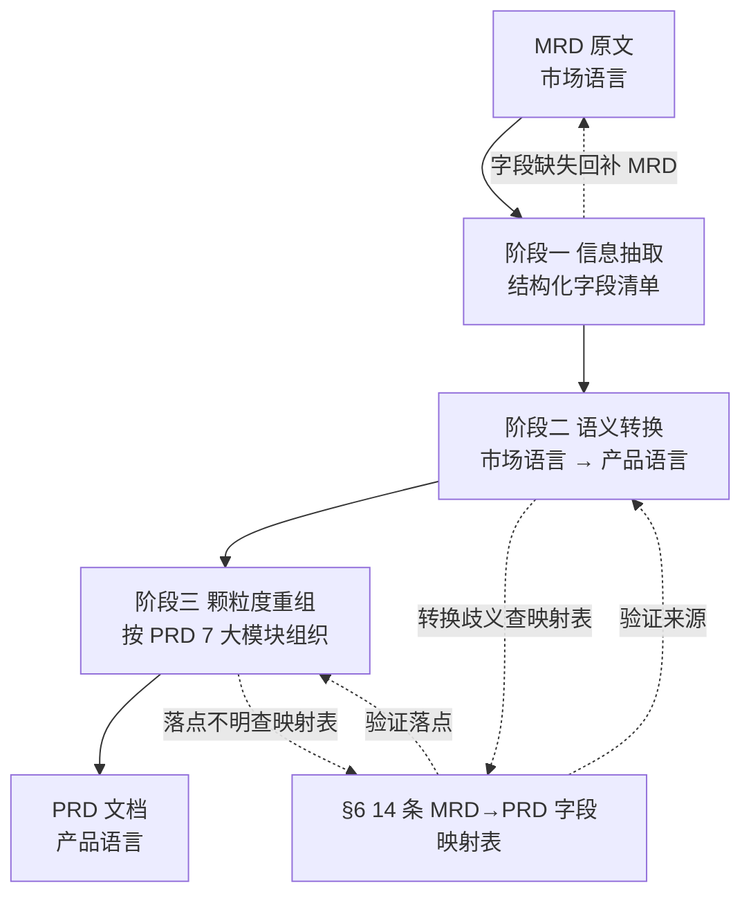
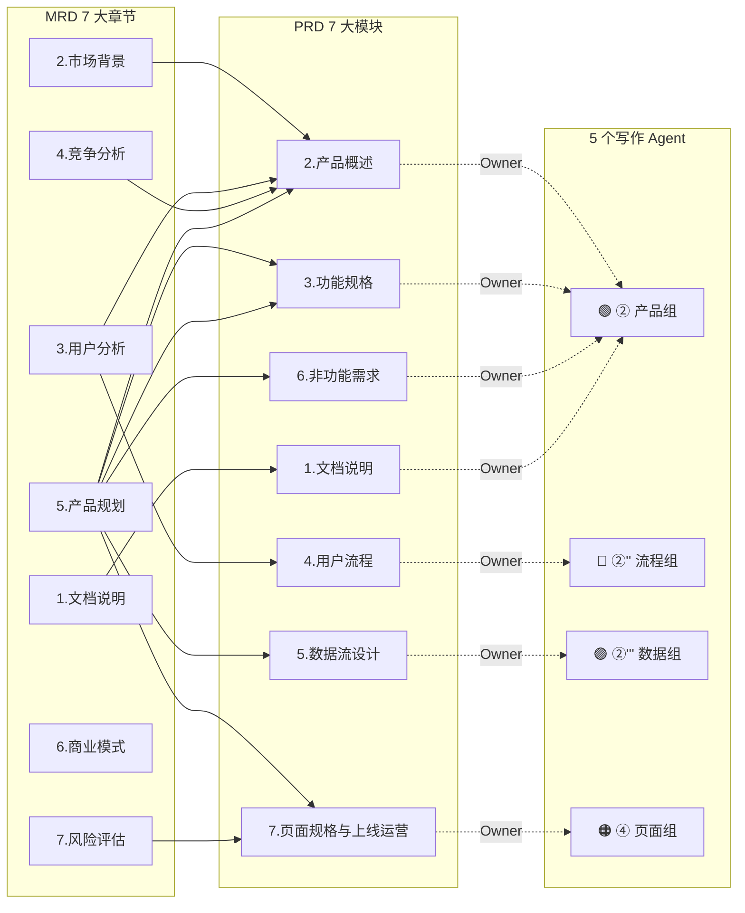
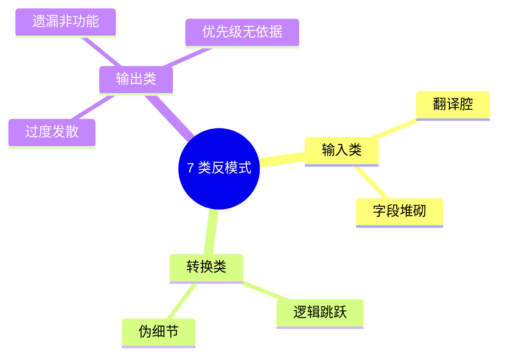
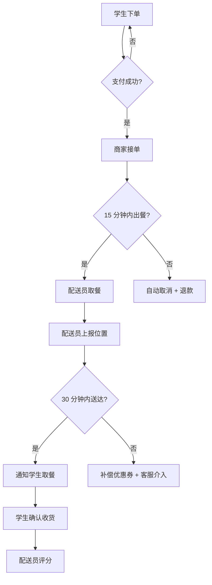

# MRD→PRD 推导方法论设计文档（v3 架构附录 A）

> **文档类型**：v3 架构附录 A · 推导方法论设计
> **版本**：v1.0
> **配套主文档**：`MRD转PRD-Multi-Agent架构设计方案.md` (v3)
> **来源材料**：
> - `00-AI实例\应用类\AI Agent矩阵规模化落地\03-产品需求全流程场景（产品需求Agent）.md` §6
> - `00-AI实例\应用类\需求文档产出multi-agent\MRD与PRD结构及推导过程\1-MRD文档结构和案例.md` §1-§7
> - `00-AI实例\应用类\需求文档产出multi-agent\MRD与PRD结构及推导过程\2-PRD文档结构和案例.md` §四
> - `00-AI实例\应用类\需求文档产出multi-agent\MRD与PRD结构及推导过程\3-推导过程.md` §1-§8

---

## §1 文档定位与边界

### 1.1 文档定位

本文档是 v3 架构（1 主 + 5 子 Agent）的**方法论附录**，定义"5 个写作 Agent 共同遵循的推导内核"。

| 维度 | v3 主架构 | 本文（附录 A） |
|------|----------|--------------|
| 视角 | 工程师视角的"系统" | 产品/PM 视角的"业务内核" |
| 关注点 | 5 个 Agent "写什么"（职责） | 5 个 Agent "怎么写"（方法） |
| 涵盖 | 拓扑 / 协议 / 模型 / 质检 / 介入点 | 推导方法论 / 字段映射 / 优化点 / 反模式 / 指标体系 |
| 落位 | Manager SOP / 子 Agent Skills | 各 Agent 的 systemPrompt 内容来源 |

### 1.2 目标读者

| 优先级 | 读者 | 用途 |
|--------|------|------|
| 主 | **子 Agent 配置撰写者** | 把方法论植入 ②/②''/②'''/④ 的 systemPrompt |
| 次 | **架构师** | 理解推导质量如何跨 Agent 保持一致 |
| 辅 | **PM 培训** | 理解 PRD 24 项优化点的人类业务含义 |

### 1.3 不写什么

为避免与 v3 主架构文档重复，本文**不涵盖**：

- ❌ 1+5 拓扑 / 角色职责 / 邮箱协议 / handoff 协议（v3 §2-4）
- ❌ Skills/Memory 物理目录结构（v3 §3）
- ❌ 模型选型与 3 级降级（v3 §6）
- ❌ 100 分制评分细则（v3 §7）
- ❌ 具体 prompt 模板与代码（v3 后续单独建 prompt 库）

### 1.4 阅读路径

```
PM/产品读者    → §1 → §2 → §3 → §4 → §5 → §9 → §10
架构师读者     → §1 → §2 → §6 → §7 → §8 → §10
Agent 配置者   → §3 → §4 → §5 → §6 → §7 → §8  （按章节→Agent 对应表查）
培训读者       → §1 → §2 → §9 → §10
```

---

## §2 推导总览

### 2.1 核心心法：MRD vs PRD 的本质差异

**两个关键认知**（来源：3-推导过程 §0）：

1. **MRD 回答"做什么/为什么"** — 市场要什么、用户是谁、竞品如何做
2. **PRD 回答"怎么做/做到什么程度"** — 功能细节、交互规则、验收标准

**推导本质是 3 件事**：

| 推导动作 | 含义 | 典型产物 |
|---------|------|---------|
| 抽取 | 从 MRD 文字中提取结构化信息 | 字段清单、量化数据、场景列表 |
| 转换 | 把"市场语言"翻译为"产品语言" | Persona 化、Story 化、规则化、指标化 |
| 重组 | 按 PRD 章节框架重新组织内容 | 产品概述/功能规格/用户流程/数据流/页面规格 7 大模块 |

**从抽象到具体的 4 个层级**：

```
层级 1：MRD 的"问题陈述"（如：高峰期大学生订餐难）
    ↓ 抽取 + Persona 化
层级 2：PRD 的"用户故事"（如：作为大学生，我想要 30 分钟内宿舍楼下取餐）
    ↓ 转换 + 规则化
层级 3：PRD 的"功能详述 + AC"（如：F-LOGISTICS_001 + 3 条 Given-When-Then）
    ↓ 重组 + 落地化
层级 4：PRD 的"页面规格"（如：P-LOGISTICS_TRACK 页面 7 段式描述）
```

### 2.2 MRD→PRD 3 段式推导流程图



**三段式说明**：

- **阶段一（信息抽取）**：从 MRD 原文中按字段映射表（§6）的"MRD 来源"列提取结构化信息（数据、字段、场景）
- **阶段二（语义转换）**：把"市场语言"翻译为"产品语言"——市场机会→愿景、痛点→价值主张、画像→Persona、场景→Story
- **阶段三（颗粒度重组）**：按 PRD 7 大模块（产品概述/功能规格/用户流程/数据流/页面规格）组织内容
- **回环机制**：每阶段如有歧义或缺漏，回退到前一阶段或查字段映射表

### 2.3 与 v3 架构 9 阶段 SOP 的对齐

v3 主架构定义了从 MRD 到 PRD 交付的 9 阶段工程流程（Manager 视角）。本节建立"工程 SOP"与"推导方法"的两端映射：

| v3 工程阶段（Manager SOP） | 推导阶段 | 主要承载 Agent | 核心方法（本文） |
|--------------------------|---------|---------------|----------------|
| 阶段 0：Manager 初始化 | — | Manager | — |
| 阶段 1：派 ① MRD 结构化 | 阶段一 信息抽取 | ① MRD 结构化 | 字段映射表 §6 / 5 大模块 |
| 阶段 2：① 产出 breakdown | 阶段一 完成 | ① MRD 结构化 | 字段清单（9 字段 + 47 需求） |
| 阶段 3：派 ② 产品组 | 阶段二 语义转换启动 | ② 产品组 | 4 维价值评估 §4 / Persona+Story 化 |
| 阶段 4：② 产出 PRD1+PRD2 | 阶段二 主体 + 阶段三 部分重组 | ② 产品组 | 策划四步法 §3 / KANO→P0 §5 |
| 阶段 5：并发派 ②''/②'''/④ | 阶段三 重组展开 | ②'' 流程 / ②''' 数据 / ④ 页面 | 字段映射表 §6 / 24 项优化点 §7 |
| 阶段 6：收集 PRD3+PRD4+PRD5 | 阶段三 完成 | ②''/②'''/④ | 端到端案例 §9 校准 |
| 阶段 7：派 ③ 质检 | 自查 checklist | ③ 质检 | 反模式 7 项 + checklist 10 条 §8 |
| 阶段 8：读 qa_report.md | 一致性校验 | Manager + ③ 质检 | 自查 checklist §8 / 质量指标 §10 |
| 阶段 9：归档 + Human 终审 | 闭环验证 | Human | 质量指标 §10 |

**关键对应**：

- v3 阶段 1-2 = 本文档 阶段一（信息抽取） → ① 承担
- v3 阶段 3-4 = 本文档 阶段二（语义转换） → ② 承担
- v3 阶段 5-6 = 本文档 阶段三（颗粒度重组） → ②''/②'''/④ 承担
- v3 阶段 7-8 = 本文档 一致性校验 → ③ + Manager 承担

### 2.4 MRD 7 大章节 ↔ PRD 7 大模块概览

为建立整体心智模型，先看两端章节的全景对照（**详细映射见 §6**）：

**MRD 7 大章节**（来源：1-MRD §一）：

```
1. 文档说明（版本/目的/名词）
2. 市场背景与机会（行业/痛点/TAM-SAM-SOM）
3. 用户分析（画像/场景）
4. 竞争分析（直接/间接/潜在/SWOT/差异化）
5. 产品规划（定位/功能/非功能/路线）
6. 商业模式（收入/定价/规模测算，可选）
7. 风险评估与应对
```

**PRD 7 大模块**（来源：2-PRD §一）：

```
1. 文档说明（修订记录/名词/评审清单）
2. 产品概述（8 子模块：定位/愿景/价值/用户/竞品）
3. 功能规格（功能详述/AC/关系图/权限矩阵）
4. 用户流程（旅程地图/业务流程/操作步骤/用户故事）
5. 数据流设计（结构/流向/存储原则）
6. 非功能需求（性能/安全/可靠/兼容/可维护）
7. 页面规格设计与上线运营（清单/布局/组件/响应式/上线/回滚/埋点/运营）
```

**注意**：PRD 的"7 大模块"在 PRD 5 章节模板（v3 §12.2 旧版）上**已升级**为 PRD 7 大模块（v1.1 融合 24 项优化点），本文档以"7 大模块"为基准。

### 2.5 从抽象到具体的 4 层级落地示例

| 层级 | 输入 | 推导动作 | 输出 | v3 中执行者 |
|------|------|---------|------|------------|
| 1. 问题陈述 | MRD 文字 | 抽取 + Persona 化 | PRD 用户故事 | ② 产品组（PRD1.6 + PRD2） |
| 2. 用户故事 | 故事候选 | 转换 + 规则化 | PRD 功能详述 + AC | ② 产品组（PRD2） |
| 3. 功能 + AC | 功能定义 | 重组 + 落地化 | PRD 业务流程 + 数据流 + 页面 | ②'' 流程 / ②''' 数据 / ④ 页面 |
| 4. 页面规格 | 功能定义 | 落地化 | PRD 页面规格（7 段式） | ④ 页面组（PRD5） |

---

## §3 策划四步法（P1）

> **来源**：3-推导过程 §2.1、§2.4
> **核心点 P1**：信息抽取 → 语义转换 → 颗粒度重组 → 一致性校验
> **v3 落位**：作为 SOP 注入 ②/②''/②'''/④ 全部写作 Agent 的 systemPrompt

### 3.0 步骤 0：需求提报模板校验（前置门）

> **来源**：3-推导过程 §2.4（决胜 B 端第 12 章）[本地源 P0]
> **核心作用**：在执行 4 步法前，先校验 MRD 文档的"原料合格性"。原料不合格，4 步法输出也是空中楼阁。

**5 项硬性校验**（任意一项缺失 → 退回 MRD 编写者，禁止在 PRD 阶段推测）：

| # | 校验项 | 通过条件 | 不通过处理 |
|---|--------|---------|-----------|
| 1 | **提出人** | 明确是谁提的（业务方/运营/客服/法务） | 退回补"谁提的" |
| 2 | **使用人** | 明确终端用户是谁（决策者/使用者/受影响人 3 类至少 1 类） | 退回补"谁用" |
| 3 | **场景** | 至少 1 个具体使用场景（什么时候/哪里/做什么） | 退回补"何时何地做什么" |
| 4 | **痛点** | 至少 1 个可论证的痛点（"我跑校门口太远"而非"用户体验差"） | 退回补"具体痛点证据" |
| 5 | **验收标准** | 至少 1 条可验证的成功标准（"30 分钟内送达"而非"尽快"） | 退回补"可量化指标" |

**反 GT（错误 MRD）**：

```markdown
# 错误示例
"老板说要做个校园外卖，要快、要好、要便宜。"
```

**诊断**：
- ❌ 无提出人（"老板"是泛指，不是责任主体）
- ❌ 无使用人（"大学生"是群体画像，不是 Persona）
- ❌ 无场景（"做个外卖"无时间地点）
- ❌ 无痛点（"要好要便宜"是空话）
- ❌ 无验收标准（"要快"无法量化）

**GT（正确 MRD）**：

```markdown
# 正确示例
- 提出人：高校后勤处采购主任（30-45 岁）
- 使用人：在校大学生（18-25 岁，3 万人）
- 场景：午餐高峰（11:30-12:30），学生下课在宿舍或教室
- 痛点：食堂排队 30+ 分钟（数据：抽样 100 人，平均排队 32 分钟）
- 验收：30 分钟内宿舍楼下取餐（订单完成率 ≥ 95%）
```

**v3 落位**：
- ① MRD 结构化 Agent 启动时，**先执行本步骤 0 校验**；不通过 → 走 needs_clarify（v3 §8 协议）
- Manager 在阶段 1 派发 ① 前，本校验也作为"原料检查门"
- 校验通过 → 进入 3.1 4 步法；校验不通过 → 直接退回到 Human 补 MRD

### 3.1 4 步法主表

| 步骤 | 动作 | 输入 | 产出 | 工具/参考 |
|------|------|------|------|----------|
| 1. 信息抽取 | 从 MRD 7 大章节抽取结构化字段 | MRD 全文 | 字段清单（每章节 1 张表） | 字段映射表 §6 的"MRD 来源"列 |
| 2. 语义转换 | 把市场语言翻译为产品语言 | 字段清单 | Persona / Story / 价值主张 / 量化指标 | 字段映射表的"产物形态"列 |
| 3. 颗粒度重组 | 按 PRD 7 大模块归类所有产物 | 转换后产物 | PRD 章节草稿（按 PRD 树状结构） | PRD 7 大模块结构（§2.4） |
| 4. 一致性校验 | 用自查清单验证闭环 | PRD 草稿 | 完整 PRD | 自查 checklist 10 条（§8.2） |

### 3.1.1 原始需求 vs 产品需求（多对多关系）

> **来源**：3-推导过程 §3.0.1（决胜 B 端第 12 章 · 需求管理与迭代优化）[本地源 P0]
> **核心点**：在执行 4 步法时，**用户原话（原始需求）与 PRD 中的产品需求是多对多关系**——不能机械地把"1 个原话"映射为"1 个产品需求"。

| 关系 | 含义 | 例子（校园外卖） |
|------|------|----------------|
| **1 原始需求 → N 产品需求** | 1 个用户原话可拆为多个产品需求 | "送餐到宿舍" → F-LOGISTICS_001 配送 + F-LOGISTICS-002 时效提示 |
| **N 原始需求 → 1 产品需求** | 多个用户原话可合并为 1 个产品需求 | "高峰期 + 走不动" + "下雨天 + 不出门" → 1 个配送功能 |
| **1 产品需求 → N 研发/测试任务** | 1 个产品需求可拆为多个研发/测试任务 | F-LOGISTICS_001 → 后端 1 个工单 + 前端 1 个工单 + 测试 2 个用例 |

**核心使用方式**：

```
方向 A（写 PRD 时）→ 写完 MRD 某章节 → 查字段映射表（§6）找到对应行 → 按"产物形态"列写 PRD 对应章节
方向 B（自查 PRD 完整性时）→ 拿到 PRD 某章节 → 查字段映射表 → 核查 MRD 对应章节是否包含此字段
```

**反 GT（错误理解）**：

- ❌ "1 个原话 = 1 个产品需求"（漏拆/漏合）
- ❌ "产品需求 = 研发任务"（混淆两层概念）

**v3 落位**：
- ① MRD 结构化 Agent 在做"需求拆分"时，必须识别 1→N / N→1 关系，不能一对一硬映射
- ② 产品组在写 PRD2 时，必须把"1 个 Story"对应到"1 个产品需求"，不能把多个 Story 混为 1 个
- ③ 质检 Agent 校验"PRD 任务数 vs 实际研发工单数"是否在 1:N~1:3 合理区间

### 3.2 步骤 1：信息抽取（GT vs 反 GT 对照）

**GT（正确做法）**：

```markdown
# MRD §3.2 用户分析 抽取产物
- 决策者画像：高校后勤处采购主任（30-45 岁，本科以上）
- 使用者画像：在校大学生（18-25 岁）
- 场景 1：用餐高峰（小王）——食堂排队 + 跑校门口取餐
- 场景 2：宅寝（小雨）——不想出门
- 场景 3：兼职（小红）——想在校园内接单
```

**反 GT（错误做法）**：

```markdown
# 错误示例
- 目标用户：高校学生
- 需求：吃饭方便
```

**反 GT 诊断**：
- ❌ 缺"决策者+使用者"双画像（漏掉受影响人）
- ❌ 缺场景化（写成"用户标签清单"）
- ❌ 缺痛点证据（"吃饭方便"是空话）

### 3.3 步骤 2：语义转换（市场语言 → 产品语言）

| 市场语言（MRD） | 转换动作 | 产品语言（PRD） |
|----------------|---------|---------------|
| "市场机会" | 抽取关键数据 → 凝练 | "愿景目标"（含北极星指标） |
| "痛点" | + 价值主张 | "核心价值主张"（每痛点 1:1 对应） |
| "用户画像" | Persona 化 | "目标用户群体"（1-3 个 Persona 卡片） |
| "场景" | 业务节点 + 触点识别 | "用户旅程地图" + "业务流程图" |
| "差异化优势" | 竞品能力对照 | "竞品简析" + "差异化设计要点" |
| "商业模式" | 业务规则化 | "业务规则" + "运营计划" |
| "风险评估" | 应对策略 | "回滚预案" + "埋点监控" |

### 3.4 步骤 3：颗粒度重组（4 个层级）

| 层级 | 输入 | 动作 | 输出 | 落位 |
|------|------|------|------|------|
| 1. 问题陈述 | MRD 文字 | 抽取 + Persona 化 | 用户故事候选 | PRD 1.6 + 2.x |
| 2. 用户故事 | 故事候选 | 转换 + 规则化 | 功能详述 + AC | PRD 2.1 + 2.2 |
| 3. 功能 + AC | 功能定义 | 重组 + 落地化 | 业务流程 + 数据流 + 页面 | PRD 3 + 4 + 5 |
| 4. 页面规格 | 功能定义 | 落地化 | 页面规格（7 段式） | PRD 5 |

### 3.5 步骤 4：一致性校验（10 条 checklist）

详见 §8.2 自查 checklist 10 条。本步骤是 4 步法的"质量门"，**任一条不通过则不能交付**。

### 3.6 步骤间的回环机制

```
步骤 0 校验失败 → 退回 MRD 编写者补全（必须 5 项全过）
步骤 1 缺字段 → 回退到 MRD 补全（或标"待补"）
步骤 2 转换歧义 → 查字段映射表（§6）
步骤 3 落点不明 → 查字段映射表 + PRD 7 大模块
步骤 4 不通过 → 回到步骤 1-3 补漏
```

---

## §4 4 维价值评估 + launch blocking（P2-P3）

> **来源**：3-推导过程 §2.2-§2.3 + 2-PRD §六
> **核心点 P2**：商业/业务/用户/技术 4 维度评分卡
> **核心点 P3**：4 维评分中任意维度 < 阈值则 launch blocking
> **v3 落位**：Skills 注入 ② 产品组 + ③ 质检

### 4.1 4 维价值评估表（每条功能/Story 必经）

| 维度 | 评估问题 | 评分 1-5 | 不通过处理 |
|------|---------|---------|-----------|
| **商业价值** | 这个功能为公司带来什么收益？（收入/用户增长/品牌） | 1-5 | < 3 → 标"低优先"或剔除 |
| **业务价值** | 对业务方/运营方有什么好处？（流程效率/降本） | 1-5 | < 3 → 与业务方重新对齐 |
| **用户价值** | 对终端用户解决了什么问题？（痛点/痒点/爽点） | 1-5 | < 2 → 标"伪需求"剔除 |
| **技术价值** | 对架构/可维护性的影响？（复用性/扩展性） | 1-5 | < 2 → 提技术评审 |

> **来源声明**：4 维评估源自"决胜 B 端第 6 章 · B 端需求分析 4 块"，是 B 端 PRD 的必经环节 [本地源 P0]。

### 4.2 评分示例（GT vs 反 GT 对照）

**GT（正确评分）**：

| 功能 | 商业 | 业务 | 用户 | 技术 | 总分 | 决策 |
|------|------|------|------|------|------|------|
| F-LOGISTICS_001 校内配送 | 5 | 5 | 5 | 4 | 19/20 | ✅ P0（launch blocking） |
| F-LOGISTICS_002 实时位置追踪 | 4 | 4 | 5 | 3 | 16/20 | ✅ P1 |
| F-LOGISTICS_003 配送员评分 | 3 | 3 | 4 | 3 | 13/20 | ✅ P2 |

**反 GT（错误评分）**：

| 功能 | 商业 | 业务 | 用户 | 技术 | 总分 | 决策 |
|------|------|------|------|------|------|------|
| 配送功能 | "高" | "高" | "高" | "高" | ❌ | ❌ 全部标"高"无依据 |

**反 GT 诊断**：
- ❌ 无量化（"高"是形容词不是分数）
- ❌ 无 1-5 离散刻度
- ❌ 4 维度混在一起判断（应独立打分）

### 4.3 launch blocking 判定（P3）

每条功能进入步骤 3（颗粒度重组）前必须回答 1 个问题：**这个功能是不是 launch blocking？**

| 判定规则 | 触发条件 | 处理 |
|---------|---------|------|
| **维度阻塞** | 4 维中任一维度 < 阈值（商业/业务 < 3，用户/技术 < 2） | launch blocking；必须本期做 |
| **总分阻塞** | 4 维总分 ≥ 14/20 | 进入 P0/P1 通道 |
| **非阻塞** | 4 维总分 < 14/20 | 进入 P2 或剔除 |

> **关键约束**：10 个功能中最多 3 个最优先；超过 3 个 = 失去优先级信号 [本地源 P0]。

### 4.4 4 维评估的雷达图（mermaid）


### 4.5 4 维评估在 v3 中的嵌入位置

| v3 阶段 | 4 维评估的承担方 | 输出 |
|---------|----------------|------|
| v3 阶段 3（派 ② 产品组） | ② 在 systemPrompt 启动时读 4 维评估卡 | 评分模板 |
| v3 阶段 4（② 产出 PRD2） | ② 对每条 Story 打 4 维分数 | `feature_score_list.md` |
| v3 阶段 7（③ 质检） | ③ 复核分数一致性 | qa_report 中"价值评估一致性"维度 |
| v3 阶段 8（Manager 决策） | Manager 读评分做优先级决策 | 修订指令 |

---

## §5 优先级推导漏斗（P4-P5）

> **来源**：3-推导过程 §3.1.1-§3.1.2
> **核心点 P4**：KANO → MoSCoW → P0/P1/P2 三层漏斗
> **核心点 P5**：4 大常见误区 + PM 三原则
> **v3 落位**：Skills 注入 ② 产品组（PRD2 功能详述）

### 5.1 KANO 模型基础（5 类需求）

| KANO 类型 | 含义 | 优先级对应 |
|----------|------|-----------|
| **必备型**（Must-be） | 缺失则用户强烈不满；有则视为理所当然 | → P0 必做 |
| **期望型**（One-dimensional） | 越多越好；缺失则不满 | → P1 应做 |
| **兴奋型**（Attractive） | 超出预期的惊喜 | → P2 可做（亮点） |
| **无差异型**（Indifferent） | 有无都不影响满意度 | → 不做 |
| **反向型**（Reverse） | 做了反而引发不满 | → 剔除 |

> **KANO 误用警示**：把"功能"当"需求"是常见错误。KANO 评估的是"用户对某类需求的态度"，不是"某功能要不要做"。

### 5.2 优先级推导漏斗（KANO → P0/P1/P2）

```
优先级推导规则
├── 必备（必做）= MRD P0 ∩ 关键路径 → PRD P0
├── 应做（应做）= MRD P1 ∪ MRD P0 非关键路径 → PRD P1
├── 可做（可选）= KANO 兴奋需求 + MRD P2 → PRD P2
└── 不做 = KANO 无差异需求 + KANO 反向需求 → 从 PRD 剔除
```

**漏斗 3 步过滤**：

| 步骤 | 过滤规则 | 通过 |
|------|---------|------|
| 过滤 1 | KANO 反向/无差异 → 剔除 | — |
| 过滤 2 | 必备 + 关键路径 = P0 | 关键路径上的必备功能 |
| 过滤 3 | 期望 / 兴奋 + launch blocking | P1 / P2 |

### 5.3 4 大常见误区（P5 · 误区清单）

| # | 误区 | 表现 | 修正 |
|---|------|------|------|
| 1 | 全部都"最优先" | 10 个功能都标 P0 | KANO 必备型才进 P0；期望/兴奋降 P1/P2 |
| 2 | 优先=最简单 | 按"实现难度低"排 P0 | 按"业务价值"排 P0；高难度高价值也进 P0 |
| 3 | 忽略风险 | 低风险功能被低估 | 高风险功能降一级（避免 launch 翻车） |
| 4 | 未明确"推迟发布也要等" | 没有"非做不可"清单 | 显式列出"launch blocking 功能"清单（§4.3） |

> **来源**：硅谷 36 讲第 30 讲 [本地源 P1]。

### 5.4 PM 三原则（P5 · 排序态度）

> 优先级排序时，PM 必须保持的 3 种态度：

| 原则 | 含义 | 错误示范 |
|------|------|---------|
| **无知** | 不知道市场/用户的反应，承认无知 | 自作主张替用户决定 |
| **无畏** | 敢于砍掉"老板/客户坚持要"但价值低的需求 | 老板说要做就做（无判断） |
| **无情** | 用数据/标准砍需求，不讲人情面 | "和气 PM"（不敢砍） |

> **10 个功能中最多 3 个最优先**；超过 3 个 = 失去优先级信号 [本地源 P0]。

### 5.5 优先级与 KANO 错位的反 GT 案例

**GT（正确）**：

| 功能 | KANO | 4 维总分 | 优先级 |
|------|------|---------|--------|
| F-LOGISTICS_001 校内配送 | 必备 | 19/20 | P0 |
| F-LOGISTICS_002 实时位置追踪 | 期望 | 16/20 | P1 |
| F-LOGISTICS_003 配送员评分 | 兴奋 | 13/20 | P2 |

**反 GT（KANO 错位）**：

| 功能 | KANO | 实际 | 误标优先级 |
|------|------|------|-----------|
| 配送员评分 | 兴奋 | P2 | ❌ 误标 P0（"老板说要重视服务质量"） |
| 校内配送 | 必备 | P0 | ❌ 误标 P2（"实现难度高，先做简单的"） |

**反 GT 诊断**：
- ❌ 必备型降级（违反 KANO 基础）
- ❌ 兴奋型升级（违反 PM 三原则之"无畏"+"无情"）
- ❌ 把"实现难度"当优先级（违反误区 #2）

### 5.6 优先级与 v3 的衔接

| v3 Agent | 优先级承担 |
|---------|-----------|
| ① MRD 结构化 | 抽取 MRD 5.2 KANO 分级表 → 输出 KANO 分类 |
| ② 产品组 | KANO → P0/P1/P2 映射 + 4 维评估打分 + 错误检查（4 误区） |
| ③ 质检 | 复核优先级一致性（必备型是否标 P0 / P0 数量是否 ≤ 3） |

---

## §6 MRD→PRD 字段映射表（P6）

> **来源**：3-推导过程 §3 + v3 §12.3
> **核心点 P6**：14 条字段级映射（MRD 章节→PRD 字段+推导规则+责任 Agent）
> **v3 落位**：SOP 引用表，每个写作 Agent 启动时强制加载

### 6.1 映射表主表（14 条）

> 标注：🟢 ② 产品组 / 🔵 ②'' 流程组 / 🟣 ②''' 数据组 / 🟠 ④ 页面组
> **列说明**：本表 7 列源自 3-推导过程 §3.0 主表，新增 2 列——"反指标"记录"写此 PRD 字段时需警惕的侵蚀效应"，"MRD 缺失时降级写法"明确"上游 MRD 缺失时 PRD 这段写什么"。

| # | MRD 来源 | PRD 字段 | 推导规则 | 责任 Agent | 反指标（侵蚀效应） | MRD 缺失时降级写法 |
|---|---------|---------|---------|-----------|------------------|------------------|
| 1 | 1.文档说明 | 1.文档说明 | 直接转换：版本号/名词/审阅清单 | 🟢 ②（草拟）/Manager（验收） | 文档说明与正文脱节（版本未更新） | 标"版本号待定"，PRD 1.1 留空 |
| 2 | 2.市场背景与机会 | 2.1-2.3 产品概述（愿景/目标/竞品简析） | 4 维映射（市场/用户/产品/竞品 → PRD 要素） | 🟢 ② 产品组 | 愿景夸大化（被竞品用同一数据反超）；价值主张与竞品重叠 | 标"待补市场数据/痛点调研"，PRD 1.3 + 1.5 写"假设数据 + 痛点 P0/P1/P2" |
| 3 | 3.用户分析 | 1.6 目标用户群体 + 2.x 用户故事 | Persona 化 + 业务节点识别 | 🟢 ② 产品组 | 单一画像（漏掉受影响人） | 标"待补画像"，PRD 2.6 写"假设核心用户 1 类" |
| 4 | 4.竞争分析 | 1.7 市场需求与竞品简析 | 竞品能力对照 + 差异化设计 | 🟢 ② 产品组 | 差异化被快速复制 | 标"待补竞品分析"，PRD 2.7 写"竞品名单待定" |
| 5 | 5.1 产品定位 | 1.1-1.5 产品概述（定位/愿景/价值） | 抽取 + 凝练 + 价值主张 | 🟢 ② 产品组 | 定位漂移 | 标"待补定位"，PRD 1.1 写"产品名 + 暂定定位" |
| 6 | 5.2 功能规划 | 2.1 功能详述 + 2.2 功能关系图 | 价值动作 → 功能关键词 + ID 命名 + 4 维评估 | 🟢 ② 产品组 | 伪需求功能；兴奋型当必备型做（高估价值） | 标"待补痛点 + KANO 分类"，PRD 3.1 写"功能待定" + 全部 P0 |
| 7 | 5.2 功能规划 | 3.2 业务流程图 | 关联关系 → Mermaid 节点/连线 | 🔵 ②'' 流程组 | 流程过于理想化（缺异常分支） | 标"待补流程图"，PRD 4.2 写"主流程占位" |
| 8 | 3.2 用户场景 | 3.1 用户旅程地图 + 3.3 操作步骤 | 场景 → 阶段；功能 → 行为 | 🔵 ②'' 流程组 | 场景覆盖不全 | 标"待补场景"，PRD 4.1 写"主流程 1 场景" |
| 9 | 5.3 非功能需求 | 5.1 数据模型 + 5.2 流转规则 | 实体识别 / 关系 / 字段 | 🟣 ②''' 数据组 | 模型过度复杂（脱离实际） | 标"待补数据需求"，PRD 5.1 写"实体待定" |
| 10 | 5.3 非功能需求 | 5.3 数据存储与安全 | 加密/脱敏/审计/合规/性能指标 | 🟣 ②''' 数据组 | 安全 SLA 过高（不可达） | 标"待补安全需求"，PRD 5.3 写"按行业基准" |
| 11 | 5.3 非功能需求（性能/兼容/安全/可靠/可维护） | 6.非功能需求 | 直接映射 + 量化指标（响应时间/TPS/可用性） | 🟢 ② 草拟 + 🔵🟣🟠 各自补充 | 非功能 SLA 过高 | 标"待补 SLA"，PRD 6.x 写"按行业基准" |
| 12 | 5.4 实施路线 | 7.1 上线计划 + 7.2 回滚预案 | 阶段 → 时间点；风险 → 应对 | 🟢 ② 产品组（草拟）+ Manager（决策） | 排期过于乐观 | 标"待补排期"，PRD 7.4 写"按季度划分" |
| 13 | 5.2 功能规划 | 7.3 埋点监控 + 7.4 运营计划 | 关键功能 → 埋点；上线 → 运营 SOP | 🟢 ② 产品组 | 埋点过多（数据噪音） | 标"待补埋点计划"，PRD 7.3 写"基础 PV/UV 埋点" |
| 14 | 3.2 用户场景 + 5.2 功能 | 8.1 页面清单 + 8.2 页面规格 | 场景 → 页面；功能 → 字段/组件 | 🟠 ④ 页面组 | 页面数量过多（开发无法消化） | 标"待补场景+功能"，PRD 7.1 写"主流程 3 页面" |

> **与 v3 §12.3 关系**：v3 旧版含 11 条映射（PRD1-5 各 1-2 条），本文升级为 14 条，**新增 3 条**（上线计划/回滚/埋点 → PRD 7.x；非功能需求 → PRD 6；用户场景+功能 → PRD 8 页面规格）。
> **7 列扩展来源**：本表的"反指标"列和"MRD 缺失时降级写法"列源自 3-推导过程 §3.0 主表的 6 列版（原 5 列 + 新增 2 列），目的是让 5 个写作 Agent 在遇到"上游缺失"或"潜在侵蚀效应"时，有明确处理路径。

### 6.2 字段映射泳道图（mermaid）



### 6.3 映射表使用规则（v3 嵌入方式）

每个写作 Agent 启动时，Manager 在 systemPrompt 注入**该 Agent 负责的所有映射行**（不是全表），降低上下文负担。

| Agent | 注入的映射行 |
|-------|------------|
| ② 产品组 | #1, #2, #3, #4, #5, #6, #11, #12, #13 |
| ②'' 流程组 | #7, #8, #11 |
| ②''' 数据组 | #9, #10, #11 |
| ④ 页面组 | #11, #14 |
| ③ 质检 | 全部 14 条（用于交叉一致性校验） |

### 6.4 字段映射的反 GT 案例

**GT（按映射表填）**：

```markdown
## F-LOGISTICS_001 校内配送（4 维评分 19/20）
- MRD 来源：5.2 功能规划（校外到校内配送能力）
- PRD 字段：3.x 功能详述 + 4.x 业务流程 + 5.x 数据流
- 推导规则：价值动作"配送" → 功能关键词 F-LOGISTICS → ID 命名 → 必备型 KANO → P0
- 责任 Agent：②（PRD2）+ ②''（PRD3.2）+ ②'''（PRD4.x）
```

**反 GT（无映射填法）**：

```markdown
## 配送功能
- 要做
- 很紧急
```

**反 GT 诊断**：
- ❌ 无 MRD 来源（无法追溯）
- ❌ 无 PRD 字段定位（无法索引）
- ❌ 无推导规则（无法解释）
- ❌ 无责任 Agent（无法分工）
- ❌ 无 KANO + 4 维评分（无法排序）

---

## §7 PRD 24 项优化点落位（P7-P8）

> **来源**：2-PRD §四
> **核心点 P7**：8 大结构层优化（PRD 整体框架）
> **核心点 P8**：16 个细节层优化（PRD 单个章节质量）
> **v3 落位**：GT 库（按章节归类）+ 质检 checklist（③）

### 7.1 A 组 8 项：结构层优化（P7）

> 解决"PRD 整体框架"问题——章节是否齐全、模块是否自洽。

| # | 优化点 | GT 表现 | 反 GT 表现 | 落位章节 | 责任 Agent |
|---|--------|---------|----------|---------|-----------|
| A-1 | 文档说明完整（修订/名词/评审清单） | 3 字段齐全 | 只写文档名 | PRD 1 | 🟢 ② |
| A-2 | 产品概述 8 子模块齐全 | 8 项全列 | 只写愿景目标 | PRD 2 | 🟢 ② |
| A-3 | 功能规格 + AC + 关系图 + 权限矩阵 | 4 项俱全 | 只有功能名 | PRD 3 | 🟢 ② |
| A-4 | 用户流程（旅程 + 流程 + 步骤） | 3 项俱全 | 只画流程图 | PRD 4 | 🔵 ②'' |
| A-5 | 数据流（结构 + 流向 + 存储） | 3 项俱全 | 只写表名 | PRD 5 | 🟣 ②''' |
| A-6 | 非功能需求（性能/安全/可靠/兼容/可维护） | 5 项俱全 | 只写"性能好" | PRD 6 | 🟢 ② + 各 Agent 补 |
| A-7 | 页面规格（清单 + 布局 + 组件 + 响应式） | 4 项俱全 | 只列页面名 | PRD 7.1-7.2 | 🟠 ④ |
| A-8 | 上线运营（上线 + 回滚 + 埋点 + 运营） | 4 项俱全 | 写完即结束 | PRD 7.3-7.4 | 🟢 ② + 🟣 |

### 7.2 B 组 16 项：细节层优化（P8）

> 解决"PRD 单章节质量"问题——单章节是否专业、可执行。

| # | 优化点 | 落位章节 | 责任 Agent |
|---|--------|---------|-----------|
| B-1 | 修订记录表格（版本/日期/作者/摘要/审批） | 1.1 | 🟢 ② |
| B-2 | 名词解释（业务术语/技术术语/缩写） | 1.2 | 🟢 ② |
| B-3 | 评审清单（设计/开发/测试/业务方 4 角色） | 1.3 | 🟢 ② |
| B-4 | 产品定位"一句话定义"（≤30 字） | 2.1 | 🟢 ② |
| B-5 | 价值主张"痛点-解决方案"1:1 对应 | 2.2 | 🟢 ② |
| B-6 | 目标用户群体 Persona 卡片（1-3 个） | 2.6 | 🟢 ② |
| B-7 | 市场需求数据化（量化指标/数据来源） | 2.7 | 🟢 ② |
| B-8 | 竞品简析（直接 1-2 个，间接 1-2 个） | 2.8 | 🟢 ② |
| B-9 | 功能详述 4 要素（操作对象/行为/约束/关联） | 3.1 | 🟢 ② |
| B-10 | AC 用 Given-When-Then 句式 | 3.1 | 🟢 ② |
| B-11 | 业务规则"反例也描述"（黑名单/异常分支） | 3.1 | 🟢 ② |
| B-12 | 业务流程图 Mermaid 语法（必含审批/校验/数据更新） | 4.2 | 🔵 ②'' |
| B-13 | 数据模型 ER 图（实体/关系/字段） | 5.1 | 🟣 ②''' |
| B-14 | 性能指标量化（TPS/响应时间/可用性/并发） | 6.1 | 🟢 ② 草拟 |
| B-15 | 安全要求（加密/脱敏/审计/合规） | 6.2 | 🟣 ②''' |
| B-16 | 页面规格 7 段式（名称/目标用户/触发条件/前置条件/字段/操作/异常状态） | 7.2 | 🟠 ④ |

### 7.3 24 项优化点的章节分布矩阵

```
            │ PRD1 │ PRD2 │ PRD3 │ PRD4 │ PRD5 │ PRD6 │ PRD7
────────────┼──────┼──────┼──────┼──────┼──────┼──────┼──────
A 组结构层  │  A1  │  A2  │  A3  │  A4  │  A5  │  A6  │ A7+A8
────────────┼──────┼──────┼──────┼──────┼──────┼──────┼──────
B 组细节层  │B1B2B3│B4B5B6│  B9B10B11 │  B12 │  B13 │B14B15│  B16
────────────┴──────┴──────┴──────┴──────┴──────┴──────┴──────
```

**矩阵解读**：
- A 组每章节 1 个（PRD7 含 2 个 A：页面规格 + 上线运营）
- B 组按内容密度分配：PRD1 集中 3 项（文档规范），PRD3 集中 3 项（功能详述）
- 总 24 项 = 8 个 A + 16 个 B

### 7.4 24 项优化点的反 GT 典型表现

| 优化点 | GT 表现 | 反 GT 表现 |
|--------|---------|----------|
| A-1 | 文档说明含修订记录 + 名词 + 评审清单 3 字段 | 只写"本文档定义 XX 产品" |
| A-2 | 8 子模块：定位/语言/愿景/终端/价值/用户/竞品/兼容性 | 只写愿景目标 |
| B-4 | "校园外卖 App：30 分钟内宿舍楼下取餐"（≤30 字） | "做一个校园外卖 App" |
| B-5 | 痛点 1：食堂排队 30 分钟 → 价值 1：配送到家 30 分钟内 | "为大学生提供便利" |
| B-10 | "Given 用户已下单且支付成功，When 系统收到推送，Then 显示订单详情" | "用户能看到订单" |
| B-11 | "配送员黑名单：3 次投诉/月的配送员自动暂停派单" | "配送员不能态度差" |
| B-14 | "P99 响应时间 ≤ 200ms，支持 1000 并发，99.9% 可用性" | "性能要好" |
| B-16 | 页面 7 段式：名称/用户/触发/前置/字段/操作/异常 | 页面只有 1 句描述 |

### 7.5 24 项优化点与 v3 的对接

| v3 落位 | 24 项对应 |
|---------|---------|
| ② Skills `prd*_writer_sop` | 24 项作为"硬性 checklist"注入 systemPrompt 末尾 |
| ③ Skills `completeness_checker` | 24 项作为"完整性检查项"逐条验证 |
| ③ Skills `executability_checker` | B-10 / B-11 / B-14 / B-16 作为"可执行性"评分依据 |
| GT 库 `gt_samples/product/campus_takeout.md` | 24 项齐全的完整示例 |
| GT 库 `gt_samples/product/bad_examples.md` | 24 项缺失的反例 |

---

## §8 推导反模式 7 + 自查 checklist 10（P9-P10）

> **来源**：3-推导过程 §6、§8
> **核心点 P9**：7 类常见反模式（"翻译腔/字段堆砌/逻辑跳跃"等）
> **核心点 P10**：10 条硬性自查 checklist
> **v3 落位**：P9 并入 v3 §3 NEVER 清单；P10 注入 ③ 质检 completeness_checker

### 8.1 7 类推导反模式（P9）

> **说明**：每条反模式均给出"典型表现 + 风险 + 修正"。

| # | 反模式 | 典型表现 | 风险 | 修正 |
|---|--------|---------|------|------|
| 1 | **翻译腔** | PRD 几乎是 MRD 原文翻译，未做语义转换 | 仍是"市场语言"，无法指导开发 | 用策划四步法（§3）的"语义转换"动作 |
| 2 | **字段堆砌** | 把 MRD 所有字段搬进 PRD，未重组 | 章节冗余、读者迷失 | 用字段映射表（§6）做"颗粒度重组" |
| 3 | **逻辑跳跃** | MRD 推 PRD 缺少中间环节（如缺功能详述直跳到页面） | 推导链断裂，开发无法追溯 | 强制走 4 层级落地（§3.4 层级 1→2→3→4） |
| 4 | **伪细节** | 写大量形容词（"流畅/优雅/易用"），无具体指标 | 开发无法落 | 用 24 项 B 组细则（B-14 量化 / B-11 反例） |
| 5 | **过度发散** | MRD 没写的也写（如"未来扩展"、"未定义需求"） | 范围蔓延，验收标准模糊 | 严格走字段映射表，**MRD 没写的先标"待补"** |
| 6 | **遗漏非功能** | 只写功能需求，不写性能/安全/兼容 | 上线后翻车 | 强制 B-14 / B-15 / A-6 必须填 |
| 7 | **优先级无依据** | 10 个功能都标 P0（违反"最多 3 个最优先"） | 失去优先级信号 | 用 4 维评估 + KANO 漏斗（§4-§5） |

### 8.2 10 条自查 checklist（P10）

> 用途：PRD 写完后必须逐条过清单，任一条不通过则不交付。

| # | 检查项 | 检查方法 | 不通过处理 |
|---|--------|---------|-----------|
| 1 | 是否每个 PRD 字段都能在 MRD 中找到来源？ | 字段映射表（§6）反向追溯 | 标"未引用 MRD" → 走 needs_clarify |
| 2 | 是否每个功能都打了 4 维分数？ | 查 `feature_score_list.md` | 缺失则补打分 |
| 3 | P0 数量是否 ≤ 3？ | 计数 | 超过则强制 P0/P1 拆分 |
| 4 | 是否每个 P0 功能都标了 launch blocking？ | 查 §4.3 launch blocking 规则 | 标"非 blocking" |
| 5 | 是否每个功能详述都有 4 要素（操作对象/行为/约束/关联）？ | 查功能详述表 | 缺失则补 |
| 6 | 是否每个 AC 都是 Given-When-Then 句式？ | 抽样 5 条 | 改写为 G/W/T |
| 7 | 业务流程图是否含审批/校验/数据更新？ | 查 Mermaid 节点 | 缺失则补 |
| 8 | 数据模型是否含字段类型/长度/约束？ | 查表结构 | 缺失则补 |
| 9 | 非功能需求是否全部量化（响应时间/TPS/可用性/并发/加密）？ | 查 §6.1 量化指标 | 缺失则补 |
| 10 | 页面规格是否 7 段式（名称/用户/触发/前置/字段/操作/异常）？ | 查页面规格清单 | 缺失则补 |

### 8.3 7 反模式与 v3 NEVER 清单的交叉引用

| 反模式 | v3 NEVER 清单对应 |
|--------|------------------|
| 1 翻译腔 | ② NEVER：绝不写价值主张/用户画像时引用 MRD 原文 |
| 2 字段堆砌 | ② NEVER：绝不在 PRD 章节写"详见 MRD 5.2"作为占位 |
| 3 逻辑跳跃 | v3 流程强制：阶段 1→2→3 顺序不可跳 |
| 4 伪细节 | ② NEVER：绝不用"流畅/优雅/易用"等无指标词 |
| 5 过度发散 | ② NEVER：绝不写 MRD 没明说的"未来扩展" |
| 6 遗漏非功能 | v3 阶段 7 质检必查 A-6 / B-14 / B-15 |
| 7 优先级无依据 | ③ NEVER：绝不放任 P0 > 3 个 |

### 8.4 7 反模式归类图（mermaid mindmap）



**分类解读**：
- **输入类**（#1, #2）：从 MRD 抽取时错误——原样搬运，未做处理
- **转换类**（#3, #4）：语义转换时错误——跳过层级、缺量化
- **输出类**（#5, #6, #7）：颗粒度重组时错误——范围蔓延、维度遗漏、无依据

---

## §9 端到端案例剖析：校园外卖 MRD→PRD

> **来源**：3-推导过程 §7（综合 §3-§6 方法点）
> **目的**：用 1 个真实案例（校园外卖 MRD）走通全流程，让读者看到方法点的具体落地
> **覆盖检查**：本案例覆盖 §3-§8 所有方法点至少 1 次

### 9.1 案例背景

**MRD 摘要**（虚构案例，非真实产品）：
- 目标市场：某 985 高校（在校生 3 万人）
- 痛点：食堂高峰排队 30+ 分钟、校外卖选择少
- 解决方案：聚合校园周边 2km 商家，30 分钟内宿舍楼下取餐
- 目标用户：在校大学生（决策/使用者合一）
- 商业：商家抽佣 15%

### 9.2 步骤 1：信息抽取

**抽取 MRD 关键字段**（按字段映射表 §6 提取）：

| MRD 章节 | 抽取结果 | 字段映射对应 |
|---------|---------|------------|
| 2.市场背景 | 高校外卖市场规模（仅本校 3 万人 × 60 元/天 × 200 天 = 3,600 万/年） | #2 PRD 2.x 愿景目标 |
| 3.用户分析 | Persona 1（高峰小王/在校）、Persona 2（宅寝小雨/在校） | #3 PRD 1.6 目标用户群体 |
| 5.1 产品定位 | "校园外卖 App：30 分钟内宿舍楼下取餐" | #5 PRD 1.1-1.5 |
| 5.2 功能规划 | 8 大功能：订餐/支付/配送/追踪/评分/优惠/客服/数据 | #6 PRD 2.x |
| 5.3 非功能需求 | 性能：3000 同时在线（午餐高峰）；兼容：iOS 11+/Android 8+ | #11 PRD 6.x |
| 5.4 实施路线 | MVP 6 周：仅订餐+支付+配送 | #12 PRD 7.1 |

### 9.3 步骤 2：语义转换

| MRD 表达 | 转换动作 | PRD 表达 |
|---------|---------|---------|
| "市场机会：3,600 万/年" | 抽取关键数据 | "愿景目标：6 个月内服务 5000 名学生，订单量 5 万/月" |
| "痛点：食堂高峰排队" | + 价值主张 | "价值主张 1：30 分钟内宿舍楼下取餐，比食堂排队节省 25 分钟" |
| "用户画像：大学生" | Persona 化 | "Persona 1（高峰小王）：高活跃、午餐时优先选择" |
| "校园外卖 30 分钟内配送" | 业务节点 + 触点 | "流程：商家接单 → 配送员取餐 → 实时位置 → 学生取餐" |

### 9.4 步骤 3：颗粒度重组（PRD 7 大模块）

> 篇幅所限只展示关键章节片段（**实际 PRD 完整 7 大模块需 30+ 页**）。

#### 9.4.1 PRD 2. 产品概述（4 维映射应用）

| 子模块 | 内容 | 字段映射 |
|--------|------|---------|
| 2.1 一句话定位 | "校园外卖 App：30 分钟内宿舍楼下取餐"（B-4 验证 ≤ 30 字） | #5 |
| 2.2 价值主张 | 痛点 1（排队 30 分钟）→ 价值 1（30 分钟内取餐）<br>痛点 2（校外卖少）→ 价值 2（聚合 50+ 商家） | #5 |
| 2.6 Persona | 1 个 Persona（大学生，用户=决策者=付费者） | #3 |
| 2.7 市场需求 | 3,600 万/年本校市场 + 3 万学生 | #2 |

#### 9.4.2 PRD 3. 功能规格（功能详述 + AC + 优先级）

| 功能 ID | 名称 | KANO | 4 维总分 | 优先级 | Launch blocking | 字段映射 |
|--------|------|------|---------|--------|----------------|---------|
| F-LOGISTICS_001 | 校内配送 | 必备 | 19/20 | **P0** | ✅ 是 | #6 |
| F-ORDER_001 | 下单 | 必备 | 18/20 | **P0** | ✅ 是 | #6 |
| F-PAY_001 | 支付 | 必备 | 18/20 | **P0** | ✅ 是 | #6 |
| F-TRACK_001 | 实时位置追踪 | 期望 | 16/20 | P1 | 否 | #6 |
| F-RATING_001 | 配送员评分 | 兴奋 | 13/20 | P2 | 否 | #6 |
| F-COUPON_001 | 优惠 | 期望 | 14/20 | P1 | 否 | #6 |
| F-CS_001 | 客服 | 期望 | 12/20 | P2 | 否 | #6 |
| F-DATA_001 | 数据分析后台 | 兴奋 | 10/20 | P2 | 否 | #6 |

**MVP 范围（6 周）= P0 全部 + 必要的 P1 部分**

#### 9.4.3 PRD 3.1 功能详述示例（F-LOGISTICS_001）

```markdown
## F-LOGISTICS_001 校内配送

### 4 要素（B-9 验证）
- 操作对象：订单 + 配送员
- 操作行为：配送员从商家取餐，30 分钟内送至宿舍楼下
- 约束条件：仅限校园 2km 内商家
- 关联关系：依赖 F-ORDER_001（已支付）、F-TRACK_001（位置上报）

### AC（B-10 验证 Given-When-Then）
AC1: Given 商家已确认接单且餐品已出餐，When 配送员点击"取餐"，Then 订单状态变为"配送中"，并触发学生端推送
AC2: Given 配送员已取餐，When 配送员位置距离学生宿舍 ≤ 50m，Then 系统自动通知学生"请下楼取餐"
AC3: Given 配送员超过 30 分钟未送达，When 系统检测超时，Then 自动补偿优惠券 5 元 + 通知客服介入

### 业务规则（B-11 验证反例）
- 配送员黑名单：3 次投诉/月 → 自动暂停派单 7 天
- 配送员奖励：连续 10 单 0 投诉 → 优先派单
- 异常处理：商家超过 15 分钟不出餐 → 自动取消 + 全额退款
```

#### 9.4.4 PRD 4.2 业务流程图（B-12 验证）



**必含环节验证**：
- ✅ 审批（接单、出餐审批）
- ✅ 校验（支付校验、距离校验、超时校验）
- ✅ 数据更新（订单状态、位置上报）

#### 9.4.5 PRD 5. 数据流设计（B-13 验证）

```markdown
## 核心实体

### 实体 1：订单（Order）
| 字段 | 类型 | 长度 | 必填 | 约束 |
|------|------|------|------|------|
| order_id | BIGINT | 20 | 是 | 主键 |
| user_id | BIGINT | 20 | 是 | 外键 |
| merchant_id | BIGINT | 20 | 是 | 外键 |
| status | TINYINT | 1 | 是 | 枚举：1=待支付/2=待接单/3=配送中/4=已完成/5=已取消 |
| total_amount | DECIMAL | 10,2 | 是 | ≥ 0 |
| created_at | DATETIME | - | 是 | - |
| completed_at | DATETIME | - | 否 | - |

### 实体 2：配送（Delivery）
| 字段 | 类型 | 长度 | 必填 | 约束 |
|------|------|------|------|------|
| delivery_id | BIGINT | 20 | 是 | 主键 |
| order_id | BIGINT | 20 | 是 | 外键，唯一 |
| courier_id | BIGINT | 20 | 是 | 外键 |
| pickup_time | DATETIME | - | 否 | - |
| delivery_time | DATETIME | - | 否 | - |
| status | TINYINT | 1 | 是 | 枚举：1=待取餐/2=配送中/3=已送达/4=异常 |
| last_location | POINT | - | 否 | GeoHash 存储 |

### 关系
- Order 1:1 Delivery（order_id 唯一）
- Order N:1 User（user_id 外键）
- Order N:1 Merchant（merchant_id 外键）
```

#### 9.4.6 PRD 6. 非功能需求（B-14 + B-15 验证量化）

| 维度 | 指标 | 量化值 | 字段映射 |
|------|------|--------|---------|
| **性能** | P99 响应时间 | ≤ 200ms | #11 |
| **性能** | 订单提交 TPS | ≥ 500/s | #11 |
| **性能** | 同时在线 | ≥ 3000（午餐高峰） | #11 |
| **可用性** | SLA | ≥ 99.9%（月度） | #11 |
| **兼容** | iOS | 11.0+ | #11 |
| **兼容** | Android | 8.0+ | #11 |
| **安全** | 支付数据 | PCI-DSS 加密 | #11 |
| **安全** | 用户密码 | bcrypt + salt | #11 |
| **安全** | 位置数据 | 端到端加密 | #11 |
| **可维护** | 监控埋点 | 全链路（订单/支付/配送） | #11 |

#### 9.4.7 PRD 7.2 页面规格（B-16 验证 7 段式）

```markdown
## P-ORDER_CONFIRM 订单确认页

1. **名称**：P-ORDER_CONFIRM 订单确认页
2. **目标用户**：已登录在校学生（Persona 1 高峰小王）
3. **触发条件**：用户从商家详情页点击"立即下单"
4. **前置条件**：用户已选择餐品 + 已选收货地址
5. **字段清单**：
   - 商家名称（只读）
   - 餐品列表（只读）
   - 配送地址（可改）
   - 配送时间（默认"立即配送"）
   - 备注（可填，≤ 50 字）
   - 费用明细（餐品费 + 配送费 + 优惠）
   - 提交按钮
6. **操作流程**：
   - Step 1：用户确认餐品/地址
   - Step 2：用户点击"去支付"
   - Step 3：跳转到支付页（外部支付宝/微信）
   - Step 4：支付回调成功后跳转到订单详情页
7. **异常状态**（5 段必含）：
   - **空状态**：未选餐品 → 提示"请先选择餐品"
   - **加载状态**：地址加载中 → skeleton
   - **错误状态**：商家已打烊 → 提示"该商家已停止接单"
   - **权限不足**：未登录 → 提示"请先登录"
   - **成功状态**：跳转订单详情
```

### 9.5 步骤 4：一致性校验（10 条 checklist 全部通过）

| # | 检查项 | 本案例结果 | 通过 |
|---|--------|-----------|------|
| 1 | 每个 PRD 字段都能在 MRD 找到来源 | ✅ 14 条字段映射全部对应 | ✅ |
| 2 | 每个功能都打了 4 维分数 | ✅ 8 个功能均有 4 维分 | ✅ |
| 3 | P0 数量 ≤ 3 | ✅ 3 个 P0（配送/下单/支付） | ✅ |
| 4 | 每个 P0 都标了 launch blocking | ✅ 全部标 ✅ | ✅ |
| 5 | 功能详述 4 要素 | ✅ F-LOGISTICS_001 含完整 4 要素 | ✅ |
| 6 | AC 用 G/W/T 句式 | ✅ 3 条 AC 全部 G/W/T | ✅ |
| 7 | 业务流程图含审批/校验/数据更新 | ✅ 3 类俱全 | ✅ |
| 8 | 数据模型含字段类型/长度/约束 | ✅ 订单 + 配送 2 实体俱全 | ✅ |
| 9 | 非功能需求全部量化 | ✅ 6 个指标全部量化 | ✅ |
| 10 | 页面规格 7 段式 | ✅ P-ORDER_CONFIRM 7 段全 | ✅ |

### 9.6 案例总结

| 维度 | 案例体现 |
|------|---------|
| 策划四步法（§3） | 步骤 1-4 完整走通 |
| 4 维价值评估（§4） | 8 个功能全部评分 |
| 优先级漏斗（§5） | 8 个功能按 KANO→P0/P1/P2 映射 |
| 字段映射（§6） | 14 条全部用上 |
| 24 项优化点（§7） | 24 项全部满足（A+B 组） |
| 反模式 7 项（§8.1） | 全部规避 |
| 自查 checklist 10 条（§8.2） | 10 条全部通过 |

**反 GT 警示**：
- ❌ 若跳过"语义转换"直接堆字段 → 翻译腔反模式（§8.1 #1）
- ❌ 若功能不打 4 维分 → 优先级无依据反模式（§8.1 #7）
- ❌ 若 10 个功能全标 P0 → 失去优先级信号（§5.3 误区 #1）
- ❌ 若 AC 不写 G/W/T → 伪细节反模式（§8.1 #4）

---

## §10 质量指标体系（P11-P12）

> **来源**：03-产品需求Agent §6 + v3 §7.1
> **核心点 P11**：成功指标 4 步法（北极星→过程→结果→反指标）
> **核心点 P12**：6 项质量反指标（PRD 可用率/方案库漂移率/幻觉率等）
> **v3 落位**：Skills `scoring_engine` 评分维度扩展 + Manager `qa_decision_tree`

### 10.1 成功指标 4 步法（P11）

> 4 步法帮助回答"如何评估 PRD 团队做得好不好"。

| 步骤 | 指标类型 | 作用 | 案例（MRD→PRD 团队） |
|------|---------|------|-------------------|
| 1. **北极星指标** | 1 个最高目标 | 反映团队核心价值 | "PRD 一次通过率 ≥ 90%" |
| 2. **过程指标** | 3-5 个中间环节 | 反映团队工作过程质量 | "字段映射表完整度 / 4 维评估覆盖率 / 自查 checklist 通过率" |
| 3. **结果指标** | 1-3 个产出质量 | 反映团队产出质量 | "PRD 24 项优化点达成率 / 100 分制质检得分" |
| 4. **反指标** | 3-5 个反向信号 | 防止"指标被刷" / 反映隐藏问题 | "幻觉率 / 改稿次数 / 任务超时率"（§10.2） |

> **关键原则**：**所有指标数据必须是可观测的**——要么有日志，要么有用户数据 [本地源 P2]。

### 10.2 6 项质量反指标（P12）

> 反指标用于识别"看起来好但实际有问题"的场景。

| # | 反指标 | 计算方式 | 阈值 | 告警场景 |
|---|--------|---------|------|---------|
| 1 | **PRD 可用率** | 一次通过（不返工）的 PRD 占比 | ≥ 90% | < 80% → 团队产出质量崩 |
| 2 | **PRD 改稿次数** | 平均每篇 PRD 返工轮次 | ≤ 2 轮 | > 3 轮 → ② 写作能力不足 或 ① 拆解不清 |
| 3 | **方案库漂移率** | 同一类需求 2 篇 PRD 方案差异度 | ≤ 30% | > 50% → ② 风格漂移，GT 库失效 |
| 4 | **幻觉率** | PRD 中"无 MRD 来源"的字段占比 | ≤ 5% | > 15% → ② 越界，违反字段映射表 |
| 5 | **任务超时率** | 子 Agent LLM 调用超 L2 熔断占比 | ≤ 3% | > 10% → 模型选择或上下文过大 |
| 6 | **用户疲劳率** | Human 在 checkpoint 全部点 yes 的占比 | ≤ 20% | > 40% → 介入点设计无效 / Human 不认真 |

### 10.3 4 步法 + 6 反指标在 v3 中的承接

| v3 角色 | 指标承担 |
|---------|---------|
| Manager | 收集所有指标 + 决策阈值调整 |
| ① MRD 结构化 | 提供"拆解字段覆盖率"过程指标 |
| ②/②''/②'''/④ | 提供"返工轮次"反指标 + "幻觉率"反指标 |
| ③ 质检 | 提供"100 分制得分"结果指标 |
| 工具 | 6 反指标全部埋点（completion.json + 邮箱日志） |

### 10.4 6 反指标与 v3 §7.1 100 分制的对接

> v3 §7.1 定义了 5 维度评分（完整性 20 + 一致性 20 + 可执行性 30 + 风险标注 15 + 风格统一 15 = 100）。本节 6 反指标与其正交互补：

| v3 评分维度 | 对应反指标 |
|------------|---------|
| 完整性 20 | #2 改稿次数（完整性不足 → 多次返工） |
| 一致性 20 | #3 方案库漂移率（一致性不足 → 方案差异大） |
| 可执行性 30 | #4 幻觉率（可执行性不足 → 字段虚构） |
| 风险标注 15 | #6 用户疲劳率（风险标注流于形式） |
| 风格统一 15 | #3 方案库漂移率 |
| **100 分总分** | **#1 PRD 可用率**（综合反映） |

**说明**：6 反指标用于"事后监控"，100 分制用于"单篇质检"；两者结合构成完整质量体系。

### 10.5 4 步法 + 6 反指标在 v3 的实施路径

```
v3 阶段 7：派 ③ 质检 → 100 分制评分（单篇）
v3 阶段 8：Manager 决策 → 触发改稿 / 归档
v3 阶段 9：归档后 → 写入 completion.json（埋点）
日终：Manager 聚合所有 completion.json → 计算 6 反指标
周终：Manager 输出周报 + 触发阈值告警
月度：调整 GT 库 + 调整优化点 checklist
```

### 10.6 6 反指标的告警处理 SOP

| 反指标 | 阈值 | 告警处理 |
|--------|------|---------|
| #1 PRD 可用率 < 80% | 周报告警 | 触发 GT 库更新 + 反模式培训 |
| #2 改稿 > 3 轮 | 单 PRD 告警 | 强制熔断到 Human |
| #3 漂移率 > 50% | 月度复盘 | 调整字段映射表 + 重训子 Agent |
| #4 幻觉率 > 15% | 单 PRD 告警 | 标"越界" + 强制走 needs_clarify |
| #5 超时率 > 10% | 周报告警 | 切备份模型 / 拆上下文 |
| #6 疲劳率 > 40% | 月度复盘 | 调整介入点 + 减少 checkpoint |

### 10.7 4 步法在 v3 启动期的北极星候选

| 候选 | 计算方式 | 适用阶段 |
|------|---------|---------|
| A. PRD 一次通过率 ≥ 90% | (1 次通过的 PRD 数 / 总 PRD 数) | 稳定期（> 3 个月） |
| B. 平均产出时间 ≤ 5 小时 | (所有 PRD 总耗时 / PRD 数) | 启动期（1-3 个月） |
| C. 100 分制质检均分 ≥ 85 | (所有 PRD 得分之和 / PRD 数) | 持续期 |

**推荐**：启动期用 B（量化时间收益），稳定期切到 A（量化质量）。

---

## 附：来源引用与致谢

| 标注 | 来源 | 用途 |
|------|------|------|
| [本地源 P0] | 决胜 B 端第 6 章 · B 端需求分析 4 块 | §4.1 4 维评估 + §5.4 PM 三原则 |
| [本地源 P0] | 决胜 B 端第 12 章 · 需求管理与迭代优化 | §3.0 需求提报模板校验 + §3.1.1 原始 vs 产品需求多对多关系 + §6.1 反指标 + 降级写法 |
| [本地源 P1] | 硅谷 36 讲第 30 讲 · 需求排序 | §5.3 4 大误区 |
| [本地源 P2] | 俞军产品方法论 · 用户模型 | §10.1 4 步法原则（指标必须可观测） |

**配套主文档**：`MRD转PRD-Multi-Agent架构设计方案.md` (v3)
**致谢**：
- 极客时间《企业级多智能体设计实战》第 23-40 课（v3 架构方法论）
- Coze Chatflow `PRD_llms_1-draft.yaml`（v3 工程实践）
- `00-AI实例\应用类\需求文档产出multi-agent\`（本文方法论）
- `00-AI实例\应用类\AI Agent矩阵规模化落地\03-产品需求Agent`（本文质量指标）
- 《决胜 B 端》第 12 章"需求管理与迭代优化"（需求提报模板 + 多对多关系 + 反指标）

---

**文档结束 · 约 1.6 万字 · 12 个核心点 P1-P12 全部覆盖**


