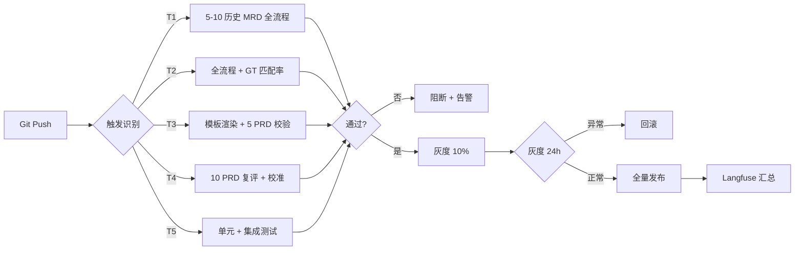

# 7.0 校验总览与 gap 矩阵（v3.1）

> **本文档职责**：v3.1 框架下 7 个 Agent × 5 字段 = 30 单元交叉矩阵 + 跨 Agent 共性 15 条 + 端到端验证 20 项
> **上游引用**（6.x 方法论）：[`../06-课程方法论/6.0-课程方法论总览.md`](../06-课程方法论/6.0-课程方法论总览.md) + 4 篇知识域 + `_索引-课程方法论速查.md`
> **下游引用**（7.x 校验）：本文件 §9 横切·可观测性 / §10 横切·CI/CD / `7.1`~`7.7` / `7.8-实施路线图-分阶段交付.md`
> **v3 架构依据**：`d:\360MoveData\Users\admin\Desktop\AgiP\AGI-obsidian\00-AI实例\应用类\需求分析multi-agent\02-架构沉淀\终态方案\MRD转PRD-Multi-Agent架构设计方案.md`
> **配套文档**：原版备份在 [`_archive_v1/7.0-校验总览与gap矩阵-v1.md`](_archive_v1/7.0-校验总览与gap矩阵-v1.md)

---

## 1. 校验目的

基于课程 L00-L40 方法论，校验 v3 架构（1+5 Agent + 质检）的完善空间，列出每个 Agent 的"待落地清单"（提示词骨架、Skills 内容、Memory 目录、RAG 需求、量化指标）。

**v3.1 核心升级（H2/H7 + v3.1 新增）**：
- 7.x 是"待落地清单"，**不修改** v3 主文档和附录 A
- "完善方案"是增量补充，非推翻 v3
- 结构性 gap 单独标注"建议重构"小节
- **双源更新规则**：v3 不变 + 7.x 实施后增量回写 v3 附录 B
- **强引用**：7.1-7.7 顶部 3 行导航"6.0 → 6.x → 7.0 → 7.0.1/7.0.2"
- **中粒度**：每篇 7.x ≤ 8KB，骨架级不写提示词全文

---

## 2. 30 单元交叉矩阵（7 Agent × 5 字段，v3.1 下界收紧）

### 2.1 矩阵定义

| 字段 | 含义 | v3.0 下界 | **v3.1 下界（收紧）** | 详细规范 |
|------|------|----------|----------------------|---------|
| **A 提示词骨架** | system prompt 5 字段（角色/输入/输出/约束/评估） | — | — | 中粒度，不写全文 |
| **B Skills 清单** | 工具集 + 调用条件 + 输出 | ≥ 3 个 | **≥ 5 个** | 每行 4 列齐全 |
| **C Memory 目录** | 文件树 + 文件作用 + 来源 L 课 | ≥ 3 个文件 | **≥ 5 个文件** | 全部带 L 课来源 |
| **D RAG 需求** | 检索对象 + 索引方式 + 更新频率 + 数据源 | ≥ 2 条 | **≥ 3 条** | 至少含 1 条向量检索 |
| **E 量化指标** | 指标名 + 目标值 + 度量方式 + 课程依据 | ≥ 3 条 | **≥ 5 条** | 至少 3 条带课程 L 课引用 |

**收紧原因**（v3.1）：
- v3.0 下界偏松，实际数据超出 2-3 倍
- 避免"为了凑数"导致的字段堆砌
- 让 7.x §3 完善方案表更具实操性

### 2.2 颜色分级

| 颜色 | 含义 | 行动 |
|------|------|------|
| 🟢 绿 | v3 已有完整框架，仅需中粒度落地 | 7.x 中标注"现状完整" |
| 🟡 黄 | v3 已有框架但缺少 1-2 项关键内容 | 7.x 补 1-2 个完善方案 |
| 🔴 红 | v3 缺失关键方法论依据 | 7.x 必须新增 |

### 2.3 完整矩阵

| Agent \ 字段 | A 提示词 | B Skills | C Memory | D RAG | E 指标 |
|------------|---------|---------|---------|-------|-------|
| **Manager** | 🟡 | 🟡 | 🟡 | 🔴 | 🟡 |
| **① MRD 结构化** | 🟡 | 🟢 | 🟡 | 🟡 | 🟡 |
| **② 产品组** | 🟡 | 🟢 | 🟡 | 🟡 | 🟡 |
| **②'' 流程组** | 🟡 | 🟢 | 🟡 | 🟡 | 🟡 |
| **②''' 数据组** | 🟡 | 🟢 | 🟡 | 🟡 | 🟡 |
| **④ 页面组** | 🟡 | 🟢 | 🟡 | 🟡 | 🟡 |
| **③ 质检** | 🟡 | 🟢 | 🟡 | 🟡 | 🟡 |

**统计**：
- 🟢 绿 11 个（v3 已有完整 Skills 框架）
- 🟡 黄 18 个（v3 框架齐全但需补 1-2 项）
- 🔴 红 1 个（Manager 的 RAG 需求——决策模式库检索尚未系统设计）

---

## 3. v3↔课程映射表（编号化 M01-M19，v3.1 新增）

| 编号 | v3 主文档章节 | 课程 L 课 | 6.x takeaway 编号 | 7.x 引用方 |
|------|------------|---------|------------------|----------|
| **M01** | §2 整体架构（1+5+1） | L23 Orchestrator 范式 | 6.1-4 | 7.1 §1 |
| **M02** | §3.1 Manager 调度 | L23 + L25 + L27 | 6.1-4 / 6.1-6 / 6.3-3 | 7.1 §1 + §2 |
| **M03** | §3.2 ① MRD 结构化（拆解） | L07 + L08 + L25 | 6.1-1 / 6.1-2 / 6.1-5 | 7.2 §1 + §2 |
| **M04** | §3.3 ② 产品组（价值主张） | L07 + L08 + L25 | 6.1-1 / 6.1-2 | 7.3 §1 + §2 |
| **M05** | §3.4 ②'' 流程组（顺序/并发） | L03 + L09 + L25 | 6.1-3 / 6.3-5 | 7.4 §1 + §2 |
| **M06** | §3.5 ②''' 数据组（数据建模） | L07 + L25 + L32 | 6.1-2 / 6.4-3 | 7.5 §1 + §2 |
| **M07** | §3.6 ④ 页面组（视觉可还原） | L07 + L25 + L30 | 6.1-2 / 6.4-1 | 7.6 §1 + §2 |
| **M08** | §3.7 ③ 质检（独立审查） | L23 BP-1 + L36 | 6.1-7 / 6.4-5 | 7.7 §1 + §2 |
| **M09** | §4.1 共享工作区 | L20 文件系统记忆 | 6.2-4 | 7.1-7.7 §6 Memory |
| **M10** | §4.2 邮箱协议 | L26 三态状态机 | 6.3-2 | 7.1-7.7 §A 提示词 |
| **M11** | §4.3 handoff 协议 | L26 接力棒 | 6.3-4 | 7.1-7.7 §A 提示词 |
| **M12** | §5 端到端 9 阶段 | L03 + L26 | 6.1-3 / 6.3-1 | 7.1 §1 + 7.4 §2 |
| **M13** | §6.1 模型选型 | L31 3 级降级 | 6.4-2 | 7.1-7.7 §A 提示词 |
| **M14** | §6.2 3 级降级 | L31 重试/熔断/成本围栏 | 6.4-2 | 7.1-7.7 §E 指标 |
| **M15** | §6.3 可观测性 | L30 Hook + Langfuse | 6.4-1 | 7.0.1 横切 + 7.7 §E |
| **M16** | §7.1 100 分制 | L36 评测 | 6.4-5 | 7.7 §2 + §3 |
| **M17** | §8 人类介入点 | L27 Human as 甲方 | 6.3-3 | 7.1 §A 提示词 + §E 指标 |
| **M18** | §9 关键决策 1/7 | L25 三维隔离 | 6.1-6 | 7.1-7.7 §1 现状 |
| **M19** | §11 飞轮 | L28 + L39 | 6.3-4 / 6.4-8 | 7.7 §2 + 7.1 §E |

**使用规范**：
- 7.x §1 现状抄录末尾**必须**列出本 Agent 涉及的 M 编号
- 7.x §2 gap 分析**必须**回扣 M 编号（说明哪些 M 已覆盖 / 哪些未覆盖）
- 7.x §3 完善方案表"6.x 引用"列**必须**填 takeaway 编号（如 `6.1-4`）

---

## 4. 跨 Agent 共性 15 条（v3.1：原 10 + 横切 5）

### 4.1 共性 1-10（v3.0 保留）

#### 共性 1：RAG 需求（最普遍 gap）
- **问题**：v3 仅 §4.1 定义了 GT 库，但**未细化检索方式**（关键词 vs 向量 vs 图谱）
- **依据**：L21 搜索驱动记忆系统
- **完善方向**：每个 Agent 的"GT 检索 Skill"应包含 3 种索引方式（v3.0 关键词 / v3.1 向量 / v3.2 图谱）
- **优先级**：P1

#### 共性 2：量化指标（最普遍 gap）
- **问题**：v3 §6.1 模型选型表 + §7.1 评分表是"模型级"和"PRD 级"指标，**缺 Agent 级指标**
- **依据**：L36 评测体系 + L38 监控 4 类指标
- **完善方向**：每个 Agent 应有 ≥ 5 条 Agent 级指标（v3.1 收紧）
- **优先级**：P1

#### 共性 3：Harness 范式落地（系统性 gap）
- **问题**：v3 全部 Agent 用"Prompt + Context"范式，**未系统化"Harness 预加载索引"**
- **依据**：L18 Harness Engineering
- **完善方向**：每个 Agent 的"启动索引"（system prompt 必含项）应列出 3-5 个预加载文件
- **优先级**：P1

#### 共性 4：上下文剪裁策略（系统性 gap）
- **问题**：v3 §1.3 硬约束"单 Agent 上下文 < 30K"，**但未给"剪裁规则"**
- **依据**：L19 Bootstrap / Prune / Compress
- **完善方向**：每个 Agent 应明确"剪裁触发条件 + 剪裁规则 + 压缩策略"
- **优先级**：P1

#### 共性 5：自我进化机制（细节 gap）
- **问题**：v3 §11 后续迭代提了"飞轮"，**但未细化"个人进化 L1 + 团队进化 L2"**
- **依据**：L28 自我进化三层
- **完善方向**：每个 Agent 应有"history_*.md" + 写入触发条件
- **优先级**：P1

#### 共性 6：沙箱/权限网关（关键 gap）
- **问题**：v3 §10 风险 2 缓解提了"工具层权限"，**但未列每个 Agent 的工具白名单**
- **依据**：L32 企业安全性
- **完善方向**：每个 Agent 的 §A 提示词应明确"允许写入 / 允许读取 / 禁止"三类
- **优先级**：P0（关键安全）

#### 共性 7：CI 触发器（细节 gap）
- **问题**：v3 §11 阶段 2 提了 CI，**但未列"哪些变更触发什么质检"**
- **依据**：L37 持续集成
- **完善方向**：每个 Agent 应有"CI 触发条件 + 验证项"清单
- **优先级**：P2

#### 共性 8：负反馈循环反制（细节 gap）
- **问题**：v3 §11 后续迭代提了"飞轮"，**但未列"GT 库质量保证机制"**
- **依据**：L39 数据飞轮
- **完善方向**：GT 库应有"质量评分 + 人工抽检 + 自动淘汰"机制
- **优先级**：P1

#### 共性 9：评分校准（细节 gap）
- **问题**：v3 §7.1 100 分制有"5 维度 + 及格线"，**但未给"评分校准流程"**
- **依据**：L36 评分校准
- **完善方向**：③ 质检应明确"每月校准 + 5 历史 PRD 复评"机制
- **优先级**：P1（仅 ③ 涉及）

#### 共性 10：可视化监控（细节 gap）
- **问题**：v3 §6.3 可观测性提了"邮箱日志 + completion.json"，**但缺监控面板**
- **依据**：L38 线上监控
- **完善方向**：v3.1 应建"4 类指标"监控面板（可用性 / 质量 / 效率 / 业务）
- **优先级**：P2

### 4.2 共性 11-15（v3.1 新增：横切关注点）

#### 共性 11：Langfuse 全链路追踪（v3.1 横切）
- **问题**：v3 §6.3 仅"邮箱日志"，**缺 trace_id 标识**
- **依据**：L30 Hook + Langfuse
- **完善方向**：§9 横切规范，7 个 Agent 各自 trace_id 前缀
- **优先级**：P1
- **对应章节**：本文档 §9 横切·可观测性

#### 共性 12：CI/CD 质量门禁（v3.1 横切）
- **问题**：v3 §11 阶段 2 CI 未列"5 类触发条件 + 流水线"
- **依据**：L37 持续集成
- **完善方向**：§10 横切规范，5 类触发（prompt/GT/模板/质量阈值/Skill）
- **优先级**：P1
- **对应章节**：本文档 §10 横切·CI/CD

#### 共性 13：监控 4 类指标汇总（v3.1 横切）
- **问题**：v3 §6.3 监控缺"汇总接口"
- **依据**：L38 监控 4 类指标
- **完善方向**：§9 + §10 联合提供"指标汇总接口"
- **优先级**：P2

#### 共性 14：评分校准机制（v3.1 横切）
- **问题**：v3 §7.1 100 分制缺"校准流程"
- **依据**：L36 评分校准
- **完善方向**：③ 质检每月校准 + 5 历史 PRD 复评（v3.1 显式化）
- **优先级**：P1

#### 共性 15：双源更新规则（v3.1 横切）
- **问题**：7.x 实施后**是否回写 v3**不明确
- **依据**：内部双源维护原则
- **完善方向**：v3 不变 + 7.x → 附录 B（新增）增量回写
- **优先级**：P0（核心规则）

---

## 5. 每个 Agent 校验总览

| 文件 | Agent | 主战场 | 关键 gap | 完善优先级 |
|------|------|--------|---------|----------|
| **[`7.1`](7.1-Manager-主Agent校验.md)** | Manager | 调度 / 验收 / 决策 | RAG 决策模式库 + Harness 索引 + 评分指标 | P0 |
| **[`7.2`](7.2-MRD结构化Agent-①校验.md)** | ① MRD 结构化 | 拆解 MRD | 行业 patterns + 拆解 GT + 工具白名单 | P1 |
| **[`7.3`](7.3-产品组Agent-②校验.md)** | ② 产品组 | 价值主张 + 功能规格 | 价值动作库 + 功能 ID GT + 跨章节一致性 | P1 |
| **[`7.4`](7.4-流程组Agent-②''校验.md)** | ②'' 流程组 | 流程图 + 旅程 | Mermaid 规范 + 异常分支 GT + 状态机 | P1 |
| **[`7.5`](7.5-数据组Agent-②'''校验.md)** | ②''' 数据组 | 数据模型 + ER 图 | ER 规范 + 存储选型 + 安全 checklist | P1 |
| **[`7.6`](7.6-页面组Agent-④校验.md)** | ④ 页面组 | 页面规格 + 交互 | 组件库 + 5 状态 + 权限模式 | P1 |
| **[`7.7`](7.7-质检Agent-③校验.md)** | ③ 质检 | 100 分制 + 3 视角 | 缺陷模式库 + 评分校准 + 视角 checklist | P1 |

---

## 6. 7.x 维护规范

### 6.1 不修改的文件
- v3 主文档（`02-架构沉淀/终态方案/MRD转PRD-Multi-Agent架构设计方案.md`）
- 附录 A（`02-架构沉淀/终态方案/MRD转PRD-推导方法论设计.md`）
- 现有索引文档（`00-总览与导航.md` / `_索引-架构沉淀总览.md` / `05-引用与待办/*`）

### 6.2 双源更新规则（v3.1 新增，详见共性 15）
- v3 主文档 §1-§12 **永远不变**（H2 继承）
- 7.x 实施后，**新增附录 B**（"v3 落地清单"）
- 附录 B 内容 = 7.x 中"已实施"项的简版（不复述 7.x）
- 6.x 不变（L 课不变）
- 7.0.1/7.0.2 实施后，**附录 B 加 §B.3 可观测性 + §B.4 CI/CD 实施记录**（参见本文档 §9/§10）

### 6.3 双源关系图

```
v3 主文档（H2 不变）
├── §1-§12 架构骨架
├── 附录 A（方法论血肉，H6 不变）
└── 附录 B（v3.1 新增 = 7.x 实施回写）
         ↑
         │  实施落地
         │
07-Agent校验/ 7.x 9 篇
├── 7.0 矩阵 v3.1（含 §9 可观测性 + §10 CI/CD 横切）
├── 7.1-7.7 Agent 校验
└── 7.8 实施路线图（含 §8 端到端验证报告）
         ↑
         │  强引用
         │
06-课程方法论/ 6.x 8 篇（不变）
├── 6.0 / 6.1-6.4 知识域
├── _索引速查
├── _研读过程
└── _方法论提炼
```

### 6.4 引用规范
- 7.x 引用 6.x：用相对路径（`../06-课程方法论/6.1-*.md`）
- 7.x 引用 v3：用绝对路径（`d:\360MoveData\Users\admin\Desktop\AgiP\AGI-obsidian\00-AI实例\应用类\需求分析multi-agent\02-架构沉淀\终态方案\...`）
- 7.x 引用课程 L 课：保留课程原标题 + 课号（如 L23《Orchestrator 范式》）

### 6.5 备份规范
- 7.x 重做前**必须**将原版备份到 [`_archive_v1/`](_archive_v1/) 目录
- 文件名后缀 `-v1.md`
- 不可覆盖原版

---

## 7. 实施优先级

| 阶段 | 文档 | 落地目标 |
|------|------|---------|
| **v3.0 MVP** | 7.0-7.7 v1 | 中粒度校验文档完成（已 ✅） |
| **v3.1** | 7.x v3.1 重做 | 7.0 v3.1 + 7.0.1/7.0.2 + 7.1-7.7 重做 + 7.8 |
| **v3.1.1** | 7.x → 实施 | 提取 P0 完善项到 Manager SOP / 子 Agent Skills |
| **v3.1.2** | 7.x → 实施 | 提取 P1 完善项到 Memory + RAG + 量化指标 |
| **v3.1.3** | 7.x → 实施 | 提取 P2 完善项到 CI + 监控面板 |
| **v3.2** | 附录 B | 7.x 实施落地后增量回写 v3 附录 B |

---

## 8. 端到端验证清单（v3.1：12 → 20 项）

### 8.1 文件齐全（3 项）
- [ ] **8.1.1** 6.x 8 篇齐全（6.0/6.1-6.4/_索引/_研读过程/_方法论提炼）
- [ ] **8.1.2** 7.x 9 篇齐全（7.0 v3.1 含 §9/§10 横切 + 7.1-7.7 + 7.8 含 §8 验证报告）
- [ ] **8.1.3** `_archive_v1/` 8 篇备份齐全（原 7.0-7.7 v1）

### 8.2 6.x 完整性（2 项）
- [ ] **8.2.1** 6.x 6 篇（6.0/6.1-6.4/_索引）底部含 §8 研读过程索引
- [ ] **8.2.2** 6.0 §1.3 任务 1 执行路径含 4 子任务表（T1.1-T1.4）

### 8.3 7.0 v3.1 完整性（3 项）
- [ ] **8.3.1** §2 矩阵下界已收紧（B ≥ 5 / C ≥ 5 / D ≥ 3 / E ≥ 5）
- [ ] **8.3.2** §3 M01-M19 编号表 19 行齐全
- [ ] **8.3.3** §4 共性 15 条（原 10 + 横切 5）

### 8.4 7.0 §9 + §10 横切完整性（2 项）
- [ ] **8.4.1** §9 trace_id 前缀表 7 个 Agent 齐全
- [ ] **8.4.2** §10 5 类触发条件 + 流水线图（Mermaid 无语法错误）

### 8.5 7.1-7.7 重做完整性（每篇 5 项，7 篇共 5 项汇总）
- [ ] **8.5.1** 7 篇 ≤ 8KB / 篇
- [ ] **8.5.2** 每篇 §0 3 行导航齐全
- [ ] **8.5.3** 每篇 §1 抄录 4 层框架完整 + M 编号
- [ ] **8.5.4** 每篇 §2 gap ≥ 4 条 + 每条引用 L 课
- [ ] **8.5.5** 每篇 §3 完善方案表 ≥ 4 行 + 6.x takeaway 编号
- [ ] **8.5.6** 每篇 §4 提示词骨架 5 字段齐全
- [ ] **8.5.7** 每篇 §5 自检清单 ≥ 5 项
- [ ] **8.5.8** 每篇 §6 回扣 6.x + 7.0（含 §9/§10 横切）

### 8.6 7.8 路线图完整性（2 项）
- [ ] **8.6.1** 4 阶段 + 依赖图（Mermaid）齐全
- [ ] **8.6.2** 双源更新规则 5 条

### 8.7 引用一致性（1 项）
- [ ] **8.7.1** 6.x ↔ 7.x 引用双向一致（7.1-7.7 §1 引用的 M 编号都在 7.0 §3 存在；7.1-7.7 §2 引用的 6.x takeaway 编号都在 6.x 存在）

### 8.8 残留检查（1 项）
- [ ] **8.8.1** 工作目录无 .tmp/.bak/.draft 残留

### 8.9 Obsidian 渲染（1 项）
- [ ] **8.9.1** 关键 5 文件 Obsidian 渲染正常（6.0 / 6.1 / 7.0 v3.1 / 7.1 / 7.8）

---

## 9. 横切·可观测性·Langfuse 集成（原 7.0.1 合并）

> **课程依据**：L30《可观测性：Hook 骨架 + Langfuse 全链路追踪》+ L36 评分校准
> **v3 架构依据**：v3 §6.3 可观测性
> **合并自**：`_archive_v1/7.0.1-横切-可观测性-v1.md`（完整版备份）

### 9.1 问题与目标

v3 §6.3 仅"邮箱日志 + completion.json"，存在 3 个问题：无 trace 关联 / 无评分回写 / 无监控面板。

v3.1 目标：7 个 Agent 的 LLM 调用统一接入 Langfuse，实现"端到端 trace + 评分回写 + 监控面板"。

### 9.2 trace_id 标识规范

**全局格式**：`{prefix}-{session_id}-{agent_name}-{step_index}`（示例：`mgr-2026-06-26-001-mrd-2`）

| Agent | 前缀 | 角色 | L 课 |
|-------|------|------|------|
| Manager | `mgr-` | 主调度 | L23+L25+L27 |
| ① MRD 结构化 | `mrd-` | 拆解 MRD | L07+L08+L25 |
| ② 产品组 | `prd-` | 价值主张 | L07+L08+L25 |
| ②'' 流程组 | `flow-` | 流程图 | L03+L09+L25 |
| ②''' 数据组 | `data-` | 数据模型 | L07+L25+L32 |
| ④ 页面组 | `page-` | 页面规格 | L07+L25+L30 |
| ③ 质检 | `qa-` | 100 分制 | L23 BP-1+L36 |

**实施要求**：每个 Agent 的 system prompt 启动索引必须含 `trace_id`；子 Agent 启动时必须注入 `trace_id` 参数；Manager 派任务时必须传 `session_id`。

### 9.3 评分回调（5 维度映射）

| 维度 | 满分 | Langfuse score_name | 度量方式 |
|------|------|---------------------|---------|
| 完整性 | 20 | `qa_completeness` | 必填字段覆盖率 |
| 一致性 | 20 | `qa_consistency` | 跨章节 + 与 MRD 一致 |
| 可执行性 | 20 | `qa_executability` | 开发/测试/运营可读 |
| 风险标注 | 20 | `qa_risk_marking` | [TBD] / 风险点覆盖 |
| 风格统一 | 20 | `qa_style_consistency` | 模板遵从度 |
| **总分** | 100 | `qa_total` | 5 维度之和 |

**Langfuse score API 伪代码**：

```python
langfuse.score(
    trace_id="prd-2026-06-26-001-prd-3",
    name="qa_total",
    value=85,
    comment={"completeness": 18, "consistency": 17, ...}
)
```

### 9.4 实施步骤（4 步）

| 步骤 | 内容 | 周期 |
|------|------|------|
| 1 注册配置 | Langfuse Cloud 账号 + 7 个 Agent 密钥 | 1 周 |
| 2 trace_id 注入 | Manager 生成 session_id + 子 Agent 启动 hook | 1 周 |
| 3 灰度接入 | 先 ① MRD → 扩 ②/②''/②'''/④ → 最后 Manager+③ | 2 周 |
| 4 监控面板 | Langfuse 自带面板 + 可选 Grafana 4 类指标 | 1 周 |

### 9.5 7.1-7.7 必含内容

每个 Agent 校验文档的 §4 提示词骨架必含"可观测性配置"段落：
- trace_id 前缀（参见本节 §9.2）
- 评分回调（仅 ③ 质检，参见 §9.3）
- 监控指标 ≥ 3 条

---

## 10. 横切·CI/CD·质量门禁（原 7.0.2 合并）

> **课程依据**：L37《持续集成：让 AI 应用稳定演进》+ L38 监控 4 类指标
> **v3 架构依据**：v3 §11 阶段 2
> **合并自**：`_archive_v1/7.0.2-横切-CI-CD-v1.md`（完整版备份）

### 10.1 问题与目标

v3 §11 阶段 2 提到 CI 但未列"哪些变更触发什么质检"，导致手工质检不稳定 / 无回归基线 / 无灰度策略。

v3.1 目标：建立 5 类触发条件 + 自动化质检流水线 + 灰度策略。

### 10.2 5 类触发条件

| 触发类型 | 场景 | 验证对象 | 阻断规则 |
|---------|------|---------|---------|
| **T1 prompt 变更** | system prompt 修改 | 5-10 历史 MRD 跑全流程 | 一次通过率 < 80% |
| **T2 GT 库变更** | GT 样本增删改 | 全流程 + GT 匹配率 ≥ 60% | 匹配率下降 10% |
| **T3 模板变更** | PRD/流程图/ER/页面模板 | 模板渲染 + 5 历史 PRD | 覆盖率 < 90% |
| **T4 质量阈值** | 5 维度评分阈值调整 | 10 历史 PRD 复评 + 校准 | 波动 > 5 分 |
| **T5 Skill 新增** | 新工具/检索/索引 | 单元 + 集成测试 | 失败率 > 5% |

**优先级**：P0 = T1+T2 / P1 = T3+T4 / P2 = T5

### 10.3 流水线



### 10.4 4 类监控指标

| 类别 | 指标 | 度量 | 告警阈值 |
|------|------|------|---------|
| 可用性 | 一次通过率 | 无需修复的比例 | < 80% |
| 质量 | 5 维度均分 | ③ 质检评分均值 | < 75 分 |
| 效率 | 平均耗时 | 端到端耗时 | > 60 min |
| 业务 | 人工介入率 | 介入次数/总数 | > 20% |

**与 §9 协同**：§9 提供 trace_id + 评分回调（单点采集）→ §10 提供 4 类指标汇总 + 告警（汇总分析）。

### 10.5 实施步骤

| 步骤 | 内容 | 周期 |
|------|------|------|
| 1 CI 工具选型 | GitHub Actions（小团队）/ GitLab CI（企业） | 1 周 |
| 2 Git Hook + 触发 | pre-commit hook + 5 类 job | 1 周 |
| 3 灰度策略 | 10%→30%→50%→100%（每阶段 24h） | 2 周 |
| 4 监控面板 | Grafana + 飞书告警 + Langfuse 双向 | 1 周 |

### 10.6 7.1-7.7 必含内容

每个 Agent 校验文档的 §4 提示词骨架必含"CI 触发器"段落：
- 触发类型（T1-T5 哪类，参见 §10.2）
- 验证对象（本 Agent 受影响内容）
- 阻断规则（本 Agent fail 阈值）

---

**最后更新**：2026-06-26
**当前版本**：v3.1（已合并 7.0.1/7.0.2 横切 + 7.8.1 验证报告）
**对应计划**：[`../../.trae/documents/v3.1-课程方法论与Agent校验完善计划-执行版.md`](../../.trae/documents/v3.1-课程方法论与Agent校验完善计划-执行版.md)
