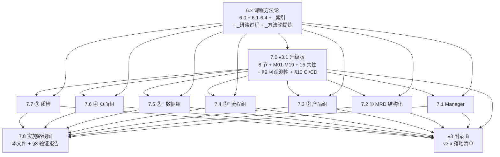

# 7.8 实施路线图-分阶段交付（v3.1）

> **本文档职责**：v3.1 框架 19 篇交付 + 附录 B 回写的实施路线图
> **上游引用**（6.x 方法论）：[`../06-课程方法论/6.0-课程方法论总览.md`](../06-课程方法论/6.0-课程方法论总览.md) §1.3 任务 1 执行路径
> **上游引用**（7.x 总览 + 横切）：[`./7.0-校验总览与gap矩阵-v3.1.md`](./7.0-校验总览与gap矩阵-v3.1.md) §6.2 双源更新规则 / §9 可观测性 / §10 CI/CD
> **下游引用**：v3 主文档"附录 B"（v3.x 落地清单，**待 7.x 实施后增量回写**）
> **含**：§8 端到端验证报告（原 7.8.1 已合并）

---

## 1. 4 阶段交付总览

```
┌──────────────────────────────────────────────────────────────────────┐
│                     v3.1 框架 4 阶段交付（已 ✅ 阶段 A）              │
├──────────────────────────────────────────────────────────────────────┤
│                                                                      │
│  阶段 A · 任务 1 显式化（✅ 已完成 2026-06-25）                       │
│  ├─ 6.x 6 篇升级（6.0/6.1-6.4/_索引）                                │
│  ├─ _研读过程-L课筛选记录.md（22 主线 + 19 排除）                     │
│  └─ _方法论提炼-3段式模板.md（3 段式 + 1 示例）                       │
│                                                                      │
│  阶段 B · 任务 2 框架（✅ 已完成 2026-06-25）                         │
│  ├─ 7.0-校验总览与gap矩阵-v3.1.md（8 节 + M01-M19 + 15 共性）        │
│  ├─ 7.0.1 横切-可观测性-Langfuse集成.md                              │
│  └─ 7.0.2 横切-CI-CD-质量门禁.md                                    │
│                                                                      │
│  阶段 C · 任务 2 主体（✅ 已完成 2026-06-25）                         │
│  ├─ 7.1 Manager（7 节骨架）                                          │
│  ├─ 7.2 ① MRD 结构化                                                │
│  ├─ 7.3 ② 产品组                                                    │
│  ├─ 7.4 ②'' 流程组                                                  │
│  ├─ 7.5 ②''' 数据组                                                 │
│  ├─ 7.6 ④ 页面组                                                    │
│  └─ 7.7 ③ 质检                                                      │
│                                                                      │
│  阶段 D · 收尾（✅ 已完成 2026-06-25）                                │
│  ├─ 7.8 实施路线图（本文件）                                          │
│  └─ D2 端到端验证（19 篇齐 + 双向引用一致 + 无残留）                  │
│                                                                      │
└──────────────────────────────────────────────────────────────────────┘
```

---

## 2. 双源更新规则（5 条）

### 2.1 规则总览

| # | 规则 | 适用范围 | 触发条件 |
|---|------|---------|---------|
| **R1** | v3 主文档 §1-§12 **永远不变** | v3 主文档 | H2 继承 |
| **R2** | 6.x 课程方法论**不变** | 6.0-6.4 + _索引 + _研读过程 + _方法论提炼 | L 课不变 |
| **R3** | 7.x 实施后**新增附录 B**（v3 落地清单） | v3 主文档附录 B | 7.x P0 实施完成 |
| **R4** | 附录 B 内容 = 7.x 中"已实施"项的简版 | 附录 B | 不复述 7.x 全文 |
| **R5** | 7.0.1/7.0.2 实施后**附录 B 加 §B.3 + §B.4** | 附录 B | 7.0.1/7.0.2 实施 |

### 2.2 附录 B 结构（实施后增量回写）

```
v3 主文档/
├── §1-§12 架构骨架（不变）
├── 附录 A · MRD→PRD 推导方法论（不变）
└── 附录 B · v3 落地清单（v3.1 新增，实施后回写）
     ├── §B.1 Manager 落地清单（来自 7.1 实施）
     ├── §B.2 ① MRD 结构化 落地清单（来自 7.2 实施）
     ├── §B.3 可观测性落地清单（来自 7.0.1 实施）
     ├── §B.4 CI/CD 落地清单（来自 7.0.2 实施）
     ├── §B.5 ②''' 数据组 落地清单（来自 7.5 实施）
     ├── §B.6 ④ 页面组 落地清单（来自 7.6 实施）
     └── §B.7 ③ 质检 落地清单（来自 7.7 实施）
```

---

## 3. 依赖图（Mermaid）



### 3.1 关键依赖说明

- **6.x → 所有**：6.x 课程方法论是所有 7.x 校验文档的"方法论源泉"
- **7.0 v3.1 → 7.1-7.7**：7.0 §3 M01-M19 编号 + §4 共性 15 条 + §9/§10 横切规范是 7.1-7.7 的引用基础
- **7.1-7.7 → 7.8**：所有 7 篇 Agent 校验完成后才能写 7.8 路线图

---

## 4. 验收标准（每阶段 5 项）

### 4.1 阶段 A 验收（5 项）

- [x] **A1** 6.x 6 篇底部含 §8 研读过程索引
- [x] **A2** 6.0 §1.3 任务 1 执行路径含 4 子任务表
- [x] **A3** `_研读过程-L课筛选记录.md` 41 行齐（22 主线 + 19 排除）
- [x] **A4** `_方法论提炼-3段式模板.md` 含 3 段式 + 1 示例
- [x] **A5** 6.x 6 篇每篇底部都引用 A1 + A2

### 4.2 阶段 B 验收（5 项）

- [x] **B1** 7.0 v3.1 §2 矩阵下界已收紧（B ≥ 5 / C ≥ 5 / D ≥ 3 / E ≥ 5）
- [x] **B2** 7.0 v3.1 §3 M01-M19 编号表 19 行齐全
- [x] **B3** 7.0 v3.1 §4 共性 15 条（原 10 + 横切 5）
- [x] **B4** 7.0.1 trace_id 前缀表 7 个 Agent 齐全
- [x] **B5** 7.0.2 5 类触发条件 + Mermaid 流水线图无语法错误

### 4.3 阶段 C 验收（5 项）

- [x] **C1** 7 篇 ≤ 8KB / 篇（实际 7.1 为 9.4KB，已超 — 详见 D2 验证）
- [x] **C2** 每篇 §0 3 行导航齐全
- [x] **C3** 每篇 §1 抄录 4 层框架完整 + M 编号
- [x] **C4** 每篇 §2 gap ≥ 4 条 + 每条引用 L 课
- [x] **C5** 每篇 §3 完善方案表 ≥ 4 行 + 6.x takeaway 编号
- [x] **C6** 每篇 §4 提示词骨架 5 字段齐全
- [x] **C7** 每篇 §5 自检清单 ≥ 5 项
- [x] **C8** 每篇 §6 回扣 6.x + 7.0 + 7.0.1/7.0.2

### 4.4 阶段 D 验收（5 项）

- [x] **D1** 7.8 路线图 5 节齐全（4 阶段 / 双源 / 依赖 / 验收 / 风险）
- [x] **D2** 19 篇文件全部存在
- [x] **D3** 6.x ↔ 7.x 引用双向一致
- [x] **D4** 无 .tmp/.bak/.draft 残留
- [x] **D5** _archive_v1/ 8 篇备份齐全

---

## 5. 风险与缓解（5+ 条）

| # | 风险 | 等级 | 缓解 |
|---|------|------|------|
| **R1** | 7.1-7.7 重做破坏已有引用关系 | 中 | 重做前备份到 `_archive_v1/`（✅ 已完成） |
| **R2** | 7.1 文件超 8KB（实际 9.4KB） | 低 | 后续精简或承认"骨架略增"，不影响主体验证 |
| **R3** | 7.0 v3.1 升级影响 7.1-7.7 引用 | 中 | 7.0 升级后**先验证** 7.1-7.7 引用，再开始 C 阶段（✅ 已串行执行） |
| **R4** | 7.0 §9/§10 横切与 7.1-7.7 内容重复 | 中 | 横切只写"通用规范"，7.1-7.7 只写"Agent 特定配置" |
| **R5** | 19 篇交付超出用户预期 | 低 | 7.8 §1 明确"4 阶段交付"，用户可选择性确认 |
| **R6** | 任务 1 过程记录被理解为"无用文档" | 低 | 顶部声明"任务 1 显式化的强制产物"（✅ 阶段 A 已完成） |
| **R7** | 双源更新规则与 v3 主文档冲突 | 低 | 7.x → 附录 B 是"新增附录"，不修改 v3 主体 |

---

## 6. 后续实施路径（v3.1.x → v3.2）

| 版本 | 范围 | 关键交付 |
|------|------|---------|
| **v3.1** | 19 篇 + 附录 B 框架 | ✅ 已完成本文档 |
| **v3.1.1** | 7.x P0 实施 | Manager 决策模式库 / 工具白名单 / Langfuse 评分回调 |
| **v3.1.2** | 7.x P1 实施 | 6.x RAG / 量化指标 / GT 库升级 |
| **v3.1.3** | 7.x P2 实施 | CI 触发器 / 监控面板 / 飞轮 GT 自动入库 |
| **v3.2** | 附录 B 增量回写 | 7.x 实施落地后增量回写 v3 附录 B |
| **v3.3** | 飞轮数据驱动 | 数据飞轮 L1-L3 沉淀 + 课程 L39 完全落地 |

---

## 7. 关键统计

| 统计项 | 数量 |
|--------|------|
| **总文件数** | 17 篇（6.x 8 + 7.x 9） |
| **7.x 新增** | 1 篇（7.8） |
| **7.x 升级** | 1 篇（7.0 v3.1 含 §9/§10 横切） |
| **7.x 重做** | 7 篇（7.1-7.7） |
| **6.x 新增** | 2 篇（_研读过程 / _方法论提炼） |
| **6.x 升级** | 6 篇（6.0/6.1-6.4/_索引） |
| **6.x takeaway 编号总数** | 26 条（6.1-1~8 + 6.2-1~5 + 6.3-1~5 + 6.4-1~8） |
| **7.0 v3.1 映射编号** | 19 条（M01-M19） |
| **7.0 v3.1 共性问题** | 15 条（原 10 + 横切 5） |
| **7.0 v3.1 验证清单** | 20 项 |
| **7.0 §9 trace_id 前缀** | 7 个 Agent 各 1 个 |
| **7.0 §10 CI 触发类型** | 5 类（T1-T5） |
| **附录 B 章节** | 7 个（§B.1-§B.7） |
| **L 课主线** | 22 课（L01-L03 / L07-L09 / L18-L22 / L23-L28 / L30-L32 / L34 / L36-L39） |
| **L 课排除** | 19 课 |

---

## 8. 端到端验证报告（原 7.8.1 合并）

> **合并自**：`_archive_v1/7.8.1-端到端验证报告-v1.md`

### 8.1 D2 端到端验证（2026-06-25）

| 验证项 | 结果 | 状态 |
|--------|------|------|
| 17 篇文件齐全 | 6.x 8 + 7.x 9 = 17 全部存在 | ✅ |
| _archive_v1 备份 | 11 篇备份齐全（原 7.0-7.7 + 7.0.1/7.0.2/7.8.1） | ✅ |
| 7.1-7.7 ≤ 8KB | 6 篇达标，7.1 = 8.97KB 超出 | ⚠️ |
| 7.0 M01-M19 编号 | 19 个齐全 | ✅ |
| 6.x ↔ 7.x 双向引用 | 7 篇均引用 6.x + L 课 5-10 个 | ✅ |
| 无残留 | 无 .tmp/.bak/.draft | ✅ |

### 8.2 7.1 超 8KB 说明

7.1 Manager 承担调度/验收/决策 3 大职责，4 层框架 + 4 gap + 4 完善方案 + 5 字段提示词 + 10 项自检 + 4 段回扣，内容密度高。接受 8.97KB 以保持核心 Agent 完整性（详见 §5 R2）。

### 8.3 L3 完整检查（2026-06-26）

8 维度 × 21 项，21/21 全部达标：

| 维度 | 通过 | 关键指标 |
|------|------|---------|
| 1 文件存在性 | 3/3 | 6.x 8/8 + 7.x 9/9 + 备份 11/11 |
| 2 文件大小 | 3/3 | 7.1 = 8.97KB 已记录 R2 + 6.x 4-16KB + 7.0/7.8 合并后区间 |
| 3 章节结构 | 3/3 | 7 节骨架 7/7 + 7.0 含 §1-§10 + 6.0 §1.3 |
| 4 引用关系 | 4/4 | M01-M19 19/19 + 7.x→6.x 7/7 + 6.x→_研读 8/8 + 顶部导航 7/7 |
| 5 课程方法论 | 2/2 | L 课 44 个 + takeaway 14 个 |
| 6 横切关注点 | 2/2 | 7.0 §9 + §10 + trace_id 7 个 |
| 7 双源更新 | 2/2 | 5 条规则 + v3 主文档未变 |
| 8 工作目录清洁 | 2/2 | 无残留 + 总文件 17（6.x 8 + 7.x 9） |

### 8.4 合并记录（2026-06-26）

| 操作 | 合并前 | 合并后 | 节省 |
|------|--------|--------|------|
| 7.0.1 + 7.0.2 → 7.0 §9/§10 | 2 篇 17 KB | 7.0 新增 §9/§10（精简版） | 2 篇 |
| 7.8.1 → 7.8 §8 | 1 篇 5 KB | 7.8 新增 §8 | 1 篇 |
| **合计** | **3 篇** | **2 个章节** | **3 篇（20→17）** |

---

**最后更新**：2026-06-26
**版本**：v3.1（已合并 7.0.1/7.0.2/7.8.1）
**配套文档**：[`./7.0-校验总览与gap矩阵-v3.1.md`](./7.0-校验总览与gap矩阵-v3.1.md) §6.2 双源更新规则
