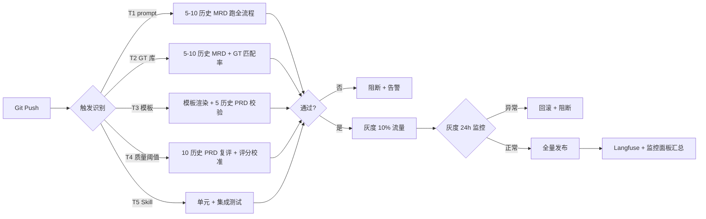

# 7.0.2 横切规范 · CI/CD · 质量门禁

> **本文档职责**：v3 架构 7 个 Agent 的 CI/CD 流水线规范（5 类触发 + 自动化质检 + 灰度）
> **上游引用**（6.x 方法论）：[`../06-课程方法论/6.4-可靠性与质量体系.md`](../06-课程方法论/6.4-可靠性与质量体系.md) §6 持续集成（takeaway `6.4-6`）
> **上游引用**（7.x 总览）：[`./7.0-校验总览与gap矩阵-v3.1.md`](./7.0-校验总览与gap矩阵-v3.1.md) §4 共性 12 + §3 M16
> **下游引用**（7.1-7.7）：每个 Agent 校验文档的 §A 提示词骨架"CI 触发器"段落
> **v3 架构依据**：`d:\360MoveData\Users\admin\Desktop\AgiP\AGI-obsidian\00-AI实例\应用类\需求分析multi-agent\02-架构沉淀\终态方案\MRD转PRD-Multi-Agent架构设计方案.md` §11 阶段 2
> **课程 L 课**：L37《持续集成：让 AI 应用稳定演进》

---

## 1. 为什么需要 CI/CD 质量门禁

v3 §11 阶段 2 提到 CI，但**未列"哪些变更触发什么质检"**，导致 3 个问题：

1. **手工质检不稳定**：每次 prompt / GT 变更需手工跑 ③ 质检，遗漏率高
2. **无回归基线**：修改 Manager 决策后，5 子 Agent 产物可能回退
3. **无灰度策略**：新 prompt 直接全量上，失败影响所有 MRD→PRD 任务

**课程 L37 解决路径**：
> "CI for AI = prompt/GT/模板变更触发自动质检。流水线：变更 → 自动化质检 → 灰度 → 全量。"

**v3.1 目标**：建立 5 类触发条件 + 自动化质检流水线 + 灰度策略，确保任何变更都有"质量门禁"。

---

## 2. 5 类触发条件

| 触发类型 | 触发场景 | 验证对象 | 阻断规则 |
|---------|---------|---------|---------|
| **T1 prompt 变更** | Manager 或子 Agent 的 system prompt 修改 | 5-10 个历史 MRD 跑全流程 | 一次通过率 < 80% 阻断 |
| **T2 GT 库变更** | 新增 / 修改 / 删除 GT 样本 | 5-10 个历史 MRD 跑全流程 + GT 匹配率 ≥ 60% | GT 匹配率下降 10% 阻断 |
| **T3 模板变更** | PRD / 流程图 / ER 图 / 页面模板修改 | 模板渲染 + 5 历史 PRD 校验 | 模板覆盖率 < 90% 阻断 |
| **T4 质量阈值突破** | ③ 质检的 5 维度评分阈值调整 | 10 个历史 PRD 复评 + 评分校准 | 评分波动 > 5 分阻断 |
| **T5 Skill 新增** | 新工具 / 新 GT 检索方式 / 新 RAG 索引 | 单元测试 + 集成测试 | 失败率 > 5% 阻断 |

### 2.1 触发源识别（v3.1）

- **T1 prompt 变更**：`07-Agent校验/` 下任何 `*.md` 文件修改 → Git diff 识别
- **T2 GT 库变更**：`02-架构沉淀/终态方案/GT库/` 下任何文件修改
- **T3 模板变更**：`02-架构沉淀/终态方案/模板/` 下任何文件修改
- **T4 质量阈值突破**：`03-质检配置/score_threshold.yaml` 修改
- **T5 Skill 新增**：`04-Skills/` 下任何新文件

### 2.2 触发优先级

| 优先级 | 触发 | 原因 |
|--------|------|------|
| P0 | T1 prompt + T2 GT 库 | 直接影响 Agent 决策 |
| P1 | T3 模板 + T4 质量阈值 | 影响产物格式与评分 |
| P2 | T5 Skill 新增 | 影响最小，可后置 |

---

## 3. 流水线（变更 → 自动化质检 → 灰度）

### 3.1 Mermaid 流程图



### 3.2 流水线的 4 个阶段

| 阶段 | 时长 | 输出 | 阻断规则 |
|------|------|------|---------|
| **阶段 1 触发识别** | < 1 min | 触发类型 + 范围 | 触发类型未知 → 阻断 |
| **阶段 2 自动化质检** | 5-30 min | 验证报告（pass/fail） | 失败率 > 5% 阻断 |
| **阶段 3 灰度发布** | 24h | 10% 流量监控数据 | 异常率 > 2% 阻断 |
| **阶段 4 全量发布** | < 5 min | 100% 流量 + Langfuse score | 评分下降 > 5 分阻断 |

---

## 4. 监控汇总接口

### 4.1 4 类指标（基于 L38 + v3 §6.3）

| 指标类别 | 指标名 | 度量方式 | 告警阈值 |
|---------|--------|---------|---------|
| **可用性** | 一次通过率 | 一次跑完全流程无需修复的比例 | < 80% 告警 |
| **质量** | 5 维度均分 | ③ 质检 5 维度评分均值 | < 75 分告警 |
| **效率** | 平均耗时 | 单次 MRD→PRD 端到端耗时 | > 60 min 告警 |
| **业务** | 人工介入率 | 需要 Human 介入的次数 / 总任务数 | > 20% 告警 |

### 4.2 监控数据流

```
Langfuse score API  ←  ③ 质检 5 维度评分
        ↓
   Langfuse 监控面板  +  自建 Grafana 面板（4 类指标）
        ↓
   告警规则触发（飞书 / 邮件 / Slack）
        ↓
   Manager 自动派修复任务 / Human 介入
```

### 4.3 与 7.0.1 的协同

- **7.0.1 提供**：trace_id + 评分回调（单点数据采集）
- **7.0.2 提供**：4 类指标汇总 + 告警规则（汇总分析）
- **协同点**：③ 质检的 score API 回调 → Langfuse → 7.0.2 监控面板

---

## 5. v3.1 实施步骤

### 5.1 第 1 步：CI 工具选型（1 周）

| 候选工具 | 优势 | 劣势 | 推荐度 |
|---------|------|------|--------|
| **GitHub Actions** | 与代码仓库无缝集成 / 免费额度充足 | 自托管 runner 需配置 | ⭐⭐⭐⭐⭐ |
| **GitLab CI** | 自带 runner / 私有化部署友好 | 国内访问慢 | ⭐⭐⭐⭐ |
| **Jenkins** | 插件丰富 / 高度可定制 | 维护成本高 | ⭐⭐⭐ |
| **Drone** | 轻量 / 容器原生 | 社区较小 | ⭐⭐⭐ |

**v3.1 推荐**：GitHub Actions（个人 / 小团队）+ GitLab CI（企业内）

### 5.2 第 2 步：Git Hook + 触发识别（1 周）
- 配置 pre-commit hook：检测修改文件属于哪类触发
- 配置 GitHub Actions workflow：5 类触发对应 5 个 job
- 每个 job 调用 v3 自动化质检脚本

### 5.3 第 3 步：灰度策略（2 周）
- 灰度比例：10% → 30% → 50% → 100%（每阶段 24h 监控）
- 灰度流量选择：按 session_id 哈希后取模
- 回滚策略：异常时一键回滚到上一版本（Git revert + Langfuse 配置回退）

### 5.4 第 4 步：监控面板（1 周）
- 4 类指标 → Grafana 面板
- 告警规则 → 飞书机器人 / 邮件
- 与 Langfuse 双向打通

---

## 6. 与 7.1-7.7 的关系

### 6.1 7.1-7.7 必含内容（每个 Agent 校验文档）

每个 Agent 校验文档的 **§A 提示词骨架** 必含"CI 触发器"段落：

```markdown
### §A.x CI 触发器
- **触发类型**：（T1-T5 哪一类）参见 [`7.0.2`](../07-Agent校验/7.0.2-横切-CI-CD-质量门禁.md) §2
- **验证对象**：（本 Agent 受影响的具体内容）参见 §3.2
- **阻断规则**：（本 Agent 的 fail 阈值）参见 §2
```

### 6.2 引用规范

- 7.1-7.7 引用 7.0.2：用相对路径（`./7.0.2-横切-CI-CD-质量门禁.md`）
- 7.1-7.7 引用课程 L37：保留课号 + 标题
- 7.0.2 引用 v3 §11：用绝对路径

---

## 7. 验收清单

- [ ] **7.1** 5 类触发条件表齐全（§2）
- [ ] **7.2** 触发源识别清单（P0/P1/P2）齐全（§2.1-2.2）
- [ ] **7.3** Mermaid 流水线图无语法错误（§3.1）
- [ ] **7.4** 流水线 4 阶段时长 + 阻断规则齐全（§3.2）
- [ ] **7.5** 4 类监控指标 + 告警阈值齐全（§4.1）
- [ ] **7.6** 监控数据流图清晰（§4.2）
- [ ] **7.7** 与 7.0.1 协同点说明（§4.3）
- [ ] **7.8** CI 工具选型表 + 推荐（§5.1）
- [ ] **7.9** 实施步骤 4 步清晰（§5.1-5.4）
- [ ] **7.10** 与 7.1-7.7 引用关系明确（§6.1）

---

**最后更新**：2026-06-25
**版本**：v3.1
**配套文档**：[`./7.0-校验总览与gap矩阵-v3.1.md`](./7.0-校验总览与gap矩阵-v3.1.md) 共性 12 + M16
