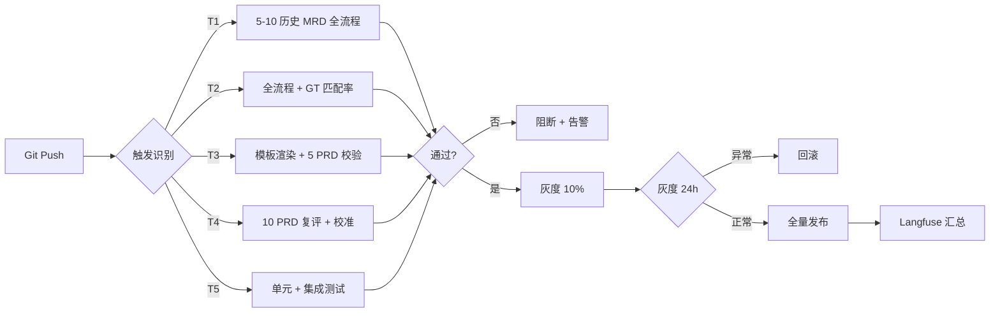

# 3.4 可观测性与质量配置（trace_id / 评分 / CI / 监控）

> **本文档职责**：v3 架构下 7 个 Agent 的全链路追踪 + 质量评分回调 + CI 5 类触发 + 4 类监控指标的横切配置
> **源文档**：[`07-Agent校验/7.0-校验总览与gap矩阵-v3.1.md`](../../07-Agent校验/7.0-校验总览与gap矩阵-v3.1.md) §9 横切·可观测性 + §10 横切·CI/CD + [`02-架构沉淀/终态方案/MRD转PRD-Multi-Agent架构设计方案.md`](../../02-架构沉淀/终态方案/MRD转PRD-Multi-Agent架构设计方案.md) §6.3 可观测性 + §7.1 100 分制
> **配套文档**：[`3.0-Skills总览.md`](3.0-Skills总览.md) / [`3.1-Skills字典.md`](3.1-Skills字典.md) / [`3.3-模型与参数配置.md`](3.3-模型与参数配置.md)
> **版本**：v3.1

---

## 文档说明

可观测性与质量配置是 v3 架构的"横切关注点"——它跨越 7 个 Agent，涉及 LLM 调用追踪、质量评分回写、CI 自动化、监控告警 4 个层面。v3 主文档只定义了"邮箱日志 + completion.json"基础方案（§6.3），7.0 v3.1 通过合并原 7.0.1 / 7.0.2 两个横切文档，补充了 Langfuse 集成、5 类 CI 触发、4 类监控指标的完整实施细节。

文档分 4 个子节：trace_id 标识 / Langfuse 评分回调 / CI 5 类触发 / 4 类监控指标。每个子节都给出"主表 + 字段解读 + 实施步骤"三层结构。

---

## 3.4.1 trace_id 前缀表（7 Agent × 5 字段）

v3 §6.3 仅"邮箱日志"无法支撑端到端追踪。v3.1 引入 Langfuse 集成后，每个 LLM 调用都需要带 trace_id。trace_id 是端到端可观测性的"身份证"——通过它可以在 Langfuse 面板中拉出一次 session 的完整调用链。

### 全局格式

```
{prefix}-{session_id}-{agent_name}-{step_index}
```

**示例**：`mgr-2026-06-26-001-mrd-2` 表示 2026-06-26 启动的 session 001，Manager 的第 2 步（派发 MRD 拆解任务给 ①）。

### 7 个 Agent 的前缀表

| Agent | 前缀 | 角色说明 | L 课 | M 编号 |
|-------|------|---------|------|--------|
| **Manager** | `mgr-` | 主调度 / 验收 / 决策 | L23 + L25 + L27 | M01 / M02 / M17 |
| **① MRD 结构化** | `mrd-` | 拆解 MRD / 抽取需求 | L07 + L08 + L25 | M03 |
| **② 产品组** | `prd-` | 写 PRD1+2 / 价值主张 / 功能规格 | L07 + L08 + L25 | M04 |
| **②'' 流程组** | `flow-` | 写 PRD3 / 流程图 / 异常分支 | L03 + L09 + L25 | M05 |
| **②''' 数据组** | `data-` | 写 PRD4 / 数据模型 / ER 图 | L07 + L25 + L32 | M06 |
| **④ 页面组** | `page-` | 写 PRD5 / 页面规格 / 组件库 | L07 + L25 + L30 | M07 |
| **③ 质检** | `qa-` | 多视角审查 / 100 分制评分 | L23 BP-1 + L36 | M08 / M16 |

### 字段说明

- **prefix**（前缀）：Agent 类型标识，2-4 字符小写英文。设计原则是"看一眼就知道来自哪个 Agent"。
- **session_id**（会话 ID）：YYYY-MM-DD-NNN 格式（日期 + 当天启动顺序）。session 是端到端一次完整 MRD → PRD 流程的最小单位。
- **agent_name**（Agent 名称）：可选字段，子 Agent 复用 Manager 的 session 时记录子 Agent 名（如 `mgr-...-mrd-2` 中 `mrd`）。
- **step_index**（步骤序号）：Agent 内部的步骤编号（从 0 开始）。Manager 的 step 0-9 对应 9 阶段 SOP，子 Agent 的 step 通常是 0（启动）+ 1-N（迭代修订）。
- **L 课 + M 编号**：trace_id 规范引用的课程依据与 v3.1 映射编号。Langfuse 面板支持按 L 课 / M 编号过滤。

### 实施要求

依据 7.0 §9.2 末段，trace_id 的实施有 3 条硬性要求：

1. **每个 Agent 的 system prompt 启动索引必含 `trace_id` 字段**——Manager 派任务时把 trace_id 注入子 Agent 的启动 prompt。
2. **子 Agent 启动时必注入 `trace_id` 参数**——子 Agent 启动时从启动 prompt 读取 trace_id，作为本次任务的所有 LLM 调用的公共前缀。
3. **Manager 派任务时必传 `session_id`**——session_id 由 Manager 在阶段 0 初始化时生成，9 阶段 SOP 全程复用。

### 7.1-7.7 §4 必含内容

每个 Agent 校验文档的 §4 提示词骨架"输入契约"段落必须包含 trace_id 字段（参见 7.1 §4.3 / 7.2 §4.2 等）。本字段作为 v3.1 横切规范的强制落地项。

---

## 3.4.2 Langfuse 评分回调（5 维度 × 6 字段）

v3.1 引入 Langfuse score API 回调，让 ③ 质检的 5 维度评分与 Langfuse 追踪系统打通。Langfuse 面板可以按维度过滤历史评分，识别"哪个维度最常出现低分"，辅助团队优化 GT 库 / 模板 / 决策模式。

### 5 维度评分映射

下表是 ③ 质检 5 维度评分到 Langfuse score 的映射。v3.1 校验时根据 7.0 §9.3 的原始定义微调：v3 §7.1 表格中"可执行性 30 分 / 风险 15 分 / 风格 15 分"，v3.1 评分回调沿用 7.0 §9.3 的"4 个 20 + 1 个 20"等分方案（v3.1 校准版）。两版并存，由 Manager 在 7.x 实施时统一选定。

| 维度 | 满分 | score_name | 度量方式 | Langfuse 调用 | 权重 |
|------|------|------------|---------|--------------|------|
| **完整性** | 20 | `qa_completeness` | 必填字段覆盖率（缺失章节/子模块数 / 应有总数） | `langfuse.score(trace_id, name, value, comment)` | 0.20 |
| **一致性** | 20 | `qa_consistency` | 跨章节引用 + 术语 + 流程闭环 + 数值 + ID 一致（不一致点 / 检查点总数）| 同上 | 0.20 |
| **可执行性** | 30 | `qa_executability` | 开发/测试/运营可读（每条功能可写测试用例 + 验收 SMART + 异常分支覆盖）| 同上 | 0.30 |
| **风险标注** | 15 | `qa_risk_marking` | [TBD] / 风险点覆盖（模糊词 / 缺失依赖 / 范围蔓延信号）| 同上 | 0.15 |
| **风格统一** | 15 | `qa_style_consistency` | 模板遵从度（术语 / 句式 / 排版）| 同上 | 0.15 |
| **总分** | **100** | `qa_total` | 5 维度加权求和 | 同上 | 1.00 |

### 字段说明

- **score_name**：Langfuse 面板中按这个字段过滤/聚合。命名遵循"维度_英文名"格式，便于跨项目统一。
- **度量方式**：③ 质检 `scoring_engine` 计算该维度分数的具体方法。Langfuse 仅接收 value（分数）+ comment（明细），不关心度量逻辑。
- **Langfuse 调用**：每个维度都调用一次 score API，trace_id 关联本次 session 的所有评分。

### Langfuse score API 伪代码

```python
# ③ 质检完成 5 维度评分后，scoring_engine 触发回调
from langfuse import Langfuse
langfuse = Langfuse(public_key="...", secret_key="...")

for dimension, score in qa_scores.items():
    langfuse.score(
        trace_id=trace_id,            # 如 "qa-2026-06-26-001-qa-7"
        name=dimension,               # 如 "qa_completeness"
        value=score,                  # 0-20 / 0-30 / 0-15 之一
        comment={
            "session_id": session_id,
            "agent": "qa",
            "sub_scores": {...},
            "missing_items": [...]
        }
    )

# 单独上报总分
langfuse.score(
    trace_id=trace_id,
    name="qa_total",
    value=sum(qa_scores.values()),
    comment={"breakdown": qa_scores}
)
```

### 实施步骤（4 步 + 5 周）

| 步骤 | 内容 | 周期 | 负责 |
|------|------|------|------|
| 1 注册配置 | Langfuse Cloud 账号 + 7 个 Agent API Key + 权限组 | 1 周 | 平台工程 |
| 2 trace_id 注入 | Manager 生成 session_id + 子 Agent 启动 hook 注入 trace_id | 1 周 | Manager 实现 |
| 3 灰度接入 | 先 ① MRD → 扩 ②/②''/②'''/④ → 最后 Manager + ③ | 2 周 | 全 Agent 接入 |
| 4 监控面板 | Langfuse 自带面板 + 4 类指标汇总面板（Grafana 可选）| 1 周 | 平台工程 + Manager |

灰度顺序的设计动机：① 是单任务（拆解 MRD），复杂度最低，先验证 trace 完整性；②/②''/②'''/④ 是并发任务，验证 trace 在并发场景下的准确性；Manager + ③ 是聚合节点，最后接入避免前期接入的 trace 格式变更影响。

### 失败兜底

Langfuse API 不可用时（5xx / 超时 / 限流）的兜底策略：

- 本地 log 落盘（`workspace/manager/langfuse_local_log.jsonl`）
- Manager 在阶段 8 验收时检查 log，发现连续 3 次回调失败则触发 checkpoint_request
- ③ 质检本身不受影响（本地 qa_report.md 始终是真相之源，Langfuse 只是镜像）

---

## 3.4.3 CI 5 类触发（T1-T5）

v3 §11 阶段 2 提到 CI 但未列"哪些变更触发什么质检"。v3.1 在 7.0 §10 中给出完整的 5 类触发条件。

### 5 类触发主表

| 触发类型 | 场景 | 验证对象 | 阻断规则 | 优先级 | 引用 |
|---------|------|---------|---------|--------|------|
| **T1 prompt 变更** | system prompt 修改 | 5-10 历史 MRD 跑全流程 | 一次通过率 < 80% | P0 | 7.0 §10.2 T1 |
| **T2 GT 库变更** | GT 样本增删改 | 全流程 + GT 匹配率 | 匹配率下降 10% | P0 | 7.0 §10.2 T2 |
| **T3 模板变更** | PRD/流程图/ER/页面模板 | 模板渲染 + 5 历史 PRD | 覆盖率 < 90% | P1 | 7.0 §10.2 T3 |
| **T4 质量阈值** | 5 维度评分阈值调整 | 10 历史 PRD 复评 + 校准 | 波动 > 5 分 | P1 | 7.0 §10.2 T4 |
| **T5 Skill 新增** | 新工具/检索/索引 | 单元 + 集成测试 | 失败率 > 5% | P2 | 7.0 §10.2 T5 |

### 字段说明

- **场景**：触发 CI 流水线的代码变更类型。变更通过 Git pre-commit hook 或 GitHub Actions 监听。
- **验证对象**：CI 流水线要跑的具体测试。例如 T1 触发时跑 5-10 历史 MRD 的全流程，T2 触发时跑全流程 + GT 匹配率检测。
- **阻断规则**：CI 失败的判定阈值。低于阈值则阻断合并 + 告警。
- **优先级**：5 类触发的处理顺序。P0 必须在每次提交时跑（P0 失败率影响所有下游）；P1 每日定时跑 + 提交触发；P2 每周定时跑 + 手动触发。

### CI 流水线图



### 灰度策略

- **10% → 30% → 50% → 100%**：每阶段保持 24h，期间持续监控 4 类指标（见 3.4.4）
- **异常即回滚**：任意阶段 4 类指标突破告警阈值，自动回滚到上一稳定版本
- **全量发布条件**：灰度 100% 维持 24h + 4 类指标全部正常

### 实施步骤（4 步 + 5 周）

| 步骤 | 内容 | 周期 |
|------|------|------|
| 1 CI 工具选型 | GitHub Actions（小团队）/ GitLab CI（企业） | 1 周 |
| 2 Git Hook + 触发 | pre-commit hook + 5 类 job + 阻断规则 | 1 周 |
| 3 灰度策略 | 10%→30%→50%→100%（每阶段 24h）+ 自动回滚 | 2 周 |
| 4 监控面板 | Grafana + 飞书告警 + Langfuse 双向 | 1 周 |

### 7.1-7.7 §4 必含内容

每个 Agent 校验文档的 §4 提示词骨架必含"CI 触发器"段落：
- 触发类型（T1-T5 哪类，参见本节）
- 验证对象（本 Agent 受影响内容）
- 阻断规则（本 Agent fail 阈值）

这是 7.0 §10.6 规定的强制落地项。7.1-7.7 实施时，每个 §4.4 关键约束段落需增加子节"CI 触发器"。

---

## 3.4.4 4 类监控指标

4 类监控指标是 v3.1 横切监控的核心。7.0 §10.4 定义 4 类（可用性 / 质量 / 效率 / 业务），与 7.0 §9 的 trace_id + 评分回调联动——§9 提供单点采集，§10 提供汇总分析。

### 4 类指标主表

| 类别 | 指标 | 度量 | 告警阈值 | 数据源 | 引用 |
|------|------|------|---------|--------|------|
| **可用性** | 一次通过率 | 无需修复的比例 | < 80% | Manager 验收日志 | L38 + 7.0 §10.4 |
| **质量** | 5 维度均分 | ③ 质检 5 维度评分均值 | < 75 分 | Langfuse score 回调 | L36 + L38 |
| **效率** | 平均耗时 | 端到端耗时（阶段 0 → 阶段 9）| > 60 min | Watchdog 时间戳 | L38 + 7.0 §10.4 |
| **业务** | 人工介入率 | 介入次数 / 总 session 数 | > 20% | Human 邮件交互日志 | L27 + 7.0 §10.4 |

### 字段说明

- **类别**：4 大类，分别对应"系统是否可用 / 输出质量如何 / 速度是否达标 / 业务是否可独立完成"。
- **指标**：每类的核心量化指标。监控面板以这 4 个数字为 KPI 概览。
- **度量**：指标的具体计算方式。"一次通过率"= 1 - reject 比例；"5 维度均分"= Langfuse score API 5 维度平均值；"平均耗时"= Watchdog 记录的所有 session 端到端耗时均值；"人工介入率"= Human 邮件交互数 / 总 session 数。
- **告警阈值**：触发飞书 / 钉钉 / 邮件告警的临界值。阈值基于课程 L38 的"渐进告警"原则——一级阈值（关注）+ 二级阈值（告警）+ 三级阈值（熔断）。
- **数据源**：指标的采集位置。4 类指标的采集覆盖 LLM 调用（Langfuse）+ 邮箱协议（Watchdog）+ 业务交互（Human 日志）3 个层面。

### 4 类指标的联动关系

4 类指标不是孤立的——它们之间存在因果链：

- 一次通过率低 → 通常伴随 5 维度均分低（质量差导致 reject 多）
- 一次通过率低 → 可能伴随平均耗时高（重试拉长端到端时间）
- 人工介入率高 → 通常伴随 一次通过率低（系统搞不定才找 Human）

监控面板按因果链聚合展示——当一个指标突破阈值时，自动高亮其上游指标，辅助团队快速定位根因。

### 监控面板架构

```
┌────────────────────────────────────────────────────────┐
│ Langfuse 面板（trace + 评分）                            │
│  - 按 session 拉取完整调用链                                │
│  - 按 trace_id 关联 5 维度评分                              │
└──────────────────┬─────────────────────────────────────┘
                   │ API
                   ▼
┌────────────────────────────────────────────────────────┐
│ 4 类指标汇总（Grafana / 自建面板）                         │
│  - 可用性 / 质量 / 效率 / 业务 各 1 个核心数字              │
│  - 趋势图（7 天 / 30 天 / 90 天）                         │
│  - 告警阈值线                                                │
└──────────────────┬─────────────────────────────────────┘
                   │ Webhook
                   ▼
┌────────────────────────────────────────────────────────┐
│ 告警通道（飞书 / 钉钉 / 邮件）                              │
│  - 一级阈值 → 关注（不通知）                                │
│  - 二级阈值 → 告警（飞书 + 邮件）                          │
│  - 三级阈值 → 熔断（飞书 + 电话 + 触发 L3）                 │
└────────────────────────────────────────────────────────┘
```

### 4 类指标的采集与上报

| 指标 | 采集时机 | 上报频率 | 存储 |
|------|---------|---------|------|
| 一次通过率 | 每次 Manager 验收后 | 实时 | Manager 验收日志 + Langfuse |
| 5 维度均分 | 每次 ③ 质检完成后 | 实时 | Langfuse score API |
| 平均耗时 | 每次 session 归档后 | 每日聚合 | Watchdog + 数据库 |
| 人工介入率 | 每次 Human 邮件交互后 | 每日聚合 | Human 邮件日志 |

实时上报（一次通过率 / 5 维度均分）通过 Langfuse 实时查询；每日聚合（平均耗时 / 人工介入率）通过 Watchdog 定时任务计算并入库。

### 实施步骤（4 步 + 4 周）

| 步骤 | 内容 | 周期 |
|------|------|------|
| 1 指标定义 | 4 类指标 + 阈值 + 采集点写入 SOP | 1 周 |
| 2 面板搭建 | Grafana + Langfuse 双向数据源 | 1 周 |
| 3 告警通道 | 飞书机器人 + 邮件 + 电话三级告警 | 1 周 |
| 4 调优 | 阈值校准（基于 4 周历史数据） | 1 周 |

---

## 附录：v3.1 横切规范的双源更新规则

依据 7.0 §4 共性 15（双源更新规则），可观测性与质量配置的维护遵循：

- v3 主文档 §6.3（可观测性）**永远不变**——保留"邮箱日志 + completion.json"基础方案
- 7.0 §9/§10（横切）**持续完善**——增加 Langfuse 集成 + 5 类 CI + 4 类监控
- 7.1-7.7 §4（Agent 提示词骨架）**必含** trace_id + CI 触发器 + 监控指标 3 个子节
- 落地后增量回写 v3 附录 B（§B.3 可观测性 + §B.4 CI/CD 实施记录）

---

**最后更新**：2026-07-06
**版本**：v3.1
