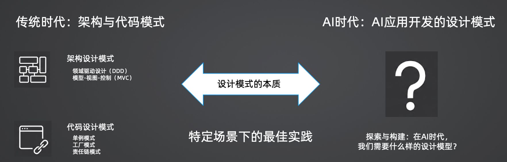
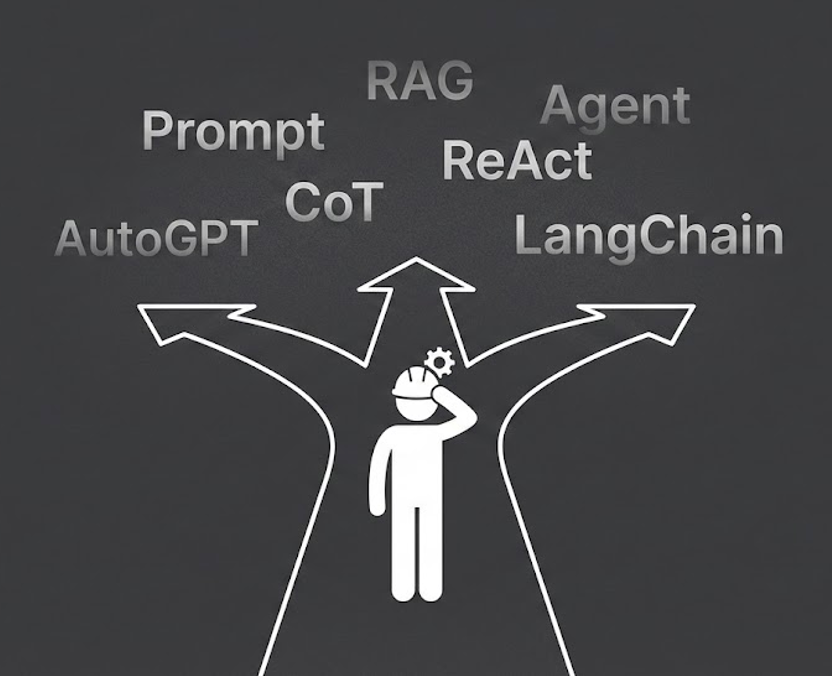
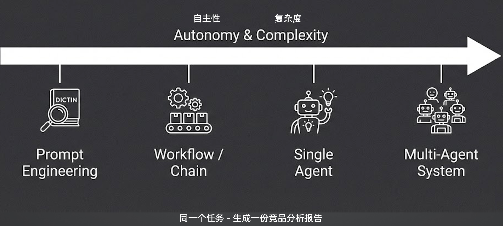
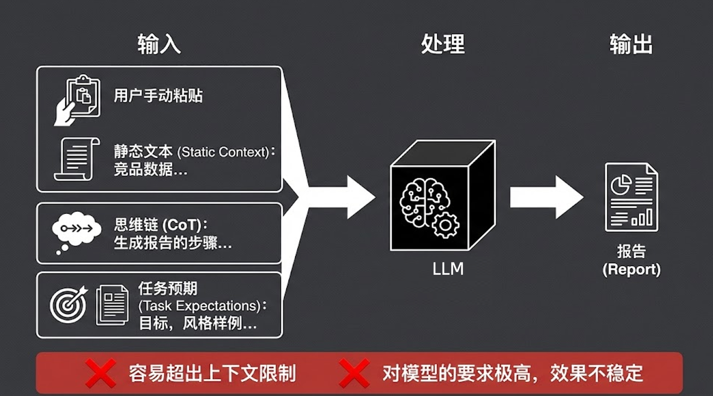
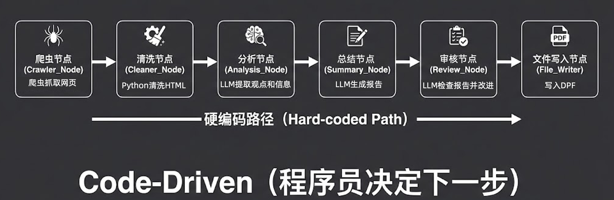
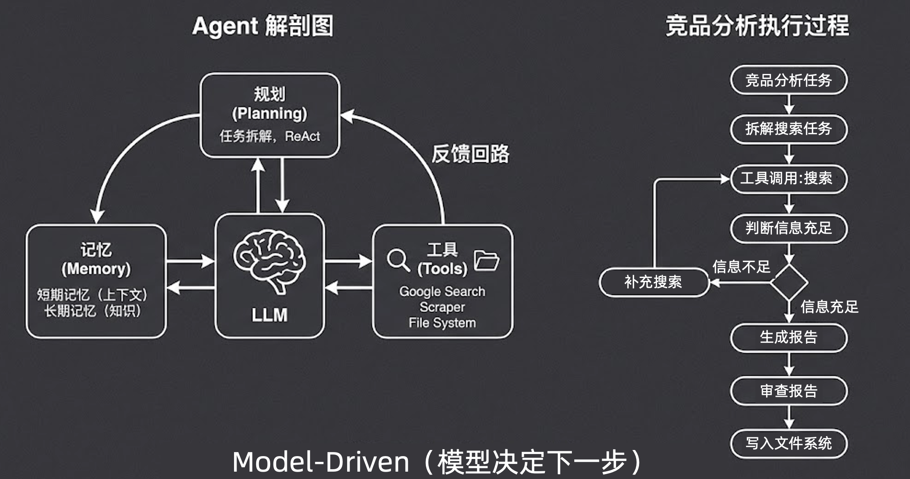
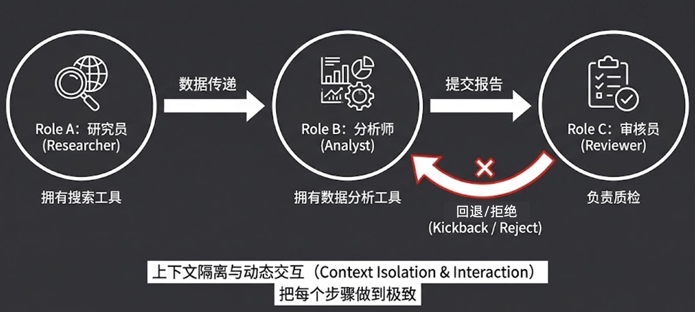
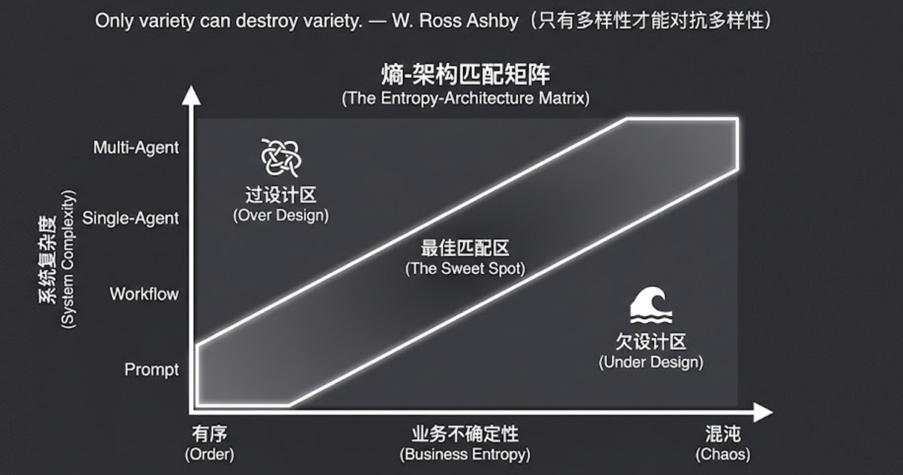

> **原文来源标注**
> - 源文件：`12-学习笔记\13-极客时间-企业级多智能体设计实战\03-原文+图片\L01-拨开迷雾：AI 应用开发的四种架构范式.md`
> - 复制时间：2026-06-23
> - 复制目的：第 1.1 章节核心：AI 应用四种架构范式（Prompt/Workflow/Single-Agent/Multi-Agent）原文
> - 说明：以下为原文完整内容，未做任何修改。

---
# 01｜拨开迷雾：AI 应用开发的四种架构范式

> 来源：极客时间《企业级多智能体设计实战》
> 当前播放：01｜拨开迷雾：AI 应用开发的四种架构范式
> 提取日期：2026-06-02
> 原文长度：3087 字

---

你好，欢迎来到正式的课程学习！

就像我们在开篇词里提到的，这套课程绝不是仅仅教你掌握一个诸如 CrewAI 这样的具体框架，或者只是贴几段代码教你怎么跑通一个场景。我更期望的是，**在动手写代码之前，先帮你建立一套属于 AI 时代的架构思维体系。**

这就是我们第一篇的核心：**AI 时代的设计模式。**

## 什么是设计模式？

在传统软件开发时代，我们对“设计模式”这个词绝不陌生。从架构层面的**领域驱动设计（DDD）**、**模型 - 视图 - 控制（MVC）** ，到代码层面的**单例模式**、**工厂模式**、**责任链模式** ，这些都是前人总结出来的宝贵经验。

简单来说，**设计模式的本质，就是“特定场景下的最佳实践”。**当我们遇到相似的问题时，直接套用这些已被验证的成熟方案，就能事半功倍。

在 AI 应用开发日新月异的今天，我们同样极其需要一套设计模式 。很多开发者拿到一个需求后不知道从何下手，本质上就是因为在架构选型上缺乏沉淀。

## 推倒 AI 时代的“巴别塔”

当前的 AI 圈有一个很大的痛点：**概念满天飞，且极度混乱。**

从早期的 Prompt 工程，到后来的 CoT（思维链）、RAG，再到如今人人都挂在嘴边的 Agent、ReAct、AutoGPT、LangChain……你会发现，同一个词在不同人的嘴里，意思可能完全不一样。有人认为只有具备自主决策能力的才叫 Agent，有人却把只要多调了几次大模型的工作流也叫 Agent。

这节课的首要任务，就是帮你拨开迷雾，推倒这座沟通不畅的“巴别塔” 。在我的这套体系里，无论外界词汇怎么变，我们都可以用**“AI 应用开发的四种架构范式”**来统一概括 。

我们将以**“生成一份竞品分析报告”这同一个任务为例 ，沿着“自主性”** 和 **“复杂度”**由低到高的轴线，依次拆解这四种范式 。

---

## 范式一：Prompt Engineering（提示词工程）

**核心理念：一切交给模型。**

在这个范式下，所有的处理逻辑都在一个大模型（LLM）的黑盒里一次性完成 。开发者要做的核心工作，就是去构建并优化给到模型的那一长串 `Message List`。

- 输入构成：通常包括静态文本（如手动粘贴的竞品数据）、思维链 CoT（如生成报告的步骤指导），以及任务预期（目标、风格样例等）。
- 局限性：

1. 容易超出上下文限制：虽然现在模型号称支持 100K 甚至更大的上下文，但实战中，当文本量超过 3-5 万字后，模型的指令遵循能力和逻辑提取能力会大幅下降。
2. 对模型要求极高，效果不稳定：你把所有的压力都给到了模型的大脑，模型一换或者稍有波动，你的提示词可能就要推翻重调。

---

## 范式二：Workflow / Chain（代码驱动的流水线）

**核心理念：预先编排，稳定执行。**

这是目前工业界落地最多、大家最熟悉的一种范式。它的本质是 **Code-Driven（程序员决定下一步）**。

开发者通过硬编码（Hard-coded Path）预先设计好整个处理路径，在其中的某些节点调用大模型的能力：

1. 爬虫抓取网页（代码节点）
2. Python 清洗 HTML（代码节点）
3. LLM 提取观点和信息（分析节点）
4. LLM 生成报告（总结节点）
5. LLM 检查报告并改进（审核节点）
6. 写入 PDF（代码节点）

- 优势：极其稳定。只要边界清晰，这种方式能解决 80%-90% 的工程落地问题。
- 局限性：一旦遇到步骤不确定、异常分支极多的复杂场景（比如排查一个未知的线上系统 Bug），工作流的枚举成本就会变得不可接受。

---

## 范式三：Single Agent（五脏俱全的数字生命）

**核心理念：模型决定下一步（Model-Driven）。**

这就超越了传统程序员的掌控范畴。在这个范式下，模型成为了真正的“大脑”。你只需要给它**任务目标**、**工具箱（Tools）**和**记忆（Memory）**，它会基于反馈回路自主进行**规划（Planning）**。

在竞品分析任务中，它的执行过程是动态的：

1. 接收竞品分析任务 。
2. 拆解搜索任务 。
3. 工具调用：搜索 。
4. 判断信息是否充足：如果信息不足 ，它会自主决定补充搜索 或调用爬虫；如果信息充足，则进入下一步。
5. 生成报告 -> 审查报告 -> 写入文件系统 。

- 痛点：单体 Agent 在执行复杂长链路任务时，每一次搜索和调用结果都会堆积在上下文中，导致上下文迅速膨胀，最终引发模型幻觉或执行崩溃。

---

## 范式四：Multi-Agent System（组织的力量）

**核心理念：用组织的力量给模型“减负”。**

必须澄清一个误区：在一条工作流里用了三个不同的 Prompt 节点，**不叫 Multi-Agent**。真正的 Multi-Agent 系统，其每一个节点都必须是一个具备自主决策能力的 Single Agent。

为什么要有 Multi-Agent？因为我们要通过组织形态来实现两大核心目的：

1. 上下文隔离与动态交互（Context Isolation & Interaction）：把每个步骤做到极致。原本单体 Agent 会把所有搜索和分析的历史塞满脑子；而在 MAS 中，Role A（研究员）只负责搜索数据并传递 ；Role B（分析师）拿到精简后的数据进行分析 ；Role C（审核员）负责质检，不合格则回退 / 拒绝（Kickback / Reject） 。子任务的隔离大幅缩短了单个 Agent 的上下文长度。
2. 工具的专注度：研究员拥有搜索工具，分析师拥有数据分析工具 。就像企业里不同岗位的员工各司其职，这就避免了模型在海量工具库中选错工具的风险。

---

## 架构选型指南：阿什比定律与熵 - 架构匹配矩阵

懂了这四种范式，我们该如何选型呢？这里我们要引入系统论中的一个核心概念——**阿什比定律（Ashby’s Law）**：

>
> “Only variety can destroy variety.” —— 只有多样性才能对抗多样性。
>

投射到 AI 应用开发中，就是：**业务的不确定性决定了系统的不确定能力。**

业务的不确定性（Business Entropy）主要体现在三个方面：输入的不确定性、过程的不确定性、结果的不确定性。

你可以对照上方的**“熵 - 架构匹配矩阵”**：

- 如果业务极其有序（Order），规则固定，那么强行使用 Multi-Agent 就是过设计区（Over Design），白白增加系统复杂度和成本。
- 如果业务非常混沌（Chaos），比如开放式智能客服或复杂的代码调试，你却想用简单的 Prompt 去搞定，那就是欠设计区（Under Design），系统根本无法应对。
- 我们的目标，是根据业务的实际熵值，找到那条最佳匹配区（The Sweet Spot）。

## 课程总结与预告

今天，我们梳理了 AI 应用开发的四种范式。

1. Prompt：一切交给模型
2. Workflow：预先编排，稳定执行
3. Single-Agent：模型决定下一步
4. Multi-Agent：组织的力量给模型“减负”

在下一节课中，我们将跳过大家相对熟悉的 Prompt 和 Workflow，直接进入深水区。我会带你深度解剖 Agent 的底层结构，详细讲解 ReAct 范式，甚至我们会尝试不依赖任何现有框架，从零手写一个原生的 Agent！

## 课后思考题

回顾一下你之前做过的 AI 应用场景，思考一下：当时的**业务不确定性**和最终**系统实现的复杂度**是否匹配？  是否因为选型错位而踩过坑？

欢迎在评论区分享你的真实案例，我们下一讲见！
---

来源：极客时间《企业级多智能体设计实战》
提取日期：2026-06-02
