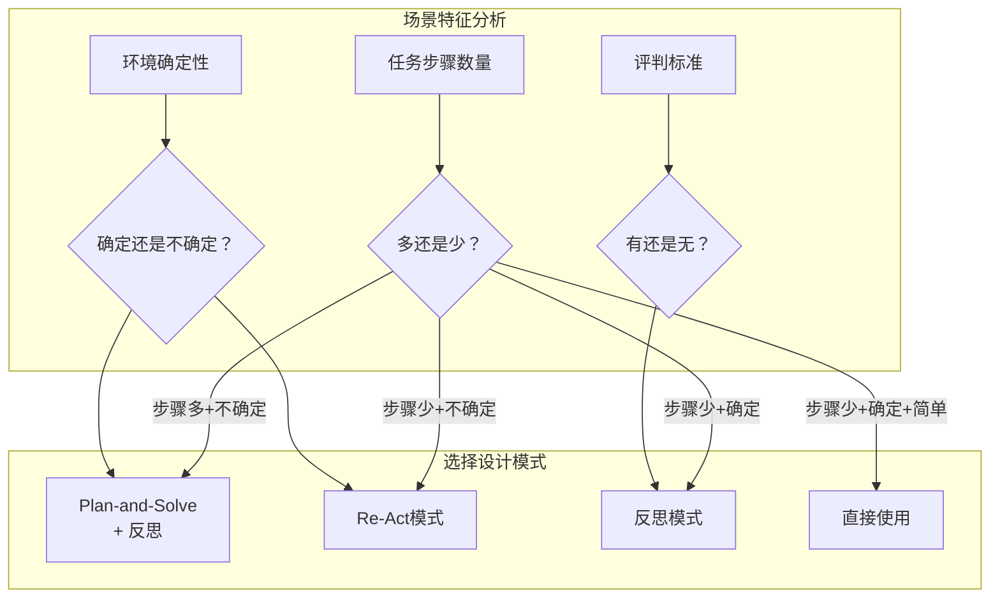
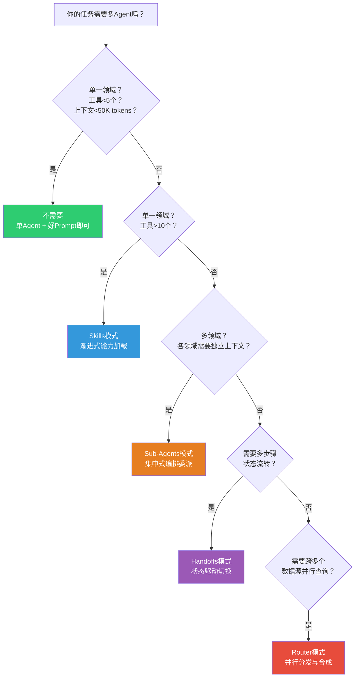
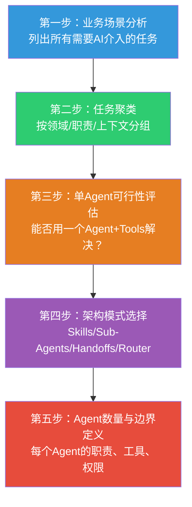

> **原文来源标注**
> - 源文件：`00-需掌握的业务知识【重要】\04-Agent设计方法论-场景判断与架构选型.md`
> - 复制时间：2026-06-23
> - 复制目的：第 1.2 章节：自建 Agent 场景判断与架构选型方法论
> - 说明：以下为原文完整内容，未做任何修改。

---
# Agent设计方法论：场景判断、架构选型与数量决策

> 综合极客时间《成为AGI产品经理》《Claude Code工程化实战》课程内容整理

---

## 一、Agent的核心能力框架

在判断"什么场景适合Agent"之前，先理解Agent的四大核心能力。这四项能力决定了Agent能解决什么问题：

```
Agent四大能力（来自《成为AGI产品经理》第10讲）
├── 记忆能力
│   ├── 事实性记忆（客观事实）→ 通过RAG构建
│   └── 程序性记忆（主观风格）→ 通过微调构建
├── 工具使用能力 → Re-Act模式
│   思考→行动→观察→再思考...循环
├── 规划能力 → Plan-and-Solve模式
│   制定计划→执行→必要时重新规划（Replan）
└── 反思能力 → Reflection模式
    检查结果→核对事实→验证正确性
```

**关键判断**：一个场景是否适合用Agent，核心看它是否需要**自主推理、工具调用、多步规划**中的至少两项。如果只是简单的"输入→输出"映射，用传统程序或单一Prompt即可，不需要Agent。

---

## 二、什么场景适合Agent？

### 2.1 三种Agent设计模式与场景匹配

来自《成为AGI产品经理》第10讲，根据场景特征选择设计模式：



**详细匹配表**：

| 场景类型 | 步骤数量 | 环境确定性 | 推荐模式 | 原因 |
|---------|---------|-----------|---------|------|
| **知识问答** | 多 | 不确定 | Plan-and-Solve + 反思 | 需要多步检索、验证答案准确性 |
| **词条搜索** | 多 | 不确定 | Plan-and-Solve + 反思 | 需要规划搜索路径、交叉验证 |
| **政策咨询** | 多 | 不确定 | Plan-and-Solve + 反思 | 需要引用多份文档、核对一致性 |
| **内部数据问答（如NL2SQL）** | 少 | 不确定 | Re-Act | SQL执行可能失败，需根据反馈调整 |
| **文本数据提取** | 少 | 确定 | 反思模式 | 任务明确，但需核对提取准确性 |
| **文档合规审查** | 少 | 确定 | 反思模式 | 有明确标准，需逐条核对 |
| **公共信息搜索** | 少 | 确定 | 直接使用 | 简单直接，无需复杂推理 |
| **资讯总结** | 少 | 确定 | 直接使用 | 单一任务，直接生成即可 |

### 2.2 适合Agent的通用判断标准

综合两门课程，适合Agent的场景具备以下特征：

```
适合Agent的场景特征（满足2条以上）：
□ 需要多步推理和决策（非单一映射）
□ 需要调用外部工具或数据源
□ 执行环境存在不确定性（可能失败需要重试）
□ 需要根据中间结果动态调整策略
□ 任务有明确的完成条件但路径不固定

不适合Agent的场景特征（满足1条即可否决）：
□ 简单固定的"输入→输出"映射
□ 需要频繁来回确认需求
□ 各步骤高度耦合，无法独立执行
□ 任务极其简单，启动Agent的开销大于收益
```

---

## 三、什么场景适合多Agent集群？

### 3.1 从单Agent到多Agent的升级信号

来自《Claude Code工程化实战》第4讲，LangChain给出的核心建议：

> **"Start with a single agent. Add tools before adding agents. Graduate to multi-agent patterns only when encountering clear architectural limits."**

两个核心触发条件：

| 触发信号 | 具体表现 | 判断标准 |
|---------|---------|---------|
| **信号一：上下文管理挑战** | 多个领域的专业知识无法塞进单一prompt | 单Agent上下文接近满载，进入"迟钝区" |
| **信号二：分布式开发需求** | 多个团队需要独立维护各自的Agent能力 | 安全团队维护审计Agent，测试团队维护测试Agent |

### 3.2 升级决策树



### 3.3 四种多Agent架构模式对比

| 模式 | 核心思想 | 上下文隔离 | 并行能力 | 适用场景 | Token成本 |
|------|---------|-----------|---------|---------|-----------|
| **Sub-Agents**（集中式编排） | Supervisor委派任务给专业Sub-Agent | 强（独立上下文） | 高（天然并行） | 多领域需要独立上下文的场景 | 中（约15x放大） |
| **Skills**（渐进式加载） | 单Agent按需加载能力包 | 弱（共享上下文） | 低（顺序执行） | 工具多但单次只需少量能力的场景 | 低 |
| **Handoffs**（状态驱动切换） | Agent间显式交接控制权 | 中（选择性传递） | 低（顺序执行） | 有明确阶段划分的流程型场景 | 中 |
| **Router**（并行分发） | 语义拆分后并行分发再合成 | 强（完全隔离） | 高（完全并行） | 跨多数据源并行查询 | 高（但节省40%+ token） |

### 3.4 Sub-Agents vs Agent Teams 选型

来自《Claude Code工程化实战》第8讲：

```
你的任务需要多个workers吗？
├── 否 → 直接在主对话或用单个子代理
└── 是 → Workers需要互相通信吗？
    ├── 否 → Sub-Agents
    │   • 更低token成本
    │   • 更简单的协调
    │   • 适合：并行探索、流水线编排
    │
    └── 是 → Agent Teams
        • 支持讨论和挑战
        • 共享任务列表
        • 适合：竞争假设、协作开发、多角度审查
```

**Agent Teams的四大协作模式**：

| 模式 | 适用场景 | 工作机制 |
|------|---------|---------|
| **竞争假设** | 根因不明确，需多方向验证 | 多个Teammates持不同假设，互相挑战推翻 |
| **分层评审** | 代码审查、PR Review | 不同维度（安全/性能/测试）同时评估 |
| **模块化开发** | 新功能开发涉及多个独立模块 | 每个Teammate拥有一个模块，共享任务列表 |
| **规划-审批** | 复杂或高风险任务 | Teammate先提交计划，Lead审批通过后执行 |

---

## 四、一个业务要设计几个Agent？通用方法论

### 4.1 Agent数量决策的通用原则

```
Agent数量决策原则
├── 原则一：最少Agent原则
│   从1个Agent开始，遇到明确瓶颈才增加
│   "每增加一个Agent，就增加一层调试复杂度、一份token成本、一个潜在失败点"
├── 原则二：按职责边界拆分
│   每个Agent应该有清晰、不重叠的职责边界
├── 原则三：按上下文独立性拆分
│   需要独立上下文的领域才拆分为独立Agent
├── 原则四：按团队所有权拆分
│   不同团队维护的Agent应该独立
└── 原则五：按通信需求拆分
    Workers需要互相通信 → Agent Teams
    Workers只需汇报 → Sub-Agents
```

### 4.2 五步设计法



### 4.3 Agent数量参考速查表

| 业务复杂度 | 工具数量 | 领域数量 | 推荐Agent数量 | 推荐架构 |
|-----------|---------|---------|--------------|---------|
| 简单（如单一知识库问答） | <5个 | 1个 | 0-1个 | 单Agent |
| 中等（如代码助手） | 5-10个 | 1-2个 | 1-3个 | 单Agent+Skills |
| 复杂（如企业技术助手） | 10-20个 | 3-5个 | 3-5个 | Supervisor+Sub-Agents |
| 极复杂（如全栈Bug猎人） | 20+个 | 5+个 | 5-10个 | Agent Teams |

### 4.4 常见设计错误

| 错误 | 表现 | 正确做法 |
|------|------|---------|
| **过早引入多Agent** | 任务简单但硬拆多个Agent | 从单Agent开始，遇到瓶颈再升级 |
| **Agent职责重叠** | 两个Agent都能做同一件事 | 明确职责边界，不重叠 |
| **忽略通信需求** | 需要讨论的场景用了Sub-Agents | 需要通信用Agent Teams，只需汇报用Sub-Agents |
| **Agent粒度过细** | 一个简单任务拆了5个Agent | 合并职责，减少Agent数量 |
| **Agent粒度过粗** | 一个Agent塞了太多不相关能力 | 按领域拆分，保持上下文聚焦 |

---

## 五、完整方法论总结

### 5.1 五步决策框架

```
步骤1：场景分析 → 列出任务，标注领域/步骤/工具/上下文
步骤2：任务聚类 → 按领域和上下文相关性分组
步骤3：单Agent评估 → 能用单Agent解决？→ 加Tools/Skills
步骤4：架构选型 → 多领域+独立上下文→Sub-Agents
                    多步骤+状态流转→Handoffs
                    多数据源+并行查询→Router
                    需要互相讨论→Agent Teams
步骤5：数量与边界 → 最少Agent原则，明确每个Agent的工具和权限
```

### 5.2 黄金法则

```
1. 从单Agent开始 → 只在遇到明确瓶颈时才升级
2. 先加工具，再加Agent → Tools是最小的扩展单位
3. 选对模型 > 堆更多token → 升级模型的效果超过翻倍预算
4. 上下文隔离是核心价值 → 多Agent的第一价值不是并行，是隔离
5. Token成本要求高价值任务 → 不是所有场景都值得多Agent
6. Agent的复杂度，不是靠"更聪明的模型"解决的，而是靠"更好的结构"消化的
```

### 5.3 一句话速查

```
什么场景适合Agent？
  → 需要多步推理+工具调用+动态决策的场景

什么场景适合多Agent集群？
  → 单Agent上下文不够用，或多个团队需要独立维护

一个业务设计几个Agent？
  → 从1个开始，按职责边界拆分，最少Agent原则

什么时候设计新Agent？
  → 现有Agent的上下文/职责/权限边界被突破时

通用方法论？
  → 五步设计法：场景分析→任务聚类→单Agent评估→架构选型→数量边界
```

---

*本文综合极客时间《成为AGI产品经理》第10讲、《Claude Code工程化实战》第3、4、8、9、13讲内容整理。*