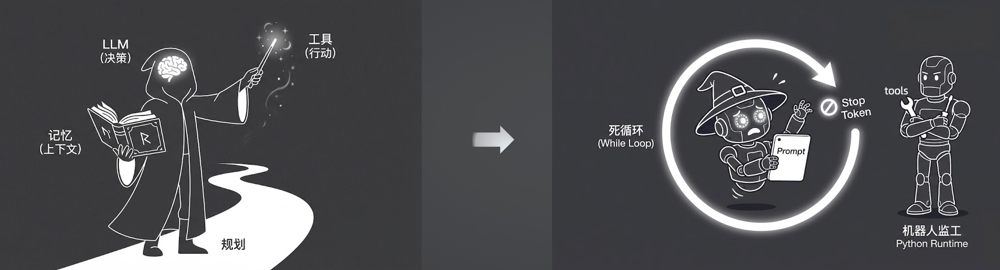
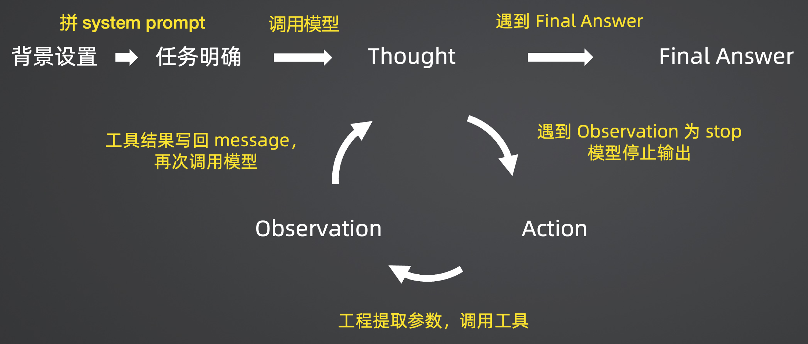
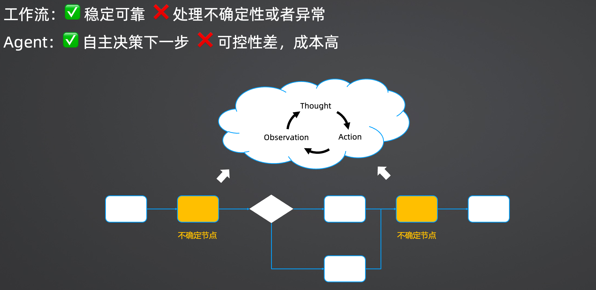

> **原文来源标注**
> - 源文件：`12-学习笔记\13-极客时间-企业级多智能体设计实战\03-原文+图片\L02-解构智能体：Agent的解剖学与ReAct范式.md`
> - 复制时间：2026-06-23
> - 复制目的：第 1.2 章节核心：Agent 公式视角下 ReAct 循环与混合架构原文
> - 说明：以下为原文完整内容，未做任何修改。

---
# 02｜解构智能体：Agent的解剖学与ReAct范式

> 来源：极客时间《企业级多智能体设计实战》
> 当前播放：02｜解构智能体：Agent的解剖学与ReAct范式
> 提取日期：2026-06-02
> 原文长度：8617 字

---

欢迎回来！在上一节课中，我们梳理了 AI 时代应用开发的四大架构范式。当时我预告过，今天我们会直击目前最核心、也最神秘的概念——**智能体（Agent）**。

这节课，我不仅会带你看看 Agent 是怎么工作的，更要把它的“外衣”撕开，带你深入解剖它的底层骨骼和运行逻辑。你会发现，那些看似神奇的魔法，背后其实是非常朴素的工程逻辑。

## Agent：会使用工具不断行动的“魔法师”

在上课前，你脑海里的 Agent 是什么样子的？是不是感觉它就像一个神奇的魔法师？


- 大脑（LLM）：负责思考、决策和规划下一步该干什么。
- 魔法书（记忆 / 上下文）：用来不断翻阅之前的执行记录和已知信息。
- 魔杖（工具 /Action）：用来获取外部信息或执行具体动作，比如搜索网页、读写文件。凭借这些，它能沿着自己规划出的路径，一步步达到最终的任务目标。这听起来确实很神奇。为了打破这种神秘感，我们先来看一段真实的代码演示。

## 见证“魔法”：几行代码实现网络调研 Agent

我们先用目前非常火的 CrewAI 框架，来实现一个“网络调研专家”。它的任务是调研某家公司的信息，并自动生成一份结构化的 Markdown 报告。

>
> 💡 课程说明：本课程的所有教学代码都会同步在 GitHub 上。为了方便大家无障碍学习，课程中的演示代码使用国内阿里云的千问大模型（Qwen）API 和百度的搜索组件，来替代大家不方便访问的 OpenAI 和 Google 服务。
>
> 代码地址：https://github.com/kid0317/crewai_mas_demo/blob/main/m1l2/m1l2_agent.py
>

我们要做的第一步，就是给这个智能体（Agent）**设定人设和目标**，并为它**配备工具**：

```python
# 核心代码示例（伪代码简化）
searcher = Agent(
   role="网络调研专家",
   goal="通过系统化的网络搜索和信息提取，完成用户指定的调研任务，并生成结构化的 Markdown 格式调研报告写入文件",
   backstory="""你是一位经验丰富的网络调研专家，擅长通过系统化的方法收集、分析和整理网络信息。
你的工作流程遵循以下步骤：
1. ** 任务分析 **：首先深入理解用户任务的意图和需求，明确调研目标和关键信息点
2. ** 搜索策略 **：基于任务需求，生成多组精准的搜索关键词，确保覆盖不同角度和维度
3. ** 信息收集 **：使用搜索工具获取初步结果，评估信息充分性；如信息不足，迭代生成新的搜索词进行补充搜索
4. ** 深度挖掘（强制要求）**：这是最关键的一步！搜索结果的摘要信息通常不够详细和完整，你必须：
  - 从每次搜索结果中，选择至少 1-2 个最相关、最权威的网页链接
  - ** 必须使用网页抓取工具（ScrapeWebsiteTool）** 深入抓取这些网页的完整内容
  - 不要仅依赖搜索结果中的摘要，摘要信息往往不完整或过时
  - 对于重要信息点，必须抓取原始网页内容进行验证和补充
  - 抓取顺序：优先抓取官方网站、权威媒体、专业百科等高质量来源
5. ** 信息管理 **：提取关键信息点时，必须记录三个要素：信息摘要、原文片段、原始网址，确保可追溯性
6. ** 报告撰写 **：基于收集的信息点，撰写结构化的调研报告。报告必须：
  - 完全基于收集的事实信息，不添加未经验证的内容
  - 使用 Markdown 格式，结构清晰（标题、段落、列表等）
  - 在每个关键段落后添加引用链接，格式为：[原文](网址)
  - 确保引用链接准确对应信息来源
7. ** 分步审核 **：每完成一个步骤，委托报告审核编辑审核，并根据意见修改
8. ** 报告整合 **：整合所有步骤报告，生成完整的最终报告
9. ** 最终审核 **：委托报告审核编辑进行最终审核，并根据意见修改
10. ** 文档保存 **：为报告起一个描述性的文件名，保存为本地 Markdown 文档
** 重要提醒 **：
- 搜索工具返回的只是摘要，不是完整信息！你必须使用网页抓取工具获取详细内容
- 每次搜索后，必须至少抓取 3-5 个相关网页的完整内容
- 不要跳过抓取步骤，这是确保报告质量和准确性的关键
- 如果搜索结果中没有足够的相关链接，需要调整搜索策略重新搜索
你始终遵循准确性、完整性和可追溯性的原则，确保每份报告都有可靠的信息来源支撑。""",
   # 工具配置：为 Agent 提供完成任务所需的能力
   # ScrapeWebsiteTool：网页抓取工具，用于获取网页的完整内容
   # BaiduSearchTool：百度搜索工具，用于搜索网络信息
   # FileWriterTool：文件写入工具，用于保存调研报告
   tools=[ScrapeWebsiteTool(), BaiduSearchTool(), FileWriterTool()],
   memory=True,  # 启用记忆功能，Agent 可以记住之前的对话内容
   max_iter=100,  # 最大迭代次数，防止 Agent 陷入无限循环
   llm=aliyun_llm.AliyunLLM(
       model="qwen-plus",
       api_key=os.getenv("QWEN_API_KEY"),
       region="cn",  # 使用 region 参数，可选值: "cn", "intl", "finance"
   ),
)
```

有了人设和工具还不够，我们还需要给它下达明确的**任务（Task）**，也就是定义清楚要做什么，以及预期的输出是什么：

```python
task = Task(
   description="""帮我调研极客时间的相关信息，请分析这个研究任务，规划完成研究所需的步骤，并产出一份专业的调研报告。
** 重要要求 **：
1. 每次使用搜索工具后，必须从搜索结果中选择最相关的网页链接
2. ** 必须使用网页抓取工具（ScrapeWebsiteTool）** 抓取这些网页的完整内容
3. 不要仅依赖搜索结果中的摘要信息，摘要往往不完整
4. 对于每个重要信息点，都要有对应的原始网页内容支撑
5. 优先抓取官方网站、权威媒体、专业百科等高质量来源""",
   expected_output="""完整的 Markdown 格式研究报告并写入文件，满足以下标准：
1. ** 内容完整性 **：
  - 覆盖所有研究步骤和大纲章节
  - 每个关键信息点都有详细说明
  - 信息来源于抓取的完整网页内容，而非仅搜索摘要
2. ** 信息准确性 **：
  - 所有信息点都有明确的引用来源
  - 引用格式正确：`[描述](URL)`
  - 引用链接可访问
  - 信息经过网页抓取验证，确保准确性
3. ** 结构规范性 **：
  - 符合报告大纲结构
  - 章节层次清晰
  - Markdown 格式正确
4. ** 质量保证 **：
  - 经过分步审核和最终审核
  - 所有审核意见已处理
  - 达到发布质量标准
  - 报告基于抓取的详细网页内容，而非仅搜索摘要
输出文件：`{主题}- 最终报告.md`""",
   agent=searcher,  # 指定执行任务的 Agent
)
```

**就这么简单！我们一共只写了不到 20 行核心代码**。当我们执行 `kickoff()` 把它跑起来后，令人惊叹的现象发生了，我们来看看它的**执行日志**：

[https://github.com/kid0317/crewai_mas_demo/blob/main/m1l2/agent.log](https://github.com/kid0317/crewai_mas_demo/blob/main/m1l2/agent.log)

```plain
Info：Thought: │ 我需要首先理解用户的需求……，Using Tool: 百度搜索
Info：Observation: 找到 10 条搜索结果
Info：Thought: │我将访问极客时间的主站链接……，Using Tool: WebsiteTool
Info：Observation: 极客时间 - 学 AI ，用极客时间 
Info：Thought: │我需要进一步详细内容……，Using Tool: WebsiteTool
Info：Observation: 极客邦科技
Info：Thought: │之前的网页抓取未能返回有效内容……，Using Tool: 百度搜索
Info：Observation: 找到 10 条搜索结果
Info：Thought: │并准备撰写结构化调研报告……，Using Tool: 百度搜索
Info：Observation: 找到 5 条搜索结果
Info：Thought: │撰写最终报告保存文件……，Using Tool: File Writer 
Info：Observation: Content successfully written to ./ 极客时间调研报告.md 
Info：Thought: │ 我已经完成了任务……，Final Answer: ****
```

1. Thought（思考）：我需要首先理解用户的需求…
2. Action（行动）：使用百度搜索工具，搜索“极客时间 官方网站”。
3. Observation（观察）：找到了搜索结果，提取到了官网 URL。
4. Thought（思考）：我要去访问这个官网获取信息…调用网页抓取工具。
5. Observation（观察）：（遇到意外） 官网上全是图片，抓取工具只返回了一句话“极客时间学员用极客时间”。
6. Thought（思考）：（自主决策） 之前的网页抓取未能返回有效内容，信息不够。我要换个思路，去搜一搜它的创始人信息。
7. ……（经过多次搜索和阅读）
8. Thought（思考）：我已经收集了足够的信息，准备撰写报告。调用文件写入工具。
9. Final Answer（最终答案）：报告生成完毕。

最终报告链接：[https://github.com/kid0317/crewai_mas_demo/blob/main/m1l2/%E6%9E%81%E5%AE%A2%E6%97%B6%E9%97%B4-%E6%9C%80%E7%BB%88%E6%8A%A5%E5%91%8A.md](https://github.com/kid0317/crewai_mas_demo/blob/main/m1l2/%E6%9E%81%E5%AE%A2%E6%97%B6%E9%97%B4-%E6%9C%80%E7%BB%88%E6%8A%A5%E5%91%8A.md)

看到了吗？如果用传统的 Workflow（工作流）来写这段代码，当第 5 步抓取网页失败时，你就得写一堆 `if-else` 来处理异常分支。而 Agent 则凭借大模型的大脑，**自主判断出信息不足，并决定换个搜索策略**。这就是 Agent 最大的魅力——处理不确定性。

## 撕开外衣：Agent 到底是个什么东西？

虽然上面的框架帮我们封装好了一切，让你觉得只要配几个参数就行，但这就带来了一个问题：**我们很容易沦为“调包侠”，遇到 Bug 时束手无策。**

现在，我要把这个魔法师的外袍撕开，让你看看它内部运转的真实机制。



其实，**Agent 在工程本质上就是一个**`While`**循环算法！**

刚才日志里的那些步骤，其实遵循着一个经典的范式：**ReAct (Reason + Act)**。为了弄懂它，我们偷偷抓包了 CrewAI 框架和底层大模型 API 之间的每一次真实交互（Message List）。你会发现里面藏着巨大的秘密。

### 显微镜下的 ReAct 机制

在给大模型发送的 **System Prompt** 里，有一段极其硬核的指令模板：

```plain
You are {role}, {backstory}. Your personal goal is: {goal}. 
You ONLY have access to the following tools: {tools schema}.
IMPORTANT: Use the following format in your response:
Thought: you should always think about what to do
Action: the action to take (must be one of the tools)
Action Input: the input to the action (JSON object)
Observation: the result of the action
Once all necessary information is gathered, return:
Thought: I now know the final answer
Final Answer: the final answer to the original input question
```

这就是规则！模型必须严格按照 `Thought` -> `Action` -> `Action Input` -> `Observation` 的格式来输出。

但这带来了一个致命问题：大模型在输出完 `Action Input` 后，它其实还没真正调用工具（它只是个文本生成器），如果由着它的性子继续输出 `Observation`，它一定会产生**幻觉**，自己瞎编一个工具返回的结果！

怎么阻止它瞎编呢？这就引出了工程框架里最精妙的一个参数：`stop`**信号**。

### 关键机关：Stop Token 与工程接管

在框架调用模型 API 时，会偷偷传一个参数：`stop=["\nObservation:"]`。

这意味着，当大模型按照格式输出完 `Action Input`，刚刚打出 `Observation:` 这几个字时，**框架（Python Runtime）会立刻像拔电源一样，强行掐断模型的输出！**

接下来的流程是这样的：

1. 模型停止输出：模型乖乖停在 Observation: 处。
2. 工程接管提取参数：我们的 Python 代码介入，用正则表达式把模型刚才输出的工具名（Action）和参数（Action Input）抠出来。
3. 真实调用工具：Python 代码去真实调用百度搜索 API 或者网页抓取脚本。
4. 结果回写上下文：Python 将真实拿到的结果字符串，拼接到刚才中断的 Observation: 后面，作为这一轮完整的 Assistant 历史对话。
5. 再次调用模型：拿着更新后的超长 Message List，开启下一轮大模型调用。

只要模型没有输出 `Final Answer`，这个死循环就会一直进行下去。通过不断拼接上下文，Agent 实现了“记忆”的累积；通过 `stop` 参数，Agent 实现了“大脑规划”与“工程执行”的完美交替。



## 架构师视角：手搓 Agent 与混合架构选型

了解了这个原理，你完全可以不依赖任何第三方框架，自己用 40 行 Python 代码手搓一个极简版的 Agent：

[https://github.com/kid0317/crewai_mas_demo/blob/main/m1l2/m1l2_raw_agent.py](https://github.com/kid0317/crewai_mas_demo/blob/main/m1l2/m1l2_raw_agent.py)

```python
# 1. 生成系统提示词和用户提示词
system_prompt = self.generate_system_prompt()
user_prompt = self.generate_user_prompt(description, expected_output)
# 2. 初始化消息列表（对话历史）
messages = [
   {"role": "system", "content": system_prompt},
   {"role": "user", "content": user_prompt}
]
# 3. 初始化 LLM
llm = AliyunLLM(
   model="qwen-turbo",
   api_key=os.getenv("QWEN_API_KEY"),
   region="cn",  # 使用 region 参数，可选值: "cn", "intl", "finance"
)
# 4. 核心循环：不断调用 LLM，直到得到 Final Answer
response = llm.call(messages, stop=["Observation:"])
while "Final Answer:" not in response:
   # 4.1 解析 LLM 返回的 Action（工具名称和输入）
   tool_name = self.parse_tool_name(response)
   tool_input = self.parse_tool_input(response)
 
   # 4.2 执行工具，获取结果
   tool_result = self.execute_tool(tool_name, tool_input)
 
   # 4.3 将工具执行结果作为 Observation 添加到对话历史
   # 格式：之前的 response + "\nObservation:" + 工具结果
   content = response + "\nObservation:" + tool_result
   messages.append({"role": "assistant", "content": content})
 
   # 4.4 再次调用 LLM，传入包含 Observation 的完整对话历史
   response = llm.call(messages, stop=["Observation:"])
# 5. 提取并返回最终答案
final_answer = self.extract_final_answer(response)
return final_answer
```

注：这只是用于理解原理的最简 Demo。实际工业级应用中，还要处理工具调用失败、大模型格式不合规、最大迭代次数限制、上下文撑爆等海量工程细节，这也是这门课后续几十节课要解决的问题。

### 混合架构：让工作流与 Agent 协同

既然 Agent 的能力这么强，我们是不是应该把所有的业务都改成纯 Agent 呢？**千万别！**



Agent 确实能自主决策（✅ 处理不确定性），但它的可控性差、幻觉率高，且每次循环都要消耗大量 Token，成本和延迟都极高（❌ 可控性差，成本高）。

在真实的工业落地中，我们推崇的是**“混合架构”**：

- 对于主链路和确定性的步骤：坚决使用 Workflow（工作流），保证极高的稳定性和极低的成本（例如：获取客户信息、数据初步校验）。
- 对于充满不确定性的特定节点：引入 Agent 去自主解决。比如当工作流遇到一个复杂的“线上未知报错排查”节点时，唤醒 Agent 去自主查日志、搜资料、写总结，处理完后再把结果返回给工作流。

**让工作流作为稳定的“骨架”，让 Agent 充当灵活的“关节”，这才是目前企业级 AI 应用最合理的落地姿势。**

## 课程总结

今天这节课，我们一起解剖了智能体：

1. Agent 的本质理解：大脑（LLM 自主决策） + 魔杖（工具使用） + 魔法书（上下文记忆）。
2. ReAct 的核心逻辑：遵循 Thought -> Action -> Action Input -> Observation -> Final Answer 的范式。
3. 工程衔接的秘密：依赖 Observation 作为 stop 信号，实现模型思考与代码执行的完美交替，本质就是一个直到看见 Final Answer 的无限循环。
4. 混合架构思维：在稳定的 Workflow 中，把处理异常和复杂推理的重任交给 Agent 节点。

### 课后思考题

我们今天看到了非常优雅、看似完美的 ReAct 循环框架。但是，作为架构师，我们需要随时思考最坏的情况：

**在实际的生产环境中，这套基于“死循环”和“特定文本格式”的 ReAct 范式，到底会踩到哪些坑？** （提示：从模型的格式遵循能力、上下文长度、或者死循环无法跳出等角度思考）。

欢迎在评论区留下你的思考，我们下节课将正式进入这套课程最核心的深水区——**Multi-Agent（多智能体）系统：Agent、Task、Process 的协作美学**。我们下节课见！
---

来源：极客时间《企业级多智能体设计实战》
提取日期：2026-06-02
