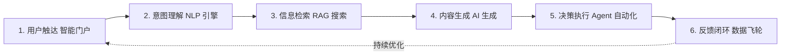
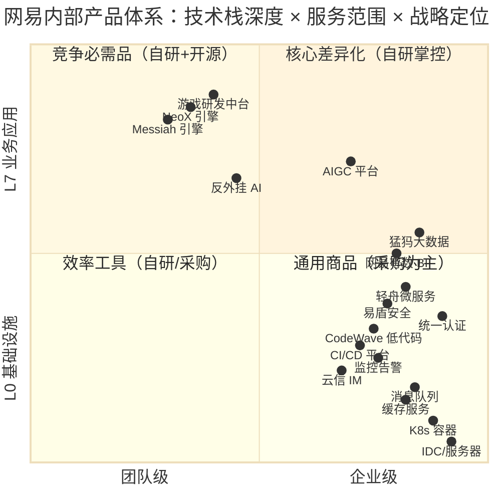
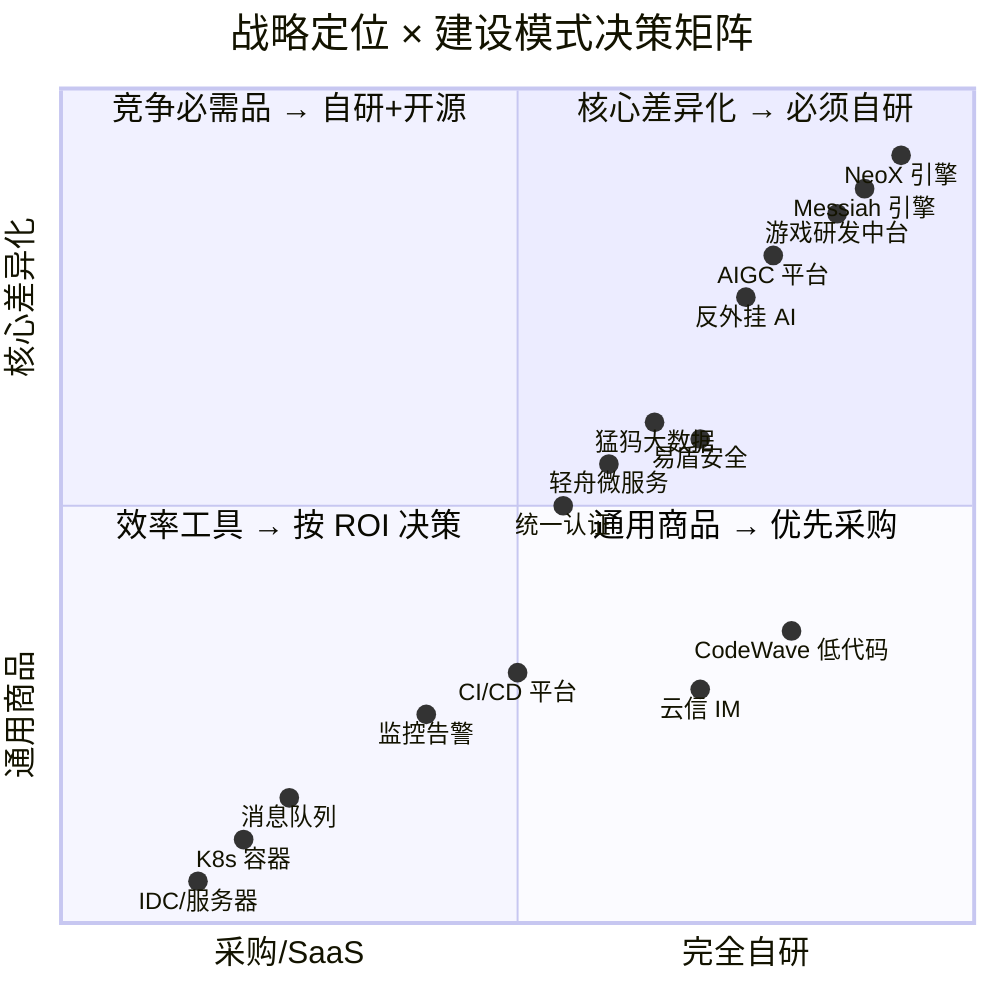
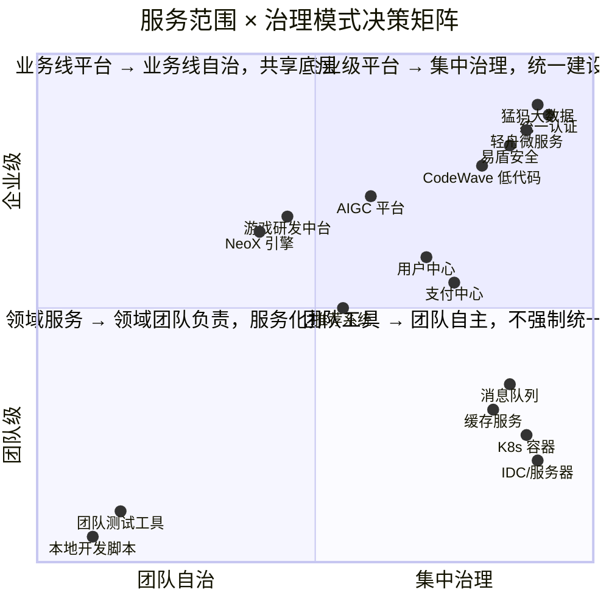
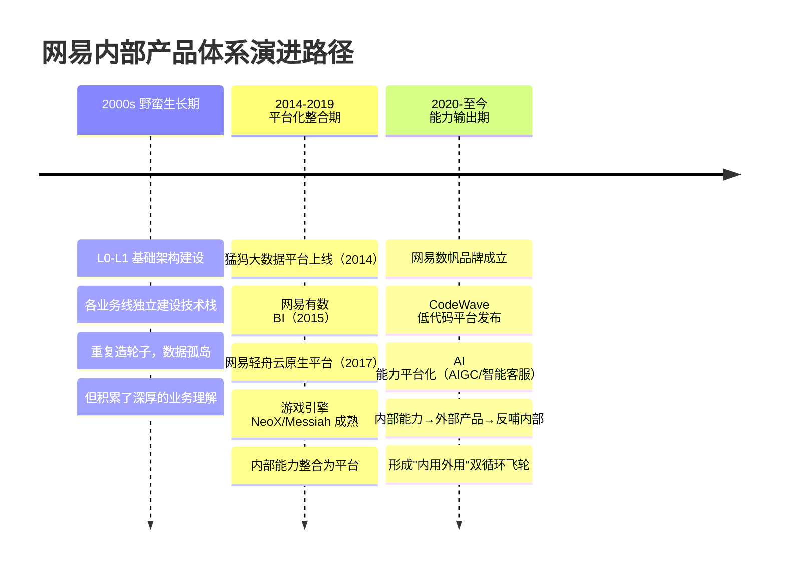

# 企业内部产品 AI 提效体系建设方法论

> **本文档由三份独立文档合并而来，是企业内部产品 AI 提效体系建设的统一方法论。**
>
> 合并来源：
> - 概述｜企业内部产品 AI 提效体系建设全景图（已合并入本文）
> - AI 提效的层级、环节与中长期 AI 体系建设蓝图（已合并入本文）
> - 案例｜网易企业内部产品体系深度分析（移至附录 A）
>
> **核心方法论**：以"五维分类框架"（技术栈深度 × 服务范围 × 战略定位 × 建设模式 × 成熟度）为主线，将 AI 提效贯穿 L0-L7 全栈，融合到内部产品体系中。

---

## 目录

- [序章：从三份文档到一份方法论](#序章)
- [第 1 章 为什么需要这个体系](#chapter-1)
- [第 2 章 体系架构总览](#chapter-2)
- [第 3 章 五维分析框架：方法论基石](#chapter-3)
- [第 4 章 AI 提效的八个层级 L0-L7](#chapter-4)
- [第 5 章 AI 提效的六大关键环节](#chapter-5)
- [第 6 章 六大核心平台建设](#chapter-6)
- [第 7 章 自研/采购决策矩阵](#chapter-7)
- [第 8 章 四阶段建设路线图](#chapter-8)
- [第 9 章 组织、人才与治理保障](#chapter-9)
- [第 10 章 框架迁移性：分析自己的企业](#chapter-10)
- [第 11 章 总结与预期收益](#chapter-11)
- [附录 A 网易企业内部产品体系案例研究](#appendix-a)

---

<a id="序章"></a>
## 序章：从三份文档到一份方法论

在 AI 提效成为企业战略级议题的当下，单点工具和零散案例已经无法回答"如何系统性地建设"。本方法论以三篇独立分析为基础融合：

| 原文档 | 贡献 | 在本文中位置 |
|--------|------|-------------|
| 概述（120 行） | 全局架构、建设路径、收益预期 | 第 1、2、11 章 |
| 层级与蓝图（475 行） | L0-L7 分层、六大环节、六大平台、决策框架 | 第 2、4、5、6、7、9 章 |
| 网易案例（333 行） | 五维框架落地、真实企业实例、问题诊断 | 第 3 章（方法论基石）+ 附录 A（完整案例） |

**核心理念**：AI 不是"买一个工具"，而是"建一套体系"。本方法论主张以**五维分类框架**为分析工具，从 L0 基础设施到 L7 业务应用，逐层识别 AI 提效机会，并通过"自研/采购决策矩阵"和"四阶段路线图"指导落地。

---

<a id="chapter-1"></a>
## 第 1 章 为什么需要这个体系

企业在数字化转型中面临两个核心命题，二者深度耦合：

**命题一：内部产品体系建设**
- 业务系统林立，数据孤岛严重
- 重复建设多，复用能力弱
- 响应业务需求慢，交付效率低
- 数据标准不统一，质量不可控

**命题二：AI 提效能力建设**
- AI 技术快速迭代，选型困难
- 场景分散，缺乏系统化落地路径
- 从 POC 到规模化生产存在鸿沟
- 算力成本、模型效果难以评估

**关键洞察**：AI 是内部产品提效的核心引擎，内部产品是 AI 落地的关键载体。两套体系必须协同建设，而非各自为政。

---

<a id="chapter-2"></a>
## 第 2 章 体系架构总览

### 2.1 五维视角的总体架构

```
+------------------------------------------------------------------+
|                  治理层：AI 战略与治理（企业级）                    |
|   AI 委员会 | 路线图与预算 | 伦理与合规 | ROI 评估体系              |
+-----------------------------+------------------------------------+
                              |
+-----------------------------v------------------------------------+
|              应用层（L7）：AI 原生应用（核心差异化）                |
|   智能客服 | 企业 AI 搜索 | 智能助手 | 智能分析                    |
+-----------------------------+------------------------------------+
                              |
+-----------------------------v------------------------------------+
|              能力层（L5）：六大 AI 平台                            |
|  Agent 框架 | RAG 知识库 | 模型服务 | 提示词工程 | 微调评估 | AI 开发平台 |
+-----------------------------+------------------------------------+
                              |
+-----------------------------v------------------------------------+
|              数据层（L4）+ 基础设施层（L0-L3）                     |
|   知识/业务/训练/反馈数据  |  算力/模型仓库/向量库/MCP 服务        |
+-----------------------------+------------------------------------+
                              |
+-----------------------------v------------------------------------+
|         现有企业内部产品体系（L0-L7）：被 AI 增强的基础设施         |
|   统一认证 | 数据中台 | 低代码 | 业务系统 | 中间件 | K8s | IDC      |
+------------------------------------------------------------------+
```

### 2.2 战略定位分层

按战略价值从高到低，本体系内的能力分为四类：

| 战略定位 | 含义 | 建设策略 |
|---------|------|---------|
| **核心差异化** | 竞争壁垒，必须自研 | 完全自研、持续重投入 |
| **竞争必需品** | 不做不行，但非壁垒 | 自研 + 开源，按需补齐 |
| **效率工具** | 提升内部效率 | 自研或采购，按 ROI 决策 |
| **通用商品** | 采购优于自建 | 优先采购、不重复造轮子 |

---

<a id="chapter-3"></a>
## 第 3 章 五维分析框架：方法论基石

本方法论的核心分析工具是**五维分类框架**。所有内部产品和 AI 能力，都可以用这五个维度来定位：

### 维度 1：技术栈深度（L0-L7）

从硬件到应用，纵向八层：

```
L7 业务应用层       → 面向终端用户的产品
L6 业务中台层       → 可复用的业务能力
L5 AI 平台层        → AI 基础设施
L4 数据平台层       → 数据全链路
L3 应用平台层       → 应用开发基础设施
L2 中间件层         → 通用技术组件
L1 容器与编排层     → 资源调度
L0 基础设施层       → 硬件资源
```

### 维度 2：服务范围

```
企业级（Enterprise-wide）   → 所有业务线共用
业务线级（BU-wide）         → 某条业务线内部共用
领域级（Domain-wide）       → 跨团队共用
团队级（Team-specific）     → 单个团队使用
```

### 维度 3：战略定位

```
核心差异化（Core Differentiator）    → 竞争壁垒，必须自研
竞争必需品（Competitive Necessity）  → 不做不行，但不构成壁垒
效率工具（Efficiency Enabler）      → 提升内部效率
通用商品（Commodity）               → 采购优于自建
```

### 维度 4：建设模式

```
完全自研 → 基于开源定制 → 采购商业软件 → 使用 SaaS 服务
```

### 维度 5：成熟度

```
探索期 → 成长期 → 成熟期 → 衰退/替换期
```

### 框架使用方法

**步骤 1：盘点** → 列出企业内所有产品和平台
**步骤 2：映射** → 按五个维度给每个产品打标签
**步骤 3：分析** → 识别重复建设、能力缺口、定位错位
**步骤 4：决策** → 基于定位决定建设模式（自研/采购/放弃）
**步骤 5：规划** → 按成熟度制定演进路线

> **附录 A** 提供了一个使用本框架分析网易的完整示例，可作为参考模板。

---

<a id="chapter-4"></a>
## 第 4 章 AI 提效的八个层级 L0-L7

AI 在技术栈的**每一个层级**都有提效空间。按 L0-L7 分层来看：

### 4.1 全栈 AI 提效图谱

```mermaid
graph TB
    subgraph L7["L7 业务应用层 — 用户体验革命"]
        L7_A["AI 原生应用：智能客服、AI 搜索、智能助手"]
        L7_B["个性化体验：推荐、千人千面"]
        L7_C["自然语言交互：对话式 UI 替代菜单导航"]
    end

    subgraph L6["L6 业务中台层 — 业务能力智能化"]
        L6_A["智能引擎：AI 驱动的业务规则引擎"]
        L6_B["智能决策：风控、定价、调度"]
        L6_C["内容智能：AIGC 生成营销素材、商品描述"]
    end

    subgraph L5["L5 AI 平台层 — AI 能力本身"]
        L5_A["模型服务：推理加速、缓存、量化"]
        L5_B["提示词工程：模板管理、A/B 测试、效果评估"]
        L5_C["RAG 引擎：文档解析、检索排序、知识更新"]
        L5_D["Agent 框架：任务规划、工具调用、记忆管理"]
        L5_E["模型微调：数据准备、训练、评估、部署"]
    end

    subgraph L4["L4 数据平台层 — 数据智能化"]
        L4_A["智能数据治理：AI 自动识别数据质量、血缘关系"]
        L4_B["NL2SQL：自然语言查数，降低数据使用门槛"]
        L4_C["智能指标管理：AI 推荐指标、自动归因分析"]
        L4_D["数据合成：AI 生成训练数据、扩增数据集"]
    end

    subgraph L3["L3 应用平台层 — 研发效率革命"]
        L3_A["AI 辅助编码：代码生成、补全、重构"]
        L3_B["AI 自动化测试：用例生成、执行、结果分析"]
        L3_C["AI 代码审查：安全检测、风格检查、性能建议"]
        L3_D["AI 文档生成：API 文档、技术文档自动生成"]
        L3_E["低代码 + AI：自然语言描述生成应用"]
    end

    subgraph L2["L2 中间件层 — 智能运维"]
        L2_A["智能运维 AIOps：异常检测、根因分析、自动修复"]
        L2_B["智能调度：AI 优化资源分配、负载均衡"]
        L2_C["智能缓存：AI 预测热点数据、预缓存"]
    end

    subgraph L1["L1 容器与编排层 — 资源优化"]
        L1_A["智能弹性伸缩：AI 预测流量、自动扩缩容"]
        L1_B["智能调度：AI 优化 Pod 调度策略"]
        L1_C["成本优化：AI 分析资源使用、推荐降配"]
    end

    subgraph L0["L0 基础设施层 — 硬件与网络优化"]
        L0_A["GPU 利用率优化：AI 调度训练任务、减少闲置"]
        L0_B["智能网络优化：AI 预测网络流量、动态调整"]
        L0_C["智能运维：AI 预测硬件故障、自动巡检"]
    end

    L7 --> L6
    L6 --> L5
    L6 --> L4
    L5 --> L4
    L4 --> L3
    L3 --> L2
    L2 --> L1
    L1 --> L0
```



### 4.2 各层级提效汇总

| 层级 | 提效方向 | 核心场景 | 典型效率提升 |
|------|---------|---------|------------|
| **L7 业务应用层** | 用户体验革命 | 智能客服、AI 搜索、对话式 UI | 客服解决率提升 60%、检索时间降低 70% |
| **L6 业务中台层** | 业务能力智能化 | 智能引擎、AIGC 内容、智能决策 | 内容生产效率提升 80%、决策准确率提升 30% |
| **L5 AI 平台层** | AI 能力本身 | 模型服务、提示词平台、RAG、Agent、微调 | 模型响应速度提升 50%、开发周期降低 60% |
| **L4 数据平台层** | 数据智能化 | 智能治理、NL2SQL、数据合成 | 数据准备效率提升 70%、分析门槛降低 80% |
| **L3 应用平台层** | 研发效率革命 | AI 编码、测试、审查、文档 | 编码效率提升 60%、测试覆盖率提升 50% |
| **L2 中间件层** | 智能运维 | AIOps、智能调度、智能缓存 | 故障恢复时间降低 70%、资源利用率提升 30% |
| **L1 容器与编排层** | 资源优化 | 弹性伸缩、智能调度、成本优化 | 资源成本降低 30%、部署效率提升 50% |
| **L0 基础设施层** | 硬件与网络优化 | GPU 调度、智能网络、智能运维 | GPU 利用率提升 40%、硬件故障降低 50% |

**核心结论**：AI 提效覆盖 L0-L7 全部八个层级，从 GPU 利用率优化到业务应用体验革命，每个层级都有明确的提效场景和量化指标。

---

<a id="chapter-5"></a>
## 第 5 章 AI 提效的六大关键环节

从**用户端到端流程**视角看，AI 提效贯穿六个环节：



### 5.1 环节对比表

| 环节 | 传统模式 | AI 提效模式 | 涉及层级 |
|------|---------|-----------|---------|
| **1. 用户触达** | 多系统独立登录、菜单导航 | 统一工作台 + 自然语言交互 | L7+L3 |
| **2. 意图理解** | 用户需准确知道功能名称 | 自然语言解析模糊需求 + 多轮对话 | L5+L7 |
| **3. 信息检索** | 关键词搜索，结果不精准 | 语义搜索 + 跨系统统一搜索 + AI 摘要 | L5+L4+L7 |
| **4. 内容生成** | 人工撰写文档、代码、报表 | AI 辅助生成 + 人工审核 | L5+L3+L4+L7 |
| **5. 决策执行** | 人工处理审批、工单、告警 | Agent 自动预审 + 跨系统编排 + 自动修复 | L5+L6+L2 |
| **6. 反馈闭环** | 人工复盘、模型更新滞后 | 数据飞轮 + 在线学习 + 自动知识入库 | L4+L5 |

### 5.2 闭环价值

六大环节形成完整闭环：**触达 → 理解 → 检索 → 生成 → 执行 → 反馈**。每个环节 AI 深度参与，反馈环节的数据飞轮驱动全链路持续优化，越用越好。

---

<a id="chapter-6"></a>
## 第 6 章 六大核心平台建设

按**战略定位**排序，本方法论主张优先建设以下六大平台：

### 6.1 平台清单

| # | 平台 | 层级 | 战略定位 | 建设模式 | 成熟度目标 |
|---|------|------|---------|---------|-----------|
| 1 | **Agent 框架平台** | L5 | ★ 核心差异化 | 完全自研（基于开源定制） | L3：Multi-Agent 协作 + 动态规划 |
| 2 | **RAG 知识库平台** | L5 | ★ 核心差异化 | 自研 + 开源（LangChain/LlamaIndex） | L3：多源知识库 + 主动更新 + 质量监控 |
| 3 | **模型服务平台** | L5 | 竞争必需品 | 自研 + 开源（vLLM/TGI） | L3：多模型路由 + 监控 + 成本分析 |
| 4 | **提示词工程平台** | L5 | 竞争必需品 | 自研（轻量级内部工具） | L3：模板库 + 版本管理 + 自动化评测 |
| 5 | **微调与评估平台** | L5 | 竞争必需品 | 自研 + 开源（LLaMA-Factory） | L3：系统化微调 + 评估体系 |
| 6 | **AI 应用开发平台** | L3 | 效率工具 | 自研或采购低代码 AI 平台 | L3：可视化 AI 工作流编排 |

### 6.2 平台建设原则

- **核心差异化平台**（Agent、RAG）：必须自研，决定企业自动化水平与知识资产质量的上限
- **竞争必需品平台**（模型服务、提示词、微调）：自研 + 开源结合，可基于业界主流方案定制
- **效率工具平台**（AI 应用开发）：按 ROI 决策，能采购就采购，避免重复造轮子

---

<a id="chapter-7"></a>
## 第 7 章 自研/采购决策矩阵

### 7.1 决策原则

| 战略定位 | 决策 | 理由 |
|---------|------|------|
| 核心差异化 | 完全自研 | 是竞争壁垒，外采不可控 |
| 竞争必需品 | 自研 + 开源 | 必须有，但可在开源基础上定制 |
| 效率工具 | 按 ROI 决策 | 不构成壁垒，能买就买 |
| 通用商品 | 优先采购 | 重复造轮子没有价值 |

### 7.2 决策矩阵示意

```
  ↑ 核心差异化
  │
  │  ◆ Agent 框架      ◆ RAG 知识库
  │       必须自研            必须自研
  │
  │      ◆ 模型服务平台  ◆ 提示词工程  ◆ 微调平台
  │           自研+开源        自研+开源      自研+开源
  │
  │                          ◆ AI 应用开发平台
  │                              按 ROI 决策
  │
  │  ◆ 基础大模型 API    ◆ 向量数据库    ◆ 算力/GPU
  │     优先采购            优先采购        优先采购
  │
  └──────────────────────────────────────────────→ 完全自研
       通用商品                              采购/SaaS
```

**核心原则**：避免"什么都要自研"和"什么都想采购"两个极端。决策依据是**战略定位 × 成熟度 × ROI** 的三维交叉。

---

<a id="chapter-8"></a>
## 第 8 章 四阶段建设路线图

本方法论主张**四阶段渐进式建设**，每阶段聚焦明确目标，避免大跃进。

### 8.1 阶段概览

```
阶段一：基础夯实        阶段二：AI 能力注入     阶段三：深度融合      阶段四：规模化运营
─────────────────────────────────────────────────────────────────────────────→
         ↓                       ↓                    ↓                    ↓
   内部产品体系       →      AI 能力嵌入       →   全流程智能化      →   AI 资产化
   基础设施完成             核心场景验证             跨系统协同            平台化赋能
```

### 8.2 各阶段要点

| 阶段 | 核心目标 | 关键动作 | 验证指标 |
|------|---------|---------|---------|
| **一、基础夯实** | 补齐内部产品基础设施 | 统一认证 / 数据中台 / 低代码平台 / 大模型选型与部署 | 数据接入率、AI 服务可用性 |
| **二、AI 能力注入** | 在核心场景验证 AI 价值 | 提示词规范 / RAG 知识库 / Agent 框架雏形 / 核心业务场景试点 | 客服解决率、编码效率、知识检索准确率 |
| **三、深度融合** | AI 驱动研发与业务全流程 | Multi-Agent 协作 / 模型微调评估闭环 / 数据飞轮 | Agent 任务成功率、微调模型场景覆盖度 |
| **四、规模化运营** | AI 能力平台化、资产化 | AI 平台对外开放 / 成本度量与优化 / AI 资产库 / 前沿跟踪 | AI 驱动业务占比、资源成本下降率 |

### 8.3 阶段间的关键衔接

- **一 → 二**：基础设施必须就绪才能承载 AI 场景
- **二 → 三**：从单点验证到全流程融合，需要组织与流程同步变革
- **三 → 四**：从内部使用到资产化输出，需要治理体系兜底

---

<a id="chapter-9"></a>
## 第 9 章 组织、人才与治理保障

### 9.1 组织架构

```
AI 委员会（CTO/CIO 牵头）
├── AI 产品管理组 — 场景挖掘、需求管理、效果评估
├── AI 工程组     — 平台建设、模型服务、基础设施
├── AI 数据组     — 数据准备、知识库建设、数据飞轮
└── AI 治理组     — 安全合规、伦理审查、成本管控
```

### 9.2 人才梯队

| 角色 | 核心能力 | 战略定位 | 来源 |
|------|---------|---------|------|
| AI 产品经理 | 场景挖掘、需求定义、效果评估 | 核心差异化 | 内部培养 + 外部引进 |
| AI 架构师 | 整体架构设计、技术选型 | 核心差异化 | 外部引进 |
| Agent 工程师 | Agent 框架开发、工具链建设 | 核心差异化 | 外部引进为主 |
| 提示词工程师 | 提示词设计、评测、优化 | 竞争必需品 | 内部培养 |
| 数据工程师 | 数据清洗、标注、知识库建设 | 竞争必需品 | 内部转岗 |
| MLOps 工程师 | 模型部署、监控、运维 | 竞争必需品 | 外部引进 |

### 9.3 治理与设计原则

| 原则 | 说明 |
|------|------|
| **渐进式** | 从单点突破到体系化建设，避免大跃进 |
| **可度量** | 每个环节设定明确的效率指标 |
| **可复用** | 能力抽象为平台服务，避免重复建设 |
| **安全可控** | 数据不出域、权限最小化、内容可审计 |
| **人机协同** | AI 辅助而非替代，保留人工决策闭环 |
| **成本透明** | 每个 AI 能力的成本可度量、可追溯 |
| **开放兼容** | 避免厂商锁定，支持多模型切换 |

---

<a id="chapter-10"></a>
## 第 10 章 框架迁移性：分析自己的企业

### 10.1 五步法

1. **盘点**：列出企业内部所有产品和平台
2. **映射**：按五维框架给每个产品打标签
3. **分析**：识别重复建设、能力缺口、定位错位
4. **决策**：基于定位决定建设模式（自研/采购/放弃）
5. **规划**：按成熟度制定演进路线

### 10.2 常见问题诊断

| 症状 | 五维视角的诊断 |
|------|--------------|
| 重复建设严重 | 同一技术栈深度 + 同一服务范围，多个团队在做同类产品 |
| 平台推不动 | 战略定位不清晰，业务线不认可平台价值 |
| 什么都想自研 | 没有区分核心差异化 vs 通用商品 |
| 中台响应慢 | 服务范围定得太宽，试图满足所有业务线的所有需求 |
| 技术栈混乱 | 没有统一的技术栈深度分层，各团队各自选型 |
| AI 场景碎片化 | 没有在 L0-L7 全栈视角下识别提效机会 |
| 模型效果不可控 | 缺少提示词工程与微调评估的闭环 |

---

<a id="chapter-11"></a>
## 第 11 章 总结与预期收益

### 11.1 核心结论

1. **AI 提效覆盖 L0-L7 全部八个层级**，每个层级都有明确的提效场景和量化指标
2. **六大关键环节形成完整闭环**：触达→理解→检索→生成→执行→反馈
3. **六大平台按战略定位分层建设**：核心差异化（自研）/ 竞争必需品（自研+开源）/ 效率工具（按 ROI）
4. **四阶段路线图清晰可执行**：基础夯实→AI 注入→深度融合→规模化运营
5. **五维框架可迁移到任何企业**，用于诊断与规划

### 11.2 预期收益

| 维度 | 收益指标 |
|------|---------|
| 研发效率 | 需求到交付周期缩短 40%-60% |
| 业务响应 | 新业务系统上线时间从月级到周级 |
| 数据价值 | 数据资产从"存"到"用"的跨越 |
| 运营成本 | 重复性工作自动化率提升 50%+ |
| 决策质量 | 数据驱动的智能决策支持 |

### 11.3 一句话总结

> **AI 提效不是"买一个工具"，而是"建一套体系"。**
> 短期看场景（L5+L7）、中期看平台（L3+L4+L5）、长期看生态（L0-L7 全栈）。

---

<a id="appendix-a"></a>
## 附录 A 网易企业内部产品体系案例研究

> 本附录提供五维框架的完整企业落地示例。文中所有网易产品信息基于公开资料整理，框架为原创分析模型。

### A.0 案例背景

网易是国内最早系统化建设内部产品体系的互联网公司之一。从 2000 年代的"野蛮生长"到 2014 年后的"平台化整合"，再到 2020 年后的"能力输出"，网易的演进路径对其他企业具有较强的参考价值。

### A.1 五维分类框架（重述）

为便于案例分析，此处重述第 3 章的五维框架。网易的每个内部产品都按以下五个维度定位：

```
维度 1：技术栈深度 L0-L7       — 产品在技术栈哪一层
维度 2：服务范围               — 企业级 / 业务线级 / 领域级 / 团队级
维度 3：战略定位               — 核心差异化 / 竞争必需品 / 效率工具 / 通用商品
维度 4：建设模式               — 完全自研 → 采购 / SaaS
维度 5：成熟度                 — 探索 → 成长 → 成熟 → 衰退 / 替换
```

### A.2 框架全景图

按"技术栈深度（纵向）× 服务范围（横向）× 战略定位（颜色编码）"展示网易内部产品：



### A.3 全景图解读

| 象限 | 战略定位 | 典型产品 | 建设策略 |
|------|---------|---------|---------|
| **右上（高深度 × 广范围）** | 核心差异化 | NeoX 引擎、游戏研发中台、AIGC 平台 | 完全自研，持续重投入 |
| **右下（低深度 × 广范围）** | 通用商品 | K8s 容器、IDC、消息队列 | 采购或基于开源，不重复造轮子 |
| **左上（高深度 × 窄范围）** | 竞争必需品 | 猛犸、有数、轻舟、易盾 | 自研 + 开源，企业级统一建设 |
| **左下（低深度 × 窄范围）** | 效率工具 | CodeWave、CI/CD、监控 | 自研或采购，以 ROI 为决策依据 |

### A.4 网易产品层级关系图

```mermaid
graph TB
    subgraph L7["L7 业务应用层"]
        G1["梦幻西游 / 蛋仔派对"]
        G2["网易云音乐"]
        G3["网易严选"]
        G4["网易有道"]
    end

    subgraph L6["L6 业务中台层"]
        B1["NeoX / Messiah 自研引擎"]
        B2["游戏研发中台"]
        B3["用户中心 / 支付中心"]
        B4["推荐系统 / 广告系统"]
    end

    subgraph L5["L5 AI 平台层"]
        A1["大模型推理服务"]
        A2["AIGC 内容生成"]
        A3["智能 NPC / 对话"]
        A4["反外挂 AI"]
    end

    subgraph L4["L4 数据平台层"]
        D1["猛犸大数据平台（16+ 子产品）"]
        D2["网易有数 BI"]
        D3["指标中台"]
        D4["实时计算 / 数据质量"]
    end

    subgraph L3["L3 应用平台层"]
        P1["轻舟微服务"]
        P2["CodeWave 低代码"]
        P3["易盾安全"]
        P4["统一认证 / CI/CD / 监控"]
    end

    subgraph L2["L2 中间件层"]
        M1["消息队列（RocketMQ / Kafka）"]
        M2["分布式缓存（Redis）"]
        M3["数据库中间件（ShardingSphere）"]
        M4["云信 IM / 推送"]
    end

    subgraph L1["L1 容器与编排层"]
        C1["Kubernetes 容器平台"]
        C2["镜像仓库"]
        C3["灰度发布 / 蓝绿部署"]
    end

    subgraph L0["L0 基础设施层"]
        I1["自建 IDC"]
        I2["多云架构（阿里 / 华为 / 腾讯）"]
        I3["CDN 网络"]
        I4["GPU 集群"]
    end

    L7 -->|调用| L6
    L6 -->|依赖| L5
    L6 -->|依赖| L4
    L5 -->|依赖| L4
    L4 -->|运行在| L3
    L3 -->|依赖| L2
    L2 -->|运行在| L1
    L1 -->|运行在| L0
    L5 -->|模型推理| L0
    L4 -->|数据存储| L0

    classDef core fill:#e74c3c,stroke:#c0392b,color:#fff
    classDef necessity fill:#f39c12,stroke:#e67e22,color:#fff
    classDef tool fill:#3498db,stroke:#2980b9,color:#fff
    classDef commodity fill:#95a5a6,stroke:#7f8c8d,color:#fff

    class G1,G2,G3,G4 core
    class B1,B2 core
    class A1,A2,A3,A4 core
    class D1,D2,D3,D4 necessity
    class P1,P3,P4 necessity
    class P2 tool
    class M1,M2,M3,M4 commodity
    class C1,C2,C3 commodity
    class I1,I2,I3,I4 commodity
```



### A.5 战略定位 × 建设模式矩阵



### A.6 服务范围 × 治理模式矩阵



### A.7 网易演进路径



### A.8 网易代表性产品五维定位一览

| 产品 | 层级 | 服务范围 | 战略定位 | 建设模式 |
|------|------|---------|---------|---------|
| NeoX / Messiah 引擎 | L6 | 业务线级 | 核心差异化 | 完全自研 |
| 游戏研发中台 | L6 | 业务线级 | 核心差异化 | 完全自研 |
| AIGC 平台 | L5 | 企业级 | 核心差异化 | 自研+开源 |
| 反外挂 AI | L5 | 业务线级 | 核心差异化 | 完全自研 |
| 猛犸大数据 | L4 | 企业级 | 竞争必需品 | 自研+开源 |
| 网易有数 BI | L4 | 企业级 | 竞争必需品 | 自研+开源 |
| 轻舟微服务 | L3 | 企业级 | 竞争必需品 | 自研+开源 |
| 易盾安全 | L3 | 企业级 | 竞争必需品 | 自研+开源 |
| CodeWave 低代码 | L3 | 企业级 | 效率工具 | 完全自研 |
| 统一认证 | L3 | 企业级 | 竞争必需品 | 自研 |
| 消息队列 / 缓存 | L2 | 企业级 | 通用商品 | 自研+开源 |
| K8s 容器 | L1 | 企业级 | 通用商品 | 基于开源定制 |
| 自建 IDC | L0 | 企业级 | 通用商品 | 完全自建 |

### A.9 框架的可迁移性

#### 如何用五维框架分析其他企业

```
步骤 1：盘点 → 列出企业内部所有产品和平台
步骤 2：映射 → 按五个维度给每个产品打标签
步骤 3：分析 → 识别重复建设、能力缺口、定位错位
步骤 4：决策 → 基于定位决定建设模式（自研/采购/放弃）
步骤 5：规划 → 按成熟度制定演进路线
```

#### 常见问题诊断

| 症状 | 五维视角的诊断 |
|------|--------------|
| 重复建设严重 | 同一技术栈深度 + 同一服务范围，多个团队在做同类产品 |
| 平台推不动 | 战略定位不清晰，业务线不认可平台价值 |
| 什么都想自研 | 没有区分核心差异化 vs 通用商品 |
| 中台响应慢 | 服务范围定得太宽，试图满足所有业务线的所有需求 |
| 技术栈混乱 | 没有统一的技术栈深度分层，各团队各自选型 |

### A.10 案例总结

**核心结论**：
1. 网易内部产品体系不是"游戏/软件/Web"三块，而是从 L0 到 L7 的完整技术栈
2. 不同战略定位的产品采用不同的建设模式（自研/开源/采购）
3. 服务范围决定了治理模式（集中/自治/混合）
4. 五维框架可迁移到任何企业，用于诊断和规划内部产品体系

---

*本文档为企业内部产品 AI 提效体系建设的统一方法论，基于公开资料整理与分析。*

