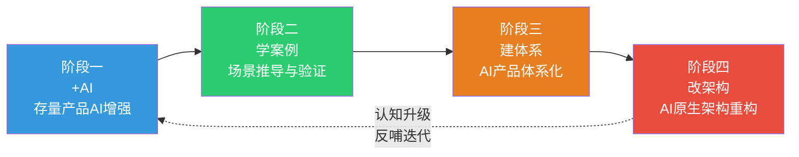
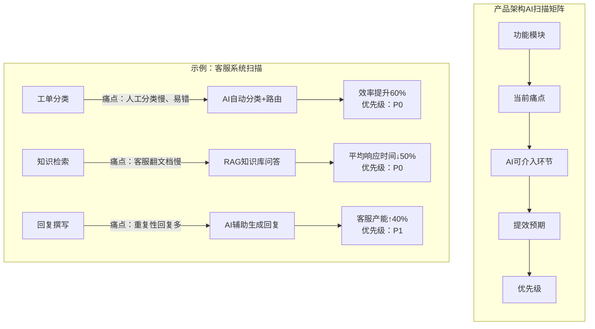
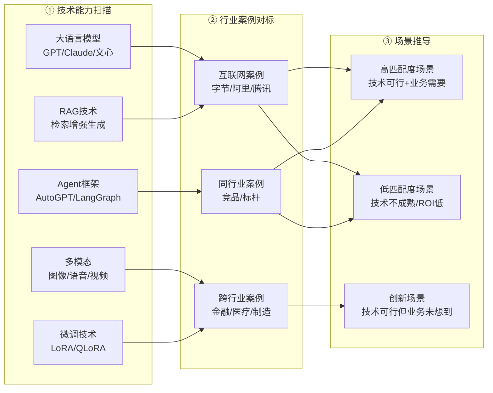
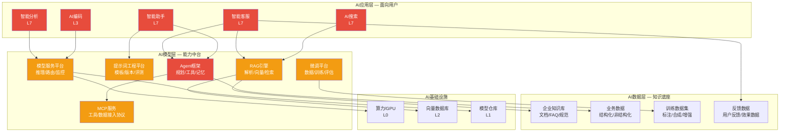
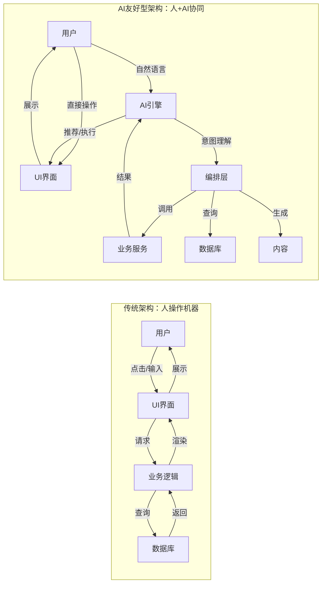
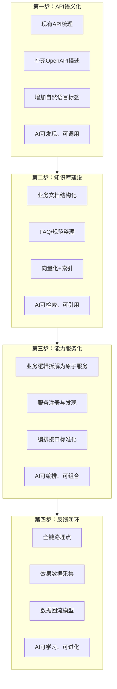
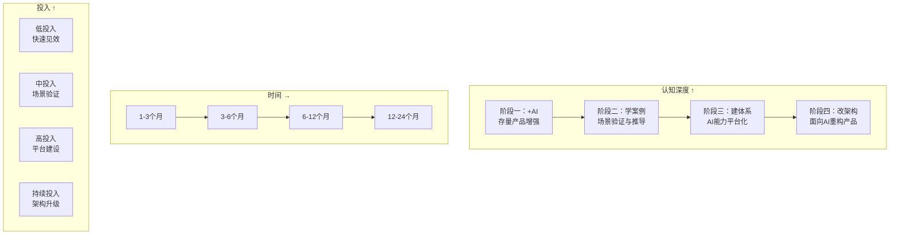

# 企业内部AI落地的四阶段方法论

> 基于你的思考框架完善：**+AI → 学案例 → 建体系 → 改架构**

---

## 框架总览



| 阶段 | 核心问题 | 关键动作 | 产出物 |
|------|---------|---------|--------|
| **一：+AI** | 现有产品哪些环节可以+AI？ | 产品架构扫描、AI触点识别 | AI增强机会地图 |
| **二：学案例** | 别人怎么做的？哪些可以借鉴？ | 技术调研、案例对标、场景推导 | 可落地场景清单 |
| **三：建体系** | AI能力如何平台化、体系化？ | 分层架构设计、平台建设 | AI产品体系架构 |
| **四：改架构** | 如何面向AI重构产品架构？ | AI友好型架构设计、范式升级 | AI原生架构方案 |

---

## 阶段一：+AI — 存量产品AI增强

### 核心问题

> 基于企业当前的产品架构，思考可以"+AI"的内容。

### 方法：产品架构AI扫描

将现有产品按**功能模块**拆解，逐一扫描每个模块中可被AI增强的环节：



### AI增强的六种模式

| 模式 | 说明 | 适用场景 | 示例 |
|------|------|---------|------|
| **+智能输入** | 用自然语言替代表单/菜单 | 搜索、查询、数据录入 | 对话式搜索、NL2SQL |
| **+智能处理** | AI自动处理重复性工作 | 分类、审核、提取 | 工单自动分类、合同信息提取 |
| **+智能生成** | AI辅助内容创作 | 文档、代码、设计 | 报告自动生成、AI辅助编码 |
| **+智能决策** | AI辅助人工判断 | 审批、风控、调度 | AI预审+人工终审 |
| **+智能交互** | 用对话替代操作 | 客服、助手、培训 | 智能客服、AI陪练 |
| **+智能分析** | AI驱动数据洞察 | 报表、归因、预测 | 自动异常检测、趋势预测 |

### 产出物：AI增强机会地图

```
产品模块    | 可+AI环节 | AI模式    | 预期效果       | 优先级 | 涉及L层级
───────────┼──────────┼──────────┼──────────────┼──────┼─────────
客服系统    | 工单分类  | 智能处理  | 效率↑60%      | P0   | L5+L7
客服系统    | 知识检索  | 智能输入  | 响应时间↓50%   | P0   | L5+L7
运营后台    | 报表生成  | 智能生成  | 制作时间↓80%   | P1   | L4+L7
审批系统    | 预审推荐  | 智能决策  | 审批效率↑40%   | P1   | L5+L6
代码开发    | 编码辅助  | 智能生成  | 编码效率↑50%   | P0   | L3+L5
监控系统    | 异常检测  | 智能分析  | 故障发现↑70%   | P1   | L2+L5
```

---

## 阶段二：学案例 — 场景推导与验证

### 核心问题

> 了解AI多维度技术、互联网落地案例，推导可以在企业内部落地的场景。

### 方法：技术→案例→场景 推导链路



### 案例对标维度

| 对标维度 | 关注点 | 可借鉴内容 |
|---------|-------|-----------|
| **技术选型** | 用了什么模型？自研还是API？ | 技术决策依据 |
| **架构设计** | 怎么分层？怎么集成？ | 架构模式复用 |
| **落地路径** | 从哪切入？怎么推广？ | 避坑经验 |
| **组织保障** | 谁牵头？怎么考核？ | 组织设计参考 |
| **ROI表现** | 投入产出比？多久回本？ | 投资决策参考 |

### 场景筛选漏斗

```
技术可行性 → 业务价值 → 实施难度 → ROI验证
    │           │          │          │
    ▼           ▼          ▼          ▼
  技术调研    业务访谈    资源评估    MVP验证
  该技术是否  业务方是否  现有团队   3个月内能否
  成熟可用    真正需要    能否承接   看到效果
```

### 产出物：可落地场景清单

```
场景名称    | 技术方案       | 对标案例     | 业务价值 | 实施难度 | 优先级
────────────┼──────────────┼────────────┼────────┼────────┼──────
智能客服    | RAG+LLM      | 字节Coze   | 高      | 低     | P0
AI辅助编码  | Code LLM     | GitHub Copilot | 高  | 低     | P0
智能报表    | NL2SQL+BI    | 阿里DataV  | 中      | 中     | P1
合同审查    | LLM+提示词   | 法天使     | 中      | 低     | P1
智能培训    | RAG+Agent    | 得到AI学习 | 低      | 中     | P2
```

---

## 阶段三：建体系 — AI产品体系化

### 核心问题

> 建设AI产品体系，比如应用层、模型层、数据层、AI基础设施。

### 方法：四层AI产品体系架构



### 四层职责与建设策略

| 层级 | 职责 | 核心能力 | 战略定位 | 建设策略 |
|------|------|---------|---------|---------|
| **应用层** | 面向用户提供AI功能 | 场景理解、交互设计、效果保障 | 核心差异化 | 自研，快速迭代 |
| **模型层** | 封装AI技术能力为平台服务 | 模型服务、提示词、RAG、Agent、MCP、微调 | 核心差异化+竞争必需品 | 自研+开源 |
| **数据层** | 提供高质量的知识和数据 | 知识库、数据治理、数据合成 | 竞争必需品 | 自研+治理 |
| **基础设施层** | 提供底座资源与运行环境 | 算力/GPU、向量数据库、模型仓库 | 基础必需品 | 外采+少量自研 |

### 四层之间的关键关系

```
应用层 ← 调用 → 模型层 ← 依赖 → 数据层
                模型层 ← 依赖 → 基础设施层
   │                    │
   └── 反馈数据 ────────┘
   （用户行为 → 模型优化 → 知识更新）
```

**数据飞轮**：应用层产生反馈数据 → 数据层沉淀 → 模型层优化 → 应用层效果提升

### 产出物：AI产品体系架构图

```
┌─────────────────────────────────────────────────────────────┐
│                      AI应用层                                 │
│  ┌──────┐ ┌──────┐ ┌──────┐ ┌──────┐ ┌──────┐              │
│  │智能客服│ │AI搜索│ │智能助手│ │智能分析│ │AI编码│              │
│  └──┬───┘ └──┬───┘ └──┬───┘ └──┬───┘ └──┬───┘              │
│     │        │        │        │        │                   │
├─────┼────────┼────────┼────────┼────────┼───────────────────┤
│     ▼        ▼        ▼        ▼        ▼                   │
│                      AI模型层                                 │
│  ┌──────────┐ ┌──────────┐ ┌──────────┐ ┌──────────┐       │
│  │模型服务   │ │提示词平台 │ │RAG引擎   │ │Agent框架 │       │
│  └──────────┘ └──────────┘ └──────────┘ └──────────┘       │
│  ┌──────────┐ ┌──────────┐                                   │
│  │微调平台   │ │MCP服务   │                                   │
│  └──────────┘ └──────────┘                                   │
├─────────────────────────────────────────────────────────────┤
│                      AI数据层                                 │
│  ┌──────────┐ ┌──────────┐ ┌──────────┐ ┌──────────┐       │
│  │企业知识库 │ │业务数据   │ │训练数据   │ │反馈数据   │       │
│  └──────────┘ └──────────┘ └──────────┘ └──────────┘       │
├─────────────────────────────────────────────────────────────┤
│                      AI基础设施层                             │
│       算力/GPU       向量数据库        模型仓库              │
└─────────────────────────────────────────────────────────────┘
```

---

## 阶段四：改架构 — AI原生架构重构

### 核心问题

> 当前是AI的时代，面向AI引擎来优化原本的产品体系，建设AI友好型的产品架构。

### 什么是AI友好型架构？

传统架构是"人操作机器"的架构，AI友好型架构是"人+AI协同操作"的架构：



### AI友好型架构的五大原则

| 原则 | 传统架构 | AI友好型架构 |
|------|---------|-------------|
| **1. 接口可被AI理解** | API命名随意、文档缺失 | API语义化命名、OpenAPI规范、自然语言描述 |
| **2. 数据可被AI检索** | 数据分散、格式不统一 | 统一知识库、结构化元数据、语义化索引 |
| **3. 流程可被AI编排** | 业务逻辑硬编码在代码中 | 业务能力服务化、可组合、可编排 |
| **4. 反馈可被AI学习** | 用户行为不采集 | 全链路埋点、效果数据回流、反馈闭环 |
| **5. 权限可被AI管控** | 粗粒度权限 | 细粒度权限、可审计、可解释 |

### 架构改造路径



### 各层级的AI友好化改造

| 层级 | 当前状态 | AI友好化改造 | 优先级 |
|------|---------|-------------|--------|
| **L7 应用层** | 菜单导航、表单填写 | 增加对话式交互入口、自然语言搜索 | P0 |
| **L6 业务中台** | 业务逻辑硬编码 | 业务能力API化、语义化描述 | P0 |
| **L5 AI平台层** | 无 | 建设AI能力中台（模型、提示词、RAG、Agent） | P0 |
| **L4 数据平台** | 数据分散、格式不一 | 统一知识库、元数据管理、语义索引 | P1 |
| **L3 应用平台** | 传统API | API语义化、OpenAPI规范、MCP协议 | P1 |
| **L2 中间件** | 通用中间件 | 增加AI可观测性、智能运维接口 | P2 |
| **L1-L0 基础设施** | 通用基础设施 | GPU集群、向量数据库、模型仓库 | P1 |

### 案例：传统审批系统 → AI友好型审批

```
传统审批系统：
  用户 → 填写表单 → 选择审批人 → 提交 → 审批人查看 → 人工判断 → 通过/驳回
  （每个环节都需要人工操作，流程固定）

AI友好型审批系统：
  用户 → 自然语言描述需求 → AI理解意图 → AI预填表单
       → AI推荐审批人 → AI预审（合规检查、风险评估）
       → 审批人只需审核AI的建议 → 一键通过/修改
  （AI处理80%的重复性工作，人只做关键决策）
```

**架构改造要点**：
1. 表单字段语义化 → AI可理解每个字段的含义
2. 审批规则知识化 → AI可检索和引用审批规则
3. 历史数据可学习 → AI可从历史审批中学习模式
4. 审批结果可反馈 → AI可从审批人的修改中学习

---

## 四阶段的关系与演进



| 维度 | 阶段一：+AI | 阶段二：学案例 | 阶段三：建体系 | 阶段四：改架构 |
|------|-----------|-------------|-------------|-------------|
| **目标** | 快速见效，建立信心 | 验证场景，积累经验 | 能力沉淀，平台化 | 架构升级，范式转变 |
| **投入** | 低 | 中 | 高 | 持续 |
| **风险** | 低 | 中 | 中高 | 高 |
| **ROI** | 立竿见影 | 3-6个月可见 | 6-12个月可见 | 12-24个月可见 |
| **组织影响** | 无 | 小 | 中 | 大 |
| **关键角色** | 产品经理+开发 | 产品经理+AI工程师 | AI架构师+平台团队 | 技术VP+架构师 |

---

## 总结

```
你的思考 → 完善后的方法论
─────────────────────────────
1. 基于产品架构+AI     → 阶段一：产品架构AI扫描 + 六种AI增强模式
2. 了解技术+案例推导    → 阶段二：技术→案例→场景 推导链路 + 筛选漏斗
3. 建设AI产品体系       → 阶段三：应用层+模型层+数据层 三层架构
4. 面向AI优化产品架构   → 阶段四：AI友好型架构五大原则 + 四步改造路径
```

**核心观点**：
- 四阶段不是串行的，可以**并行推进**（如阶段一和阶段二可以同时做）
- 阶段四的认知会**反哺**阶段一（AI原生思维让"+AI"更有方向）
- 每个阶段都有明确的**产出物和验证标准**，避免"为了AI而AI"
- 关键是从"给产品+AI"到"面向AI做产品"的**思维跃迁**

---

*本文基于你的四阶段思考框架完善而成。*
