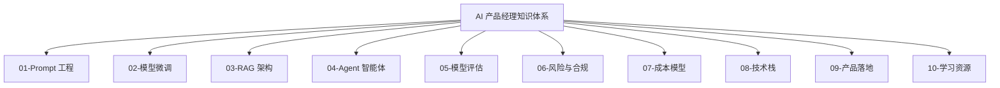
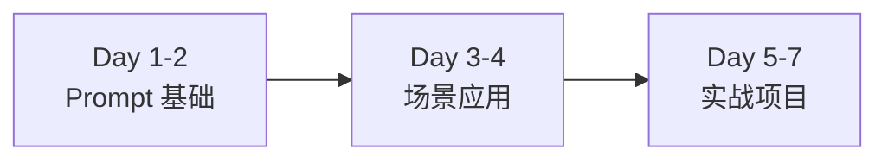

---
tags:
  - 索引
  - 导航
aliases:
  - AI 产品经理知识地图
  - 知识体系导航
created: 2026-03-07
updated: 2026-03-07
---

# 📚 AI 产品经理知识体系总览

> 本知识库为 AI 产品经理提供系统化的学习路径和核心知识框架

## 🎯 知识体系结构



## 📖 核心知识模块

### 🔤 基础能力层

| 模块                                  | 说明           | 核心内容                            |
| ----------------------------------- | ------------ | ------------------------------- |
| [[01-Prompt 工程/01-核心概念\|Prompt 工程]] | 与 AI 高效交互的基础 | Zero-shot, Few-shot, CoT, ReAct |
| [[02-模型微调/01-核心概念\|模型微调]]           | 让模型适应特定场景    | LoRA, QLoRA, Full Fine-tuning   |
| [[03-RAG 架构/01-核心概念\|RAG 架构]]       | 检索增强生成       | 向量检索，知识注入，上下文管理                 |

### 🤖 进阶应用层

| 模块 | 说明 | 核心内容 |
|------|------|----------|
| [[04-Agent 智能体/01-核心概念\|Agent 智能体]] | 自主任务执行系统 | 规划，工具使用，记忆系统 |
| [[05-模型评估/01-核心概念\|模型评估]] | 效果量化与优化 | 评估指标，测试集，A/B 测试 |

### 🛡️ 保障体系层

| 模块 | 说明 | 核心内容 |
|------|------|----------|
| [[06-风险与合规/01-核心概念\|风险与合规]] | 安全与伦理 | 数据隐私，内容安全，合规框架 |
| [[07-成本模型/01-核心概念\|成本模型]] | ROI 分析与优化 | Token 计费，推理成本，优化策略 |

### 🔧 技术支撑层

| 模块 | 说明 | 核心内容 |
|------|------|----------|
| [[08-技术栈/01-核心概念\|技术栈]] | 工具与平台 | 模型 API，开发框架，部署工具 |

### 📈 产品落地层

| 模块 | 说明 | 核心内容 |
|------|------|----------|
| [[09-产品落地/01-核心概念\|产品落地]] | 从概念到上线 | 需求分析，MVP，迭代优化 |

### 📚 资源支持层

| 模块 | 说明 | 核心内容 |
|------|------|----------|
| [[10-学习资源/01-学习路径\|学习资源]] | 持续学习 | 课程，论文，社区，实践项目 |

## 🎓 学习路径建议

### 🚀 快速上手路径（第 1 周）

**适合人群**：所有产品经理，无论经验水平



| 时间 | 学习内容 | 产出物 | 预计耗时 |
|------|----------|--------|----------|
| **Day 1-2** | [[01-Prompt 工程/01-核心概念\|Prompt 核心概念]]<br/>- Zero-shot/Few-shot<br/>- CoT 思维链<br/>- CRISPE 框架 | 5 个 Prompt 模板 | 2 小时 |
| **Day 3-4** | [[01-Prompt 工程/02-场景案例\|场景案例]]<br/>- 用户访谈提纲<br/>- 竞品分析<br/>- PRD 撰写 | 6 个场景模板 | 2.5 小时 |
| **Day 5-7** | [[01-Prompt 工程/03-最佳实践\|最佳实践]]<br/>- Prompt 优化<br/>- 版本管理<br/>- 实战项目 | 10+ 模板库<br/>1 个实战项目 | 4 小时 |

**✅ 第 1 周目标**：工作效率提升 50%，建立个人 Prompt 模板库

---

### 📌 按角色选择路径

#### 1️⃣ 初级产品经理（0-6 个月经验）

**核心目标**：能独立完成 AI 功能设计，高效使用 AI 工具

```
学习顺序（建议 4 周）：
Week 1 → Week 2 → Week 3 → Week 4
```

| 周次 | 重点模块 | 具体内容 | 实战项目 | 预计耗时 |
|------|----------|----------|----------|----------|
| **Week 1** | 🔤 **Prompt 工程** | [[01-Prompt 工程/01-核心概念\|核心概念]]<br/>[[01-Prompt 工程/02-场景案例\|场景案例]] | 用 AI 完成<br/>竞品分析 | 6-8 小时 |
| **Week 2** | 🔧 **技术栈** | [[08-技术栈/01-核心概念\|技术栈全景]]<br/>主流模型 API 对比 | 评估和选择<br/>技术栈 | 6-8 小时 |
| **Week 3** | 📈 **产品落地** | [[09-产品落地/01-核心概念\|产品方法论]]<br/>PRD 撰写 | 撰写完整 PRD | 6-8 小时 |
| **Week 4** | 🤖 **Agent 基础** | [[04-Agent 智能体/01-核心概念\|Agent 概念]]<br/>设计模式 | 设计客服 Agent | 6-8 小时 |

**✅ 能力目标**：
- ✅ 熟练使用 Prompt 完成日常工作
- ✅ 能撰写 AI 功能 PRD
- ✅ 理解主流技术方案
- ✅ 能设计简单 Agent

**📦 产出物**：
- Prompt 模板库（20+ 个）
- 完整 PRD 文档（1 份）
- 技术方案对比文档
- Agent 设计方案

---

#### 2️⃣ 中级产品经理（6-18 个月经验）

**核心目标**：能独立负责 AI 产品线，掌握核心技术方案

```
学习顺序（建议 6-8 周）：
基础巩固 → 核心技术 → 实战应用 → 综合提升
```

| 阶段 | 重点模块 | 具体内容 | 实战项目 | 预计耗时 |
|------|----------|----------|----------|----------|
| **阶段 1**<br/>(2 周) | 🔤🤖 **基础巩固** | [[01-Prompt 工程/03-最佳实践\|Prompt 进阶]]<br/>[[04-Agent 智能体/01-核心概念\|Agent 设计]] | Multi-Agent<br/>协作系统 | 12-16 小时 |
| **阶段 2**<br/>(2 周) | 🏗️ **核心技术** | [[03-RAG 架构/01-核心概念\|RAG 架构]]<br/>[[02-模型微调/01-核心概念\|模型微调]] | 知识库 QA<br/>系统方案 | 12-16 小时 |
| **阶段 3**<br/>(2 周) | 📊 **效果保障** | [[05-模型评估/01-核心概念\|模型评估]]<br/>[[07-成本模型/01-成本结构\|成本模型]] | 建立评估<br/>体系 +ROI 分析 | 12-16 小时 |
| **阶段 4**<br/>(2 周) | 🛡️ **风险合规** | [[06-风险与合规/01-核心概念\|风险合规]]<br/>[[09-产品落地/01-核心概念\|产品落地]] | 完整产品<br/>方案设计 | 12-16 小时 |

**✅ 能力目标**：
- ✅ 能设计 RAG 和 Agent 系统
- ✅ 掌握效果评估方法
- ✅ 能准确测算 ROI
- ✅ 建立风险意识
- ✅ 能负责完整 AI 产品线

**📦 产出物**：
- RAG 技术方案
- Agent 协作系统
- 评估指标体系
- ROI 分析报告
- 风险评估矩阵
- 完整产品方案

---

#### 3️⃣ 高级产品经理（18 个月+ 经验）

**核心目标**：制定 AI 产品战略，推动规模化落地

```
学习重点（按需选择，建议 8-12 周）：
技术深度 → 商业思维 → 组织能力 → 行业洞察
```

| 方向 | 重点模块 | 具体内容 | 实战项目 | 预计耗时 |
|------|----------|----------|----------|----------|
| **技术深度** | [[02-模型微调/01-核心概念\|微调实战]]<br/>[[03-RAG 架构/01-核心概念\|RAG 优化]] | 模型定制<br/>架构优化 | 主导一个<br/>微调项目 | 20-30 小时 |
| **商业思维** | [[07-成本模型/01-成本结构\|成本优化]]<br/>[[09-产品落地/01-核心概念\|规模化]] | 商业模式<br/>规模化策略 | 制定产品<br/>商业化方案 | 15-20 小时 |
| **组织能力** | [[06-风险与合规/01-核心概念\|风险管控]]<br/>[[09-产品落地/01-核心概念\|团队建设]] | 合规体系<br/>团队搭建 | 建立产品<br/>风险防控体系 | 15-20 小时 |
| **行业洞察** | [[10-学习资源/01-学习路径\|前沿追踪]]<br/>行业报告 | 技术趋势<br/>竞争格局 | 输出行业<br/>分析报告 | 10-15 小时 |

**✅ 能力目标**：
- ✅ 制定产品技术路线
- ✅ 设计商业模式
- ✅ 建立风险防控体系
- ✅ 推动规模化落地
- ✅ 洞察行业趋势

**📦 产出物**：
- 产品技术路线图
- 商业化方案
- 风险防控体系
- 行业分析报告
- 团队能力建设方案

---

### 🎯 按场景选择路径

#### 场景 1：要做知识库问答系统

**推荐路径**（2-3 周）：
```
[[03-RAG 架构/01-核心概念\|RAG 架构]] → [[08-技术栈/01-核心概念\|向量数据库选型]] → [[05-模型评估/01-核心概念\|效果评估]] → [[07-成本模型/01-成本结构\|成本测算]]
```

**核心内容**：
- RAG 架构设计
- 向量数据库对比
- 检索效果优化
- 成本 ROI 分析

**产出物**：知识库 QA 系统技术方案

---

#### 场景 2：要做智能客服/助手

**推荐路径**（2-3 周）：
```
[[04-Agent 智能体/01-核心概念\|Agent 设计]] → [[01-Prompt 工程/02-场景案例\|对话 Prompt]] → [[06-风险与合规/01-核心概念\|内容安全]] → [[09-产品落地/01-核心概念\|灰度发布]]
```

**核心内容**：
- Agent 架构设计
- 多轮对话 Prompt
- 内容安全审核
- 上线发布策略

**产出物**：智能客服系统方案

---

#### 场景 3：要优化现有 AI 功能效果

**推荐路径**（1-2 周）：
```
[[05-模型评估/01-核心概念\|评估体系]] → [[01-Prompt 工程/03-最佳实践\|Prompt 优化]] → [[02-模型微调/01-核心概念\|微调评估]] → [[07-成本模型/01-成本结构\|成本优化]]
```

**核心内容**：
- 建立评估指标
- Prompt 迭代优化
- 微调可行性分析
- 成本优化策略

**产出物**：效果优化方案

---

#### 场景 4：要控制 AI 应用成本

**推荐路径**（1 周）：
```
[[07-成本模型/01-成本结构\|成本分析]] → [[01-Prompt 工程/03-最佳实践\|Prompt 精简]] → [[08-技术栈/01-核心概念\|模型路由]] → [[03-RAG 架构/01-核心概念\|缓存策略]]
```

**核心内容**：
- 成本结构拆解
- Prompt 优化技巧
- 模型路由策略
- 缓存方案设计

**产出物**：成本优化方案

---

### 📅 30 天速成计划

**适合人群**：互联网产品经理，每天 2-3 小时

完整计划详见：[[10-学习资源/02-30 天学习计划\|30 天学习计划]]

```
Week 1: Prompt 工程 → 效率提升 50%
Week 2: RAG + Agent → 掌握核心技术
Week 3: 评估 + 成本 + 风险 → 建立保障体系
Week 4: 综合实战 → 从 0 到 1 完成项目
```

**✅ 30 天成果**：
- 能独立负责 AI 功能
- 建立系统化知识框架
- 完成一个完整项目
- 建立持续学习能力

## 🔗 快速链接

- [[99-模板与工具/笔记模板/核心概念笔记模板\|核心概念笔记模板]]
- [[99-模板与工具/决策模板/技术选型决策模板\|技术选型决策模板]]
- [[99-模板与工具/工具模板/工具评估模板\|工具评估模板]]

## 📊 知识图谱状态

- 总文件夹数：12 个
- 核心知识模块：10 个
- 模板工具区：1 个

---

**最后更新**: 2026-03-07  
**维护者**: AI 产品团队
