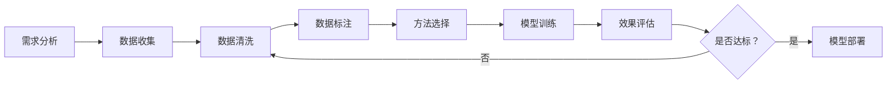

---
tags:
  - 模型微调
  - Fine-tuning
  - 定制化
created: 2026-03-07
updated: 2026-03-07
---

# 模型微调核心概念

## 📌 什么是模型微调

模型微调（Fine-tuning）是在预训练大语言模型基础上，使用特定领域数据继续训练，使模型适应特定任务或场景的技术。

### 核心价值
- 🎯 **领域适配** - 让通用模型理解专业术语
- 📈 **性能提升** - 在特定任务上超越基座模型
- 💰 **成本优化** - 减少 Prompt Token 消耗
- 🔒 **数据隐私** - 可本地化部署

## 🎨 微调方法对比

### 1. Full Fine-tuning（全量微调）

更新模型所有参数。

**特点**：
- ✅ 效果最好
- ❌ 计算资源需求高
- ❌ 容易遗忘通用能力
- ❌ 存储成本高（每个任务一个完整模型）

**适用场景**：
- 有充足 GPU 资源
- 领域差异大
- 对效果要求极高

### 2. LoRA（Low-Rank Adaptation）

冻结原模型，在每层添加低秩适配器。

**原理**：
```
W' = W + ΔW = W + BA
其中 B ∈ R^(d×r), A ∈ R^(r×k), r << d,k
```

**特点**：
- ✅ 参数量减少 10000 倍
- ✅ 训练速度快
- ✅ 存储成本低（仅保存适配器）
- ✅ 可组合多个 LoRA 模块
- ⚠️ 效果略低于全量微调

**适用场景**：
- 资源有限
- 需要快速迭代
- 多任务场景

### 3. QLoRA（Quantized LoRA）

量化 + LoRA 的结合。

**特点**：
- ✅ 显存占用降低 60%
- ✅ 可消费级 GPU 训练
- ✅ 效果接近 LoRA
- ⚠️ 训练时间略长

**适用场景**：
- 单卡训练大模型
- 个人开发者
- 实验验证阶段

## 📊 微调方法选择矩阵

| 维度 | Full Fine-tuning | LoRA | QLoRA |
|------|-----------------|------|-------|
| **GPU 需求** | 多卡 A100 | 单卡 A100 | 消费级显卡 |
| **训练时间** | 长 | 短 | 中等 |
| **效果** | ⭐⭐⭐⭐⭐ | ⭐⭐⭐⭐ | ⭐⭐⭐⭐ |
| **存储成本** | 高（7B=14GB） | 低（7B=100MB） | 低 |
| **技术门槛** | 高 | 中 | 中 |
| **推荐指数** | ⭐⭐⭐ | ⭐⭐⭐⭐⭐ | ⭐⭐⭐⭐⭐ |

## 🔧 微调流程

### 标准流程



### 关键步骤详解

#### 1. 数据准备（最重要）

**数据要求**：
- **质量**：准确、一致、无噪声
- **数量**：LoRA 至少 1000 条，全量 10000+
- **多样性**：覆盖各种场景
- **格式**：统一的输入输出格式

**数据格式示例**：
```json
[
  {
    "instruction": "将用户需求转化为用户故事",
    "input": "用户希望能够批量删除购物车商品",
    "output": "作为用户，我想要批量删除购物车中的商品，以便于快速清理不需要的商品，提升购物体验。"
  }
]
```

#### 2. 超参数选择

**LoRA 关键参数**：
```yaml
rank (r): 8-64  # 秩，越大表达能力越强
alpha: 16-128   # 缩放系数
dropout: 0.05-0.1  # 防止过拟合
learning_rate: 1e-4 - 1e-5
epochs: 3-10
batch_size: 4-32
```

#### 3. 训练监控

**关键指标**：
- Training Loss（训练损失）
- Validation Loss（验证损失）
- Overfitting Gap（过拟合程度）

**早停策略**：
```
当验证损失连续 3 个 epoch 不下降时停止
```

## 📈 效果评估

### 评估方法

1. **自动化评估**
   - BLEU/ROUGE（文本相似度）
   - Perplexity（困惑度）
   - 自定义指标

2. **人工评估**
   - 准确性
   - 流畅性
   - 有用性
   - 安全性

3. **A/B 测试**
   - 线上对比
   - 用户反馈
   - 业务指标

### 评估数据集

**划分比例**：
- 训练集：80%
- 验证集：10%
- 测试集：10%

**注意事项**：
- 测试集不能参与训练
- 分布要与真实场景一致
- 包含边界案例

## 💰 成本分析

### 训练成本（以 7B 模型为例）

| 方法 | GPU 时 | 电费 | 总计 |
|------|--------|------|------|
| Full Fine-tuning | 100 小时 | $200 | $500 |
| LoRA | 10 小时 | $20 | $50 |
| QLoRA | 15 小时 | $15 | $30 |

### ROI 计算

**场景**：客服问答机器人

**微调前**：
- Prompt: 500 tokens
- 日调用：10000 次
- 成本：$0.01/1K tokens
- 日成本：$50

**微调后**：
- Prompt: 100 tokens（精简 80%）
- 日调用：10000 次
- 成本：$0.01/1K tokens
- 日成本：$10
- 微调成本：$500

**回本周期**：500 / (50-10) = 12.5 天

## 🛠️ 工具框架

### 主流工具对比

| 工具 | 支持方法 | 易用性 | 社区 | 推荐场景 |
|------|---------|--------|------|----------|
| **HuggingFace PEFT** | LoRA/QLoRA | ⭐⭐⭐⭐ | ⭐⭐⭐⭐⭐ | 通用 |
| **LLaMA-Factory** | 全量/LoRA/QLoRA | ⭐⭐⭐⭐⭐ | ⭐⭐⭐⭐ | 一站式 |
| **Axolotl** | 全量/LoRA | ⭐⭐⭐ | ⭐⭐⭐ | 研究 |
| **FastChat** | 全量/LoRA | ⭐⭐⭐⭐ | ⭐⭐⭐ | 部署 |

### 推荐配置

**入门级（消费级 GPU）**：
```yaml
模型：Qwen-7B
方法：QLoRA
显存：16GB
rank: 16
epochs: 5
batch_size: 4
```

**进阶级（单卡 A100）**：
```yaml
模型：Qwen-14B
方法：LoRA
显存：40GB
rank: 32
epochs: 5
batch_size: 16
```

**企业级（多卡 A100）**：
```yaml
模型：Qwen-72B
方法：Full Fine-tuning
显存：8×80GB
epochs: 3
batch_size: 64
```

## ⚠️ 注意事项

### 常见陷阱

1. **数据泄露**
   - 测试集混入训练集
   - 解决方案：严格数据隔离

2. **过拟合**
   - 训练集表现好，测试集差
   - 解决方案：增加数据、早停、正则化

3. **灾难性遗忘**
   - 微调后通用能力下降
   - 解决方案：混合通用数据、正则化

4. **评估不充分**
   - 仅看训练指标
   - 解决方案：多维评估、人工审核

### 最佳实践

- ✅ 从小模型开始实验
- ✅ 先 LoRA 验证，再考虑全量
- ✅ 重视数据质量而非数量
- ✅ 保留基座模型作为对照
- ✅ 持续监控线上表现

## 🔗 相关链接

- [[02-模型微调/02-实战案例\|实战案例]]
- [[02-模型微调/03-工具教程\|工具教程]]
- [[07-成本模型/02-微调成本\|微调成本分析]]

## 📚 参考资料

- [LoRA 论文](https://arxiv.org/abs/2106.09685)
- [QLoRA 论文](https://arxiv.org/abs/2305.14314)
- [HuggingFace PEFT 文档](https://huggingface.co/docs/peft)
- [LLaMA-Factory GitHub](https://github.com/hiyouga/LLaMA-Factory)

---

**创建时间**: 2026-03-07  
**最后更新**: 2026-03-07  
**标签**: #模型微调 #Fine-tuning #定制化
