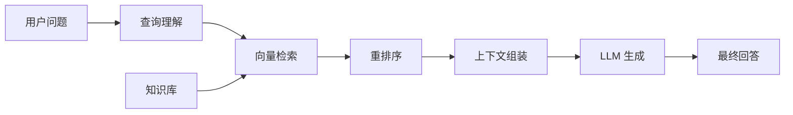

---
tags:
  - RAG
  - 检索增强
  - 知识库
created: 2026-03-07
updated: 2026-03-07
---

# RAG 架构核心概念

## 📌 什么是 RAG

RAG（Retrieval-Augmented Generation，检索增强生成）是一种结合信息检索和文本生成的混合架构，通过从外部知识库检索相关信息来增强 LLM 的回答能力。

### 核心公式

```
RAG = 检索器 (Retriever) + 生成器 (Generator)
```

### 核心价值

- 📚 **知识注入** - 接入私有知识库
- 🔄 **实时更新** - 无需重新训练即可更新知识
- 🎯 **精准回答** - 基于检索证据，减少幻觉
- 💰 **成本降低** - 减少模型参数量需求

## 🏗️ RAG 架构组成

### 完整架构图



### 核心组件

#### 1. 查询理解（Query Understanding）

**功能**：
- 查询改写（Rewrite）
- 意图识别
- 关键词提取
- 查询扩展

**示例**：
```
原始查询："怎么退货？"
改写后："电商平台的退货流程和政策是什么？"
```

#### 2. 检索器（Retriever）

**类型对比**：

| 类型 | 原理 | 优点 | 缺点 |
|------|------|------|------|
| **稠密检索** | 向量相似度 | 语义匹配 | 计算成本高 |
| **稀疏检索** | TF-IDF/BM25 | 快速、精确匹配 | 无法理解语义 |
| **混合检索** | 稠密 + 稀疏 | 兼顾两者 | 系统复杂 |

**常见向量数据库**：
- Milvus
- Pinecone
- Weaviate
- Chroma
- Qdrant

#### 3. 重排序（Re-ranking）

**目的**：对初筛结果精细化排序

**方法**：
- Cross-Encoder 模型
- LLM 重排序
- 规则加权

**效果提升**：通常可提升 10-20% 的检索质量

#### 4. 上下文组装（Context Assembly）

**策略**：
- 截断策略（最大长度限制）
- 去重处理
- 相关性过滤
- 窗口滑动

## 📊 RAG vs Fine-tuning

| 维度 | RAG | Fine-tuning |
|------|-----|-------------|
| **知识更新** | 实时更新 | 需重新训练 |
| **数据需求** | 文档即可 | 标注数据 |
| **幻觉问题** | 较少 | 仍存在 |
| **可解释性** | 可追溯来源 | 黑盒 |
| **初始成本** | 低 | 高 |
| **运维成本** | 中 | 低 |
| **适用场景** | 知识密集型 | 任务密集型 |

### 选择建议

```
选择 RAG：
- 知识频繁更新
- 需要可解释性
- 有现成文档库

选择微调：
- 任务模式固定
- 领域术语多
- 对延迟敏感
```

## 🔧 RAG 关键技术

### 1. 文档切分（Chunking）

**切分策略**：

| 方法 | 说明 | 适用场景 |
|------|------|----------|
| **固定长度** | 按 token 数切分 | 通用场景 |
| **语义切分** | 按段落/章节 | 结构化文档 |
| **递归切分** | 多级切分 | 复杂文档 |
| **句子切分** | 按句子边界 | 短文本 |

**最佳实践**：
```yaml
chunk_size: 512 tokens
chunk_overlap: 50 tokens  # 10% 重叠
方法：递归语义切分
```

### 2. 嵌入模型（Embedding）

**主流模型对比**：

| 模型 | 维度 | 中文效果 | 速度 |
|------|------|----------|------|
| text-embedding-3-large | 3072 | ⭐⭐⭐⭐⭐ | ⭐⭐⭐ |
| text-embedding-3-small | 1536 | ⭐⭐⭐⭐ | ⭐⭐⭐⭐ |
| m3e-base | 768 | ⭐⭐⭐⭐⭐ | ⭐⭐⭐⭐⭐ |
| bge-large-zh | 1024 | ⭐⭐⭐⭐⭐ | ⭐⭐⭐⭐ |

**选择建议**：
- 中文场景：m3e-base 或 bge-large-zh
- 多语言：text-embedding-3
- 资源有限：small 版本

### 3. 查询改写（Query Rewriting）

**方法**：

1. **同义扩展**
   ```
   原查询："价格"
   扩展后："价格 OR 费用 OR 成本 OR 多少钱"
   ```

2. **假设性问题（HyDE）**
   ```
   原查询："如何重置密码"
   生成假设答案："重置密码的步骤是..."
   用假设答案的向量进行检索
   ```

3. **多查询生成**
   ```
   原查询："产品怎么样"
   生成：
   - "产品的质量如何"
   - "用户评价好吗"
   - "有什么优缺点"
   ```

### 4. 上下文压缩

**目的**：在有限 context window 内最大化信息量

**方法**：
- LLM 摘要
- 关键句提取
- 相关片段选择

## 📈 评估指标

### 检索质量评估

| 指标 | 说明 | 计算方式 |
|------|------|----------|
| **Recall@K** | 前 K 个结果中相关比例 | 相关结果数/K |
| **Precision@K** | 前 K 个结果的相关性 | 相关结果数/返回总数 |
| **NDCG@K** | 考虑排序质量的指标 | 折损累积增益 |
| **MRR** | 第一个相关结果的位置 | 1/排名 |

### 生成质量评估

| 指标 | 说明 | 评估方法 |
|------|------|----------|
| **忠实度** | 是否基于检索内容 | 人工审核 |
| **相关性** | 是否回答问题 | 人工评分 |
| **完整性** | 是否覆盖要点 | 检查清单 |
| **流畅性** | 语言是否通顺 | 人工感知 |

### 端到端评估

**RAGAS 框架**：
- Faithfulness（忠实度）
- Answer Relevance（答案相关性）
- Context Relevance（上下文相关性）
- Context Recall（上下文召回率）

## 🛠️ 技术栈推荐

### 入门级（快速验证）

```yaml
嵌入模型：m3e-base
向量库：Chroma（本地）
检索：BM25 + 向量混合
LLM: Qwen API
框架：LangChain
```

### 进阶级（生产环境）

```yaml
嵌入模型：bge-large-zh
向量库：Milvus
检索：多路召回 + Cross-Encoder 重排
LLM: Qwen-72B
框架：LlamaIndex
监控：LangSmith
```

### 企业级（大规模）

```yaml
嵌入模型：text-embedding-3-large
向量库：Milvus 集群
检索：分层检索 + 多阶段重排
LLM: 私有化部署
框架：自研
监控：全链路追踪
```

## ⚠️ 常见挑战与解决方案

### 挑战 1：检索不相关

**原因**：
- 查询表述不清
- 嵌入模型不匹配
- 文档切分不合理

**解决方案**：
- 查询改写和扩展
- 更换嵌入模型
- 优化切分策略
- 引入混合检索

### 挑战 2：上下文超长

**原因**：
- 检索结果过多
- 文档片段过长

**解决方案**：
- 上下文压缩
- 选择性阅读
- 分段生成后合并

### 挑战 3：知识冲突

**原因**：
- 不同文档信息矛盾
- 知识库过时

**解决方案**：
- 时间权重
- 来源可信度评分
- 标注冲突信息

### 挑战 4：延迟过高

**原因**：
- 检索耗时长
- 重排序复杂

**解决方案**：
- 向量索引优化（HNSW）
- 缓存热门查询
- 异步检索

## 🔗 相关链接

- [[03-RAG 架构/02-实战案例\|RAG 实战案例]]
- [[03-RAG 架构/03-评估优化\|RAG 评估优化]]
- [[08-技术栈/03-向量数据库\|向量数据库对比]]

## 📚 参考资料

- [RAG 原始论文](https://arxiv.org/abs/2005.11401)
- [LangChain RAG 文档](https://python.langchain.com/docs/use_cases/question_answering/)
- [LlamaIndex 最佳实践](https://docs.llamaindex.ai/)
- [RAGAS 评估框架](https://github.com/explodinggradients/ragas)

---

**创建时间**: 2026-03-07  
**最后更新**: 2026-03-07  
**标签**: #RAG #检索增强 #知识库
