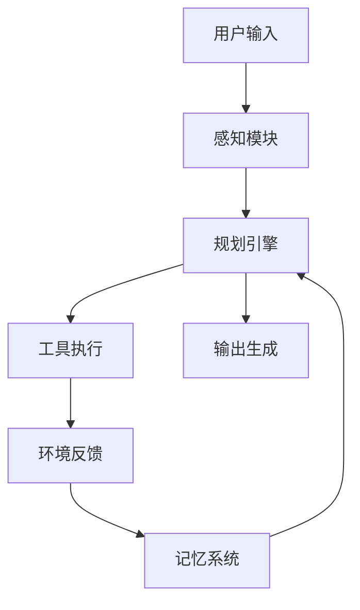

---
tags:
  - Agent
  - 智能体
  - 自主系统
created: 2026-03-07
updated: 2026-03-07
---

# Agent 智能体核心概念

## 📌 什么是 AI Agent

AI Agent（智能体）是能够感知环境、进行决策并执行行动的自主系统，它通过组合 LLM 的推理能力和外部工具的执行能力来完成复杂任务。

### 核心公式

```
Agent = LLM（大脑） + 规划能力 + 工具使用 + 记忆系统
```

### Agent vs 传统程序

| 维度 | 传统程序 | AI Agent |
|------|----------|----------|
| **决策方式** | 预设规则 | 自主推理 |
| **灵活性** | 低 | 高 |
| **适应性** | 弱 | 强 |
| **可解释性** | 高 | 中 |
| **可靠性** | 高 | 中 |

## 🧠 Agent 核心架构

### 完整架构图



### 四大核心组件

#### 1. 规划引擎（Planning）

**核心能力**：
- 任务分解（Task Decomposition）
- 步骤排序（Sequential Ordering）
- 反思调整（Reflection）
- 异常处理（Error Handling）

**示例**：
```
任务："帮我分析竞品并生成报告"

分解：
1. 确定竞品列表
2. 收集竞品信息
3. 对比核心功能
4. 分析优劣势
5. 生成报告文档
```

#### 2. 工具使用（Tool Use）

**工具类型**：

| 类型 | 示例 | 调用方式 |
|------|------|----------|
| **搜索工具** | Google API, Bing | HTTP 请求 |
| **计算工具** | 计算器，代码解释器 | 代码执行 |
| **数据工具** | 数据库，API | SQL/REST |
| **文件工具** | 读写文件，Office | 系统调用 |
| **专业工具** | 图像识别，语音 | 专用 API |

**工具描述格式**：
```json
{
  "name": "search_web",
  "description": "搜索互联网获取信息",
  "parameters": {
    "query": {
      "type": "string",
      "description": "搜索关键词"
    }
  }
}
```

#### 3. 记忆系统（Memory）

**记忆类型**：

| 类型 | 作用 | 实现方式 |
|------|------|----------|
| **短期记忆** | 当前对话上下文 | Context Window |
| **长期记忆** | 持久化知识 | 向量数据库 |
| **程序记忆** | 技能和习惯 | Fine-tuning |

**记忆管理策略**：
- 重要性评分（决定保留什么）
- 定期总结（压缩记忆）
- 相关性检索（按需调用）

#### 4. 行动执行（Action）

**执行模式**：
- 顺序执行
- 并行执行
- 条件执行
- 循环执行

## 🤖 Agent 设计模式

### 1. ReAct（Reasoning + Acting）

**核心思想**：交替进行推理和行动

**执行流程**：
```
Thought: 我需要先了解用户的具体需求
Action: 询问用户详细信息
Observation: 用户回复了需求
Thought: 现在可以开始执行任务
Action: 调用相应工具
...
```

**适用场景**：
- 需要多步骤推理
- 依赖外部信息
- 交互式任务

### 2. Plan-and-Execute

**核心思想**：先制定完整计划，再逐步执行

**执行流程**：
```
Step 1: 制定计划
  - 分析任务
  - 生成步骤清单
  - 确定依赖关系

Step 2: 执行计划
  - 按顺序执行
  - 监控进度
  - 处理异常

Step 3: 总结输出
  - 汇总结果
  - 生成报告
```

**适用场景**：
- 复杂多步骤任务
- 可预先规划
- 对可靠性要求高

### 3. Reflexion（反思）

**核心思想**：通过自我反思持续改进

**执行流程**：
```
执行任务 → 评估结果 → 反思不足 → 调整策略 → 重新执行
```

**反思维度**：
- 策略是否有效
- 工具选择是否合适
- 是否有更好的方法
- 如何避免同样错误

### 4. Multi-Agent（多智能体）

**核心思想**：多个 Agent 协作完成复杂任务

**协作模式**：

| 模式 | 说明 | 示例 |
|------|------|------|
| **层级式** | 一个主 Agent 协调多个子 Agent | 项目经理 + 开发工程师 |
| **流水线式** | 任务依次传递给不同 Agent | 调研→分析→写作→审核 |
| **竞争式** | 多个 Agent 独立解决，择优选择 | 多个方案对比 |
| **协作式** | 平等协作，共同决策 | 头脑风暴 |

**OpenClaw 中的应用**：
```
xiaoxia（主 Agent）
├── product-agent（产品专家）
├── tech-agent（技术专家）
├── test-agent（测试专家）
└── coordinator（协调员）
```

## 📊 Agent 能力评估

### 评估维度

| 维度 | 指标 | 评估方法 |
|------|------|----------|
| **规划能力** | 任务分解合理性 | 人工评审 |
| **工具使用** | 工具选择准确率 | 执行成功率 |
| **记忆效果** | 信息检索准确性 | 召回率/准确率 |
| **执行效率** | 任务完成时间 | 平均耗时 |
| **可靠性** | 任务完成率 | 成功/失败比 |
| **自主性** | 人工干预频率 | 干预次数/任务 |

### 基准测试

**知名评测**：
- AgentBench
- WebArena
- Mind2Web
- GAIA

## 🛠️ Agent 开发框架

### 主流框架对比

| 框架 | 语言 | 特点 | 适用场景 |
|------|------|------|----------|
| **LangChain** | Python/JS | 生态丰富 | 通用 |
| **LlamaIndex** | Python | RAG 友好 | 知识库 |
| **AutoGen** | Python | 多 Agent | 协作场景 |
| **CrewAI** | Python | 角色分工 | 团队模拟 |

### 框架选择建议

```
选择 LangChain：
- 需要丰富的工具集成
- 快速原型开发
- 社区支持重要

选择 AutoGen：
- 多 Agent 协作
- 复杂对话场景
- 微软生态

选择 CrewAI：
- 角色定义清晰
- 流程化任务
- 易用性优先
```

## 💡 Agent 应用场景

### 场景 1：智能客服

```
能力：
- 理解用户问题
- 查询知识库
- 调用业务 API
- 生成个性化回复

价值：
- 7×24 小时服务
- 降低人工成本
- 提升响应速度
```

### 场景 2：数据分析助手

```
能力：
- 理解分析需求
- 编写 SQL 查询
- 执行数据分析
- 生成可视化报告

价值：
- 降低分析门槛
- 提升决策效率
- 自动化报告
```

### 场景 3：代码开发助手

```
能力：
- 理解开发需求
- 编写代码
- 运行测试
- 调试修复

价值：
- 提升开发效率
- 降低重复劳动
- 代码质量提升
```

### 场景 4：市场调研 Agent

```
能力：
- 搜索竞品信息
- 整理市场数据
- 分析趋势
- 生成报告

价值：
- 自动化调研
- 信息全面
- 实时更新
```

## ⚠️ 挑战与限制

### 当前局限

1. **长程规划能力弱**
   - 难以完成超过 10 步的复杂任务
   - 容易迷失方向

2. **工具学习成本高**
   - 每个工具需要详细描述
   - 新工具需要适应

3. **错误累积**
   - 早期错误影响后续步骤
   - 难以自我纠正

4. **成本较高**
   - 多轮对话消耗大量 Token
   - 工具调用增加延迟

### 解决方向

- 强化学习提升规划能力
- 自动工具学习
- 反思和纠错机制
- 模型小型化和蒸馏

## 🔗 相关链接

- [[04-Agent 智能体/02-架构设计\|Agent 架构设计]]
- [[04-Agent 智能体/03-实战案例\|Agent 实战案例]]
- [[01-Prompt 工程/01-核心概念\|ReAct Prompting]]

## 📚 参考资料

- [ReAct 论文](https://arxiv.org/abs/2210.03629)
- [LangChain Agents](https://python.langchain.com/docs/modules/agents/)
- [AutoGen 文档](https://microsoft.github.io/autogen/)
- [AgentBench 评测](https://github.com/THUDM/AgentBench)

---

**创建时间**: 2026-03-07  
**最后更新**: 2026-03-07  
**标签**: #Agent #智能体 #自主系统
