# Hermes Agent 多 Agent 协作机制深度调研

> 来源：GitHub 官方仓库、Release Notes、PR #16100/#16081、Issue #344/#299/#9459、官方文档、社区技术博客
> 日期：2026-05-14（v2：案例替换为智能表格，落地步骤对齐实际机制）
> 覆盖版本：v0.12.0 ~ v0.13.0（The Tenacity Release）

## 核心结论

**Hermes 明确支持多 Agent 协作**，且经历了三代架构演进：delegate_task（子代理委派）→ Kanban 看板（持久化多 Profile 协作）→ Agent Profile（可配置固定角色）。当前 v0.13.0 的 Kanban 是主力多 Agent 协作机制。

---

## 一、三代架构演进（通俗版）

用"公司里干活"来类比三代演进：

| 代际 | 机制 | 类比 | 一句话 |
|------|------|------|--------|
| 第一代 | delegate_task | 老板直接派活给临时工 | 干完就散，没有后续 |
| 第二代 | Kanban 看板 | 用项目管理工具（如飞书任务）协作 | 任务持久化，可追踪、可评论、可多轮 |
| 第三代 | Agent Profile（规划中） | 给临时工发工牌，变成固定员工 | 角色可复用，配置可保存 |

### 1.1 第一代：delegate_task（v0.6.0+）

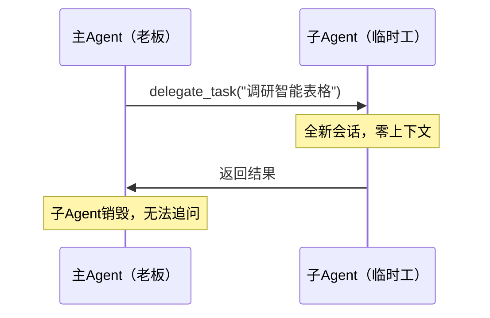

**工作方式**：主Agent像打电话一样，拨给一个临时工，说完就挂。

**限制**：
- 子代理之间不能互相通信
- 子代理无法访问父级记忆
- 子代理挂了无法恢复，工作丢失
- 无人类介入机制
- 父级阻塞等待，无法中途干预

### 1.2 第二代：Kanban 看板（v0.12.0+，推荐）

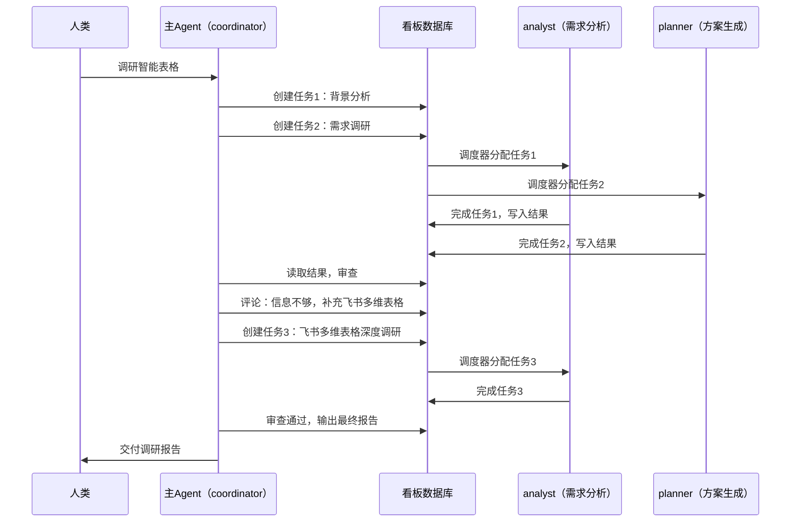

**关键区别**：任务不是"打完电话就消失"，而是**持久化在数据库里**，主Agent随时可以追加评论、创建新任务、多轮迭代。

### 1.3 第三代：Agent Profile（规划中）

为 delegate_task 增加可配置的固定角色定义：

```yaml
agent_profiles:
  explorer:
    model: google/gemini-2.5-flash
    system_prompt_file: ~/.hermes/profiles/explorer.md
    toolsets: [file]
    max_iterations: 30
  oracle:
    model: anthropic/claude-opus-4
    system_prompt_file: ~/.hermes/profiles/oracle.md
    toolsets: [file, web]
  fixer:
    model: meta-llama/llama-4-maverick
    system_prompt_file: ~/.hermes/profiles/fixer.md
    toolsets: [terminal, file]
```

---

## 二、一个任务中主子Agent怎么协作？

以"调研智能表格（多维表格）"为例，完整展示主Agent和子Agent在一个任务中的协作过程。

### 2.1 角色分工

> **注意**：Hermes 没有默认的 Profile 名单。coordinator/analyst/planner/advisor 是本机的配置，不是框架内置。coordinator 必须先用 `hermes profile list` 发现可用的 Profile，再分配任务。

| 角色 | Profile名 | 角色类型 | 职责 | 模型 |
|------|-----------|---------|------|------|
| 主Agent | coordinator | kanban-orchestrator | 拆解任务、分配工作、审查结果、决定是否继续 | M2.7-highspeed |
| 子Agent | analyst | kanban-worker | 需求收集、用户调研、需求拆解、优先级排序 | M2.7-highspeed |
| 子Agent | planner | kanban-worker | 技术方案、实施计划、架构设计、风险评估 | M2.7-highspeed |
| 子Agent | advisor | kanban-worker | 编程指导、代码审查、技术选型、最佳实践 | M2.7-highspeed |

### 2.2 协作的三个通道

主Agent和子Agent之间**不直接对话**，而是通过看板数据库的三个通道协作：

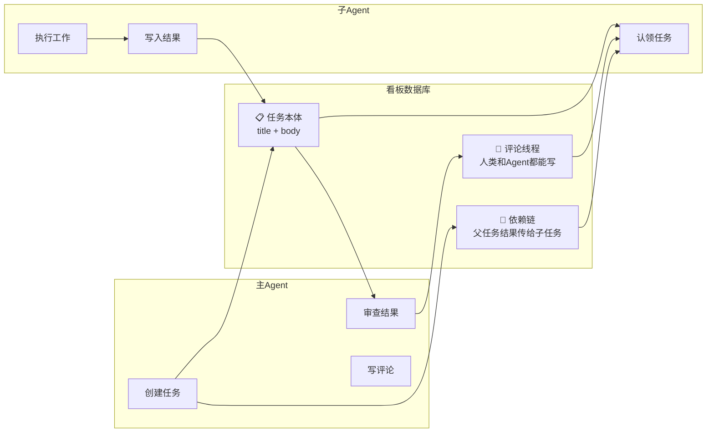

**通俗理解**：

| 通道 | 类比 | 谁写 | 谁读 |
|------|------|------|------|
| 任务本体 | 飞书任务卡片 | 主Agent创建 | 子Agent认领时读取 |
| 评论线程 | 任务下的评论区 | 主Agent、子Agent、人类都能写 | 任何人都能读 |
| 依赖链 | 上游任务的交接文档 | 子Agent完成时自动生成 | 下游子Agent认领时自动读取 |

### 2.3 完整案例：调研智能表格（多维表格）

**第一步：主Agent拆解任务**

用户对 coordinator 说："调研智能表格（多维表格）研发场景"

coordinator 内部思考后，创建3个子任务：

```python
# Step 0: coordinator 必须先发现有哪些 Profile（关键！）
# hermes profile list → 确认本机存在 analyst, planner, advisor

# Step 1: coordinator 创建子任务
t1 = kanban_create(
    title="背景分析：智能表格市场现状",
    body="调研智能表格（多维表格）的市场规模、主要玩家、发展趋势。重点关注飞书多维表格、Airtable、Notion Database、SeaTable等产品的定位差异。",
    assignee="analyst"
)["task_id"]

t2 = kanban_create(
    title="需求调研：目标用户痛点",
    body="调研团队在使用智能表格时的核心痛点。覆盖场景：项目管理、数据看板、表单收集、流程自动化。",
    assignee="analyst"
)["task_id"]

t3 = kanban_create(
    title="竞品分析：4款主流智能表格对比",
    body="对比飞书多维表格、Airtable、Notion Database、SeaTable的核心功能、定价、API能力、自动化程度。",
    assignee="planner",
    parents=[t1]  # 依赖背景分析完成。parents 列表，不是 parent 单值
)["task_id"]
```

**第二步：子Agent执行**

调度器每60秒检查一次，发现3个任务处于ready状态：

```
调度器（Dispatcher）每60秒循环：
1. 扫描 ready 状态的任务
2. 找到 assignee = "analyst" 的任务
3. 启动 analyst Profile 的进程
4. analyst 读取任务本体 + 评论 + 父任务结果
5. analyst 开始执行
```

analyst 认领任务后，执行过程：

```python
# analyst 子Agent执行的动作
task = kanban_show("t_bg_analysis")

# 执行调研工作...（搜索、阅读、整理）

# 中途上报进度
kanban_heartbeat(note="已完成市场数据收集，正在整理主要玩家信息")

# 完成任务，写入结果
kanban_complete(
    summary="智能表格市场现状：2025年全球市场规模约120亿美元，主要玩家包括飞书多维表格、Airtable、Notion、SeaTable...",
    metadata={
        "market_size": "120亿美元",
        "key_players": ["飞书多维表格", "Airtable", "Notion Database", "SeaTable"],
        "growth_rate": "28%"
    }
)
```

**第三步：主Agent审查结果**

主Agent看到任务完成后，读取结果并判断：

```python
# coordinator 审查
result = kanban_show("t_bg_analysis")

# coordinator 判断：信息不够，缺少飞书多维表格与Airtable的深度对比
# → 在任务下追加评论
kanban_comment(
    task_id=t1,
    body="分析不错，但缺少飞书多维表格与Airtable的功能深度对比。请补充：字段类型、视图能力、自动化能力的差异。")

# → 创建新一轮任务
kanban_create(
    title="补充调研：飞书多维表格 vs Airtable 深度对比",
    body="基于之前的背景分析，补充飞书多维表格与Airtable的深度对比。之前的结论在父任务的summary中。",
    assignee="analyst",
    parents=[t1]  # 依赖背景分析任务
)
```

**第四步：子Agent继续执行第二轮**

analyst 认领新任务时，自动读取到：
- 任务本体（body）："补充飞书多维表格与Airtable的深度对比..."
- 评论线程：coordinator 的反馈 "缺少功能深度对比"
- 父任务结果：第一轮的 summary + metadata

```python
# analyst 子Agent第二轮执行
task = kanban_show("t_feishu_vs_airtable")

# 执行补充调研...

kanban_complete(
    summary="飞书多维表格 vs Airtable对比：飞书在流程自动化和国内生态上占优，Airtable在API丰富度和第三方集成上更强...",
    metadata={
        "feishu_pros": ["流程自动化强", "国内生态", "免费额度高"],
        "airtable_pros": ["API丰富", "第三方集成多", "模板生态成熟"]
    }
)
```

**第五步：主Agent最终交付**

```python
# coordinator 读取所有任务结果
bg = kanban_show("t_bg_analysis")
req = kanban_show("t_user_needs")
compete = kanban_show("t_feishu_vs_airtable")
analysis = kanban_show("t_competitor")

# 判断：信息充足，可以输出最终报告
# 输出给用户
```

### 2.4 协作流程全图

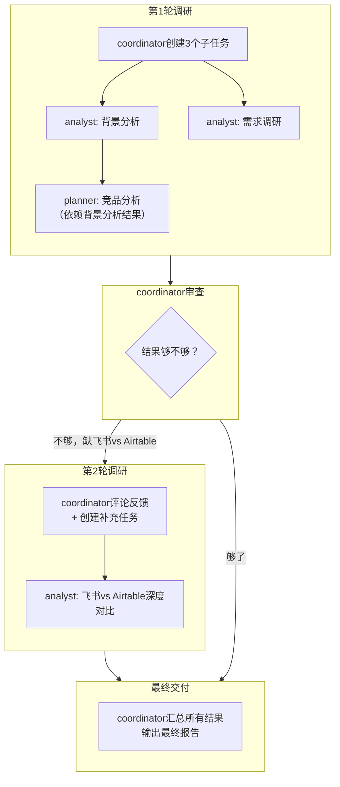

### 2.5 关键问题：分析阶段发现调研不够，能不能回头补调研？

**能。** 有两条路径，区别在于紧急程度：

| 路径 | 子Agent动作 | 主Agent动作 | 适用场景 |
|------|-----------|-----------|----------|
| **评论反馈** | `kanban_comment()` | 看到评论后创建新调研任务 | 不紧急，分析可以先写一部分 |
| **阻塞等待** | `kanban_block()` | 创建新调研任务 + 完成后解除阻塞 | 紧急，没有调研结果分析没法做 |

**关键约束**：子Agent不能直接给其他Agent派任务——只有 coordinator 才能调用 `kanban_create()`。子Agent只能"喊缺东西"，coordinator 决定补不补。

#### 完整案例：产品调研（背景→产品→分析，多轮迭代）

用户说："调研智能表格（多维表格）"

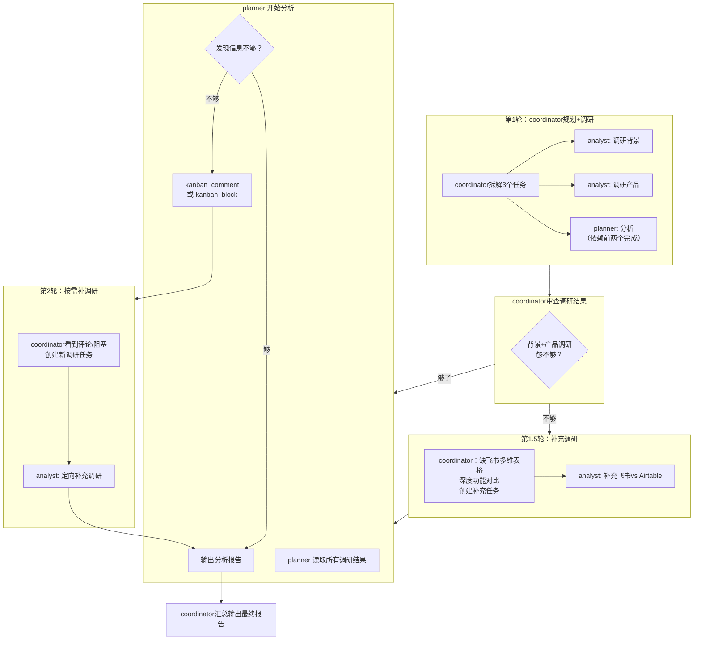

**代码：planner 发现调研不够时**

```python
# planner 子Agent开始分析
task = kanban_show("t_analysis")

# 读取上游调研结果
bg = kanban_show("t_bg_analysis")
product = kanban_show("t_product_research")

# 判断：缺少API能力对比，无法做技术选型
# 路径1：不紧急，先写能写的部分，评论反馈
kanban_comment(
    task_id=os.environ["HERMES_KANBAN_TASK"],
    body="缺少各产品的API能力对比，无法完成技术选型分析。建议补充：飞书多维表格/Airtable/Notion的API限制、Webhook支持、自动化程度。")

# 路径2：紧急，没有API对比没法做技术选型，阻塞等待
kanban_block(reason="需要补充各产品API能力对比才能完成技术选型分析")
```

**coordinator 看到评论或阻塞后**

```python
# coordinator 监控时发现 planner 的评论/阻塞
# 创建补充调研任务
kanban_create(
    title="补充调研：智能表格API能力对比",
    body="planner反馈缺少API能力信息。请调研飞书多维表格、Airtable、Notion的API限制、Webhook支持、自动化程度。",
    assignee="analyst",
    parents=[t_product]  # 依赖产品调研任务
)

# 如果 planner 是 block 状态，调研完成后解除阻塞
kanban_comment(task_id=t_analysis, body="API能力对比已补充，请继续分析。")
```

**planner 恢复执行**

```python
# planner 读到 coordinator 的评论 + 新的调研结果
api_compare = kanban_show("t_api_research")

# 继续完成分析
kanban_complete(summary="智能表格技术选型分析报告：飞书多维表格适合国内生态场景，Airtable适合需要丰富API集成的场景...")
```

#### 规律总结

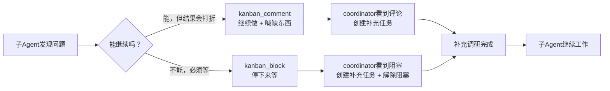

---

## 三、Kanban 架构详解

### 3.1 整体架构

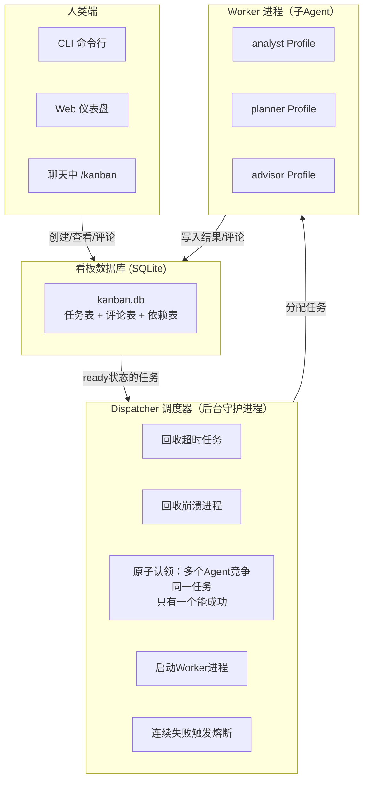

### 3.2 九个核心工具

主Agent和子Agent通过以下9个工具与看板交互：

| 工具 | 谁用 | 做什么 | 类比 |
|------|------|--------|------|
| `kanban_create()` | coordinator | 创建新任务，返回 `{"task_id": "..."}`。`parents=[...]` 设置依赖 | 在飞书建任务 |
| `kanban_show()` | 子Agent/coordinator | 读取任务详情+评论+历史运行记录 | 打开任务卡片 |
| `kanban_complete()` | 子Agent | 标记完成+写入 `summary` + `metadata`。`created_cards=[...]` 声明本运行创建的子任务（幻觉门控） | 任务点完成+写总结 |
| `kanban_comment()` | 任何人 | `task_id` + `body` 在任务下评论 | 任务评论区留言 |
| `kanban_block()` | 子Agent | `reason="..."` 阻塞任务，等人类/协调者介入 | 求助：这个问题需要确认 |
| `kanban_heartbeat()` | 子Agent | `note="..."` 上报进度 | 在任务里更新进度 |
| `kanban_link()` | coordinator | `parent_id` + `child_id` 建立任务依赖（补充方式，也可在 create 时用 parents） | 设置前置任务 |
| `kanban_list()` | coordinator | 按条件列出任务，可用于验证 assignee 是否存在 | 查看任务列表 |
| `kanban_unblock()` | coordinator/人类 | 解除阻塞，重新 spawn worker | 开绿灯继续 |

### 3.3 任务状态流转

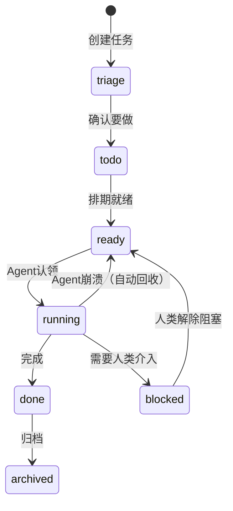

| 状态 | 中文 | 说明 |
|------|------|------|
| triage | 待分类 | 刚创建的草稿 |
| todo | 待办 | 确认要做，还没排期 |
| ready | 就绪 | 可被调度器分配给Agent |
| running | 进行中 | Agent正在干活 |
| blocked | 阻塞 | 需要人类确认后才能继续 |
| done | 已完成 | Agent已写入结果 |
| archived | 已归档 | 不再显示 |

关键规则：
- 父任务 done → 子任务自动从 todo 变为 ready（通过 `parents=[...]` 设置的依赖链）
- Agent崩溃 → 任务自动回到 ready（另一个Agent可以接手，dispatcher 自动 reclaim）
- 连续失败超阈值 → 任务标记 gave_up（熔断，等人类处理）
- assignee 不存在的任务 → 永远停在 ready（dispatcher 不报错，静默跳过）
- `kanban_complete(created_cards=[...])` → 幻觉门控：如果声明的 task_id 不存在或不是本 Profile 创建的，complete 会被拒绝

---

## 四、Profile 机制（固定Agent角色）

### 4.1 Profile 是什么

Profile 是一个**独立的Agent实例**，类比为一个员工：

| 维度 | Profile的独立性 | 类比 |
|------|-----------------|------|
| 配置 | 独立 `config.yaml` | 员工的岗位设置 |
| 密钥 | 独立 `.env` | 员工的门禁卡 |
| 人格 | 独立 `SOUL.md` | 员工的性格/工作方式 |
| 记忆 | 独立 memories 目录 | 员工的笔记本 |
| 会话 | 独立 sessions | 员工的聊天记录 |
| 技能 | 独立 skills | 员工掌握的工具 |

### 4.2 实际落地步骤（对齐 Hermes v0.13.0 + GitHub 源码）

> 技能源码位置：`skills/devops/kanban-orchestrator/` 和 `skills/devops/kanban-worker/`（[GitHub](https://github.com/NousResearch/hermes-agent/tree/main/skills/devops)）

```bash
# 1. 创建4个Profile
hermes profile create coordinator
hermes profile create analyst
hermes profile create planner
hermes profile create advisor

# 2. 为各Profile写入SOUL.md
# coordinator → kanban-orchestrator角色：分解目标→分配任务→审查结果→决定是否继续
# analyst → kanban-worker角色：需求收集、用户调研、需求拆解
# planner → kanban-worker角色：技术方案、实施计划、架构设计
# advisor → kanban-worker角色：编程指导、代码审查、技术选型

# 3. 安装技能
# kanban-orchestrator/kanban-worker 是bundled技能，dispatcher自动加载
# 如需额外技能：
hermes -p analyst skills install web-search summarize
hermes -p planner skills install web-search summarize

# 4. 配置模型
hermes -p coordinator model    # 选择 M2.7-highspeed（便宜，做调度够用）
hermes -p analyst model        # 选择 M2.7-highspeed
hermes -p planner model        # 选择 M2.7-highspeed
hermes -p advisor model        # 选择 M2.7-highspeed

# 5. 初始化看板
hermes -p coordinator kanban init

# 6. 启动协作
coordinator chat
```

启动后，在 coordinator 的聊天中描述任务：

```
/kanban 创建"智能表格调研"项目

目标：调研智能表格（多维表格）市场现状和竞品

角色分工：
- analyst：负责背景分析、用户痛点调研
- planner：基于调研结果做竞品分析和技术选型
- advisor：审查技术选型方案，提供最佳实践建议

任务流程：
1. analyst 完成背景分析和需求调研后，自动触发 planner 做竞品分析
2. planner 完成竞品分析后，自动触发 advisor 审查
3. advisor 审查完成后，我来整合结果
```

**重要**：coordinator 在规划任务前必须先执行 `hermes profile list` 确认可用的 Profile。dispatcher 不会自动纠正不存在的 assignee 名——如果给一个不存在的 Profile 分配任务，任务会永远停在 `ready` 状态。

### 4.3 Kanban 内置的两个技能模板

| 技能 | 给谁用 | 做什么 |
|------|--------|--------|
| **kanban-orchestrator** | coordinator | 分解目标→分配任务→审查结果→决定是否继续。核心规则："Do not execute the work yourself"。必须先用 `hermes profile list` 发现可用 Profile 再分配 |
| **kanban-worker** | analyst/planner/advisor | 6步生命周期：orient → work → heartbeat → block/complete。`kanban_block(reason="...")` 阻塞等待，`kanban_complete(summary=..., metadata=..., created_cards=[...])` 完成交接 |

---

## 五、八大协作模式（带案例）

| 模式 | 结构 | 具体案例 |
|------|------|----------|
| **P1 扇出** | N个同角色并行 | 3个analyst同时调研3款智能表格，结果汇总给coordinator |
| **P2 流水线** | 角色链，串行执行 | analyst调研 → planner分析 → advisor审查 |
| **P3 投票** | N个兄弟 + 1个聚合器 | 3个analyst各写一份调研方案 → coordinator选最佳 |
| **P4 人在环中** | block → 人类确认 → 继续 | planner遇到"选飞书多维表格还是Airtable"→ block → 人类选择 → 继续 |
| **P5 长期任务** | 定时触发 + 共享目录 | 每天自动调研智能表格行业动态 → 写入Obsidian vault |
| **P6 @mention路由** | 任务描述中指定执行者 | 任务body中写"@analyst 请调研飞书多维表格..." |
| **P7 聊天即看板** | 聊天中直接操作 | 用户在聊天中说"/kanban list"查看进度 |
| **P8 混合模式** | Kanban + delegate_task | Kanban做整体协调，Worker内部用delegate_task做子推理 |

### 案例一：P1扇出——并行调研3款智能表格

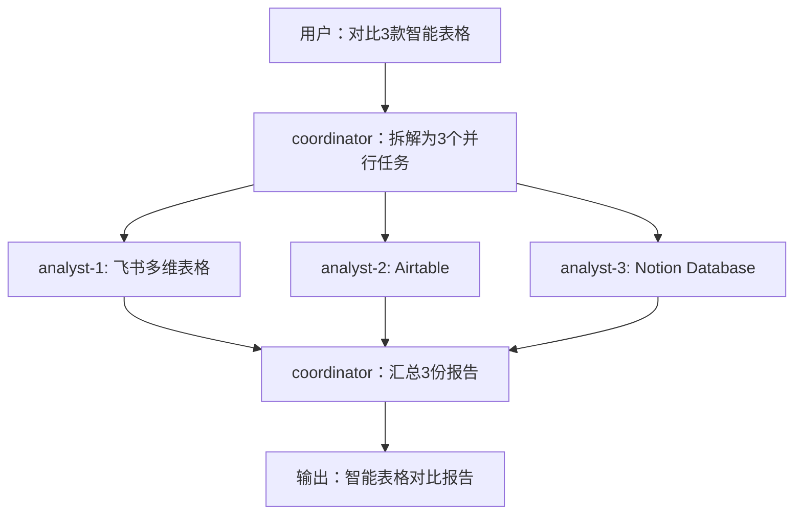

### 案例二：P2流水线——智能表格调研分析

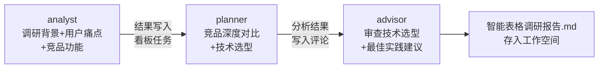

### 案例三：P4人在环中——需要人类决策

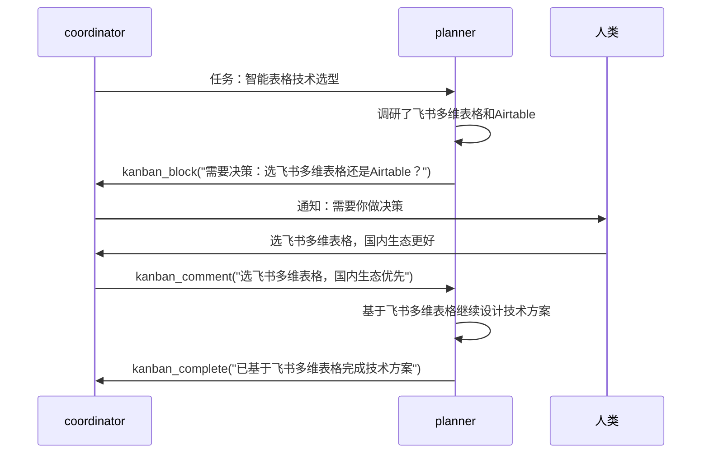

---

## 六、Kanban vs delegate_task 选型指南

| 维度 | delegate_task | Kanban |
|------|--------------|--------|
| 形态 | 打电话（同步，打完就挂） | 发飞书任务（异步，持续追踪） |
| 父级 | 阻塞等结果 | 做其他事，定期查看 |
| 子进程 | 临时工，干完就走 | 正式员工（Profile），有名字有记忆 |
| 可恢复 | 挂了就是挂了 | 崩溃后自动回收，另一个Agent接手 |
| 人类介入 | 不支持 | 随时评论/解除阻塞 |
| 多轮迭代 | 不支持 | coordinator可反复创建任务、评论反馈 |
| 审计日志 | 上下文压缩后丢失 | SQLite 永久保存 |

**选型判断**：需要多轮迭代或人类介入？→ 用 Kanban。简单的一次性任务？→ 用 delegate_task。

---

## 七、与 OpenClaw 多 Agent 的对比

| 维度 | Hermes Agent | OpenClaw |
|------|-------------|----------|
| 架构 | 编排者-工作者（协作式） | 隔离 Agent + 消息路由 |
| Agent 通信 | 结构化消息传递（typed result objects） | 设计上不跨 Agent 通信 |
| 派生方式 | 自然语言或 CLI | 预配置 openclaw.json |
| 记忆共享 | 共享 skills 目录 + Honcho | 完全隔离工作空间 |
| 模型分配 | 每个 Profile 可配不同模型 | 每个 Agent 定义 model 字段 |
| 并发控制 | 可配置限制 | 受限于硬件 |
| 适用场景 | 需要协调的复杂任务 | 需要数据隔离的独立角色 |

---

## 八、调研信息源

| # | 来源 | 类型 | 关键信息 |
|---|------|------|---------|
| 1 | GitHub PR #16100/#16081 | 官方代码 | Kanban 架构设计、SQLite schema、Dispatcher 逻辑 |
| 2 | GitHub Issue #344 | 官方规划 | 多 Agent 架构愿景、角色定义、协作模式 |
| 3 | GitHub Issue #9459 | 社区提案 | Agent Profile 配置方案、混合批量委派 |
| 4 | GitHub Issue #299 | 社区需求 | pi-messenger 参考、文件锁定、Agent 发现 |
| 5 | v0.13.0 Release Notes | 官方文档 | 心跳/回收/僵尸检测/幻觉门控 |
| 6 | 官方文档 Profiles 页 | 官方文档 | Profile 创建/克隆/多 Gateway |
| 7 | 官方文档 Delegation 页 | 官方文档 | delegate_task 工作原理、上下文隔离 |
| 8 | Hermes Kanban 完全指南（头条） | 社区文章 | 八大协作模式、避坑指南 |
| 9 | CSDN 深度解析 | 社区文章 | 熔断恢复、运行历史、Python 示例 |
| 10 | Remote OpenClaw 对比 | 第三方评测 | Hermes vs OpenClaw 多 Agent 对比 |
