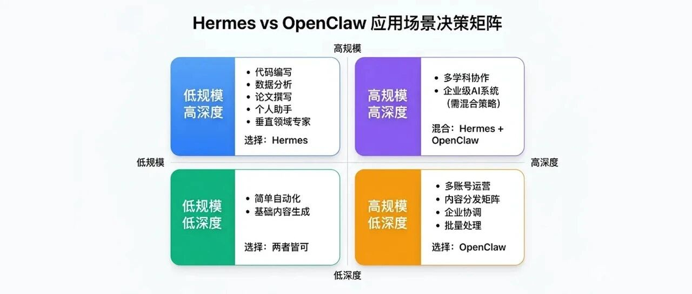
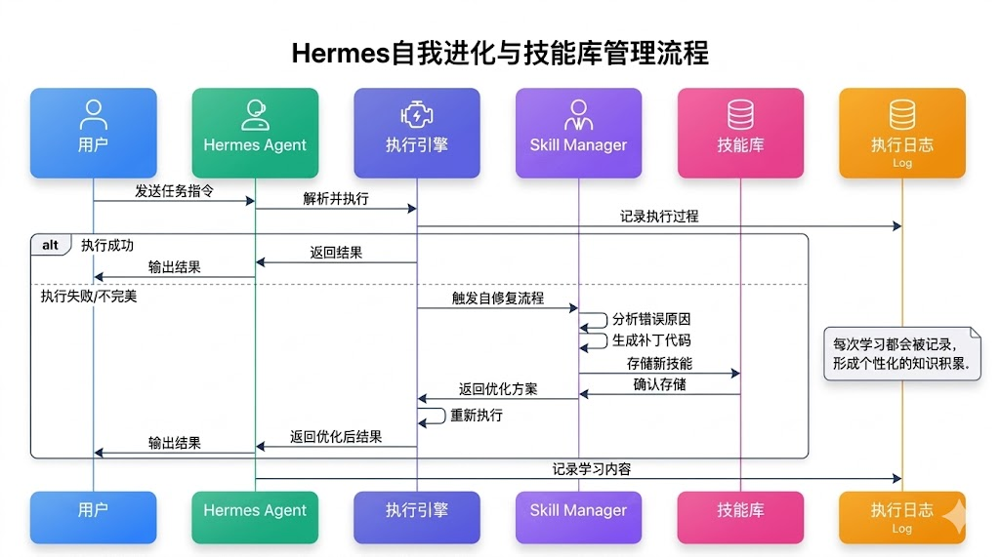
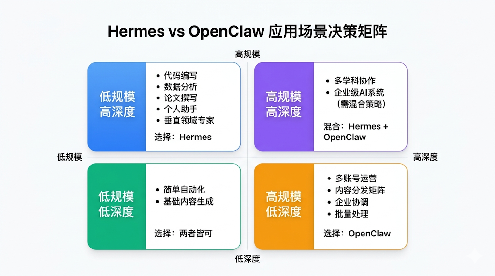

# 全方位对比：Hermes VS OpenClaw

> 来源：微信公众号 - 腾讯云开发者  
> URL：https://mp.weixin.qq.com/s/BCstLeMYEPTk5A4sJp66jA  
> 作者：李伟山  
> 日期：2026-04



---

## 引言：一场不期而遇的王者争夺

2026年2月，当Nous Research悄悄开源Hermes时，没人料到这个看起来普通的AI Agent会在短短7周内掀起技术社区的滔天巨浪。

**关键数据**：
- GitHub星标：84.4k（7周内达成）
- OpenRouter算力榜：从籍籍无名飙升至紧逼KiloCode
- Token消耗日榜：每周翻倍增长

**核心问题**：
- 为什么Hermes的爆炸性增长让整个行业重新审视Agent的发展方向？
- 对于正在技术选型中摇摆不定的开发者们，该如何在Hermes和OpenClaw之间做出正确的决策？

---

## 01 Hermes的七周逆袭

### 1.1 爆炸式增长的数据背后

Hermes在GitHub上的星标增长速度打破了同类项目的纪录，增速甚至超越了当年Stable Diffusion的爆红时期。



**关键洞察**：
- OpenRouter上的Token消耗日榜显示，Hermes的日均使用量呈现每周翻倍的增长趋势
- 数百万开发者在真实生产环境中部署、运行、迭代Hermes
- 每一次Agent的执行、每一次技能的学习，都在消耗算力并产生真实价值

### 1.2 为什么Hermes超越了龙虾？

**OpenClaw的定位**：
- 企业级操作系统
- 集成所有可能的场景（飞书、Discord等）
- 多账号矩阵运营的"唯一解"
- 缺点：系统变得复杂、臃肿

**Hermes的定位**：
- 不追求集成一千个应用
- 通过**自我进化机制**，让一个Agent在用户手中不断学习、不断优化、不断变强
- 深度聚焦，而非大而全

### 1.3 团队基因

Hermes的开发团队包括Jeffrey Quesnelle、Karan Malhotra和Teknium，他们的背景涉及：
- 分布式系统设计
- 大模型后训练优化
- Agent运行时管理

这直接影响了Hermes的核心设计：
- 能处理复杂的并发请求
- 高效的内存管理
- **可写运行时架构**

---

## 02 核心技术对比



### 2.1 Hermes的"可写运行时"：自我进化的引擎

Hermes最革命性的特性是其**"可写运行时"（Writable Runtime）**架构。

**传统Agent vs Hermes**：

| 对比项 | 传统Agent | Hermes |
|--------|-----------|--------|
| 行为模式 | "只读" | "可写" |
| 遇到问题 | 向用户求救或重复踩坑 | 自动生成补丁代码 |
| 技能存储 | 预设固定 | 动态生成并永久存储 |
| 进化能力 | 无 | 有，运行越久越聪明 |

**Hermes具体工作流程**：

```
1. Hermes执行一个任务
2. 遇到了错误或不完美的地方
3. 它调用内置的 skill_manage 工具
4. 自动生成一段补丁代码
5. 这段代码被存储到动态技能库中
6. 同样的问题再出现时，直接调用已有的技能
```

**这个机制的三个超越性意义**：

1. **打破"无限循环"的噩梦**
   - 传统Agent中，同样的错误可能被重复触发成百上千次
   - Hermes通过自修复，让这个问题彻底消失

2. **实现"迁移学习"**
   - 在处理问题时学到的技能，下次遇到相似问题时可以直接复用
   - 运行时间越长，Agent越聪明，消耗的算力却在减少

3. **使个性化成为可能**
   - 每个用户的Hermes都会积累不同的技能库
   - 每个Hermes实例都是独一无二的，每个都是你个人的"数字分身"

### 2.2 OpenClaw的生态帝国

OpenClaw的核心优势在于其**平台生态**：

**多平台集成**：
- 飞书消息处理
- Discord运营
- 微信客服系统
- 上百个账号管理

**技能市场（SkillHub）**：
- 聚合1.3万个+技能
- 腾讯系产品深度集成
- 企业级安全合规

**核心差异总结**：

| 维度 | Hermes | OpenClaw |
|------|--------|----------|
| 核心理念 | 自我进化 | 平台生态 |
| 优势 | 深度学习、个性化 | 广度集成、企业级 |
| 适用场景 | 个人深度使用 | 多账号矩阵运营 |
| 技能来源 | 用户使用中学习 | 预置+市场购买 |

---

## 03 市场与用户体验

### 3.1 用户的选择逻辑

**选择Hermes的用户画像**：
- 需要深度个人化的AI助手
- 愿意投入时间"培养"自己的Agent
- 追求长期价值而非短期便利
- 重视技能的积累和传承

**选择OpenClaw的用户画像**：
- 需要多平台、多账号管理
- 需要快速上手、快速见效
- 需要企业级的安全合规
- 追求规模运营效率

### 3.2 定价策略

| 产品 | 定价 | 说明 |
|------|------|------|
| Hermes | 3.99美元/月 | 相对便宜，强调性价比 |
| OpenClaw | 订阅制 | 平台服务费 |

---

## 04 面临的挑战

### 4.1 Hermes的潜在问题

**1. 过度学习问题**

Hermes过度学习用户的特定工作习惯，导致在处理陌生场景时表现不佳。

**案例**：一个财务Hermes完全适应了某个企业的报表格式，突然换到另一个企业就会出现大量错误。

**需要的解决方案**：在学习的同时保持一定的"通用性"，两者的平衡是关键。

**2. 安全性与隐私**

Agent在学习过程中可能接触敏感信息（用户数据、商业机密等），这些信息可能被不小心存储在技能库中。

**需要的解决方案**：严格的数据隔离、加密存储、访问控制。

### 4.2 Hermes面临的市场风险

**1. 技术更新快速迭代的压力**

Hermes团队需要不断优化底层架构，处理新出现的问题、维护社区生态。如果迭代速度跟不上，可能被其他竞争者超越。

**2. 平台的政策变化**

Hermes严重依赖官方API的稳定性和可用性。如果官方改变政策、调整API，提高接入门槛，Hermes的整个中国市场策略都会受到冲击。

**3. 商业化道路不清晰**

目前Hermes的定价相对便宜（3.99美元/月）。随着用户增加，如何实现健康的盈利模式，是长期生存的关键。如果过度商业化，可能流失用户。

### 4.3 用户可能面临的实际问题

**1. 账号安全风险**

虽然使用官方API相对安全，但高频率的自动化操作仍可能被微信风控识别。用户需要采取保守策略（如使用小号测试）来规避风险。

**2. 学习成本**

虽然Hermes声称"开箱即用"，但要充分利用其自我进化能力，用户需要理解其基本原理，并在使用中有意识地"教会"它。这仍需要一定的学习投入。

**3. 长期投资成本**

要让Hermes成为真正强大的个人助手，需要投入时间进行"培养"。如果中途放弃，之前的投入就浪费了。这对用户的承诺度有要求。

---

## 05 结论：新时代的开启

### 5.1 谁是真正的赢家？

如果问"Hermes和OpenClaw谁是赢家"，答案不是「Hermes胜」或「OpenClaw胜」，而是：**市场的细分化是所有人的胜利**。

| 用户群体 | 获得的价值 |
|---------|-------------|
| Hermes的用户 | 获得了一个真正深度、自我进化的个人AI助手 |
| OpenClaw的用户 | 仍然拥有规模运营的最佳工具 |
| 整个行业 | 从"一家独大"进入"生态多元"，推动整个AI Agent领域进步 |

### 5.2 对中国开发者的启示

**第一：「本地化优先」可以超越「国际化优先」**

Hermes没有追赶美国市场的Slack和Discord生态，而是深入中国市场的微信，结果反而收获了更庞大的用户基数和市场潜力。

这给所有中国创业者一个警示：**不要盲目跟风国际化，深耕本地市场往往有更大的机会**。

**第二：「长期自我进化」可能比「一步到位的完美」更值钱**

OpenClaw试图在上线时就做到"尽可能完美"，而Hermes则是一个相对简洁的开端，通过用户反馈不断进化。

在快速变化的AI时代，后者的策略似乎更聪慧。

**第三：「个人IP资产化」是新的机遇**

Hermes使得个人专家能够将自己的专业知识、工作习惯「资产化」为一个AI助手，进而商业化。

对于有专业背景的个人（医生、律师、工程师、分析师），这打开了全新的收入来源。

### 5.3 未来的想象空间

如果我们从更长远的视角看2026年的这场「Agent大战」，它真正的意义在于：**Agent技术正在从「工具」进化为「伙伴」**。

**过去的AI是工具**：
- 你需要什么，就问它什么，然后得到答案

**未来的AI（Hermes代表的方向）是伙伴**：
- 它会随着时间推移越来越了解你，越来越适应你
- 最终成为你的另一个自己

**这不仅改变了人和AI的关系，也改变了工作和生活的本质**：

| 变化 | 影响 |
|------|------|
| 重复性工作自动化 | 释放人类的创意潜力 |
| 专业知识数字化 | 提升整个社会的专业水平 |
| 个人IP规模化 | 打破地域和时间的限制 |

**Hermes的七周逆袭，恰恰就是这个大转变的开端。**

---

## 延伸阅读

- [Agent从Chat走向Act](../16-Agent从Chat到Act/Agent从Chat走向Act.md)
- [Agent设计模式](../05-提示词工程与RAGAgent/Agent设计模式.md)
- [第一性原理拆解AgenticCoding](./01-第一性原理拆解AgenticCoding.md)
