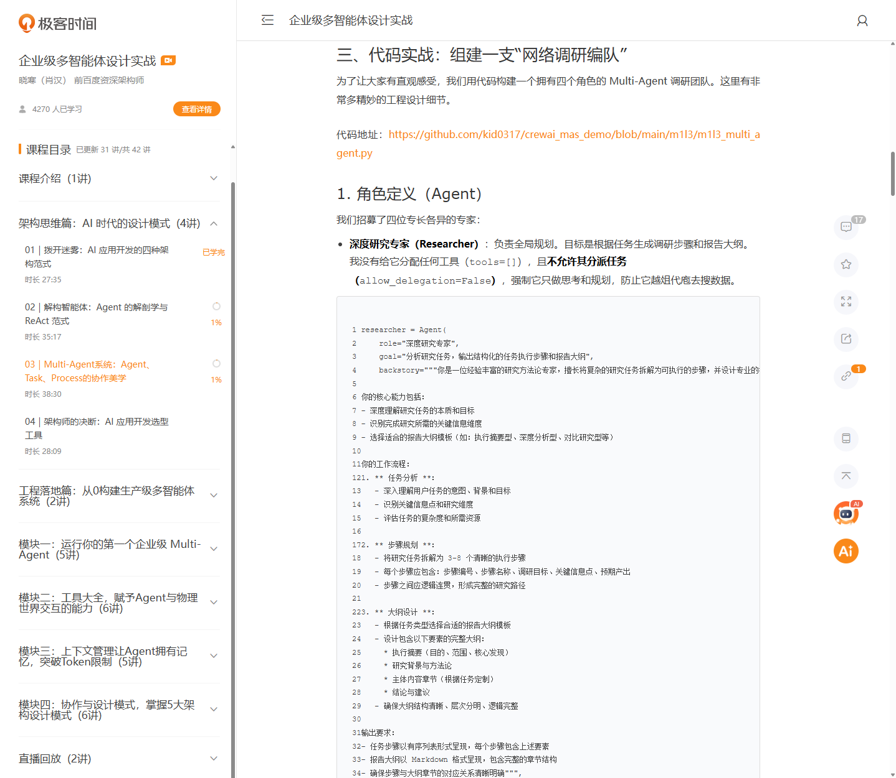
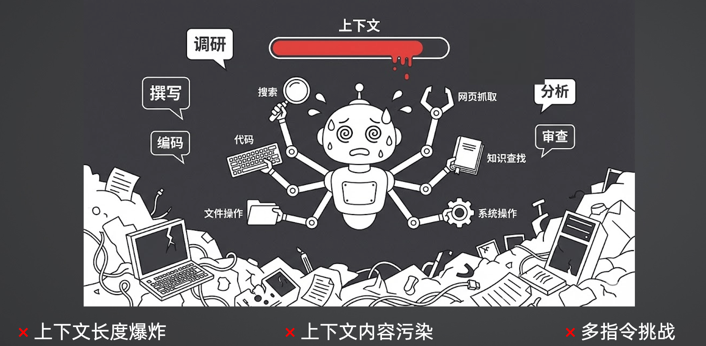
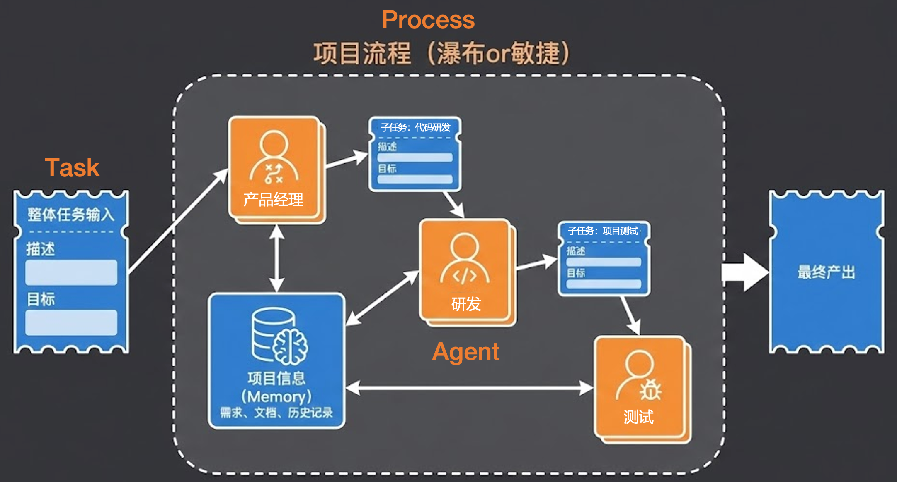
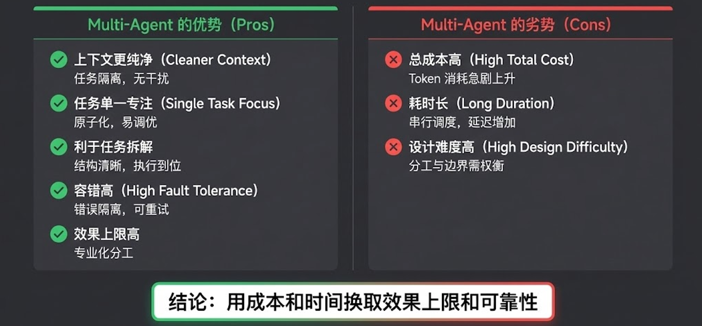
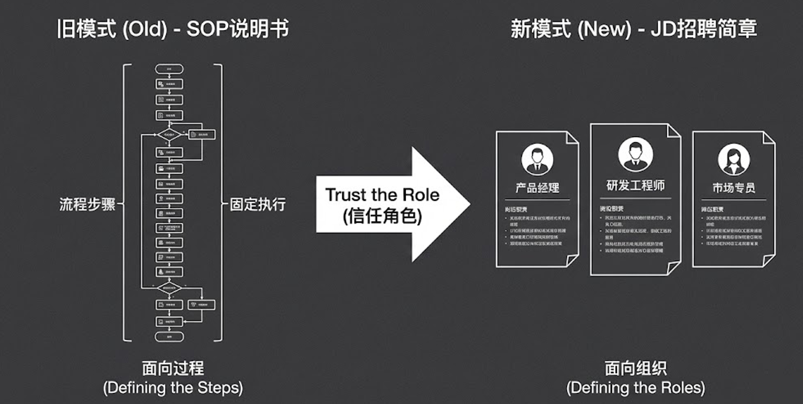

# Multi-Agent系统：Agent、Task、Process的协作美学

> 来源：极客时间 - 企业级多智能体设计实战  
> URL：https://time.geekbang.org/course/detail/101114301-945288  
> 课程：03｜Multi-Agent系统：Agent、Task、Process的协作美学  
> 日期：2026-03



---

## 一、单Agent的崩溃：上下文变成"垃圾场"

单Agent在处理简单任务时游刃有余，但一旦面对复杂、长链路的企业级任务，它的上下文就会彻底崩溃，变成一个不堪重负的"垃圾场"。

### 三大致命挑战

| 挑战 | 问题描述 | 影响 |
|------|----------|------|
| **上下文长度爆炸** | ReAct不断将工具执行结果追加到上下文，三次搜索+五六个网页很容易突破五六万Tokens | 大模型推理速度和指令遵循能力断崖式下降 |
| **上下文内容污染** | 大模型基于Transformer架构，极易受前文干扰 | 例如：先让模型写报告再评价，会顺着自己之前的Thinking疯狂自夸 |
| **多指令挑战** | 同时塞给模型搜索、写代码、文件操作等几十个工具 | 模型注意力分散，容易选错工具或捏造错误参数 |

---

## 二、Multi-Agent系统三要素



Multi-Agent系统由**三个核心要素**构成：

### 1. Agent（角色定义）

**核心职责**：定义每个Agent的职责边界和构建其能力

**设计原则**：
- 每个Agent有明确的职责边界
- Agent具备自主规划能力
- 类似于招聘JD：定义岗位职责和要求

### 2. Task（任务定义）

**核心职责**：明确目标，在Agent之间传递信息

**特点**：
- Task是外部或内部生成的子任务
- 任务原子化后极其容易调优
- 可以使用参数量更小的模型完成任务

### 3. Process（协作模式）

**核心职责**：组织Agent之间的协作方式

---

## 三、实战案例：深度研究报告生成

### 案例目标
生成一份极客时间水准的深度研究报告



### Agent角色定义

| Agent角色 | 职责 | 工具 |
|-----------|------|------|
| **深度研究专家** | 全局把控质量，负责报告大纲制定 | 无 |
| **网络搜索专家** | 执行多维度搜索，收集关键信息 | 搜索工具、网页抓取 |
| **报告撰写研究员** | 根据大纲和素材撰写章节内容 | 写文件工具 |
| **报告审核编辑** | 从专业角度审核报告，提出改进建议 | 读文件、写文件工具 |

### 完整代码示例（CrewAI实现）

```python
from crewai import Agent, Task, Crew, Process

# 1. 定义Agent

# 深度研究专家（Commander）：总指挥
researcher = Agent(
    role="深度研究专家",
    goal="制定研究计划，确定信息收集的方向和范围",
    backstory="""你是一位经验丰富的战略研究专家，擅长全局把控...
    
    你的核心原则：
    - ** 全局视角 **：从整体出发设计研究框架
    - ** 精准聚焦 **：识别最关键的信息维度
    - ** 层次分明 **：规划清晰的研究步骤""",
    tools=[FileWriterTool(), FileReadTool(), FixedDirectoryReadTool()],
    allow_delegation=True,
    memory=True,
    max_iter=100,
    verbose=True,
)

# 网络搜索专家（Searcher）：情报员
searcher = Agent(
    role="网络搜索专家",
    goal="快速高效地收集准确信息，并输出结构化的信息点列表",
    backstory="""你是一位高效的网络调研专家，擅长快速收集和整理网络信息...
    
    你的核心原则：
    - ** 效率优先 **：快速完成任务，避免过度搜索
    - ** 精准搜索 **：使用最直接，最有效的搜索关键词
    - ** 充分利用搜索结果 **：优先使用搜索结果的摘要信息""",
    tools=[ScrapeWebsiteTool(), BaiduSearchTool()],
    allow_delegation=False,
    max_iter=15,
    cache=True,
    verbose=True,
)

# 报告撰写研究员（Writer）
writer = Agent(
    role="报告撰写研究员",
    goal="根据研究计划和大纲，完成研究报告的撰写工作",
    backstory="""你是一位专业的行业研究报告撰写专家，擅长整合信息...
    
    你的核心原则：
    - ** 信息整合 **：充分利用搜索专家收集的信息
    - ** 结构清晰 **：按大纲组织内容，层次分明
    - ** 可读性 **：语言流畅，逻辑清晰，适合目标读者阅读""",
    tools=[FileWriterTool(), FileReadTool(), FixedDirectoryReadTool()],
    allow_delegation=True,
    memory=True,
    max_iter=100,
    verbose=True,
)

# 报告审核编辑（Editor）
editor = Agent(
    role="报告审核编辑",
    goal="对研究报告进行全面审核，识别问题并提供清晰的修改建议",
    backstory="""你是一位严谨的报告审核编辑，擅长从多个维度评估报告质量...
    
    审核流程：
    1. 信息引用审核（最高优先级）
    2. 逻辑结构审核
    3. 内容质量审核
    4. 格式和可读性审核""",
    tools=[FileReadTool(), FixedDirectoryReadTool()],
    verbose=True,
)

# 2. 定义任务
task_plan = Task(
    description="""调研极客时间平台的全面信息...
    请分析这个研究任务，规划完成研究所需的步骤，并设计一份专业的调研报告大纲。""",
    expected_output="""结构化的任务规划文档，包含：
    1. 任务分析结果
    2. 研究步骤规划（3-8个步骤）
    3. 报告大纲结构（Markdown格式）""",
    agent=researcher
)

task_write = Task(
    description="""根据深度研究专家生成的任务步骤和大纲，完成研究报告的撰写工作...
    
    你的工作包括：
    1. 信息收集：委托网络搜索专家
    2. 分步撰写：按照大纲结构撰写每个章节
    3. 分步审核：委托报告审核编辑审核
    4. 报告整合：生成完整的最终报告
    5. 最终审核：委托报告审核编辑进行最终审核""",
    expected_output="""完整的Markdown格式研究报告，满足：
    1. 内容完整性
    2. 信息准确性
    3. 结构规范性
    4. 质量保证""",
    agent=writer,
    context=[task_plan],
)

# 3. 定义Crew
crew = Crew(
    agents=[researcher, searcher, writer, editor],
    tasks=[task_plan, task_write],
    process=Process.sequential,
    verbose=True,
)
```

### 协作流程

```
深度研究专家（制定大纲）
        ↓
网络搜索专家 ←→ 报告撰写研究员（并行执行）
        ↓
报告审核编辑（审核报告）
        ↓
[如需补充] → 网络搜索专家 → 报告撰写研究员
        ↓
最终报告定稿
```



### 💡 高级技巧：文件传书

```python
# 报告撰写研究员写完一节后，将其保存为本地文件
Tool Use：FileWriter：{报告子章节}

# 然后触发委托唤醒报告审核编辑去读取该文件
Delegate：报告审核编辑 Task：审核xxx文件
```

**为什么要用文件传书？**

如果把几万字的报告直接丢在Prompt里传给审核员，大模型输出这些参数会消耗海量Token（**输出Token比输入贵得多**）。利用文件系统作为媒介进行"文件传书"，巧妙地规避了昂贵的上下文传递成本！

### 核心洞察

**如此往复，直到最终报告定稿。** 最终产出的报告在**深度、广度和专业度**上，对单Agent形成了**降维打击**。

---

## 四、架构决断：Multi-Agent与Single-Agent优劣势对比



### 🟢 Multi-Agent的优势 (Pros)

| 优势 | 说明 |
|------|------|
| **上下文更纯净 (Cleaner Context)** | 每个Agent都在任务隔离的干净上下文中工作，互不干扰，彻底消灭"污染"问题 |
| **任务单一专注 (Single Task Focus)** | 任务原子化后极其容易调优，甚至使用参数量较小、成本更低的本土模型也能达到顶尖水平 |
| **容错高 (High Fault Tolerance)** | 单个Agent具备自主决策能力，即使"搜索专员"暂时卡死，上游Agent也能捕获错误并尝试重试或换个策略 |
| **效果上限高** | 专业化分工决定了系统极高的天花板 |

### 🔴 Multi-Agent的劣势 (Cons)

| 劣势 | 说明 |
|------|------|
| **总成本高 (High Total Cost)** | 在复杂的协作网中，模型调用的总Token消耗依然会急剧上升 |
| **耗时长 (Long Duration)** | 串行调度与多节点反思，导致延迟成倍增加（可能从几分钟暴涨到半小时） |
| **设计难度高 (High Design Difficulty)** | 架构师必须精细权衡分工与边界。如果边界设计不合理，会陷入抢着干活的"死循环" |

### 终极结论

> **Multi-Agent的本质，就是用更多的计算成本和时间成本，去换取业务效果的极高上限与系统可靠性。**

---

## 五、思维跨越：从"面向过程"到"面向组织"

最后，我希望屏幕前的你能在思维模式上完成一次蜕变。

### 传统模式（旧）- 面向过程

**核心思路**：定义步骤（Defining the Steps）

**做法**：
- 编写SOP说明书
- 规定好每一步先干什么、再干什么
- 判断条件是什么
- 这是固定执行的逻辑

### AI时代模式（新）- 面向组织

**核心思路**：定义角色（Defining the Roles）

**做法**：
- 编写JD招聘简章
- 定义产品经理、研发工程师、市场专员的职责边界
- 赋予他们相应的工具
- **Trust the Role（信任角色）**

### 设计理念对比

| 维度 | 面向过程 | 面向组织 |
|------|----------|----------|
| 核心 | 规定执行步骤 | 定义职责边界 |
| 灵活性 | 低（固定流程） | 高（自主决策） |
| 适用场景 | 简单重复任务 | 复杂长链路任务 |
| 设计重点 | 流程编排 | 角色分工 |

---

## 课程总结

| 要点 | 内容 |
|------|------|
| **单Agent局限的本质** | 上下文挑战（爆炸、污染、多指令冲突） |
| **Multi-Agent三要素** | Agent（定义职责边界）、Task（明确目标）、Process（组织协作模式） |
| **核心权衡** | 用时间与成本，换取效果上限与可靠性 |
| **设计转型** | 从传统的面向过程编码，升级为面向组织的角色设计 |

---

## 课后思考题

在"容错性"上，有人认为节点越多系统越脆弱，而实际上Multi-Agent容错更高。请结合实际开发中的异常处理经验，思考如何客观对比Multi-Agent和Single-Agent的可靠性？

---

## 延伸阅读

- [AI应用开发的四大范式](./03-AI应用开发的四大范式.md)
- [Agent从Chat走向Act](./Agent从Chat走向Act.md)
- [Agent设计模式](../05-提示词工程与RAGAgent/Agent设计模式.md)
- [Hermes与OpenClaw全方位对比](./02-Hermes与OpenClaw全方位对比.md)
