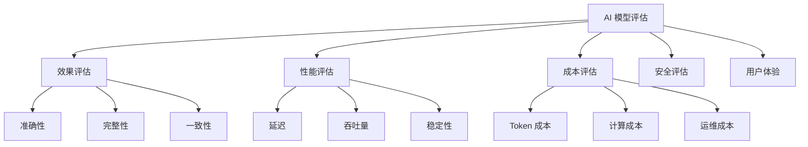

---
tags:
  - 模型评估
  - 效果评估
  - 指标体系
created: 2026-03-07
updated: 2026-03-07
---

# 模型评估核心概念

## 📌 为什么需要评估

模型评估是量化 AI 系统表现、指导优化方向、支撑决策的关键环节。

### 评估的核心价值

- 📊 **量化表现** - 用数据说话，避免主观判断
- 🎯 **定位问题** - 发现薄弱环节，精准优化
- 💰 **ROI 论证** - 证明商业价值，获取资源
- 🔄 **持续改进** - 建立优化闭环

## 📐 评估维度框架

### 完整评估体系



## 📊 效果评估指标

### 1. 准确性（Accuracy）

**定义**：输出结果正确的比例

**计算方法**：
```
准确率 = 正确回答数 / 总问题数 × 100%
```

**评估方式**：
- 人工标注测试集
- 自动化对比（有标准答案时）
- A/B 测试

**行业基准**：
- 简单问答：>95%
- 复杂推理：>85%
- 创意生成：>75%（主观）

### 2. 完整性（Completeness）

**定义**：回答覆盖要点的完整程度

**评估方法**：
```markdown
检查清单法：
- [ ] 要点 1 是否覆盖
- [ ] 要点 2 是否覆盖
- [ ] 要点 3 是否覆盖
- [ ] 是否有遗漏

完整性得分 = 覆盖要点数 / 总要点数 × 100%
```

### 3. 一致性（Consistency）

**定义**：多次生成结果的稳定性

**评估方法**：
```
对同一问题生成 N 次回答
计算语义相似度
一致性 = 平均相似度 × 100%
```

**工具**：
- 向量相似度（Cosine Similarity）
- BLEU/ROUGE（文本重叠度）
- 人工评审

### 4. 相关性（Relevance）

**定义**：回答与问题的相关程度

**评分标准**：
| 分数 | 说明 | 示例 |
|------|------|------|
| 5 分 | 完全相关，精准回答 | 直接解决问题 |
| 4 分 | 高度相关，少量冗余 | 核心正确，有扩展 |
| 3 分 | 基本相关，部分偏离 | 回答了但不够精准 |
| 2 分 | 相关性弱，大量无关 | 偏离主题 |
| 1 分 | 完全不相关 | 答非所问 |

### 5. 忠实度（Faithfulness）

**定义**：生成内容是否基于给定信息（RAG 场景）

**评估要点**：
- 是否有幻觉（编造信息）
- 是否忠实于检索内容
- 是否有不当推断

**计算公式**：
```
忠实度 = 1 - (幻觉陈述数 / 总陈述数)
```

## ⚡ 性能评估指标

### 1. 延迟（Latency）

**定义**：从请求到响应的时间

**关键指标**：
- **首 Token 延迟**：第一个字出现的时间
- **总延迟**：完整响应的时间
- **P95/P99 延迟**：95%/99% 请求的延迟

**行业标准**：
| 场景 | 首 Token 延迟 | 总延迟 |
|------|------------|--------|
| 对话 | <500ms | <3s |
| 搜索 | <200ms | <1s |
| 写作 | <1s | <10s |
| 分析 | <2s | <30s |

### 2. 吞吐量（Throughput）

**定义**：单位时间处理的请求数

**指标**：
- QPS（Queries Per Second）
- TPS（Tokens Per Second）

**影响因素**：
- 模型大小
- 并发数
- 硬件配置
- 批处理策略

### 3. 稳定性（Stability）

**定义**：系统持续正常运行的能力

**指标**：
- 可用性（Availability）：正常运行时间占比
- 错误率（Error Rate）：失败请求占比
- MTBF（Mean Time Between Failures）：平均故障间隔

**计算公式**：
```
可用性 = 正常运行时间 / 总时间 × 100%
目标：>99.9%（三个 9）
```

## 💰 成本评估指标

### 1. Token 成本

**计算方式**：
```
单次调用成本 = (输入 tokens × 输入单价 + 输出 tokens × 输出单价)

日成本 = 单次成本 × 日调用次数
月成本 = 日成本 × 30
```

**优化策略**：
- Prompt 精简
- 响应长度控制
- 缓存复用
- 模型选择优化

### 2. 计算成本

**组成**：
- GPU/TPU 租赁费用
- 电力成本
- 冷却成本
- 硬件折旧

**TCO 计算**：
```
总拥有成本 = 硬件成本 + 运维成本 + 电力成本 - 残值
```

### 3. 人力成本

**组成**：
- 标注成本（数据准备）
- 评估成本（人工评审）
- 运维成本（系统维护）
- 优化成本（模型迭代）

## 👤 用户体验评估

### 1. 主观评分

**评估维度**：
- 有用性（Helpfulness）
- 流畅性（Fluency）
- 自然度（Naturalness）
- 满意度（Satisfaction）

**评分方式**：
```
5 分制 Likert 量表：
5 - 非常满意
4 - 满意
3 - 一般
2 - 不满意
1 - 非常不满意
```

### 2. 用户行为指标

| 指标 | 说明 | 含义 |
|------|------|------|
| **采纳率** | 用户接受回答的比例 | 回答质量 |
| **点赞率** | 用户点赞比例 | 满意度 |
| **重试率** | 重新生成比例 | 不满意 |
| **停留时长** | 阅读回答时间 | 吸引力 |
| **分享率** | 分享给他人的比例 | 价值认可 |

### 3. NPS（净推荐值）

**计算方法**：
```
NPS = 推荐者比例 - 贬损者比例

推荐者（9-10 分）：会向他人推荐
被动者（7-8 分）：满意但不热情
贬损者（1-6 分）：不满意
```

**行业基准**：
- 优秀：>50
- 良好：30-50
- 一般：0-30
- 较差：<0

## 🧪 评估方法

### 1. 自动化评估

**适用场景**：
- 有标准答案的任务
- 可量化的指标
- 大规模测试

**工具**：
- BLEU（机器翻译）
- ROUGE（文本摘要）
- Exact Match（精确匹配）
- F1 Score（分类任务）

### 2. 人工评估

**适用场景**：
- 主观性任务
- 复杂推理
- 创意生成

**流程**：
```
1. 设计评估标准
2. 培训评估人员
3. 双盲评审
4. 计算一致性
5. 汇总分析
```

### 3. A/B 测试

**适用场景**：
- 线上验证
- 方案对比
- 增量优化

**关键要点**：
- 随机分组
- 样本量充足
- 统计显著性
- 多指标综合

### 4. 红队测试（Red Teaming）

**目的**：主动发现模型弱点和风险

**测试方向**：
- 对抗性攻击
- 边界案例
- 偏见和歧视
- 安全隐患

## 📈 评估报告模板

```markdown
# 模型评估报告

## 执行摘要
- 评估目标：
- 评估时间：
- 主要结论：

## 评估方法
- 测试集规模：
- 评估指标：
- 评估方式：

## 效果评估
| 指标 | 得分 | 基准 | 对比 |
|------|------|------|------|
| 准确率 | 92% | 90% | ⬆️ 2% |
| 完整性 | 88% | 85% | ⬆️ 3% |
| 一致性 | 95% | 93% | ⬆️ 2% |

## 性能评估
- 首 Token 延迟：450ms（目标 500ms）✅
- P95 延迟：2.1s（目标 3s）✅
- 吞吐量：120 QPS

## 成本分析
- 单次调用成本：$0.002
- 月调用量：100 万次
- 月成本：$2000

## 问题与建议
1. 问题描述 + 优化建议
2. ...

## 结论
[是否达到上线标准]
```

## 🔗 相关链接

- [[05-模型评估/02-评估工具\|评估工具]]
- [[05-模型评估/03-实战案例\|评估实战]]
- [[07-成本模型/01-成本结构\|成本分析]]

## 📚 参考资料

- [ML 评估指标详解](https://scikit-learn.org/stable/modules/model_evaluation.html)
- [LLM 评估最佳实践](https://arxiv.org/abs/2307.16818)
- [RAGAS 评估框架](https://github.com/explodinggradients/ragas)

---

**创建时间**: 2026-03-07  
**最后更新**: 2026-03-07  
**标签**: #模型评估 #效果评估 #指标体系
