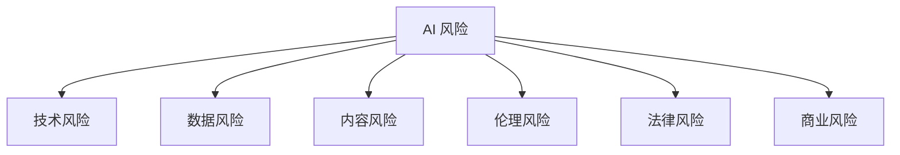
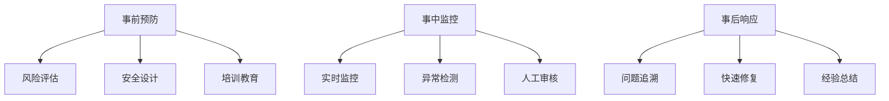

---
tags:
  - 风险
  - 合规
  - 安全
  - 伦理
created: 2026-03-07
updated: 2026-03-07
---

# 风险与合规核心概念

## 📌 为什么需要重视风险与合规

AI 技术带来巨大价值的同时，也伴随着诸多风险。建立完善的风险管控和合规体系是产品可持续发展的基础。

### 核心价值

- 🛡️ **风险防控** - 预防和降低潜在损失
- ⚖️ **合规经营** - 避免法律风险
- 🤝 **用户信任** - 建立长期信任关系
- 🌱 **可持续发展** - 确保业务长期健康发展

## ⚠️ AI 风险分类框架

### 完整风险图谱



### 1. 技术风险

| 风险类型 | 说明 | 影响程度 |
|----------|------|----------|
| **模型幻觉** | 生成虚假或错误信息 | 高 |
| **性能不稳定** | 输出质量波动大 | 中 |
| **系统漏洞** | 被攻击或滥用 | 高 |
| **依赖风险** | 过度依赖第三方 API | 中 |

**典型案例**：
- 某 AI 客服提供错误产品信息，导致客户投诉
- 代码生成助手产生安全漏洞代码

### 2. 数据风险

| 风险类型 | 说明 | 影响程度 |
|----------|------|----------|
| **数据泄露** | 用户数据被未授权访问 | 极高 |
| **隐私侵犯** | 收集或使用个人信息不当 | 高 |
| **数据污染** | 训练数据被恶意注入 | 高 |
| **数据偏见** | 数据代表性不足导致偏见 | 中 |

**典型案例**：
- 某公司 AI 模型训练数据包含用户隐私信息
- 聊天机器人泄露其他用户对话内容

### 3. 内容风险

| 风险类型 | 说明 | 影响程度 |
|----------|------|----------|
| **有害内容** | 生成暴力、仇恨言论 | 高 |
| **虚假信息** | 生成谣言或误导信息 | 高 |
| **版权侵犯** | 生成受版权保护内容 | 中 |
| **不当建议** | 提供危险或违法建议 | 高 |

**典型案例**：
- AI 助手被诱导生成制造危险物品的说明
- 自动生成新闻系统传播虚假信息

### 4. 伦理风险

| 风险类型 | 说明 | 影响程度 |
|----------|------|----------|
| **算法歧视** | 对特定群体不公平 | 高 |
| **操纵行为** | 影响用户决策 | 中 |
| **责任归属** | 错误决策责任不明 | 中 |
| **就业影响** | 自动化导致失业 | 社会层面 |

**典型案例**：
- 招聘 AI 对女性候选人评分偏低
- 信贷审批系统对少数族裔不公平

### 5. 法律风险

| 风险类型 | 说明 | 影响程度 |
|----------|------|----------|
| **监管违规** | 违反 AI 相关法规 | 极高 |
| **知识产权** | 侵犯专利、商标 | 高 |
| **合同风险** | 服务条款纠纷 | 中 |
| **跨境合规** | 不同司法管辖区冲突 | 高 |

## 🛡️ 风险防控体系

### 三层防护架构



### 1. 事前预防措施

**风险评估**：
- 风险识别清单
- 影响程度评估
- 发生概率评估
- 风险优先级排序

**安全设计原则**：
- 最小权限原则
- 防御纵深原则
- 默认安全原则
- 可解释性原则

**技术措施**：
```yaml
输入过滤：
  - 敏感词检测
  - 注入攻击防护
  - 恶意提示识别

输出审核：
  - 内容安全过滤
  - 事实核查
  - 质量检查

访问控制：
  - 身份认证
  - 权限管理
  - 速率限制
```

### 2. 事中监控机制

**实时监控指标**：
- API 调用频率
- 异常输入模式
- 输出内容安全评分
- 用户投诉率

**预警阈值**：
```yaml
错误率：>5% 触发警告
延迟：>5s 触发警告
投诉率：>1% 触发警告
敏感内容：>0.1% 立即警告
```

**人工审核流程**：
```
系统标记 → 审核队列 → 人工判断 → 处理决定 → 反馈优化
```

### 3. 事后响应机制

**事件分级**：
| 级别 | 标准 | 响应时间 |
|------|------|----------|
| **P0-紧急** | 大规模数据泄露、系统被攻破 | 15 分钟 |
| **P1-高** | 严重内容事故、监管警告 | 1 小时 |
| **P2-中** | 局部功能异常、用户投诉 | 4 小时 |
| **P3-低** | 轻微问题、优化建议 | 24 小时 |

**响应流程**：
```
1. 问题发现与上报
2. 快速评估影响范围
3. 启动应急预案
4. 问题修复和验证
5. 用户沟通和公告
6. 事后复盘和改进
```

## ⚖️ 合规框架

### 全球主要 AI 法规

#### 中国

| 法规 | 生效时间 | 核心要求 |
|------|----------|----------|
| **生成式 AI 服务管理暂行办法** | 2023-08 | 内容安全、数据来源合法、个人信息保护 |
| **互联网信息服务算法推荐管理规定** | 2022-03 | 算法透明、用户权益保护 |
| **数据安全法** | 2021-09 | 数据分类分级、出境安全评估 |
| **个人信息保护法** | 2021-11 | 最小必要、知情同意、用户权利 |

#### 欧盟

| 法规 | 状态 | 核心要求 |
|------|------|----------|
| **AI Act** | 2024 年通过 | 风险分级管理、高风险系统严格监管 |
| **GDPR** | 已生效 | 数据保护、被遗忘权、自动化决策限制 |

#### 美国

| 法规 | 状态 | 核心要求 |
|------|------|----------|
| **AI Rights and Safety** | 提案中 | 安全测试、事故报告 |
| **州级法规** | 各州不同 | 隐私保护、算法审计 |

### 合规检查清单

#### 产品上线前

- [ ] 完成风险评估报告
- [ ] 通过安全测试
- [ ] 隐私政策完善
- [ ] 用户协议明确 AI 使用
- [ ] 内容审核机制建立
- [ ] 应急预案制定
- [ ] 合规培训完成
- [ ] 监管备案（如需要）

#### 运营期间

- [ ] 定期安全审计（季度）
- [ ] 模型性能监控（持续）
- [ ] 用户投诉处理（24h 内）
- [ ] 法规更新跟踪（月度）
- [ ] 合规培训更新（年度）
- [ ] 第三方审计（年度）

## 🔍 风险检测技术

### 1. 内容安全检测

**检测方法**：
- 关键词过滤
- 分类模型识别
- 语义相似度匹配
- 多模态检测

**敏感类别**：
```yaml
政治敏感：
  - 领导人相关
  - 敏感事件
  
违法内容：
  - 暴力恐怖
  - 色情低俗
  - 赌博毒品
  
社会风险：
  - 谣言
  - 歧视
  - 仇恨言论
```

### 2. 对抗攻击检测

**攻击类型**：
- 提示注入（Prompt Injection）
- 越狱攻击（Jailbreak）
- 数据投毒（Data Poisoning）

**防御策略**：
```
输入层：
  - 提示词规范化
  - 异常模式识别
  
模型层：
  - 对抗训练
  - 鲁棒性增强
  
输出层：
  - 内容审核
  - 一致性检查
```

### 3. 偏见检测

**检测方法**：
- 统计差异分析
- 公平性指标评估
- 对抗性测试

**公平性指标**：
```
人口均等：不同群体通过率差异 < 10%
机会均等：不同群体准确率差异 < 5%
个体公平：相似个体获得相似结果
```

## 📋 风险管理制度

### 组织架构

```
首席 AI 伦理官（CAIO）
├── 风险管理委员会
│   ├── 技术安全组
│   ├── 法律合规组
│   └── 伦理审查组
├── 风险评估团队
└── 应急响应团队
```

### 核心制度

1. **AI 伦理准则**
   - 以人为本
   - 公平公正
   - 透明可解释
   - 安全可靠

2. **数据使用规范**
   - 最小必要原则
   - 知情同意
   - 用途限制
   - 安全存储

3. **模型开发规范**
   - 数据质量检查
   - 偏见测试
   - 安全评估
   - 文档记录

4. **供应商管理**
   - 资质审核
   - 安全评估
   - 合同约束
   - 定期审计

## 🔗 相关链接

- [[06-风险与合规/02-合规框架\|合规框架详解]]
- [[06-风险与合规/03-实战案例\|风险案例库]]
- [[09-产品落地/03-风险管理\|产品风险管理]]

## 📚 参考资料

- [中国生成式 AI 服务管理暂行办法](http://www.cac.gov.cn/2023-07/13/c_1690898327029107.htm)
- [欧盟 AI Act](https://artificialintelligenceact.eu/)
- [NIST AI Risk Management Framework](https://www.nist.gov/itl/ai-risk-management-framework)
- [Partnership on AI](https://partnershiponai.org/)

---

**创建时间**: 2026-03-07  
**最后更新**: 2026-03-07  
**标签**: #风险 #合规 #安全 #伦理
