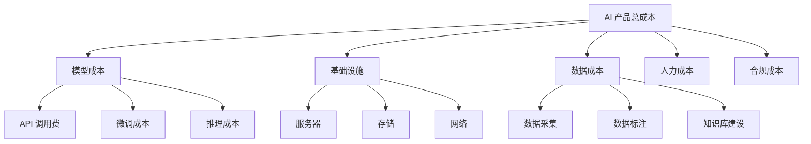

---
tags:
  - 成本
  - ROI
  - 商业模型
created: 2026-03-07
updated: 2026-03-07
---

# 成本模型核心概念

## 📌 为什么需要成本模型

AI 产品的成本结构与传统软件有本质差异。建立准确的成本模型是产品定价、盈利分析和资源优化的基础。

### 核心价值

- 💰 **精准定价** - 基于成本结构制定合理价格
- 📊 **盈利预测** - 准确计算毛利率和 ROI
- 🎯 **成本优化** - 识别和降低高成本环节
- 📈 **规模规划** - 预测不同规模下的成本变化

## 💸 AI 产品成本结构

### 完整成本组成



### 1. 模型成本（核心）

#### API 调用模式

**计费方式**：
```
成本 = 输入 tokens × 输入单价 + 输出 tokens × 输出单价

典型价格（以 Qwen 为例）：
- 输入：$0.002 / 1K tokens
- 输出：$0.006 / 1K tokens
```

**成本测算示例**：
```yaml
场景：智能客服机器人
日均对话：10,000 次
平均输入：200 tokens/次
平均输出：300 tokens/次

日 token 消耗：
- 输入：10,000 × 200 = 2,000,000 tokens
- 输出：10,000 × 300 = 3,000,000 tokens

日成本：
- 输入：2,000 × $0.002 = $4
- 输出：3,000 × $0.006 = $18
- 总计：$22/天 = $660/月
```

#### 私有化部署模式

**一次性投入**：
| 项目 | 配置 | 成本 |
|------|------|------|
| GPU 服务器 | 8×A100 | $300,000 |
| 网络设备 | 高速互联 | $50,000 |
| 存储系统 | 100TB SSD | $100,000 |
| 软件授权 | 模型 License | $200,000 |
| **总计** | | **$650,000** |

**年度运维成本**：
| 项目 | 年成本 |
|------|--------|
| 电力（500kW） | $200,000 |
| 冷却 | $50,000 |
| 运维人力 | $150,000 |
| 硬件折旧（5 年） | $130,000 |
| **年总计** | **$530,000** |

**盈亏平衡点**：
```
API 模式年成本 = 月调用量 × 12 × 单次成本

平衡点计算：
$530,000 / $0.005 = 106,000,000 tokens/年
即：日均 290,000 tokens

结论：日均 token 量 > 29 万时，私有化更经济
```

### 2. 基础设施成本

#### 云计算成本

**计算资源**：
| 实例类型 | 配置 | 月成本 | 适用场景 |
|----------|------|--------|----------|
| GPU 实例 | A10G × 1 | $1,500 | 小规模推理 |
| GPU 实例 | A100 × 8 | $30,000 | 大规模训练 |
| CPU 实例 | 32 核 128G | $500 | 预处理/后处理 |

**存储成本**：
| 类型 | 单价 | 适用场景 |
|------|------|----------|
| 对象存储 | $0.023/GB/月 | 文档、图片 |
| 块存储 | $0.10/GB/月 | 数据库 |
| 归档存储 | $0.004/GB/月 | 备份数据 |

**网络成本**：
- 入站流量：免费
- 出站流量：$0.09/GB（前 10TB）

### 3. 数据成本

#### 数据采集

| 方式 | 成本 | 质量 |
|------|------|------|
| 公开爬虫 | $5,000/月 | 中 |
| API 购买 | $10,000/月 | 高 |
| 用户生成 | 低 | 中 |
| 合作伙伴 | 中 | 高 |

#### 数据标注

| 类型 | 单价 | 效率 |
|------|------|------|
| 文本分类 | $0.10/条 | 100 条/小时 |
| 实体标注 | $0.50/条 | 20 条/小时 |
| 对话标注 | $2.00/轮 | 5 轮/小时 |
| RLHF 排序 | $5.00/组 | 2 组/小时 |

**标注成本示例**：
```
微调数据集：10,000 条
标注类型：对话标注
单条成本：$2.00
总成本：10,000 × $2 = $20,000
```

### 4. 人力成本

#### 团队配置

| 角色 | 人数 | 年薪 | 年总成本 |
|------|------|------|----------|
| AI 产品经理 | 1 | $150K | $200K |
| ML 工程师 | 2 | $180K | $480K |
| 数据工程师 | 1 | $160K | $210K |
| 标注团队 | 5 | $50K | $350K |
| **总计** | | | **$1,240K/年** |

### 5. 合规成本

| 项目 | 成本 | 频率 |
|------|------|------|
| 安全审计 | $50,000 | 年度 |
| 合规咨询 | $100,000 | 年度 |
| 隐私保护系统 | $200,000 | 一次性 |
| 监管备案 | $20,000 | 按需 |

## 📊 成本优化策略

### 1. Prompt 优化

**优化前**：
```
请帮我分析一下这个用户的需求是什么，他想要什么样的产品功能，
我们应该如何满足他的需求，请给出详细的建议...
（150 tokens）
```

**优化后**：
```
分析用户需求，推荐 3 个产品功能。
（10 tokens）
```

**节省效果**：93% input tokens

### 2. 模型选择优化

**场景化选型**：

| 场景 | 推荐模型 | 成本/千 tokens |
|------|----------|---------------|
| 简单问答 | Qwen-Turbo | $0.001 |
| 复杂推理 | Qwen-Plus | $0.004 |
| 专业领域 | Qwen-Max | $0.012 |
| 代码生成 | CodeQwen | $0.008 |

**策略**：
- 路由分发：简单问题用小模型
- 级联调用：小模型不行再调用大模型

### 3. 缓存策略

**缓存类型**：
- 问题 - 答案缓存（相同问题直接返回）
- 向量缓存（相似问题检索）
- 中间结果缓存（多步骤任务）

**效果示例**：
```
缓存命中率：40%
日均调用：10,000 次
单次成本：$0.005
日节省：10,000 × 40% × $0.005 = $20
月节省：$600
```

### 4. 批处理优化

**策略**：
- 累积请求批量处理
- 流式输出减少等待
- 异步处理非实时任务

**效果**：
- 吞吐量提升：3-5 倍
- 单位成本降低：50-70%

## 💵 ROI 分析模型

### 基本公式

```
ROI = (收益 - 成本) / 成本 × 100%

投资回收期 = 总投资 / 月净收益
```

### 客服机器人案例

**投入**：
```
一次性投入：
- 系统开发：$100,000
- 数据准备：$50,000
- 集成测试：$30,000
总计：$180,000

年度运营成本：
- API 调用：$240,000/年
- 运维人力：$100,000/年
- 基础设施：$60,000/年
总计：$400,000/年
```

**收益**：
```
成本节省：
- 减少客服人力：10 人 × $60K = $600,000/年
- 提升效率：20% × $500,000 = $100,000/年
总计：$700,000/年

ROI 计算：
年净收益 = $700K - $400K = $300K
ROI = $300K / $400K = 75%
回收期 = $180K / ($300K/12) = 7.2 个月
```

## 📈 规模化成本预测

### 不同规模下的单位成本

| 日调用量 | 月成本 | 单次成本 | 规模效应 |
|----------|--------|----------|----------|
| 1,000 | $150 | $0.005 | - |
| 10,000 | $1,500 | $0.005 | - |
| 100,000 | $12,000 | $0.004 | 20%↓ |
| 1,000,000 | $90,000 | $0.003 | 40%↓ |

**规模效应来源**：
- 批量折扣
- 固定成本摊薄
- 优化空间增大

## 🔗 相关链接

- [[07-成本模型/02-成本优化实战\|成本优化实战]]
- [[05-模型评估/01-核心概念\|评估指标体系]]
- [[09-产品落地/02-商业模式\|商业模式设计]]

## 📚 参考资料

- [OpenAI Pricing](https://openai.com/pricing)
- [Anthropic Pricing](https://www.anthropic.com/pricing)
- [云厂商 GPU 实例对比](https://cloud.google.com/gpu)

---

**创建时间**: 2026-03-07  
**最后更新**: 2026-03-07  
**标签**: #成本 #ROI #商业模型
