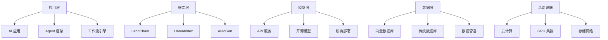

---
tags:
  - 技术栈
  - 工具
  - 平台
created: 2026-03-07
updated: 2026-03-07
---

# 技术栈核心概念

## 📌 AI 产品技术栈全景

AI 产品技术栈涵盖从底层基础设施到上层应用开发的完整工具链。

### 技术栈分层



## 🤖 模型服务层

### 主流模型 API 对比

| 厂商 | 代表模型 | 优势 | 适用场景 | 价格区间 |
|------|----------|------|----------|----------|
| **阿里** | Qwen 系列 | 中文优秀，性价比高 | 通用场景 | $ |
| **百度** | 文心一言 | 中文理解好 | 国内企业 | $ |
| **OpenAI** | GPT-4 | 能力最强 | 高端场景 | $$$$ |
| **Anthropic** | Claude | 长文本，安全 | 文档分析 | $$$ |
| **智谱** | GLM | 国产自主 | 政企客户 | $$ |

### 模型选择矩阵

```yaml
选择维度:
  - 语言能力：中文/英文/多语言
  - 场景匹配：通用/垂直领域
  - 性能要求：准确率/延迟
  - 成本约束：预算范围
  - 合规要求：数据出境/本地部署

决策流程:
  1. 明确需求 → 2. 初选 3-5 家 → 3. POC 测试 → 4. 商务谈判 → 5. 最终选择
```

### 开源模型推荐

| 模型 | 参数量 | 优势 | 部署难度 |
|------|--------|------|----------|
| **Qwen-7B** | 7B | 中文好，易部署 | ⭐⭐ |
| **Llama-3-8B** | 8B | 生态丰富 | ⭐⭐ |
| **ChatGLM3-6B** | 6B | 轻量高效 | ⭐ |
| **Baichuan-13B** | 13B | 平衡性好 | ⭐⭐ |

## 🛠️ 开发框架层

### LangChain

**核心功能**：
- Chains：链式调用
- Agents：智能体构建
- RAG：检索增强生成
- Memory：记忆管理

**适用场景**：
```python
from langchain.chains import LLMChain
from langchain.prompts import PromptTemplate

# 快速构建 AI 应用
prompt = PromptTemplate(
    input_variables=["product"],
    template="为{product}写一个营销口号"
)
chain = LLMChain(llm=llm, prompt=prompt)
result = chain.run(product="智能手表")
```

**优点**：
- ✅ 生态丰富，组件多
- ✅ 文档完善
- ✅ 社区活跃

**缺点**：
- ❌ 抽象层次多，学习曲线陡
- ❌ 性能开销大

### LlamaIndex

**核心功能**：
- 数据连接器
- 索引构建
- 查询引擎
- RAG 优化

**适用场景**：
```python
from llama_index import VectorStoreIndex, SimpleDirectoryReader

# 构建知识库 QA 系统
documents = SimpleDirectoryReader("./data").load_data()
index = VectorStoreIndex.from_documents(documents)
query_engine = index.as_query_engine()
response = query_engine.query("公司产品有哪些？")
```

**优点**：
- ✅ RAG 友好
- ✅ 数据源丰富
- ✅ 查询优化好

**缺点**：
- ❌ 功能相对单一
- ❌ 灵活性不如 LangChain

### AutoGen

**核心功能**：
- 多 Agent 协作
- 对话管理
- 工具集成

**适用场景**：
```python
from autogen import AssistantAgent, UserProxyAgent

# 多 Agent 协作
assistant = AssistantAgent("assistant")
user_proxy = UserProxyAgent("user_proxy")

user_proxy.initiate_chat(
    assistant,
    message="帮我分析这个产品的市场机会"
)
```

**优点**：
- ✅ 多 Agent 原生支持
- ✅ 对话流畅
- ✅ 微软背书

**缺点**：
- ❌ 生态较小
- ❌ 文档待完善

## 💾 数据存储层

### 向量数据库对比

| 数据库 | 特点 | 规模 | 成本 | 推荐场景 |
|--------|------|------|------|----------|
| **Milvus** | 功能全，性能好 | 亿级 | 中 | 企业级 |
| **Pinecone** | 全托管，易用 | 千万级 | 高 | 快速上线 |
| **Weaviate** | 模块化，可扩展 | 千万级 | 中 | 中等规模 |
| **Chroma** | 轻量，本地 | 百万级 | 低 | 原型验证 |
| **Qdrant** | 高性能，开源 | 亿级 | 中 | 自部署 |

### 选择建议

```yaml
小规模（<100 万向量）:
  推荐：Chroma
  理由：简单，无需运维

中等规模（100-1000 万）:
  推荐：Weaviate/Qdrant
  理由：平衡性能和成本

大规模（>1000 万）:
  推荐：Milvus 集群
  理由：可扩展，性能稳定

快速验证:
  推荐：Pinecone
  理由：全托管，快速上线
```

## 🔧 工具集成层

### 常用工具类型

#### 搜索工具
- Google Search API
- Bing Search API
- 百度搜索 API
- 专业数据库（PubMed, arXiv）

#### 计算工具
- Python 解释器
- Wolfram Alpha
- 计算器 API

#### 数据工具
- SQL 数据库
- REST API
- GraphQL
- 文件读写

#### 办公工具
- Office 365
- Google Workspace
- 飞书/钉钉

### 工具调用框架

**Function Calling 示例**：
```json
{
  "name": "get_weather",
  "description": "获取指定城市的天气",
  "parameters": {
    "type": "object",
    "properties": {
      "city": {
        "type": "string",
        "description": "城市名称"
      }
    },
    "required": ["city"]
  }
}
```

## 📊 监控运维层

### 监控指标

| 类别 | 指标 | 告警阈值 |
|------|------|----------|
| **性能** | P95 延迟 | >3s |
| **可用性** | 错误率 | >5% |
| **成本** | 日 Token 消耗 | >预算 120% |
| **质量** | 用户满意度 | <4.0/5.0 |

### 监控工具

| 工具 | 功能 | 适用场景 |
|------|------|----------|
| **LangSmith** | 全链路追踪 | LangChain 应用 |
| **Arize Phoenix** | 可观测性平台 | 生产环境 |
| **Weights & Biases** | 实验追踪 | 模型训练 |
| **Prometheus+Grafana** | 系统监控 | 基础设施 |

## 🏗️ 技术架构推荐

### 初创团队（快速验证）

```yaml
模型：Qwen API
框架：LangChain
向量库：Chroma（本地）
部署：云服务器
监控：基础日志

特点：
- 快速上线
- 低成本
- 易迭代
```

### 成长期（稳定运营）

```yaml
模型：多模型路由
框架：LangChain + LlamaIndex
向量库：Milvus 单机
部署：容器化
监控：LangSmith

特点：
- 性能稳定
- 成本可控
- 可观测
```

### 企业级（大规模）

```yaml
模型：混合部署（API+ 私有）
框架：自研 + 开源
向量库：Milvus 集群
部署：K8s 多集群
监控：全链路可观测

特点：
- 高可用
- 可扩展
- 安全合规
```

## 🔗 相关链接

- [[08-技术栈/02-工具选型指南\|工具选型指南]]
- [[08-技术栈/03-部署架构\|部署架构]]
- [[03-RAG 架构/01-核心概念\|RAG 技术详解]]

## 📚 参考资料

- [LangChain 官方文档](https://python.langchain.com/)
- [LlamaIndex 文档](https://docs.llamaindex.ai/)
- [Milvus 文档](https://milvus.io/docs)

---

**创建时间**: 2026-03-07  
**最后更新**: 2026-03-07  
**标签**: #技术栈 #工具 #平台
