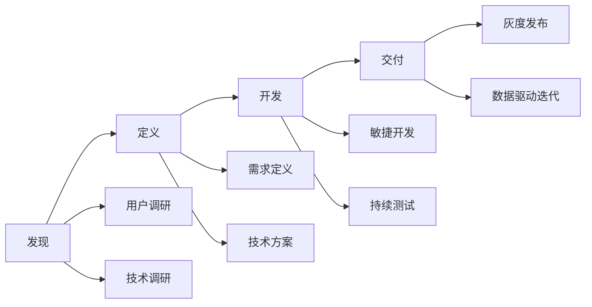

---
tags:
  - 产品落地
  - 方法论
  - 实战
created: 2026-03-07
updated: 2026-03-07
---

# 产品落地核心概念

## 📌 AI 产品落地挑战

AI 产品相比传统软件产品，在落地过程中面临独特挑战。

### 核心挑战

| 挑战 | 说明 | 应对策略 |
|------|------|----------|
| **技术不确定性** | 模型能力边界模糊 | POC 验证，设置合理预期 |
| **效果波动** | 输出质量不稳定 | 多层审核，人工兜底 |
| **成本不可控** | Token 消耗难预测 | 监控告警，优化策略 |
| **用户期望管理** | 过度期待 AI 能力 | 教育用户，透明沟通 |
| **合规风险** | 法规快速变化 | 合规先行，灵活调整 |

## 🎯 AI 产品开发流程

### 双钻模型（适配版）



### 关键阶段详解

#### 1. 机会识别

**评估维度**：
```yaml
用户需求:
  - 痛点是否真实存在？
  - 付费意愿如何？
  - 市场规模多大？

技术可行性:
  - 当前 AI 能力是否支持？
  - 技术风险有哪些？
  - 是否有替代方案？

商业价值:
  - 收入模式是什么？
  - 成本结构如何？
  - ROI 是否合理？

竞争优势:
  - 差异化在哪里？
  - 壁垒是什么？
  - 先发优势多久？
```

#### 2. MVP 定义

**MVP 原则**：
- ✅ 验证核心价值主张
- ✅ 最小功能集合
- ✅ 快速上线（<4 周）
- ✅ 可量化评估

**MVP 示例 - 智能客服**：
```
核心功能：
- FAQ 自动问答（覆盖 Top50 问题）
- 转人工客服
- 简单数据查询

不包含：
- 复杂业务办理
- 多轮对话
- 情感识别
```

#### 3. 技术验证（POC）

**POC 目标**：
- 验证技术可行性
- 评估效果上限
- 识别技术风险
- 估算成本

**POC 检查清单**：
- [ ] 选择代表性测试用例（50-100 个）
- [ ] 定义成功标准（准确率>85%）
- [ ] 对比多个模型/方案
- [ ] 记录性能和成本数据
- [ ] 输出 POC 报告

#### 4. 敏捷开发

**迭代周期**：2 周一个 Sprint

**Sprint 流程**：
```
Sprint 规划 → 开发 → 测试 → 评审 → 复盘

关键实践:
- 每日站会（15 分钟）
- 持续集成
- 自动化测试
- 代码审查
```

#### 5. 灰度发布

**发布策略**：
```
内部测试（1%）→ 种子用户（5%）→ 小范围（20%）→ 全量（100%）

每个阶段观察:
- 错误率
- 用户反馈
- 性能指标
- 成本数据
```

**回滚标准**：
- 错误率 > 5%
- 用户投诉率 > 2%
- 性能下降 > 30%
- 成本超预算 > 50%

#### 6. 数据驱动迭代

**核心指标监控**：
| 指标类型 | 具体指标 | 监控频率 |
|----------|----------|----------|
| 使用指标 | DAU/MAU，留存率 | 每日 |
| 效果指标 | 准确率，满意度 | 每周 |
| 性能指标 | 延迟，可用性 | 实时 |
| 成本指标 | Token 消耗，单次成本 | 每日 |

**迭代优化循环**：
```
数据分析 → 问题识别 → 假设提出 → A/B 测试 → 全量推广
```

## 📋 产品文档体系

### 核心文档清单

| 文档 | 目的 | 关键内容 |
|------|------|----------|
| **BRD** | 商业论证 | 市场分析、ROI、资源需求 |
| **PRD** | 产品需求 | 功能列表、用户故事、验收标准 |
| **技术方案** | 实现方案 | 架构设计、技术选型、风险评估 |
| **测试计划** | 质量保障 | 测试用例、测试数据、通过标准 |
| **上线计划** | 发布管理 | 发布步骤、回滚方案、应急预案 |

### PRD 模板（AI 产品版）

```markdown
# 产品需求文档

## 1. 产品概述
- 产品愿景
- 目标用户
- 核心价值

## 2. 功能需求
### 2.1 功能列表
### 2.2 用户故事
### 2.3 功能详细说明

## 3. AI 能力需求
### 3.1 模型选择
### 3.2 输入输出规范
### 3.3 效果指标（准确率、延迟等）
### 3.4 异常处理机制

## 4. 非功能需求
### 4.1 性能要求
### 4.2 安全要求
### 4.3 合规要求

## 5. 数据需求
### 5.1 训练数据
### 5.2 埋点设计
### 5.3 数据隐私

## 6. 验收标准
### 6.1 功能验收
### 6.2 效果验收
### 6.3 性能验收
```

## 🎨 AI 产品设计原则

### 1. 人机协作设计

**设计要点**：
- 明确 AI 和人的职责边界
- 设计平滑的人工接管机制
- 提供 AI 决策的可解释性

**示例 - 智能写作助手**：
```
AI 职责：
- 生成初稿
- 语法检查
- 风格建议

人工职责：
- 内容审核
- 事实核查
- 最终决策

交接机制:
- AI 标注不确定的内容
- 一键转人工编辑
- 显示 AI 置信度
```

### 2. 预期管理设计

**策略**：
- 清晰标注 AI 生成内容
- 说明能力边界
- 提供反馈渠道

**UI 示例**：
```
⚠️ 以下内容由 AI 生成，请核实后使用

[✓] 已核实  [✗] 有误

您的反馈将帮助我们改进
```

### 3. 容错设计

**设计原则**：
- 允许用户纠正 AI 错误
- 提供撤销和重做
- 保存历史版本

**实现方式**：
```yaml
错误预防:
  - 确认对话框（重要操作）
  - 预览功能
  - 分步引导

错误恢复:
  - 撤销/重做
  - 版本历史
  - 人工客服入口
```

## 💼 组织能力建设

### 团队配置

| 阶段 | 团队规模 | 核心角色 |
|------|----------|----------|
| **探索期** | 3-5 人 | 产品经理×1, 工程师×2-3, 设计师×1 |
| **成长期** | 10-20 人 | +ML 工程师×2, 数据标注×3-5 |
| **成熟期** | 50+ 人 | +算法专家×3, 运维×2, 合规×1 |

### 能力培养

**关键能力**：
- AI 技术理解力
- 数据驱动思维
- 敏捷开发能力
- 风险管理能力

**培养方式**：
- 内部培训（每周技术分享）
- 外部学习（行业会议、课程）
- 实战演练（Hackathon）
- 导师制度

## 🔗 相关链接

- [[09-产品落地/02-需求分析方法\|需求分析方法]]
- [[09-产品落地/03-风险管理\|产品风险管理]]
- [[01-Prompt 工程/02-场景案例\|产品工作场景]]

## 📚 参考资料

- [Inspired - Marty Cagan](https://www.svpg.com/inspired-3rd-edition/)
- [AI Product Management](https://www.oreilly.com/library/view/ai-product-management/9781098107338/)
- [斯坦福 AI 产品课程](https://online.stanford.edu/courses/ai-product-management)

---

**创建时间**: 2026-03-07  
**最后更新**: 2026-03-07  
**标签**: #产品落地 #方法论 #实战
