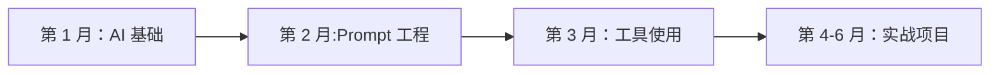

---
tags:
  - 学习资源
  - 学习路径
  - 课程推荐
created: 2026-03-07
updated: 2026-03-07
---

# 学习资源

## 🎓 学习路径图

### 初级产品经理（0-6 个月）

**学习目标**：掌握 AI 基础，能独立完成简单 AI 功能设计



**详细计划**：

#### 第 1 月：AI 基础认知
- [ ] 了解 LLM 基本原理
- [ ] 熟悉主流模型能力
- [ ] 理解 AI 产品类型
- [ ] 学习行业案例

**推荐资源**：
- 课程：[AI For Everyone - Coursera](https://www.coursera.org/learn/ai-for-everyone)
- 书籍：《AI 未来进行式》
- 实践：体验 10 款 AI 产品

#### 第 2 月：Prompt 工程
- [ ] 掌握 Zero-shot/Few-shot
- [ ] 学习 CoT 思维链
- [ ] 熟练设计结构化 Prompt
- [ ] 建立 Prompt 模板库

**推荐资源**：
- 课程：[Prompt Engineering - DeepLearning.AI](https://www.deeplearning.ai/short-courses/chatgpt-prompt-engineering-for-developers/)
- 文档：[Learn Prompting](https://learnprompting.org/)
- 实践：完成 50 个 Prompt 练习

#### 第 3 月：工具使用
- [ ] 熟悉 LangChain 基础
- [ ] 学会调用模型 API
- [ ] 掌握基础数据分析
- [ ] 了解 RAG 概念

**推荐资源**：
- 文档：[LangChain 官方教程](https://python.langchain.com/)
- 实践：搭建简单 QA 机器人
- 工具：熟练使用 3 个 AI 开发平台

#### 第 4-6 月：实战项目
- [ ] 主导一个 AI 功能上线
- [ ] 完成从需求到上线全流程
- [ ] 建立效果评估体系
- [ ] 输出产品文档

**实战项目建议**：
- 智能客服 FAQ
- 文档摘要工具
- 数据分析助手

### 中级产品经理（6-18 个月）

**学习目标**：能独立负责 AI 产品线，掌握核心技术方案

**学习重点**：
1. **RAG 架构** - 构建知识库增强系统
2. **Agent 设计** - 设计自主智能体
3. **模型评估** - 建立评估体系
4. **成本优化** - 控制 AI 应用成本

**推荐课程**：
- [LLM Engineering - Master AI and LLMs](https://www.udemy.com/course/llm-engineering-master-ai-and-llms/)
- [AI Agents - LangChain](https://python.langchain.com/docs/modules/agents/)
- [RAG 最佳实践](https://www.deeplearning.ai/short-courses/rag/)

**实战项目**：
- 企业知识库 QA 系统
- 多 Agent 协作系统
- 自动化报告生成

### 高级产品经理（18 个月+）

**学习目标**：制定 AI 产品战略，推动规模化落地

**学习重点**：
1. **技术战略** - 技术选型和路线规划
2. **风险管理** - 建立合规体系
3. **规模化** - 从 1 到 100 的扩张
4. **商业化** - 商业模式创新

**推荐资源**：
- 行业报告：[a16z AI Reports](https://a16z.com/)
- 书籍：《The AI Product Manager's Handbook》
- 社群：AI 产品经理社区

## 📚 核心课程推荐

### 综合类

| 课程 | 平台 | 时长 | 难度 | 费用 |
|------|------|------|------|------|
| **AI For Everyone** | Coursera | 6h | ⭐ | 免费 |
| **Prompt Engineering** | DeepLearning.AI | 1h | ⭐⭐ | 免费 |
| **LLM University** | Cohere | 20h | ⭐⭐⭐ | 免费 |
| **AI Product Management** | Coursera | 15h | ⭐⭐⭐ | $49/月 |

### 技术类

| 课程 | 平台 | 时长 | 难度 | 费用 |
|------|------|------|------|------|
| **LangChain for LLM** | DeepLearning.AI | 2h | ⭐⭐ | 免费 |
| **RAG Techniques** | DeepLearning.AI | 3h | ⭐⭐⭐ | 免费 |
| **Fine-tuning LLMs** | HuggingFace | 10h | ⭐⭐⭐⭐ | 免费 |
| **Build LLM Apps** | Udemy | 8h | ⭐⭐ | $19.99 |

### 实战类

| 课程 | 平台 | 时长 | 难度 | 费用 |
|------|------|------|------|------|
| **Build 10 AI Apps** | Udemy | 15h | ⭐⭐ | $29.99 |
| **AI Startup** | Y Combinator | 5h | ⭐⭐⭐ | 免费 |
| **Product-Led AI** | Product School | 8h | ⭐⭐⭐ | $299 |

## 📖 必读书籍

### 基础认知

1. **《AI 未来进行式》** - 李开复
   - 了解 AI 发展趋势
   - 适合：入门

2. **《生命 3.0》** - Max Tegmark
   - 思考 AI 与社会
   - 适合：所有人

3. **《超级智能》** - Nick Bostrom
   - AI 风险评估
   - 适合：进阶

### 产品方法

1. **《AI Product Management》** - 待出版
   - AI 产品方法论
   - 适合：中级

2. **《Inspired》** - Marty Cagan
   - 产品通用方法
   - 适合：所有人

3. **《The AI Product Manager's Handbook》** - 待出版
   - 实战指南
   - 适合：高级

### 技术理解

1. **《Deep Learning》** - Ian Goodfellow
   - 深度学习基础
   - 适合：进阶

2. **《Natural Language Processing》** - Jacob Eisenstein
   - NLP 基础
   - 适合：进阶

3. **《Generative AI in Healthcare》** - 行业案例
   - 垂直领域应用
   - 适合：所有人

## 🌐 在线资源

### 资讯网站

- [MIT Technology Review](https://www.technologyreview.com/) - 前沿科技
- [VentureBeat AI](https://venturebeat.com/ai/) - AI 行业新闻
- [The Batch - DeepLearning.AI](https://www.deeplearning.ai/the-batch/) - 周报
- [机器之心](https://www.jiqizhixin.com/) - 中文 AI 资讯

### 技术博客

- [OpenAI Blog](https://openai.com/blog) - 官方技术发布
- [Anthropic Blog](https://www.anthropic.com/index) - 安全 AI 研究
- [LangChain Blog](https://blog.langchain.dev/) - 开发实践
- [HuggingFace Blog](https://huggingface.co/blog) - 模型和技术

### 论文资源

- [arXiv CS.CL](https://arxiv.org/list/cs.CL/recent) - NLP 论文
- [arXiv CS.AI](https://arxiv.org/list/cs.AI/recent) - AI 论文
- [Papers with Code](https://paperswithcode.com/) - 论文 + 代码
- [Connected Papers](https://www.connectedpapers.com/) - 论文图谱

## 👥 社区组织

### 国际社区

- [r/MachineLearning](https://www.reddit.com/r/MachineLearning/) - Reddit ML 社区
- [r/LocalLLaMA](https://www.reddit.com/r/LocalLLaMA/) - 开源模型社区
- [HuggingFace Discord](https://discord.gg/huggingface) - HF 官方社区
- [LangChain Discord](https://discord.gg/langchain) - LangChain 社区

### 中文社区

- [知乎 AI 话题](https://www.zhihu.com/topic/19572848) - 知乎 AI
- [机器之心读者群](https://www.jiqizhixin.com/) - 专业读者社区
- [Datawhale](https://datawhale.club/) - 数据科学社区
- [AI 产品经理社区](https://www.pmcaff.com/) - 垂直社区

### 线下活动

- **Meetup** - 本地 AI 聚会
- **Hackathon** - AI 黑客松
- **行业大会** - WAIC、NeurIPS 等
- **产品沙龙** - 城市产品经理活动

## 🛠️ 实践平台

### 免费额度平台

| 平台 | 免费额度 | 有效期 | 推荐指数 |
|------|----------|--------|----------|
| **OpenAI** | $5 | 3 个月 | ⭐⭐⭐⭐⭐ |
| **Anthropic** | 有限 | - | ⭐⭐⭐⭐ |
| **百度智能云** | 1000 次 | 永久 | ⭐⭐⭐⭐ |
| **阿里百炼** | 有限 | - | ⭐⭐⭐⭐ |
| **智谱 AI** | 100 万 tokens | 永久 | ⭐⭐⭐⭐⭐ |

### 开发环境

**本地开发**：
- Ollama（本地运行开源模型）
- LM Studio（图形化界面）
- Text Generation WebUI

**云端开发**：
- Google Colab（免费 GPU）
- Kaggle Notebooks（免费 GPU）
- HuggingFace Spaces（部署应用）

## 📝 学习计划模板

### 周学习计划

```markdown
# 第 X 周学习计划（2026-03-XX）

## 本周目标
- [ ] 目标 1
- [ ] 目标 2

## 学习内容
### 课程
- [ ] 课程名称 - 第 X 章

### 阅读
- [ ] 文章/论文章节

### 实践
- [ ] 练习项目

## 时间分配
- 周一：1h - 课程学习
- 周三：1h - 阅读
- 周五：2h - 实践
- 周日：2h - 复习总结

## 本周总结
完成：
收获：
问题：
下周改进：
```

## 🔗 相关链接

- [[00-索引与导航/📚 知识体系总览\|返回知识体系总览]]
- [[01-Prompt 工程/01-核心概念\|Prompt 工程基础]]
- [[09-产品落地/01-核心概念\|产品落地方法]]

---

**创建时间**: 2026-03-07  
**最后更新**: 2026-03-07  
**标签**: #学习资源 #学习路径 #课程推荐
