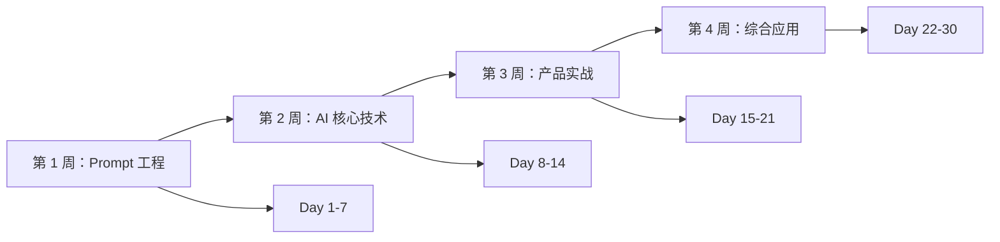

---
tags:
  - 学习计划
  - 30 天挑战
  - 互联网
aliases:
  - 30 天速成计划
  - 互联网 PM 学习路径
created: 2026-03-07
updated: 2026-03-07
---

# 互联网产品经理 30 天 AI 学习计划

## 📋 计划背景

**目标人群**: 互联网公司产品经理  
**学习时间**: 30 天（每天 2-3 小时）  
**学习目标**: 掌握 AI 产品核心能力，能独立负责 AI 功能/产品

### 学习原则

- 🎯 **实用优先** - 聚焦工作中最常用的高频技能
- ⚡ **快速见效** - 第 1 周就能应用到实际工作
- 📈 **循序渐进** - 从 Prompt 到架构到落地
- 🔄 **学以致用** - 每周一个实战项目

---

## 📅 总体安排



---

## 第 1 周：Prompt 工程基础（Day 1-7）

**目标**: 掌握与 AI 高效交互的能力，提升工作效率 3 倍以上

### Day 1-2：Prompt 核心概念

**学习内容**：
- [[01-Prompt 工程/01-核心概念\|核心概念]] - Zero-shot/Few-shot/CoT
- CRISPE 框架
- Prompt 设计原则

**实战练习**（2 小时）：
```
练习 1：用 Zero-shot 写 5 个产品文案（30 分钟）
练习 2：用 Few-shot 生成用户故事（30 分钟）
练习 3：用 CoT 分析产品数据（30 分钟）
练习 4：设计一个 CRISPE Prompt 模板（30 分钟）
```

**产出物**：
- 个人 Prompt 模板库（至少 5 个）
- 学习心得笔记

### Day 3-4：场景化应用

**学习内容**：
- [[01-Prompt 工程/02-场景案例\|场景案例]] - 产品工作场景

**实战练习**（2.5 小时）：
```
上午（1.5h）：
- 用户访谈提纲生成（20 分钟）
- 竞品分析框架（25 分钟）
- PRD 文档撰写（30 分钟）
- 会议纪要整理（15 分钟）

下午（1h）：
- 邮件撰写（15 分钟）
- 数据分析 SQL（25 分钟）
- 数据可视化建议（20 分钟）
```

**产出物**：
- 6 个场景的 Prompt 模板
- 实际应用案例 1 个（用在工作中）

### Day 5-6：最佳实践

**学习内容**：
- [[01-Prompt 工程/03-最佳实践\|最佳实践]]
- Prompt 优化技巧
- 版本管理

**实战练习**（2 小时）：
```
练习 1：优化一个现有 Prompt（40 分钟）
  - 精简指令
  - 添加示例
  - 设定约束

练习 2：Prompt 迭代测试（40 分钟）
  - V1 → V2 → V3
  - 记录每次改进

练习 3：建立个人模板库（40 分钟）
  - 分类整理
  - 命名规范
  - 版本记录
```

**产出物**：
- 优化后的 Prompt 模板（10+ 个）
- Prompt 迭代记录文档

### Day 7：周复习 + 实战项目

**复习内容**（1 小时）：
- 复习本周所有笔记
- 整理 Prompt 模板库
- 总结最佳实践

**实战项目**（2 小时）：
```
项目：用 AI 完成一个真实工作任务

选项：
A. 生成一份竞品分析报告
B. 完成一个功能的 PRD
C. 整理一周会议纪要
D. 设计用户调研问卷

要求：
- 使用至少 3 种 Prompt 技巧
- 记录完整过程
- 评估效果提升
```

**周目标检查**：
- [ ] Prompt 模板库 ≥ 10 个
- [ ] 实际应用 ≥ 3 次
- [ ] 效率提升 ≥ 50%
- [ ] 完成实战项目

---

## 第 2 周：AI 核心技术（Day 8-14）

**目标**: 理解主流 AI 技术原理，能做技术选型和方案设计

### Day 8-9：RAG 架构

**学习内容**：
- [[03-RAG 架构/01-核心概念\|RAG 核心概念]]
- RAG vs 微调
- 技术架构

**实战练习**（2 小时）：
```
练习 1：设计一个知识库 QA 系统方案（1 小时）
  - 架构设计
  - 技术选型
  - 成本估算

练习 2：对比 3 个向量数据库（40 分钟）
  - Milvus vs Pinecone vs Chroma
  - 优劣势分析
  - 选型建议

练习 3：评估 RAG 效果指标（20 分钟）
  - 检索质量
  - 生成质量
  - 端到端指标
```

**产出物**：
- RAG 技术方案模板
- 向量数据库选型指南

### Day 10-11：Agent 智能体

**学习内容**：
- [[04-Agent 智能体/01-核心概念\|Agent 核心概念]]
- 设计模式（ReAct/Plan-and-Execute）
- Multi-Agent 协作

**实战练习**（2.5 小时）：
```
练习 1：设计一个客服 Agent（1 小时）
  - 能力定义
  - 工具设计
  - 对话流程

练习 2：Multi-Agent 协作方案（45 分钟）
  - 角色分工
  - 协作流程
  - 通信机制

练习 3：Agent 效果评估（15 分钟）
  - 评估指标
  - 测试方法
```

**产出物**：
- Agent 设计方案
- Multi-Agent 协作流程图

### Day 12：模型微调

**学习内容**：
- [[02-模型微调/01-核心概念\|微调核心概念]]
- Full/LoRA/QLoRA 对比
- 微调流程

**实战练习**（2 小时）：
```
练习 1：评估是否需要微调（40 分钟）
  - 场景分析
  - 成本对比
  - ROI 计算

练习 2：设计微调方案（40 分钟）
  - 数据准备
  - 方法选择
  - 训练计划

练习 3：微调工具调研（40 分钟）
  - LLaMA-Factory
  - HuggingFace PEFT
  - 对比分析
```

**产出物**：
- 微调决策树
- 微调方案模板

### Day 13：模型评估

**学习内容**：
- [[05-模型评估/01-核心概念\|评估核心概念]]
- 评估指标体系
- 评估方法

**实战练习**（2 小时）：
```
练习 1：设计评估方案（1 小时）
  - 选择评估维度
  - 定义指标
  - 设计测试集

练习 2：构建测试集（40 分钟）
  - 收集测试用例（50-100 个）
  - 标注标准答案
  - 划分测试集

练习 3：效果对比测试（20 分钟）
  -  baseline 测试
  - 优化后测试
  - 提升分析
```

**产出物**：
- 评估方案模板
- 测试集（50+ 用例）

### Day 14：周复习 + 实战项目

**复习内容**（1 小时）：
- 复习 RAG、Agent、微调、评估笔记
- 整理技术方案模板
- 总结技术选型方法

**实战项目**（2.5 小时）：
```
项目：为一个 AI 功能设计完整技术方案

场景选项：
A. 智能客服系统
B. 知识库问答系统
C. 数据分析助手
D. 内容生成工具

方案内容：
- 技术架构设计
- 核心组件选型
- 效果评估方案
- 成本估算
- 风险评估

交付物：
- 技术方案文档（使用[[99-模板与工具/决策模板/技术选型决策模板\|技术选型模板]]）
- 方案评审 PPT（5-10 页）
```

**周目标检查**：
- [ ] 理解 RAG/Agent/微调原理
- [ ] 能独立设计技术方案
- [ ] 掌握评估方法
- [ ] 完成实战项目方案

---

## 第 3 周：产品实战（Day 15-21）

**目标**: 掌握 AI 产品全流程能力，从需求到上线

### Day 15-16：成本模型

**学习内容**：
- [[07-成本模型/01-成本结构\|成本结构]]
- 成本优化策略
- ROI 分析

**实战练习**（2 小时）：
```
练习 1：计算现有产品 AI 成本（40 分钟）
  - Token 消耗统计
  - 成本拆解
  - 单位经济模型

练习 2：设计成本优化方案（40 分钟）
  - Prompt 优化
  - 模型路由
  - 缓存策略
  - 成本节省测算

练习 3：ROI 分析（40 分钟）
  - 投入测算
  - 收益预测
  - 回收期计算
  - 敏感性分析
```

**产出物**：
- 成本测算 Excel 模板
- ROI 分析报告模板

### Day 17-18：风险与合规

**学习内容**：
- [[06-风险与合规/01-核心概念\|风险合规核心概念]]
- 风险防控体系
- 合规框架

**实战练习**（2 小时）：
```
练习 1：风险评估（50 分钟）
  - 识别风险点
  - 评估影响程度
  - 制定应对措施

练习 2：设计审核机制（40 分钟）
  - 内容审核流程
  - 人工审核规则
  - 应急预案

练习 3：合规检查（30 分钟）
  - 法规清单
  - 合规要求
  - 检查清单
```

**产出物**：
- 风险评估矩阵
- 合规检查清单
- 应急预案模板

### Day 19-20：产品落地方法

**学习内容**：
- [[09-产品落地/01-核心概念\|产品落地核心概念]]
- 开发流程
- 文档体系

**实战练习**（2.5 小时）：
```
练习 1：撰写 PRD（1.5 小时）
  - 使用[[09-产品落地/01-核心概念\|PRD 模板]]
  - 完整功能需求
  - AI 能力需求
  - 验收标准

练习 2：设计灰度发布方案（30 分钟）
  - 发布计划
  - 监控指标
  - 回滚标准

练习 3：设计数据埋点（30 分钟）
  - 核心指标
  - 事件设计
  - 分析看板
```

**产出物**：
- 完整 PRD 文档
- 灰度发布方案
- 数据埋点文档

### Day 21：周复习 + 实战项目

**复习内容**（1 小时）：
- 复习成本、风险、落地笔记
- 整理产品文档模板
- 总结方法论

**实战项目**（3 小时）：
```
项目：完整 AI 产品方案

要求：
1. 产品定位和需求分析
2. 技术方案设计（RAG/Agent/微调）
3. 成本测算和 ROI 分析
4. 风险评估和应对
5. 落地计划和里程碑

交付物：
- 产品方案文档（20-30 页）
- PRD 文档
- 技术方案
- 成本 ROI 分析
- 风险评估报告

使用模板：
- [[99-模板与工具/决策模板/技术选型决策模板]]
- [[99-模板与工具/工具模板/工具评估模板]]
```

**周目标检查**：
- [ ] 掌握成本分析方法
- [ ] 建立风险意识
- [ ] 能撰写完整 PRD
- [ ] 完成产品方案设计

---

## 第 4 周：综合应用（Day 22-30）

**目标**: 综合运用所学知识，完成一个完整的 AI 产品项目

### Day 22-23：技术栈深入

**学习内容**：
- [[08-技术栈/01-核心概念\|技术栈核心概念]]
- 工具选型
- 架构设计

**实战练习**（2 小时）：
```
练习 1：评估和选择技术栈（1 小时）
  - 模型选型（API vs 私有）
  - 框架选型（LangChain vs LlamaIndex）
  - 向量库选型
  - 综合评分

练习 2：设计技术架构（1 小时）
  - 系统架构图
  - 组件设计
  - 接口设计
  - 部署方案
```

**产出物**：
- 技术选型评分表
- 系统架构设计文档

### Day 24-25：实战项目 - 需求阶段

**项目**：设计并实现一个 AI 功能（从 0 到 1）

**项目选项**（选择一个）：
```
A. 智能客服 FAQ 机器人
B. 文档摘要工具
C. 数据分析助手
D. 内容创作工具
E. 竞品分析助手
```

**Day 24 任务**（2-3 小时）：
```
上午：
- 用户调研（30 分钟）
  - 访谈 3-5 个目标用户
  - 收集需求痛点

- 需求分析（45 分钟）
  - 用户故事地图
  - 需求优先级
  - MVP 定义

下午：
- 竞品分析（45 分钟）
  - 调研 3 个竞品
  - 优劣势对比
  - 差异化定位

- 产品方案设计（30 分钟）
  - 功能设计
  - 交互流程
  - 核心指标
```

**产出物**：
- 用户调研报告
- 需求文档
- 竞品分析报告
- 产品方案

### Day 26-27：实战项目 - 设计阶段

**Day 26 任务**（2-3 小时）：
```
上午：技术方案设计
- 架构设计（45 分钟）
- 技术选型（30 分钟）
- 接口设计（30 分钟）

下午：Prompt 设计（1 小时）
- 核心 Prompt 设计
- 测试和优化
- 版本管理
```

**Day 27 任务**（2-3 小时）：
```
上午：数据设计
- 数据流设计（30 分钟）
- 埋点设计（30 分钟）
- 评估指标（30 分钟）

下午：风险评估
- 风险识别（30 分钟）
- 应对措施（30 分钟）
- 合规检查（30 分钟）
```

**产出物**：
- 技术方案文档
- Prompt 模板库（10+ 个）
- 数据设计文档
- 风险评估报告

### Day 28-29：实战项目 - 实施和测试

**Day 28 任务**（2-3 小时）：
```
上午：快速实现/配置
- 使用现有工具快速搭建（2 小时）
  - LangChain/LlamaIndex
  - 调用 API
  - 基础测试

下午：效果测试
- 功能测试（40 分钟）
- 效果评估（40 分钟）
- 性能测试（20 分钟）
```

**Day 29 任务**（2-3 小时）：
```
上午：优化迭代
- 根据测试结果优化（1.5 小时）
  - Prompt 优化
  - 参数调整
  - 体验优化

下午：文档完善
- 完善产品文档（1 小时）
- 用户手册（30 分钟）
```

**产出物**：
- 可运行的原型/配置
- 测试报告
- 优化记录
- 完整文档

### Day 30：项目演示和总结

**上午：项目演示准备**（2 小时）
```
- 制作演示 PPT（1 小时）
  - 项目背景
  - 方案设计
  - 实现过程
  - 效果展示
  - 经验总结

- 准备演示环境（30 分钟）

- 预演（30 分钟）
```

**下午：项目演示和复盘**（2 小时）
```
- 项目演示（30 分钟）
  - 向团队/领导演示
  - 收集反馈

- 学习复盘（1 小时）
  - 30 天学习总结
  - 知识掌握度自评
  - 下一步学习计划

- 庆祝完成！（30 分钟）
```

**最终产出物**：
- ✅ 完整的 AI 产品项目
- ✅ 项目演示 PPT
- ✅ 学习总结报告
- ✅ 个人知识库（所有笔记）
- ✅ Prompt 模板库（20+ 个）
- ✅ 方案模板库（5+ 个）

---

## 📊 学习进度跟踪

### 每日打卡模板

```markdown
## Day X - [日期]

**学习内容**：
- [ ] 
- [ ] 

**实战练习**：
- [ ] 
- [ ] 

**产出物**：
- 
- 

**时间投入**：___ 小时

**收获和感悟**：


**遇到的问题**：


**明日计划**：
- 
- 
```

### 周度检查清单

**第 1 周末检查**：
- [ ] Prompt 模板库 ≥ 10 个
- [ ] 实际应用 ≥ 3 次
- [ ] 完成竞品分析/PRD实战

**第 2 周末检查**：
- [ ] 理解 RAG/Agent/微调
- [ ] 能设计技术方案
- [ ] 完成技术选型项目

**第 3 周末检查**：
- [ ] 掌握成本分析方法
- [ ] 能撰写完整 PRD
- [ ] 完成产品方案设计

**第 4 周末检查**：
- [ ] 完成完整 AI 产品项目
- [ ] 建立个人知识库
- [ ] 能独立负责 AI 功能

---

## 🎯 成功要素

### 时间管理

**每天 2-3 小时分配**：
```
工作日：
- 早上 30 分钟：阅读学习内容
- 午休 30 分钟：复习和笔记
- 晚上 1-2 小时：实战练习

周末：
- 上午 2 小时：深度学习 + 实战
- 下午 1 小时：复习 + 整理
```

**时间节省技巧**：
- 利用碎片时间阅读
- 实战结合工作（一举两得）
- 使用模板提高效率
- 加入学习小组互相督促

### 学习方法

**费曼学习法**：
1. 学习概念
2. 尝试教授他人
3. 发现理解盲区
4. 重新学习

**项目驱动**：
- 每周一个实战项目
- 与实际工作结合
- 产出可展示的成果

**刻意练习**：
- 专注薄弱环节
- 重复练习关键技能
- 及时反馈和修正

### 资源利用

**内部资源**：
- 技术团队（技术咨询）
- 数据团队（数据支持）
- 设计团队（交互设计）

**外部资源**：
- [[10-学习资源/01-学习路径\|在线课程]]
- 技术文档
- 行业报告
- 社区论坛

---

## 📈 效果评估

### 知识掌握度自评（第 30 天）

| 模块 | 掌握程度 | 自评分数 |
|------|----------|----------|
| Prompt 工程 | 能熟练设计优化 | /10 |
| RAG 架构 | 能独立设计方案 | /10 |
| Agent 智能体 | 理解核心概念 | /10 |
| 模型微调 | 了解适用场景 | /10 |
| 模型评估 | 能设计评估方案 | /10 |
| 成本模型 | 能准确测算 ROI | /10 |
| 风险合规 | 建立风险意识 | /10 |
| 产品落地 | 能负责完整项目 | /10 |

**总分**：___ /80

**评级**：
- 70-80：优秀 - 能独立负责 AI 产品
- 60-69：良好 - 能在指导下负责
- 50-59：合格 - 掌握基础知识
- <50：需继续学习

### 实际成果评估

**量化指标**：
- 工作效率提升：___%
- 完成项目数：___个
- Prompt 模板数：___个
- 方案模板数：___个
- 文档产出：___份

**质化指标**：
- 技术理解深度
- 方案设计能力
- 问题解决能力
- 团队协作能力

---

## 🔄 30 天后持续学习

### 进阶学习路径

**第 2 个月**：
- 深入学习 RAG 优化技术
- 掌握 Agent 高级用法
- 实践模型微调项目

**第 3 个月**：
- 研究多模态 AI 应用
- 探索 Agent 协作模式
- 负责一个完整 AI 产品线

**第 4-6 个月**：
- 建立 AI 产品方法论
- 分享经验和案例
- 指导其他产品经理

### 持续学习习惯

**每日**：
- 阅读 AI 行业资讯（15 分钟）
- 使用 AI 工具辅助工作

**每周**：
- 学习一个新技术点（2 小时）
- 复盘和优化 Prompt 模板

**每月**：
- 完成一个实战项目
- 输出一篇经验总结
- 参加一次技术交流

---

## 💡 常见问题

### Q1：工作太忙没时间学习怎么办？

**解决方案**：
1. 学习与工作结合（用 AI 完成工作任务）
2. 利用碎片时间（通勤、午休）
3. 周末集中学习（4-5 小时）
4. 降低预期（每天 1 小时也可以）

### Q2：技术背景弱，学不懂怎么办？

**解决方案**：
1. 从 Prompt 入手（最简单）
2. 多看案例和图示
3. 向技术同事请教
4. 关注"是什么"和"怎么用"，不过度深究原理

### Q3：学完就忘怎么办？

**解决方案**：
1. 做好笔记（使用提供的模板）
2. 反复实践（每周实战）
3. 建立知识库（Obsidian）
4. 教别人（费曼学习法）

### Q4：如何证明学习效果？

**证明方式**：
1. 实战项目成果
2. 工作效率提升数据
3. 输出的文档和方案
4. 团队/领导反馈
5. 学习总结报告

---

## 🎊 结语

30 天，足以让你：
- ✅ 掌握 AI 产品核心技能
- ✅ 建立系统化知识框架
- ✅ 完成一个完整 AI 项目
- ✅ 建立持续学习能力

**关键不是完美，而是开始并坚持！**

**每天进步 1%，30 天后你将进步 35%！**

**加油！期待 30 天后看到你的蜕变！🚀**

---

**创建时间**: 2026-03-07  
**适用人群**: 互联网公司产品经理  
**学习周期**: 30 天  
**每日投入**: 2-3 小时  
**预期成果**: 能独立负责 AI 产品功能

**标签**: #学习计划 #30 天挑战 #互联网 #产品经理
