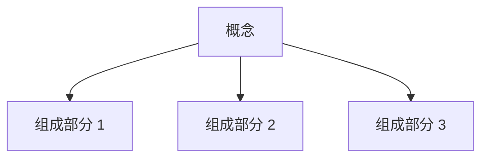

---
tags:
  - 模板
  - 笔记模板
  - Obsidian
created: 2026-03-07
updated: 2026-03-07
---

# 核心概念笔记模板

## 使用说明

此模板用于记录 AI 技术、产品方法论等核心概念知识。

---

## 📌 概念定义

> 用一句话概括核心概念

**详细说明**：

---

## 🎯 核心价值

为什么这个概念重要？解决什么问题？

- 
- 
- 

---

## 🏗️ 核心架构/组成

### 关键组件

| 组件 | 作用 | 特点 |
|------|------|------|
|  |  |  |
|  |  |  |
|  |  |  |

---

## 🔧 工作原理/方法

### 步骤 1：

### 步骤 2：

### 步骤 3：

---

## 📊 分类/类型

| 类型 | 特点 | 适用场景 | 优缺点 |
|------|------|----------|--------|
|  |  |  |  |
|  |  |  |  |
|  |  |  |  |

---

## 💡 应用场景

### 场景 1：

**示例**：

### 场景 2：

**示例**：

---

## 🆚 对比分析

### vs 竞品/替代方案

| 维度 | 本方案 | 替代方案 1 | 替代方案 2 |
|------|--------|-----------|-----------|
| 效果 |  |  |  |
| 成本 |  |  |  |
| 复杂度 |  |  |  |
| 适用场景 |  |  |  |

---

## 🛠️ 实践指南

### 实施步骤

1. 
2. 
3. 

### 最佳实践

- ✅ 
- ✅ 
- ✅ 

### 常见陷阱

- ❌ 
- ❌ 
- ❌ 

---

## 📈 评估指标

| 指标 | 定义 | 计算方法 | 行业基准 |
|------|------|----------|----------|
|  |  |  |  |
|  |  |  |  |

---

## 🔗 相关链接

- [[相关笔记 1]]
- [[相关笔记 2]]
- [[相关笔记 3]]

---

## 📚 参考资料

- [资料 1](链接)
- [资料 2](链接)
- [书籍/论文名称]

---

**元数据**：
- 创建时间：{{date}}
- 最后更新：{{date}}
- 标签：#模板 #核心概念

---

## 💭 个人思考

> 记录个人理解、疑问和洞察

**理解**：

**疑问**：

**洞察**：

