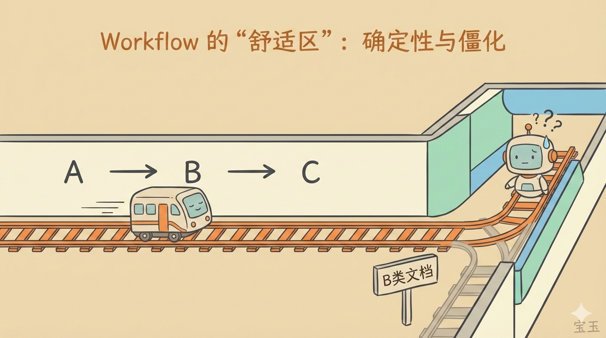
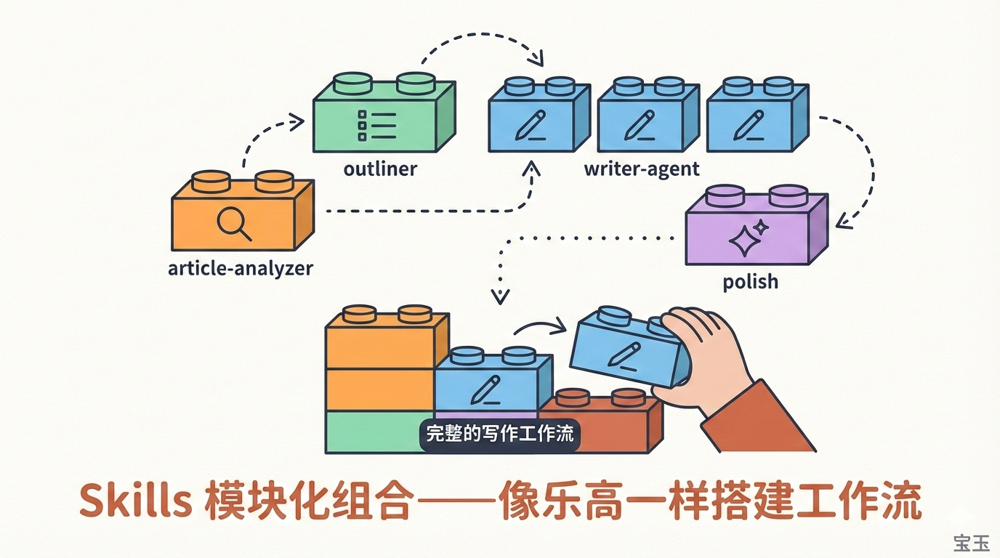
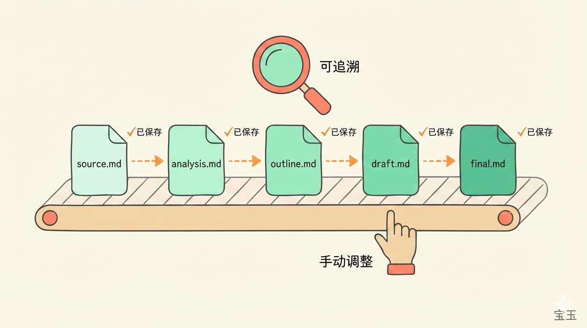
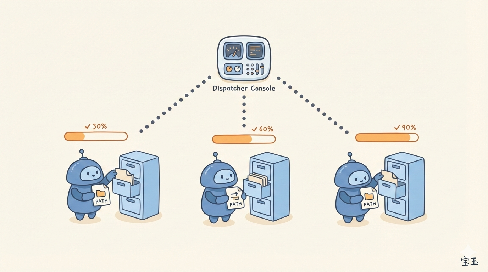
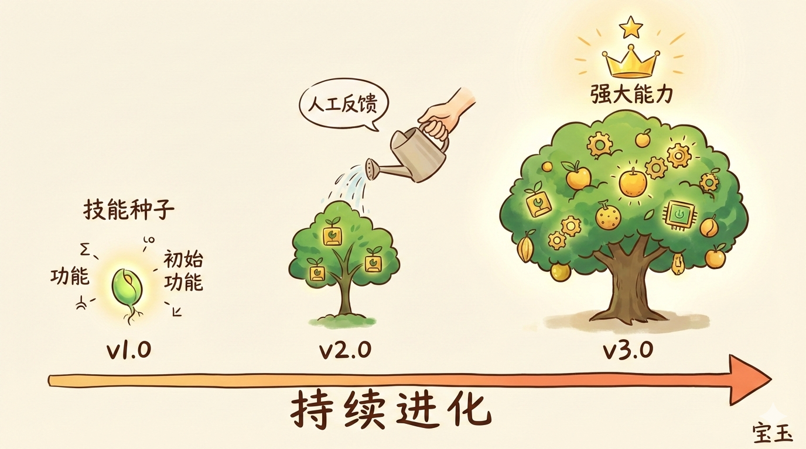
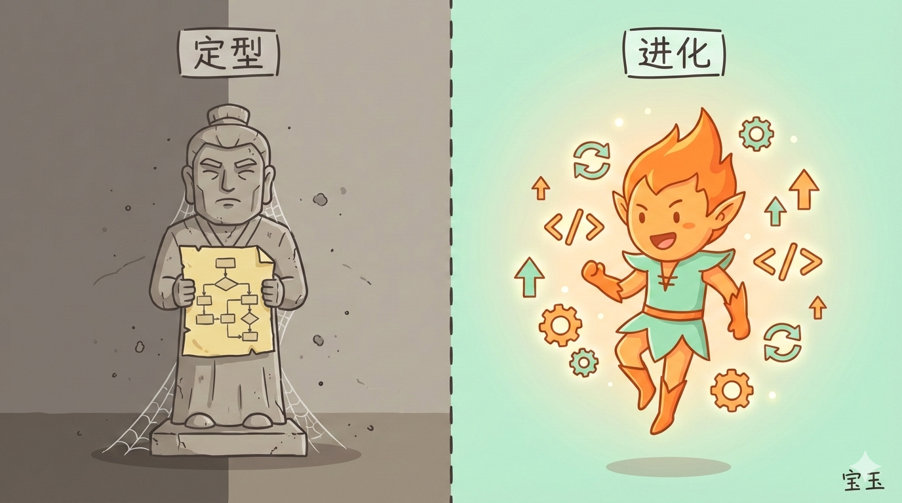

# 你可能不再需要 workflow，大部分场景 skills 足矣——五步框架把 Workflow 变成可进化的 Skill


过去一年，我一直在用 Agent + Skills 的架构替代传统的 Workflow 编排。起初只是觉得 Workflow 太重了，维护成本高，改一个节点要牵动整条链路。后来发现，这种架构不仅轻，还能随着业务自然生长——每次迭代，Agent 都能帮你把 Skill 优化得更贴合实际需求。

这篇文章分享一个五步框架：**拆分、编排、存储、分摊、迭代**，把原本僵化的 Workflow 变成可进化的 Skill。

---

## Workflow 编排的舒适区与局限

Workflow 的舒适区很明确：**确定性流程、合规场景、高频任务**。比如审批流、报销流、数据清洗管道，这些场景流程固定、节点职责清晰，用 Workflow 编排是最稳妥的选择。



但 Workflow 的局限也很明显：

1. **输入多变时，编排成本高**。Workflow 的每个节点都要预设输入格式，一旦上游输出变了，下游节点就要跟着改。比如"提取用户意图"节点输出变了，"查询知识库"节点就要改解析逻辑。
2. **跨系统协调时，耦合重**。Workflow 要把多个系统的接口串起来，每个接口的调用顺序、参数映射、错误处理都要硬编码。一旦某个系统升级了接口，整条链路都要跟着调整。
3. **需要频繁迭代时，维护成本高**。Workflow 是静态的，改一个节点要重新部署整条链路。如果业务逻辑经常调整，Workflow 的维护成本会越来越高。

> "Workflow 的本质是用确定性对抗不确定性。但业务的不确定性是常态，Workflow 的确定性就成了负担。"——我在一次内部复盘时的总结。

---

## Agent + Skills 的降维打击

Agent + Skills 的架构，本质上是用**自然语言编排**替代硬编码编排。Agent 负责理解任务、规划步骤、调用 Skills；Skills 负责执行具体操作、返回结果。这种架构有三个核心优势：



1. **编排灵活**。Agent 用自然语言描述任务流程，不需要硬编码节点顺序。比如"先提取用户意图，再查询知识库，最后生成回复"，Agent 会自动规划步骤、调用对应的 Skills。
2. **输入自适应**。Skills 只需要定义"做什么"，不需要定义"输入格式"。Agent 会根据上下文自动适配输入，比如把"用户想查订单状态"转换成"查询订单 Skill"需要的参数。
3. **可进化**。Skills 是模块化的，每次迭代都可以单独优化某个 Skill，不影响其他部分。Agent 还能根据执行结果自动优化 Skill 的描述，让 Skill 越用越精准。

> "Agent + Skills 的本质是用**理解能力**替代**编码能力**。理解能力是 AI 的强项，编码能力是人的负担。"——pippingg 在一次讨论中的观点。

---

## 五步框架：把 Workflow 变成可进化的 Skill

下面是一个五步框架，把原本僵化的 Workflow 变成可进化的 Skill。

### 第一步：拆分——把 Workflow 拆成 Skills

Workflow 的每个节点，本质上是一个"能力单元"。把这些节点拆成独立的 Skills，每个 Skill 只负责一件事。

比如一个客服 Workflow 有这些节点：
- 提取用户意图
- 查询知识库
- 查询订单状态
- 生成回复

拆成 Skills 后：
- `intent-extractor.ts`：提取用户意图
- `knowledge-search.ts`：查询知识库
- `order-query.ts`：查询订单状态
- `reply-generator.ts`：生成回复

**拆分原则**：每个 Skill 只做一件事，输入输出尽量简单。复杂的逻辑交给 Agent 编排。

---

### 第二步：编排——用自然语言描述任务流程

把 Workflow 的节点顺序，改成自然语言描述的任务流程。Agent 会根据描述自动规划步骤、调用 Skills。

比如客服任务的编排：
```
用户提问后，先提取意图，再根据意图查询知识库或订单状态，最后生成回复。
```

Agent 会自动理解这个描述，规划出：
1. 调用 `intent-extractor.ts` 提取意图
2. 根据意图决定调用 `knowledge-search.ts` 还是 `order-query.ts`
3. 调用 `reply-generator.ts` 生成回复

**编排原则**：用自然语言描述任务流程，不要硬编码步骤顺序。让 Agent 根据上下文自动规划。

---

### 第三步：存储——用文件管理中间结果

Workflow 的节点之间用变量传递数据，Agent + Skills 用文件管理中间结果。每个 Skill 把结果写入文件，下一个 Skill 从文件读取输入。



比如客服任务的文件流转：
- `intent.txt`：用户意图
- `query-result.txt`：查询结果
- `reply.txt`：最终回复

**存储原则**：用文件管理中间结果，每个 Skill 只关心自己的输入输出文件。文件格式可以是文本、JSON、Markdown，只要 Skills 能理解就行。

---

### 第四步：分摊——把复杂度分散到多个 Skill

Workflow 的复杂度集中在编排层，改一个节点要牵动整条链路。Agent + Skills 把复杂度分摊到每个 Skill，每个 Skill 只负责自己的逻辑。



比如客服任务的复杂度分摊：
- `intent-extractor.ts` 只负责提取意图，不需要知道下游怎么用
- `knowledge-search.ts` 只负责查询知识库，不需要知道上游怎么提取意图
- `order-query.ts` 只负责查询订单，不需要知道回复怎么生成
- `reply-generator.ts` 只负责生成回复，不需要知道数据从哪来

**分摊原则**：每个 Skill 只关心自己的职责，不需要知道上下游的逻辑。复杂度分散，维护成本降低。

---

### 第五步：迭代——让 Skill 可进化

Workflow 是静态的，改一个节点要重新部署整条链路。Agent + Skills 的 Skill 是可进化的，每次迭代都可以单独优化某个 Skill，Agent 还能根据执行结果自动优化 Skill 的描述。



比如客服任务的迭代：
- 发现 `intent-extractor.ts` 提取意图不准确 → 优化 Skill 的描述，增加"用户意图类型"的说明
- 发现 `knowledge-search.ts` 查询结果不相关 → 优化 Skill 的查询逻辑，增加"相关性排序"
- 发现 `reply-generator.ts` 回复太生硬 → 优化 Skill 的生成模板，增加"语气友好"的要求

**迭代原则**：每次迭代只优化有问题的 Skill，不影响其他部分。Agent 可以根据执行结果自动优化 Skill 的描述，让 Skill 越用越精准。

---

## 适用边界：什么时候用 Workflow，什么时候用 Skills

不是所有场景都适合 Agent + Skills。Workflow 和 Skills 各有适用边界：

| 场景 | Workflow | Agent + Skills |
|------|----------|----------------|
| 确定性流程 | ✅ 合规、审批、数据管道 | ❌ 过度设计 |
| 输入多变 | ❌ 编排成本高 | ✅ Agent 自动适配 |
| 跨系统协调 | ❌ 耦合重 | ✅ Skills 解耦 |
| 高频任务 | ✅ 性能稳定 | ❌ Agent 有延迟 |
| 需要频繁迭代 | ❌ 维护成本高 | ✅ Skills 可进化 |
| 非技术用户 | ✅ 可视化编排 | ❌ 需要写 Skill |

**决策原则**：
- **Workflow 适合**：合规场景、高频任务、非技术用户、确定性流程
- **Agent + Skills 适合**：输入多变、跨系统协调、需要频繁迭代
- **混合架构**：代码处理确定性逻辑，Agent 处理判断任务

> "不要为了用 Agent 而用 Agent。Workflow 的确定性在某些场景是优势，不是劣势。"——我在一次技术选型时的提醒。

---

## 可进化优势：僵化的 Workflow vs 活的 Skill

Workflow 的最大问题是**僵化**。一旦部署，就固定了。业务变了，Workflow 要重新设计、重新部署。



Agent + Skills 的最大优势是**可进化**。每次迭代，Agent 都能帮你把 Skill 优化得更贴合实际需求。Skill 越用越精准，业务越做越顺。

> "Workflow 是死的，Skill 是活的。死的 Workflow 要人去改，活的 Skill 能自己进化。"——我在一次复盘时的总结。

---

## 实践案例：Rakuten、Box 等公司的 Agent 架构

Rakuten、Box 等公司已经在用 Agent + Skills 的架构替代传统 Workflow：

- **Rakuten**：用 Agent 架构处理客服任务，把原本 12 个节点的 Workflow 拆成 4 个 Skills，维护成本降低 60%
- **Box**：用 Agent 架构处理文档处理任务，把原本 8 个节点的 Workflow 拆成 3 个 Skills，迭代周期从 2 周缩短到 2 天

McKinsey 的报告也提到：**Agent 架构能降低 30-50% 的维护成本，提升 20-40% 的迭代效率**。

---

## 总结

Workflow 的舒适区是确定性流程，但业务的不确定性是常态。Agent + Skills 的架构，用自然语言编排替代硬编码编排，用理解能力替代编码能力，把 Workflow 的僵化变成 Skill 的可进化。

**五步框架**：拆分、编排、存储、分摊、迭代。把 Workflow 拆成 Skills，用自然语言编排，用文件管理中间结果，把复杂度分散到每个 Skill，让 Skill 可进化。

**适用边界**：Workflow 适合确定性流程、合规场景、高频任务；Agent + Skills 适合输入多变、跨系统协调、需要频繁迭代。

**核心观点**：Workflow 是死的，Skill 是活的。不要为了用 Agent 而用 Agent，选择适合场景的架构。

---

**来源**: https://baoyu.io/blog/2026/01/10/agent-skills-replace-workflow  
**作者**: 宝玉  
**入库日期**: 2026-03-31  
**入库原因**: Agent架构实践方法论，补充知识库