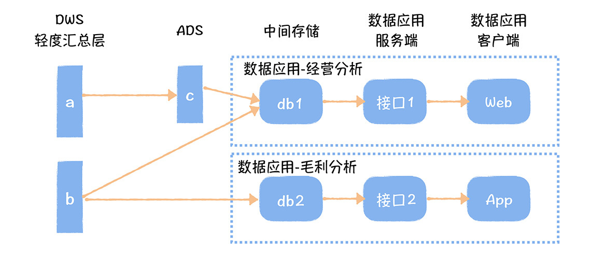
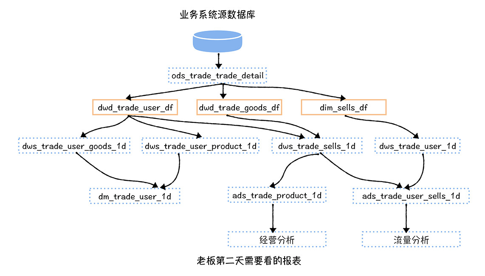
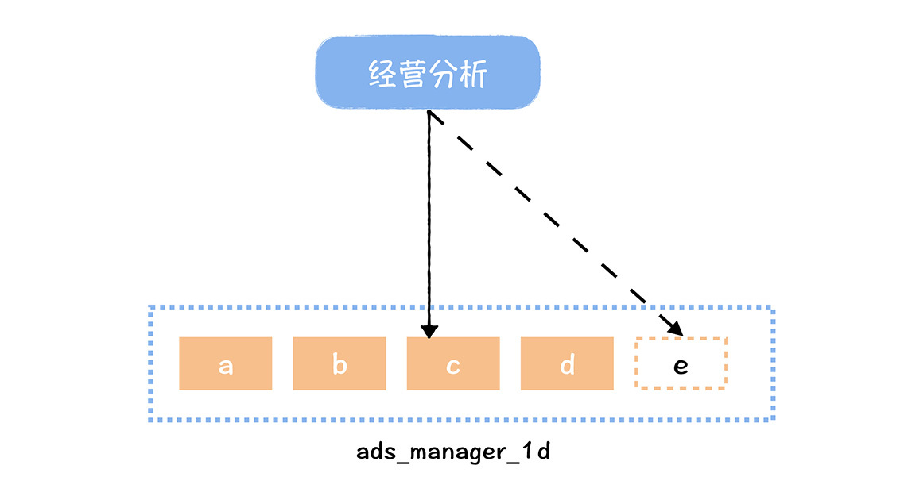
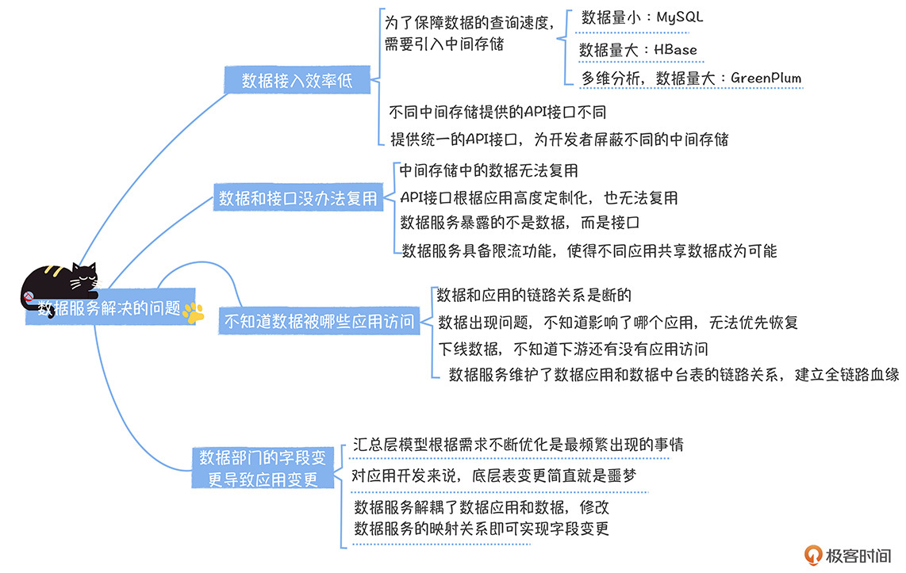

# 09 | 数据服务到底解决了什么问题？

你好，我是郭忆。

从 04 讲元数据中心开始，到 08 讲成本治理，我已经把元数据以及在它基础上的五大应用场景：数据发现（数据地图）、指标管理、模型设计、数据质量、成本优化，全部讲完了。这部分内容对应的就是数据中台 OneData 方法论。相信学完这部分内容之后，你已经了解了 OneData 方法论在企业内部落地的方法了。

而这节课我要和你聊的，是数据中台另外一个核心方法论，OneService 的实现：数据服务。

服务化在业务系统中提的比较多，它是业务系统化繁为简，实现业务拆分的必经之路（特别是这几年微服务的概念深入人心）。那对于数据中台，服务化意味着什么呢？数据服务到底解决了什么问题？ 我相信很多人会有这样的疑问。

> 服务化：不同系统之间通过服务方式交互，服务通常以 API 接口形式存在。

当然，关于数据服务的“料”很多，信息比较密集，所以我会用两讲的时间帮你搞清楚这部分内容，今天咱们先来从问题入手，看一看数据服务解决了什么问题，打消你“为什么要有数据服务”这样的疑问。

在我看来，要想搞清楚数据服务解决了什么问题，就要先知道，没有数据服务，我们在日常数据建设中存在哪些痛点。

## 数据接入方式多样，接入效率低

数据中台加工好的数据，通常会以 Hive 表的形式存储在 HDFS 上。如果想直接通过数据报表或者数据产品前端展现，为了保证查询的速度，会把数据导出到一个中间存储上：

- 数据量少的可以用 MySQL , Oracle 等 DB，因为部署维护方便、数据量小、查询性能强。比如数据量小于 500W 条记录，建议使用 DB 作为中间存储；
- 涉及大数据量、多维度查询的可以用 GreenPlum，它在海量数据的 OLAP（在线分析处理）场景中有优异的性能表现。比如数据量超过 500W 记录，要进行多个条件的过滤查询；
- 涉及大数据量的单 Key 查询，可以用 HBase。在大数据量下，HBase 拥有不错的读写性能。比如超过 500W 记录，根据 Key 查询 Value 的场景。如果需要用到二级索引，由于 HBase 原生不支持二级索引，所以可以引入 ES，基于 ES 构建二级索引和 RowKey（HBase 中的 Key）映射关系，查询时先根据二级索引在 ES 中找到 RowKey，然后再根据 RowKey 获取 HBase 中的 Value 值。

因为不同的中间存储，涉及的访问 API 也不一样，所以对数据应用开发来说，每个数据应用都要根据不同的中间存储，开发对应的代码，如果涉及多个中间存储，还需要开发多套代码，数据接入效率很低。

而数据服务为数据开发屏蔽了不同的中间存储，应用开发使用统一的 API 接口访问数据，大幅度提高了数据应用的研发效率。

当然了，数据接入效率低，除了跟对接不同的中间存储有关，还因为数据和接口不能复用。这又是怎么回事呢？

## 数据和接口没有办法复用

我们还是举个例子。

在上图中，当我们开发“数据应用 - 经营分析”时，数据开发会基于 a 表加工 c 表，然后数据应用开发会把 a 和 b 的数据导出到“数据应用 - 经营分析的数据库 db1”中，然后开发经营分析的服务端代码，通过接口 1 对 web 提供服务。

当我们又接到任务开发“数据应用 - 毛利分析”时，我们同样需要用到 b 表的数据，虽然 b 的数据已经存在于 db1 中，但 db1 是“数据应用 - 经营分析”的数据库，无法共享给“数据应用 - 毛利分析”（因为不同应用之间共享数据库，会存在相互影响）。

同时，经营分析的服务端接口也无法直接给毛利分析用，因为接口归属在经营分析应用中，已经根据应用需求高度定制化。

所以我们看到这样的现象：即使数据重复，不同数据应用之间，在中间存储和服务端接口上，也是无法复用的。这种烟囱式的开发模式，导致了数据应用的研发效率非常低。

而数据服务，使数据中台暴露的不再是数据，而是接口，接口不再归属于某个数据应用，而是在统一的数据服务上。这就使接口可以在不同的数据应用之间共享，同时因为数据服务具备限流的功能，使接口背后的数据共享成为可能，解决了不同应用共享数据相互影响的问题。

那么当数据应用上线之后，我们就进入了运维阶段，如果这个阶段没有数据服务的话，会出现什么问题呢？

## 不知道数据被哪些应用访问

来看一个我身边的案例。

张好看（化名）是一名数据开发，某一天的凌晨，她突然接到了一堆电话报警：有大量的任务出现异常（对应上图中红色表的产出任务）。经过紧张的定位后，她确认问题来源于业务系统的源数据库，也就是说，因为一次数据库的表结构变更，导致数据中台中，原始数据清洗出现异常，从而影响了下游的多个任务。

这时，摆在她面前的，是一堆需要恢复重跑的任务。可是队列资源有限，到底先恢复哪一个呢？ 哪个任务最终会影响到老板第二天要看的报表呢？

虽然数据血缘建立了表与表之间的链路关系，但是在表的末端，我们却不知道这个表被哪些应用访问，所以应用到表的链路关系是断的。当某个任务异常时，我们无法快速判断出这个任务影响了哪些数据应用，从而也无法根据影响范围决定恢复的优先级，最终可能导致重要的报表没有恢复，不重要的报表却被优先恢复了。

同样，在成本治理中，我也提到，因为没有应用和数据的链路关系，我们不敢贸然下线数据。

而数据服务打通了数据和应用的访问链路，建立了从数据应用到数据中台数据的全链路数据血缘关系，这就等于我们在迷宫中拿到了一个地图，当任何一个任务出现问题，我们都可以顺着地图，找到这个故障影响了哪些应用，从而针对重要应用加速恢复速度。同样，我们也可以放心的下线数据中台中任意一张表。

除了不知道数据被哪些下游应用使用，在运维阶段，我们还经常面临着数据表频繁重构，而这也许是数据应用开发最可怕的噩梦了。

## 数据部门字段变更导致应用变更

数据中台底层模型的字段变更是比较频繁的一个事情，因为本身汇总层的模型也在随着需求不断优化。

“数据应用 - 经营分析”使用了数据中台的 ads_mamager_1d 这张表的 c 字段，如果我们对这张表进行了重构，访问字段需要替换成 e 字段，此时需要数据应用修改代码。这种因为数据中台的数据变更导致应用需要重新上线的事情，是非常不合理的，不但会增加应用开发额外的工作量，也会拖累数据变更的进度。

有了数据服务，就会把数据应用和中台数据进行解耦，当中台数据表结构变更时，我们只需要修改一下数据服务上接口参数和数据字段的映射关系就可以了。不需要再修改代码，重新上线数据应用。

## 课堂总结

你看，我列举了在数据接入和运维过程中，遇到的 4 个典型的问题，也为你简要分析了数据服务为什么能够帮我们解决这些问题。而这些问题会让数据应用使用中台数据效率低下，同时也带来了中台数据维护的烦恼。

今天这部分内容，是下一讲的基础，下一讲我会和你聊一聊数据服务具备哪些功能，如果你正准备设计一个数据服务，或者正在做数据服务的产品选型，那你一定要留意这部分内容。最后，我会提供给你一个网易数据服务的实现方案，告诉你在数据服务实现上的几个关键设计。

在最后，我通过一个脑图，总结一下今天的内容。

## 思考时间

其实，在我刚接触数据服务的时候，我听到最多的一种说法，数据服务解决了数据的安全性的问题，你觉得有道理吗？ 欢迎你在留言区与我互动。

最后，感谢你的阅读，如果这一节课让你有所收获，也欢迎你将它分享给更多的朋友，我们下一讲见。

---
来源：极客时间
链接：https://time.geekbang.org/column/article/227418
日期：2026-05-18
