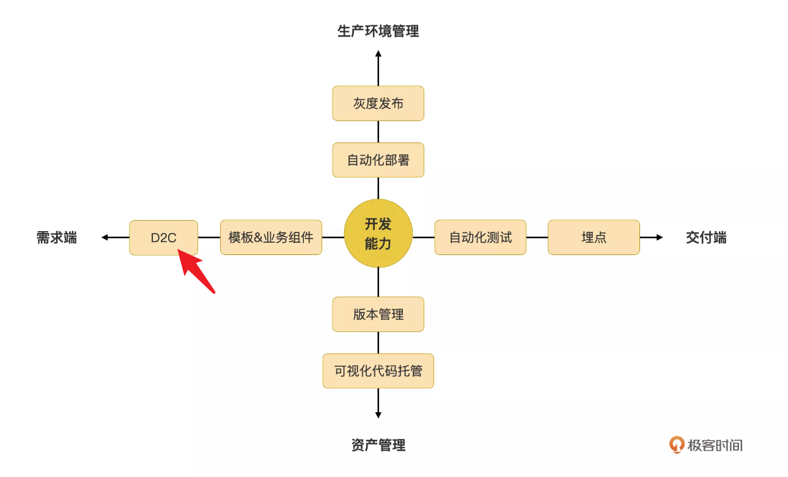
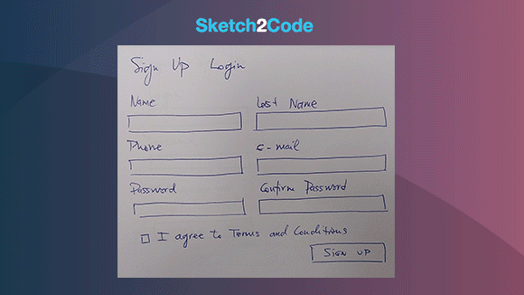
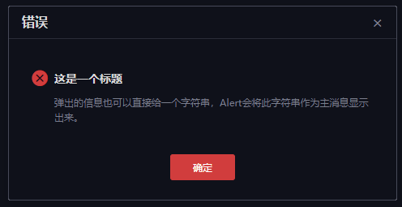
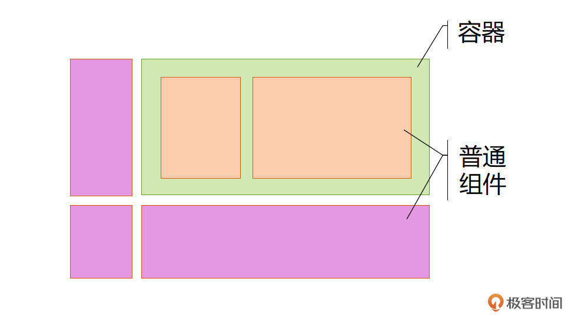
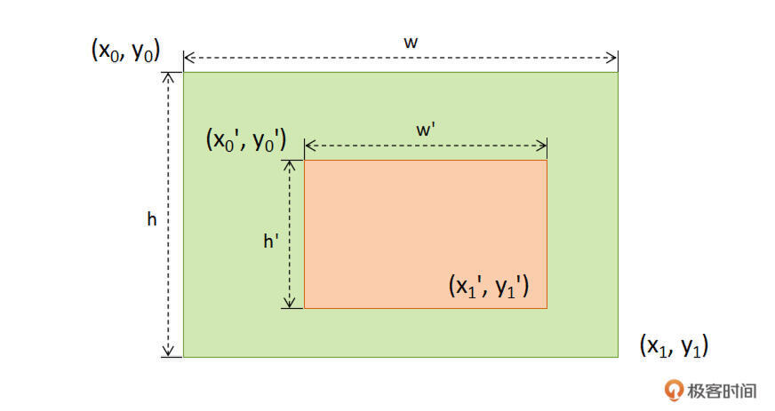
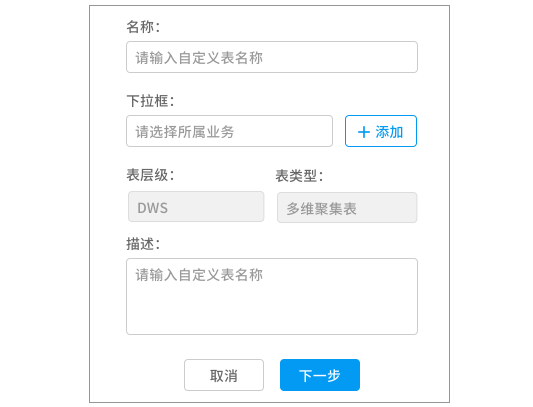
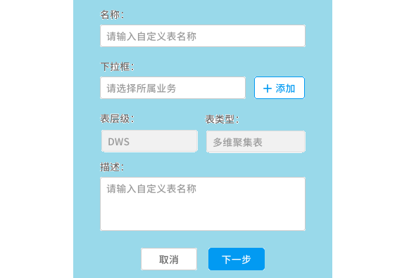

# 19｜如何使用平民技术实现UX设计稿转代码？

你好，我是陈旭。

在[第 15 讲]()中，我们简要讨论了低代码平台除了关注开发能力之外，还需要关注哪些能力的建设，你可以回顾一下这一讲。在那一讲中，我给出了下面这个低代码平台能力之外的能力雷达图，其中水平线上，靠近需求端，有一个 D2C（Design to Code）的能力，这正是今天这一讲我们要解决的问题。

我们知道，布局是 App 开发三部曲（布局、交互、数据）中的第一步，任何一个 App 开发的第一步，总是需要对这个 App 里用到的组件做布局，这一步是在给这个 App 打地基（我在[第 8 讲]()里详细讨论了低代码平台上多种不同的布局方法）。那么，低代码平台上除了通过鼠标拖拽方式来完成 App 的布局之外，还有没有更高效的方法呢？当然有，没错，就是 D2C。

在布局 App 的过程中，可视化方式布局与手工编码的输入差不多，都是基于 UX 给的设计稿，采用各自的方式人工转为 App 的配置（或代码）。这个过程中，低代码 offer 了可视化的布局方式，解决了手工编码布局的许多问题，但依然很难说可视化布局方式就是最优的，因为这种方式依然存在**重复劳动**的过程。D2C 正是为了消除这个重复劳动，输入 UX 设计稿，输出的是可编辑的页面布局配置。

## 背景＆现状

前面我们着重讨论了 D2C 在低代码平台建设方面的背景，下面我们跳出低代码，从整个业界的角度来看 D2C。D2C 非但不是新鲜的能力，经过近三年的高速发展，可以说现在已经是非常成熟了。我从各个行业技术大会、技术专栏、技术公众号上了解到，国内外各大厂基本都建设了能力不同的 D2C，而且早已投入到生产环境的使用上了。大厂们的 App 可以做到千人千面，背后是需要 D2C 技术的支持的。

2017 年，[pix2code]() 这篇论文实现了这样的效果：经过训练后的深度学习算法可以接收一个 UI 截图作为输入，识别并生成了对应的 UI 结构，并且将 UI 结构描述转化成了 HTML 代码，吹响了 UI to Code 的号角。一年后的 2018 年，微软 AI Lab 开源了 [Sketch2Code]()，实现了手绘草图的识别，并生成了代码。

国内大厂迅速跟进，纷纷推出组件的解决方案。阿里在 2019 年上线 [imgcook]()，随后 58 推出了 Picasso，美团也有了 ui2code，甚至还出现了以设计稿转代码为主营业务的商业软件。研发智能化这个词，也就应运而生了。当然，在 2022 年底的现在，在 copilot 和 ChatGPT 等 AI 编码辅助的加持下，研发智能化已经有了更加丰富的内涵，但这不是我们的重点。

从收集到的资料看，[pix2code]() 也好 [Sketch2Code]() 也罢，包括一众大厂给出的 D2C 解决方案，基本都需要**依赖深度学习**，这对于没有这方面技术和算法积累的团队来说，成本非常高。即使所在公司已经有成熟的深度学习框架，但要训练出识别准确率满意的识别算法依然难度很大，更不用说大多数公司其实并没有深度学习框架的支持。

既然自行训练识别算法很难，那直接拿别人的 D2C 功能来用不行吗？拿来主义带来的问题并不比自研少。识别准确率是一个痛点，识别算法往往是针对某种业务场景训练而来的，在该场景下表现会很好，**脱离了整个场景，识别准确率会大幅下降**。还有，生成的代码的 UX 规范是否恰好是你需要的？还有最大的一个问题是，现在基本所有 D2C 功能输出的都是代码（废话！），如何与你的低代码平台对接？这可是一个大问题，这个问题基本无解。

那么，有没有一种足够平民的 D2C 实现技术，既可以快速简单实现，又可以满足与低代码平台无缝对接呢？下面我就给出一个这样的 D2C 的技术实现思路。

## 预置条件

在开始讲解思路之前，我先要给出预置条件。

**首先是必要条件：**一个 UX 团队或者至少有一名 UX 设计师。没有设计师就没有设计稿，没有设计稿那还何从谈起 D2C 呢？所以，如果你现在还没达成这个条件，那可以考虑招聘一名 UX 设计师，或者也可以和其他团队合作。

**然后是两个充分条件：**UX 规范和配套的 Web 组件集。UX 规范是设计师和研发之间的衔接桥梁，与之配套的 Web 组件集则是 Web 界面研发中最重要不过的基础设施。这两个条件看起来门槛挺高的，该怎么办呢？

**没有 UX 规范？抄！**阿里的 [antd]()，业界良心之作，字节的 [arco]() 也不赖。没有配套的组件集？抄！antd 和 arco 都有配套的开源组件集。当然我司的开源组件集 [Jigsaw]() 也是一个不错的选择，它配套的 UX 规范也开源了哦。Jigsaw 是一套专门为低代码平台设计开发的组件集，特别适合用于构建低代码平台这样的复杂页面，也特别适合配合低代码平台的可视化代码自动生成。

说到组件集，这不仅是 Web 界面研发中最重要的基础设施，也是低代码平台的重要基础设施，关于组件集和低代码的关系，你可以回顾一下[第 5 讲]()。

我有大概了解过各大厂 D2C 的技术实现方案，特别是 imgcook，从他们公众号、D2 上的演讲，甚至还邀请了 imgcook 团队的负责人面对面直接交流。我发现大厂们的实现方案都忽略了 UX 规范在 D2C 识别过程中的作用。他们都是采用纯技术碾压的方式解决了 D2C 的问题（是的，他们有这实力），而我发现如果借助 UX 规范的辅助，则可以大幅度降低 D2C 的实现难度，这也就是这讲的标题所说的，其实可以采用非常平民的手段来实现 D2C。

## UX 设计方法调整

这一小节是为没有计算机视觉技术积累的团队准备的。这讲的重头部分是 3 个识别算法，但这 3 个算法都需要依赖设计稿中一个重要数据：**组件的类型**。人类可以轻易从一份 UX 设计稿中认出各种组件，但是这对计算机来说，却是一个挑战。而一旦组件类型识别错误，那么接下来所有推断算法都必然出错。

所以，为了最大限度降低实现的难度以及提升算法识别的准确率，我们有理由把如此重要的一个事情交给人类——**准确地说是 UX 设计师**——来完成。当然，我们不能简单粗暴地要求设计师在输出 UX 设计稿时额外多给一份配置文件，而是要把这个配置过程尽可能地自动化，以减少对设计师日常工作的侵入性。

为了提升出设计稿的效率，我们的设计师和研发类似，也会采用组件化思想的方式来快速生成设计稿，并且保持拆分出来的 UX 组件和前端组件基本一致。如果你的 UX 团队还没有采用类似的组件化思想，那么你可以建议他们开始尝试采用这个方式来提升效率。

在 UX 团队已经采用组件化方式来组装 UX 设计稿的前提下，那只要**规范命名这些** **UX** **组件**，就可以在对 UX 设计师的工作几乎没有侵入的前提下，把组件的类型植入到 UX 设计稿里去了。注意这里的 UX 设计稿指的是 UX 设计工具（如 sketch）输出的数据，而非仅仅是效果图。

至于如何规范命名 UX 组件的名字，方法可就很多了，可以根据组件的实际情况自行设计，我们采用的是**三段式命名规则**，比如 plx:button:error，第一段是 UX 规范的大版本，第二段是组件的种类，第三段是组件的主要状态。有了这样的规则之后，下面在遍历设计稿数据时，每碰到一个符合这个规则的片段时，我们就可以知道这是一个啥类型的组件了。

那为啥前面说这小节是给没有计算机视觉技术积累的团队准备的呢？

在软件开发领域，人是最不可靠的，是人就要犯错。一旦设计师没有按照前面定下的“规矩”出设计稿，接下来的一套组合拳就会失灵，为了规避这个问题，我们需要有一个更加智能的方式来识别组件的类型，**计算机视觉**就足以解决这个问题。每个组件都会有显著的特征，包括颜色、边缘、直线、圆角等，利用计算机视觉的图像处理能力，在设计图里根据这些特征“按图索骥”就可以找出设计图里都有哪些组件了。

好了，现在万事俱备只欠东风，接下来我给出在设计稿里识别出足够生成代码的信息的几个主要的算法。

## 设计稿识别算法

### **组件属性的识别**

下面我们以这样一个对话框为例，来说明如何读取出设计稿中的各个属性值。

为了避免你不会被我给的这个图片误导，这里有必要再强调一次，这里说的**设计稿**，并不是特指**设计图**，而是指设计软件输出的数据，高保真图是这些数据之一。

在设计软件输出的数据中，这个对话框是由多个图层垂直叠加而成的，比如边框是一层，图上的文字是一层，按钮是一层等，每一层都有特定的数据来描述。数据结构视不同的设计软件而定，但无论是哪种设计软件，一般都会包含尺寸、位置和其他各种信息（如文本、图标）。一些热门的设计软件往往会有许多工具可以将这些数据转为对软件友好的结构化数据，比如我们的设计师用的是 sketch，我们用一个叫 sketch-meaxure 的软件来获得结构化数据。

回到主题，即使是这样一个简单的对话框，也包含了至少 5 个属性需要读取。如果你盯着这个效果图找答案，估计会越想越觉得困难。大厂们在解决这个问题时，仗着自己技术实力雄厚，直接从图上找答案。

**别忘了我们还有 UX 规范**！

经过前面的 UX 设计方法调整后，我们就已经可以知道这是一个对话框了，这是 UX 设计师给我们的辅助信息。UX 规范中对一个对话框所有属性的描述是精确到像素级的，比如对话框的标题一定是在距离边框 16px 高、靠左 24px 的位置，所以我们在这个位置上读出的任何文本，那肯定都是对话框的标题。用相同的办法，对话框互动按钮一定在距离下边框 20px 且居中的位置。所以在这里读取到的任何文本，必然是按钮的文本，读取到的颜色，就是按钮的背景色。

通过颜色或文本，我们不需要额外动作，就可以直接推断出按钮的其他属性，我们的 UX 规范规定了，对话框的按钮只有 3 种情况：**普通主动按钮、危险主动按钮、次要按钮**，区别仅是背景色，只要读取到图上的红色值，就立即可以断定这是一个危险主动按钮，然后根据这种按钮的 UX 规范，自动就可以拿到生成这个按钮代码的几乎所有信息了。

采用类似的方法可以把提示信息主题、图标、提示信息主文本等所有属性值一一读取出来。有了这些信息，就可以生成相应的这个对话框的代码了。

### **层级结构推断**

虽然 UX 设计师也提取了各式各样的 UX 组件用于快速拼装设计稿，但是 UX 设计师眼里的组件和前端开发所用的组件在使用时却有巨大的差异，以下面这个设计稿为例。

不难看出，这是一个对话框，里头装了一个 tab 页，有 2 个页签，页签里有一个雷达图。显然这里是有**层次结构**的，对话框是一层，tab 页是第二层，雷达图在第三层。但是，这只是你以为的，在设计师眼里，这个设计稿是**上下结构**的！最上面一条是对话框标题组件，下面一条是页签头组件，然后是雷达图组件，最下面是对话框按钮栏组件。所以，作为研发的你，有时无法搞清楚 UX 设计师是如何思考问题的，这一点都不用觉得奇怪。

那么现在问题来了，如何把一个扁平的设计稿，还原成一个合理的层次结构呢？

**等等，为啥要还原出层级结构呢？**这是因为合理的层次结构可以更容易生成对人类友好的代码来呀！按照扁平结构生成代码行不行？当然可以，但是这样的代码没人能改得了。这也就是有的 UX 设计软件（如 Axure）在输出设计稿时，也能输出 HTML 代码，但没人愿意去改它生成的代码的原因，这些代码毫无逻辑可言，看不懂、改不动。

为了计算的方便，我们来对 UI 做一些抽象，和 CSS 的盒子模型相似，我们可以把界面抽象为一个个的盒子。有的盒子里还能装下其他的盒子，这种盒子我们称为容器，把容器之外的统统称为普通组件。这样一来，某一个界面就可以画成这样了。

可以通过它们相互覆盖的关系来推断出它们的层次结构，算法其实非常简单，当一个盒子完全被另一个盒子覆盖时，它们就构成了父子级关系，未完全覆盖的盒子，就是兄弟关系。

具体的，可以使用下面这组不等式来精确描述：

### **UI 弹性推断**

UX 设计稿包含的信息再多，但有一个信息是无论如何无法表达的，那就是 UI 的弹性。你可以思考一下，下面这个设计稿会有几种可能的弹性布局。

至少有两种合理的弹性布局：**两翼有弹性中间固定尺寸或者两翼固定尺寸中间有弹性**。那么，静态的 UX 设计稿，如何表达动态的弹性布局配置呢？

必须承认的是，纯技术是无法解决这个问题的，所以这里需要引入一些人工辅助和一些事先约定。我们与 UX 团队约定，在需要有弹性的部位，放上一个看不见的容器，下图是一个示意：

图中蓝色部分就是这样一个容器，当然，正常情况下人类是看不到的，因为这个容器是透明的，**只有算法才能“看”到它**。那么接下来的事情就相对简单了，蓝色覆盖的部分，就会生成有弹性的代码，其他就固定尺寸。

你可能会问，那么，蓝色区域内部精细部分的弹性如何配置呢？理论上也可以采用弹性容器嵌套的方式来实现，但这样会显著侵入 UX 设计师的日常工作，是无法接受的。因此我们采用了**事先约定**的方式，在定义 UX 规范时，我们会顺便约定一个组件的弹性偏好。比如按钮这样的组件，垂直和水平上都是不弹性的。再如输入框，则垂直上偏好固定但水平上偏好弹性。这样生成的代码的弹性属性就很接近实际需要了。

显然辅助 + 约定解决不了所有弹性问题，在任何一个具体的业务场景，都会出现或多或少的特例，这样的情况我们就得交给 UX 设计师和开发人员自行处理了。UX 设计可以按需使用嵌套弹性容器，从而提高 UX 设计稿识别准确率避免落地失真，他们也可以将解释权交给开发人员，由开发人员在生成的代码上按需做调整。

## 小结

在各行各业数字化转型轰轰烈烈进行的大背景之下，研发智能化这把火现在正在逐渐燃烧，相信用不了多久，就会和低代码一样形成熊熊大火，现在也出现许多智能化研发的概念，但真正能落地到生产环境中去的，目前唯有 UX 设计稿转代码这一个点。

提效是低代码平台的两大职能之一，虽然低代码平台普遍有了非常酷的拖拽式的静态布局方法，但毕竟还是要花时间来把 UX 设计稿复刻过来。如果能够以较低的成本实现一个 UX 设计稿转代码功能，从而使低代码平台的能力向左拓展到需求端，这对低代码平台的能力和价值是一个不小的提升。把 UX 设计稿上传到低代码平台，在秒级时间内得到一份对人类友好、可以维护的代码，这可以大幅度减少静态页面开发的时间，提升效率。

更进一步，这个功能还开启了一种新的开发模式，我称之为**设计即开发模式**。现在，UX 设计稿等于代码，那么 UX 设计师也就等于开发人员了。研发团队为了提效，常常会积累一些模板、由若干原子组件拼装而成的常用部件（称为业务组件），这些模板和业务组件在日常开发中常常被拷贝到各个新旧 App 中，提升开发效率。以前这些工作只能由研发团队自行完成，现在 UX 设计师在 D2C 的支持下，完全有能力完成这些业务素材的开发和维护。

而且，在特定场景下，UX 设计稿转为代码之后还可以进一步植入业务代码，使得 UX 设计稿一步到位转为可用 App，这就是 D2P（Design to Production）功能了。D2P 可以用于一些程式化、业务逻辑相似程度很高的场合，也可以用于一些短平快、短周期、快速试错的场景。虽然适用 D2P 的场景要求比较苛刻，一旦提取出这样的场景，UX 出图之后，数秒之内 App 就可以上线，这是一个何等美妙的过程。也许，产品经理也该学点 UX 设计了。

这一讲我们没能完成如何基于层次结构来生产对人类友好的代码的算法讲解，在下一讲中，我将会专门讲解一些算法的实现思路，看看如何使用切蛋糕的方式来生成代码。

## 思考题

如果现在就拉上你的 UX 团队来学习这节课，他们会喜欢这个平民化的 D2C 实现思路吗？他们会愿意和你携手一起来打造属于你们的 D2C 能力吗？

欢迎尝试，期待你的反馈！我是陈旭，我们下一讲再见。

---
来源：极客时间
链接：https://time.geekbang.org/column/article/620582
日期：2026-05-18
