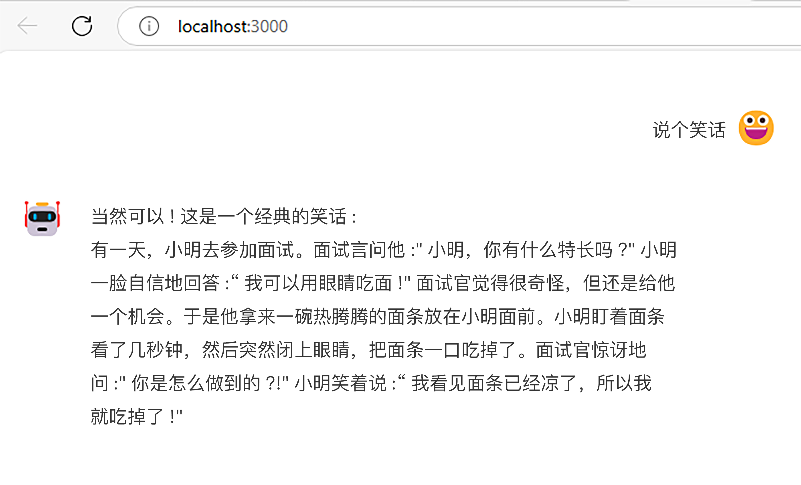
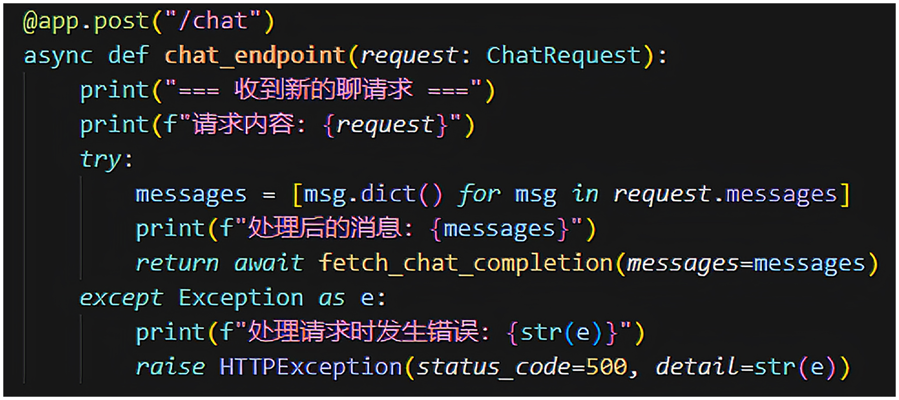

# 27｜低代码助手第一步，Chatbot的实现

你好，我是陈旭。

前面我们花了两讲的内容，详细梳理了 AI 对低代码平台带来的冲击，也分析了可能的机会。更主要的是通过这些分析，我们基本上想清楚了应对的策略。那接下来，我们就来一步步做出调整，帮助低代码平台往智能化方向演进。

在智能化方向上，我们需要实现不少与智能化相关的基础技术，因此接下来的不少内容，都将与大模型直接相关。这些内容适用于多数想要往智能化方向演进的其他产品，所以，你也可以将接下来的内容转发给你那不成器的兄弟，帮助他在智能化转型这个事情上，少走些弯路。

我们需要解决的第一个问题就是人机交互的入口——Chatbot，它需要具有这样的特点：

它需要能接受文字以及其他模态的提示信息，并正确地将这些信息转发给大模型；它需要能够处理大模型的反馈，与 ChatGPT 直接将大模型输出的文字显示出来的方式不一样。在多数情况下，我们的 Chatbot 需要正确地理解人类意图并执行一些 action，然后输出少量文字给人类；它需要易于集成，包括技术上的，也包括 UX 风格上的。

## 前端技术选型

市面上能满足第一条的多如牛毛，但是能满足第二条就不多了。由于需要在后台执行一些 action，这一点基本就要求这个 Chatbot 需要能和我们自己的服务端对接，这样一来，所有的那种在线大模型 hub 就都全部排除了。

所以，我们的目标基本就锁定在了那些可以写代码做二次开发的 Chatbot 解决方案上了，在这个情况下，第三条基本就和第二条差不多了，除了 UX 风格。如果把 UX 风格也考虑在内，那基本上没有可选了，只能自己开发了。我们这里不考虑 UX 风格，只考虑功能。

明确了我们选型目标后，我去搜了一把，能用的非常少，只有下面这 2 个备选。

[ChatUI]()，这是一个服务于只能对话领域的设计和开发体系，助力智能对话机器人的构建。

[Pro Chat]()，蚂蚁开源的一个解决方案。

这俩我都不满意，我本想找一个前后端一体的，但是这两个解决方案只有前端，没有服务端能力。

> 你可能会问：陈老师 awade 用啥解决方案？答案是：我们自研了 Chatbot。我对人机交互做了很深入的思考，我断定高度灵活的 AI 必然导致人机的触点必须要有巨大的灵活性和可能性，同时 UX 团队也及时定义了完善的智能化规范，再加上当时市面上压根就没有可选的开源解决方案。最后提一句，很可惜，我们没有开源的计划。

综合看了一下，我挑了 Pro Chat 作为咱们这个专栏的 Chatbot 的前端解决方案。然后，再给你推荐一个功能还不错的 SDK——[Vercel AI SDK]()。

这套 SDK 有前端的，也有服务端，我仔细阅读了它多数文档，功能还是蛮强大的，而且它对 React 友好，恰好 Pro Chat 也是基于 React 实现的，所以两者可以共存。虽然 Vercel SDK 还有服务端能力，但是只有 TS 版，没有 python 版，所以 Vercel SDK 的服务端能力帮不上我们的忙。

## 服务端技术选型

前面我已经剧透了我们服务端的语言选型，那就是 python，当然，这不是必须的，你完全可以选择 NodeJS，从而用上 Vercel SDK 的服务端能力。我这里选择 python，主要是我青睐的一个提示词处理优化工具，它只有 python 版。

> 这里卖个关子，下一讲我会详细来介绍它。

有用过大模型的小伙伴（如果你还没有，那请立即去面壁）都知道，大模型都需要提示，虽然多模态越来越普遍和靠谱，但是文字的提示始终少不了。提示词的好坏直接决定了大模型反馈的质量高低。而且，我们接下来要让大模型去做许多复杂的事情，最关键的是，处理大模型的输出的不是人类，而是代码，这就对提示词的质量提出了更高要求。

LangChain 是一个风靡一时的 AI 服务端框架，提供了不少功能，适合构建复杂的提示链条、管理上下文和存储中间状态。但是我们不会用到它。当你深入了解它之后，你会发现它有点高不成低不就。对于简单的 AI 应用来说，它太复杂了，对于像我们马上要做的低代码智能体（或智能助手）来说，又太简陋了。

这里提及它，是想提示你对它稍加关注。我们要去理解它是如何通过文字（话术）来实现代码与大模型打交道的。它的技术我们不会用到，但是它的理念，非常适合刚刚接触这个领域的新手，如果你还不熟悉 LangChain 的设计思路，应该好好去读一读它的所有示例甚至代码。

就这讲的内容来说，我们不需要使用到任何后端框架，直接用 python 的基础能力就足够了。

## Chatbot 代码

这一讲的代码，我上传在后面这个 [GitHub]() 仓库了。

执行 git clone [https://github.com/rdkmaster/low-code-copilot.git]() 就可以拉到代码了，然后，为了与这一讲有更好的配套，你应该执行 git checkout lecture-27 命令来切换到这讲专用的 tag，而不建议直接阅读 master 分支上的代码。

前端的安装和启动操作如下。

1. 安装 node 运行时，我现在用的是 node 18。

2. 到 Chatbot 目录下执行 npm install 安装前端依赖。

3. 在 Chatbot 目录下执行 npm start 启动前端。

后端的安装和启动操作如下。

安装 python，我现在用的是 python3.9，更高版本的应该也可以。到 server 目录下执行 python -m venv venv 命令创建一个虚拟环境。在 server 目录下执行下面命令来激活虚拟环境。Windows 下执行 .\venv\Scripts\activateMac 或者 LinUX 下执行 source ./venv/bin/activate在 server 目录下执行 pip install -r requirements.txt 安装后端依赖。在 server 目录下执行 python .\src\main.py 启动后端。

一切正常的话，就可以看到下面这样的界面了。你可以在文本框里输入提示词，大模型就会回答你的问题了。

我给你简单介绍一下代码内容。

前端部分是一个典型的 React 工程，关键代码是 src/App.js，这里定义了首页，就放了一个 ProChat 组件，还对它做了少量的配置。关于 ProChat 的使用和配置，你可以去它的官网阅读更多文档。

后端部分目前就一个 main.py 文件，没有使用任何框架。最关键的代码是定义了 /chat 服务，给前端使用。

这里有两个小提示。

第一，@app.options(“/chat”) 这部分代码你看不懂也没关系，可以无视，我是为了避免再引入 Nginx 来统一端口而在这里加上允许跨域请求的配置，但是强调一下，这部分代码切勿轻易放到线上去，有安全风险。

第二，关于后端所用的大模型，现在用的是一个不知名的大模型，当时以为买的是 OpenAI 的 API Key，结果上当了，买了个不知名的模型，这个野生模型用于调试是没有问题的。如果你自有 OpenAI 的 API Key 的话，修改一下后端代码就可以啦。

## 小结

这一讲我们迈出了低代码平台智能化转型的第一步，我们实现了一个完整的 Chatbot。

这一讲的文字量较少，但是我强烈建议你仔细读一读课程配套的代码。这份代码包含了前后端两部分内容，但是我相信你是可以读懂的，实在不行的话，可以找 ChatGPT 或者 Cursor 帮你。

现在我们的 Copilot 还很简陋，甚至都看不出来要和低代码平台如何集成。但是不要着急，我们下一讲就会说明如何让它与低代码平台集成了。

## 思考题

Chatbot 的主要任务是理解人类意图并执行 Action，而非仅仅返回文字输出。结合你对低代码平台与智能化技术结合的理解，有哪些功能方向或设计思路跨域帮助平台更好地提升用户体验和竞争力？欢迎将你的见解留言在评论区。

我是陈旭，我们下一讲再见。

---
来源：极客时间
链接：https://time.geekbang.org/column/article/837603
日期：2026-05-18
