# 01｜ 原理：一个例子讲清楚Transformer原理

你好，我是金伟。

相信很多同学都看到过类似下面的 GPT 介绍。

> GPT-3 是强大的生成式语言模型，拥有 1750 亿个参数。它使用 Transformer 架构，通过大规模的无监督学习从海量文本数据中学习了语言的统计规律和语义表示。GPT-3 可以应用于多种自然语言处理 (NLP) 任务，包括文本生成、文本分类、问答系统等……

你有没有想过，为什么这里面的概念不管在哪种介绍里都会被反复提及？它们是什么意思？每个概念之间有什么关系？如果我们想入局大模型，需要搞清楚这些概念吗？

我的答案是，需要。想学习大模型开发的朋友，只有通盘搞清楚这些问题，才能把概念落实到程序中。

接下来，我会从一个典型的例子出发，采用抽丝剥茧的方式，分析这个例子在 Transformer 架构下的具体程序流程以及数据结构。

相信通过这节课，你一定能达成三个目标。

跟着这个 Transformer 程序流程图，把所有 Transformer 里的概念串联起来，并理解清楚流程。理解 Token，Embedding 和 Self-Attention 这 3 个最核心的算法和数据结构，解释 Transformer 为何可以达到人类智力级别。从业务层看待 Transformer 程序流程图，理解上述所有大模型的相关概念。

这也正是我自己理解 Transformer 的方式，如果你也觉得不错，那就花 20 分钟跟着我的思路来试一试吧。

## **一个 GPT 会话例子**

我先把上面说的典型例子抛出来。

先看例 1，用明确的指令“翻译”让 GPT 做一个翻译。

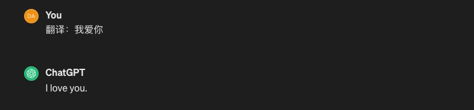

接着是例 2，如果接着输入，GPT 就会继续翻译，不再需要额外的指令。

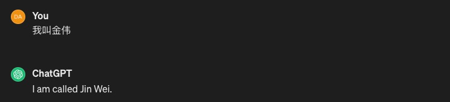

GPT 的实现原理可以用一句话表述：**通过输入一段文本，GPT** **模型会预测出最可能成为下一个字的字**。在例 1 中，因为字符串是以“翻译：”开头的，所以，虽然没有指明翻译成什么语言，GPT 模型也就能据此推测出“我们想翻译成英文”并给出结果。后续我们再输入中文，它也能准确地预测这是一个翻译任务。

把这个过程画成流程图，会更加清晰。

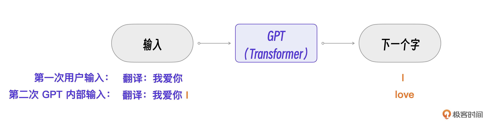

接下来，我们的任务是进一步理解 GPT（核心是 Transformer）的具体程序流程。

当然，要一口气吃透 Transformer 的流程并不容易，因此我会采用“农村包围城市”的策略，通过一个经典概率模型的解析，先帮你扫盲重要的外围辅助概念，**输入**，**输出**，**词表****。**这些概念的理解可以在 Transformer 里直接继承，理解了它们，再集中精力搞清 3 个最核心的算法和数据结构就行了。

## **串联概念：****经典概率模型**

这个经典概率模型比 Transformer 简单 10 倍，非常易于理解。

假设我们要做一个汪星人的大模型，汪星人只有睡觉、跑步、吃饭三个行为，汪星语也只有下面这一种句式。

```
我 刚才 跑步，我 现在 吃饭
我 刚才 睡觉，我 现在 吃饭
……
```

我们的目标和 GPT 是一样的，都是用已有的文本预测下一个字，比如下面的例子。

```
我 刚才 跑步，我 现在 ___
```

要预测上面例子的横线里应该填什么，只要计算“跑步”这个行为之后哪个行为的概率最大就可以了。比如：P(吃饭|跑步) 表示汪星人在“跑步”之后，下一个行为是“吃饭”的概率。

从程序视角实现这个“大模型”，显然需要先建立一个**词表**（Vocabulary），存储所有的汪星词汇。看下面这张图，一共有六个词，我、刚才、现在、吃饭、睡觉、跑步。那这个词表的长度 L 就等于 6。

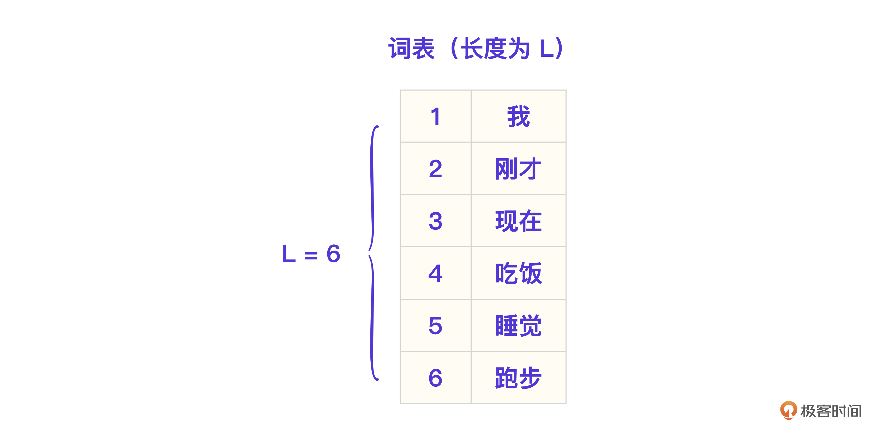

然后，根据汪星语料，计算每一个词的概率 P(wn|wi)，这也就是汪星大模型的模型训练过程。在模型运行时，可以根据输入的文本, 遍历词表获取每个词的概率，输出一个结果向量（长度也为 L）。

```
[0, 0, 0, 0.6, 0.3, 0.1]
```

比如上面的向量里 4 号词概率最高，是 0.6，所以下一个字要输出“吃饭”。

整个模型的程序流程图如下。

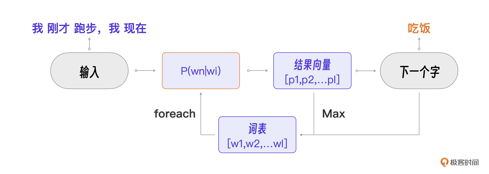

甚至你可以用 Python 代码实现这个“大模型”。

接下来的 **Transformer 程序流程虽然比这个复杂，但是和外围辅助概念输入、输出、词表相比，结构和功能是一样的，只是概率计算方法不同**。所以，我们完全可以在这个流程图的基础上进一步细化理解 Transformer 程序流程。

## **摸清流程：****Transformer 架构及流程图**

在真正开始细化这个流程之前，我们必须先搞清 Transformer 的整体架构。我引用了一张 Transformer 论文里的架构图，这张图对熟悉机器学习的朋友来说逻辑非常清晰。

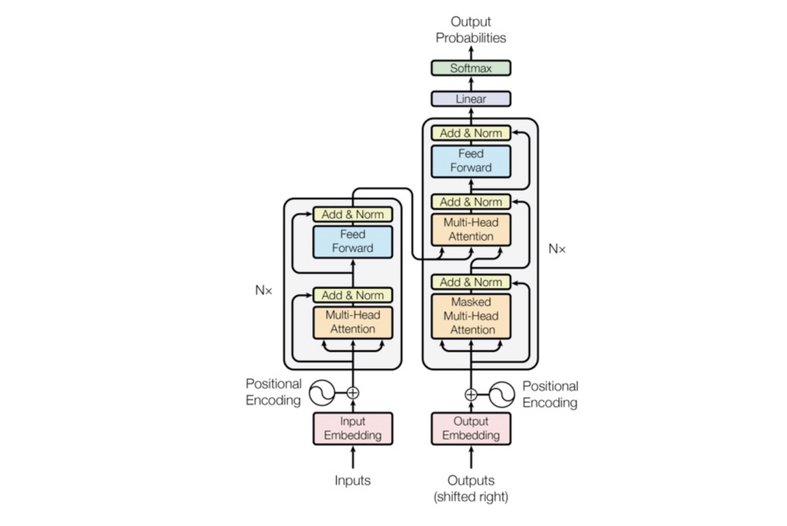

对普通工程师来说，我们可以用“分治法”把 Transformer 架构先用红框分为 3 大部分，输入、编解码、输出，更容易一步步理解它。

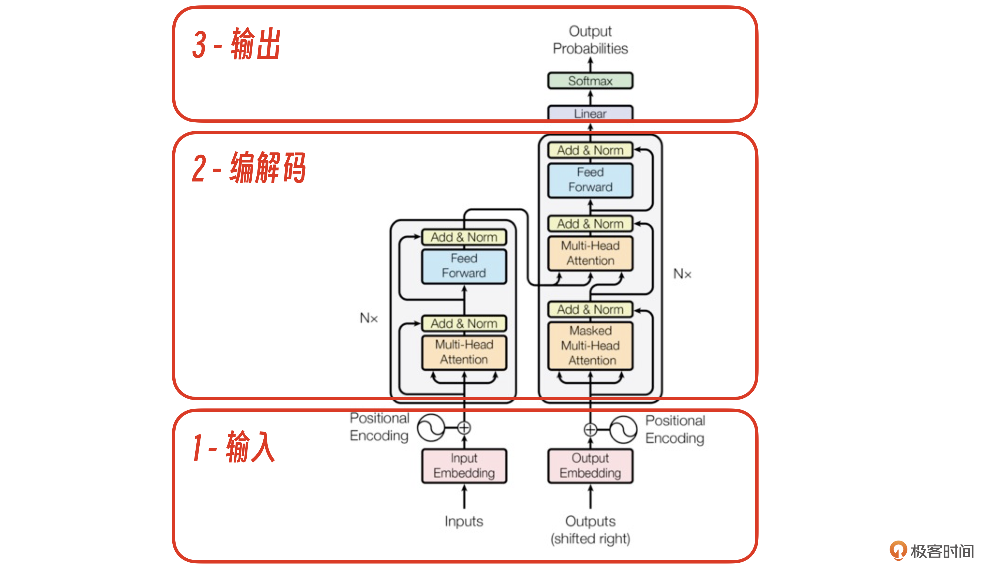

下面我从业务视角出发，结合例 1 的数据，代入到这个 Transformer 架构图里，你就能清楚输入、编解码、输出这 3 个部分的具体职能了。

### **业务视角的逻辑流程**

下面是例 1 的数据。

You：

```
我爱你
```

GPT：

```
i love you
```

Transformer 是怎么做到通过输入一段文本，GPT 模型就能预测出最可能成为下一个字的字的呢？这个问题，我想下面的图已经表示得非常清楚了。

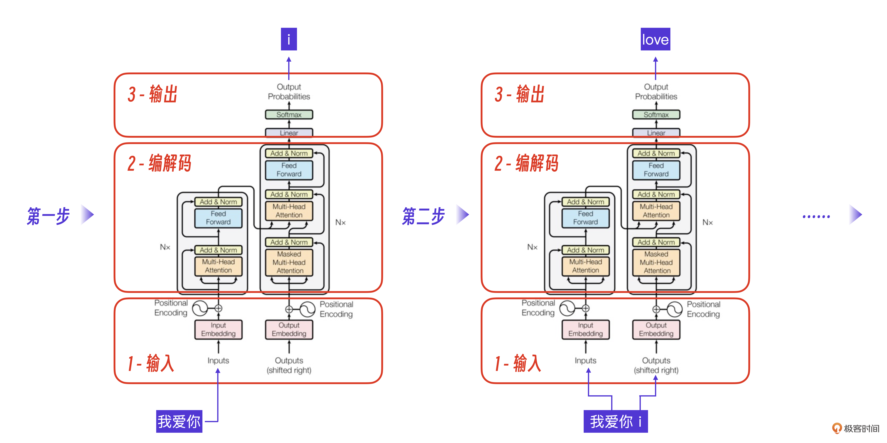

第一步，当 Transformer 接收到“我爱你”这个输入，经过 1- 输入层，2- 编解码层，输出下一个字符 i。关键是第二步，此时的输入变为了“我爱你”加上第一步的输出 i，Transformer 预测的输出是 love。

总的来说，就是 Transformer 架构的输入模块接收用户输入并做内部数据转换，将结果输出给编解码模块，编解码模块做核心算法预测概率，输出模块根据计算得到的概率向量查词表得到下一个输出字符。

其中，输出模块和刚才的经典概率模型一致，后续我们重点细化理解 “1- 输入模块” “2- 编解码模块”就可以了。Transformer 架构图里的每一个方框代表一个算法。对普通工程师而言，Transformer 架构图不好理解的部分无非就是每个方框里的算法细节，这也是我们下面要学习的知识点。

### **程序视角的逻辑：矩阵计算**

Transformer 架构里的所有算法，其实都是**矩阵**和**向量**计算。

先看一个 N x M 的矩阵数据结构例子。可以理解为程序中的 n 行 m 列的数组。


其中，当 N = 1 时，就叫做 M 维向量。


简单起见，我们可以把每一个方框里的算法统一描述为下图。

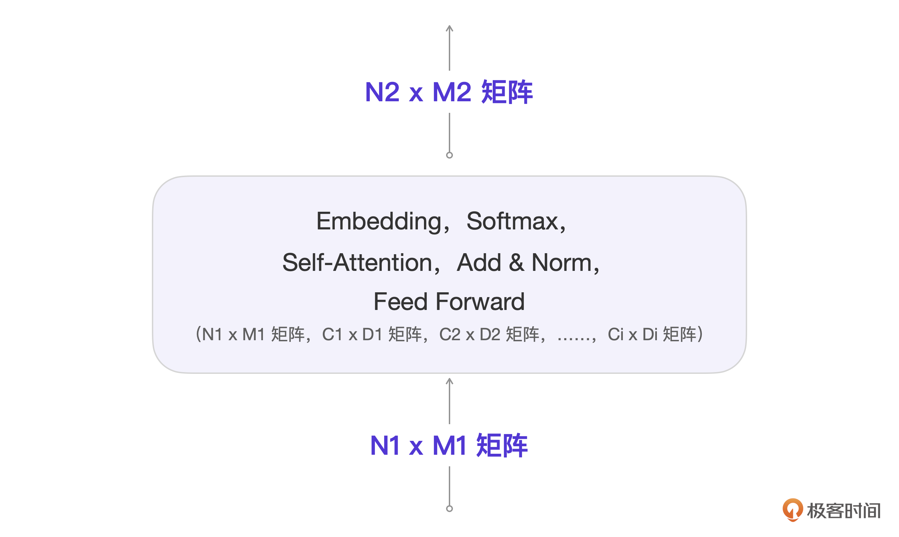

这张图可能有点复杂，我来说明一下。

你看，每一个算法的输入都是 N1 x M1 的矩阵，每个算法都是在这个输入基础上和其他矩阵进行计算。假设有 i 个相关参数矩阵，那么最后都会输出矩阵 N2 x M2，它也会成为下一个算法的输入。

这些在箭头上的 Ni x Mi 矩阵的每次计算都是动态的，而作为运算参数的 Ci x Di 矩阵都是模型提前训练好的。Ni x Mi 矩阵是用户输入和算法的中间结果，Ci x Di 里的具体参数其实就是模型**参数**。

编解码层数为 Nx，表示同样的算法要做 Nx 次，但是要注意，每一层里的 Ci x Di 参数矩阵具体数值是不同的，也就是有 Nx 套这样的参数。

这样说的话，例 1 的的实现逻辑就是：“我爱你” 字符串通过 Transformer 已经训练好的一系列矩阵参数通过多层计算后，就能获得最大概率的下一字 i。

OK，这样抽象出来之后，我们接下来就不用再关注非核心的算法流程，只要重点理解输入模块和编解码模块的过程就好了。

## **Transformer 核心**算法和结构

我们集中注意力，依次细化**最核心的三个算法和结构**：**Token 词表**，**Embedding 向量**，**Self-Attention 算法，**并且在经典模型的程序流程图上进行细化。

先从相对更好理解的 Token 和 Token 词表开始说起。

### **Token 和 Token 词表**

Transformer 中的 Token 词表和前述的词表作用相同，但 Token 是一个比词更细的单位。比如例 2 中的输入：“我叫金伟”，会被拆成 4 个 Token：我 / 叫 / 金 / 伟。拆分成 Token 的目的是控制词表的大小，因为在自然语言中，类似“金伟”的长尾词占到了 90%。

好，比照经典模型的词表，刚才的例子都就可以做成一张图表示 Token 词表。

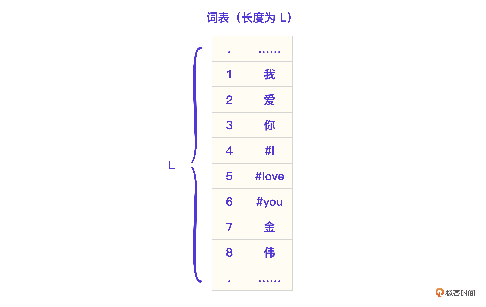

Token 在 Transformer 里会作为基本运算单位，用户的输入“我爱你”和“i”转换成 Token 表示就是 [ 我, 爱，你，#i ]。注意，Transformer 里的每个 Token 并不仅仅只有一个序号，而是会用一个 Embedding 向量表示一个 Token 的语义。

### **输入模块的核心：****Embedding****向量**

Embedding 向量具体形式如下。

```
#i --> [0.1095,0.0336,...,0.1263,0.2155,....,0.1589,0.0282,0.1756] 
长度为M，则叫M维向量
```

对应的，它的 Token 词表在逻辑上可以细化为下图。

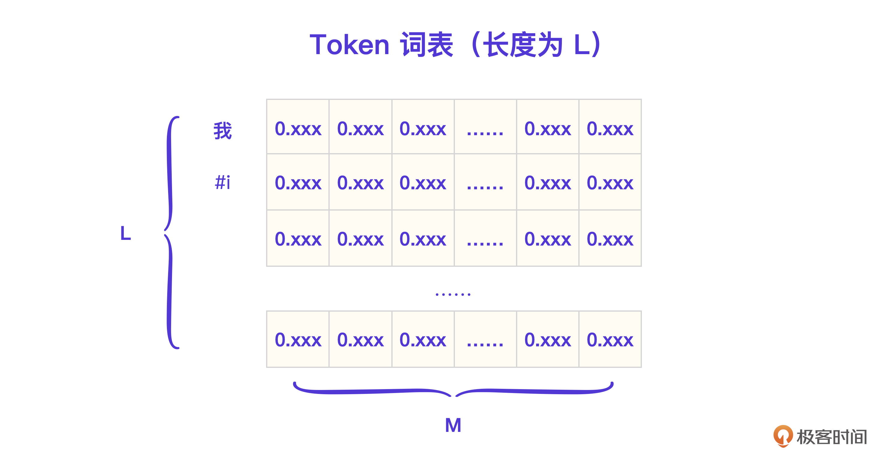

Transformer 架构输入部分第一个流程就是 **Embedding**，以这个例子里的输入 Token [我, 爱, 你, #i ]为例，你可以把这个过程理解为：Token 挨个去词表抽取相应的 Embedding，这个过程我用图片表示出来了。

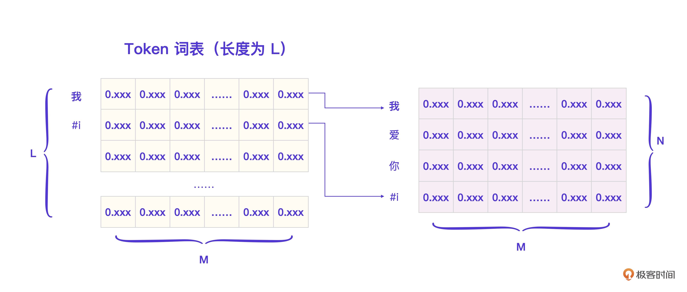

你看，假设词表总长度是 L，比如“我”这个 Token 的 Embedding 就可以直接从词表里取出来，这个例子输入的总 Token 数量 N = 4，Embedding 向量的维度是 M，此时抽取的矩阵是一个 4 x M 的矩阵。

在 GPT-3 里，Embedding 的维度 M = 12288，这个例子里 N = 4，所以最终输入模块得到的矩阵就是下面这样的。


这个矩阵会被传递给编解码模块用作起始输入。一个 Embedding 维度代表一个 Token 的语义属性，维度越高，训练成本就越高，GPT-3 的经验是 M = 12288 维，就足够涌现出类似人类的智能。

好了，到此为止，我们已经把**输入模块**做了足够细化，下面是第一次细化后对应的程序流程图。

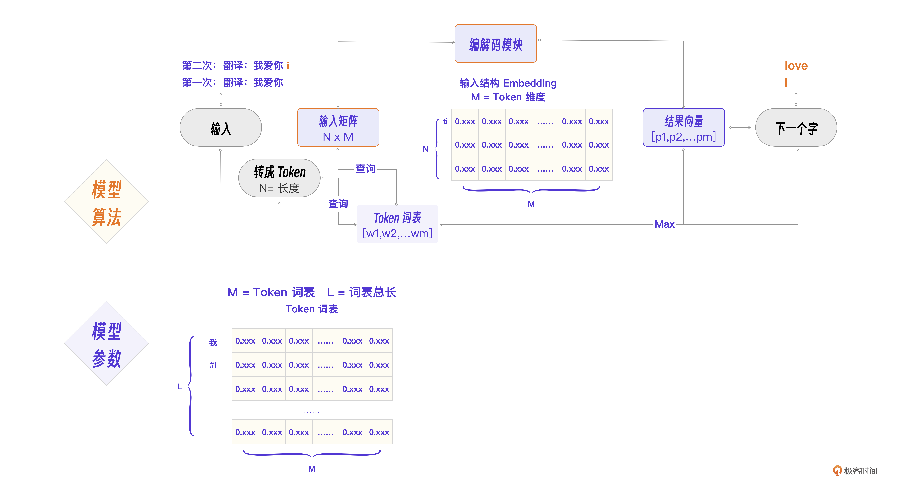

### **编解码模块核心：Self-Attention 算法**

接下来，我们带着这个 NxM 的输入矩阵进入编解码模块。看下面例 2 中的数据。

You：

```
我叫金伟
```

GPT：

```
I am called Jin Wei.
```

为什么 GPT 知道我还想让它继续翻译这句话呢？那是因为 GPT 在后续预测的过程中也能注意到这次会话里最重要的一个词，“翻译”。


大模型做预测的时候，会关心或者叫注意当前自己这个句子里的那些重要的词，这个思想正是 自注意 Self-Attention 这个算法的命名来源。

自注意力机制（Self-Attention）是编解码模块的第一步，也是最重要的一步，目的是计算输入的每个 Token 在当前句子里的重要性，以便后续算法做预测时更关注那些重要的 Token。

**我们****分别从参数和算法两个角度来说明这个算法流程****。**

- **参数视角**

模型需要训练并得到 3 个权重矩阵，分别叫 Wq、Wk、Wv。

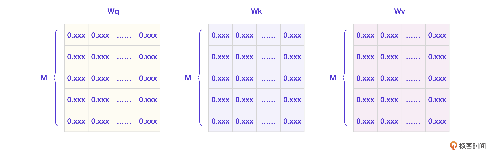

现在输入的 Token 列表是 [t1, t2, t3 … tn]，假设当前需要计算第 i 个 Token 的重要性，记为 ti，那么 Wq、Wk、Wv 分别是什么意思呢？

- Wq 是为了生成查询向量，也就是 ti 拿来去向别人查询的向量。
- Wk 是为了生成键向量，也就是 ti 用来回应它人查询的向量。
- Wv 是为了生成值向量，也就是表示 ti 的重要性值的向量。

这样描述可能不好理解，我们直接看具体的算法流程。

- **算法流程**

首先，我们写下 ti 的 Embedding 向量。


我来拆解一下整个过程。

第一步，生成每个 Token 对应的 Q（查询向量），K（键向量），V（值向量）。针对 ti 的算法图就是下面这样的。

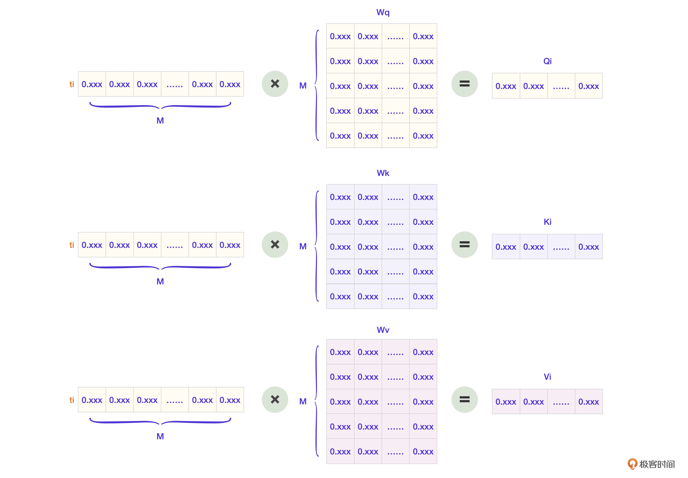

第二步，Token ti 拿着自己的 Q 向量去询问每个 Token，并得到自己的重要性分数 Score。

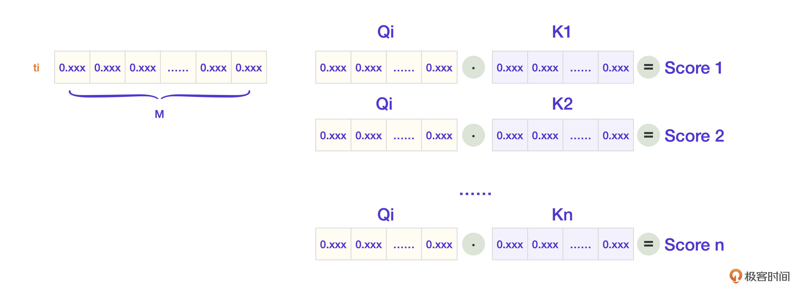

再反过来，当其他 Token 向 ti 查询的时候，ti 会用自己的 K 向量参与回应计算。

第三步，[score1, score2,… score-n] 这些分数再和 ti 的值向量 V 计算，就得到了模型内部表示重要性的向量 Z。因为这里过于复杂，我们就略去计算过程。

自注意力机制（Self-Attention）是 GPT 拥有高智能在算法层面的核心因素，我们对编解码模块的注意也就到这个算法为止。不用有太多负担，理解即可。接下来可以把完整的程序流程图绘制出来了。

## **最终的 Transformer 程序流程图**

现在可以进行第二次程序流程图细化，得到最终的 Transformer 程序流程图。你也可以在这张图的基础上回看前面的内容，进一步理解细节。

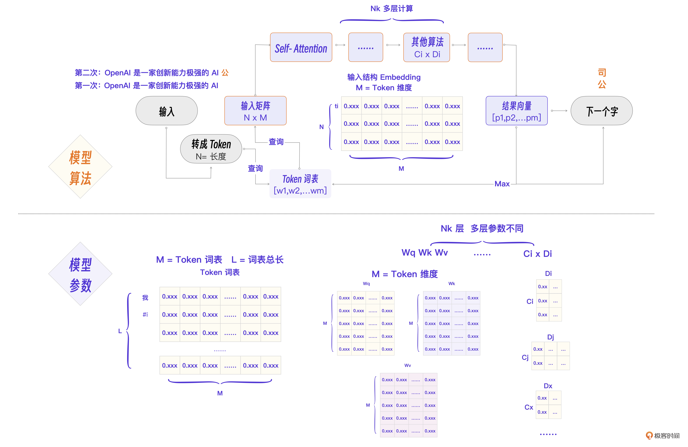

这里有几个流程要点，我再来强调一下。

N 为输入 Token 总数，M 为 Embedding 维度，L 为词表总数。关键流程是这样的：词的 Token 化 -> Embedding 查询 -> 组成 NxM 输入矩阵 -> Self-Attention 计算 Q，K，V -> Nk 层计算 -> 得到结果向量。涉及的几个关键参数分别是 Token 词表，每个 Token 的 Embedding 向量，Wq、Wk、Wv 权重矩阵，以及其他算法层 Ci x Di 参数矩阵。

现在，对照着这个程序流程图来理解大模型里的概念就简单多了。我来总结一下。

- **模型：**就是图里的算法的具体程序实现 + 训练好的模型参数。
- **生成式**：一个字一个字预测生成一段文字的方式。
- **参数**：就是图里的各个矩阵在模型训练完成后的具体数值。
- **无监督**：就是图里应该出现的下一个字正好就是语料里这句话的下一个字，不需要人工标注数据。
- **语义表示**：就是图里的 Token 表示为 M 维的 Embedding 向量。
- **NLP**：就是类似语言翻译这样的自然语言任务。

## 小结

未来想做大模型实战开发的工程师，必须先理解 GPT 的基础 Transformer，就像我们做互联网应用开发时，只有先对数据库原理有一定的理解，才能真正把它用好。而要理解 Transformer 最好的方法，就是用一个程序流程图把 Transformer 架构梳理一遍。

我整理了一份流程图，你可以保存。

程序 = 算法 + 数据结构。如果把这个公式代入到大模型里，那么正如上述流程图所示，大模型 = 模型算法 + 模型参数。

这两个部分又可以进一步细化。具体怎么细化，这个问题交给你，需要你仔细回想这节课的内容，然后和留言区和我互动。

所以，到底为什么 GPT 可以拥有这么高的智能呢？核心原因就在于 Transformer 里最关键的三个设计 Token，Embedding 和 Self-Attention。

其中，**Embedding** 把一个词分成了上万个维度表示，**Self-Attention** 则让大模型处理信息的时候考虑了当前会话的重要性，这两个看似简单的创新加上巨量的模型参数，最终让大模型的智能得到了涌现。

咱们这节课分析了 GPT 的基本架构 Transformer。不过，这只是 GPT 成功的因素之一，更关键的因素是 GPT 在工程上的几个创新，我们放到下一节来讲解。

## 思考题

既然大语言模型中的 Transformer 算法是通过预测最高概率的下一个字来生成文本，那是不是意味着一个输入应该只有一种输出？但是在现实应用中，为什么相同的输入可能会有多种不同的输出呢？尝试说说其中的原因和背后的机制。

欢迎你在留言区和我交流。如果觉得有所收获，也可以把课程分享给更多的朋友一起学习。我们下节课见！

[>> 戳此加入课程交流群]()

---
来源：极客时间
链接：https://time.geekbang.org/column/article/799732
日期：2026-05-12
