# 03｜初体验：Ollama 本地大模型与多模态大模型

你好，我是金伟。

前面两节课我们分别聊到大模型的基础架构 Transformer，以及 ChatGPT 是如何在 Transformer 基础上做的工程创新，最终做到了智能涌现。

需要说明的是，我自身也是一个应用开发人员，对于这些基础原理的需求就是了解即可，我会把更多的精力用在实战开发上。喜欢动手的工程师可能都会想自己训练一次大模型，本节课正是为此准备的。

Ollama 是一个全新的本地可运行的大模型框架，适合零基础的同学体验多种大模型，你可以把它看做一个可以本地运行的 “ChatGPT”。

这节课我们还会用到 GPT-SoVITS。这是一个 TTS（Text-to-Speech，文本转语音）‌大模型，也可以在本地运行。你可能也都听说过多模态这个词，GPT-SoVITS 就是一个语音类的多模态模型。

咱们这节课的任务，就是结合 Ollama 的文本能力和 GPT-SoVITS 的语音能力，开发一个可以本地运行的实时语音聊天助手，实现一个类似 ChatGPT 的语音助手。

## Ollama 本地大模型

传统的大模型开发需要大量的 GPU 资源，以参数量最小的 Llama 2 7B 为例，也需要 14G 显存，而且每一种大模型都有自己的开发接口，这导致普通人很难在自己的本地环境构建大模型、体验大模型。

所以，Ollama 构建了一个开源大模型的仓库，统一了各个大模型的开发接口，让普通开发者可以非常方便地下载，安装和使用各种大模型。

本质上，Ollama 是一套构建和运行大模型的开发框架，它采用的**模型量化**技术进一步降低了大模型对显存的需求。

### 模型量化

这里插入一个小科普。说到模型量化技术，你有没有想过为什么大模型都需要这么大的显存？

不知道你还记不记得 GPT-3 的参数量，是 1750 亿个参数。因为每一次大模型做文本预测都需要所有参数参与运算，所以 GPT-3 就要提前把 1750 亿参数存储到显存里。模型量化技术调整了每个模型参数的精度，从 FP16 精度压缩到 4 位整数精度。这样就可以在基本不改变模型能力的前提下，把显存需求降低到原来的 1/4 到 1/3。

于是，经过模型量化的 7b 大小的大模型就可以借助 Ollama 在普通人的电脑上运行了。换个角度理解，Ollama 也是在大模型不断被大众需要的市场趋势下应运而生的。

好了，话不多说，接下来我们就以 Linux 环境为例来看看 Ollama 的基本使用流程。

### 命令行运行

从 [Ollama 官网]()可以看到，Ollama 已经实现了多平台支持，包括 MacOS，Linux 和 Windows。

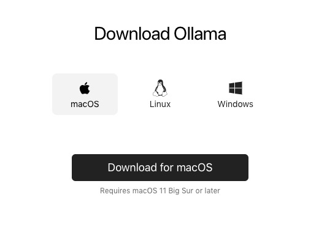

我的环境是一台 24G 显存的 4090 服务器，你也可以看下自己的配置，显存越高运行越顺畅。

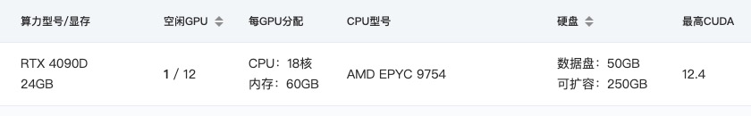

Linux 环境下安装 Ollama 只需要一个简单的命令行，非常方便。

```
curl -fsSL https://ollama.com/install.sh | sh
```

下面是 Ollama 的模型仓库截图，你可以随时切换模型，用 `pull` 命令就能下载模型。

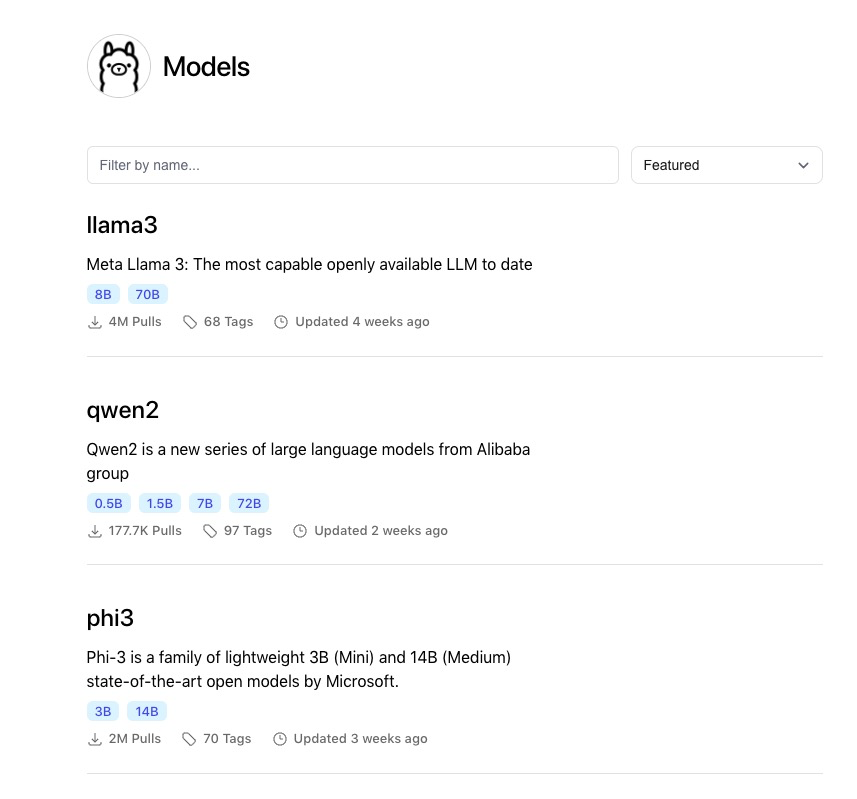

接着，你可以使用 ollama run 命令进入对话模式，从命令行运行效果看，我们已经可以将其看做命令行版本的 “GPT 大模型”了。

```
# 对话模式
% ollama run llama2-chinese
```

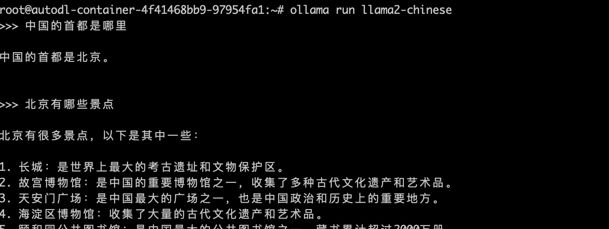

除了命令行的运行模式，更重要的是 Ollama 提供的接口开发模式。

### 接口 API

我们用 Ollama 的 Python 接口来定制自己的大模型。

这里面有一个 Modelfile，它是 Ollama 大模型的配置文件，你可以修改各种配置，然后运行接口程序。比如我就自己配置了一个基于 Llama2 的大模型，设置了温度，token 数量和系统提示词。

```
FROM llama2
# 设定温度参数为1 [更高的更具有创新性，更低的更富有连贯性]
PARAMETER temperature 1
# 将上下文窗口大小设置为4096，这控制着LLM能够使用多少个token来生成下一个token。
PARAMETER num_ctx 4096
# 设置了自定义系统消息以指定聊天助手的行为。你是马里奥，来自《超级马里奥兄弟》，扮演一名助手的角色。
SYSTEM You are Mario from super mario bros, acting as an assistant.
```

然后，创建一个 Modelfile 文件，在 Linux 中运行自定义的大模型。

```
ollama create example -f ./Modelfile
ollama run example
```

你还可以用 Python 代码调用大模型的接口。

```
import requests
import json
# 设置 API 端点
url = "http://localhost:11434/api/chat"
# 定义请求数据
data = {
    "model": "llama2",
    "messages": [
        {"role": "user", "content": "Why is the sky blue?"}
    ]
}
# 发送 POST 请求
response = requests.post(url, headers={"Content-Type": "application/json"}, data=json.dumps(data))
# 检查响应状态码
if response.status_code == 200:
    # 解析并打印响应内容
    response_data = response.json()
    print(response_data['message']['content'])
else:
    print(f"Error: {response.status_code}")
```

好了，有了大模型接口支持，你就可以在 Ollama 框架下编写自己的 AI 应用了。

### 模型微调

当然，除了接口支持，Ollama 也支持大模型微调。假设我们的目标是要实现一个极客时间专有小助理的大模型，就可以在 Llama2 的模型基础上做数据微调，最终得到的专用模型还可以在 Ollama 架构下运行。

模型微调的核心是整理小助理相关的问题数据集，比如下面这个数据集的例子。

```
train_data = [
    {"role": "user", "content": "你是谁？", "response": "我是极客时间的小极，一个虚拟客服助手。"},
    {"role": "user", "content": "极客时间是什么？", "response": "极客时间是一个提供技术和职业发展的在线学习平台，拥有丰富的课程和资源。"},
    {"role": "user", "content": "你能做什么？", "response": "我可以回答关于极客时间平台的问题，帮助你找到课程，还可以提供学习建议。"},
    {"role": "user", "content": "如何联系人工客服？", "response": "你可以通过点击页面右下角的“联系客服”按钮来联系人工客服。"},
    {"role": "user", "content": "平台上有哪些课程？", "response": "极客时间提供各种技术和职业发展的课程，包括编程、架构、数据科学等领域的课程。"},
    {"role": "user", "content": "课程需要付费吗？", "response": "是的，极客时间的大部分课程都是需要付费的。你可以在平台上查看具体课程的价格。"},
    {"role": "user", "content": "如何购买课程？", "response": "你可以在课程页面点击“购买”按钮，然后按照提示进行支付即可。"},
    {"role": "user", "content": "课程可以退款吗？", "response": "根据平台的退款政策，购买后7天内可以申请退款，具体请查看平台的退款政策。"}
    ... ...
]
```

你还可以使用 Hugging Face 的 `transformers` 库结合上述数据进行微调, 这样就可以让微调后的大模型学习到小助理日常的对话方式和常见的知识问答，下面是示例代码。

```
import torch
from transformers import AutoModelForCausalLM, AutoTokenizer, Trainer, TrainingArguments
... 
# 加载预训练模型和分词器
model_name = "facebook/llama-7b"
model = AutoModelForCausalLM.from_pretrained(model_name)
tokenizer = AutoTokenizer.from_pretrained(model_name)
# 将数据转换为 DataFrame
df = pd.DataFrame(train_data)
...
# 初始化 Trainer
trainer = Trainer(
    model=model,
    args=training_args,
    train_dataset=train_dataset,
)
# 开始训练
trainer.train()
# 保存微调后的模型
model.save_pretrained("./fine_tuned_llama")
tokenizer.save_pretrained("./fine_tuned_llama")
```

我把微调完成后生成新的模型命名为 fine_tuned_llama。在此基础上修改 Python 代码里的模型名称，就可以实现小助理专用模型的调用了。

```
# 定义请求数据
data = {
    "model": "fine_tuned_llama",  # 微调后的模型名称
    "messages": [
        {"role": "user", "content": "你是谁?"}
    ]
}
```

## 什么是多模态大模型？

好了，到目前为止，我们的例子都是文本大模型。但是，我们的目标是实现一个真正的语音小助手，那就还需要进一步了解多模态大模型。

OpenAI 的 GPT-4 已经实现了大模型的多模态，包括图片大模型 DALL-E 3，TTS 语音模型和视频大模型。**简单地说，除了文本****，****还支持其他输入输出格式的就叫多模态大模型。**很多人会认为图片，语音，视频大模型的实现和语言大模型完全不一样，其实不然。

### 多模态的原理

关于多模态大模型的原理，我曾经接受过有一个博士的点醒，他说：多模态模型和语言模型一样本质就是一个序列化模型。因此多模态只是语言大模型的扩展。

以相对简单的语音模型为例，先看下面的语音频谱图。下面的频谱图展示了音频信号里三个维度的信息。

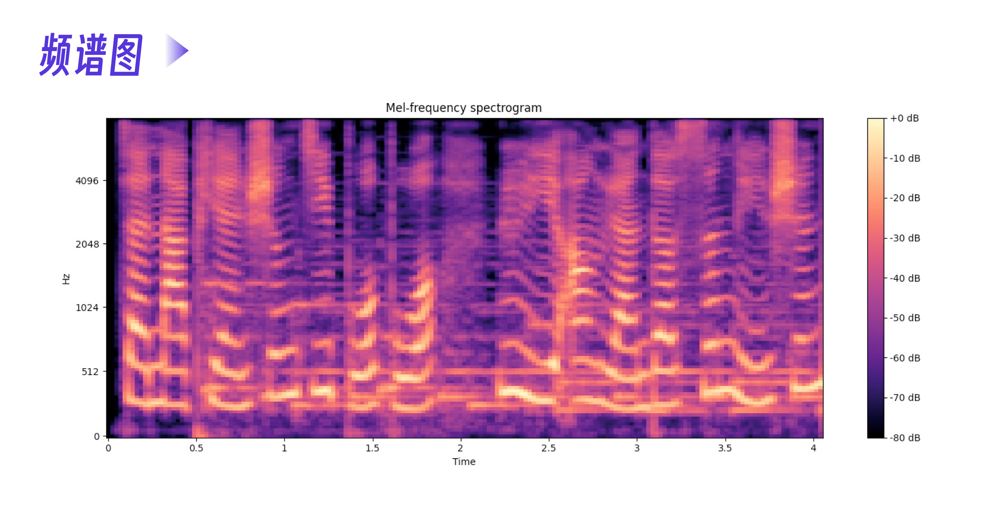

**时间（Time）**：这是横轴，表示音频随时间的变化而变化。每个时间点对应音频信号的一帧。**频率（Frequency）**：这是纵轴，表示音频信号的频率成分。**分贝（dB）**：这是颜色表示的信息，表示每个时间 - 频率点上的能量强度。这张图右侧的颜色条（colorbar）显示的就是不同颜色对应的分贝值。

我们假设这个音频对应的文本是 `极客时间是一个……`。从频谱图上，能非常明显地看到时间线的一个颜色条对应一个中文字，不管音频的三个维度怎么表示，我们都可以把这个语音看做和文本一样的序列。

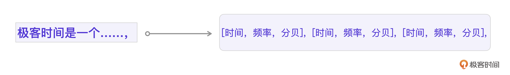

好，到这里需要你回忆一下[第一节课]()里的翻译例子。你会发现，这个结构和 Transformer 模型翻译的例子是一模一样的。多模态语音模型也确实可以用 Transformer 架构来训练。只要经过足够的文本 - 语音序列数据训练，大模型就可以准确识别出底层的文本 - 语音数据模式，从而实现文本 - 语音的翻译。

**那么图片多模态模型又是怎么实现的呢？**其实原理也是相通的。

首先，图像需要被处理成适合 Transformer 输入的格式。通常来说，图像会被分割成小块（patches），每个小块会被展平成一个向量，然后输入到 Transformer 中。以 32 x 32 像素的图像为例，假设我们将图像分割成 4 x 4 的小块（即每个小块包含 8 x 8 个像素），那么整个图像就会被分割成 16 个小块。

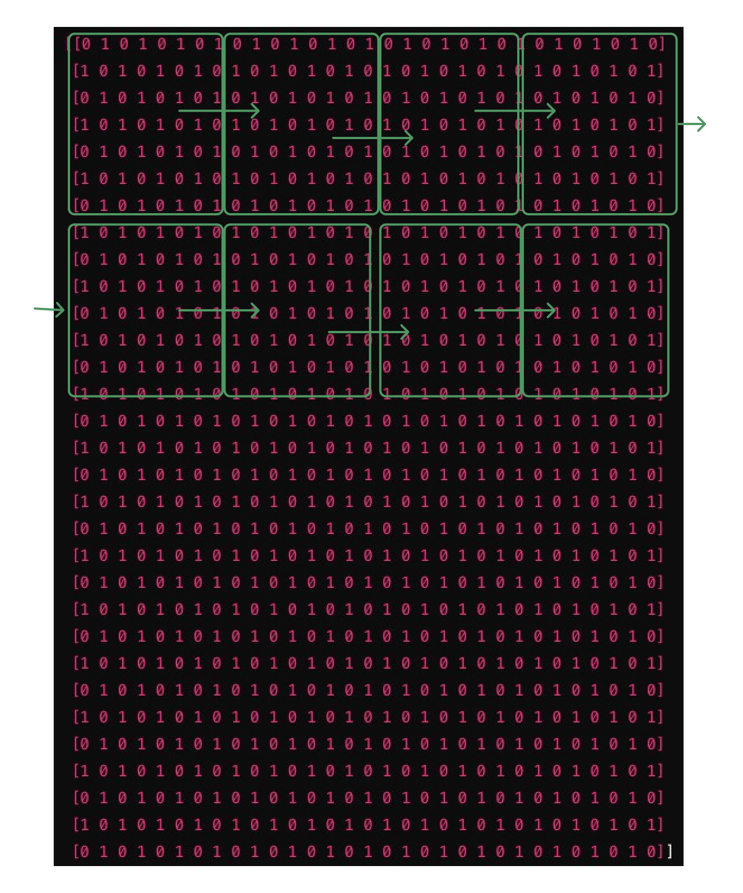

**按这种划分方法，一个图像也可以转成一个序列化的串。每一张图加上文本描述，就成为了文字 - 图片的序列串。**虽然这样的图片序列化对人来说看不出任何的语义对应关系，但是经过 Transformer 训练之后，大模型就可以学习到文本 - 图片之间的语义关系。

更形象地说，就是让大模型学习大量的对应关系。比如一个苹果在桌子上，一个西瓜在地上。

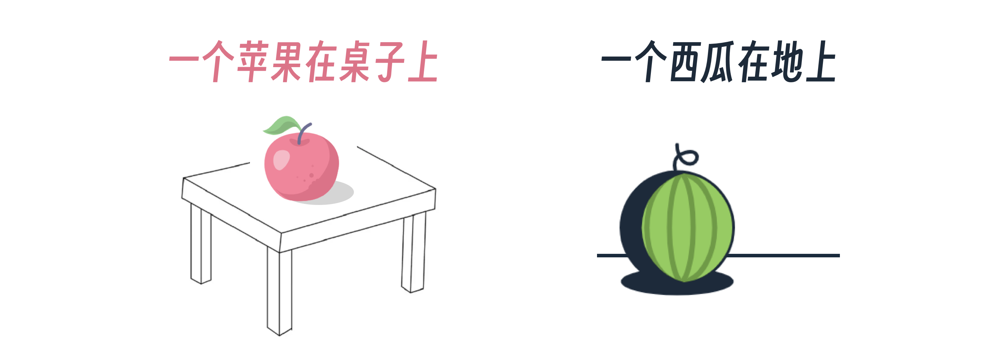

最终大模型可以在用户输入 `一个苹果在地上` 的时候，就能准确地输出这个关系的图像。


这里的西瓜、苹果、桌子、地面以及上下关系，就是大模型从文本 - 图片序列串中学习到的。

好了，从原理层面理清多模态大模型之后，我们就要开始语音大模型的开发了。

## 体验 TTS 大模型

要实现一个语音小助手，最核心的能力当然是语音能力，那语音能力如何跟 Ollama 大模型文本能力对接呢？这里就要用到 TTS 技术。

TTS 是 Text-to-Speech 的缩写，指的是文本转语音技术。通过 TTS，用户可以输入文字，让计算机生成自然语音，从而实现语音提示、有声书、语音助手之类的功能。

GPT-SoVITS 就是一个可以实现语音克隆的 TTS 大模型，最大的特点是只需要 5s 左右的语音输入样本，就可以实现语音克隆，之后还可以用我们训练好的模型实现 TTS 文本转语音操作，音色、音调的还原度也很高。

### GPT-SoVITS 里的 GPT

GPT-SoVITS 的架构其实就是结合了 GPT （Generative Pre-trained Transformer，生成式预训练变形器）模型和 SoVITS（Speech-to-Video Voice Transformation System）变声器技术。


它的基础还是 Transformer 模型，通过大量的文字 + 语音波形序列化数据训练，得到一个可以完成文字到语音翻译的模型，从而实现 TTS。其实本质还是一个序列化的模型训练。

而音色音调的克隆怎么办呢？答案是，通过 SoVITS 技术实现。GPT-SoVITS 的更进一步技术细节我也还没有来得及分析，不过这个项目给我们最大的启发就是可以在更多的多模态场景下尝试应用 GPT 模型原理，可能会有不少意料之外的效果。

接下来我主要介绍一下如何通过 GPT-SoVITS 实现一次语音克隆的过程。

### 低成本云端环境

GPT-SoVITS 的官方已经提供了一个非常优秀的教程，我按这个教程顺利地搭建了模型并克隆了自己的声音。

我选用的是 AutoDL 云计算环境。注意选用一个 GPT-SoVITS 的镜像创建主机，下面是我具体的主机配置。

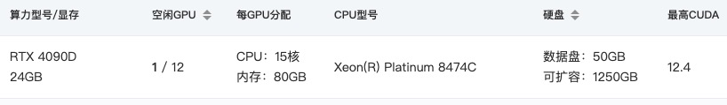

下面是我选用的具体镜像信息。

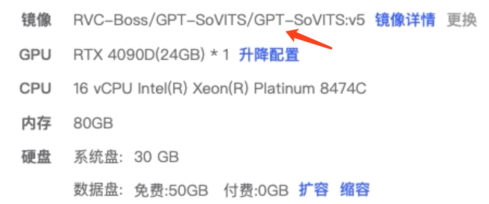

AutoDL 云计算的成本大约在 2 元 / 小时左右，整个训练过程我花了不到 10 元，还是非常经济的，购买了主机之后，可以进入 GPT-SoVITS 的界面，所有的后续训练操作都在这个界面上完成。

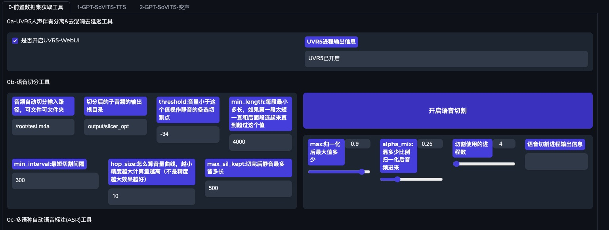

正式开始训练前需要录制一小段自己的语音，用于克隆训练。

### 低成本**语音克隆**

**整个过程分为语音分割，模型训练，语音合成这三个步骤****。**

刚才说了，先准备自己的录音文件，我的语音文本如下。

> 极客时间是一个非常有趣的平台，我在这里不仅仅获取了丰富的知识，还能够与志同道合的人分享学习的乐趣。通过极客时间，我拓展了视野，深入了解了技术领域的前沿动态和实践经验，这些知识对我的职业发展和个人兴趣都带来了极大的帮助和启发。

**第一步**，将这个录制语音提取出纯人声的音频，再进行分割，按一定秒数分割成语音文件，最后对语音做文本识别。这个过程的目的就是生成文本 - 语音的序列数据，为下一步的微调做数据准备。

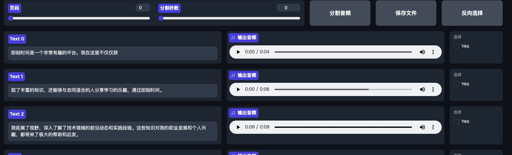

**第二步**，在刚才准备的文本和语音数据基础上，微调 GPT-SoVITS 训练自己的 TTS 模型。这里你可以自由发挥，直接在界面上操作，过程比我想象得要快很多，大概不到 10 分钟。

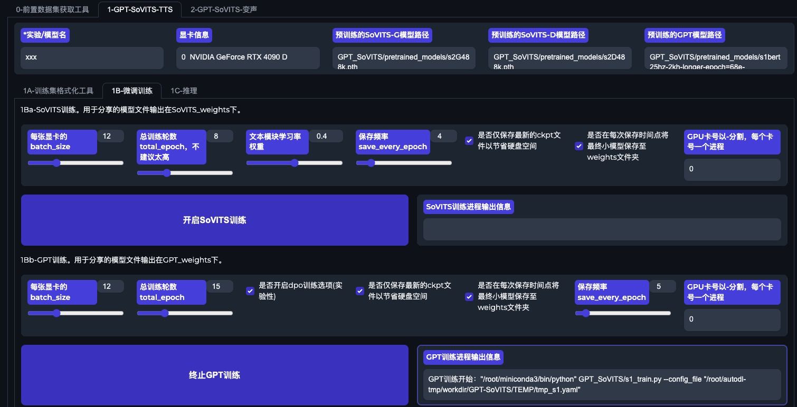

OK，现在已经生成了经过微调的 TTS 模型，可以做 TTS 文本合成语音了，而且你也可以直接将这个模型分享给别人。

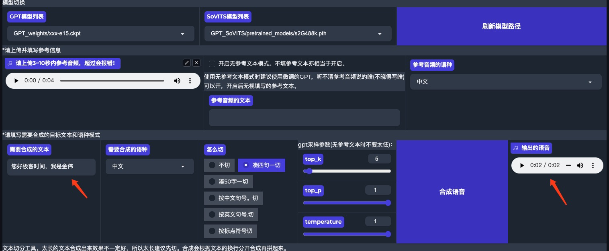

现在，用这个文本生成的语音已经完全克隆了我的声音，复刻了音色、音调和语速。你也可以用自己的真实声音训练出一个用于实现语音助手的专有 TTS 语音大模型。

### 实现语音助手

克隆之后，我们还要实现一个极客时间的语音助理。这个语音助理的内核其实还是之前的 Ollama 文本大模型聊天能力，只是需要在文本聊天的基础上加入语音的输入和输出能力。

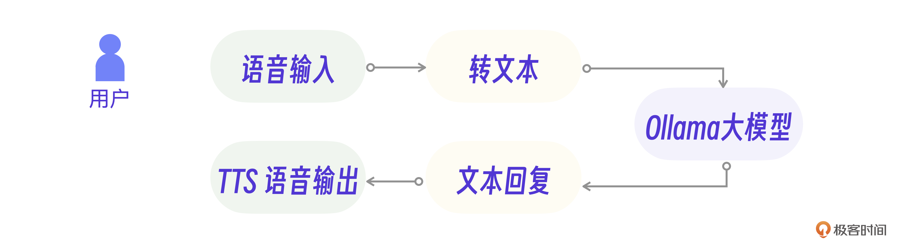

TTS 的语音输出可以用 GPT-SoVITS 生成的语音大模型，而语音输入转为文本则可以采用 faster_whisper 这个语音识别库。

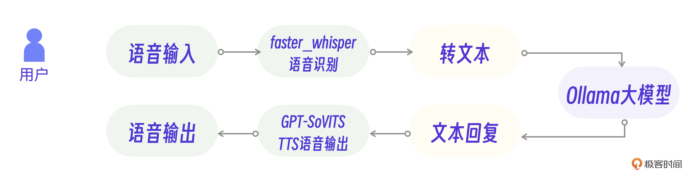

具体实现上还需要注意一些细节。其中，语音识别输入模块需要细分为录音和语音转文字两个功能，你可以用 Python 实现这两个类。

```
from faster_whisper import WhisperModel
import pyaudio
class Transcriber(object):
  self._model = WhisperModel(...)
  ## 实现语音转文字
 
class AudioRecorder(object):
  self.audio = pyaudio.PyAudio()
  ## 实现录音
```

而 TTS 语音输出模块则需要考虑运行效率。你可以分割 Ollama 回复的文本，放入队列并行生成语音，保证输出语音的流畅性。我们同样用 Python 实现这个逻辑。

```
def producer(ollama_str):
    # 解析文本，写入语音
    sentences = ollama_str.split("。")
    for sentence in sentences:
        if len(sentence) != 0:
             queue.put(sentence，gen_tts) #生成语音队列
```

结合之前的 Ollama 的大模型接口，以及录音和 TTS 模块逻辑，最终就能整理出语音助理的核心逻辑代码了。

```
# 语音小助手
while True:
    with AudioRecorder(sample_rate=16000) as recorder: # 录音
        with Transcriber(...) as transcriber: # 语音转文字
           for audio in recorder:
               for seg in transcriber(audio):
                  print("YOU:", seg) # 输入文本
                  ollama_str = request_ollama(seg) # 调用Ollama接口
                  print("AI: ", ollama_str) #输出文本
                  producer(ollama_str) # TTS输出语音
                  ...
```

到此为止，我们完全依赖本地环境实现了一个基于大模型的简易版语音助手，相信通过这个初体验过程，你也可以对大模型有一个直观的认识。

## 小结

这节课我们介绍了两个可以本地环境运行的大模型，Ollama 和 GPT-SoVITS。花 1-2 个小时下载、安装和体验这些模型可以让你对大模型有基本的认识。

除了体验实战，我们也了解到**多模态大模型的实现原理和语言模型是一脉相承的，都是基于序列化的 Transformer 模型架构。**

Ollama 和 GPT-SoVITS 都是最近新发布的技术，这类资源要求越来越小的“小模型”被开发出来，也从反面证明了大模型技术需求量不断增加。所以，了解更多的大模型和“小模型”对未来的应用开发至关重要。可以预见，在未来的 AI 应用中，要同时结合本地“小模型”、远端大模型以及多模态大模型才能打造出一个合格的 AI 应用。

## 思考题

在多模态的图片模型中，为什么用户输入一个文本之后，会先显示一个低像素的草图再慢慢变清晰呢？这个过程和序列化的大模型训练有什么关系？

欢迎你在留言区和我交流。如果觉得有所收获，也可以把课程分享给更多的朋友一起学习。我们下节课见！

[>> 戳此加入课程交流群]()

---
来源：极客时间
链接：https://time.geekbang.org/column/article/800225
日期：2026-05-12
