# 06｜核心：如何打造C语言自动判题系统里的核心提示词？

你好，我是金伟。

上节课我们专门讨论了提示词。在大模型 AI 应用开发中，提示词工程当然是最重要的环节，不过，虽然在互联网上有很多类似上节课分析的客服提示词，但在真实的应用里，这样的提示词大多是“玩具”的性质。

这并不是说实战项目里提示词更复杂或者更智能，而是在真实项目里，提示词需要和应用里的其他程序更紧密的配合。换言之，需要更“靠谱”。

这节课，我们就一起看一个 C 语言自动判题系统的开发历程。这是一个真实的项目，这个项目可能是我去年见过的最落地的 AI 应用了。整个需求来自一个老师。为什么说它超级落地呢？因为相比于很多创业项目，这个项目真的用 AI 做到了让原工作有 10 倍效率提升。

我们先看看这个项目的客户需求。

## 需求分析

老师现有一套学生 C 语言作业的在线题库系统，用于大作业的测评，系统已有题目和输出样例，但是没有判题功能，学生下载题目后，按题目要求自行写出 C 语言程序后在系统提交。老师需要下载 200 多个学生的程序挨个运行，人工判断，人工评分。是不是听起来很累？

现在需求是独立于现有题库系统，单独开发一个 AI 系统，借助 AI 提高工作效率。不过，老师并不要求实现全自动操作，就是希望减少重复工作，提高效率。

### 原始需求

我们梳理一下这个原始需求，其核心功能是 C 语言作业程序的自动判题，我们拿几个题目来举例说明。

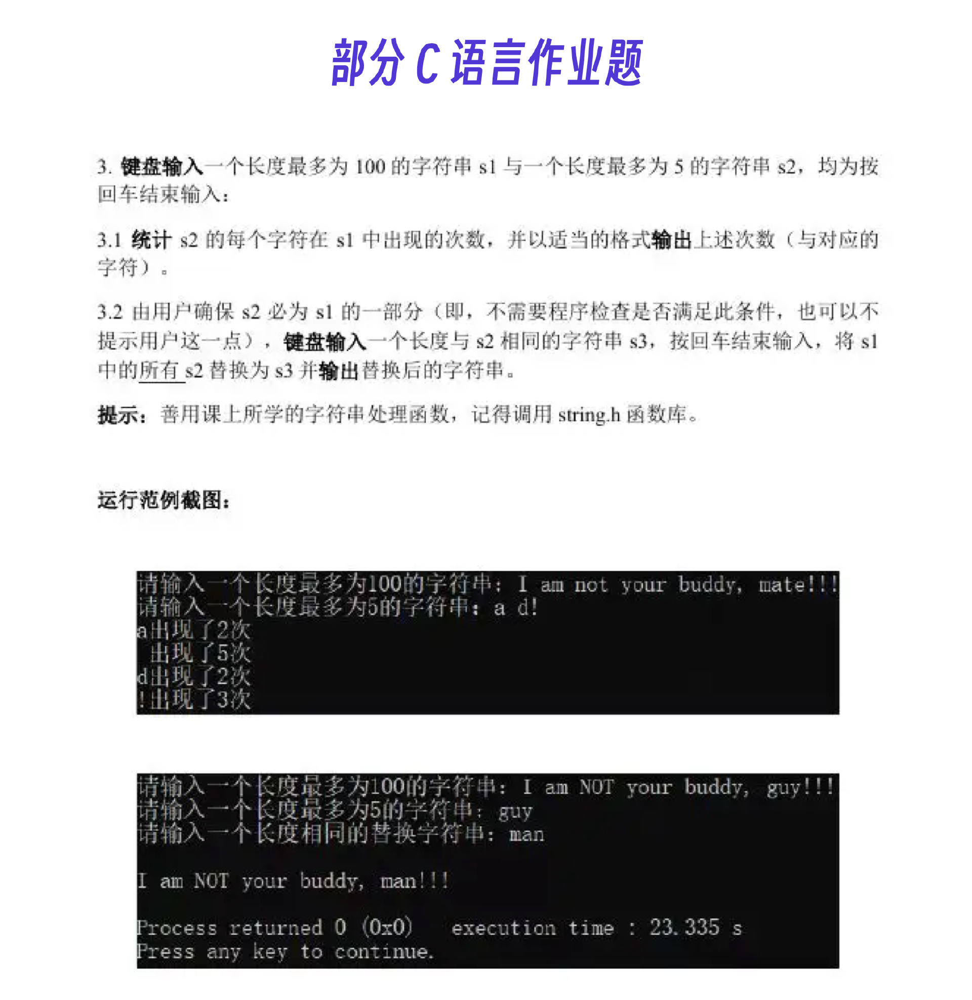

简单分析一下。首先，每次作业可能有多道题，每道题又可能有多个小题，例如上面的题目 3。但是，我们发现，一道题对应一个学生的 C 语言程序，我们只要处理好这个基本单元就可以了。

好，经过单个题目的分析，我们可以整理出两个需要解决的问题。

C 程序最终是通过命令行运行来测评的，可以接收多个输入参数，这一步怎么自动化呢？学生答案的 C 程序输出是一个字符串，和老师答案的输出可能有文字表述的差别，显然不能用完全相等的逻辑来判断，如何做到智能化判断？

而且，如果再观察其他题目，还可以发现一些特例需要处理。我来举两个例子。

**特例 1：**某些题目的输入涉及随机数，在自动判题系统里如何处理？

例如：

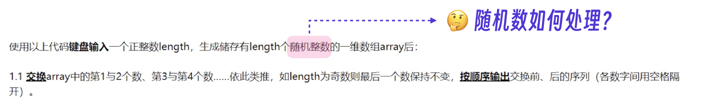

特例 2：某些题目的输出涉及用字符组成某种图形，AI 能否准确判断？

例如：

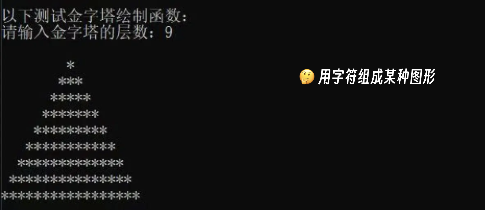

另外还有来自老师经验的一些问题，比如一些常见的、无关紧要的错误能不能自动帮学生修复？学生之间抄作业的情况如何智能判断？

总结起来，**这些问题都是****在****原有判题流程通过人工解决的，现在需要进一步考虑大模型能否解决****它们****。**

下面是一个经过整理的需求列表。我把整个需求分为两大部分，其中题库部分需要解决整个题库的建设和标准设定，判题部分要在前者的标准上判定学生作业。

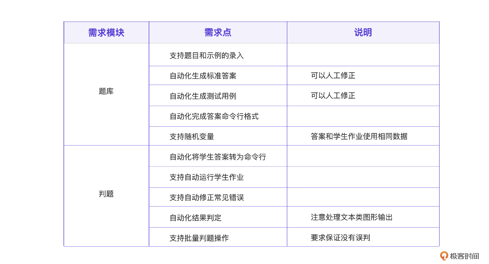

### 为什么要用大模型？

好，现在我们需要考量的是，是采用传统型应用结合 AI 的方案，还是 AI first 的应用方案？

可能你有点忘了这两个词是什么意思，我们简单[复习一下]()。传统应用结合 AI 的方案是对传统应用的升级，只是接入 AI 能力，其核心还是传统应用，而 AI first 应用则完全采用了 AI 人机交互模式。

假设用 AI first 的思路怎么设计？很多人可能会想，用 AI 完成整个判题过程，在提示词里输入题干、例子、学生答案，要求 AI 判断、评分就行。如果这样实现，是不是就可以完全自动化？太爽了！

比如：

```
你是一个C语言判题系统，我将给你题干，输出例子，已经学生的答案，请你判断学生答案的对错，并给出评分。
题干 ...
答案 ...
```

我们想想，结果会如何呢？如果你用大模型写过程序就能感受到，大模型写代码并不可靠，时刻都需要人类程序员监督和测试。对于当前的判题任务，如果实测会发现大模型幻觉问题不小。而显然老师判题是一个比较严肃的场景，大模型在要求可靠的场景下正确率还是太低了。

那假设采用传统应用模式呢？也就是以老师为中心，在某些环节接入 AI。那我们就要想了，接入使用 AI 是否必须？AI 合适解决哪些问题？不用 AI 好做吗？

在我们的场景里，如果把任务拆解得足够细，比如只让 AI 根据题干自动生成标准答案，AI 就能完成得很好。

```
根据我给的题干和输出例子，写出C语言程序，
题干如下：
"""
求以下几何量并使用标准输出语句打印出结果:
1.1 键盘输入圆的半径r1（double或float型），求圆的面积area；
...
"""
输出例子如下：
"""
请输入圆半径r1:10
题1.1的结果是:314.159000
"""
```

其对应的大模型结果如下。

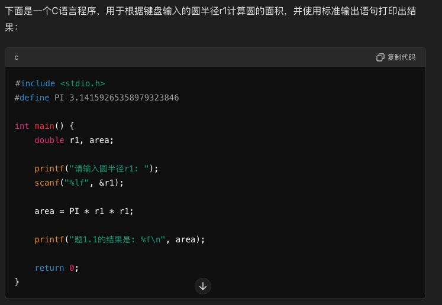

所以，接入 AI 是能解决一部分问题，提升效率的。

那基于以上的分析，决策哪些操作需要使用大模型就变得非常简单了。

我们把原有的人工操作流程都梳理出来，比如根据题干输出标准答案，根据标准答案整理测试用例，将学生答案改为可运行脚本, 根据标准输出对作业输出评分等。之后，再逐个分析这些操作过程，判断是否采用大模型优化效率即可。

当然，具体到某个操作，AI 代码和传统代码的比例，需要进一步细化设计。

## 程序设计

已经到这一步了，千万别着急直接上手写提示词。在 AI 只作为辅助的思路下做程序设计，我们要像刚才说的，**先梳理原有流程，再在每个步骤加入 AI 能力，同时保证系统完全兼容原有流程。**

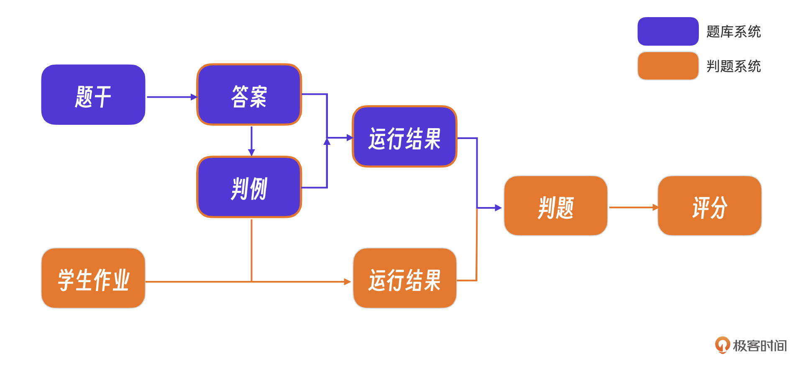

### 哪些部分用 AI 实现？

从流程图可以看到，软件分为两条线，分别是题库系统和判题系统。

其中，题库系统实现的是题库智能化编辑，判题系统解决学生作业判题需求。

**题库系统**部分，执行 C 语言程序这一步不适合用 AI 替代。不过，采用脚本直接编译和运行 C 语言程序，在 C 语言程序执行之前需要将 C 语言程序中 `scanf` 等用于人工输入的代码自动改为`argv`命令行输入模式，这个过程以及判例生成过程都可以尝试用 AI 替代。

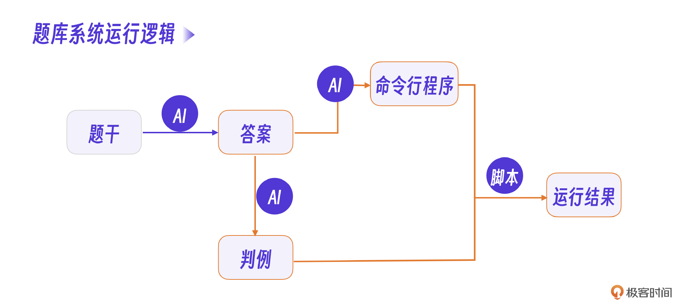

**判题系统**部分，同样需要将学生的 C 语言程序转化为命令行模式。当然，最核心的逻辑是判题操作是对比 AI 输出的答案和学生作业，这一步也可以用 AI 尝试解决。对于最终的学生评分，考虑到 AI 幻觉问题，就还是用人工综合分析结果，判断出错情况。

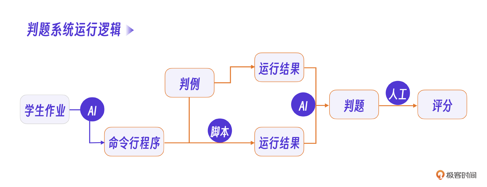

根据这个设计，可以发现，在每一个需要 AI 的节点都需要一个提示词，也就是我们需要整理出 5 个提示词，下一步，就是明确这些提示词的职责范围。

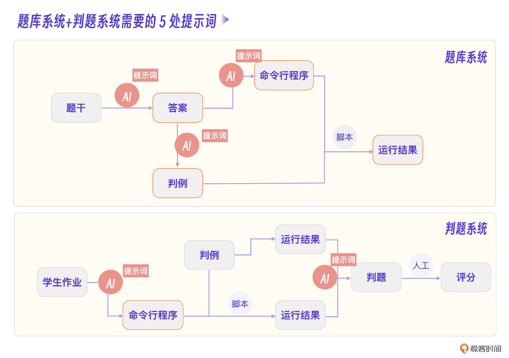

### 提示词的要求

我们把每个提示词理解为一个接口，对每个接口定义职责，考虑输入和输出参数，同时做出大模型要实现到什么程度的考量。这里我整理了一张图片，是每个提示词的具体要求，你看起来可能会理解得更好。

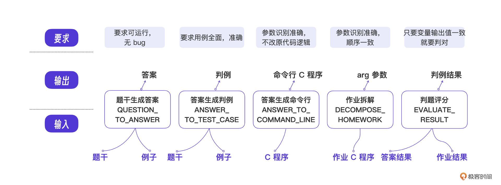

同时，我们还要对这些提示词开发过程可能产生的问题有一个预判。比如题干生成答案，那答案是不是可能有 bug？比如答案生成判例，那判例是不是可能还不如人写的？

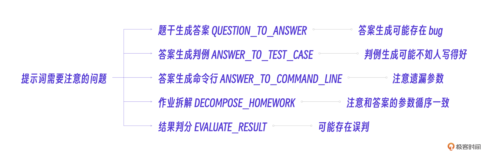

虽然看起来这种 AI 结合人工的模式似乎不够“聪明”，但其实老师更容易接受这种人机结合的流程，我们要做的，应该是**让 AI 成为老师的助手，让老师有可控的空间，而不要试图完全自动化。**

## 提示词工程

好了，终于要动手写提示词了。如果把提示词看做接口，写一个提示词就相当于接口开发，我这里不打算仅仅列出最终的提示词，也不全部细节的展示，而是挑出具有典型意义的几个经验来分享。如果需要完整提示词，可以[加入社群领取]()。

### 挑战 1：初步实现

首先，由于我们的提示词最终要嵌入到代码中，需要考虑兼容不同的输入内容。所以，与其说是提示词，不如说是提示词模版。这就需要用到一个重要的提示词技巧：用分隔符将单独的内容标注出来，让大模型可以识别哪部分是提示词指令，哪部分是变量内容。

比如我们用 `"""` 来标明引号内部的内容是题干。

```
"""
{题干}
"""
```

对一道具体的题目而言，我们只要替换好 `{题干}` 就可以得到完整的提示词了。

大模型的输出也可以设计得更精致一些。由于后续我们要用程序读取大模型输出并提取其中的内容，所以可以在提示词中指明输出的分隔符，便于后续程序处理。

```
$$$start$$$
C语言程序
$$$end$$$
```

类似我下方的这个 `QUESTION_TO_ANSWER` 提示词实现。正常情况下大模型会在输出的 C 语言程序前后加上 `$$$start$$$` 和 `$$$end$$$` 。

```
QUESTION_TO_ANSWER: """
根据我给的题干和输出例子，写出C语言程序，
题干如下：
\"\"\"
{题干}
\"\"\"
输出例子如下：
\"\"\"
{例子}
\"\"\"
"
注意C语言程序输出要有明确的分隔符，以便后续我提取，格式如下：
$$$start$$$
C语言程序
$$$end$$$
"""
```

答案生成判题提示词 `ANSWER_TO_COMMAND_LINE` 也用同样的方法实现。其他提示词也按输入输出要求做初步实现，我就不一一列举了。

```
ANSWER_TO_COMMAND_LINE: """
我在做一个判题系统，下面是答案的C语言程序，要求把输入变量的输入方式有键盘输入改为命令行接收输入
...
下面是答案C语言程序:
\"\"\"
{程序}
\"\"\"
注意C语言程序输出要有明确的分隔符，以便后续我提取，例如：
$$$start$$$
C语言程序
$$$end$$$
"""
```

### 挑战 2：多平台适配

其实在真实的提示词开发中，提示词往往需要适配不同的大模型的平台。很多人可能会认为一份提示词可以在各个大模型上运行，但是实际需要微调甚至重写提示词才能适配新的大模型。

比如我在 C 语言自动判题项目里的具体开发流程是先用 GPT 调试提示词，相当于程序开发调试阶段。我自己运行比较满意之后，再调用讯飞大模型接口做编程实现，这一步相当于程序开发的代码上线。

在 `QUESTION_TO_ANSWER` 提示词的输出部分，GPT 和讯飞大模型就出现了不一致的情况，很可能是讯飞模型训练阶段数据不一样导致的。

```
QUESTION_TO_ANSWER: """
...
注意C语言程序输出要有明确的分隔符，以便后续我提取，格式如下：
$$$start$$$
C语言程序
$$$end$$$
"""
```

比如这个提示词在 GPT 里运行效果可能是前后各 3 个 $。

```
$$$start$$$
...
$$$end$$$
```

但是讯飞里的运行效果却是前后各一个 $。

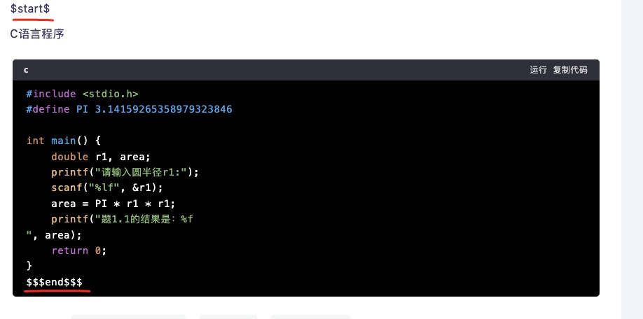

发现了吗？在讯飞模型下，开始和结尾的分隔符并没有对应上。最后怎么解决呢？我修改了提示词，**对分隔符做了专门的限定。**

```
...
注意C语言程序输出要有明确的分隔符，开始用'__start__', 结尾用'__end__', 以便后续我提取，格式如下：
__start__
C语言程序
__end__
```

修改完才让大模型完全“听话”。也就是说，如果把每个大模型看做一个“人”，你需要熟悉每个“人”的特性，并针对每个模型调整你的提示词。

### 挑战 3：成本考量

在真实的提示词开发中，另外一个重要的问题：成本考量，这也是很多人容易忽略的。

以我用于开发的讯飞大模型为例，平台显示我有几百万 token 用量，但是一旦程序运行起来可能你会发现几百万 token 其实是很小的配额，很快就不够用了。


在 C 语言自动判题系统中，使用最频繁的是判题提示词，一个学生的判题就要消耗了几千 token，100 个人一次判题消耗 20 万 token，还不排除需要重复判题的情况。


那如何尽量减少 token 消耗呢？从两个方面入手。

**其一是优化提示词，尽量让输入输出的大小可控**。比如 `DECOMPOSE_HOMEWORK` 提示词，原始版本里包含了题干和标准答案，最终发现只用学生答案效果也很好，因此可以删除题干和标准答案，至少节省了 50% 的 token 消耗。

**其二是在系统设计中使用缓存策略，避免不必要的大模型调用**。比如在我们的系统里，学生作业没有修改的情况下，作业对应的命令行版本内容就是固定的。不管执行几次判题，都不需要用大模型再次生成。类似的情况都可以用缓存策略，减少不必要的大模型 token 消耗。

### 挑战 4：幻觉问题

当然，在开发 C 语言自动判题系统中，最重要的仍然是提示词幻觉问题，我这里有几个典型的例子。

首先看一个在实际运行阶段其实处于废弃状态的提示词。它就是题库系统的判例生成 `ANSWER_TO_TEST_CASE` 提示词。

这个提示词是用来根据题干和答案自动生成程序测试用例的，事实上，最后运行时我放弃了这个用 AI 生成的方案，而是采用了参考 AI 生成的判例，大部分用人工修正的方案。

下面是完整的 `ANSWER_TO_TEST_CASE` 提示词。

```
ANSWER_TO_TEST_CASE: """
我在做一个判题系统，下面是答案的C语言程序和题目输出示例，要求你根据这个答案和示例信息，写出测试用例，测试用例个数要考虑程序难易程度，正常输入的用例多几个，边界值用例少一些，非必要的异常输入不设计用例，参数的个数请你多程序分析清楚，一般有几个scanf输入就是几个参数，只要按输入参数顺序给出具体数值即可，
因为用例是考察学生用的，需要考虑每一种用例的重要性，给出0-100的分值，全部用例总分是100，
下面是答案C语言程序:
\"\"\"
{程序}
\"\"\"
下面是输出示例:
\"\"\"
{例子}
\"\"\"
假设用例个数为m，程序参数个数为n，输出的格式如下：
start
用例1 用例1分值: 参数1 参数2 ... 参数n
用例2 用例2分值: 参数1 参数2 ... 参数n
用例3 用例3分值: 参数1 参数2 ... 参数n
... ...
用例m 用例m分值: 参数1 参数2 ... 参数n
end
其中，用例1-m分值是具体的数字，不需要中文
        """,
```

我们在实际运行中发现，AI 给的判例和人设计的差别较大，更严重的问题是对每个判例的分值权重评估不准。对 C 语言判题系统而言，每个题目适合的是不同的考察策略，没办法将详细的规则统一写入提示词，所以这个 AI 生成的判题最终仅做参考。

再说一个提示词，在之前的设计阶段，你有没有发现一个提示词叫作业拆解 `DECOMPOSE_HOMEWORK` ？

原本这一步的 AI 应该要完成学生作业 C 语言程序到命令行程序的转化。但是在学生作业场景下，大模型总是试图修改学生作业里的错误代码，而我们的要求是要保留学生作业的错误代码，最后妥协的设计就是 `DECOMPOSE_HOMEWORK`。它的作用是只让大模型去总结作业程序里的参数，判断参数顺序、参数类型等。

该提示词的关键信息如下。

```
DECOMPOSE_HOMEWORK: """
...
输出所有的参数名字和每个参数的argv,以及变量类型就行，下面例子的x,y,z就是学生作业里的输入参数变量名字，int表示整型,string表示字符串类型，float表示浮点型,例子：
"x": "argv[1],int",
"y": "argv[2],string"
"z": "argv[3],float"
输出是一个json串即可，不要任何额外说明和代码。
"""
```

你可以看到，当大模型把 C 语言程序的输入参数整理成这种格式之后，我们就可以通过写程序单独替换这些参数，这样就保留了学生的原始错误代码。

我从这个例子得到的经验是，**在逻辑严谨的场景下，可以多用大模型的总结能力，在逻辑宽松的场景下，才适合用大模型的生成能力。**

最后印象最深，也是修改最多就是 C 语言判题系统的核心判题提示词 `EVALUATE_RESULT`，其核心部分如下。

```
EVALUATE_RESULT: """
你的角色是一个判断学生作业的系统，你根据下面数据直接判断结果，不要写程序，
答案和学生作业输出的结果：
\"\"\"
{答案输出}
\"\"\"
...
判断原则是逐个用例里面进行，按用例1，用例2这样的顺序分别提取数据比对，用例1比对完再比对用例2，依次类推，比对学生作业的输出和正确输出，
....
输出要求包含的格式如下：
"用例1" : 
    "输入参数": "yy"
    "结果" : "正确" 或 "错误"
    "错误说明" : "xxx"
这里的xxx是你比对分析错误说明的具体内容,yy是用例的原始参数，也就是每次运行./a.out后面的命令行参数
输出用json格式，只要json输出不要任何额外分析说明,不要任何说明，我只要json格式的结果就行，后续要用程序读取
"""
```

上面的提示词是最终的版本，下面是一开始的版本。

```
EVALUATE_RESULT: """
你的角色是一个判断学生作业的系统，我给你提供题目的题干，答案，答案输出和学生作业输出，你根据这些判断
作业里每个用例的结果
题干...
答案和学生作业输出的结果：
\"\"\"
{答案输出}
\"\"\"
...
输出要求包含的格式如下：
"用例1" : 
    "输入参数": "yy"
    "结果" : "正确" 或 "错误"
    "错误说明" : "xxx"
这里的xxx是你比对分析错误说明的具体内容,yy是用例的原始参数，也就是每次运行./a.out后面的命令行参数
输出用json格式，只要json输出不要任何额外分析说明,不要任何说明，我只要json格式的结果就行，后续要用程序读取
"""
```

你可以对比这两个提示词，可以看到我一开始的思路是给大模型提供足够的信息，包括题干、答案等。

按常理来看，提供更全面的信息有助于大模型更好地解决问题，但是实际调试过程中，我第一版的提示词总是会出现一种“幻觉”，大模型总是以为我要让它按题干写出代码或者按作业的输出写出代码。

于是我尝试在提示词中间加入了很多限定规则，类似 `不要按题干输出代码`，`你只要根据结果判题，不要写代码` 之类的，可以减少一些出错的情况，但是没有完全避免。

最后，我干脆只让大模型处理答案输出和作业输出的比对，把更多提示词内容用来限定输出比对的规则，也就是最终的 `EVALUATE_RESULT` 提示词版本，反而运行效果比初始的版本好很多。

## 小结

本节课的 C 语言判题系统虽然看起来是一个小微的 AI 应用项目，但是它的实战性比很多 AI 创业项目要更强。首先它的需求是真实的，结果也真实提高了客户的效率，产生了具体的价值。就 AI 提升现有工作流效率这一点而言，我认为这正是未来 AI 应用最重要的价值点所在。

当然，除了业务上的启示，本项目案例更多地让我们了解到一个 AI 应用应该如何更好地和现有的业务配合。具体来说，就是**在核心提示词的打造上，要根据场景发挥大模型的创造能力，又要结合具体场景让大模型完成可靠的工作****。****不要试图完全实现一个流程的 AI 自动化，****相反地，****将 AI 设计嵌入到原有工作流中会更加顺利。**

下节课我们会进一步探讨 C 语言自动判题系统的用户界面以及控制逻辑部分，看看这些部分最终是如何结合 AI 提示词一起完成系统目标的。

## 思考题

在 C 语言自动判题系统中，老师提到学生有抄作业的情况，这种情况可以尝试用提示词解决吗？怎么解决？

欢迎你在留言区和我交流。如果觉得有所收获，也可以把课程分享给更多的朋友一起学习。我们下节课见！

[>> 戳此加入课程交流群]()

---
来源：极客时间
链接：https://time.geekbang.org/column/article/801597
日期：2026-05-12
