# 08｜起点：如何开发一个微信AI满足客户营销的需求？

你好，我是金伟。

从这节课开始，我来分享一个完整的营销 AI 项目。这个项目是 2023 年 4 月份开始的，我会把重点放在开发经验上，同时也会有一部分 AI 创业商业经验的反思。我敢保证，这一定是原汁原味的经验和教训。

这个营销 AI 项目的起点是什么呢？我们团队原来是做广告营销平台的，有一套基于用户、产品、标签库的多平台广告投放和多平台自动化客户营销系统。

这是我们团队原来提供的广告平台，营销平台的核心业务流程，你可以看看，理解项目背景。

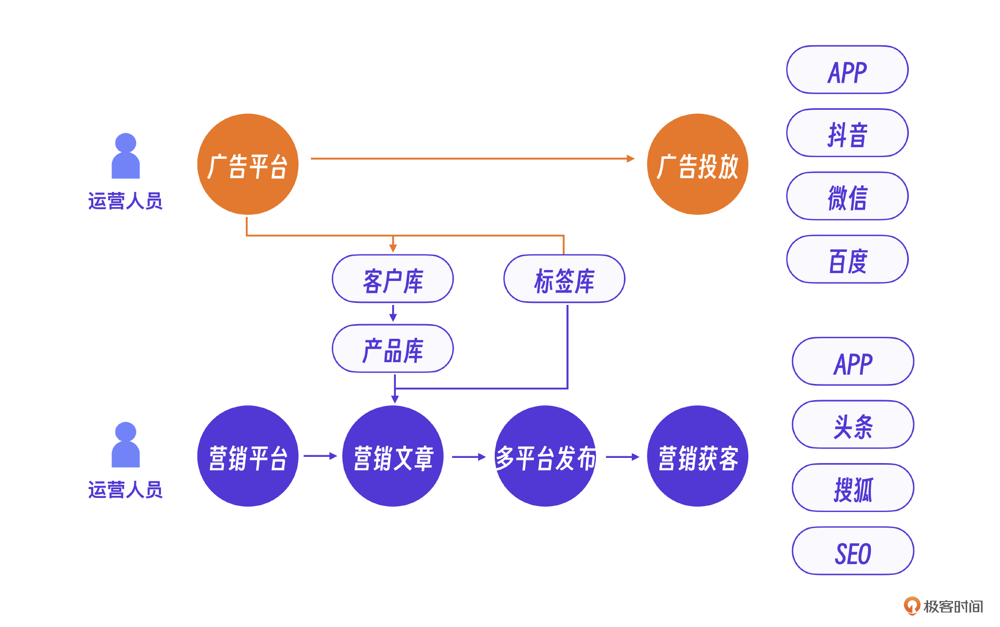

## 初识 AI

2023 年 4 月看到 AI 技术，立即意识到 AI 技术可能给我们这个行业带来颠覆性的改变，于是投身其中。

当时我们想，至少有两个产品方向可以借助微信 AI 这种模式。一个是企业营销知识服务，以企业自身的知识库为基础，营销平台或广告平台可以通过微信 AI 的形式高效地触达用户。另外一个方向是潜在客户的营销，基于平台现有客户库、潜在客户库，结合微信 AI 做老客户运营和新客户拓展。这个两个方向的核心，都是 AI+ 微信的结合。

### 传统营销的痛点

在初步的产品思路基础上，我们还需要进一步明确 AI 在营销平台具体的功能点有哪些。你可以和我一起从原来的广告平台和营销系统痛点出发来分析。

首先，在客户营销服务方面，用户体验和互动是广告和营销的重要环节，但传统手段难以实现个性化和实时响应，AI 聊天机器人可以**提供及时响应和个性化消息服务。**

其次，在营销和广告内容方面，原有营销内容的生成需要大量时间和人力。而生成式 AI 最擅长创意内容的生成，可以辅助生成和优化营销内容，**提高创意效率和内容质量**。

最后，在数据分析和精准投放方面，传统广告和营销做大量用户数据分析的时候效率低下，而且不够精准。AI 可以快速处理和分析海量数据，提供深度洞察和精准的用户画像，实现**高度精准的用户定位和广告投放**。

### 微信 AI 的设计

显然，这些痛点不能一次解决。其实我们的整个项目经历了微信群 AI 开发，多模态 AI 开发，基于 Agent 的营销 AI 和营销 Agent 平台开发这 4 个阶段。具体过程会在接下来的几节课里展开介绍，**这节课我们先从基础的 AI 结合微信交互开始。**

先看看原有的广告营销系统的交互，我摘取了部分功能，比如营销文章生成，多平台广告，数据分析，邮件营销工具等等。

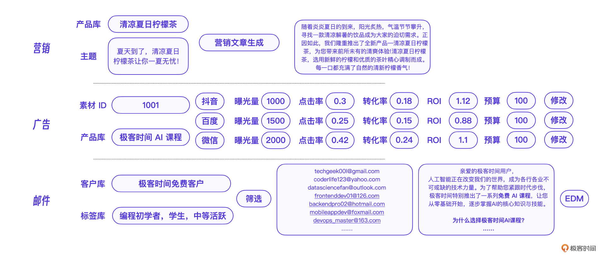

出于保密要求，注意下面是系统的示意图，不是真实的产品界面。

我们想的是这些功能都可以在微信的聊天界面中完成，下面是基于微信的 AI 界面交互设计。用微信 AI 聊天的形式实现这些功能，**本质上是通过大模型的上下文识别能力获得用户的输入，再调用后端能力实现具体功能**。从设计角度看，前端微信结合 AI 的交互更加灵活高效，后端接入 AI 则增强了营销系统的内核能力，整体上可以提升人机交互效率和系统运行效率。

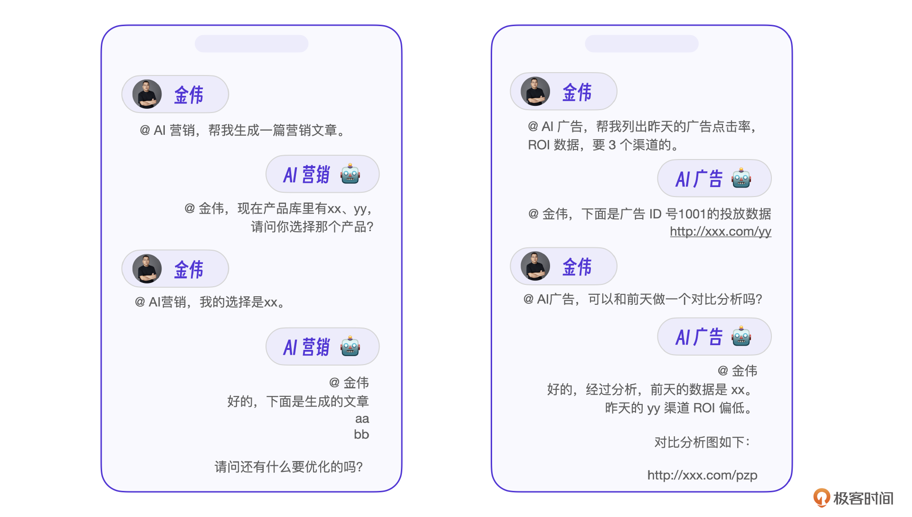

到这一步，只能算有了一个设计蓝图。

## 微信 AI 的实现

在设计上，我们考虑了未来的营销 AI 能力，具体实现上则开发了基础的文本聊天功能。这个基础版本的微信 AI 文本聊天功能是怎么实现的呢？

### 架构选型

要实现微信 AI 聊天功能需要解决两个问题。首先需要一个**支持** **RPA** **架构**（Robotic Process Automation，机器人流程自动化）**的微信机器人**，实现微信消息的代理收发，以及一些微信界面的自动化操作。其次，AI 软件需要对接大模型，实现对用户聊天的代理。

比如上述交互中的 `@AI广告` 这个消息前缀，目的就是让 RPA 机器人在群聊中识别到用户想调用 AI 能力，从而路由到对应的 AI 广告机器人，让机器人处理、回复这条消息。

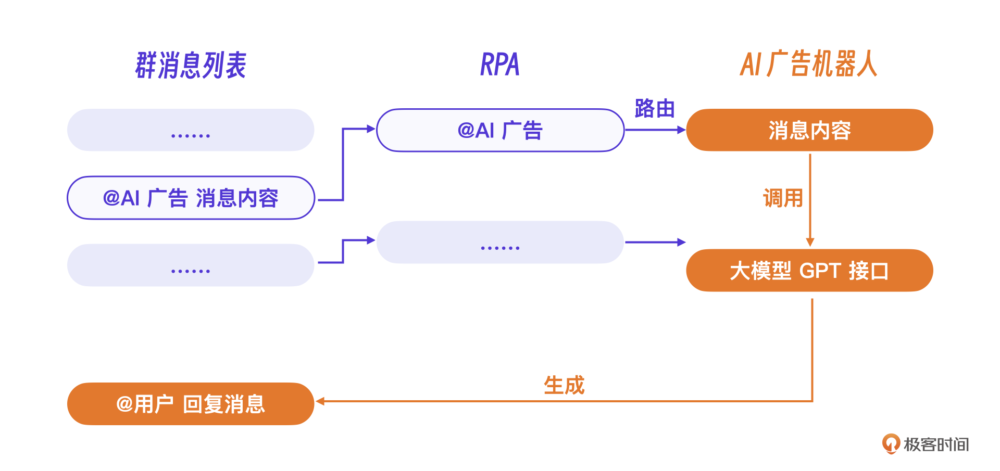

**我们选用****了****支持微信** **RPA** **的****P****ython** **库** **WXAuto****。**这个 Python 库支持所有的微信代理操作，比如搜索群名搜索、读取群列表、读取群消息列表、模拟按键操作等。

假设我们要 hook 的微信群名称是 “AI 营销体验群”，那只要组合这些微信代理操作就可以实现 RPA 的代理逻辑。

至于实现最终 AI 聊天的大模型，我们选择的是 GPT 接口，经过一定的完善，搭建了一个 AI 微信机器人架构。具体实现思路，就是当程序接收到新的 @AI 广告的消息内容后，AI 广告机器人程序调用 GPT 的接口获得回复，最后调用 RPA 把内容回复到群里并 @用户。

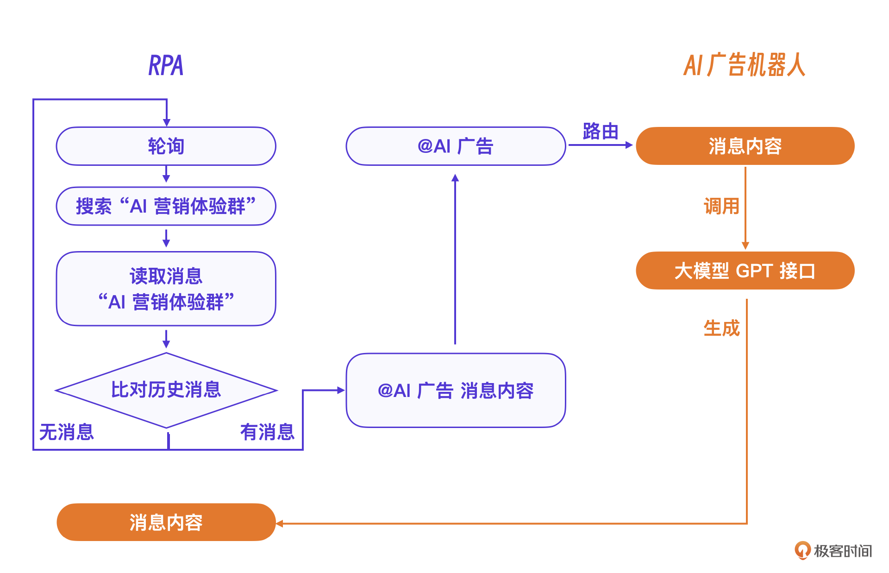

### GPT 开发对接

OpenAI 的对接开发相对容易，具体对接的时候需要先安装相应的 Python 库，并且在环境变量中设置你的 `OPENAI_API_KEY`。参考下面的代码：

```
pip install openai requests
export OPENAI_API_KEY=your_openai_api_key
```

假设用户在群里 `@AI广告` 机器人的消息是“请你写一则广告，主题是推广一款新的 AI 软件”，那么微信机器人实际上只是代理用户的这条消息发送给 GPT，等待 GPT 回复消息，再将其转发到群里。

也就是说，这里的一次 GPT 操作就是一个标准的 GPT 大模型接口调用。

```
import os
import requests
def get_chatgpt_response(prompt: str) -> str:
    api_key = os.getenv('OPENAI_API_KEY')  # 从环境变量中获取 API 密钥
    url = 'https://api.openai.com/v1/completions'  # OpenAI API 的端点
    headers = {
        'Authorization': f'Bearer {api_key}',  # 设置授权头
        'Content-Type': 'application/json'  # 设置内容类型
    }
    data = {
        'model': 'text-davinci-003',  # 使用 text-davinci-003 模型
        'prompt': prompt,  # 提供给模型的提示
        'max_tokens': 1500,  # 设置生成的最大 tokens 数
        'temperature': 0.7,  # 控制输出的随机性
        'n': 1,  # 返回一个结果
        'stop': None  # 可以设置停止标志
    }
    response = requests.post(url, headers=headers, json=data)  # 发送 POST 请求
    result = response.json()  # 获取 JSON 响应
    return result['choices'][0]['text'].strip()  # 提取并返回生成的文本
# 示例对话
prompt = """
请你写一则广告，主题是推广一款新的AI软件 
"""
# 调用函数
response = get_chatgpt_response(prompt)
print(response)  # 打印响应
```

GPT 接口调用的过程中有两个核心参数。一个是 `model：text-davinci-003`，它代表标准的 GPT3 大语言模型。另一个是 `prompt`，也就是本次大模型调用的提示词，在我们的场景里就是用户像机器人的提问 `请你写一则广告，主题是推广一款新的AI软件`。

**这里注意，****如果是单次操作这段代码并没有问题，但是要支持用户带历史消息的会话功能，则需要保存历史会话内容，并且每次的**** **`**prompt**`** 提示词都要带上整个历史消息。**

具体逻辑是每当用户给 `@AI广告` 机器人发送消息 `message` 时，都需要将这个消息增加到历史会话列表上，再对 GPT 发起请求，而从 GPT 得到的 `response` 也要立即加入历史会话列表。参考下面的示例：

```
... 
# 示例对话
conversation_history = """
User: 请你写一则广告，主题是推广一款新的AI软件
AI: 这是一款全新的AI操作软件
"""
#新增用户提问
add_user_message(message="注意软件的名字叫 智者AI")
conversation_history = """
User: 请你写一则广告，主题是推广一款新的AI软件
AI: 这是一款全新的AI操作软件
User: 注意软件的名字叫 智者AI
AI：
"""
# 调用函数
response = get_chatgpt_response(conversation_history)
print(response)  # 打印响应
#新增历史消息
add_response_to_history(response)
```

我们注意到代码中的 `conversation_history` 用 `User` 表示用户的消息，用 `AI` 表示 GPT 回复的消息。其实这个格式你可以自己定义，只要能表示出两个角色，GPT 就可以在它的引导下输出适合这个角色的消息。

真实的微信 AI 要实现一套用户消息存储系统，每次用户会话时只要重新组织这个 `conversation_history` 即可。参考下面一条新用户消息的流程示意图，会更好理解一些。

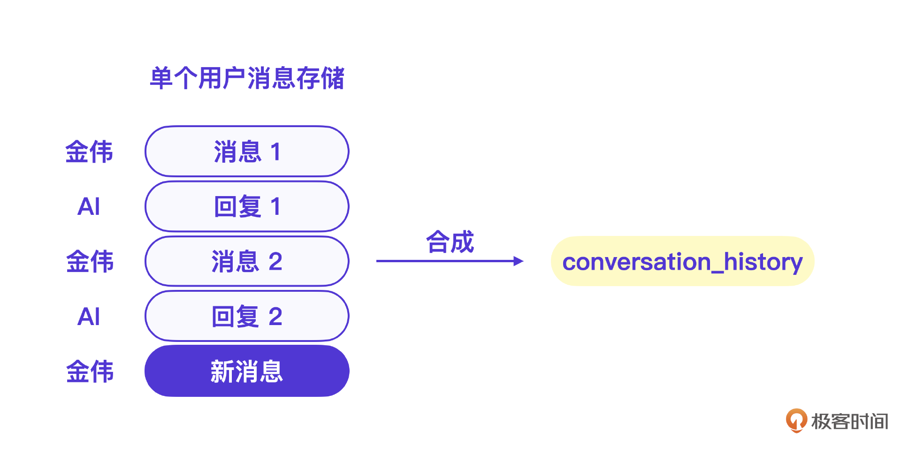

### 难点与挑战

看起来似乎一切很顺利，不过，在微信 AI 项目里，更多的难点和挑战其实在 RPA 操作的部分，下面重点说几个核心的经验。

### 挑战 1，轮询效率问题

由于 RPA 的基本原理是模拟界面操作，根据之前的流程，为了尽快的处理消息，即使群里完全没有新消息，RPA 也要定时轮询群消息。但是，一旦群的数量增加，这种轮询的效率会越来越低。这时候，**如何高效轮询，****如何****减少轮询的次数**，就成为了最关键的问题。

如果把挨个搜索群名称检查消息看做 V1 版本的话，我们在消息轮询这件事上还优化了两个版本。

先说 V2 版本的逻辑。为了减少不必要的搜索和群界面操作，我们利用了微信消息列表的一个特点：当某个群有新消息的时候，这个群会出现在消息列表的顶部。所以，**我们只需要读取消息列表，从****上****到下检查消息列表，直到遇到没有新消息的群则停止**。

而 V3 版本则在 V2 版本基础上更进一步。我们**将所有 AI 相关的群做了置顶操作，这样只需要读取最新的、有消息的 AI 群就可以了****。**在 V3 版逻辑下，如果轮询时段内没有消息，则只要读第一个群就停止了，如果有消息则正好读完有消息的群就停止，做到了性能和效率最大化。

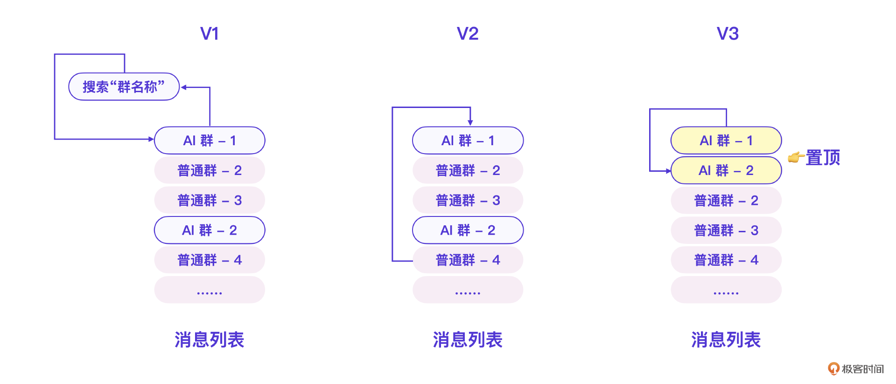

下面是 V3 版本的消息轮询机制核心代码。

```
for who in new_list:
        if new_msg_stop >= 1: #msg_stop数越大 漏消息越少
            _debug("msg stop", flush=True)
            break
        #init
        if who not in _old_list.keys():
            init2(who)
        #开始
        wx_cli.ChatWith(who)
        ##尝试获取消息
        try:
            messages = wx_cli.GetAllMessage[-last_count:]
        except Exception as e:
            continue
        ...
        ##过滤消息
        messages = wxmsg.filter(messages,filter_users)
        md5 = wxmsg.md5(messages)
        if md5 == _old_list_md5[who]:
            _debug("no msg", flush=True)
            #确认没有消息
            new_msg_stop = new_msg_stop + 1
            continue
       ....
```

### 挑战 2，消息可靠性问题

做过消息系统的朋友都知道，消息的可靠性是消息系统最重要的问题。换个角度看，这也是收发消息的完整性问题。既不能漏消息，不要重复发消息。

在微信 AI 这个项目里，我们通过 RPA 读取群消息列表完成了消息读取。其中最大的问题就是**微信消息列表不提供消息 ID 和时间戳，****这让从消息列表里分解出最新消息变得非常困难****。**

如果存储和比对整个消息列表，那对计算量和数据的要求都会过高。最终我们采用了一个折中的方案。我们注意到微信消息列表中一段时间的消息会有一个总的时间戳，它本身也是一条消息，**我们利用了这个时间戳消息，存储消息列表里最新时间戳之后的消息，并逐个比对，这样就得到了可靠的最新消息。**

同时，基于 V3 版本的群轮询机制，当程序重启之后，只需要关注有新消息的群即可。也就是说，当某个群有新消息时，将此刻消息列表做第一个版本的存储，后续就可以保证消息的可靠性了。你可以看下这张示意图理解一下。

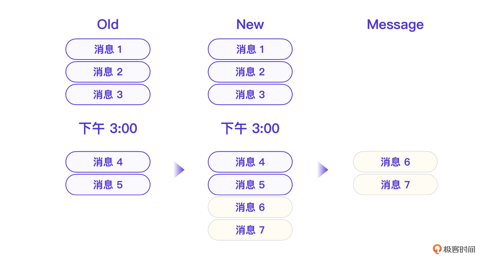

下面是用于消息排重的核心代码逻辑。

```
##过滤消息
messages = wxmsg.filter(messages,filter_users)
md5 = wxmsg.md5(messages)
if md5 == _old_list_md5[who]:
    _debug("no msg", flush=True)
    continue
##有新消息
new_messages = wxmsg.find_new(_his_list[who], messages)
_debug(new_messages, flush=True)
if False == new_messages:
    _debug("no new msg", flush=True)
    continue
        
#更新历史消息
_user_list = wxmsg.find_user(new_messages, _user_list, who)
_old_list[who] = messages
_old_list_count[who] = len(_old_list[who])
md5 = wxmsg.md5(_old_list[who])
_debug(md5, flush=True)
_old_list_md5[who] = md5
```

如果想要微信 AI 的 RPA 完整代码逻辑，可以加入[社群]()领取。

### 挑战 3，微信 RPA 稳定性问题

基于 RPA 的微信操作需要定期登录，这对运营来说是一定的挑战。我们的微信 AI 一直是企业内部试用和测试，所以问题不大。如果正式对外，应该用微信官方推荐的企业微信的接口。

### 自有模型训练

三个挑战解决了，但没想到的是，因为微信 AI 一推出消息量就暴增，基于成本考量，我们很快就抛弃了 GPT 付费版本的大模型，转而构建私有大模型。我们最终使用了开源的 ChatGLM-6B 模型版本。

很多人可能会说，ChatGLM-6B 参数大小才 60 亿，而 GPT-3 的参数量是 1750 亿，这么大的差距效果能一样吗？这就要**回到我们的营销场景**了。

实际上，普通营销内容场景对内容的输出没有特别高的要求，因此小参数量的大模型效果并不一定差。当然，要做到商用程度，我们还是在 ChatGLM-6B 做了很多工作。

我们基于 ChatGLM-6B 模型搭建的 AI 营销客户问答互动自动化系统已经完全够用。在工程实践上，一开始我们也采用了现有产品库信息来微调 ChatGLM-6B 模型，后期则将产品知识库数据输入到大模型 AI 中，让大模型在会话过程中学习产品知识库。

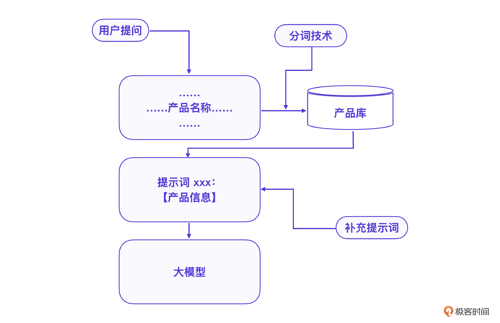

这是一个典型的在大模型会话中嵌入知识库的方法。很多企业知识库场景下，模型微调训练的效果往往不如在会话中嵌入知识库的方案。

经过微调的大模型，结合企业产品知识库的实战效果和 GPT 没有差别。我们以 **Neuralink** **脑机接口**这个产品为例，用同样的提示词分别在 GPT 和 ChatGLM-6B 上运行。

```
写一个简短的营销文章，目标是对科技爱好者宣传，字数不超过200字，中文输出，基于下面 的产品知识：
【Neuralink知识库】
```

下面是真实的大模型输出，你能看出来哪个是 GPT 生成的，哪个是 ChatGLM 生成的吗？

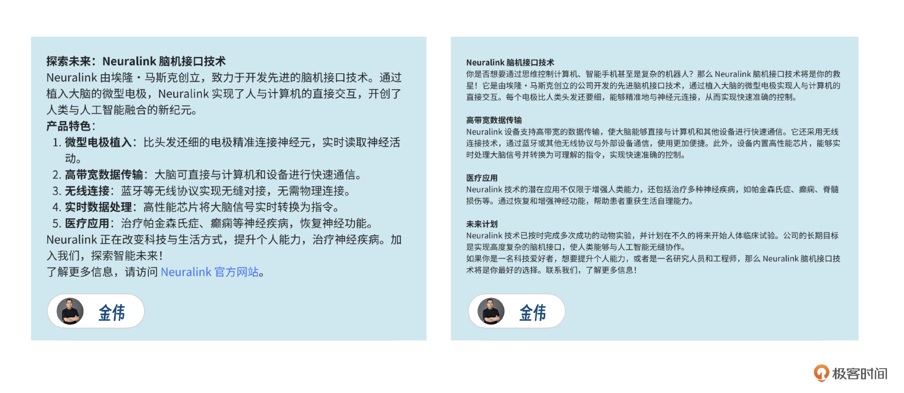

## 运营现状

到现在，我们的微信 AI 已经运营 1 年多了，目前的使用场景和一开始设想的已经完全不一样了。

可以说，微信 AI 在客户营销侧没有完全达到预期。这是一个典型的技术和应用场景出现偏差的案例。就算屏幕前的你是开发者，也一定要仔细理解，对于你思考手头项目的未来以及可靠性很有帮助。

回过头来看，我们的运营是一个循序渐进的过程，先运营了一个 demo 版本，仅仅包含 AI 聊天功能，然后发送给客户体验，一开始用户活跃度特别高，但渐渐冷清下来了，最后，客户完全不用了。

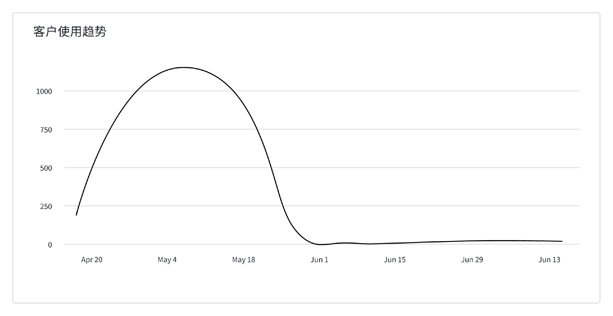

原本指望客户在营销场景使用，但客户却只是当做一个 AI 大模型在体验，可以说微信 AI 基础聊天功能在客户侧是失败的。

虽然外部用户没有推销成功，但令我们惊喜的是，内部使用中微信 AI 很欢迎。主要用户在运营部门。原来很多操作需要登录各个内部系统，最终这些操作都被我们集中到了微信 AI 里，实现了 10-20 倍的效率提升。

典型的操作有广告类数据报表、广告异常数据报警、企业知识库内部检索、AI 内部数据分析等。目前我们运营团队几乎所有日常操作都在微信 AI 上完成，这个结果可以说是无心插柳柳成荫。本以为场景在客户营销侧，最终发现真正有价值的在内部运营侧。

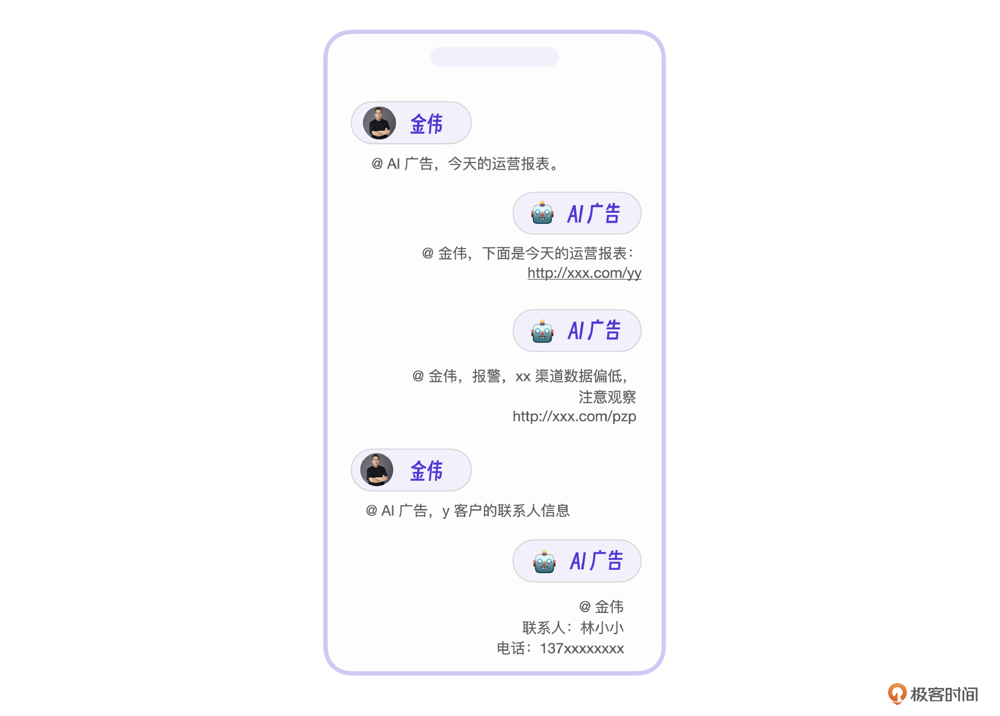

## 小结

我知道现在你一定产生了更多的疑问。 但是不要着急，我先来总结下这节课的内容。

作为一个做营销和广告平台的团队，第一次看到微信加 AI 这种交互模式的时候，眼前确实一亮。实际上我们也把微信 AI 作为团队在 AI 上第一次开发尝试，结果还是非常惊艳的，用户使用热情非常高，这也推动了我们团队对 AI 的持续学习和提升。

关于这节课的案例，我希望你能记住两点。一是对大模型能力的评估和掌握方面。从起初的 GPT 接口调用到后来的自有大模型训练和使用，至少在目前营销场景下，自研的小模型也有出色的表现，**你在选择模型的时候，也需要根据具体场景来考虑。**

其次是微信 AI 的具体技术实现上，回应用户的使用需求，在 RPA 基础上做了很多优化工作，包括**轮询效率的提升、消息稳定性的改进**等。这是这个案例里的技术价值，为后续开发继续使用微信 AI 交互提供了基础。

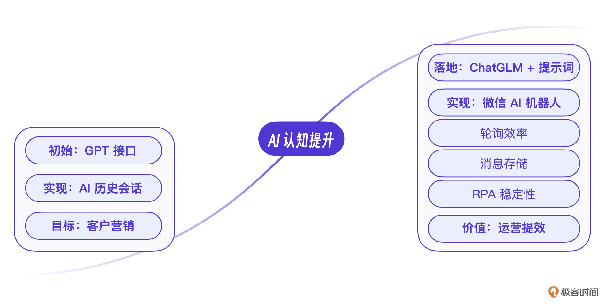

## 思考题

在自有模型训练这一节中，采用提示词中嵌入知识库的方案中，由于用户不是每次提问都带着产品名称，如果某次用户提问里没有包含产品名称，怎么让大模型仍然基于产品信息回答?

欢迎你在留言区和我交流。如果觉得有所收获，也可以把课程分享给更多的朋友一起学习。我们下节课见！

[>> 戳此加入课程交流群]()

---
来源：极客时间
链接：https://time.geekbang.org/column/article/802863
日期：2026-05-12
