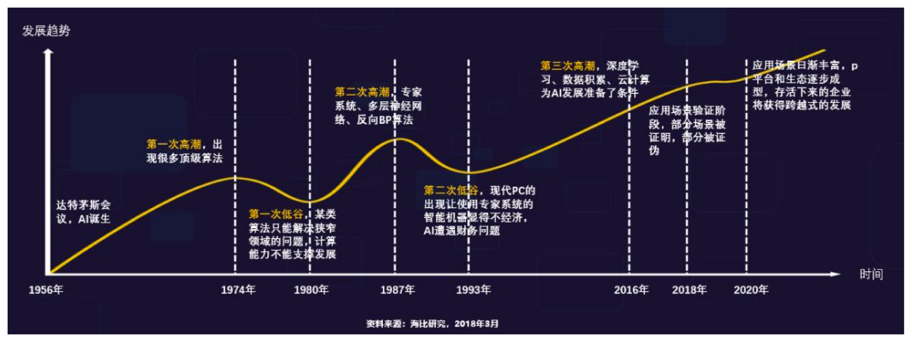
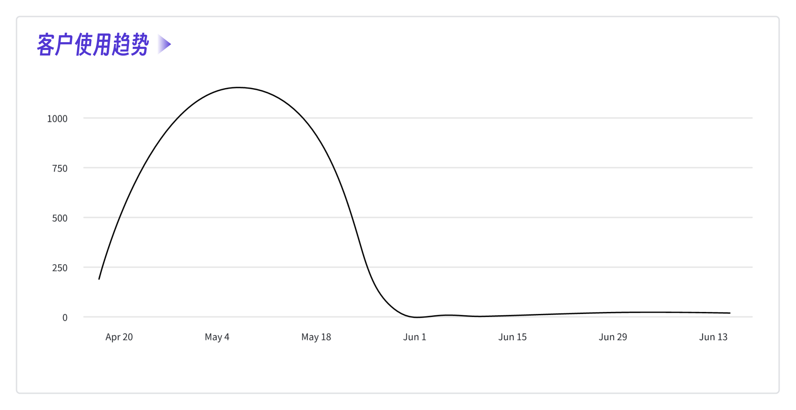
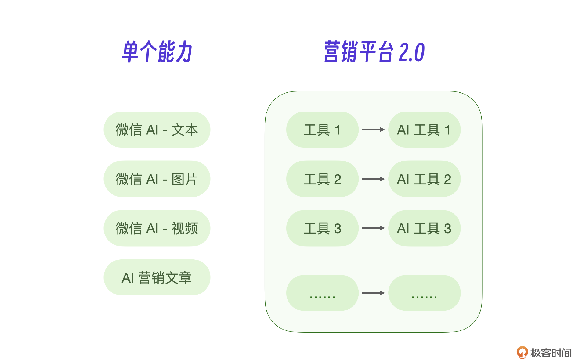
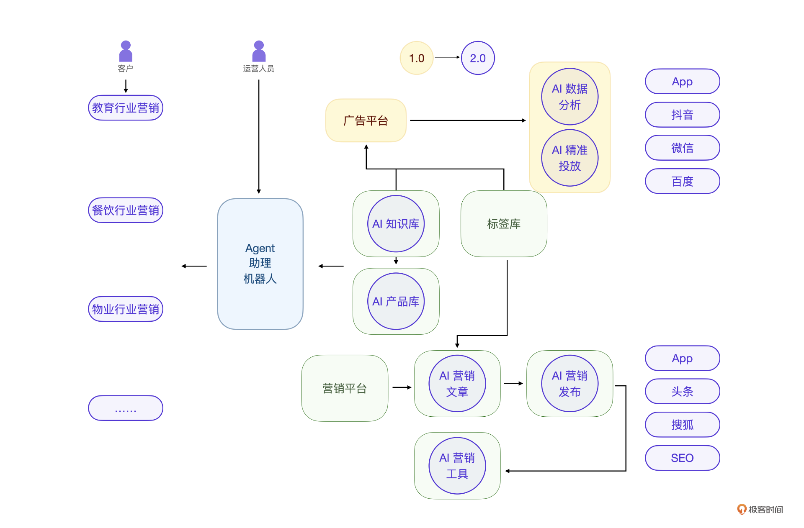
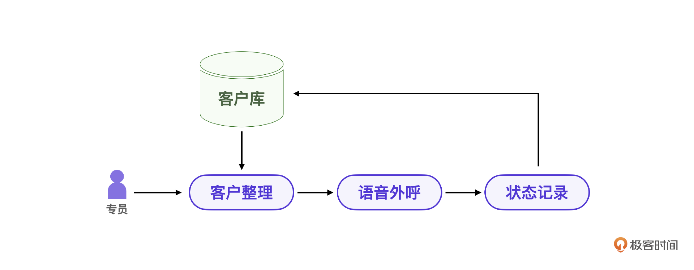
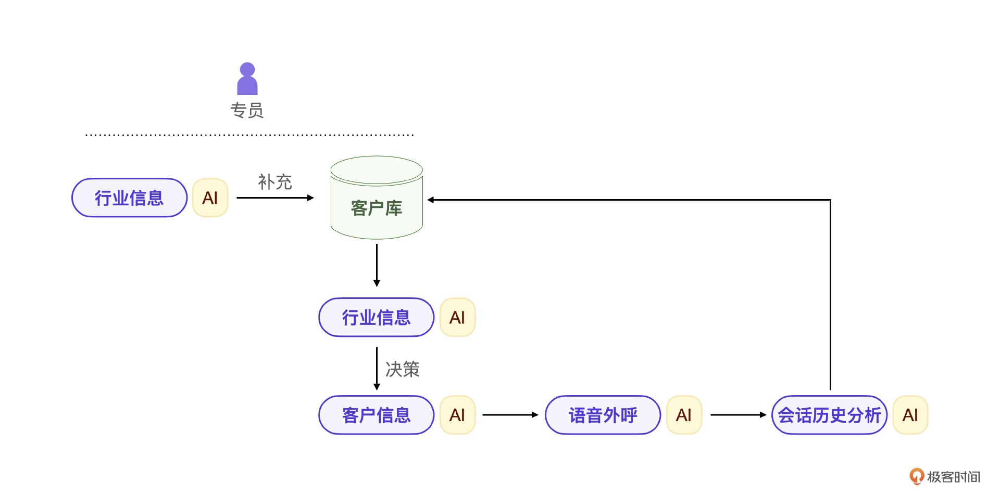
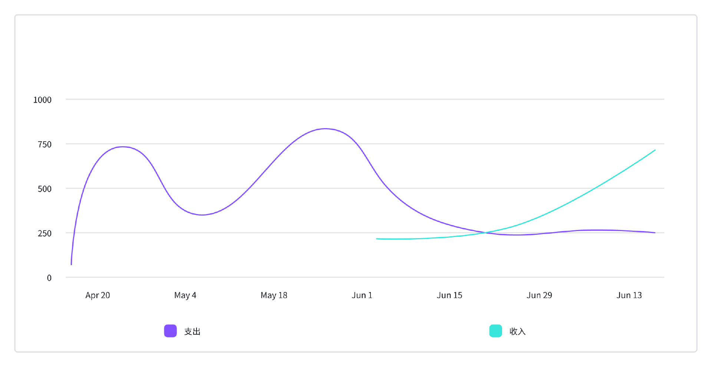

# 13｜回顾：一个营销AI项目里有哪些商业经验和教训

你好，我是金伟。

营销 AI 项目到目前为止已经一年多了，很多人可能会说，你这个项目又不是什么知名的 AI 成功案例，能有什么借鉴意义呢？

我倒不这么想。我认为，正是因为这个项目比较普通，才更符合大部分 AI 项目的经历，所以，这个项目的一些经验和教训也是值得分享的。

这节课，我会从团队的 AI 能力认知、项目的商业探索两个部分给出建议，最后用一个很小的商业案例来说明目前 AI 的价值点在哪，希望给你带来一定的启发。

## AI 初体验与团队进化

先来说说我们团队的变化。AI 大模型毕竟是一个新事物，不管是个人还是团队，对 AI 的认知都需要一个过程，从我们的经验看，**越早开始 AI 实战，收益肯定越大**。退一万步来说，整个团队对 AI 从无知到认识，先不管创新的 AI 产品是不是有价值，至少整个团队都 AI 化了，都用 AI 提升了效率，这也是未来产品成功的必要前提条件。

### 认知 1.0 大模型的边界

All IN AI 很容易冒进，过高地估计 AI 对行业颠覆的程度和速度，甚至团队目标定义过高。我们作为一个一直都在追逐智能化的团队，很自然地接上了这个风口。但因为目标过高，产品在落地期间不断修改，一年就烧掉了上百万的成本。

这里我想说的是，大模型的能力不是无边无界的，要利用大模型做颠覆性的产品也没有那么快。就像电力被发明出来之后 30-50 年才产生颠覆性创新，大模型这项技术虽然会快一些，但预计也需要 5-10 年。

如果把 AI 大模型看作一个新的智能体，那它现在仍然是一个不完备的智能体。我们讲过大模型应用的范式，从感知、决策、规划、执行四要素的角度拆分，四个能力上的“靠谱”程度实际上是越来越低的。大模型幻觉导致内容生成错误，推理和决策能力不达标，没有执行能力，领域知识不足，计算成本过高。所以仍然需要配合人工或传统程序一起工作。

### 认知 2.0 团队的定位

当初团队做的 AI 视频决策，就暴露了我们对 AI 认知的不足。当时我们只想到这是一个创新产品，没有意识到这个创新产品的技术难度。如果说我们团队的技术能力是 1，那这个项目要求的技术难度可能是 100。**根本原因是对大模型理解不够深，而且我们还在用传统的开发思维在做项目。**

**如果传统开发是用代码逻辑复制人类已有的逻辑，那大模型开发就是用数据让 AI 自主学习到这个逻辑。**

我们的开发思维还停留在用各种代码逻辑开发去实现视频的每一步，试图用程序逻辑来控制 AI 视频内容生成。在这种传统开发思维下，只会越走越远。而真正基于大模型的开发思维应该是从数据入手。比如 AI 视频项目，应该从现有视频入手，通过大模型的架构去训练数据，得到视频模型。

视频 AI 开发期间，已经有专家提出了这个战略上的问题，但我们团队仍然闷头继续开发，直到最终失败。

简单地套壳大模型很容易被大模型的更新替代，而要做大模型底层技术则需要大量的资金和人才密度。视频项目让我们团队认清了自己的团队定位。如果你的团队已经有成熟的业务模式，则应该考虑利用大模型改造现有业务，做应用创新，而不是大模型底层创新。如果你是个人开发者，我的建议是先从大模型微调开始，深入理解大模型技术，未来寻找领域场景。

### 价值点初探

你可能会想，半年的开发时间，几十万的成本，难道都是教训？没有一点价值吗？还真有。

在决定关闭产品的时候，我们发现虽然整个产品失败，但是运营内部还是想使用 AI 做数据分析、数据预警等等。

这个结果给了团队很大的启示：**AI 的真正价值点在于基于效率提升**。这也直接导致我们后来开发方向确定在营销 AI2.0 上，现在想想，这些失败的教训，反而让我们找到了一条更正确的道路。

接下来，我结合我们的商业探索过程来说一说这个问题。

## 商业探索与价值成型

我们这个团队在一年时间里开发了微信 AI，视频 AI，小程序，Agent，Agent 平台，营销 AI 2.0，看起来好像什么火就做什么，那这种情况到底是没有主见地乱撞还是有规律地创新迭代呢？

### 客户 1.0 需求探索

之前的课程也提到，我们是一个非常有自研精神的团队，而且，我们的开发模式完全是不计成本、不计得失的方式。我们往往开发十个产品，留下一个有价值的，这个情况是常态。

在 AI 创新这件事上也一样，我们确定了 AI 营销这个大方向之后，根据以往的技术习惯，开始了不断地学习和模仿。比如微信 AI 的产品，我们在开发出来之后马上就开始推广试用，一开始每一个客户都会想要这个工具，但是最后使用的曲线可能都会下降，然后趋于平缓。

那为什么一开始有一个使用的高峰呢？因为客户需要的是体验 AI，但是体验 AI 是没价值的。我们现在回过头看看，2023-2024 年大部分套壳的项目都失败了，连成本都没有收回。

然后我们发现，核心是客户的付费习惯问题。用户只会为结果付费，而且必须有效率 / 数据的提升。这也是大模型厂商全部降价亏本推广的原因，比如讯飞大模型，去年一个注册用户还只是送 200 万 token，现在已经送 1 亿个 token 了。

那么我们这种提供服务和工具的产品应该怎么走呢？一定还是要继续尝试 AI，做出给客户带来结果的价值。

### 客户 2.0 产品定型

大多数 AI 创业者已经在路上狂奔了一年多，如果你现在去问很多的 AI 创业者，可能都会得到一个回复，那就是让你去找到适合 AI 的场景，在场景里看看能不能用 AI。

实际上，当我让营销 AI 这个项目的 CEO 总结成功经验时，他只说了四个字：**场景 AI**。

看起来似乎这个总结一点也不性感，但是这个项目又实实在在地开始有客户价值回馈了。

我再用一个小例子来说明这个结论。有一个创业者做的系统是用 AI 帮助医生读论文和写论文。因为这个创业者自身就是一个医疗行业从业者，既懂医生又懂 AI，才发现了这个价值点。这个系统能让医生实现 100 倍的效率提升，商业上也实现了百万级别的营收。

现在回到我们自己的开发方向上，经过半年的开发，我们回头才发现宝藏不就在原有的营销系统里吗？此时我们对 AI 的理解也足够了，定位也清晰了，正好 Agent 平台这种模式当时也在市场上出现了。

原来我们要做的就是把原有系统用 AI 重新写一遍，也就是我说的营销平台 2.0。

**重写的价值其实就是 AI 的价值。**客户需求是不变的，我们技术团队一直在营销自动化，标签结合广告系统，个性化广告等等很多方面探索。AI 让从前不可能实现的能力变为可能。就像那个医生，本身就是行业专家，同时又是 AI 专家，才有可能做出价值。

现在把这个过程剖析一下，也正是项目 CEO 所说的：**场景营销 AI**。

### 客户 3.0 价值成型

从客户的角度看，他根本不会在乎你的产品到底是用 AI 还是传统软件，因为我们的软件对他来说就是一个黑盒，他关心的是自身的价值。

我们原来提供的系统不单单是一个系统，而是提供技术 + 服务，AI 是什么呢？在我们看来，AI 只是提升技术 + 服务的效率，同时，AI 是一个客户和合作伙伴可以方便参与的低成本方式。

甚至到现在还有很多人不相信 AI 可以替代人。说真的，如果你想从事 AI 相关的产品和开发，一定要相信以下的 AI 哲学。

- AI 可以帮你低成本开发和传播。
- AI 可以提供高效率运营和服务。
- AI 完全可以替代大部分人工。

## 一个小案例

这三点你可以再仔细想想。现在，我想说一个具体的行业小案例，更好地说明产品和商业经验问题。

这是一个典型的外呼营销案例，我们先看看原来的业务流程。

在原有流程中，不管是客户数据整理，还是具体的外呼操作都是人工操作，虽然有效果，但是成本比较高。

通过我们团队 AI 化改造之后的外呼营销是什么流程呢？行业信息可以由 AI 整理，AI 还可以分析客户，完成语音外呼，分析会话历史。

关键是，AI 改造之后，业务上能拿到结果。只要有结果就是有价值的。这里面的 AI 并没有颠覆原有流程，只是替代了原有流程，提升了性能。

为什么这个项目在 AI 大模型出现之前没有进化呢？因为 AI 大模型从技术上让 AI 完全替代人成为可能。为什么这个项目的客户最终愿意为此付费呢？因为最终在结果没有变化的情况下，效率提升了上百倍。

## 成本与收入

好了，最后说说这个项目的成本和收入情况吧。我是在 2024 年 7 月写的这节课，这个时候，项目已经开始有收入回流了，这也是我坚信 AI 一定有价值的原因。

当然，这个项目还不能说成功，所以，所谓的总结成功经验是很难的。如果一定要总结的话，我想从一个客户获取的切面来说起。

我在之前的课程里也透露了一些项目的真实截图，实际上，我们做的营销系统要全面和完整得多，而恰恰是这一点给我们在竞争中加分了。真实客户案例中，首先客户对 AI 有一定的认知，其次客户对营销有强烈的需求。应用 AI 技术结合运营，做到整体服务价值的输出。我们正是靠团队自身对 AI 的强认知和完整的产品能力才 PK 掉竞争对手的。

现在回来看，还是团队的自研精神救了自己，虽然前期投入的成本很高，走了很多弯路，到现在也没有成熟。**但是 AI 的价值目前来看就是软件的价值，效率的价值。AI 只是工具，效率才是真实的价值。**

## 小结

好了，总结一下。刚才说过了，我们营销 AI 的整个项目其实还不能算成功，因为成本还没完全收回，我目前也没有能力来对 AI 创业做总结，不过还是可以把一些创业过程的认知感悟的点列出来，个人 AI 创业或团队创业的同学可以参考。

- 相信 AI 可以完全替代人，但是人需要尽快学会和 AI 合作。
- AI 真正实现颠覆性创新还需要 5-10 年，要经历大模型创新 - 应用创新 - 产业创新这几个阶段。
- 不管个人还是团队，从自身业务或场景出发寻找 AI 效率提升是最快的路径。
- 真正的项目落地非常难，可以尝试先成为卖水和铲子的人，我们的项目就是偏技术 + 服务类型。
- 不管是 ToC 还是 ToB 的客户，只有 100 倍的效率提升，客户才愿意为 AI 付费。

## 思考题

做 AI 大模型创新创业，最重要的是从已有的场景也业务出发，你也可以结合之前的大模型知识想一想，自己身边有哪个业务是可以用大模型改造的？具体怎么做呢？

欢迎你在留言区和我交流。如果觉得有所收获，也可以把课程分享给更多的朋友一起学习。我们下节课见！

[>> 戳此加入课程交流群]()

---
来源：极客时间
链接：https://time.geekbang.org/column/article/805907
日期：2026-05-12
