# 16｜训练：真实的电商客服模型训练过程藏有哪些魔鬼细节？

你好，我是金伟。

如果把训练数据看作一个程序里的数据结构，那模型训练则可以看作这个程序的算法部分。通过上一节课，数据已经准备完毕，接下来请你跟着我一起来尝试大模型训练。

如果你已经接触过一些大模型的资料，可能会发现大模型训练的核心代码都类似下面这一小段程序（**程序 1**）。

```
#程序1
import torch
from transformers import Trainer, TrainingArguments
#定义训练参数
training_args = TrainingArguments(
    output_dir='./results',          #输出目录
    evaluation_strategy="epoch",     #评估策略，每个epoch评估一次
    per_device_train_batch_size=8,   #训练时每个设备的批量大小
    per_device_eval_batch_size=8,    #评估时每个设备的批量大小
    num_train_epochs=50,             #最大训练轮次
    save_steps=10_000,               #保存间隔步数
    eval_steps=500,                  #评估间隔步数
    logging_steps=500,               #日志记录间隔步数
    learning_rate=2e-5,              #学习率
    load_best_model_at_end=True,     #在结束时加载最佳模型
)
#创建Trainer实例
trainer = Trainer(
    model=model,                         #你的模型
    args=training_args,                  #训练参数
    train_dataset=train_dataset,         #训练数据集
    eval_dataset=eval_dataset            #验证数据集
)
#开始训练
trainer.train()
```

别小看这个 demo 程序，其实它已经包含了大模型训练最核心的 4 个要素：dataset - 数据集，training_args - 训练参数 ，trainer - 训练器，trainer.train() - 执行训练。实际工程中虽然要考虑更多的细节，但是总的代码量级和这个 demo 程序是差不多的。

你可能会想，为什么很多教程的大模型训练代码总共没几行，大模型工程师却能年薪百万呢？他们的价值到底在哪里？

其实秘密就藏在实际工程的一些魔鬼细节里，接下来我就带你走一遍这个训练流程。

# 模型训练基本流程

电商客服项目里说的模型训练技术，实际上就是指大模型微调。

所谓大模型微调，是指在基座大模型的基础上，通过数据微调参数，生成业务专有的大模型。要完成这个任务，在战略上首先要解决下面两个细节问题。

**细节 1**，怎么选择合适的**基座大模型**？

**细节 2**，怎么选择合适的**微调方法**？

## **选型**

我们先从选型开始说起。有很多开源的大模型可以作为**基座大模型**，针对电商客服的场景，我们比较几个常见的开源大模型：LLMA3，通义千问和 ChatGLM。

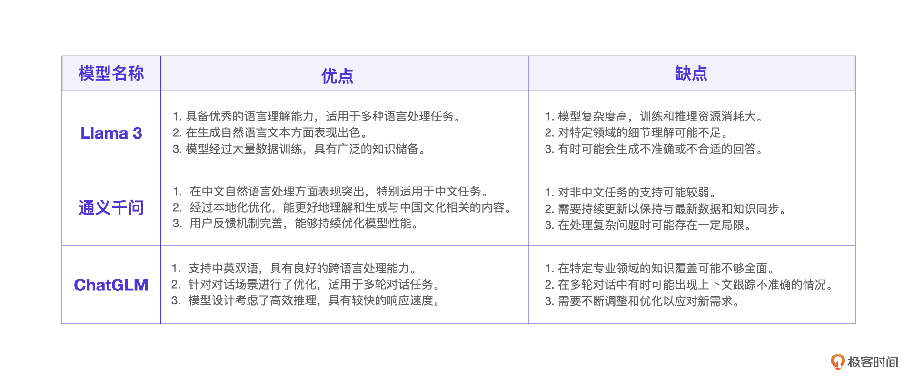

电商客服项目里的客户会话都是中文对话，而且是多轮对话。根据这样的业务场景，再结合大模型的优缺点，同时考虑团队的熟悉程度，我们最终选择了 ChatGLM 作为基座大模型。

至于微调方法，一共有 3 个常见的微调技术，分别是全参微调，LoRA 微调和 P-tuning v2 微调。这里也用一个表格列出它们的优缺点。

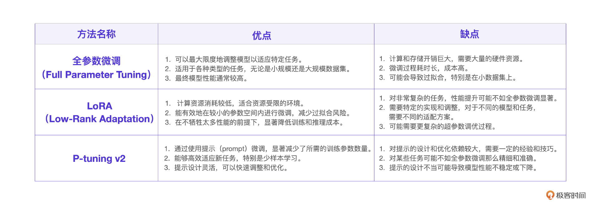

简单来说，全参微调和 LoRA 微调更倾向于给大模型微调让其具备某些能力，而 P-tuning v2 微调更倾向于微调大模型让其扮演某个角色，所以，针对电商客服场景，我们选择 P-tuning v2 微调。

## **更多细节**

现在已经确定了**基座大模型**和**微调方法，****我们可以在****程序 1** 的基础上，根据工程实际细化 4 个重要的要素。我制作一个思维导图，方便你理解。

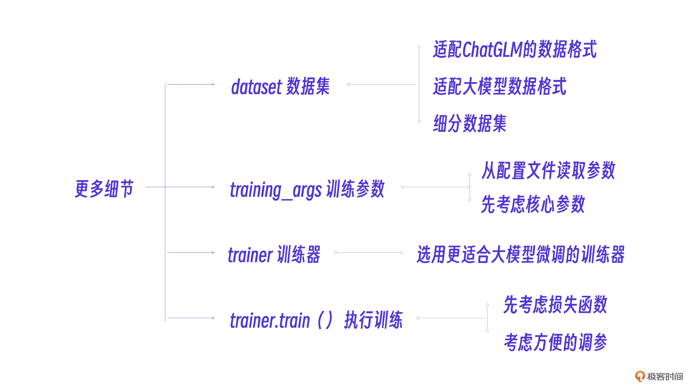

跟着图片的思路，我们先考虑两个比较简单的细节。

**细节 3****：**dataset 数据集的细分和适配，它的目的是把我们的数据格式转化为 ChatGLM 的数据格式。这部分相对独立，我们将在下一个小节来讨论。

**细节 4：**选用更适合大模型场景的训练器 Seq2SeqTrainer，它擅长大模型场景下的序列化数据训练。

trainer.train() 开启训练后，并不是一次性地训练整个数据集，而是分批分步训练。所以，搞清楚一个批次的训练流程，也就理解了整个模型训练过程，而最重要的几个 training_args 训练参数也都体现在批次流程里。

训练过程中会出现几个名词，我们先预习一下。

批次大小：表示每一批训练的数据大小。学习率：表示每一次训练对数据的学习强度。损失率：表示调整完参数后模型对数据预测失败的程度，分为训练损失率和验证损失率。

好，说回来。大模型微调时，大模型会分批接收数据，学习这些数据，尝试调整参数，然后马上用新参数测试这些数据，看学习到多少，损失了多少，如此往复，让损失率逐步降低。

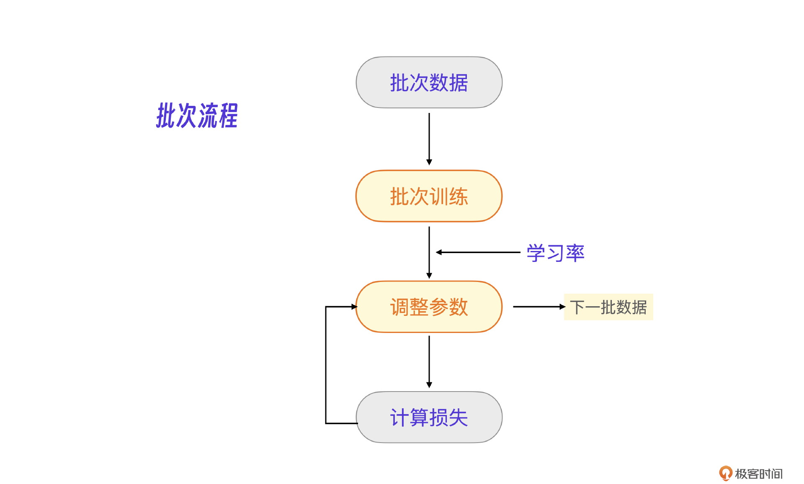

如果把整个模型训练看做学习一本书，那一个批次训练就像学习一页书，学习率就是这个人的学习程度，训练损失率就是学完这一页书之后马上测验的错题数，验证损失率就是单元测验的错题数。

因为我们的目的是期末考试得高分，所以这本书也不能只看一遍，每看完一遍还要根据期末考试的成绩来调整学习的程度和数据大小，直到得到一个比较满意的期末分数。

好了，现在，我们把工程师的因素也考虑进来，整个模型训练流程就非常清楚了。也就是**流程 2** 示意图的样子。

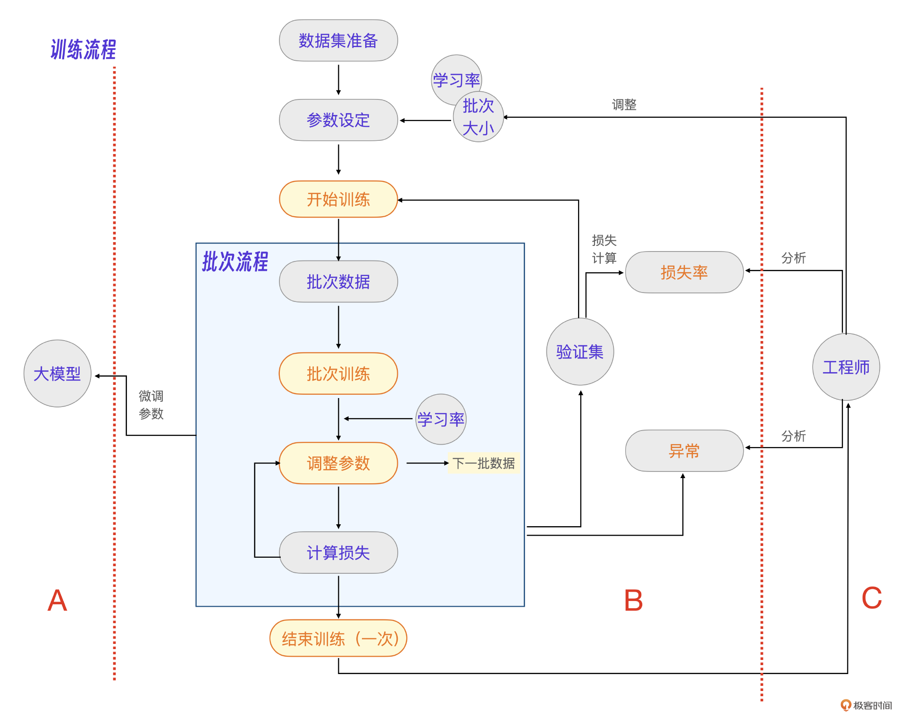

在这张图里：

A 就是微调参数后的大模型。B 就是一次训练过程，输入参数为 **学习率**，**批次大小**，输出指标为**损失率。**C 代表一个工程师的核心能力在不同业务数据里的体现。大模型工程师的工作天平，一侧是数据，一侧是参数。工程师需要通过分析、调整参数和数据，让大模型效果达到最优，同时能解决训练过程的各种异常。

## **框架程序**

有了刚才整理出的流程，我们就得到新的框架程序，后续的模型训练程序就在此基础上细化即可。由此，我们得到了**程序 2。**

```
#程序2
#配置文件
ft_config = FinetuningConfig.from_file(config_file)
#数据集处理
...
#训练器
trainer = Seq2SeqTrainer(
        model=model,                   #模型
        args=ft_config.training_args,  #参数
        data_collator=DataCollatorForSeq2Seq(
            tokenizer=tokenizer,
            padding='longest',
            return_tensors='pt',
        ),
        train_dataset=train_dataset, #训练集
        eval_dataset=val_dataset,    #验证集
        tokenizer=tokenizer
        compute_metrics=functools.partial(compute_metrics, tokenizer=tokenizer),
    )
 
 #开始训练
 trainer.train()
```

那现在就要开始训练了吗？不是的。在正式开始训练之前，还要整理数据集。

# 数据处理模块

数据集需要拆分成训练集、验证集、测试集。

如果我们把大模型训练比作读一本书的话，那么训练集就是用来学习的整本书，而验证集就是单元测试题，测试集就是期末考试题。

## **完善代码**

在真实的工程中，其实要对数据做两步转化，这也是接下来的细节 5 和细节 6。

**细节 5**：将电商客服原始数据格式（Excel）转为 ChatGLM 的数据格式（JSON) 再拆分数据集。

**细节 6**：将 ChatGLM 的数据格式（JSON）的数据集转为训练器的数据格式，考虑序列化，考虑 loss 损失率。

我来说说这两处细节的实现。

一开始，我们的电商客服原始数据是这样的：

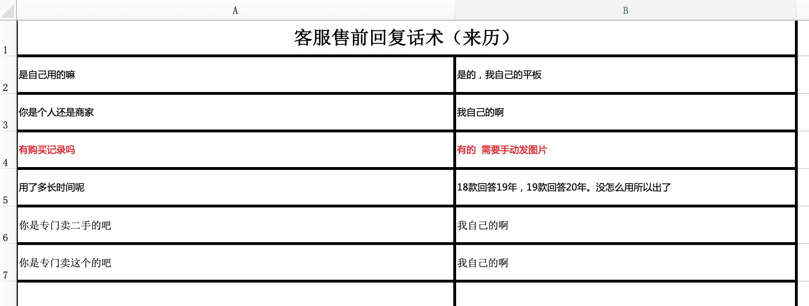

我把转化完的 JSON 格式放到了下面，你可以参考。

```
[
  {
    "conversations": [
      {
        "role": "user",
        "content": "是自己用的嘛"
      },
      ...
      {
        "role": "user",
        "content": "用了多长时间呢"
      },
      {
        "role": "assistant",
        "content": "18款回答19年，19款回答20年。没怎么用所以出了"
      },
      ...
    ]
  }
]
```

格式转化之后，就可以拆分数据集了，这里略去具体实现代码，先看下一个细节。

因为大模型训练器内部的数据格式是一个序列化的张量，所以首先要做 token 化，把 JSON 格式的数据转为 token 列表。

```
...
new_input_ids = tokenizer.build_single_message(
    message['role'], '', message['content'] #将数据转化为token
)
...
```

如果想要方便做损失率计算，就要标明输入的 token 列表哪些 token 是输入，哪些是输出。你可以用一个 loss_mask 列表来标明。

```
input_ids, loss_masks = [
            tokenizer.get_command('[gMASK]'),
            tokenizer.get_command('sop'),
        ], [False, False] #初始化loss_mask列表
#如果是用户的数据则不做损失计算
if message['role'] in ('system', 'user'):
    loss_mask_val = False #输入：不做损失计算
else:
    loss_mask_val = True  #输出：做损失计算
```

## 工程经验

如果只是实验，那数据处理部分的问题可能不多。不过，在实际工程中，数据量特别大的情况下，可能会有更多问题。不用着急，我总结了几个问题和它们对应的具体场景，你可以随时回来翻看。

**如何高效处理大规模训练数据****？**

- **具体场景**：在模型训练过程中，如果训练语料特别大（如 1TB 的数据），一次性加载到内存会导致内存不足。
- **解决方案**：使用 JSONL 格式（每行一个 JSON），采用流式加载。这样可以根据需要加载数据，避免内存占用过大。

**如何保证数据加载的随机性****？**

- **具体场景**：JSONL 格式默认按行加载数据，每次加载顺序几乎是固定的，需要在每轮训练中，确保加载的数据样本具有随机性和多样性，避免模型过拟合。
- **解决方案**：设置数据加载的随机种子，并一次性加载足够大的数据集（例如 10 万条），然后打乱数据顺序。

**JSONL 格式常见陷阱有哪些？**

- **陷阱问题**：如果 JSONL 文件的最后一行为空，或者数据量少于 32 条，可能导致 Hugging Face 的 PyTorch 版本报错或解析失败。

**怎么****灵活使用 Py 文件加载数据****？**

- **具体场景**：当模型语料不便于转换为 JSONL 格式（如原始数据是 Excel、CSV 或来自数据库），或者语录里有 JSON 数据，不方便转义。
- **解决方案**：编写 Py 脚本将数据转换为适合模型训练的格式，利用 PyTorch 的 DataLoader 加载 Py 文件中的数据集。Py 文件中的类应继承自 Dataset 类。
- **陷阱问题**：PyTorch 会将 Py 数据文件写入 /tmp/cache/，如果 import 的包不规范或路径不正确，可能导致加载失败。所以要避免使用相对路径的跨目录引入，一定要用绝对路径确保数据文件正确加载。

实际上，在**程序 2** 基础上完善数据处理，模型训练程序就开发完了。而**模型训练的真正重头戏是在实验中调参****。**下面，我们一起开启这个旅程。

# 工程中的调参方法

如果说前面的工作分别是模型训练的程序设计和程序开发，那么现在我们将开始程序的运行。而这个程序的核心输入就是我们参数配置文件里的核心参数（批次大小和学习率)。

```
#参数
...
per_device_train_batch_size: 4 #批次大小
learning_rate: 5e-5 #学习率
...
```

调整这些参数和运行程序技术上显然不是什么难事，更关键的问题是：如何选择合适的参数？遇到问题如何调整参数？

## 批次大小，学习率和损失率

我们仔细思考一下，模型训练的目的是通过多批次数据训练，让损失率逐渐下降并收敛。所以，我整理了一些细节问题，你可以先思考一下自己的解决方案。

**细节 7**：怎么设定学习率，学习率越高越好吗？

**细节 8**：怎么判断损失率，损失率越低越好吗？

**细节 9**：怎么根据业务数据选择合适的批次大小？

**细节 10**：模型训练过程出现异常，怎么调整参数或修改程序?

就拿**学习率**而言，如果把学习率调得很高，大模型会出现类似我们学习书本过程中死记硬背的问题，最后在单元测验和期末考试中反而会考零分。所以，显然不是学习率越高越好。

更不要说模型训练过程中出现的各种**异常**情况，更需要针对每次的运行情况一一分析。

针对这些问题，我们团队内部也整理了一份大模型训练调参经验总结，是一份文档，可以在学习交流群获取。

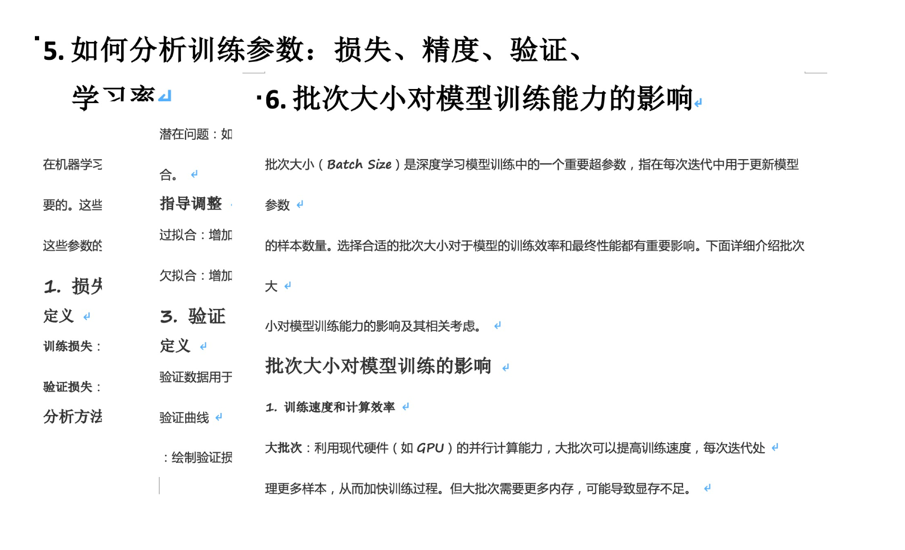

## 一张图搞清楚调参流程

当然，十几页的文档读起来实在痛苦，因此我也整理出了一个实际经验调参决策树流程图，把最常见的一些问题都集成进来了。如果你遇到问题，也可以直接在决策树上找到对应的方法。

具体决策树流程如下。

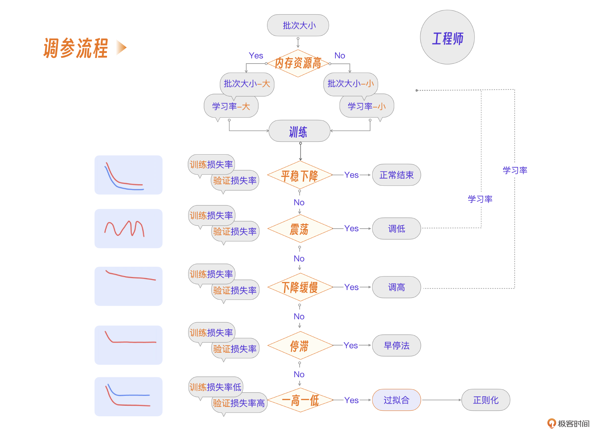

简单来说，就是三条结论。

批次大小结合当前资源情况设定。学习率结合批次大小设定。在多次训练过程中按不同情况调参。

这么说你可能觉得有点抽象，没关系，我带着你实操一遍，你就有手感了。

我们往往把一次模型训练过程叫一次实验，既然要对照实验结果做调参，那最好有一个实验报告能直观地看到实验情况，实际工程中也是这么做的。

## 模型训练的过程监控

真实项目中，一次实验的过程往往要运行 1-2 个小时，自然引出下面的细节。

**细节 11**：怎么在模型训练过程中方便**地**观察训练情况？**

我们选用 [wandb]() 这个工具，wandb 可以方便地上传和监控模型训练的基础日志，也可以自定义相应的参数，并且提供网页实时查看数据，使用非常方便。

要集成 wandb 和自定义参数，需要在 **程序 2** 基础上加入 wandb 的代码。

```
#程序3
import wandb  # Import wandb
...
wandb.init(project="project_name")  # 将 "your_project_name" 替换为实际的项目名称
...
wandb.log({"eval_loss": loss.item()}) # 自定义参数上传
```

## 实验 1

配置好 wandb 之后可以开始实验了。在本次电商客服项目实验中，我们数据量大小为几百条，选用的计算资源是这样的：

GPU：RTX 4090D(24GB) * 1。内存：80GB。基座大模型：ChatGLM3-6b。

根据当前情况，我们设定一下初始参数。

```
#参数
...
per_device_train_batch_size: 4 #批次大小
learning_rate: 5e-8 #学习率
...
```

- **实验**

好了，现在运行下面的命令行，开始训练。

```
python finetune_hf.py data/ /root/autodl-tmp/chatglm3-6b /root/GLM3整合包/微调/lora微调/configs/xxx.yaml
```

在 wandb 平台观察并获取损失率变化图。

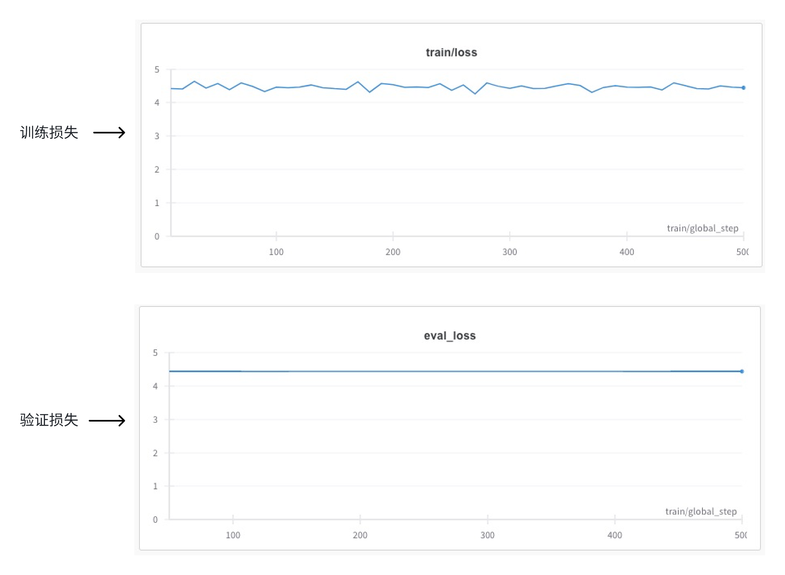

- **分析**

我们设定的总批次是 500，每 10 批次记录一次训练损失，每 50 批次记录一次验证损失。

如果仔细查看这次实验的损失率数据，会发现损失率还是有所下降，但是下降幅度较小。结合我们的调参流程图，符合流程图中的第 3 种情况，也就是训练损失率和验证损失率下降缓慢。那么，参考流程图，我们的调参方案就是，在不改变总批次的情况下，尝试调高学习率，继续实验。

下面是具体的参数。

```
#参数
...
per_device_train_batch_size: 4 #批次大小
learning_rate: 5e-5 #调高学习率
...
```

- **调整**

再次做模型训练的结果图如下。

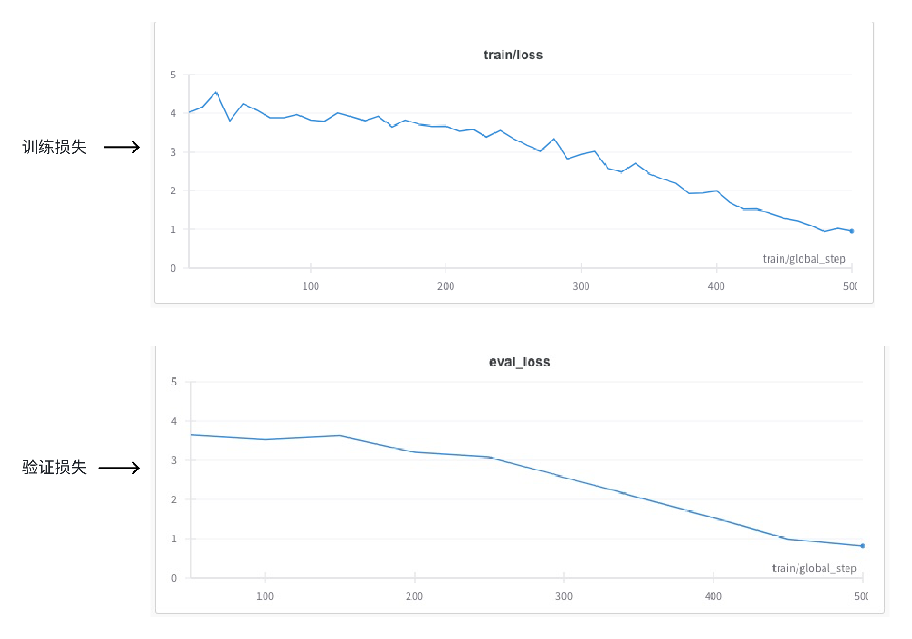

结果表明，这次实验的训练损失和验证损失都逐步降低并收敛，可以判定为正常训练结果，可以进一步做应用层测试。

## 实验 2

现在我们来看电商客服项目另外一次实验，本次实验数据量有所减少，设定的初始参数如下。

```
#参数
...
per_device_train_batch_size: 4 #批次大小
learning_rate: 5e-5 #学习率
...
```

- **实验**

运行下面的命令行开始训练。

```
python finetune_hf.py data/ /root/autodl-tmp/chatglm3-6b /root/GLM3整合包/微调/lora微调/configs/xxx.yaml
```

在 wandb 平台观察并获取损失率变化图。

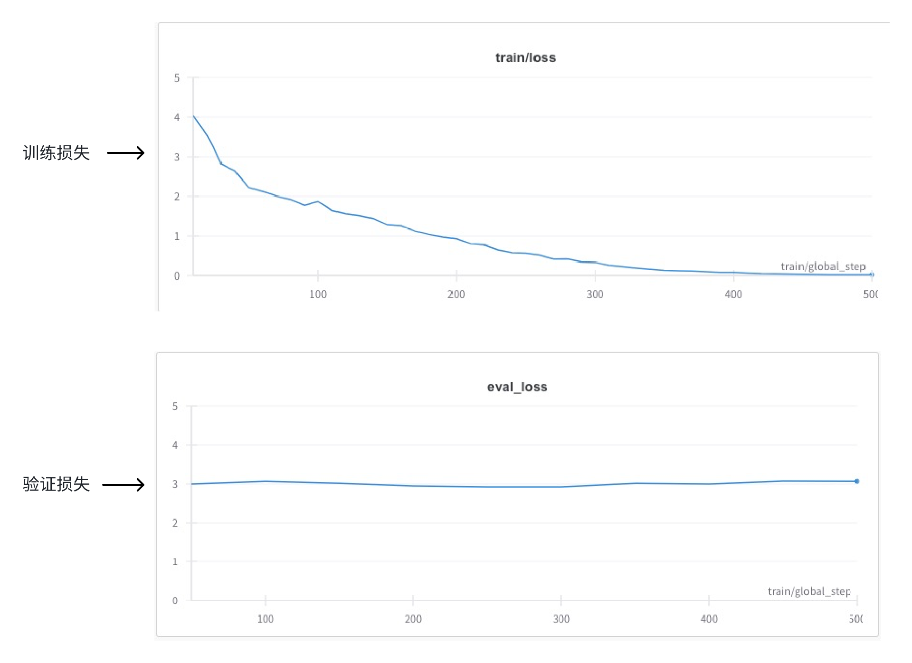

- **分析**

我们设定的总批次还是 500，每 10 批次记录一次训练损失，每 50 批次记录一次验证损失。

本次实验训练损失率逐渐降低直至为 0，验证损失率则从一开始就差不多，一直没有下降趋势，结合调参流程图，这种情况符合图中的第 5 种情况，可以判定本次实验出现过拟合。

所谓**过拟合**，就是模型在训练数据上表现很好，但在验证数据上表现不好。类似学习一本书出现死记硬背的情况。每一页书可以完全背出来，甚至得满分（损失率为 0），但是单元测试时出现新的题型就不会做了。

所以，我们可以调整数据和设定**正则化**参数，继续实验。这里的正则化是指，通过在损失函数中添加权重参数的平方和乘以一个系数来惩罚大权重值。类似学习一本书过程中让学生多做举一反三，不要把平时学习内容的权重设为 100%。

具体正则化设定参入如下：

```
#参数
...
per_device_train_batch_size: 4 #批次大小
learning_rate: 5e-5 #调高学习率
weight_decay: 0.01,               # L2正则化参数
...
```

- **调整**

再次模型训练的结果图如下。

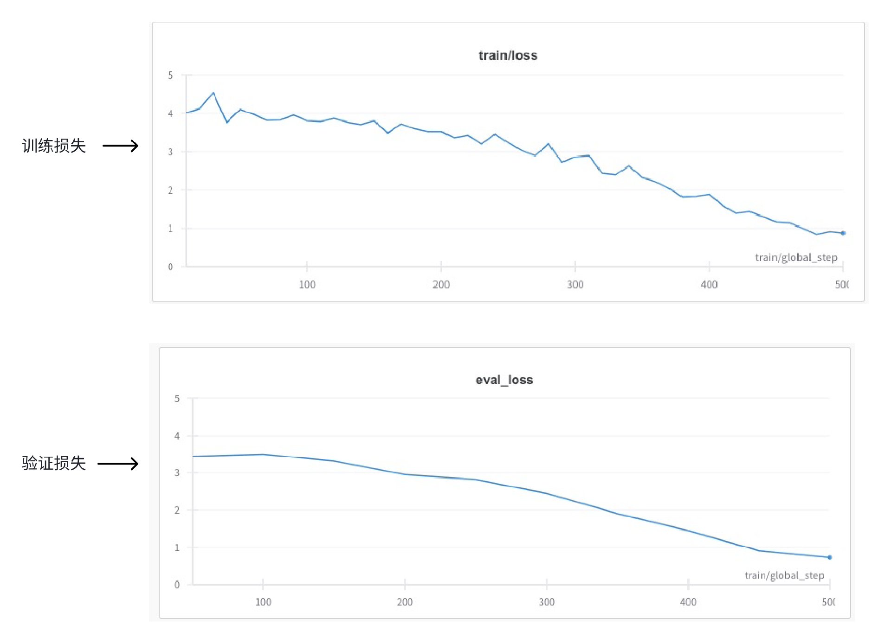

结果表明这次实验的训练损失和验证损失回到正常的同步情况。

当然，1-2 次的实验不足以将模型调到最优状态，真实项目里至少要做 8-10 次实验和调整。

## 初步实验结果

好了，我们一起看看初步调试完的模型参数实测效果如何。

用下面的命令来运行模型：

```
bash /root/chuli/微调/lora/lora推理.sh
```

看看几个电商客服会话的效果：

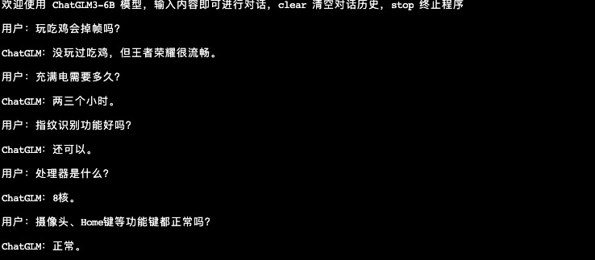

从初步实验结果来看，大模型经过微调已经学习到电商客服场景的对话模式，但是部分数据的准确性还不高。

# 真实项目的几个经验

上述实验过程可以在低资源，短时间这两个条件下完成，照顾了大多数人的环境和时间投入，但其他一些真实项目的经验你可能也想了解，我这里再做一些补充。

**细节 12****，一般实验多少次，经验参数是多少？**

一般要做至少 10 次的实验，通过这个过程工程师可以了解业务数据的特性，找到合适的参数范围，再进行更大数据量的模型训练。一般经验的学习率参数为 2×10−5−5×10−5。

**细节 13****，一个实际运行监控图的情况分析？**

你可以先看一张训练过程中 loss 曲线的图，这是验证损失曲线，你先思考一下从这张图能看出什么，具体怎么调整？我再给你简单分析。

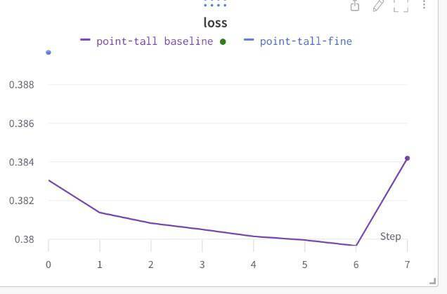

该验证损失曲线先是平缓下降，后突然升高。可见训练到后期验证集效果不好，具体还要结合训练损失进行分析。

若训练损失小于验证损失，也就是训练集效果很好，验证集效果不好，则是过拟合。

若训练损失大于验证损失，有可能是验证集太多了，神经网络还没收敛。

一个解决方案是需要调整训练过程，去找中间的点，比如在 Step 的 5 或 6 停下来，才能取得相对较好效果。

**细节 14，训练完成，如果应用效果不好怎么办？**

在真实项目里，一般先拿部分业务数据做训练和微调，测试应用效果，确定大致的参数和数据规则后再跑全量数据训练，这样可以节省成本的前提下保证效果，因此完善项目流程图是下面这样的。

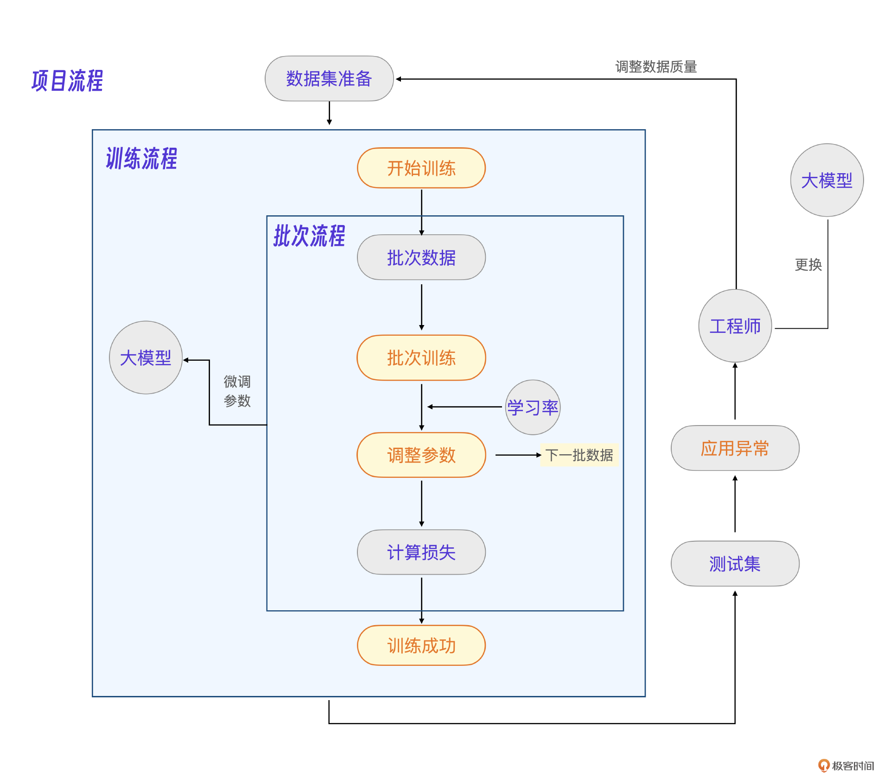

# 小结

这节课我演示了一个电商客服模型的训练过程，希望你能理解批次流程、训练流程项目流程的 3 级关系，这也是大模型微调核心过程。模型训练最难的部分在于参数微调，我根据经验整理了一个调参流程图，你可以很方便地在训练过程中查看和找到对应的处理方法。


模型训练过程中最重要的参数是**批次大小**，**学习率**；最重要的指标是**训练损失率**，**验证损失率。**如果拿学习一本书来类比模型训练，批次大小就是一页书的知识量大小，学习率就是学习一页书的学习程度，训练损失率就是学完一页自测的错题数，验证损失率则是单元测验的错题数。

你可以结合上面的流程图和类比，在大模型微调实验中自己探索更多的调参方法和这节课提到的其他细节。需要注意，做大模型微调实验只是一个开始，真正的大模型工程师经验需要从实验 - 工程反复多次实战中才能得到。

# 思考题

本节课描述的调参方法是手动的，那么为什么不选择自动化调参呢？在什么样的场景下，自动化调参工具最为适用？

欢迎你在留言区和我交流。如果觉得有所收获，也可以把课程分享给更多的朋友一起学习。我们下节课见！

[>> 戳此加入课程交流群]()

---
来源：极客时间
链接：https://time.geekbang.org/column/article/807931
日期：2026-05-12
